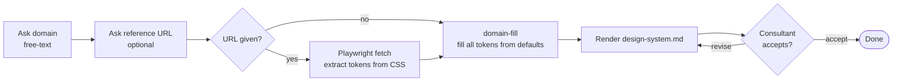

# Requirements Generator

## Contents

- [1. Overview](#1-overview)
- [2. Commands](#2-commands)
  - [2.1 `/requirements`](#21-requirements)
    - [2.1.1 Inputs](#211-inputs)
    - [2.1.2 Draft](#212-draft)
    - [2.1.3 Q&A](#213-qa)
    - [2.1.4 Final doc](#214-final-doc)
  - [2.2 `/design-system`](#22-design-system)
    - [2.2.1 Inputs](#221-inputs)
    - [2.2.2 Doc](#222-doc)
- [3. Dependencies](#3-dependencies)
  - [3.1 Claude Code](#31-claude-code)
  - [3.2 VS Code](#32-vs-code)
    - [3.2.1 Claude Code extension](#321-claude-code-extension)
  - [3.3 Node.js](#33-nodejs)
  - [3.4 Python](#34-python)
  - [3.5 git](#35-git)
  - [3.6 markitdown (requirements)](#36-markitdown-requirements)
  - [3.7 playwright (design system)](#37-playwright-design-system)

## 1. Overview

This repository hosts two consultant-driven pipelines that turn loose client material into structured artefacts. Each pipeline is invoked by its own slash command inside Claude Code:

- **`/requirements`** — turns whatever you have (briefs, decks, screenshots, diagrams, spreadsheets, PDFs) into a structured `requirements/requirements.md`. The orchestrator runs four agents in order — input-handler → drafter → resolver → merger — pausing for you at acceptance gates and at refusal predicates.
- **`/design-system`** — a stand-alone styler. You give it a domain (free-text descriptor) and an optional reference URL; it extracts brand tokens from the URL's CSS where possible, fills the rest from a domain-defaults file (when one happens to exist for the typed domain) or per-run inference, and writes `design-system/design-system.md` with provenance per token.

The two pipelines are isolated. `/design-system` does not read anything from `requirements/`, and `/requirements` does not read anything from `design-system/`.

## 2. Commands

### 2.1 `/requirements`

Run from the repo root inside Claude Code: `/requirements`.


#### 2.1.1 Inputs

Drop everything you want the agent to work from into `input/` before invoking the command. Supported tiers:

- **Native-text** — `.md`, `.txt`, `.drawio`, `.yml`, `.yaml`, `.xml`. Read directly.
- **Native-multimodal** — `.png`, `.jpg`, `.jpeg`, `.gif`, `.webp`. Read directly via Claude's vision.
- **Supported-via-MCP** — `.docx`, `.xlsx`, `.pptx`, `.pdf`. Converted to a sibling `*.converted.md` by markitdown before reading.
- **Unsupported** — anything else. Recorded in the source manifest for forensic record; not read.

It is fine to leave `input/` empty — the orchestrator will surface a one-message wait and let you add files before pressing enter.

#### 2.1.2 Draft

The drafter reads the source manifest and produces `requirements/requirements-draft.md` — a long, structured first cut of the requirements document. Items the drafter could not fill from the inputs are flagged inline with `[AI-SUGGESTED: AI-NNN]` markers, each carrying a candidate value for you to confirm, correct, or drop. You review the draft and either accept it or send it back for revision; the pipeline does not advance until you accept.

#### 2.1.3 Q&A

The resolver walks the draft's `[AI-SUGGESTED]` items one at a time, asking one sharp question per item via the in-thread Q&A prompt. You can answer each item directly, ask for a follow-up, or — at any point — tell the resolver to **accept all remaining suggestions** in bulk to fast-forward through the rest. Every answer is logged to `requirements/consultant-answers.md`.

#### 2.1.4 Final doc

The merger combines the draft and the Q&A answers into `requirements/requirements.md` — the merged, accepted, `[AI-SUGGESTED]`-free requirements document. You review the merged version and accept it; the pipeline marks itself complete in `framework/state/.progress.json`.

If you re-invoke `/requirements` later, the orchestrator detects prior progress and offers `continue` (resume from the first incomplete agent) or `start-fresh` (git-checkpoint the prior run, then wipe the four generated artefacts and start over).

### 2.2 `/design-system`

Run from the repo root inside Claude Code: `/design-system`. No `input/` files are needed — this command is stand-alone.



#### 2.2.1 Inputs

The styler asks you two questions in-thread:

1. **Domain** (required, free text). Type a short descriptor — e.g. `retail-banking`, `pet-grooming-marketplace`, `internal HR portal`. No picklist is presented. The styler then checks whether `framework/assets/domain-defaults/{{domain}}.md` exists for the value you typed; if it does, that file supplies deterministic defaults and `domain_source` is recorded as `curated`, otherwise `domain_source` is `free-text` and the styler infers defaults per run.
2. **Reference URL** (optional). With a URL, the styler resizes a Playwright browser to 1440×900, navigates, settles, and extracts colours, typography, and effects from the aggregated stylesheets and computed `:root`. Without a URL, every token is filled from the domain defaults.

If a prior `design-system/design-system.md` exists, the orchestrator first prompts `Overwrite` / `Keep` / `Cancel` so you do not clobber a previous run by accident. `Overwrite` git-checkpoints the prior artefact before deletion.

#### 2.2.2 Doc

The styler writes `design-system/design-system.md` — a complete design-system document covering 11 colour tokens, 15 typography tokens, and 7 effect tokens. The artefact contains:

- Frontmatter with provenance metadata (`domain`, `domain_source`, `extraction_status`, `extraction_method`).
- A human-readable Extraction Summary with Source Context and Provenance per token. Every token is marked `extracted-from-url` or `inferred-from-domain` — there is no third marker.
- Machine-readable Brand sections with the resolved token values.

You then review the artefact in the in-thread accept/revise/restart loop. On `Accept`, the orchestrator declares done.

## 3. Dependencies

Install once on the consultant's workstation. Versions below are the floors — newer is fine.

### 3.1 Claude Code

The harness everything runs under. Install from <https://claude.com/claude-code> and sign in. Slash commands (`/requirements`, `/design-system`) are picked up from `.claude/commands/` in this repo.

### 3.2 VS Code

Used as the editor while a pipeline is running. Install from <https://code.visualstudio.com/>.

#### 3.2.1 Claude Code extension

Install the **Claude Code** extension from the VS Code Marketplace. With the extension active you can launch Claude Code in a panel inside VS Code and run slash commands without leaving the editor.

### 3.3 Node.js

Required by the Playwright MCP server used by `/design-system` for site fetching. Install Node.js LTS (20.x or newer) from <https://nodejs.org/>. Verify with `node --version`.

### 3.4 Python

Required by the markitdown MCP server used by `/requirements` to convert Office and PDF inputs. Install Python 3.10 or newer from <https://www.python.org/>. Verify with `python --version`.

### 3.5 git

Used by both orchestrators to checkpoint prior runs before a reset (so nothing is lost when you choose `start-fresh` / `Overwrite`). Install from <https://git-scm.com/>. Verify with `git --version`.

### 3.6 markitdown (requirements)

`markitdown-mcp` converts `.docx`, `.xlsx`, `.pptx`, and `.pdf` inputs into Markdown that the requirements pipeline can read. Install once:

```
pip install markitdown-mcp==0.0.1a4
```

Restart Claude Code afterwards so the MCP server declared in `.mcp.json` is loaded. Setup verification and troubleshooting live in `framework/shared/setup-instructions/markitdown.md`.

If markitdown is not installed, `/requirements` still runs on `.md`, `.txt`, `.drawio`, `.yml`, `.yaml`, `.xml`, and standalone images. The input-handler surfaces a refusal (`RF-01 dependency_missing`) only when an Office or PDF input is actually present.

### 3.7 playwright (design system)

The Playwright MCP server lets `/design-system` resize a real browser to desktop, navigate to the reference URL, and extract computed styles plus aggregated stylesheets. Install once:

```
npx -y @playwright/mcp@latest --help
```

Restart Claude Code afterwards so the MCP server is registered. Setup verification and troubleshooting live in `framework/shared/setup-instructions/playwright.md`.

If Playwright is not installed and you supply a reference URL, the styler surfaces `RF-06` and offers a `WebFetch` fallback at degraded fidelity, or a clean exit while you install Playwright. With no reference URL, every token is filled from the domain defaults and Playwright is not needed.
