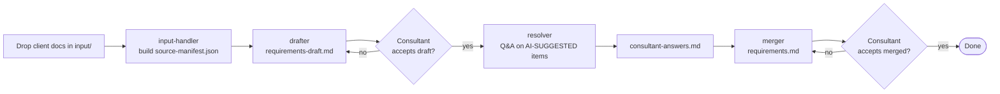

# Requirements Generator

## Contents

- [1. Overview](#1-overview)
- [2. Commands](#2-commands)
    - [2.1 `/requirements`](#21-requirements)
        - [2.1.1 Inputs](#211-inputs)
        - [2.1.2 Draft](#212-draft)
        - [2.1.3 Q&A](#213-qa)
        - [2.1.4 Final doc](#214-final-doc)
    - [2.2 `/design-system`](#22-design-system)
        - [2.2.1 Inputs](#221-inputs)
        - [2.2.2 Doc](#222-doc)
- [3. Dependencies](#3-dependencies)
    - [3.1 Claude Code](#31-claude-code)
    - [3.2 VS Code](#32-vs-code)
        - [3.2.1 Claude Code extension](#321-claude-code-extension)
    - [3.3 Node.js](#33-nodejs)
    - [3.4 Python](#34-python)
    - [3.5 git](#35-git)
    - [3.6 markitdown (requirements)](#36-markitdown-requirements)
    - [3.7 playwright (design system)](#37-playwright-design-system)

## 1. Overview

Two consultant-driven pipelines that turn loose client material into structured artefacts, each invoked via a slash command in Claude Code:

- **`/requirements`** — turns briefs, decks, screenshots, diagrams, spreadsheets, or PDFs into a structured `requirements/requirements.md`.
- **`/design-system`** — stand-alone styler. Given a domain (free-text) and an optional reference URL, it extracts brand tokens from the URL's CSS and writes `design-system/design-system.md`.

## 2. Commands

### 2.1 `/requirements`

Run from the repo root inside Claude Code: `/requirements`.



#### 2.1.1 Inputs

Drop everything to be processed into `input/` before invoking the command. Supported tiers:

- **Native-text** — `.md`, `.txt`, `.drawio`, `.yml`, `.yaml`, `.xml`. Read directly.
- **Native-multimodal** — `.png`, `.jpg`, `.jpeg`, `.gif`, `.webp`. Read via Claude's vision.
- **Supported-via-MCP** — `.docx`, `.xlsx`, `.pptx`, `.pdf`. Converted to a sibling `*.converted.md` by markitdown before reading.
- **Unsupported** — anything else. Recorded in the source manifest but not read.

`input/` may be empty — the orchestrator surfaces a one-message wait so you can add files before continuing.

#### 2.1.2 Draft

The drafter reads the source manifest and produces `requirements/requirements-draft.md`, a long structured first cut. Items it could not fill from the inputs are flagged inline as `[AI-SUGGESTED: AI-NNN]` with a candidate value to confirm, correct, or drop. The pipeline does not advance until you accept the draft.

#### 2.1.3 Q&A

The resolver walks each `[AI-SUGGESTED]` item, asking one sharp in-thread question. You can answer, follow up, or **accept all remaining suggestions** in bulk to fast-forward. Every answer is logged to `requirements/consultant-answers.md`.

#### 2.1.4 Final doc

The merger combines the draft and Q&A answers into `requirements/requirements.md` — the merged, `[AI-SUGGESTED]`-free document. On acceptance, the pipeline marks itself complete in `framework/state/.progress.json`.

Re-invoking `/requirements` later detects prior progress and offers `continue` (resume from the first incomplete agent) or `start-fresh` (git-checkpoint the prior run, then wipe the four generated artefacts).

### 2.2 `/design-system`

Run from the repo root inside Claude Code: `/design-system`. Stand-alone — no `input/` files needed.


#### 2.2.1 Inputs

Two in-thread questions:

1. **Domain** (required, free text) — e.g. `retail-banking`, `pet-grooming-marketplace`, `internal HR portal`. No picklist. If `framework/assets/domain-defaults/{{domain}}.md` exists for that value, it supplies deterministic defaults and `domain_source` is `curated`; otherwise `domain_source` is `free-text` and defaults are inferred per run.
2. **Reference URL** (optional). Given a URL, the styler resizes a Playwright browser to 1440×900, navigates, settles, and extracts colours, typography, and effects from aggregated stylesheets and computed `:root`. Without one, every token is filled from domain defaults.

If `design-system/design-system.md` already exists, the orchestrator first prompts `Overwrite` / `Keep` / `Cancel`. `Overwrite` git-checkpoints the prior artefact before deletion.

#### 2.2.2 Doc

The styler writes `design-system/design-system.md` covering 11 colour tokens, 15 typography tokens, and 7 effect tokens. The artefact contains:

- Frontmatter with provenance metadata (`domain`, `domain_source`, `extraction_status`, `extraction_method`).
- A human-readable Extraction Summary with Source Context and Provenance per token. Every token is marked `extracted-from-url` or `inferred-from-domain` — no third marker.
- Machine-readable Brand sections with the resolved token values.

Review in the in-thread accept/revise/restart loop. `Accept` marks done.

## 3. Dependencies

Install once on the consultant's workstation. Versions below are floors — newer is fine.

### 3.1 Claude Code

The harness everything runs under. Install from <https://claude.com/claude-code> and sign in. Slash commands (`/requirements`, `/design-system`) are picked up from `.claude/commands/` in this repo.

### 3.2 VS Code

Editor used while a pipeline runs. Install from <https://code.visualstudio.com/>.

#### 3.2.1 Claude Code extension

Install the **Claude Code** extension from the VS Code Marketplace to launch Claude Code in a panel and run slash commands without leaving the editor.

### 3.3 Node.js

Required by the Playwright MCP server (`/design-system`) for site fetching. Install Node.js LTS (20.x+) from <https://nodejs.org/>. Verify with `node --version`.

### 3.4 Python

Required by the markitdown MCP server (`/requirements`) to convert Office and PDF inputs. Install Python 3.10+ from <https://www.python.org/>. Verify with `python --version`.

### 3.5 git

Used by both orchestrators to checkpoint prior runs before a reset (`start-fresh` / `Overwrite`), so nothing is lost. Install from <https://git-scm.com/>. Verify with `git --version`.

### 3.6 markitdown (requirements)

`markitdown-mcp` converts `.docx`, `.xlsx`, `.pptx`, and `.pdf` inputs into Markdown for the requirements pipeline. Install once:

```
pip install markitdown-mcp==0.0.1a4
```

Restart Claude Code afterwards so the MCP server declared in `.mcp.json` loads. Setup verification and troubleshooting: `framework/shared/setup-instructions/markitdown.md`.

Without markitdown, `/requirements` still runs on `.md`, `.txt`, `.drawio`, `.yml`, `.yaml`, `.xml`, and images. The input-handler surfaces a refusal (`RF-01 dependency_missing`) only when an Office or PDF input is actually present.

### 3.7 playwright (design system)

The Playwright MCP server lets `/design-system` drive a real browser at desktop size, navigate to the reference URL, and extract computed styles plus aggregated stylesheets. Install once:

```
npx -y @playwright/mcp@latest --help
```

Restart Claude Code afterwards so the MCP server registers. Setup verification and troubleshooting: `framework/shared/setup-instructions/playwright.md`.

Without Playwright, supplying a reference URL surfaces `RF-06` and offers a `WebFetch` fallback at degraded fidelity, or a clean exit while you install. With no reference URL, every token is filled from domain defaults and Playwright is not needed.
