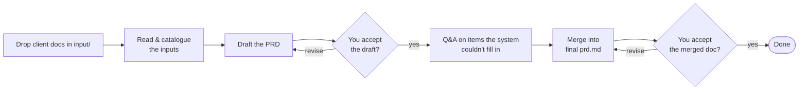
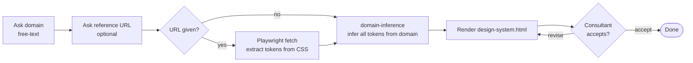
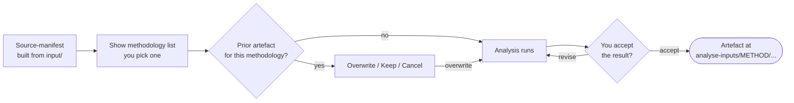
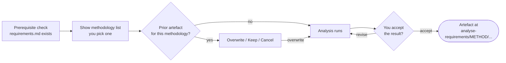
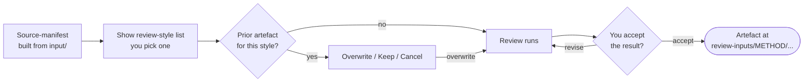
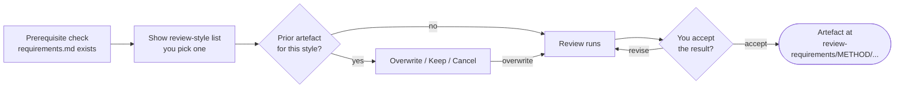
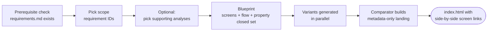

# Requirements Generator

## Contents

- [1. Overview](#1-overview)
- [2. When to use which command](#2-when-to-use-which-command)
- [3. Commands](#3-commands)
    - [3.1 `/start`](#31-start)
    - [3.2 `/requirements`](#32-requirements)
        - [3.2.1 How it works](#321-how-it-works)
        - [3.2.2 What you get](#322-what-you-get)
    - [3.3 `/generate-prd`](#33-generate-prd)
        - [3.3.1 How it works](#331-how-it-works)
        - [3.3.2 What you get](#332-what-you-get)
    - [3.4 `/design-system`](#34-design-system)
        - [3.4.1 How it works](#341-how-it-works)
        - [3.4.2 What you get](#342-what-you-get)
    - [3.5 `/analyse-inputs`](#35-analyse-inputs)
        - [3.5.1 How it works](#351-how-it-works)
        - [3.5.2 Choose this when…](#352-choose-this-when)
        - [3.5.3 What you get](#353-what-you-get)
    - [3.6 `/analyse-requirement`](#36-analyse-requirement)
        - [3.6.1 How it works](#361-how-it-works)
        - [3.6.2 Choose this when…](#362-choose-this-when)
        - [3.6.3 What you get](#363-what-you-get)
    - [3.7 `/review-inputs`](#37-review-inputs)
        - [3.7.1 How it works](#371-how-it-works)
        - [3.7.2 Choose this when…](#372-choose-this-when)
        - [3.7.3 What you get](#373-what-you-get)
    - [3.8 `/review-requirement`](#38-review-requirement)
        - [3.8.1 How it works](#381-how-it-works)
        - [3.8.2 Choose this when…](#382-choose-this-when)
        - [3.8.3 What you get](#383-what-you-get)
    - [3.9 `/wireframe`](#39-wireframe)
        - [3.9.1 How it works](#391-how-it-works)
        - [3.9.2 What you get](#392-what-you-get)
- [4. Setup](#4-setup)
    - [4.1 First-time install (one-off)](#41-first-time-install-one-off)
    - [4.2 To handle Word, Excel, PowerPoint, and PDF inputs](#42-to-handle-word-excel-powerpoint-and-pdf-inputs)
    - [4.3 To extract design tokens from a reference URL](#43-to-extract-design-tokens-from-a-reference-url)

## 1. Overview

A Claude Code workspace for consultants and business analysts. Drop the client material you've been given into the workspace, run a slash command, and get back the documents you actually need to hand off:

- a structured **requirements spec** for the client,
- a strategic **PRD** for stakeholders,
- a **brand-token brief** for the designer,
- deeper **models** of what your raw inputs or the spec already contain (theme maps, journeys, object maps, data models, sequence/state/activity diagrams…),
- **critiques** that surface what's still missing or wrong — in the raw inputs *or* in the spec,
- and **low-fi wireframe variants** to compare screen options before mocking.

The nine commands:

- **`/start`** — pick which command to run.
- **`/requirements`** — turn the loose pile of briefs, decks, screenshots, spreadsheets and PDFs the client gave you into a clean, structured `requirements.md`.
- **`/generate-prd`** — produce a human-audience PRD from the same inputs: problem, success metrics, hypotheses, MVP phasing, risks, stakeholders.
- **`/design-system`** — get a complete brand-token brief (colours, typography, effects) for a designer, optionally extracted from a reference URL.
- **`/analyse-inputs`** — go **deeper into the raw inputs before drafting** by re-expressing them through a chosen lens — thematic map, journey, jobs-to-be-done, object map, swim-lane process, affinity map, task analysis, or opportunity-solution tree.
- **`/analyse-requirement`** — go **deeper into what the spec already contains** by re-expressing it through a chosen lens — object map, data model, use cases, sequence/state/activity diagram, user journeys, task flows, five-whys, glossary, opportunity-solution tree, or trade-off-dimension matrix.
- **`/review-inputs`** — **find what's missing or wrong in the raw inputs** before drafting — adversarial six-dimension critique, completeness sweep, ambiguity catalogue, or template-bijection gap analysis.
- **`/review-requirement`** — **find what's missing or wrong in the spec** before handoff — adversarial critique, first-principles check, user-story review, or ten BA / UX questions.
- **`/wireframe`** — produce 2–3 parallel low-fi HTML wireframe variants for a scope of the spec, each adopting a divergent UX position, with full requirement-ID traceability.

`/analyse-requirement`, `/review-requirement`, and `/wireframe` read `requirements/requirements.md` — run `/requirements` first. `/analyse-inputs` and `/review-inputs` read the raw `input/` files via a shared manifest. `/start`, `/requirements`, `/generate-prd`, and `/design-system` are stand-alone.

## 2. When to use which command

| You're at this moment in the engagement…                                          | Run this                                                                       | Why                                                                              |
| --------------------------------------------------------------------------------- | ------------------------------------------------------------------------------ | -------------------------------------------------------------------------------- |
| Client just sent a pile of attachments and asked for a spec                       | `/requirements`                                                                | Turns the inputs into a structured doc you can iterate.                          |
| A stakeholder is asking for the *why* — problem, metrics, MVP phasing, risks      | `/generate-prd`                                                                | Strategic human-audience PRD from the same inputs.                               |
| You want to dig into the raw material before drafting                             | `/analyse-inputs` → e.g. `thematic-analysis`, `journey-mapping`, `jtbd`        | Pattern, journey, or motivation lens on the raw inputs. Re-feedable to `/requirements`. |
| You sense the raw inputs are thin, ambiguous, or contradictory                    | `/review-inputs` → `completeness-review` or `gap-analysis`                     | Authority-grounded or template-aligned punch-list before drafting.               |
| Designer is waiting on a brand brief                                              | `/design-system`                                                               | One run produces a complete colour + typography + effects brief.                 |
| About to brief a developer on data structure                                      | `/analyse-requirement` → `data-model`                                          | Surfaces the entities, fields, and relationships the spec already implies.       |
| About to brief a designer on screens and navigation                               | `/analyse-requirement` → `ooux` or `use-cases`                                 | Surfaces the objects + CTAs, or the actor goals + flows.                         |
| You sense something is missing in the spec but can't articulate it                | `/review-requirement` → `ten-ba-questions` or `ten-ux-questions`               | Surfaces the unasked questions in the consultant's blind spot.                   |
| You need to defend the spec to a sceptical stakeholder                            | `/review-requirement` → `adversarial`                                          | Strict critique with a Patch / Defer / Reject decision per finding.              |
| You want to show 2–3 divergent screen options before committing to a high-fi mock | `/wireframe`                                                                   | Low-fi HTML variants tied to requirement IDs; compare side-by-side via tabs.     |

## 3. Commands

### 3.1 `/start`

Run `/start` from inside Claude Code if you'd rather pick from a menu than remember command names. It lists the other commands with their one-liners and launches the one you select. There's no decision to support here — `/start` is just a dispatcher.

### 3.2 `/requirements`

Turn the loose pile of client material into a clean, structured requirements spec. Run when the client has just sent you their inputs and you need a doc you can iterate on.

#### 3.2.1 How it works

Drop the files into `input/` first. Supported file types:

- **Read directly:** `.md`, `.txt`, `.drawio`, `.yml`, `.yaml`, `.xml`.
- **Read by vision:** `.png`, `.jpg`, `.jpeg`, `.gif`, `.webp` (screenshots, photos, sketches).
- **Converted first, then read:** `.docx`, `.xlsx`, `.pptx`, `.pdf` — requires the markitdown setup (see §4.2).
- **Logged but not read:** anything else. You'll see it listed so you know it didn't slip through silently.

Then run `/requirements`:


You stay in the loop throughout: the draft asks for your acceptance before moving on, the Q&A asks one short question per item the system couldn't confidently fill in from your inputs (answer, override, or skip in bulk), and the merged doc asks for your acceptance one last time.

#### 3.2.2 What you get

A clean, merged **`requirements/requirements.md`** — the structured spec you'll hand to the client. Every item is either traceable to something you provided or to a domain-default rule the framework applies (e.g. accessibility, security, error-handling); items the system couldn't confidently fill in are resolved through the Q&A so the final doc reads as a clean, signed-off spec.

Re-running `/requirements` later notices the prior run and offers two choices: **continue** (pick up where you left off) or **start fresh** (the prior run is safely committed to git first, then the generated files are wiped so you can begin again with no risk of losing earlier work).

### 3.3 `/generate-prd`

Produce a strategic, human-audience **PRD** from the same client inputs — problem framing, success metrics, hypotheses, MVP phasing, risks, stakeholders. Run when a stakeholder or sponsor needs the *why* (not the *what-the-FE-must-do* that `/requirements` produces).

Fully independent of `/requirements`. Can run before, after, or alongside it — no state collision.

#### 3.3.1 How it works

Same drop-into-`input/` step as `/requirements`, same file-type support (§3.2.1).



The flow mirrors `/requirements` — draft, accept, Q&A, merge, accept — with the same continue / start-fresh behaviour on re-run. Citation IDs are namespaced separately (`PC-NNN` and `PAI-NNN`) so the PRD never visually collides with a requirements doc you're running alongside it.

#### 3.3.2 What you get

A clean, merged **`prd/prd.md`** — the human-audience PRD you'll send to a sponsor, exec, or any stakeholder who needs the strategic picture. Sections cover problem, target users, success metrics, hypotheses, MVP phasing, risks, and stakeholder map.

### 3.4 `/design-system`

Get a brand-token brief for a designer in one run. Useful when the designer is blocked waiting on visual direction — colours, typography, effects — and you need to send them something concrete today.

#### 3.4.1 How it works

Two questions when you launch:

1. **Domain** (required, free text). For example `retail-banking`, `loan-origination-portal`, `pet-grooming-marketplace`, `internal HR portal`. The framework infers a coherent token set per-run from this string — no fixed lookup table.
2. **Reference URL** (optional). If you provide one, a real browser opens at desktop size, navigates to the URL, and extracts the actual colours, typography, and effects from the live CSS. If you don't, every token is inferred from the domain string alone.



If a prior `design-system.html` already exists, you'll be asked whether to **overwrite** (the old one is safely committed to git first), **keep** it, or **cancel**.

#### 3.4.2 What you get

A single brand brief at **`design-system/design-system.html`** — a self-contained HTML document you can open in any browser via `file://`. Colour swatches, typography specimens at their actual sizes, shadow cards, motion samples, and contrast-validation pairs all render visually so a designer (or you) can verify the brand by eye. Every token is annotated with where it came from: either _extracted from the reference URL_ or _inferred from the domain string_.

The doc also embeds a `<script type="application/json" id="design-tokens">` block carrying the full machine-readable token set + provenance, so if a downstream tool consumes the brief programmatically (Figma plugin, CSS generator, future LLM pipeline), the values are already in a structured form — one regex + `JSON.parse` and you're in.

### 3.5 `/analyse-inputs`

Go **deeper into the raw inputs before drafting**. Pick an analytical lens and the framework re-expresses your `input/` material through that lens as a stand-alone artefact. Each artefact is designed to be **re-fed into `input/`** — copy it back and `/requirements` will consume it on the next run.

Use it when you have a pile of inputs but want a sharper view of one specific dimension — _what patterns repeat_, _what users are trying to get done_, _how the process flows across actors_, _what objects show up across sources_.

#### 3.5.1 How it works

`/analyse-inputs` requires `input/` to be non-empty. After the preflight, it shares the source manifest with `/requirements` (building it on first run), shows you the available methodologies, you pick one, and the chosen analysis runs interactively.



`/analyse-inputs` never modifies your inputs — it only reads them (plus the manifest, shared with `/requirements`).

#### 3.5.2 Choose this when…

| If you want to see…                                                                                                                | Pick                          | What it's called                  |
| ---------------------------------------------------------------------------------------------------------------------------------- | ----------------------------- | --------------------------------- |
| The **themes and patterns** the raw inputs already carry, with a coverage check against ten concern areas                          | `thematic-analysis`           | _Braun & Clarke thematic analysis_ |
| The **current-state user journey** described in the inputs, per persona, with sentiment curve and pain points                      | `journey-mapping`             | _NN/G journey map_                |
| What **users are actually trying to get done** in the inputs — jobs, outcomes, forces of progress (push / pull / anxiety / habit)  | `jtbd`                        | _Jobs-to-be-done (JTBD-X)_        |
| The **canonical objects, attributes, relationships, and CTAs** across all sources, with synonym-merge and an ERD                   | `ooux`                        | _Sophia Prater's ORCA process_    |
| The **cross-functional process** with swim-lanes per actor and a Disconnect Register flagging the white-space gaps                 | `swim-lane-process-mapping`   | _Rummler-Brache swim-lane map_    |
| A **hierarchical task decomposition** of user goals — sub-goals, operations, Plans, and per-terminal data nouns                    | `task-analysis`               | _Hierarchical Task Analysis (HTA)_ |
| An **outcome → opportunity → solution → assumption-test tree** seeded with candidate-requirement bridges                           | `opportunity-solution-trees`  | _Teresa Torres OST_               |
| A **bottom-up affinity map** — atomic notes clustered into super-themes via a two-pass re-cluster with drift detection             | `affinity-mapping`            | _KJ-method affinity diagram_      |

#### 3.5.3 What you get

One artefact per run, saved under `analyse-inputs/<METHOD>/`. Most are self-contained HTML you can open in a browser. Each survives a markitdown HTML→MD round-trip — copy the file into `input/` and `/requirements` consumes its content (embedded JSON / YAML / Mermaid bodies are the load-bearing re-ingestion contract).

Pick another methodology to add another artefact alongside the first.

### 3.6 `/analyse-requirement`

Go **deeper into what your requirements doc already contains**. Pick an analytical lens and the framework re-expresses your `requirements.md` through that lens as a stand-alone artefact you can share with a designer or developer.

Use it when you have a working requirements doc but want a sharper view of one specific dimension — _what records exist_, _what users are trying to get done_, _how the system parts talk to each other_, _what the lifecycle of an application looks like_.

#### 3.6.1 How it works

`/analyse-requirement` requires `requirements/requirements.md` to exist. After the prerequisite check, it shows you the available methodologies, you pick one, and the chosen analysis runs interactively and asks for your acceptance before saving.



`/analyse-requirement` never modifies your requirements doc — it only reads it.

#### 3.6.2 Choose this when…

| If you want to see…                                                                                                            | Pick                            | What it's called                |
| ------------------------------------------------------------------------------------------------------------------------------ | ------------------------------- | ------------------------------- |
| The **things** in your spec (customers, accounts, applications) and what users can do with each                                | `ooux`                          | _object map_                    |
| What **users are actually trying to get done** — their jobs and the outcomes they want                                         | `jtbd`                          | _jobs-to-be-done_               |
| **Each user's goals** and the step-by-step flows they take to reach them                                                       | `use-cases`                     | _use cases_                     |
| The **data structure** — what records exist, what fields they have, how they relate, plus optional ERDs                        | `data-model`                    | _logical data model_            |
| **How the parts of the system talk** to each other across a scenario (front-end ↔ back-end ↔ external services)                | `sequence-diagram`              | _UML sequence diagram_          |
| The **lifecycle of a record** — what statuses it moves through and what triggers each transition                               | `state-diagram`                 | _UML state diagram_             |
| A **multi-actor process flow** with branches, parallel paths, and who does what                                                | `activity-diagram`              | _UML activity diagram_          |
| The **user's experience phases** with pain-points and opportunities at each step                                               | `user-journeys`                 | _user journey map_              |
| The **goal-decomposition and step-by-step paths** users take, ready for wizards / form sequences                               | `task-flows`                    | _task flows_                    |
| Whether the doc's **features ladder up to its outcomes**, and where unaddressed opportunities or missing assumption-tests sit  | `opportunity-solution-trees`    | _opportunity-solution tree_     |
| Whether each requirement's **rationale chain** drills down to a user goal, business driver, or external mandate                | `five-whys`                     | _five-whys_                     |
| An alphabetical, **citation-bound vocabulary inventory** before designing copy, labels, status pills, or role surfaces         | `glossary`                      | _glossary_                      |
| Each user goal scored against **UX trade-off dimensions** (Speed vs Accuracy, Simplicity vs Power, Automation vs Control, …)   | `trade-off-dimension-analysis`  | _trade-off-dimension matrix_    |

#### 3.6.3 What you get

One HTML (or Markdown) artefact per run, saved under `analyse-requirements/<METHOD>/`. Open it in a browser — it's formatted to share directly with the designer or developer who needed the insight. Each run produces exactly one of the files keyed by the methodology name (e.g. `analyse-requirements/OOUX/ooux-object-map.html`, `analyse-requirements/FIVE-WHYS/five-whys.md`).

Pick another methodology to add another artefact alongside the first.

### 3.7 `/review-inputs`

**Find what's missing or wrong in the raw inputs** before you draft. Pick a review style and the framework critiques `input/` for you, producing a punch-list you can act on before `/requirements` runs.

Use it when the inputs _feel_ thin, ambiguous, or contradictory — and especially before you commit to drafting against material you don't yet trust.

#### 3.7.1 How it works

Same source-manifest sharing as `/analyse-inputs`. The selector reads its own registry; you pick one; the reviewer runs interactively.



`/review-inputs` never modifies your inputs — it only reads them.

#### 3.7.2 Choose this when…

| If you want to see…                                                                                                                                                                  | Pick                  |
| ------------------------------------------------------------------------------------------------------------------------------------------------------------------------------------ | --------------------- |
| A **six-dimension critique** of the raw input set — voice authenticity, ambiguity, cross-source conflict, silence-with-downstream-impact, quantitative and scope signals             | `adversarial`         |
| An **authority-grounded completeness sweep** (IEEE 29148 / Volere / BABOK / Wiegers / ISO 25010) across ten dimensions, with stakeholder elicitation questions per finding           | `completeness-review` |
| The **lexical, syntactic, referential, vague, subjective, weak-verb, and optionality ambiguities** (Berry/Kamsties + Femmer) with ready-to-paste elicitation questions per finding   | `ambiguity-review`    |
| A **template-bijection gap delta** measured against the drafter's own template, with a shall-form Candidate Requirement per Must/Should gap ready for `/requirements` re-ingestion   | `gap-analysis`        |

#### 3.7.3 What you get

One artefact per run, saved under `review-inputs/<METHOD>/`. Markdown punch-lists for `adversarial`, `completeness-review`, and `ambiguity-review`; HTML with inline-SVG coverage heatmap for `gap-analysis`. `gap-analysis.html` is designed to be copied back into `input/` so `/requirements` can pick up its shall-form Candidate Requirements on the next run.

### 3.8 `/review-requirement`

**Find what's missing or wrong in the spec** before you hand it over. Pick a review style and the framework critiques `requirements.md` for you, producing a punch-list you can act on.

Use it when the spec _feels_ close but you want a second pair of eyes — and especially before estimation, before briefing a designer or developer, or before walking a sceptical stakeholder through it.

#### 3.8.1 How it works

`/review-requirement` requires `requirements/requirements.md` to exist. After the prerequisite check, it shows you the available review styles, you pick one, and the chosen review runs interactively and asks for your acceptance before saving.



`/review-requirement` never modifies your requirements doc — it only reads it.

#### 3.8.2 Choose this when…

| If you want to see…                                                                                                                | Pick                |
| ---------------------------------------------------------------------------------------------------------------------------------- | ------------------- |
| The **stakeholder questions** the spec hasn't yet answered — questions an experienced BA would ask before design or estimation     | `ten-ba-questions`  |
| The **design-blocking gaps** an experienced UX designer would flag before they start designing                                     | `ten-ux-questions`  |
| A **strict critique** of what's wrong, with a Patch / Defer / Reject decision per finding so you know what to do about each        | `adversarial`       |
| Whether each requirement is **defensible against business rationale**, so weak items get cut or strengthened before design         | `first-principles`  |
| Which **user stories aren't ready** for design or estimation, so they can be reworked before they enter the backlog                | `user-stories`      |

#### 3.8.3 What you get

One markdown artefact per run, saved under `review-requirements/<METHOD>/` (e.g. `review-requirements/ADVERSARIAL/adversarial-review.md`). Treat the output as a punch-list: re-open `requirements/requirements.md`, fix the findings you accept, then re-run `/review-requirement` for a fresh pass if you want.

### 3.9 `/wireframe`

Produce **2–3 parallel low-fi HTML wireframe variants** for a scope of `requirements.md`. Each variant adopts a divergent position on a canonical UX trade-off dimension (density vs focus, speed vs accuracy, automation vs control, …) and is bound to a persona. Every interactive element is traceable back to a requirement ID.

Use it when you want to show 2–3 divergent screen options before committing to a hi-fi mock — e.g. before a design workshop, before briefing a designer, or when you're not yet sure which direction is right.

#### 3.9.1 How it works

`/wireframe` requires `requirements/requirements.md` to exist. You scope the run (which requirement IDs to wireframe), optionally pick supporting analyses you've already produced via `/analyse-requirement`, and the pipeline produces a blueprint + parallel variants + a metadata-only landing.



The optional Stage 1b only surfaces analyses you've **actually produced** under `analyse-requirements/<METHOD>/` — methodologies you haven't run are filtered out before the list appears. Selected analyses _augment_ `requirements.md` with refining detail (entity attributes, goal decomposition, lifecycles) and shape the wireframe (screen sequence, state chips, CTA labels, copy vocabulary); they never widen the scope.

Variants run in parallel — one Agent per variant — so a 2-variant scope takes about the same wall time as a 1-variant scope.

#### 3.9.2 What you get

A scope directory at **`wireframes/<scope-slug>/`** containing:

- **`index.html`** — the single consultant-facing landing. Metadata-only (no embedded wireframes). Four sections: §1 Scope details, §2 Wireframes (side-by-side variant columns of screen links), §3 Variant metadata (persona, design philosophy, strengths/weaknesses, trade-off, use-when), §4 Trade-off matrix.
- **`<VARIANT>/screen-NN-*.html`** — per-screen HTML files for each variant, linked from §2. Every interactive element carries a `data-src` attribute traceable to its requirement ID; every data-bound element carries a `data-prop` attribute traceable to a §7 data shape or F-NN parameter.
- **`<VARIANT>/wireframe-ds.css`** — the shared low-fi design system (one copy per variant).

Open `index.html` in your browser, then **click a screen link in §2 — it opens in a new tab.** Click the same row's other column to open the other variant's screen. Drag the tabs out into separate windows and arrange them side-by-side via your OS to compare directly. The trade-off matrix in §4 explains *why* the variants differ.

Re-running `/wireframe` for the same scope offers **Regenerate variants only**, **Add a variant** (up to 3 total), or **Overwrite** — the prior set is committed to git first.

## 4. Setup

Install once on your workstation. Versions below are floors — newer is fine.

### 4.1 First-time install (one-off)

The three pieces every command needs:

- **Claude Code** — the runtime everything runs under. Install from <https://claude.com/claude-code> and sign in. The slash commands are picked up automatically from `.claude/commands/` in this repo.
- **VS Code + Claude Code extension** — your editor while a command is running. Install VS Code from <https://code.visualstudio.com/>, then add the **Claude Code** extension from the marketplace. The extension lets you launch Claude Code in a side panel and run slash commands without leaving the editor.
- **git** — used to safely checkpoint a prior run before it gets reset (so nothing is ever lost). Install from <https://git-scm.com/>. Verify with `git --version`.

### 4.2 To handle Word, Excel, PowerPoint, and PDF inputs

Needed for any command that reads `input/` (`/requirements`, `/generate-prd`, `/analyse-inputs`, `/review-inputs`) when your client sends Office or PDF files (typical). Install **Python 3.10+** (<https://www.python.org/>; verify with `python --version`), then install **markitdown**:

```
pip install markitdown-mcp==0.0.1a4
```

Restart Claude Code afterwards so the converter picks up.

Without it, the input-reading commands still work on plain text, YAML/XML, .drawio diagrams, and images. They only stop if they actually encounter a `.docx`, `.xlsx`, `.pptx`, or `.pdf` in your inputs — and then they tell you exactly what to install and resume after you do.

Setup notes and troubleshooting: `framework/shared/setup-instructions/markitdown.md`.

### 4.3 To extract design tokens from a reference URL

Needed only for `/design-system` when you want it to pull colours/typography from a live website (instead of inferring everything from the domain string). Install **Node.js 20+** (<https://nodejs.org/>; verify with `node --version`), then prime the browser-driver:

```
npx -y @playwright/mcp@latest --help
```

Restart Claude Code afterwards so the browser driver registers.

Without it, `/design-system` still works — you just skip the reference URL when asked, and every token gets inferred from the domain string. If you do supply a URL without Playwright installed, the command offers a lower-fidelity web-fetch fallback or a clean exit while you install.

Setup notes and troubleshooting: `framework/shared/setup-instructions/playwright.md`.
