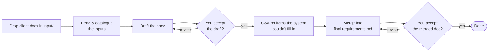
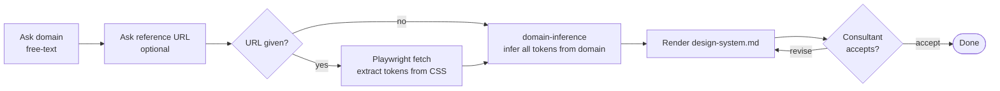
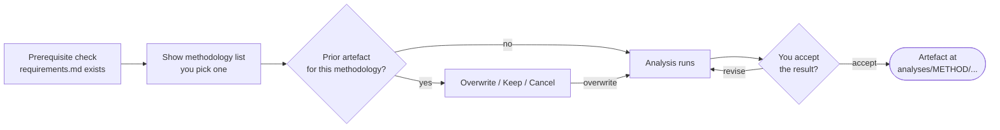
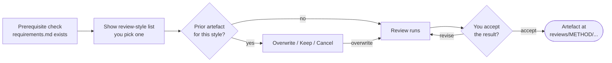

# Requirements Generator

## Contents

- [1. Overview](#1-overview)
- [2. When to use which command](#2-when-to-use-which-command)
- [3. Commands](#3-commands)
    - [3.1 `/start`](#31-start)
    - [3.2 `/requirements`](#32-requirements)
        - [3.2.1 How it works](#321-how-it-works)
        - [3.2.2 What you get](#322-what-you-get)
    - [3.3 `/design-system`](#33-design-system)
        - [3.3.1 How it works](#331-how-it-works)
        - [3.3.2 What you get](#332-what-you-get)
    - [3.4 `/analyse`](#34-analyse)
        - [3.4.1 How it works](#341-how-it-works)
        - [3.4.2 Choose this when…](#342-choose-this-when)
        - [3.4.3 What you get](#343-what-you-get)
    - [3.5 `/review`](#35-review)
        - [3.5.1 How it works](#351-how-it-works)
        - [3.5.2 Choose this when…](#352-choose-this-when)
        - [3.5.3 What you get](#353-what-you-get)
- [4. Setup](#4-setup)
    - [4.1 First-time install (one-off)](#41-first-time-install-one-off)
    - [4.2 To handle Word, Excel, PowerPoint, and PDF inputs](#42-to-handle-word-excel-powerpoint-and-pdf-inputs)
    - [4.3 To extract design tokens from a reference URL](#43-to-extract-design-tokens-from-a-reference-url)

## 1. Overview

A Claude Code workspace for consultants and business analysts. Drop the client material you've been given into the workspace, run a slash command, and get back the documents you actually need to hand off:

- a structured requirements spec for the client,
- a brand-token brief for the designer,
- deeper models of what the spec **already contains** (object maps, data models, sequence and state diagrams, user journeys…),
- and critiques that surface what the spec is still **missing**.

The five commands:

- **`/start`** — pick which command to run.
- **`/requirements`** — turn the loose pile of briefs, decks, screenshots, spreadsheets and PDFs the client gave you into a clean, structured `requirements.md`.
- **`/design-system`** — get a complete brand-token brief (colours, typography, effects) for a designer, optionally extracted from a reference URL.
- **`/analyse`** — go **deeper into what the requirements already contain** by re-expressing them through a chosen lens — object map, jobs-to-be-done, use cases, data model, sequence diagram, state diagram, activity diagram, or user journeys.
- **`/review`** — **find what's missing or wrong** in your requirements doc so you can fix it before handoff — a strict adversarial critique, the ten most pressing BA questions, or the ten most pressing UX questions.

`/analyse` and `/review` both read `requirements/requirements.md` — run `/requirements` first. `/start`, `/requirements`, and `/design-system` are stand-alone.

## 2. When to use which command

| You're at this moment in the engagement… | Run this | Why |
| --- | --- | --- |
| Client just sent you a pile of attachments and asked for a spec | `/requirements` | Turns the inputs into a structured doc you can iterate. |
| Designer is waiting on a brand brief | `/design-system` | One run produces a complete colour + typography + effects brief. |
| About to brief a developer on data structure | `/analyse` → `data-model` | Surfaces the entities, fields, and relationships already implied by the spec. |
| About to brief a designer on screens and navigation | `/analyse` → `ooux` or `use-cases` | Surfaces the objects + CTAs, or the actor goals + flows. |
| You sense something is missing in the spec but can't articulate it | `/review` → `ten-ba-questions` or `ten-ux-questions` | Surfaces the unasked questions in the consultant's blind spot. |
| You need to defend the spec to a sceptical stakeholder | `/review` → `adversarial` | Strict critique with a Patch / Defer / Reject decision per finding. |

## 3. Commands

### 3.1 `/start`

Run `/start` from inside Claude Code if you'd rather pick from a menu than remember command names. It lists the other commands with their one-liners and launches the one you select. There's no decision to support here — `/start` is just a dispatcher.

### 3.2 `/requirements`

Turn the loose pile of client material into a clean, structured requirements spec. Run when the client has just sent you their inputs and you need a doc you can iterate on.

#### 3.2.1 How it works

Drop the files into `input/` first. Supported file types:

- **Read directly:** `.md`, `.txt`, `.drawio`, `.yml`, `.yaml`, `.xml`.
- **Read by vision:** `.png`, `.jpg`, `.jpeg`, `.gif`, `.webp` (screenshots, photos, sketches).
- **Converted first, then read:** `.docx`, `.xlsx`, `.pptx`, `.pdf` — requires the markitdown setup (see §4.2).
- **Logged but not read:** anything else. You'll see it listed so you know it didn't slip through silently.

Then run `/requirements`:



You stay in the loop throughout: the draft asks for your acceptance before moving on, the Q&A asks one short question per item the system couldn't confidently fill in from your inputs (answer, override, or skip in bulk), and the merged doc asks for your acceptance one last time.

#### 3.2.2 What you get

A clean, merged **`requirements/requirements.md`** — the structured spec you'll hand to the client. Every item is either traceable to something you provided or to a domain-default rule the framework applies (e.g. accessibility, security, error-handling); items the system couldn't confidently fill in are resolved through the Q&A so the final doc reads as a clean, signed-off spec.

Re-running `/requirements` later notices the prior run and offers two choices: **continue** (pick up where you left off) or **start fresh** (the prior run is safely committed to git first, then the generated files are wiped so you can begin again with no risk of losing earlier work).

### 3.3 `/design-system`

Get a brand-token brief for a designer in one run. Useful when the designer is blocked waiting on visual direction — colours, typography, effects — and you need to send them something concrete today.

#### 3.3.1 How it works

Two questions when you launch:

1. **Domain** (required, free text). For example `retail-banking`, `loan-origination-portal`, `pet-grooming-marketplace`, `internal HR portal`. The framework infers a coherent token set per-run from this string — no fixed lookup table.
2. **Reference URL** (optional). If you provide one, a real browser opens at desktop size, navigates to the URL, and extracts the actual colours, typography, and effects from the live CSS. If you don't, every token is inferred from the domain string alone.



If a prior `design-system.md` already exists, you'll be asked whether to **overwrite** (the old one is safely committed to git first), **keep** it, or **cancel**.

#### 3.3.2 What you get

A single brand brief at **`design-system/design-system.md`** — a complete palette of colour, typography, and effect tokens you can hand a designer as-is. Every token is annotated with where it came from: either _extracted from the reference URL_ or _inferred from the domain string_. The designer can see at a glance which decisions are evidence-based and which are sensible defaults you'd want them to validate.

The doc also includes a machine-readable token section, so if a downstream tool consumes the brief programmatically (Figma plugin, CSS generator, etc.), the values are already in a structured form.

### 3.4 `/analyse`

Go **deeper into what your requirements doc already contains**. Pick an analytical lens (object map, data model, user journeys, etc.) and the framework re-expresses your `requirements.md` through that lens as a stand-alone artefact you can share with a designer or developer.

Use it when you have a working requirements doc but want a sharper view of one specific dimension — _what records exist_, _what users are trying to get done_, _how the system parts talk to each other_, _what the lifecycle of an application looks like_.

#### 3.4.1 How it works

`/analyse` requires `requirements/requirements.md` to exist. After the prerequisite check, it shows you the available methodologies, you pick one, and the chosen analysis runs interactively and asks for your acceptance before saving.



`/analyse` never modifies your requirements doc — it only reads it.

#### 3.4.2 Choose this when…

| If you want to see… | Pick | What it's called |
| --- | --- | --- |
| The **things** in your spec (customers, accounts, applications) and what users can do with each | `ooux` | _object map_ |
| What **users are actually trying to get done** — their jobs and the outcomes they want | `jtbd` | _jobs-to-be-done_ |
| **Each user's goals** and the step-by-step flows they take to reach them | `use-cases` | _use cases_ |
| The **data structure** — what records exist, what fields they have, how they relate, plus optional ERDs | `data-model` | _logical data model_ |
| **How the parts of the system talk** to each other across a scenario (front-end ↔ back-end ↔ external services) | `sequence-diagram` | _UML sequence diagram_ |
| The **lifecycle of a record** — what statuses it moves through and what triggers each transition | `state-diagram` | _UML state diagram_ |
| A **multi-actor process flow** with branches, parallel paths, and who does what | `activity-diagram` | _UML activity diagram_ |
| The **user's experience phases** with pain-points and opportunities at each step | `user-journeys` | _user journey map_ |

#### 3.4.3 What you get

One HTML artefact per run, saved under `analyses/<METHOD>/`. Open it in a browser — it's formatted to share directly with the designer or developer who needed the insight. Each run produces exactly one of these:

- `analyses/OOUX/ooux-object-map.html`
- `analyses/JTBD/jtbd-job-map.html`
- `analyses/USE-CASES/use-cases-map.html`
- `analyses/DATA-MODEL/data-model.html`
- `analyses/SEQUENCE-DIAGRAM/sequence-diagram.html`
- `analyses/STATE-DIAGRAM/state-diagram.html`
- `analyses/ACTIVITY-DIAGRAM/activity-diagram.html`
- `analyses/USER-JOURNEYS/user-journeys-map.html`

Pick another methodology to add another artefact alongside the first.

### 3.5 `/review`

**Find what's missing or wrong** in your requirements doc before you hand it over. Pick a review style and the framework critiques `requirements.md` for you, producing a punch-list you can act on.

Use it when the spec _feels_ close but you want a second pair of eyes — and especially before estimation, before briefing a designer or developer, or before walking a sceptical stakeholder through it.

#### 3.5.1 How it works

`/review` requires `requirements/requirements.md` to exist. After the prerequisite check, it shows you the available review styles, you pick one, and the chosen review runs interactively and asks for your acceptance before saving.



`/review` never modifies your requirements doc — it only reads it.

#### 3.5.2 Choose this when…

| If you want to see…                                                                                                            | Pick               |
| ------------------------------------------------------------------------------------------------------------------------------ | ------------------ |
| The **stakeholder questions** the spec hasn't yet answered — questions an experienced BA would ask before design or estimation | `ten-ba-questions` |
| The **design-blocking gaps** an experienced UX designer would flag before they start designing                                 | `ten-ux-questions` |
| A **strict critique** of what's wrong, with a Patch / Defer / Reject decision per finding so you know what to do about each    | `adversarial`      |

#### 3.5.3 What you get

One markdown artefact per run, saved under `reviews/<METHOD>/`. Each run produces exactly one of:

- `reviews/ADVERSARIAL/adversarial-review.md` — a strict critique structured by finding, with a Patch / Defer / Reject disposition for each.
- `reviews/TEN-BA-QUESTIONS/ten-ba-questions-review.md` — the ten most pressing unanswered BA questions, each tagged blocking / major / minor so you know what to chase first.
- `reviews/TEN-UX-QUESTIONS/ten-ux-questions-review.md` — the ten most pressing unanswered UX questions, same priority tagging.

Treat the output as a punch-list: re-open `requirements/requirements.md`, fix the findings you accept, then re-run `/review` for a fresh pass if you want.

## 4. Setup

Install once on your workstation. Versions below are floors — newer is fine.

### 4.1 First-time install (one-off)

The three pieces every command needs:

- **Claude Code** — the runtime everything runs under. Install from <https://claude.com/claude-code> and sign in. The slash commands are picked up automatically from `.claude/commands/` in this repo.
- **VS Code + Claude Code extension** — your editor while a command is running. Install VS Code from <https://code.visualstudio.com/>, then add the **Claude Code** extension from the marketplace. The extension lets you launch Claude Code in a side panel and run slash commands without leaving the editor.
- **git** — used to safely checkpoint a prior run before it gets reset (so nothing is ever lost). Install from <https://git-scm.com/>. Verify with `git --version`.

### 4.2 To handle Word, Excel, PowerPoint, and PDF inputs

Needed only for `/requirements` when your client sends Office or PDF files (typical). Install **Python 3.10+** (<https://www.python.org/>; verify with `python --version`), then install **markitdown**:

```
pip install markitdown-mcp==0.0.1a4
```

Restart Claude Code afterwards so the converter picks up.

Without it, `/requirements` still works on plain text, YAML/XML, .drawio diagrams, and images. It only stops if it actually encounters a `.docx`, `.xlsx`, `.pptx`, or `.pdf` in your inputs — and then it tells you exactly what to install and resumes after you do.

Setup notes and troubleshooting: `framework/shared/setup-instructions/markitdown.md`.

### 4.3 To extract design tokens from a reference URL

Needed only for `/design-system` when you want it to pull colours/typography from a live website (instead of inferring everything from the domain string). Install **Node.js 20+** (<https://nodejs.org/>; verify with `node --version`), then prime the browser-driver:

```
npx -y @playwright/mcp@latest --help
```

Restart Claude Code afterwards so the browser driver registers.

Without it, `/design-system` still works — you just skip the reference URL when asked, and every token gets inferred from the domain string. If you do supply a URL without Playwright installed, the command offers a lower-fidelity web-fetch fallback or a clean exit while you install.

Setup notes and troubleshooting: `framework/shared/setup-instructions/playwright.md`.
