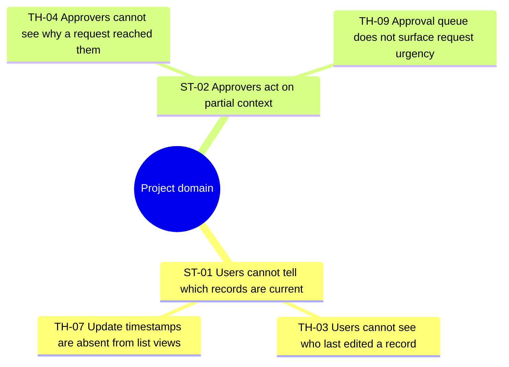
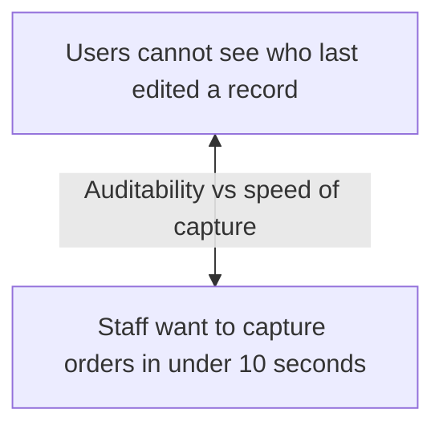

<!-- ROLE: asset (P2 analysis reference). Loaded by framework/agents/analyses-inputs/affinity-mapping-analyser.md at activation. -->

# analyses-inputs/affinity-mapping-reference.md

**Purpose:** Methodology reference for **bottom-up affinity diagramming** (Kawakita 1967 KJ method; Beyer & Holtzblatt 1997 *Contextual Design*) applied to **raw consultant inputs** enumerated via `requirements/source-manifest.json`. The analyser follows this document literally and exhaustively.

**Used by:**

- `framework/agents/analyses-inputs/affinity-mapping-analyser.md` — drives the agent's six-round process plus the ten-check quality sweep.
- `framework/skills/map-affinity-mapping-from-inputs-to-ui.md` — uses the cluster + super-theme structure (specifically the embedded JSON body block) to derive feature-area / vision-anchor / out-of-scope / trade-off signals for downstream consumers (stub).

**Output produced by the analyser:** `analyse-inputs/AFFINITY-MAPPING/affinity-map.html` — self-contained HTML artefact carrying:

- A compact overview header with jump-links and a meta-grid (counts + manifest fingerprint).
- A primary Mermaid `mindmap` block embedded in `<pre class="mermaid-source">` (the diagram-first deliverable — survives markitdown round-trip as a fenced code block).
- A conditional secondary Mermaid `flowchart TD` block surfacing cross-cluster tensions (rendered only when `tensions.length >= 1`; otherwise emits a deterministic "no tensions" copy so the section header is always present).
- A source-roster section (consumed + skipped manifest rows).
- Cluster cards — one `<article class="cluster-card">` per L2 cluster, grouped under L3 super-theme headings, each card listing every member note verbatim with `[SRC: <filename>]` citations and a `confidence: stable | drifted` chip carrying the Jaccard value.
- An orphan parking-lot table (notes that fit no cluster, with reason).
- An embedded `<pre><code class="language-json" id="affinity-map-body">` block carrying the full machine-readable hierarchy (the load-bearing `/requirements` re-ingestion contract; survives markitdown round-trip as fenced JSON).
- A small `<script type="application/json" id="affinity-map-meta">` block in `<head>` carrying counts and the manifest fingerprint (consumed by the drift-detection logic on subsequent runs; not relied on by `/requirements` since markitdown strips `<script>` blocks).
- A collapsed diagnostics block (Pass-1 vs Pass-2 Jaccard drift log, ten gate results, thin-cluster flags, recommended follow-up questions, run history).

**Sibling:** none on the requirements side. Affinity mapping is intentionally an inputs-side-only methodology because the merged `requirements/requirements.md` has already imposed structure — running affinity mapping on it would surface clusters of the structure, not of the consultant's claims. The closest workspace sibling is `framework/assets/analyses-inputs/thematic-analysis-reference.md` (Braun & Clarke six-phase), which operates at the level of *codes* clustered into *themes* with a deductive coverage check; affinity mapping operates one layer below that — at the level of **atomic notes** clustered by **conceptual similarity** with no deductive frame and no fixed stopping rule.

---

## Industry framing — KJ method + Contextual Design

Affinity mapping is a venerable bottom-up synthesis technique:

- **Jiro Kawakita's KJ method (1967)** is the canonical bottom-up clustering technique. Atomic notes ("cards") are arranged on a surface and silently re-clustered by individual analysts until conceptually similar notes cohabit. The silent re-cluster is the load-bearing anti-anchoring control — the first cluster discovered is a magnet pulling marginally-related notes, and only an independent re-pass perturbs the bias.
- **Beyer & Holtzblatt (1997) *Contextual Design*** popularised affinity diagrams in software design with the **insight-statement labelling rule**: labels describe *what the data says*, not *what category it is*. "Users cannot tell which records are current" beats "Data freshness" because the former is directly actionable by a downstream drafter; the latter just renames the inputs.
- **Nielsen Norman Group's affinity diagramming guidance** documents the standard failure modes: premature closure (stopping after one pass), topical clustering (grouping "everything mentioning 'report'" together when the underlying concerns differ), bucket inflation (one mega-cluster swallowing 40%+ of notes), label-first (writing labels before clusters stabilise), and orphan suppression (silently tidying singletons into ill-fitting clusters).

This analyser sits firmly in the bottom-up extraction camp. The subject of every note is a single citable observation **lifted from a manifest-enumerated source**; the cluster a note belongs to emerges from the two-pass re-cluster procedure, never from a pre-seeded category list.

### Why apply affinity mapping to raw inputs?

Consultants drop heterogeneous mixes of briefs, decks, interview notes, screenshots, and spreadsheets into `input/`. Reading those documents builds an intuitive sense of recurring concerns — but the intuition is unreviewable, the patterns are forgotten by the time `/requirements` runs, and the *latent* themes that span multiple stakeholders and document types (the concerns no single source names but that emerge from pattern repetition) are exactly what a downstream drafter needs to anchor on.

| Lens | Methodology | Question answered | Unit of analysis |
|---|---|---|---|
| Domain vocabulary × definitions | glossary (input variant, future) | Which terms appear in the raw material? | terms |
| Jobs-to-be-done × situations | jtbd (input variant) | What jobs are users trying to get done? | jobs |
| Pattern recognition × codes × themes | thematic-analysis | What recurring patterns do the inputs carry? | codes → themes |
| Object structure × relationships | ooux | What entities does the domain carry? | nouns → objects |
| **Atomic claim × cross-source clusters** | **affinity-mapping** | **What conceptual clusters emerge from the per-claim level when KJ-style anti-anchoring discipline is applied?** | **notes → clusters → super-themes** |

Affinity mapping is the right tool when the corpus is messy enough that the consultant cannot yet describe what a "code" or a "theme" would even mean — it operates one layer below thematic-analysis on the abstraction stack. OOUX clusters *nouns* on the structural axis; swim-lane clusters by *actor*; JTBD frames *motivation*. None operate at the per-claim atomic level with the two-pass anti-anchoring control that defines KJ.

### Why an HTML artefact with embedded JSON, not pure Markdown

- **Re-ingestibility into `/requirements`.** The full hierarchy survives markitdown HTML→MD as a fenced ` ```json ` code block inside `<pre><code class="language-json">`, so the drafter consumes the complete cluster + super-theme + orphan + tension model in one shot when the consultant copies the artefact into `input/`.
- **Diagram-first ordering.** The Mermaid `mindmap` source lives in `<pre class="mermaid-source">` immediately after the overview; consultants reviewing the artefact via `file://` see the hierarchical synthesis first, full notes second.
- **Conditional secondary diagram.** A second Mermaid `flowchart TD` block surfaces cross-cluster tensions only when they exist; a deterministic "no tensions" copy keeps the section header structurally present.

---

## Upstream input contract

Affinity mapping on the inputs side is **a bottom-up synthesis lens onto raw consultant material**, not a re-clustering of an already-coded corpus. The analyser starts from `requirements/source-manifest.json` and reads every row whose `tier != "Unsupported"`:

- `Native-text` → read `row.original_path` as text.
- `Native-multimodal` → read `row.original_path` as image bytes (Claude's multimodal vision); transcribe visible text + structurally significant observations (object labels on diagrams, screen artefact text, whiteboard contents). Multimodal transcription is permitted; fabrication is not. The boundary: a note's text must be supported by what is *literally visible or written* in the source, not extrapolated.
- `Supported-via-MCP` → read `row.converted_sibling` as text (markitdown-converted by the input-handler at orchestrator Step 1).
- `Unsupported` → skip; record `(filename, reason)` in the source roster's Skipped table.

There is no §2.1 anchor to fall back to. Every note traces verbatim (or via narrowly-bounded multimodal transcription) to exactly one source filename. If the manifest enumerates zero consumable rows, the analyser halts with an RF-03 analogue rather than producing an empty map.

---

## The six-round process

Six rounds, executed in order. The analyser does not skip rounds and does not collapse rounds — each round's output feeds the next, and round-by-round structure is what makes the methodology auditable.

### Round 1 — Note extraction (no clustering)

For each row in `consumed_rows`, scan the content (text or transcribed visual notes) for **atomic notes** — single citable observations / claims / utterances. One observation per note. **No grouping is allowed in this round** — extraction-only suppresses anchoring on a partially-read corpus.

A note is:

```
{
  id,                            // "N-NNN", sequential within the run
  text,                          // single citable observation, atomic (no compound "and" / "/" spanning two ideas)
  source_filename,               // exactly one filename per note; cross-source mentions produce
                                 // multiple note entries that Round 2 may co-cluster
  source_quote,                  // verbatim ≤ 200 chars containing or directly supporting the note
  source_excerpt_offset          // optional: character offset within the source content
}
```

- **Atomicity is the load-bearing constraint.** A line like "users cannot tell which records are current and cannot see who edited them" decomposes into two notes, each with its own `id` and its own citation. Gate 2 enforces this.
- **No invented notes.** Every note has exactly one `source_filename` matching a `consumed_rows[*].filename` exactly. Multimodal transcription is *not* fabrication; extrapolation is.
- **Include near-duplicates from different sources.** Cross-source mentions are signal — they affect cluster size and confidence later.
- **Per-source running tally** so silent-skip surfaces explicitly: for each consumed row, increment `notes_contributed[filename]`. Rows where `notes_contributed[filename] == 0` after the full pass are candidates for the `irrelevant-to-domain` log unless the Round 6 orphan / tension passes pick them up.

**Round 1 output:** an unfiltered, flat list of atomic notes with per-source provenance.

### Round 2 — Pass-1 provisional clustering (main context)

Read the full note list from Round 1. Propose clusters with working labels and assign every note. **Target cluster count = `min(25, max(5, N/5))`** where N is total note count — adaptive lower bound for small corpora; upper bound to keep cluster cards browsable.

Each Pass-1 cluster:

```
{
  cluster_id,                    // "TH-NN", sequential within Pass-1
  working_label,                 // rough — re-labelled in Round 4 once clusters stabilise
  note_ids: [...]                // ≥ 1; a singleton at this stage is allowed and may
                                 // become an orphan in Round 6 if Pass-2 does not corroborate
}
```

Working labels are permitted to be rough at this stage — they are re-written in Round 4 in insight-statement form once clusters have stabilised. Conceptual similarity is the only valid clustering axis; topical / keyword clustering (grouping "everything mentioning 'report'" together) is forbidden — different notes mentioning the same surface noun frequently belong to different underlying clusters.

Pass-1 results are written to `/tmp/affinity-mapping-<run-id>/pass-1.json` so the parent agent can recover them after the Pass-2 sub-agent returns.

**Round 2 output:** Pass-1 cluster assignments with working labels.

### Round 3 — Pass-2 re-cluster via sub-agent context isolation

**The load-bearing anti-anchoring control.** Invoke a sub-agent via the `Agent` tool (subagent_type: `general-purpose`) whose input prompt contains the Round 1 notes JSON only — **no Pass-1 cluster labels, no Pass-1 assignments, no Pass-1 cluster counts**. The sub-agent independently proposes Pass-2 clusters and returns the assignment payload, which the parent writes to `/tmp/affinity-mapping-<run-id>/pass-2.json`.

In-context "ignore Pass-1" prompting is theatre — Pass-1 labels remain in the parent agent's working memory and bias next-token prediction; sub-agent invocation is the only realistic mechanism for true context isolation.

**Documented exception to the workspace's "no sub-agents" convention.** The exception applies because this sub-agent invocation is *computational* (no consultant interaction, no `AskUserQuestion`, no handback gate within the sub-agent). The convention's intent — preserving same-thread acceptance for interactive surfaces — is not violated. The sub-agent has a single deliverable (Pass-2 cluster assignments as JSON) and a single return path (JSON payload to parent).

#### Drift detection — Jaccard similarity, deterministic, no semantic judgement

For each note N, compute:

- `P1(N)` = the set of *other* notes sharing N's Pass-1 cluster (N excluded from the set).
- `P2(N)` = the set of *other* notes sharing N's Pass-2 cluster (N excluded from the set).
- Jaccard similarity `J(N) = |P1(N) ∩ P2(N)| / |P1(N) ∪ P2(N)|`. If both sets are empty, `J(N) = 1.0` (a singleton in both passes is trivially stable).

If `J(N) ≥ 0.5`, mark note `confidence: stable`. Otherwise `confidence: drifted`.

Every drifted note is recorded in the diagnostics drift log with its Pass-1 cluster label, Pass-2 cluster label, and Jaccard value. The rule is mechanically deterministic, requires no semantic-equivalence LLM judgement, and is reproducible.

**Pass-1 clusters are adopted as canonical for Rounds 4–6.** Pass-2 is a *control mechanism*, not a replacement. Drifted notes remain in their Pass-1 cluster and are flagged in cluster cards and diagnostics so the consultant can audit the anchoring control directly.

Comparing Pass-1 and Pass-2 cluster *labels* for semantic equivalence is forbidden — that would require LLM judgement (subjective, non-reproducible, and itself anchored). Comparing Pass-1 and Pass-2 cluster *memberships* via Jaccard similarity is the deterministic mechanism.

**Round 3 output:** every note tagged `confidence: stable | drifted` with its Jaccard value and (when drifted) the Pass-2 cluster label that out-corroborated its Pass-1 placement.

### Round 4 — Insight-statement labelling

Write final L2 cluster labels in **insight-statement form** (Beyer/Holtzblatt rule). Labels describe *what the data says*, not *what category it is*:

| Bad (category noun) | Good (insight statement) |
|---|---|
| Reporting | Users cannot tell which report version is current |
| Search | Search returns too many irrelevant hits |
| Onboarding | New users abandon at the workspace-naming step |
| Permissions | Approvers cannot see why a request reached them |
| Data quality | Staff override the validation when the rule conflicts with reality |

Labels are written **after clusters stabilise** in Round 2 / Round 3, not before. Pure-noun labels are flagged by Gate 7 with a suggested rewrite.

Each L2 cluster:

```
{
  id,                            // "TH-NN" — preserved from Round 2 Pass-1
  label,                         // insight statement, 6–14 words, verb-bearing or first-person assertion
  note_ids: [...],               // unchanged from Round 2
  representative_quote_note_id,  // single note id chosen as the most illustrative example
  thin                           // optional flag — "needs-more-input" if < 3 notes (Gate 3)
}
```

The representative quote helps reviewers grasp the cluster's gist without reading every note.

**Round 4 output:** L2 clusters with insight-statement labels and representative-quote pointers.

### Round 5 — L3 super-themes

Group L2 clusters into **4–8 L3 super-themes** (Miller 7±2). Super-theme labels are also in insight-statement form. **Notes never directly belong to L3** — only L2 clusters belong to L3.

Each super-theme:

```
{
  id,                            // "ST-NN", sequential within the run
  label,                         // insight statement, may be slightly higher-altitude than its
                                 // member-cluster labels but never a bare category noun
  cluster_ids: [...]             // L2 cluster ids; ≥ 1
}
```

Outside the 4–8 range Gate 4 fires.

**Round 5 output:** L3 super-themes mapping cluster_ids → super-theme.

### Round 6 — Orphans + cross-cluster tensions

#### Orphans

Notes that fit no cluster on either pass land in the explicit `orphans[]` array. **Discarding orphans is forbidden** — orphans are signal: edge cases, unstated assumptions, future-scope hints, single-stakeholder concerns. Each orphan keeps its `[SRC: <filename>]` citation and a one-line "why no cluster" reason.

```
{
  id,                            // preserved "N-NNN" from Round 1
  text,                          // verbatim
  source,                        // filename
  reason                         // one line: "single-source unique edge-case",
                                 // "stakeholder-specific future scope", "regulatory only-mention", etc.
}
```

The map-skill routes orphans into the `/requirements` drafter's §10 out-of-scope candidate list when the artefact is re-ingested.

#### Cross-cluster tensions

Identify contradictions / trade-offs between L2 clusters. **Bounded search algorithm** (avoid O(N²) explosion):

1. Consider only cluster *pairs* where ≥ 1 source filename cites notes in both clusters.
2. For each candidate pair, assess whether the clusters' insight statements express opposing or competing concerns. Examples: an audit-completeness cluster vs a speed-of-entry cluster; an explicit-scope cluster vs an implicit-fallback cluster.
3. Record tensions as:

```
{
  from_cluster_id,
  to_cluster_id,
  description,                   // one-line characterisation: "Auditability vs speed of capture"
  sources                        // filenames that cite notes in both clusters
}
```

The tensions diagram (secondary Mermaid `flowchart TD`) renders only if `tensions.length >= 1`. Otherwise the artefact emits a deterministic `<p class="no-tensions">No cross-cluster tensions surfaced in the corpus.</p>` so the section header is always present.

**Round 6 output:** orphans + tensions.

`model` (notes + Pass-1 clusters + Pass-2 cluster assignments + Jaccard values + L2 labels + L3 super-themes + orphans + tensions) is **closed** at the end of Round 6 (Step 9). Steps 10–11 must not add notes, clusters, super-themes, orphans, or tensions; they only validate and render.

---

## Output presentation

The artefact has the following sections in DOM order. Compact overview + the Mermaid mindmap source fit above the fold on a 1080p screen.

1. **Compact overview** (`<header id="overview">`) — title, one-line caption, counts bar, jump-links to `#diagram-primary`, `#clusters`, `#orphans`, `#tensions`, `#diagnostics`.
2. **Primary mindmap** (`<section id="diagram-primary">`) — Mermaid `mindmap` inside `<pre class="mermaid-source">`. **Diagram-first deliverable.** Out-of-band render via `mmdc` or [mermaid.live](https://mermaid.live).
3. **Tensions diagram** (`<section id="diagram-tensions">`) — conditional secondary Mermaid `flowchart TD`. Rendered only when `tensions.length >= 1`; otherwise emits `<p class="no-tensions">No cross-cluster tensions surfaced in the corpus.</p>`.
4. **Source roster** (`<section id="source-roster">`) — Consumed + Skipped tables. Consumed rows: `filename · tier · sha256[:8] · note_count contributed`. Skipped rows: `filename · reason`.
5. **Cluster cards** (`<section id="clusters">`) — one `<article class="cluster-card">` per L2 cluster, grouped under `<section class="super-theme">` headings for L3. Each cluster card carries:
    - The full insight-statement label.
    - Note count and a `confidence-summary` chip showing `stable: N · drifted: M`.
    - A representative-quote callout.
    - A full notes list — one `<li>` per member note with `[SRC: <filename>]` and a `confidence: stable | drifted` chip carrying the Jaccard value. Drifted notes additionally show Pass-2's competing cluster label.
6. **Orphans** (`<section id="orphans">`) — parking-lot table: note text · source · one-line reason. Empty list renders `<tr class="empty"><td colspan="3">(no orphans this run — verify against the diagnostics "no-orphans" justification)</td></tr>`.
7. **Embedded JSON body block** (`<section id="affinity-map-body">`) — `<pre><code class="language-json" id="affinity-map-body">`. Full machine-readable hierarchy. **The load-bearing markitdown-survival contract.**
8. **Diagnostics** (`<details id="diagnostics">`) — collapsed by default. Manifest sha256 + run history + Pass-1 vs Pass-2 Jaccard drift log + ten gate results + cluster-size distribution table + thin-cluster flags + recommended consultant follow-up questions.

Plus the `<head>` carries a small `<script type="application/json" id="affinity-map-meta">` block with `{ manifest_sha256, run_count, generated_at, domain, target, note_count, cluster_count, super_theme_count, orphan_count, tension_count, drifted_note_count }`. This block is consulted by the drift-detection logic on subsequent runs but is **stripped by markitdown** and so is not relied on by `/requirements`.

### Mindmap node-budget and label-rendering rules

- **Node count cap: ≤34.** 1 root + ≤8 super-themes + ≤25 clusters. **Note-level leaves are excluded** from the mindmap; full notes live exclusively in cluster cards. Mindmaps with 80–150+ leaves are illegible regardless of renderer.
- **Root literal text** = project domain (from manifest meta) if available, else the deterministic fallback `Affinity Map`.
- **Label truncation rule** for L2 cluster nodes and L3 super-theme nodes inside the mindmap: render the insight-statement label truncated at the last word boundary ≤ 60 chars, with `…` appended only if truncation occurred. The full insight-statement appears in the cluster card / super-theme heading below.

---

## JSON body schema (the `<pre><code class="language-json" id="affinity-map-body">` block)

```json
{
  "schema_version": "1.0",
  "manifest_sha256": "<64-char hex>",
  "generated_at": "<ISO-8601 UTC>",
  "run_count": 1,
  "domain": "<from manifest meta or null>",
  "target": "prototype | application | (not declared)",
  "source_roster": {
    "consumed": [
      { "filename": "<basename>",
        "tier": "Native-text | Native-multimodal | Supported-via-MCP",
        "sha256": "<first 8 chars>",
        "note_count": <int ≥ 0> }
    ],
    "skipped": [
      { "filename": "<basename>", "reason": "<one-line reason>" }
    ]
  },
  "super_themes": [
    {
      "id": "ST-01",
      "label": "Users cannot tell which records are current",
      "cluster_ids": ["TH-03", "TH-07"]
    }
  ],
  "clusters": [
    {
      "id": "TH-03",
      "super_theme_id": "ST-01",
      "label": "Users cannot see who last edited a record",
      "note_count": 7,
      "confidence_distribution": { "stable": 6, "drifted": 1 },
      "representative_quote_note_id": "N-014",
      "note_ids": ["N-014", "N-031", "..."],
      "thin": null
    }
  ],
  "notes": [
    {
      "id": "N-014",
      "text": "Users cannot see who last edited a record",
      "source": "brief.md",
      "cluster_id": "TH-03",
      "confidence": "stable",
      "jaccard": 0.71,
      "drifted_from_pass2_label": null
    }
  ],
  "orphans": [
    { "id": "N-098",
      "text": "Quarterly export must include FX rates valid on close-of-business",
      "source": "interview-3.md",
      "reason": "single-source unique edge-case" }
  ],
  "tensions": [
    { "from_cluster_id": "TH-03",
      "to_cluster_id": "TH-12",
      "description": "Auditability vs speed of capture",
      "sources": ["brief.md", "deck.pptx"] }
  ],
  "quality_gates": [
    { "id": "G1..G10", "result": "pass | fail | warn", "note": "<flagged items if not pass>" }
  ]
}
```

Per-note `cluster_id` is `null` for orphans (an orphan's record lives both in `notes[]` and in `orphans[]` for downstream-consumer convenience; the cluster_id field disambiguates). Per-cluster `super_theme_id` always references a valid super-theme. `tensions[].from_cluster_id` and `tensions[].to_cluster_id` reference valid cluster ids and differ.

The JSON is **the canonical machine-readable surface**. The rendered cluster cards, mindmap, tensions flowchart, and orphan table are presentations of the same data. They must agree (Gate 10 checks JSON schema validity and basic referential consistency).

---

## Mermaid `mindmap` emission shape

Mermaid `mindmap` is the only diagram type purpose-built for radial single-root hierarchies. Stable since `mmdc` v10.x.



Rules:

- **Single root.** Literal text = `domain` from manifest meta if available, else `Affinity Map`. Wrapped in `((double parens))` per Mermaid's circle-shape convention.
- **Two visible depths beneath the root.** First depth = L3 super-themes (`ST-NN` prefix); second depth = L2 clusters (`TH-NN` prefix). Note-level leaves are excluded.
- **Label format inside each node.** `<id-prefix> <truncated-insight-statement>`. Truncation rule: last word boundary ≤ 60 chars, append `…` only if truncation occurred.
- **Special-character escaping.** Mermaid `mindmap` treats parens, square brackets, and curly braces as shape syntax. Replace each in label text with a non-conflicting Unicode equivalent (`(` → `（`, `)` → `）`, `[` → `［`, `]` → `］`, `{` → `｛`, `}` → `｝`) or with a hyphen-space, before emitting.

The secondary tensions diagram uses Mermaid `flowchart TD` with cluster_ids as nodes and the tension descriptions as bidirectional edge labels:



Both diagrams are validated by `framework/skills/mermaid-validator.md` post-Write. On validator unavailability (`mmdc` not on PATH), the analyser surfaces `RF-07 mermaid_render_dependency_missing` per `framework/shared/refusal-registry.md`. On validator syntax-failure after the validator's own retry loop, the analyser drops the failing block (replacing the `<pre class="mermaid-source">` content with a `<!-- Mermaid <block-name> was rejected by the validator after retries — see Diagnostics > Mermaid results -->` comment) and records the drop in diagnostics rather than failing the artefact write.

---

## Quality checks (run after Round 6, before write)

Every check is a hard gate unless explicitly labelled `warn`. On gate failure, the analyser does **not** write the artefact — it surfaces the violation to the consultant via `AskUserQuestion` with Revise / Override / Restart options per the agent's Step 10.

1. **Citation completeness.** Every note carries `[SRC: <filename>]` matching a manifest row's `filename` field exactly. Every orphan and every member note in every cluster carries the marker; the JSON `notes[].source` and `orphans[].source` fields satisfy the same check.
2. **Note granularity.** Every note is one observation — no compound notes joined by " and " / " / " / semicolons spanning two ideas. Flag offending notes by id with the offending compound substring.
3. **Cluster size discipline.** No L2 cluster contains > 20% of all notes (force a split — bucket inflation). No L2 cluster contains < 3 notes without an explicit `thin: "needs-more-input"` flag. **Adaptive lower bound:** target cluster count = `min(25, max(5, N/5))` where N = total note count; very small corpora are permitted < 3-note clusters when flagged.
4. **L3 cardinality.** 4 ≤ `super_themes.length` ≤ 8 (Miller 7±2). Outside this range → flag + consultant prompt.
5. **Orphan section non-empty OR explicit "no orphans" justification.** An empty `orphans[]` with no diagnostics-justification entry almost always indicates over-forcing. The justification must name a structural reason (e.g. "every note in a 12-note corpus co-clustered cleanly across both passes; no singletons emerged").
6. **Two-pass drift transparency.** Every `confidence: drifted` note is listed in the diagnostics drift log with Pass-1 cluster label, Pass-2 cluster label, and Jaccard value. The count of drifted notes in the meta block matches the count rendered in cluster cards.
7. **Label form.** Every L2 and L3 label is an **insight statement** — verb-bearing or first-person assertion or "X cannot Y" / "Y is Z" form. Pure noun labels ("Reporting", "Search") are flagged with a suggested rewrite. **Warn-level** if every cluster label passes but ≥ 1 super-theme label is a category noun (the asymmetry is documented).
8. **Manifest-row coverage.** Every manifest row with `tier != "Unsupported"` contributes ≥ 1 note OR is recorded in diagnostics with reason `irrelevant-to-domain` (mirrors OOUX Gate 8 — surfaces silent skips).
9. **Mermaid validity.** Primary `mindmap` block passes `framework/skills/mermaid-validator.md`; secondary `flowchart TD` (when present) passes too. **Node count ≤ 34** (1 root + ≤ 8 super-themes + ≤ 25 clusters). **Node labels truncated at last word boundary ≤ 60 chars** with `…` only if truncated. `RF-07` fires if `mmdc` is not on PATH.
10. **Re-ingestion-block schema validity.** JSON inside `<pre><code class="language-json" id="affinity-map-body">` parses; satisfies the schema above; `notes[].cluster_id` references a valid cluster id or is `null` (orphan); `clusters[].super_theme_id` references a valid super-theme id; `tensions[].from_cluster_id` and `to_cluster_id` reference valid cluster ids and differ; `clusters[].confidence_distribution` sums to `note_count`.

---

## Re-run semantics (manifest drift)

On a subsequent invocation, Step 3 reads the prior artefact's `<script type="application/json" id="affinity-map-meta">` block, extracts `manifest_sha256`, and compares to the current manifest. Three modes:

- **Identical manifest.** Surface `AskUserQuestion`: *"Prior artefact found, manifest unchanged. {Keep, Re-run-full, Cancel}"*.
- **Manifest changed.** Surface `AskUserQuestion`: *"Manifest changed since last run (sha256 drift). {Append-new-notes-only, Re-run-full, Keep-existing, Cancel}"*.
    - `Append-new-notes-only` mode: re-extract notes from new / changed manifest rows only; run a single-pass assignment of new notes to existing Pass-1 clusters (or spawn new clusters when no existing cluster fits); skip the sub-agent Pass-2 (anti-anchoring is less critical on incremental additions because the existing structure is the anchor by design); surface a diff log to consultant in diagnostics.
    - `Re-run-full` mode: Rounds 1–6 from scratch on the current manifest; the new artefact replaces the prior.
- **No prior artefact.** Proceed with a fresh run.

---

## Revision granularity (Step 12 accept/revise/restart loop)

If the consultant chooses *Revise* at Step 12, the agent prompts which round(s) to re-run. Downstream rounds also re-run because they depend on upstream outputs:

| Revise from | Rounds re-executed |
|---|---|
| Round 1 (note extraction) | All Rounds 1–6 (full restart) |
| Rounds 2–3 (clustering) | Rounds 2–6 |
| Round 4 (labelling) | Rounds 4–6 |
| Round 5 (super-themes) | Rounds 5–6 |
| Round 6 (orphans + tensions) | Round 6 only |
| Specific cluster IDs | Re-evaluate listed clusters in-place (labels, member-notes, tensions); upstream notes and L3 super-themes preserved |

The accept/revise/restart loop continues until the consultant chooses *Accept* (or hand-back fails on a Revise-introduced `RF-04` or `RF-07`, which propagates per Step 11).

---

## Voice and stance

The analyser's stance is defined in `framework/assets/characters/affinity-mapping-inputs-analysis.md` — bottom-up, similarity-not-keyword, label-after-cluster, orphan-preserving, two-pass-disciplined, source-grounded. The reference here defines **what** to do; the character file defines **how** the agent talks while doing it.

---

## Anti-patterns

- **Premature closure.** Stopping after Pass-1 without the sub-agent Pass-2 re-cluster. Pass-2 is the load-bearing anti-anchoring control; skipping it produces clusters anchored to the order notes were read, not to genuine conceptual similarity.
- **Topical / keyword clustering.** Grouping "everything mentioning 'report'" together. Conceptual similarity is the only valid clustering axis; the same surface noun frequently appears in unrelated underlying clusters.
- **Label-first.** Writing cluster labels before clusters stabilise. Labels in Round 2 are *working* labels; insight-statement labels live in Round 4 *after* the two-pass re-cluster.
- **Bucket inflation.** One mega-cluster swallowing 40 %+ of notes (Gate 3 catches this). Split it; if the underlying concern really is mostly the same, look for sub-axes inside.
- **Orphan suppression.** Silently tidying singletons into ill-fitting clusters. Orphans are signal; the dedicated parking-lot section is the canonical home for them.
- **In-context "ignore Pass-1" prompting masquerading as anti-anchoring.** Pass-1 labels remain in the parent context and bias next-token prediction; only sub-agent invocation achieves true isolation.
- **Semantic-equivalence drift judgement.** Comparing Pass-1 vs Pass-2 cluster *labels* for equivalence requires LLM judgement; it is subjective, non-reproducible, and itself anchored. The Jaccard similarity rule on cluster *memberships* is the deterministic mechanism — no semantic judgement required.
- **Compound notes.** Notes joined by " and " / " / " spanning two ideas; each must be atomised in Round 1. Gate 2 enforces this.
- **Fabricating notes.** Every note must trace to an input file. Multimodal transcription (extracting visible text + structurally significant observations from screenshots / diagrams per OOUX Step 2 precedent) is permitted and not "fabrication" — but extrapolation is. The boundary: a note's text must be supported by what is literally visible / written in the source, not extrapolated from surrounding context the source does not contain.
- **Skipping the mindmap.** The diagram-first ordering is the hard requirement. The graceful-degradation path (mermaid-validator drop after retries) is reserved for `mmdc` syntax failure — not for "I didn't bother". On `mmdc` unavailability the analyser surfaces `RF-07`; it does not proceed silently without a diagram.
- **Including note-level leaves in the mindmap.** Caps at 34 nodes (1 root + 8 super-themes + 25 clusters). Mindmaps with note-level leaves are illegible.
- **Silently merging the inputs side's classification of a row as irrelevant.** Gate 8 forces every consumed manifest row to either contribute ≥ 1 note or appear in the `irrelevant-to-domain` log with a reason.
- **Collapsing the six rounds into a single pass.** Each round produces a distinct in-memory output; the round-by-round structure is what makes the analysis reviewable and what enables the sub-agent isolation in Round 3.
