# Framework Dependency Graphs

Two transitive dependency trees, one rooted at each orchestrator. Edges represent explicit load / Read / invoke intent declared inside each file. "See also" directory pointers (e.g. `pattern-catalogue/`) are not drawn as edges.

## requirements-orch.md

```mermaid
graph TD
    classDef orch fill:#1f2937,color:#fff,stroke:#000,stroke-width:2px,font-weight:bold
    classDef agent fill:#2563eb,color:#fff,stroke:#1e40af
    classDef skill fill:#0d9488,color:#fff,stroke:#0f766e
    classDef asset fill:#d97706,color:#fff,stroke:#92400e
    classDef shared fill:#7c3aed,color:#fff,stroke:#5b21b6
    classDef char fill:#db2777,color:#fff,stroke:#9d174d
    classDef state fill:#525252,color:#fff,stroke:#262626

    subgraph Orchestrator
      orch_req[requirements-orch.md]
    end

    subgraph Agents
      agent_input[input-handler.md]
      agent_drafter[requirements-drafter.md]
      agent_resolver[requirements-resolver.md]
      agent_merger[requirements-merger.md]
    end

    subgraph Skills
      skill_classify[classify-input-tier.md]
      skill_preflight[preflight-mcp.md]
      skill_convert[convert-input-file.md]
      skill_buildmanifest[build-source-manifest.md]
      skill_verifywrite[verify-artifact-write.md]
      skill_bloat[check-context-bloat.md]
      skill_gappass[completeness-gap-pass.md]
      skill_mermaid[mermaid-validator.md]
      skill_qa1[run-qa-level1.md]
      skill_qa2[run-qa-level2.md]
      skill_flag[flag-gaps-ambiguities.md]
    end

    subgraph Assets
      asset_template_req[template-requirements.md]
      asset_topics_req[topics-requirements.md]
    end

    subgraph Characters
      char_req_qa[characters/requirements-qa.md]
    end

    subgraph Shared
      shared_refusal[refusal-registry.md]
      shared_protoscope[prototype-scope.md]
      shared_genrules[general-rules.md]
      shared_protoinv[prototype-invariants.md]
      shared_setup_md[setup-instructions/markitdown.md]
    end

    subgraph State
      state_progress[state/.progress.json]
    end

    orch_req --> agent_input
    orch_req --> agent_drafter
    orch_req --> agent_resolver
    orch_req --> agent_merger
    orch_req --> skill_bloat
    orch_req --> shared_refusal
    orch_req --> state_progress

    agent_input --> skill_classify
    agent_input --> skill_preflight
    agent_input --> skill_convert
    agent_input --> skill_buildmanifest
    agent_input --> skill_verifywrite
    agent_input --> shared_refusal
    agent_input --> shared_setup_md

    skill_classify --> skill_convert
    skill_preflight --> shared_refusal
    skill_convert --> skill_verifywrite
    skill_convert --> shared_refusal
    skill_buildmanifest --> skill_verifywrite
    skill_verifywrite --> shared_refusal
    skill_bloat --> shared_refusal
    skill_bloat --> state_progress

    agent_drafter --> asset_template_req
    agent_drafter --> shared_protoscope
    agent_drafter --> shared_genrules
    agent_drafter --> shared_refusal
    agent_drafter --> skill_verifywrite
    agent_drafter --> skill_gappass
    agent_drafter --> skill_mermaid

    skill_gappass --> shared_protoscope
    skill_gappass --> shared_genrules
    skill_gappass --> asset_topics_req

    agent_resolver --> char_req_qa
    agent_resolver --> skill_qa1
    agent_resolver --> skill_qa2
    agent_resolver --> skill_flag
    agent_resolver --> shared_protoscope
    agent_resolver --> shared_genrules

    skill_flag --> shared_protoscope
    skill_flag --> shared_genrules

    agent_merger --> shared_protoinv

    class orch_req orch
    class agent_input,agent_drafter,agent_resolver,agent_merger agent
    class skill_classify,skill_preflight,skill_convert,skill_buildmanifest,skill_verifywrite,skill_bloat,skill_gappass,skill_mermaid,skill_qa1,skill_qa2,skill_flag skill
    class asset_template_req,asset_topics_req asset
    class char_req_qa char
    class shared_refusal,shared_protoscope,shared_genrules,shared_protoinv,shared_setup_md shared
    class state_progress state
```

**Stats:** 25 nodes / 39 edges / depth 4.

**Notes:**
- Shared subtrees: `refusal-registry.md` is referenced from 7 ancestors (orchestrator, input-handler, preflight-mcp, convert-input-file, verify-artifact-write, check-context-bloat, drafter). `prototype-scope.md` and `general-rules.md` are each shared between drafter, completeness-gap-pass, resolver, and flag-gaps-ambiguities.
- `state/.progress.json` is a state file written by the orchestrator and read by `check-context-bloat.md`; included as a deliberate working-state node, not an asset.
- `topics-requirements.md` is consulted by `completeness-gap-pass.md` (bijection invariants).
- The pipeline output artefacts (`requirements/source-manifest.json`, `requirements-draft.md`, `consultant-answers.md`, `requirements.md`) are intentionally not drawn — they are produced by the agents, not loaded as dependencies.
- The character file `requirements-qa.md` is a stub that does not transitively reference further framework files.
- The `input-handler.md` agent node (previously `requirements-input-handler.md`) is **cross-pipeline**: it is also rooted under `analyse-inputs-orch.md` (graph 5). The agent is unchanged in shape; its `progress_path` parameter is the per-call hinge — `requirements-orch.md` passes `framework/state/.progress.json`, `analyse-inputs-orch.md` passes `null`. The five transitive skills below `agent_input` (classify-input-tier, preflight-mcp, convert-input-file, build-source-manifest, verify-artifact-write) are shared with graph 5.
- The drafter's `derive-architectural-implications` substep (step 6 in its workflow) consumes an **inline** capability catalogue declared in `requirements-drafter.md` itself; it does **not** add a new file dependency. §1.7 architectural-implication rows are emitted as `[AI-SUGGESTED: non-blocking]` and refined through the resolver's Phase 2.
- The drafter's workflow has **nine** instrumented substeps in `framework/state/timing.ndjson`: `read-inputs`, `populate-template`, `gap-pass`, `derive-architectural-implications`, `author-mermaid`, `write-draft`, `write-claims-sidecar`, `grounding-verify`, `mermaid-validate`. Total per clean drafter run: 10 tool calls for 18 events. (`grep-crosscheck` was removed as a redundant in-memory substep; the gap pass enumerates the same bijections deterministically and the post-Write self-validation Greps target the on-disk draft.)
- The merger **retains** `[SRC: C-NNN]` provenance tags in the final `requirements/requirements.md` (was: stripped). Downstream LLM consumers (review-requirement, analyse-requirement, design phases) can read provenance inline without joining against `requirements/draft-claims.ndjson`; the sidecar remains the authoritative store of verbatim quotes for grounding re-verification.
- `template-requirements.md` carries one-line `<!-- format: ... -->` (and optional `<!-- guidance: ... -->`) directives under every H2/H3 — they describe the content shape (table / matrix / bullets / mermaid / narrative) and survive the merger's strip pattern (which only matches `[AI-SUGGESTED]` / `[STANDARD-RULE]` / `[OUT-OF-SCOPE]` / blocking-suffix / `AI-NNN` / `GR-NN`). Directives are part of the published spec — downstream LLM consumers benefit from the same format contract the drafter saw.
- The template carries **two additive sub-sections** beyond gap-pass bijections: §6.3 Validation rules (visible field-level UI validation; backend invariants remain in §6.2 / sibling backend doc) and §6.4.5 Edge / empty / error states (conditional on ≥1 §5 `exception_paths` or §6.4 state-branching). Neither participates in Tier A bijections in this pass; future Tier B candidates noted in the rollout plan.
- No cycles. No `framework/assets/pattern-catalogue/` "see also" pointers appear in this subtree.

---

## design-system-orch.md

```mermaid
graph TD
    classDef orch fill:#1f2937,color:#fff,stroke:#000,stroke-width:2px,font-weight:bold
    classDef agent fill:#2563eb,color:#fff,stroke:#1e40af
    classDef step fill:#0891b2,color:#fff,stroke:#155e75
    classDef skill fill:#0d9488,color:#fff,stroke:#0f766e
    classDef prompt fill:#ca8a04,color:#fff,stroke:#854d0e
    classDef data fill:#a16207,color:#fff,stroke:#713f12
    classDef asset fill:#d97706,color:#fff,stroke:#92400e
    classDef shared fill:#7c3aed,color:#fff,stroke:#5b21b6
    classDef char fill:#db2777,color:#fff,stroke:#9d174d

    subgraph Orchestrator
      orch_ds[design-system-orch.md]
    end

    subgraph Agent
      agent_styler[design-system-styler.md]
    end

    subgraph Steps
      step01[step-01-activate.md]
      step02[step-02-inputs.md]
      step04[step-04-site-fetching.md]
      step05[step-05-brand-extraction.md]
      step05b[step-05b-domain-inference.md]
      step06[step-06-artifact-generation.md]
      step07[step-07-handback.md]
    end

    subgraph PromptTemplates
      pt_site[prompt-templates/site-fetching.md]
      pt_css[prompt-templates/css-identification.md]
      pt_brand[prompt-templates/brand-extraction.md]
      pt_domain[prompt-templates/domain-inference.md]
      pt_artifact[prompt-templates/artifact-generation.md]
    end

    subgraph Data
      data_color[data/color-extraction-rules.md]
      data_font[data/font-rules.md]
      data_typo[data/typography-scale-rules.md]
      data_shadow[data/shadow-motion-rules.md]
      data_contrast[data/contrast-validation.md]
      data_insuff[data/insufficient-data-handling.md]
    end

    subgraph Skills
      skill_preflight_ds[preflight-mcp.md]
      skill_verifywrite_ds[verify-artifact-write.md]
      skill_bloat_ds[check-context-bloat.md]
    end

    subgraph State
      state_progress_ds[state/.progress.json]
    end

    subgraph Assets
      asset_persona[persona-llm.md]
      asset_template_ds[template-design-system.html]
      asset_standards[design-system-standards.html]
    end

    subgraph Characters
      char_style[characters/style-extraction.md]
    end

    subgraph Shared
      shared_refusal_ds[refusal-registry.md]
      shared_setup_pw[setup-instructions/playwright.md]
    end

    orch_ds --> agent_styler
    orch_ds --> skill_bloat_ds
    orch_ds --> shared_refusal_ds
    orch_ds --> state_progress_ds

    skill_bloat_ds --> shared_refusal_ds
    skill_bloat_ds --> state_progress_ds

    agent_styler --> step01
    agent_styler --> step02
    agent_styler --> step04
    agent_styler --> step05
    agent_styler --> step05b
    agent_styler --> step06
    agent_styler --> step07
    agent_styler --> char_style
    agent_styler --> asset_persona

    step01 --> char_style

    step04 --> skill_preflight_ds
    step04 --> shared_refusal_ds
    step04 --> shared_setup_pw
    step04 --> pt_site
    step04 --> pt_css

    skill_preflight_ds --> shared_refusal_ds

    step05 --> pt_brand
    step05 --> data_insuff
    step05 --> data_color
    step05 --> data_font
    step05 --> data_typo
    step05 --> data_shadow

    step05b --> data_contrast
    step05b --> pt_domain

    step06 --> pt_artifact
    step06 --> asset_template_ds
    step06 --> asset_standards
    step06 --> skill_verifywrite_ds

    skill_verifywrite_ds --> shared_refusal_ds

    pt_artifact --> asset_template_ds

    class orch_ds orch
    class agent_styler agent
    class step01,step02,step04,step05,step05b,step06,step07 step
    class pt_site,pt_css,pt_brand,pt_domain,pt_artifact prompt
    class data_color,data_font,data_typo,data_shadow,data_contrast,data_insuff data
    class skill_preflight_ds,skill_verifywrite_ds,skill_bloat_ds skill
    class asset_persona,asset_template_ds,asset_standards asset
    class char_style char
    class shared_refusal_ds,shared_setup_pw shared
    class state_progress_ds state
    classDef state fill:#525252,color:#fff,stroke:#262626
```

**Stats:** 29 nodes / 40 edges / depth 5.

**Notes:**
- Step-05b (domain-inference) loads `prompt-templates/domain-inference.md` to derive an inferred token set per-run from the consultant's `{{domain}}` string. Status colours and any token unset after step-05 are filled here.
- `template-design-system.html` is shared between `step-06-artifact-generation.md` (the operative loader) and `prompt-templates/artifact-generation.md` (which instructs step-06 to read it).
- `refusal-registry.md` is shared between `step-04-site-fetching.md`, `preflight-mcp.md`, `verify-artifact-write.md`, and `check-context-bloat.md`.
- `check-context-bloat.md` is shared between both orchestrators (`requirements-orch.md` and `design-system-orch.md`); the design-system caller passes `requirements/` as `artefact_dir` because prior `/requirements` state on disk is the meaningful proxy for in-conversation bloat against the styler.
- `state/.progress.json` is read (existence + at-least-one-`completed`-event check) by `check-context-bloat.md` from both orchestrators; the design-system orchestrator never writes to it.
- `design-system-standards.html` references `framework/assets/template-design-spec.md` only as a passing comment ("document exceptions in the design-spec, not the design-system output") — not a load target. Not drawn as an edge. (Its `.md` sibling is the human-edit source of truth, kept in sync with the `.html`; the styler reads only the `.html`.)
- Per the styler's stand-alone constraint, no edges reach `requirements/`, `framework/state/`, `prototype-scope.md`, `general-rules.md`, or `prototype-invariants.md` from the styler subtree. The orchestrator's narrow read exception for the step-0b preflight (read-only access to `requirements/`, `requirements/source-manifest.json`, `framework/state/.progress.json`) is captured by the `orch_ds → skill_bloat_ds → state_progress_ds` edges and a documented stand-alone-constraint clause in the orchestrator.
- No cycles.

---

## review-requirement-orch.md

```mermaid
graph TD
    classDef orch fill:#1f2937,color:#fff,stroke:#000,stroke-width:2px,font-weight:bold
    classDef agent fill:#2563eb,color:#fff,stroke:#1e40af
    classDef worker fill:#3b82f6,color:#fff,stroke:#1d4ed8,stroke-dasharray:3 3
    classDef skill fill:#0d9488,color:#fff,stroke:#0f766e
    classDef asset fill:#d97706,color:#fff,stroke:#92400e
    classDef shared fill:#7c3aed,color:#fff,stroke:#5b21b6
    classDef char fill:#db2777,color:#fff,stroke:#9d174d
    classDef state fill:#525252,color:#fff,stroke:#262626

    subgraph Orchestrator
      orch_rv[review-requirement-orch.md]
    end

    subgraph Agents
      agent_adv[adversarial-reviewer.md]
      agent_fp[first-principles-reviewer.md]
      agent_uxq[ten-ux-questions-reviewer.md]
      agent_baq[ten-ba-questions-reviewer.md]
      agent_usr[user-stories-reviewer.md]
    end

    subgraph Workers
      worker_adv_dim[adversarial-dimension-worker.md]
    end

    subgraph Skills
      skill_revsel[review-selector.md]
      skill_verifywrite_rv[verify-artifact-write.md]
      skill_bloat_rv[check-context-bloat.md]
    end

    subgraph Assets
      asset_registry_rv[reviews/registry.md]
      asset_ref_adv[reviews/adversarial-reference.md]
      asset_tmpl_adv[reviews/template-adversarial.md]
      asset_ref_fp[reviews/first-principles-reference.md]
      asset_tmpl_fp[reviews/template-first-principles.md]
      asset_ref_uxq[reviews/ten-ux-questions-reference.md]
      asset_tmpl_uxq[reviews/template-ten-ux-questions.md]
      asset_ref_baq[reviews/ten-ba-questions-reference.md]
      asset_tmpl_baq[reviews/template-ten-ba-questions.md]
      asset_ref_usr[reviews/user-stories-reference.md]
      asset_tmpl_usr[reviews/template-user-stories.md]
    end

    subgraph Characters
      char_adv[characters/adversarial-review.md]
      char_fp[characters/first-principles-review.md]
      char_uxq[characters/ten-ux-questions-review.md]
      char_baq[characters/ten-ba-questions-review.md]
      char_usr[characters/user-stories-review.md]
    end

    subgraph Shared
      shared_refusal_rv[refusal-registry.md]
      shared_genrules_rv[general-rules.md]
      shared_protoinv_rv[prototype-invariants.md]
      shared_protoscope_rv[prototype-scope.md]
    end

    subgraph State
      state_progress_rv[state/.progress.json]
    end

    orch_rv --> skill_revsel
    orch_rv --> skill_bloat_rv
    orch_rv --> shared_refusal_rv
    orch_rv --> agent_adv
    orch_rv --> agent_fp
    orch_rv --> agent_uxq
    orch_rv --> agent_baq
    orch_rv --> agent_usr

    skill_revsel --> asset_registry_rv
    skill_bloat_rv --> shared_refusal_rv
    skill_bloat_rv --> state_progress_rv
    skill_verifywrite_rv --> shared_refusal_rv

    agent_adv --> char_adv
    agent_adv --> asset_ref_adv
    agent_adv --> asset_tmpl_adv
    agent_adv --> skill_verifywrite_rv
    agent_adv --> worker_adv_dim

    agent_fp --> char_fp
    agent_fp --> asset_ref_fp
    agent_fp --> asset_tmpl_fp
    agent_fp --> skill_verifywrite_rv
    agent_fp --> shared_genrules_rv
    agent_fp --> shared_protoinv_rv

    agent_uxq --> char_uxq
    agent_uxq --> asset_ref_uxq
    agent_uxq --> asset_tmpl_uxq
    agent_uxq --> skill_verifywrite_rv
    agent_uxq --> shared_genrules_rv
    agent_uxq --> shared_protoinv_rv
    agent_uxq --> shared_protoscope_rv

    agent_baq --> char_baq
    agent_baq --> asset_ref_baq
    agent_baq --> asset_tmpl_baq
    agent_baq --> skill_verifywrite_rv
    agent_baq --> shared_genrules_rv
    agent_baq --> shared_protoinv_rv
    agent_baq --> shared_protoscope_rv
    agent_baq -.->|Step 4 filter source only| asset_ref_uxq

    agent_usr --> char_usr
    agent_usr --> asset_ref_usr
    agent_usr --> asset_tmpl_usr
    agent_usr --> skill_verifywrite_rv
    agent_usr --> shared_genrules_rv
    agent_usr --> shared_protoinv_rv

    class orch_rv orch
    class agent_adv,agent_fp,agent_uxq,agent_baq,agent_usr agent
    class worker_adv_dim worker
    class skill_revsel,skill_verifywrite_rv,skill_bloat_rv skill
    class asset_registry_rv,asset_ref_adv,asset_tmpl_adv,asset_ref_fp,asset_tmpl_fp,asset_ref_uxq,asset_tmpl_uxq,asset_ref_baq,asset_tmpl_baq,asset_ref_usr,asset_tmpl_usr asset
    class char_adv,char_fp,char_uxq,char_baq,char_usr char
    class shared_refusal_rv,shared_genrules_rv,shared_protoinv_rv,shared_protoscope_rv shared
    class state_progress_rv state
```

**Stats:** 32 nodes / 45 edges / depth 3.

**Notes:**
- The orchestrator is registry-driven: it does not know at design time which reviewer will run. The `skill_revsel → asset_registry_rv` edge is the discovery mechanism; `orch_rv → agent_*` edges represent the runtime invocation paths once the consultant has selected a methodology. Adding a new MVP reviewer requires adding a new agent node (plus its character / reference / template asset nodes) and an `orch_rv → agent_new` edge — no orchestrator file edit is required.
- The adversarial reviewer fans out eight non-interactive read-only dimension workers per `adversarial-dimension-worker.md` at its Step 3; this is the only sub-agent dispatch under the `/review-requirement` pipeline. The worker node is drawn with a dashed border to indicate it is a parallel sub-agent rather than an orchestrator-invoked agent. The ten-ux-questions reviewer is single-pass and dispatches no workers.
- The ten-ux-questions reviewer reads three shared-policy files (`general-rules.md`, `prototype-invariants.md`, `prototype-scope.md`) at its Step 4 as filter sources only — the agent drops candidate questions whose topics are already deterministically answered by an active `GR-NN` or `PI-NN`, or are out of scope per `prototype-scope.md`. These three edges are unique to this reviewer; the adversarial reviewer does not read shared-policy files because its task is defect-citation in present content, not gap-filtering against deterministic defaults.
- The ten-ba-questions reviewer reads the same three shared-policy files at its Step 4, **plus** one fourth filter source: `framework/assets/reviews/ten-ux-questions-reference.md` (drawn as a dashed cross-methodology edge labelled *"Step 4 filter source only"*). This fourth read is the UX-lens-drop filter — a BA candidate whose question shape fits a UX category from that reference is dropped at Step 4 rule 4, and gate 9 catches escapees. The dashed edge documents the BA→UX cross-methodology dependency without inverting the methodologies' independence: the UX reviewer never reads the BA reference, only the reverse. The orthogonality contract between the two "10 questions" methodologies is therefore enforced by a one-way read at filter time, not by a circular dependency or by a shared third file. The BA reviewer otherwise mirrors the UX reviewer's single-pass, no-fan-out shape; it dispatches no workers.
- The first-principles reviewer reads the same **two** shared-policy files as the user-stories reviewer (`general-rules.md`, `prototype-invariants.md`) at its Step 6 — and only as filter sources for the Q3/Q5 rescue pass (a Q5 over-spec `no` is re-marked `yes-with-evidence` when `GR-NN` or `PI-NN` foreclosed the underlying premise). No `prototype-scope.md` edge — every §4–§7 subject is in-scope for first-principles evaluation by construction. No cross-methodology edge to any other reviewer's reference — the four sibling lenses are independent. The reviewer is single-pass, no-fan-out, and rates every numbered item in §4.1 / §4.2 / §6 / §7 against six per-subject defensibility questions (Q1–Q6) plus one document-wide coverage pass (Q7) for orphans; the artefact carries a full ratings table plus a Top-10 deep-dive callout plus a Critical-missing-artefacts section, governed by 11 quality gates (gate 8 has a `warn` variant for layers absent from the doc).
- The user-stories reviewer reads only **two** shared-policy files at its Step 4 (`general-rules.md`, `prototype-invariants.md`) — fewer than the BA / UX reviewers. The two deliberate omissions: (a) no `prototype-scope.md` edge, because every §4.2 story is in-scope by construction (a story narrating an out-of-scope concern would have been caught at `/requirements` time); (b) no cross-methodology edge to `ten-ux-questions-reference.md`, because story-quality criteria (Meaningful / Implementable / Testable / Coherent / Scoped / Outcome-aligned) are orthogonal to UX-vs-BA framing — a UX-shaped story can pass all six criteria and a BA-shaped story can fail them. Both omissions are documented as `not-applicable` filter sources in the reviewer's own diagnostics block. The reviewer is single-pass, no-fan-out, and surfaces every defective story (no top-N cap — distinct from the BA / UX reviewers' 50→10 selection).
- `check-context-bloat.md` is shared across all three orchestrators (`requirements-orch.md`, `design-system-orch.md`, `review-requirement-orch.md`); the review-requirement-orch caller passes `requirements/` as `artefact_dir` because prior `/requirements` state on disk is the meaningful proxy for in-conversation bloat against the reviewer.
- `state/.progress.json` is read (existence + at-least-one-`completed`-event check) by `check-context-bloat.md` from the review-requirement orchestrator; the review-requirement orchestrator never writes to it, consistent with the no-write-outside-`review-requirements/` invariant.
- Per each reviewer's stand-alone constraint, no edges reach `requirements/` (except `requirements/requirements.md` itself, which is the read target — implicit, not drawn), `analyse-requirements/`, `design-system/`, or `framework/state/` from the reviewer subtrees. The shared-policy edges from `agent_uxq` are the documented Step-4 filter-source exception.
- No cycles.

---

## analyse-requirement-orch.md

```mermaid
graph TD
    classDef orch fill:#1f2937,color:#fff,stroke:#000,stroke-width:2px,font-weight:bold
    classDef agent fill:#2563eb,color:#fff,stroke:#1e40af
    classDef skill fill:#0d9488,color:#fff,stroke:#0f766e
    classDef asset fill:#d97706,color:#fff,stroke:#92400e
    classDef shared fill:#7c3aed,color:#fff,stroke:#5b21b6
    classDef char fill:#db2777,color:#fff,stroke:#9d174d
    classDef state fill:#525252,color:#fff,stroke:#262626

    subgraph Orchestrator
      orch_an[analyse-requirement-orch.md]
    end

    subgraph Agents
      agent_ooux[ooux-analyser.md]
      agent_jtbd[jtbd-analyser.md]
      agent_uc[use-cases-analyser.md]
      agent_dm[data-model-analyser.md]
      agent_uj[user-journeys-analyser.md]
      agent_seq[sequence-diagram-analyser.md]
      agent_state[state-diagram-analyser.md]
      agent_act[activity-diagram-analyser.md]
      agent_tf[task-flows-analyser.md]
      agent_fw[five-whys-analyser.md]
      agent_glossary[glossary-analyser.md]
      agent_ost[opportunity-solution-trees-analyser.md]
    end

    subgraph Skills
      skill_ansel[analysis-selector.md]
      skill_verifywrite_an[verify-artifact-write.md]
      skill_bloat_an[check-context-bloat.md]
      skill_svgoverlap_an[svg-overlap-check.md]
    end

    subgraph Assets
      asset_registry_an[analyses/registry.md]
      asset_ref_tf[analyses/task-flows-reference.md]
      asset_tmpl_tf[analyses/template-task-flows.html]
    end

    subgraph Characters
      char_tf[characters/task-flows-analysis.md]
    end

    subgraph Shared
      shared_refusal_an[refusal-registry.md]
    end

    subgraph State
      state_progress_an[state/.progress.json]
    end

    orch_an --> skill_ansel
    orch_an --> skill_bloat_an
    orch_an --> shared_refusal_an
    orch_an --> agent_ooux
    orch_an --> agent_jtbd
    orch_an --> agent_uc
    orch_an --> agent_dm
    orch_an --> agent_uj
    orch_an --> agent_seq
    orch_an --> agent_state
    orch_an --> agent_act
    orch_an --> agent_tf
    orch_an --> agent_fw
    orch_an --> agent_glossary
    orch_an --> agent_ost

    skill_ansel --> asset_registry_an
    skill_bloat_an --> shared_refusal_an
    skill_bloat_an --> state_progress_an
    skill_verifywrite_an --> shared_refusal_an

    agent_tf --> char_tf
    agent_tf --> asset_ref_tf
    agent_tf --> asset_tmpl_tf
    agent_tf --> skill_verifywrite_an
    agent_tf --> skill_svgoverlap_an
    agent_dm --> skill_svgoverlap_an
    agent_state --> skill_svgoverlap_an

    class orch_an orch
    class agent_ooux,agent_jtbd,agent_uc,agent_dm,agent_uj,agent_seq,agent_state,agent_act,agent_tf,agent_fw,agent_glossary,agent_ost agent
    class skill_ansel,skill_verifywrite_an,skill_bloat_an,skill_svgoverlap_an skill
    class asset_registry_an,asset_ref_tf,asset_tmpl_tf asset
    class char_tf char
    class shared_refusal_an shared
    class state_progress_an state
```

**Stats:** 22 nodes / 26 edges / depth 3. (Per-analyser reference / template / character / map-skill nodes for the ten other MVP analysers are intentionally omitted to keep the graph readable — each analyser node implicitly fans out to the same four-asset shape as `agent_tf`. Five-whys and glossary both exercise the registry's `template_asset: null` clause and compose markdown directly; their template-node fan-out is correspondingly nil.)

**Notes:**
- The orchestrator is **registry-driven**: at design time it does not know which analyser will run. The `skill_ansel → asset_registry_an` edge is the discovery mechanism; `orch_an → agent_*` edges represent the runtime invocation paths once the consultant has selected a methodology via `analysis-selector.md`. **Adding a new MVP analyser requires zero orchestrator edits** — only a new registry row plus the four-asset shape (analyser agent + reference + template + character) plus the orchestrator-node edge in this graph. The `task-flows` row added in this PR follows that pattern.
- Each analyser is itself **stand-alone-ish**: it reads `requirements/requirements.md` plus its own four assets (reference / character / template / map-skill stub) and nothing else under `requirements/`, `framework/state/`, or `framework/shared/`. The reference + template + character edges for `agent_tf` are drawn to illustrate the shape; the same shape applies to all seven other analyser nodes (omitted for readability — see each analyser's own *Inputs* section for the exact paths).
- `check-context-bloat.md` is shared across all six orchestrators (`requirements-orch.md`, `design-system-orch.md`, `review-requirement-orch.md`, `analyse-requirement-orch.md`, `analyse-inputs-orch.md`, `review-inputs-orch.md`); the analyse-requirement-orch caller passes `requirements/` as `artefact_dir` because prior `/requirements` state on disk is the meaningful proxy for in-conversation bloat against the analyser. The `/analyse-inputs` and `/review-inputs` callers both pass `input/` as `artefact_dir` because the raw input folder is what enters their agents' context.
- `state/.progress.json` is read (existence + at-least-one-`completed`-event check) by `check-context-bloat.md` from the analyse-requirement orchestrator; the analyse-requirement orchestrator never writes to it, consistent with the no-write-outside-`analyse-requirements/` invariant. This mirrors the design-system-orch surface variant of RF-05 documented in `framework/orchestrators/analyse-requirement-orch.md > RF-05 — analyse-requirement-orch surface variant`.
- `verify-artifact-write.md` is shared across all six orchestrators; every analyser and reviewer calls it from its write step (Step 11 for `task-flows-analyser.md`, Step 12 for `adversarial-reviewer.md`). For `/review-inputs`, the `adversarial` reviewer (graph 6) is now MVP and calls `verify-artifact-write.md` from its Step 12; future reviewers in that pipeline will call it from their own write steps per the standard pattern.
- `svg-overlap-check.md` is called from the write step of the three SVG-heavy analysers (`task-flows-analyser.md` Step 11, `data-model-analyser.md` Step 10, `state-diagram-analyser.md` Step 10) — only after `verify-artifact-write` passes, and only when the analyser actually emitted ≥1 inline SVG figure (i.e., a non-empty consultant selection at the figure-selection sub-step). Reads the just-written artefact; writes a report under `framework/state/svg-overlap-<pipeline>.ndjson`. Other analysers may adopt by passing their own node/edge class allowlists.
- Per each analyser's stand-alone constraint, no edges reach `requirements/` (except `requirements/requirements.md` itself, which is the read target — implicit, not drawn), `design-system/`, `review-requirements/`, or `framework/state/` from the analyser subtrees. The orchestrator's narrow read exception for the step-0b preflight (read-only access to `requirements/`, `requirements/source-manifest.json`, `framework/state/.progress.json`) is captured by the `orch_an → skill_bloat_an → state_progress_an` edges and a documented stand-alone-constraint clause in the orchestrator.
- No cycles.

---

## analyse-inputs-orch.md

```mermaid
graph TD
    classDef orch fill:#1f2937,color:#fff,stroke:#000,stroke-width:2px,font-weight:bold
    classDef agent fill:#2563eb,color:#fff,stroke:#1e40af
    classDef skill fill:#0d9488,color:#fff,stroke:#0f766e
    classDef asset fill:#d97706,color:#fff,stroke:#92400e
    classDef shared fill:#7c3aed,color:#fff,stroke:#5b21b6
    classDef state fill:#525252,color:#fff,stroke:#262626

    subgraph Orchestrator
      orch_ai[analyse-inputs-orch.md]
    end

    subgraph Agents
      agent_input_ai[input-handler.md]
      agent_ta[thematic-analysis-analyser.md]
      agent_ost_ai[opportunity-solution-trees-analyser.md]
    end

    subgraph Skills
      skill_ansel_ai[analysis-selector.md]
      skill_bloat_ai[check-context-bloat.md]
      skill_verifywrite_ai[verify-artifact-write.md]
      skill_classify_ai[classify-input-tier.md]
      skill_preflight_ai[preflight-mcp.md]
      skill_convert_ai[convert-input-file.md]
      skill_buildmanifest_ai[build-source-manifest.md]
      skill_mermaid_ai[mermaid-validator.md]
    end

    subgraph Assets
      asset_registry_ai[analyses-inputs/registry.md]
      asset_ta_ref[analyses-inputs/thematic-analysis-reference.md]
      asset_ta_char[characters/thematic-analysis-inputs-analysis.md]
      asset_ta_map[skills/map-thematic-analysis-to-ui.md]
      asset_ost_ai_ref[analyses-inputs/opportunity-solution-trees-reference.md]
      asset_ost_ai_char[characters/opportunity-solution-trees-inputs-analysis.md]
      asset_ost_ai_map[skills/map-opportunity-solution-trees-from-inputs-to-ui.md]
    end

    subgraph Shared
      shared_refusal_ai[refusal-registry.md]
      shared_setup_md_ai[setup-instructions/markitdown.md]
    end

    subgraph State
      state_progress_ai[state/.progress.json]
    end

    orch_ai --> skill_ansel_ai
    orch_ai --> skill_bloat_ai
    orch_ai --> agent_input_ai
    orch_ai --> agent_ta
    orch_ai --> agent_ost_ai
    orch_ai --> shared_refusal_ai

    skill_ansel_ai --> asset_registry_ai

    agent_ta --> asset_ta_ref
    agent_ta --> asset_ta_char
    agent_ta --> skill_verifywrite_ai
    agent_ta --> skill_mermaid_ai

    agent_ost_ai --> asset_ost_ai_ref
    agent_ost_ai --> asset_ost_ai_char
    agent_ost_ai --> skill_verifywrite_ai
    agent_ost_ai --> skill_mermaid_ai

    skill_bloat_ai --> shared_refusal_ai
    skill_bloat_ai --> state_progress_ai

    agent_input_ai --> skill_classify_ai
    agent_input_ai --> skill_preflight_ai
    agent_input_ai --> skill_convert_ai
    agent_input_ai --> skill_buildmanifest_ai
    agent_input_ai --> skill_verifywrite_ai
    agent_input_ai --> shared_refusal_ai
    agent_input_ai --> shared_setup_md_ai

    skill_classify_ai --> skill_convert_ai
    skill_preflight_ai --> shared_refusal_ai
    skill_convert_ai --> skill_verifywrite_ai
    skill_convert_ai --> shared_refusal_ai
    skill_buildmanifest_ai --> skill_verifywrite_ai
    skill_verifywrite_ai --> shared_refusal_ai

    class orch_ai orch
    class agent_input_ai,agent_ta,agent_ost_ai agent
    class skill_ansel_ai,skill_bloat_ai,skill_verifywrite_ai,skill_classify_ai,skill_preflight_ai,skill_convert_ai,skill_buildmanifest_ai,skill_mermaid_ai skill
    class asset_registry_ai,asset_ta_ref,asset_ta_char,asset_ta_map,asset_ost_ai_ref,asset_ost_ai_char,asset_ost_ai_map asset
    class shared_refusal_ai,shared_setup_md_ai shared
    class state_progress_ai state
```

**Stats:** 22 nodes / 31 edges / depth 4 (2 MVP analysers: `thematic-analysis`, `opportunity-solution-trees`). The remaining `status: future` rows (`glossary`, `jtbd`, `five-whys`) are intentionally omitted from the graph because their agent / reference / character / map-skill files do not exist on disk yet. Each future methodology PR adds one `orch_ai → agent_<method>` edge plus the standard four-asset fan-out, mirroring graph 4. The shape matches the fan-out structure of `analyse-requirement-orch.md`. Note: neither `agent_ta` nor `agent_ost_ai` has an edge to its `asset_*_map` map-skill — map-skills are registry metadata consumed by the future design-spec-drafter, not by the analyser itself, mirroring the precedent in graph 4.)

**Notes:**
- The orchestrator is **registry-driven** (same pattern as `analyse-requirement-orch.md`). The `skill_ansel_ai → asset_registry_ai` edge is the discovery mechanism; future `orch_ai → agent_<method>` edges represent the runtime invocation paths once the consultant has selected a methodology. **Adding a new MVP input-analyser requires zero orchestrator edits** — only a new MVP row in `framework/assets/analyses-inputs/registry.md`, the four-asset shape (analyser + reference + template + character), and the new edge in this graph.
- The `input-handler.md` agent is **shared with `requirements-orch.md`** (graph 1, where it appears as `agent_input`). The five skills below it (`classify-input-tier`, `preflight-mcp`, `convert-input-file`, `build-source-manifest`, `verify-artifact-write`) and the two shared-policy edges (`refusal-registry.md`, `setup-instructions/markitdown.md`) are the same node identities; they appear in both graphs but represent one set of files on disk. The per-call difference between the two pipelines is the agent's `progress_path` parameter: `requirements-orch.md` passes `framework/state/.progress.json`; `analyse-inputs-orch.md` passes `null` (which suppresses the agent's `RF-01 continue-later` `.progress.json` write).
- The shared `input-handler` invocation at step 1 is the **only** edge in this subtree that writes outside `analyse-inputs/<METHOD>/`. The writes it performs (`requirements/source-manifest.json` and `input/*.converted.md` siblings) are bounded to those paths and are documented as a cross-pipeline exception in `framework/orchestrators/analyse-inputs-orch.md > Stand-alone constraint`. No write reaches `requirements/requirements*.md`, `requirements/consultant-answers.md`, `requirements/requirements-draft.md`, `requirements/draft-claims*.ndjson`, `design-system/`, `analyse-requirements/<METHOD>/`, `review-requirements/`, `review-inputs/`, or `framework/state/`.
- `state/.progress.json` is read (existence + byte-size check) by `check-context-bloat.md` from this orchestrator; the orchestrator never writes to it, consistent with the no-write-outside-`analyse-inputs/` invariant. The shared `input-handler.md` agent **also** never writes to `.progress.json` from this pipeline because the orchestrator invokes it with `progress_path: null` (the agent's RF-01 continue-later write is suppressed in that mode).
- `check-context-bloat.md` is invoked with `artefact_dir: input/` (not `requirements/`) — the byte volume of the raw input folder is the meaningful proxy for in-conversation bloat against an input-analyser, in contrast to the `/analyse-requirement` caller which passes `requirements/`.
- The `mermaid-validator.md` skill is invoked inline from `agent_ta` (Step 10 sub-step C) **and** from `agent_ost_ai` (Step 10 sub-step C) to validate the inline diagram before write; on `not-installed` each agent halts per the validator's own copy and fails handback. Both `/analyse-inputs` MVP analysers depend on `mermaid-validator.md`; other analyses-pipeline analysers — `sequence-diagram`, `state-diagram`, `activity-diagram` in graph 4 — also depend on it; the file on disk is shared across pipelines.
- `thematic-analysis` and `opportunity-solution-trees` are the two MVP methodologies of `/analyse-inputs`. Both registry rows carry `template_asset: null` (pure-markdown analyser; the Mermaid diagram embeds as a fenced block within the markdown artefact). The OST inputs-side analyser is the **forward-discovery** sibling of the reverse-discovery `opportunity-solution-trees` analyser under `/analyse-requirement` (graph 4); the slug is shared across both registries and the output paths differ (`analyse-inputs/OPPORTUNITY-SOLUTION-TREES/...` vs `analyse-requirements/OPPORTUNITY-SOLUTION-TREES/...`), so the artefacts never clash. The inputs-side OST analyser's load-bearing addition vs its sibling is a `## Candidate requirements` bridge that the `/requirements` drafter reads as candidate-requirement seeds when the consultant re-drops the artefact into `input/` — the same re-ingestion mechanism `thematic-analysis`'s `Theme-to-requirement-candidates` bridge uses. The remaining `status: future` rows (`glossary`, `jtbd`, `five-whys`) become operational only when their analyser / reference / character / map-skill files are authored and the row is promoted to `status: mvp` in a follow-up PR.
- No cycles. No `framework/assets/pattern-catalogue/` "see also" pointers appear in this subtree.

---

## review-inputs-orch.md

```mermaid
graph TD
    classDef orch fill:#1f2937,color:#fff,stroke:#000,stroke-width:2px,font-weight:bold
    classDef agent fill:#2563eb,color:#fff,stroke:#1e40af
    classDef worker fill:#3b82f6,color:#fff,stroke:#1d4ed8,stroke-dasharray:3 3
    classDef skill fill:#0d9488,color:#fff,stroke:#0f766e
    classDef asset fill:#d97706,color:#fff,stroke:#92400e
    classDef char fill:#db2777,color:#fff,stroke:#9d174d
    classDef shared fill:#7c3aed,color:#fff,stroke:#5b21b6
    classDef state fill:#525252,color:#fff,stroke:#262626

    subgraph Orchestrator
      orch_ri[review-inputs-orch.md]
    end

    subgraph Agents
      agent_input_ri[input-handler.md]
      agent_adv_ri[adversarial-reviewer.md]
      agent_amb_ri[ambiguity-reviewer.md]
      agent_comp_ri[completeness-reviewer.md]
    end

    subgraph Workers
      worker_adv_dim_ri[adversarial-dimension-worker.md]
    end

    subgraph Skills
      skill_ansel_ri[analysis-selector.md]
      skill_bloat_ri[check-context-bloat.md]
      skill_verifywrite_ri[verify-artifact-write.md]
      skill_classify_ri[classify-input-tier.md]
      skill_preflight_ri[preflight-mcp.md]
      skill_convert_ri[convert-input-file.md]
      skill_buildmanifest_ri[build-source-manifest.md]
    end

    subgraph Assets
      asset_registry_ri[reviews-inputs/registry.md]
      asset_ref_adv_ri[reviews-inputs/adversarial-reference.md]
      asset_tmpl_adv_ri[reviews-inputs/template-adversarial.md]
      asset_ref_amb_ri[reviews-inputs/ambiguity-reference.md]
      asset_ref_comp_ri[reviews-inputs/completeness-reference.md]
    end

    subgraph Characters
      char_adv_ri[characters/adversarial-inputs-review.md]
      char_amb_ri[characters/ambiguity-inputs-review.md]
      char_comp_ri[characters/completeness-inputs-review.md]
    end

    subgraph Shared
      shared_refusal_ri[refusal-registry.md]
      shared_setup_md_ri[setup-instructions/markitdown.md]
      shared_genrules_ri[general-rules.md]
      shared_protoscope_ri[prototype-scope.md]
    end

    subgraph State
      state_progress_ri[state/.progress.json]
    end

    orch_ri --> skill_ansel_ri
    orch_ri --> skill_bloat_ri
    orch_ri --> agent_input_ri
    orch_ri --> agent_adv_ri
    orch_ri --> agent_amb_ri
    orch_ri --> agent_comp_ri
    orch_ri --> shared_refusal_ri

    skill_ansel_ri --> asset_registry_ri

    skill_bloat_ri --> shared_refusal_ri
    skill_bloat_ri --> state_progress_ri

    agent_input_ri --> skill_classify_ri
    agent_input_ri --> skill_preflight_ri
    agent_input_ri --> skill_convert_ri
    agent_input_ri --> skill_buildmanifest_ri
    agent_input_ri --> skill_verifywrite_ri
    agent_input_ri --> shared_refusal_ri
    agent_input_ri --> shared_setup_md_ri

    agent_adv_ri --> char_adv_ri
    agent_adv_ri --> asset_ref_adv_ri
    agent_adv_ri --> asset_tmpl_adv_ri
    agent_adv_ri --> skill_verifywrite_ri
    agent_adv_ri --> worker_adv_dim_ri

    agent_amb_ri --> char_amb_ri
    agent_amb_ri --> asset_ref_amb_ri
    agent_amb_ri --> skill_verifywrite_ri

    agent_comp_ri --> char_comp_ri
    agent_comp_ri --> asset_ref_comp_ri
    agent_comp_ri --> skill_verifywrite_ri
    agent_comp_ri --> shared_genrules_ri
    agent_comp_ri -.->|Step 15 only when target=prototype| shared_protoscope_ri

    skill_classify_ri --> skill_convert_ri
    skill_preflight_ri --> shared_refusal_ri
    skill_convert_ri --> skill_verifywrite_ri
    skill_convert_ri --> shared_refusal_ri
    skill_buildmanifest_ri --> skill_verifywrite_ri
    skill_verifywrite_ri --> shared_refusal_ri

    class orch_ri orch
    class agent_input_ri,agent_adv_ri,agent_amb_ri,agent_comp_ri agent
    class worker_adv_dim_ri worker
    class skill_ansel_ri,skill_bloat_ri,skill_verifywrite_ri,skill_classify_ri,skill_preflight_ri,skill_convert_ri,skill_buildmanifest_ri skill
    class asset_registry_ri,asset_ref_adv_ri,asset_tmpl_adv_ri,asset_ref_amb_ri,asset_ref_comp_ri asset
    class char_adv_ri,char_amb_ri,char_comp_ri char
    class shared_refusal_ri,shared_setup_md_ri,shared_genrules_ri,shared_protoscope_ri shared
    class state_progress_ri state
```

**Stats:** 27 nodes / 34 edges / depth 4 (3 MVP reviewers: `adversarial`, `ambiguity-review`, `completeness-review`). Each future methodology PR adds one `orch_ri → agent_<method>` edge plus the standard four-asset fan-out (reviewer + reference + character + template, the last possibly `null`), mirroring graphs 4 and 5. The `adversarial` reviewer also fans out to a parallel dimension worker (drawn with a dashed border) — a pattern shared with the `/review-requirement` adversarial reviewer in graph 3. The `ambiguity-review` and `completeness-review` reviewers are both **sequential / single-threaded** — no dimension workers, no `Agent`/`Task` dispatch; their dimensions sweep one-per-agent-step, then cross-dimension consolidation collapses same-span / same-topic multi-dimension hits. `ambiguity-review` carries `template_asset: null` (pure-markdown renderer; no scaffold); `completeness-review` likewise. Both carry `map_skill: null` (reviews don't translate into UI inventory).

**Notes:**
- The orchestrator is **registry-driven** (same pattern as `analyse-requirement-orch.md` and `analyse-inputs-orch.md`). The `skill_ansel_ri → asset_registry_ri` edge is the discovery mechanism; future `orch_ri → agent_<method>` edges represent the runtime invocation paths once the consultant has selected a methodology. **Adding a new MVP input-reviewer requires zero orchestrator edits** — only a new MVP row in `framework/assets/reviews-inputs/registry.md`, the four-asset shape (reviewer + reference + template + character), and the new edge in this graph.
- The `analysis-selector.md` skill is **shared with graphs 4 and 5** (`/analyse-requirement` and `/analyse-inputs`); `/review-inputs` is its third caller. The skill is methodology-neutral and pipeline-neutral — `/review-inputs` passes the new registry path plus `list_label: "reviews"` and `verb_label: "review"` so the printed prompt reads naturally for reviewing rather than analysing.
- The `input-handler.md` agent is **shared with `requirements-orch.md` (graph 1) and `analyse-inputs-orch.md` (graph 5)**. The seven nodes below it (`classify-input-tier`, `preflight-mcp`, `convert-input-file`, `build-source-manifest`, `verify-artifact-write`, plus the two shared-policy edges to `refusal-registry.md` and `setup-instructions/markitdown.md`) are the same node identities; they appear in three graphs but represent one set of files on disk. The per-call difference between the three pipelines is the agent's `progress_path` parameter: `requirements-orch.md` passes `framework/state/.progress.json`; both `analyse-inputs-orch.md` and `review-inputs-orch.md` pass `null` (which suppresses the agent's `RF-01 continue-later` `.progress.json` write).
- The shared `input-handler` invocation at step 1 is the **only** edge in this subtree that writes outside `review-inputs/<METHOD>/`. The writes it performs (`requirements/source-manifest.json` and `input/*.converted.md` siblings) are bounded to those paths and are documented as a cross-pipeline exception in `framework/orchestrators/review-inputs-orch.md > Stand-alone constraint`. No write reaches `requirements/requirements*.md`, `requirements/consultant-answers.md`, `requirements/requirements-draft.md`, `requirements/draft-claims*.ndjson`, `design-system/`, `analyse-requirements/<METHOD>/`, `analyse-inputs/<METHOD>/`, `review-requirements/<METHOD>/`, or `framework/state/`.
- `state/.progress.json` is read (existence + byte-size check) by `check-context-bloat.md` from this orchestrator; the orchestrator never writes to it, consistent with the no-write-outside-`review-inputs/` invariant. The shared `input-handler.md` agent **also** never writes to `.progress.json` from this pipeline because the orchestrator invokes it with `progress_path: null`.
- `check-context-bloat.md` is invoked with `artefact_dir: input/` (matching graph 5's `/analyse-inputs` caller) — the byte volume of the raw input folder is the meaningful proxy for in-conversation bloat against an input-reviewer.
- The `adversarial` reviewer fans out **seven** non-interactive tool-less dimension workers per `adversarial-dimension-worker.md` at its Step 4; this is the only sub-agent dispatch under the `/review-inputs` pipeline (and parallels the eight-worker fan-out in graph 3 for `/review-requirement` adversarial). The worker node is drawn with a dashed border to indicate it is a parallel sub-agent rather than an orchestrator-invoked agent. Inputs-side workers are stricter than requirements-side workers: they have **no tools at all** (no Read scope) because the parent inlines a frozen evidence bundle plus per-source quote indices, eliminating the need for any worker disk access. The seven dimensions are tuned for raw-input defects (Stakeholder & Role Coverage, Domain & Workflow Coverage, Ambiguity & Vague Language, Source Provenance/Consistency/Conflict, Quantitative & Measurable Signal, Scope & MVP Signal, Bias/Sampling/Self-Selection) — one fewer than the requirements-side eight, and a different synthesis: Dim 7 (Bias/Sampling) has no requirements-side analogue.
- The `adversarial` reviewer is **full overwrite** per run (no additive merge, no manifest-fingerprint cursor, no Run-history section) — each run reflects only the current input set. This differs from the `/analyse-inputs` analysers in graph 5 (`thematic-analysis`, `opportunity-solution-trees`), which use additive merge to grow understanding across runs. The semantic difference: analysis artefacts *grow* understanding; review punch-lists *change* as inputs change. The `ambiguity-review` reviewer follows the same full-overwrite contract.
- The `ambiguity-review` reviewer is the second MVP under `/review-inputs`. Its seven dimensions are tuned for linguistic ambiguity (Berry & Kamsties 2004 + Femmer requirements-smells): lexical, syntactic, referential, vague predicates, subjective qualifiers, weak verbs, optionality + agentless passive. Its central methodology rule is the **≥2-interpretations test** — every finding must list ≥2 plausible readings (each producing a different downstream requirement) before logging; candidates that fail the test are dropped to adversarial-review territory. Its finding schema is 8 fields (ID, Dimension(s), Severity, Location, Evidence, Interpretations, Problem, Elicitation question) — distinct from adversarial's 8-field schema (which carries a Patch/Defer/Reject Disposition rubric in place of Interpretations + Elicitation question). Its Severity rubric is Blocker/Major/Minor (no Disposition) and the verdict mapping is severity-only. Each finding carries a ready-to-paste stakeholder elicitation question grouped by source filename in a dedicated artefact section — the value-prop that earns the methodology its keep over adversarial's coarser Dimension 3 (Ambiguity & Vague Language).
- The `completeness-review` reviewer is the third MVP under `/review-inputs`. Its ten dimensions are anchored to the requirements-engineering literature on the *completeness* quality attribute: IEEE 29148:2018 §5.2.4 + §6.4.2.3 (the canonical nine completeness checks), IEEE 830 §4.3, Volere §2–§26 (Drivers, Naming, Assumptions, Data, Business Rules, NFRs, External Interfaces, Open Issues, Waiting Room), BABOK §10.5 / §10.10 / §10.22 / §10.41 / §10.43 / §11.5, INCOSE GtWR R3 / R6 / R29 / R39, and ISO/IEC 25010 (the product quality model anchoring NFR coverage). Its central methodology rule is the **absent-vs-out-of-scope test** — every finding must confirm corpus silence on the topic, the absence of an explicit-exclusion quote, and the absence of a covering `GR-NN` rule, before defaulting to `Needs-Clarification`. Its finding schema is 9 fields (ID, Dimension(s), Severity, **Disposition**, Location, Evidence, **Authority**, Problem, Elicitation question) — the addition of `Disposition` (`Needs-Clarification` / `Standard-Rule-Applies` / `Out-of-Scope`) is the methodology's load-bearing pipeline contribution, pre-classifying every gap into the same three categories the `/requirements` drafter must render markers for (`[AI-SUGGESTED]` / `[STANDARD-RULE: GR-NN]` / `[OUT-OF-SCOPE: domain-default]`). The Verdict mapping inspects both severity and disposition: `BLOCKED` requires ≥1 `Blocker + Needs-Clarification`; `NEEDS-ELICITATION` requires ≥1 `Needs-Clarification` (no Blockers); `ACCEPTED-WITH-GAPS` covers the remaining cases. The reviewer additionally renders a 10-dimension × N-source **Coverage Matrix** between the Executive Summary and the Triage callout — a unique structural addition vs the two sibling reviewers (whose dimensions are not orthogonal enough to support a clean matrix). Twelve quality gates (the ambiguity-review ten plus two completeness-specific gates: gate 11 enforces disposition-shaped Elicitation fields; gate 12 enforces real `GR-NN` ids for `Standard-Rule-Applies` findings).
- The `completeness-reviewer` agent's two cross-edge shared-policy dependencies — `shared_genrules_ri` (always read at Step 15 disposition assignment) and `shared_protoscope_ri` (dashed edge, read at Step 15 **only when** the manifest's `target == "prototype"`) — are unique to this reviewer in the `/review-inputs` subtree. The adversarial and ambiguity-review reviewers read neither file (their methodologies are taxonomy-driven and do not need to map findings onto rule-resolved or scope-resolved dispositions). The two shared-policy reads honour the stand-alone-ish constraint by being **read-only** and bounded to the disposition step; no write reaches `framework/shared/`. The conditional dashed edge to `prototype-scope.md` follows the convention established in graph 3 (ten-ba-questions reviewer's filter-source edges to `ten-ux-questions-reference.md`) — dashed edges indicate non-default loads governed by a runtime predicate.
- Framework now carries three MVP reviewers under `/review-inputs` (`adversarial`, `ambiguity-review`, `completeness-review`); the `reviews-inputs/registry.md` carries no remaining `status: future` rows.
- No cycles. No `framework/assets/pattern-catalogue/` "see also" pointers appear in this subtree.

---

## generate-prd-orch.md

```mermaid
graph TD
    classDef orch fill:#1f2937,color:#fff,stroke:#000,stroke-width:2px,font-weight:bold
    classDef agent fill:#2563eb,color:#fff,stroke:#1e40af
    classDef skill fill:#0d9488,color:#fff,stroke:#0f766e
    classDef asset fill:#d97706,color:#fff,stroke:#92400e
    classDef shared fill:#7c3aed,color:#fff,stroke:#5b21b6
    classDef char fill:#db2777,color:#fff,stroke:#9d174d
    classDef state fill:#525252,color:#fff,stroke:#262626

    subgraph Orchestrator
      orch_prd[generate-prd-orch.md]
    end

    subgraph Agents
      agent_input_prd[input-handler.md]
      agent_prd_drafter[prd-drafter.md]
      agent_prd_resolver[prd-resolver.md]
      agent_prd_merger[prd-merger.md]
    end

    subgraph Skills
      skill_classify_prd[classify-input-tier.md]
      skill_preflight_prd[preflight-mcp.md]
      skill_convert_prd[convert-input-file.md]
      skill_buildmanifest_prd[build-source-manifest.md]
      skill_verifywrite_prd[verify-artifact-write.md]
      skill_bloat_prd[check-context-bloat.md]
      skill_gappass_prd[completeness-gap-pass-prd.md]
      skill_grounding_prd[grounding-verifier.md]
    end

    subgraph Assets
      asset_template_prd[template-prd.md]
      asset_topics_prd[topics-prd.md]
    end

    subgraph Characters
      char_prd_drafting[characters/prd-drafting.md]
      char_prd_resolving[characters/prd-resolving.md]
      char_prd_finalising[characters/prd-finalising.md]
    end

    subgraph Shared
      shared_refusal_prd[refusal-registry.md]
      shared_setup_md_prd[setup-instructions/markitdown.md]
    end

    subgraph State
      state_prd_progress[state/.prd-progress.json]
    end

    orch_prd --> agent_input_prd
    orch_prd --> agent_prd_drafter
    orch_prd --> agent_prd_resolver
    orch_prd --> agent_prd_merger
    orch_prd --> skill_bloat_prd
    orch_prd --> shared_refusal_prd
    orch_prd --> state_prd_progress

    agent_input_prd --> skill_classify_prd
    agent_input_prd --> skill_preflight_prd
    agent_input_prd --> skill_convert_prd
    agent_input_prd --> skill_buildmanifest_prd
    agent_input_prd --> skill_verifywrite_prd
    agent_input_prd --> shared_refusal_prd
    agent_input_prd --> shared_setup_md_prd

    skill_classify_prd --> skill_convert_prd
    skill_preflight_prd --> shared_refusal_prd
    skill_convert_prd --> skill_verifywrite_prd
    skill_convert_prd --> shared_refusal_prd
    skill_buildmanifest_prd --> skill_verifywrite_prd
    skill_verifywrite_prd --> shared_refusal_prd
    skill_bloat_prd --> shared_refusal_prd
    skill_bloat_prd --> state_prd_progress

    agent_prd_drafter --> asset_template_prd
    agent_prd_drafter --> char_prd_drafting
    agent_prd_drafter --> shared_refusal_prd
    agent_prd_drafter --> skill_verifywrite_prd
    agent_prd_drafter --> skill_gappass_prd
    agent_prd_drafter --> skill_grounding_prd

    skill_gappass_prd --> asset_topics_prd

    agent_prd_resolver --> char_prd_resolving

    agent_prd_merger --> char_prd_finalising

    class orch_prd orch
    class agent_input_prd,agent_prd_drafter,agent_prd_resolver,agent_prd_merger agent
    class skill_classify_prd,skill_preflight_prd,skill_convert_prd,skill_buildmanifest_prd,skill_verifywrite_prd,skill_bloat_prd,skill_gappass_prd,skill_grounding_prd skill
    class asset_template_prd,asset_topics_prd asset
    class char_prd_drafting,char_prd_resolving,char_prd_finalising char
    class shared_refusal_prd,shared_setup_md_prd shared
    class state_prd_progress state
```

**Stats:** 22 nodes / 32 edges / depth 4.

**Notes:**
- The `input-handler.md` agent is **shared with `requirements-orch.md` (graph 1), `analyse-inputs-orch.md` (graph 5), and `review-inputs-orch.md` (graph 6)**. The five transitive skills below it (`classify-input-tier`, `preflight-mcp`, `convert-input-file`, `build-source-manifest`, `verify-artifact-write`) plus the two shared-policy edges to `refusal-registry.md` and `setup-instructions/markitdown.md` are the same node identities across all four graphs. The per-call difference is the agent's `progress_path` parameter: `requirements-orch.md` passes `framework/state/.progress.json`; `generate-prd-orch.md` passes `framework/state/.prd-progress.json` (a distinct progress file for the PRD pipeline, so `RF-01 continue-later` halts don't conflate with `/requirements`-in-flight state); `analyse-inputs-orch.md` and `review-inputs-orch.md` both pass `null` (which suppresses the agent's `RF-01 continue-later` progress-file write).
- The shared `requirements/source-manifest.json` is read but its `target` field is **informational only** for the PRD pipeline — surfaced in §1 metadata of the PRD as a reference, but no decision tree branches on it. The PRD orchestrator does **not** invoke `framework/skills/set-build-target.md`; if `target` is `null` on entry (typical when `/generate-prd` runs before `/requirements`), the drafter surfaces "to-be-determined" in §1 and proceeds without writing the field.
- The PRD pipeline emits exactly **two markers** in draft body: `[SRC: PC-NNN]` (PRD-namespaced citations, sidecar at `prd/draft-claims.ndjson`) and `[AI-SUGGESTED: PAI-NNN | blocking|non-blocking]`. **No `[STANDARD-RULE]`, `[OUT-OF-SCOPE]`, or `[REQ:]` markers** are ever emitted — the `GR-NN` rules in `framework/shared/general-rules.md` govern UI behaviour (irrelevant to PRD content), §10 is the out-of-scope section (self-referential marker would be incoherent), and the pipeline is fully independent of `requirements/requirements.md` (no cross-doc pointers). The PRD-drafter does **not** depend on `framework/shared/general-rules.md` or `framework/shared/prototype-scope.md` — the only shared edge from the drafter is to `refusal-registry.md` (for `RF-04`).
- `completeness-gap-pass-prd.md` is a clone-and-modify of `framework/skills/completeness-gap-pass.md` (the requirements-pipeline gap-pass). The PRD version has a smaller decision tree (two marker outcomes only), no general-rules lookup, no out-of-scope routing, no Tier C, no Tier D visual-manifestation gating. Tier A invariants are PRD-shaped (B1–B10: metric↔problem/hypothesis, hypothesis↔falsification, risk↔mitigation, persona↔phasing, stakeholder↔sign-off-role, phase↔release-criterion, phase↔milestone, capability↔upstream-tie, competitive-landscape-named, out-of-scope-nonempty). Cloning rather than parameterising is justified per CLAUDE.md §3's "extract only when ≥2 callers and clean parameter inputs" rule — the bijection sets are pipeline-specific (not clean parameter inputs).
- `topics-prd.md` is consulted by `completeness-gap-pass-prd.md` for the bijection invariants — same pattern as `topics-requirements.md`'s relationship to `completeness-gap-pass.md` in graph 1.
- The drafter's workflow has **seven** instrumented substeps in `framework/state/timing.ndjson` (the requirements drafter has nine after `grep-crosscheck` was removed): `read-inputs`, `populate-template`, `grep-crosscheck`, `gap-pass`, `write-draft`, `write-claims-sidecar`, `grounding-verify`. The three substeps absent here that the requirements drafter has (`derive-architectural-implications`, `author-mermaid`, `mermaid-validate`) do not apply — PRDs don't ship architectural-implications catalogues or Mermaid diagrams. The PRD drafter still emits its own `grep-crosscheck` substep; the removal in the requirements drafter has not been propagated here (out of scope for that change). Total per clean PRD-drafter run: 8 tool calls for 14 events.
- The merger **retains** `[SRC: PC-NNN]` provenance tags in the final `prd/prd.md` (same convention as `/requirements`-pipeline merger retains `[SRC: C-NNN]`). Downstream LLM consumers (review pipelines reading the PRD, analysers consuming it) can read provenance inline; the sidecar `prd/draft-claims.ndjson` remains the authoritative store of verbatim quotes for grounding re-verification.
- The merger **does not** append a `## Prototype invariants` block. PI-NN are prototype-build invariants for the FE spec — they have no place in a PRD's strategic framing. The merger explicitly never Reads `framework/shared/prototype-invariants.md` (no edge in this graph).
- `state/.prd-progress.json` is a state file written by the orchestrator and read by `check-context-bloat.md` and `agent_input_prd`; it is **distinct from `state/.progress.json`** so the two pipelines can be in flight concurrently without state collision. The two resolver sidecar triplets are likewise PRD-namespaced (`prd-resolver-{manifest,answers,cursor}.{ndjson,json}`) and live alongside the requirements-pipeline triplets in `framework/state/` without overlap.
- The PRD resolver has **no edges to `framework/shared/general-rules.md` or `framework/shared/prototype-scope.md`** (unlike the requirements resolver in graph 1, which consults both via `flag-gaps-ambiguities.md`). The PRD resolver does not run the `apply-rule` / `defer-out-of-scope` follow-up filter — the PRD pipeline does not apply rule lookups or scope deferrals during Q&A.
- The PRD pipeline writes to: `prd/*`, `framework/state/.prd-progress.json`, `framework/state/prd-resolver-*.{ndjson,json}`, `framework/state/timing.ndjson` (append-only). The documented cross-pipeline exception (inherited from the shared input-handler) writes `requirements/source-manifest.json` and `input/*.converted.md` siblings. No write reaches `requirements/requirements*.md`, `requirements/consultant-answers.md`, `requirements/requirements-draft.md`, `requirements/draft-claims*.ndjson`, `requirements/draft-claims-verification.ndjson`, `framework/state/.progress.json`, `framework/state/resolver-*` (those belong to `/requirements`), `design-system/`, `analyse-requirements/<METHOD>/`, `analyse-inputs/<METHOD>/`, `review-requirements/<METHOD>/`, or `review-inputs/<METHOD>/`.
- No cycles. No `framework/assets/pattern-catalogue/` "see also" pointers appear in this subtree.
