# Framework Dependency Graphs

Two transitive dependency trees, one rooted at each orchestrator. Edges represent explicit load / Read / invoke intent declared inside each file. "See also" directory pointers (e.g. `pattern-catalogue/`) are not drawn as edges.

## requirements-orch.md

```mermaid
graph TD
    classDef orch fill:#1f2937,color:#fff,stroke:#000,stroke-width:2px,font-weight:bold
    classDef agent fill:#2563eb,color:#fff,stroke:#1e40af
    classDef skill fill:#0d9488,color:#fff,stroke:#0f766e
    classDef asset fill:#d97706,color:#fff,stroke:#92400e
    classDef shared fill:#7c3aed,color:#fff,stroke:#5b21b6
    classDef char fill:#db2777,color:#fff,stroke:#9d174d
    classDef state fill:#525252,color:#fff,stroke:#262626

    subgraph Orchestrator
      orch_req[requirements-orch.md]
    end

    subgraph Agents
      agent_input[requirements-input-handler.md]
      agent_drafter[requirements-drafter.md]
      agent_resolver[requirements-resolver.md]
      agent_merger[requirements-merger.md]
    end

    subgraph Skills
      skill_classify[classify-input-tier.md]
      skill_preflight[preflight-mcp.md]
      skill_convert[convert-input-file.md]
      skill_buildmanifest[build-source-manifest.md]
      skill_verifywrite[verify-artifact-write.md]
      skill_bloat[check-context-bloat.md]
      skill_gappass[completeness-gap-pass.md]
      skill_mermaid[mermaid-validator.md]
      skill_qa1[run-qa-level1.md]
      skill_qa2[run-qa-level2.md]
      skill_flag[flag-gaps-ambiguities.md]
    end

    subgraph Assets
      asset_template_req[template-requirements.md]
      asset_topics_req[topics-requirements.md]
    end

    subgraph Characters
      char_req_qa[characters/requirements-qa.md]
    end

    subgraph Shared
      shared_refusal[refusal-registry.md]
      shared_protoscope[prototype-scope.md]
      shared_genrules[general-rules.md]
      shared_protoinv[prototype-invariants.md]
      shared_setup_md[setup-instructions/markitdown.md]
    end

    subgraph State
      state_progress[state/.progress.json]
    end

    orch_req --> agent_input
    orch_req --> agent_drafter
    orch_req --> agent_resolver
    orch_req --> agent_merger
    orch_req --> skill_bloat
    orch_req --> shared_refusal
    orch_req --> state_progress

    agent_input --> skill_classify
    agent_input --> skill_preflight
    agent_input --> skill_convert
    agent_input --> skill_buildmanifest
    agent_input --> skill_verifywrite
    agent_input --> shared_refusal
    agent_input --> shared_setup_md

    skill_classify --> skill_convert
    skill_preflight --> shared_refusal
    skill_convert --> skill_verifywrite
    skill_convert --> shared_refusal
    skill_buildmanifest --> skill_verifywrite
    skill_verifywrite --> shared_refusal
    skill_bloat --> shared_refusal
    skill_bloat --> state_progress

    agent_drafter --> asset_template_req
    agent_drafter --> shared_protoscope
    agent_drafter --> shared_genrules
    agent_drafter --> shared_refusal
    agent_drafter --> skill_verifywrite
    agent_drafter --> skill_gappass
    agent_drafter --> skill_mermaid

    skill_gappass --> shared_protoscope
    skill_gappass --> shared_genrules
    skill_gappass --> asset_topics_req

    agent_resolver --> char_req_qa
    agent_resolver --> skill_qa1
    agent_resolver --> skill_qa2
    agent_resolver --> skill_flag
    agent_resolver --> shared_protoscope
    agent_resolver --> shared_genrules

    skill_flag --> shared_protoscope
    skill_flag --> shared_genrules

    agent_merger --> shared_protoinv

    class orch_req orch
    class agent_input,agent_drafter,agent_resolver,agent_merger agent
    class skill_classify,skill_preflight,skill_convert,skill_buildmanifest,skill_verifywrite,skill_bloat,skill_gappass,skill_mermaid,skill_qa1,skill_qa2,skill_flag skill
    class asset_template_req,asset_topics_req asset
    class char_req_qa char
    class shared_refusal,shared_protoscope,shared_genrules,shared_protoinv,shared_setup_md shared
    class state_progress state
```

**Stats:** 25 nodes / 39 edges / depth 4.

**Notes:**
- Shared subtrees: `refusal-registry.md` is referenced from 7 ancestors (orchestrator, input-handler, preflight-mcp, convert-input-file, verify-artifact-write, check-context-bloat, drafter). `prototype-scope.md` and `general-rules.md` are each shared between drafter, completeness-gap-pass, resolver, and flag-gaps-ambiguities.
- `state/.progress.json` is a state file written by the orchestrator and read by `check-context-bloat.md`; included as a deliberate working-state node, not an asset.
- `topics-requirements.md` is consulted by `completeness-gap-pass.md` (bijection invariants).
- The pipeline output artefacts (`requirements/source-manifest.json`, `requirements-draft.md`, `consultant-answers.md`, `requirements.md`) are intentionally not drawn — they are produced by the agents, not loaded as dependencies.
- The character file `requirements-qa.md` is a stub that does not transitively reference further framework files.
- No cycles. No `framework/assets/pattern-catalogue/` "see also" pointers appear in this subtree.

---

## design-system-orch.md

```mermaid
graph TD
    classDef orch fill:#1f2937,color:#fff,stroke:#000,stroke-width:2px,font-weight:bold
    classDef agent fill:#2563eb,color:#fff,stroke:#1e40af
    classDef step fill:#0891b2,color:#fff,stroke:#155e75
    classDef skill fill:#0d9488,color:#fff,stroke:#0f766e
    classDef prompt fill:#ca8a04,color:#fff,stroke:#854d0e
    classDef data fill:#a16207,color:#fff,stroke:#713f12
    classDef asset fill:#d97706,color:#fff,stroke:#92400e
    classDef shared fill:#7c3aed,color:#fff,stroke:#5b21b6
    classDef char fill:#db2777,color:#fff,stroke:#9d174d

    subgraph Orchestrator
      orch_ds[design-system-orch.md]
    end

    subgraph Agent
      agent_styler[design-system-styler.md]
    end

    subgraph Steps
      step01[step-01-activate.md]
      step02[step-02-inputs.md]
      step04[step-04-site-fetching.md]
      step05[step-05-brand-extraction.md]
      step05b[step-05b-domain-inference.md]
      step06[step-06-artifact-generation.md]
      step07[step-07-handback.md]
    end

    subgraph PromptTemplates
      pt_site[prompt-templates/site-fetching.md]
      pt_css[prompt-templates/css-identification.md]
      pt_brand[prompt-templates/brand-extraction.md]
      pt_domain[prompt-templates/domain-inference.md]
      pt_artifact[prompt-templates/artifact-generation.md]
    end

    subgraph Data
      data_color[data/color-extraction-rules.md]
      data_font[data/font-rules.md]
      data_typo[data/typography-scale-rules.md]
      data_shadow[data/shadow-motion-rules.md]
      data_contrast[data/contrast-validation.md]
      data_insuff[data/insufficient-data-handling.md]
    end

    subgraph Skills
      skill_preflight_ds[preflight-mcp.md]
      skill_verifywrite_ds[verify-artifact-write.md]
      skill_bloat_ds[check-context-bloat.md]
    end

    subgraph State
      state_progress_ds[state/.progress.json]
    end

    subgraph Assets
      asset_persona[persona-llm.md]
      asset_template_ds[template-design-system.md]
      asset_standards[design-system-standards.md]
    end

    subgraph Characters
      char_style[characters/style-extraction.md]
    end

    subgraph Shared
      shared_refusal_ds[refusal-registry.md]
      shared_setup_pw[setup-instructions/playwright.md]
    end

    orch_ds --> agent_styler
    orch_ds --> skill_bloat_ds
    orch_ds --> shared_refusal_ds
    orch_ds --> state_progress_ds

    skill_bloat_ds --> shared_refusal_ds
    skill_bloat_ds --> state_progress_ds

    agent_styler --> step01
    agent_styler --> step02
    agent_styler --> step04
    agent_styler --> step05
    agent_styler --> step05b
    agent_styler --> step06
    agent_styler --> step07
    agent_styler --> char_style
    agent_styler --> asset_persona

    step01 --> char_style

    step04 --> skill_preflight_ds
    step04 --> shared_refusal_ds
    step04 --> shared_setup_pw
    step04 --> pt_site
    step04 --> pt_css

    skill_preflight_ds --> shared_refusal_ds

    step05 --> pt_brand
    step05 --> data_insuff
    step05 --> data_color
    step05 --> data_font
    step05 --> data_typo
    step05 --> data_shadow

    step05b --> data_contrast
    step05b --> pt_domain

    step06 --> pt_artifact
    step06 --> asset_template_ds
    step06 --> asset_standards
    step06 --> skill_verifywrite_ds

    skill_verifywrite_ds --> shared_refusal_ds

    pt_artifact --> asset_template_ds

    class orch_ds orch
    class agent_styler agent
    class step01,step02,step04,step05,step05b,step06,step07 step
    class pt_site,pt_css,pt_brand,pt_domain,pt_artifact prompt
    class data_color,data_font,data_typo,data_shadow,data_contrast,data_insuff data
    class skill_preflight_ds,skill_verifywrite_ds,skill_bloat_ds skill
    class asset_persona,asset_template_ds,asset_standards asset
    class char_style char
    class shared_refusal_ds,shared_setup_pw shared
    class state_progress_ds state
    classDef state fill:#525252,color:#fff,stroke:#262626
```

**Stats:** 29 nodes / 40 edges / depth 5.

**Notes:**
- Step-05b (domain-inference) loads `prompt-templates/domain-inference.md` to derive an inferred token set per-run from the consultant's `{{domain}}` string. Status colours and any token unset after step-05 are filled here.
- `template-design-system.md` is shared between `step-06-artifact-generation.md` (the operative loader) and `prompt-templates/artifact-generation.md` (which instructs step-06 to read it).
- `refusal-registry.md` is shared between `step-04-site-fetching.md`, `preflight-mcp.md`, `verify-artifact-write.md`, and `check-context-bloat.md`.
- `check-context-bloat.md` is shared between both orchestrators (`requirements-orch.md` and `design-system-orch.md`); the design-system caller passes `requirements/` as `artefact_dir` because prior `/requirements` state on disk is the meaningful proxy for in-conversation bloat against the styler.
- `state/.progress.json` is read (existence + at-least-one-`completed`-event check) by `check-context-bloat.md` from both orchestrators; the design-system orchestrator never writes to it.
- `design-system-standards.md` references `framework/assets/template-design-spec.md` only as a passing comment ("document exceptions in the design-spec, not the design-system output") — not a load target. Not drawn as an edge.
- Per the styler's stand-alone constraint, no edges reach `requirements/`, `framework/state/`, `prototype-scope.md`, `general-rules.md`, or `prototype-invariants.md` from the styler subtree. The orchestrator's narrow read exception for the step-0b preflight (read-only access to `requirements/`, `requirements/source-manifest.json`, `framework/state/.progress.json`) is captured by the `orch_ds → skill_bloat_ds → state_progress_ds` edges and a documented stand-alone-constraint clause in the orchestrator.
- No cycles.
