# Framework Dependency Graphs

Two transitive dependency trees, one rooted at each orchestrator. Edges represent explicit load / Read / invoke intent declared inside each file. "See also" directory pointers (e.g. `pattern-catalogue/`) are not drawn as edges.

## requirements-orch.md

```mermaid
graph TD
    classDef orch fill:#1f2937,color:#fff,stroke:#000,stroke-width:2px,font-weight:bold
    classDef agent fill:#2563eb,color:#fff,stroke:#1e40af
    classDef skill fill:#0d9488,color:#fff,stroke:#0f766e
    classDef asset fill:#d97706,color:#fff,stroke:#92400e
    classDef shared fill:#7c3aed,color:#fff,stroke:#5b21b6
    classDef char fill:#db2777,color:#fff,stroke:#9d174d
    classDef state fill:#525252,color:#fff,stroke:#262626

    subgraph Orchestrator
      orch_req[requirements-orch.md]
    end

    subgraph Agents
      agent_input[requirements-input-handler.md]
      agent_drafter[requirements-drafter.md]
      agent_resolver[requirements-resolver.md]
      agent_merger[requirements-merger.md]
    end

    subgraph Skills
      skill_classify[classify-input-tier.md]
      skill_preflight[preflight-mcp.md]
      skill_convert[convert-input-file.md]
      skill_buildmanifest[build-source-manifest.md]
      skill_verifywrite[verify-artifact-write.md]
      skill_bloat[check-context-bloat.md]
      skill_gappass[completeness-gap-pass.md]
      skill_mermaid[mermaid-validator.md]
      skill_qa1[run-qa-level1.md]
      skill_qa2[run-qa-level2.md]
      skill_flag[flag-gaps-ambiguities.md]
    end

    subgraph Assets
      asset_template_req[template-requirements.md]
      asset_topics_req[topics-requirements.md]
    end

    subgraph Characters
      char_req_qa[characters/requirements-qa.md]
    end

    subgraph Shared
      shared_refusal[refusal-registry.md]
      shared_protoscope[prototype-scope.md]
      shared_genrules[general-rules.md]
      shared_protoinv[prototype-invariants.md]
      shared_setup_md[setup-instructions/markitdown.md]
    end

    subgraph State
      state_progress[state/.progress.json]
    end

    orch_req --> agent_input
    orch_req --> agent_drafter
    orch_req --> agent_resolver
    orch_req --> agent_merger
    orch_req --> skill_bloat
    orch_req --> shared_refusal
    orch_req --> state_progress

    agent_input --> skill_classify
    agent_input --> skill_preflight
    agent_input --> skill_convert
    agent_input --> skill_buildmanifest
    agent_input --> skill_verifywrite
    agent_input --> shared_refusal
    agent_input --> shared_setup_md

    skill_classify --> skill_convert
    skill_preflight --> shared_refusal
    skill_convert --> skill_verifywrite
    skill_convert --> shared_refusal
    skill_buildmanifest --> skill_verifywrite
    skill_verifywrite --> shared_refusal
    skill_bloat --> shared_refusal
    skill_bloat --> state_progress

    agent_drafter --> asset_template_req
    agent_drafter --> shared_protoscope
    agent_drafter --> shared_genrules
    agent_drafter --> shared_refusal
    agent_drafter --> skill_verifywrite
    agent_drafter --> skill_gappass
    agent_drafter --> skill_mermaid

    skill_gappass --> shared_protoscope
    skill_gappass --> shared_genrules
    skill_gappass --> asset_topics_req

    agent_resolver --> char_req_qa
    agent_resolver --> skill_qa1
    agent_resolver --> skill_qa2
    agent_resolver --> skill_flag
    agent_resolver --> shared_protoscope
    agent_resolver --> shared_genrules

    skill_flag --> shared_protoscope
    skill_flag --> shared_genrules

    agent_merger --> shared_protoinv

    class orch_req orch
    class agent_input,agent_drafter,agent_resolver,agent_merger agent
    class skill_classify,skill_preflight,skill_convert,skill_buildmanifest,skill_verifywrite,skill_bloat,skill_gappass,skill_mermaid,skill_qa1,skill_qa2,skill_flag skill
    class asset_template_req,asset_topics_req asset
    class char_req_qa char
    class shared_refusal,shared_protoscope,shared_genrules,shared_protoinv,shared_setup_md shared
    class state_progress state
```

**Stats:** 25 nodes / 39 edges / depth 4.

**Notes:**
- Shared subtrees: `refusal-registry.md` is referenced from 7 ancestors (orchestrator, input-handler, preflight-mcp, convert-input-file, verify-artifact-write, check-context-bloat, drafter). `prototype-scope.md` and `general-rules.md` are each shared between drafter, completeness-gap-pass, resolver, and flag-gaps-ambiguities.
- `state/.progress.json` is a state file written by the orchestrator and read by `check-context-bloat.md`; included as a deliberate working-state node, not an asset.
- `topics-requirements.md` is consulted by `completeness-gap-pass.md` (bijection invariants).
- The pipeline output artefacts (`requirements/source-manifest.json`, `requirements-draft.md`, `consultant-answers.md`, `requirements.md`) are intentionally not drawn — they are produced by the agents, not loaded as dependencies.
- The character file `requirements-qa.md` is a stub that does not transitively reference further framework files.
- No cycles. No `framework/assets/pattern-catalogue/` "see also" pointers appear in this subtree.

---

## design-system-orch.md

```mermaid
graph TD
    classDef orch fill:#1f2937,color:#fff,stroke:#000,stroke-width:2px,font-weight:bold
    classDef agent fill:#2563eb,color:#fff,stroke:#1e40af
    classDef step fill:#0891b2,color:#fff,stroke:#155e75
    classDef skill fill:#0d9488,color:#fff,stroke:#0f766e
    classDef prompt fill:#ca8a04,color:#fff,stroke:#854d0e
    classDef data fill:#a16207,color:#fff,stroke:#713f12
    classDef asset fill:#d97706,color:#fff,stroke:#92400e
    classDef shared fill:#7c3aed,color:#fff,stroke:#5b21b6
    classDef char fill:#db2777,color:#fff,stroke:#9d174d

    subgraph Orchestrator
      orch_ds[design-system-orch.md]
    end

    subgraph Agent
      agent_styler[design-system-styler.md]
    end

    subgraph Steps
      step01[step-01-activate.md]
      step02[step-02-inputs.md]
      step04[step-04-site-fetching.md]
      step05[step-05-brand-extraction.md]
      step05b[step-05b-domain-inference.md]
      step06[step-06-artifact-generation.md]
      step07[step-07-handback.md]
    end

    subgraph PromptTemplates
      pt_site[prompt-templates/site-fetching.md]
      pt_css[prompt-templates/css-identification.md]
      pt_brand[prompt-templates/brand-extraction.md]
      pt_domain[prompt-templates/domain-inference.md]
      pt_artifact[prompt-templates/artifact-generation.md]
    end

    subgraph Data
      data_color[data/color-extraction-rules.md]
      data_font[data/font-rules.md]
      data_typo[data/typography-scale-rules.md]
      data_shadow[data/shadow-motion-rules.md]
      data_contrast[data/contrast-validation.md]
      data_insuff[data/insufficient-data-handling.md]
    end

    subgraph Skills
      skill_preflight_ds[preflight-mcp.md]
      skill_verifywrite_ds[verify-artifact-write.md]
      skill_bloat_ds[check-context-bloat.md]
    end

    subgraph State
      state_progress_ds[state/.progress.json]
    end

    subgraph Assets
      asset_persona[persona-llm.md]
      asset_template_ds[template-design-system.md]
      asset_standards[design-system-standards.md]
    end

    subgraph Characters
      char_style[characters/style-extraction.md]
    end

    subgraph Shared
      shared_refusal_ds[refusal-registry.md]
      shared_setup_pw[setup-instructions/playwright.md]
    end

    orch_ds --> agent_styler
    orch_ds --> skill_bloat_ds
    orch_ds --> shared_refusal_ds
    orch_ds --> state_progress_ds

    skill_bloat_ds --> shared_refusal_ds
    skill_bloat_ds --> state_progress_ds

    agent_styler --> step01
    agent_styler --> step02
    agent_styler --> step04
    agent_styler --> step05
    agent_styler --> step05b
    agent_styler --> step06
    agent_styler --> step07
    agent_styler --> char_style
    agent_styler --> asset_persona

    step01 --> char_style

    step04 --> skill_preflight_ds
    step04 --> shared_refusal_ds
    step04 --> shared_setup_pw
    step04 --> pt_site
    step04 --> pt_css

    skill_preflight_ds --> shared_refusal_ds

    step05 --> pt_brand
    step05 --> data_insuff
    step05 --> data_color
    step05 --> data_font
    step05 --> data_typo
    step05 --> data_shadow

    step05b --> data_contrast
    step05b --> pt_domain

    step06 --> pt_artifact
    step06 --> asset_template_ds
    step06 --> asset_standards
    step06 --> skill_verifywrite_ds

    skill_verifywrite_ds --> shared_refusal_ds

    pt_artifact --> asset_template_ds

    class orch_ds orch
    class agent_styler agent
    class step01,step02,step04,step05,step05b,step06,step07 step
    class pt_site,pt_css,pt_brand,pt_domain,pt_artifact prompt
    class data_color,data_font,data_typo,data_shadow,data_contrast,data_insuff data
    class skill_preflight_ds,skill_verifywrite_ds,skill_bloat_ds skill
    class asset_persona,asset_template_ds,asset_standards asset
    class char_style char
    class shared_refusal_ds,shared_setup_pw shared
    class state_progress_ds state
    classDef state fill:#525252,color:#fff,stroke:#262626
```

**Stats:** 29 nodes / 40 edges / depth 5.

**Notes:**
- Step-05b (domain-inference) loads `prompt-templates/domain-inference.md` to derive an inferred token set per-run from the consultant's `{{domain}}` string. Status colours and any token unset after step-05 are filled here.
- `template-design-system.md` is shared between `step-06-artifact-generation.md` (the operative loader) and `prompt-templates/artifact-generation.md` (which instructs step-06 to read it).
- `refusal-registry.md` is shared between `step-04-site-fetching.md`, `preflight-mcp.md`, `verify-artifact-write.md`, and `check-context-bloat.md`.
- `check-context-bloat.md` is shared between both orchestrators (`requirements-orch.md` and `design-system-orch.md`); the design-system caller passes `requirements/` as `artefact_dir` because prior `/requirements` state on disk is the meaningful proxy for in-conversation bloat against the styler.
- `state/.progress.json` is read (existence + at-least-one-`completed`-event check) by `check-context-bloat.md` from both orchestrators; the design-system orchestrator never writes to it.
- `design-system-standards.md` references `framework/assets/template-design-spec.md` only as a passing comment ("document exceptions in the design-spec, not the design-system output") — not a load target. Not drawn as an edge.
- Per the styler's stand-alone constraint, no edges reach `requirements/`, `framework/state/`, `prototype-scope.md`, `general-rules.md`, or `prototype-invariants.md` from the styler subtree. The orchestrator's narrow read exception for the step-0b preflight (read-only access to `requirements/`, `requirements/source-manifest.json`, `framework/state/.progress.json`) is captured by the `orch_ds → skill_bloat_ds → state_progress_ds` edges and a documented stand-alone-constraint clause in the orchestrator.
- No cycles.

---

## review-orch.md

```mermaid
graph TD
    classDef orch fill:#1f2937,color:#fff,stroke:#000,stroke-width:2px,font-weight:bold
    classDef agent fill:#2563eb,color:#fff,stroke:#1e40af
    classDef worker fill:#3b82f6,color:#fff,stroke:#1d4ed8,stroke-dasharray:3 3
    classDef skill fill:#0d9488,color:#fff,stroke:#0f766e
    classDef asset fill:#d97706,color:#fff,stroke:#92400e
    classDef shared fill:#7c3aed,color:#fff,stroke:#5b21b6
    classDef char fill:#db2777,color:#fff,stroke:#9d174d
    classDef state fill:#525252,color:#fff,stroke:#262626

    subgraph Orchestrator
      orch_rv[review-orch.md]
    end

    subgraph Agents
      agent_adv[adversarial-reviewer.md]
      agent_fp[first-principles-reviewer.md]
      agent_uxq[ten-ux-questions-reviewer.md]
      agent_baq[ten-ba-questions-reviewer.md]
      agent_usr[user-stories-reviewer.md]
    end

    subgraph Workers
      worker_adv_dim[adversarial-dimension-worker.md]
    end

    subgraph Skills
      skill_revsel[review-selector.md]
      skill_verifywrite_rv[verify-artifact-write.md]
      skill_bloat_rv[check-context-bloat.md]
    end

    subgraph Assets
      asset_registry_rv[reviews/registry.md]
      asset_ref_adv[reviews/adversarial-reference.md]
      asset_tmpl_adv[reviews/template-adversarial.md]
      asset_ref_fp[reviews/first-principles-reference.md]
      asset_tmpl_fp[reviews/template-first-principles.md]
      asset_ref_uxq[reviews/ten-ux-questions-reference.md]
      asset_tmpl_uxq[reviews/template-ten-ux-questions.md]
      asset_ref_baq[reviews/ten-ba-questions-reference.md]
      asset_tmpl_baq[reviews/template-ten-ba-questions.md]
      asset_ref_usr[reviews/user-stories-reference.md]
      asset_tmpl_usr[reviews/template-user-stories.md]
    end

    subgraph Characters
      char_adv[characters/adversarial-review.md]
      char_fp[characters/first-principles-review.md]
      char_uxq[characters/ten-ux-questions-review.md]
      char_baq[characters/ten-ba-questions-review.md]
      char_usr[characters/user-stories-review.md]
    end

    subgraph Shared
      shared_refusal_rv[refusal-registry.md]
      shared_genrules_rv[general-rules.md]
      shared_protoinv_rv[prototype-invariants.md]
      shared_protoscope_rv[prototype-scope.md]
    end

    subgraph State
      state_progress_rv[state/.progress.json]
    end

    orch_rv --> skill_revsel
    orch_rv --> skill_bloat_rv
    orch_rv --> shared_refusal_rv
    orch_rv --> agent_adv
    orch_rv --> agent_fp
    orch_rv --> agent_uxq
    orch_rv --> agent_baq
    orch_rv --> agent_usr

    skill_revsel --> asset_registry_rv
    skill_bloat_rv --> shared_refusal_rv
    skill_bloat_rv --> state_progress_rv
    skill_verifywrite_rv --> shared_refusal_rv

    agent_adv --> char_adv
    agent_adv --> asset_ref_adv
    agent_adv --> asset_tmpl_adv
    agent_adv --> skill_verifywrite_rv
    agent_adv --> worker_adv_dim

    agent_fp --> char_fp
    agent_fp --> asset_ref_fp
    agent_fp --> asset_tmpl_fp
    agent_fp --> skill_verifywrite_rv
    agent_fp --> shared_genrules_rv
    agent_fp --> shared_protoinv_rv

    agent_uxq --> char_uxq
    agent_uxq --> asset_ref_uxq
    agent_uxq --> asset_tmpl_uxq
    agent_uxq --> skill_verifywrite_rv
    agent_uxq --> shared_genrules_rv
    agent_uxq --> shared_protoinv_rv
    agent_uxq --> shared_protoscope_rv

    agent_baq --> char_baq
    agent_baq --> asset_ref_baq
    agent_baq --> asset_tmpl_baq
    agent_baq --> skill_verifywrite_rv
    agent_baq --> shared_genrules_rv
    agent_baq --> shared_protoinv_rv
    agent_baq --> shared_protoscope_rv
    agent_baq -.->|Step 4 filter source only| asset_ref_uxq

    agent_usr --> char_usr
    agent_usr --> asset_ref_usr
    agent_usr --> asset_tmpl_usr
    agent_usr --> skill_verifywrite_rv
    agent_usr --> shared_genrules_rv
    agent_usr --> shared_protoinv_rv

    class orch_rv orch
    class agent_adv,agent_fp,agent_uxq,agent_baq,agent_usr agent
    class worker_adv_dim worker
    class skill_revsel,skill_verifywrite_rv,skill_bloat_rv skill
    class asset_registry_rv,asset_ref_adv,asset_tmpl_adv,asset_ref_fp,asset_tmpl_fp,asset_ref_uxq,asset_tmpl_uxq,asset_ref_baq,asset_tmpl_baq,asset_ref_usr,asset_tmpl_usr asset
    class char_adv,char_fp,char_uxq,char_baq,char_usr char
    class shared_refusal_rv,shared_genrules_rv,shared_protoinv_rv,shared_protoscope_rv shared
    class state_progress_rv state
```

**Stats:** 32 nodes / 45 edges / depth 3.

**Notes:**
- The orchestrator is registry-driven: it does not know at design time which reviewer will run. The `skill_revsel → asset_registry_rv` edge is the discovery mechanism; `orch_rv → agent_*` edges represent the runtime invocation paths once the consultant has selected a methodology. Adding a new MVP reviewer requires adding a new agent node (plus its character / reference / template asset nodes) and an `orch_rv → agent_new` edge — no orchestrator file edit is required.
- The adversarial reviewer fans out eight non-interactive read-only dimension workers per `adversarial-dimension-worker.md` at its Step 3; this is the only sub-agent dispatch under the `/review` pipeline. The worker node is drawn with a dashed border to indicate it is a parallel sub-agent rather than an orchestrator-invoked agent. The ten-ux-questions reviewer is single-pass and dispatches no workers.
- The ten-ux-questions reviewer reads three shared-policy files (`general-rules.md`, `prototype-invariants.md`, `prototype-scope.md`) at its Step 4 as filter sources only — the agent drops candidate questions whose topics are already deterministically answered by an active `GR-NN` or `PI-NN`, or are out of scope per `prototype-scope.md`. These three edges are unique to this reviewer; the adversarial reviewer does not read shared-policy files because its task is defect-citation in present content, not gap-filtering against deterministic defaults.
- The ten-ba-questions reviewer reads the same three shared-policy files at its Step 4, **plus** one fourth filter source: `framework/assets/reviews/ten-ux-questions-reference.md` (drawn as a dashed cross-methodology edge labelled *"Step 4 filter source only"*). This fourth read is the UX-lens-drop filter — a BA candidate whose question shape fits a UX category from that reference is dropped at Step 4 rule 4, and gate 9 catches escapees. The dashed edge documents the BA→UX cross-methodology dependency without inverting the methodologies' independence: the UX reviewer never reads the BA reference, only the reverse. The orthogonality contract between the two "10 questions" methodologies is therefore enforced by a one-way read at filter time, not by a circular dependency or by a shared third file. The BA reviewer otherwise mirrors the UX reviewer's single-pass, no-fan-out shape; it dispatches no workers.
- The first-principles reviewer reads the same **two** shared-policy files as the user-stories reviewer (`general-rules.md`, `prototype-invariants.md`) at its Step 6 — and only as filter sources for the Q3/Q5 rescue pass (a Q5 over-spec `no` is re-marked `yes-with-evidence` when `GR-NN` or `PI-NN` foreclosed the underlying premise). No `prototype-scope.md` edge — every §4–§7 subject is in-scope for first-principles evaluation by construction. No cross-methodology edge to any other reviewer's reference — the four sibling lenses are independent. The reviewer is single-pass, no-fan-out, and rates every numbered item in §4.1 / §4.2 / §6 / §7 against six per-subject defensibility questions (Q1–Q6) plus one document-wide coverage pass (Q7) for orphans; the artefact carries a full ratings table plus a Top-10 deep-dive callout plus a Critical-missing-artefacts section, governed by 11 quality gates (gate 8 has a `warn` variant for layers absent from the doc).
- The user-stories reviewer reads only **two** shared-policy files at its Step 4 (`general-rules.md`, `prototype-invariants.md`) — fewer than the BA / UX reviewers. The two deliberate omissions: (a) no `prototype-scope.md` edge, because every §4.2 story is in-scope by construction (a story narrating an out-of-scope concern would have been caught at `/requirements` time); (b) no cross-methodology edge to `ten-ux-questions-reference.md`, because story-quality criteria (Meaningful / Implementable / Testable / Coherent / Scoped / Outcome-aligned) are orthogonal to UX-vs-BA framing — a UX-shaped story can pass all six criteria and a BA-shaped story can fail them. Both omissions are documented as `not-applicable` filter sources in the reviewer's own diagnostics block. The reviewer is single-pass, no-fan-out, and surfaces every defective story (no top-N cap — distinct from the BA / UX reviewers' 50→10 selection).
- `check-context-bloat.md` is shared across all three orchestrators (`requirements-orch.md`, `design-system-orch.md`, `review-orch.md`); the review-orch caller passes `requirements/` as `artefact_dir` because prior `/requirements` state on disk is the meaningful proxy for in-conversation bloat against the reviewer.
- `state/.progress.json` is read (existence + at-least-one-`completed`-event check) by `check-context-bloat.md` from the review orchestrator; the review orchestrator never writes to it, consistent with the no-write-outside-`reviews/` invariant.
- Per each reviewer's stand-alone constraint, no edges reach `requirements/` (except `requirements/requirements.md` itself, which is the read target — implicit, not drawn), `analyses/`, `design-system/`, or `framework/state/` from the reviewer subtrees. The shared-policy edges from `agent_uxq` are the documented Step-4 filter-source exception.
- No cycles.

---

## analyse-orch.md

```mermaid
graph TD
    classDef orch fill:#1f2937,color:#fff,stroke:#000,stroke-width:2px,font-weight:bold
    classDef agent fill:#2563eb,color:#fff,stroke:#1e40af
    classDef skill fill:#0d9488,color:#fff,stroke:#0f766e
    classDef asset fill:#d97706,color:#fff,stroke:#92400e
    classDef shared fill:#7c3aed,color:#fff,stroke:#5b21b6
    classDef char fill:#db2777,color:#fff,stroke:#9d174d
    classDef state fill:#525252,color:#fff,stroke:#262626

    subgraph Orchestrator
      orch_an[analyse-orch.md]
    end

    subgraph Agents
      agent_ooux[ooux-analyser.md]
      agent_jtbd[jtbd-analyser.md]
      agent_uc[use-cases-analyser.md]
      agent_dm[data-model-analyser.md]
      agent_uj[user-journeys-analyser.md]
      agent_seq[sequence-diagram-analyser.md]
      agent_state[state-diagram-analyser.md]
      agent_act[activity-diagram-analyser.md]
      agent_tf[task-flows-analyser.md]
      agent_fw[five-whys-analyser.md]
      agent_glossary[glossary-analyser.md]
      agent_ost[opportunity-solution-trees-analyser.md]
    end

    subgraph Skills
      skill_ansel[analysis-selector.md]
      skill_verifywrite_an[verify-artifact-write.md]
      skill_bloat_an[check-context-bloat.md]
      skill_svgoverlap_an[svg-overlap-check.md]
    end

    subgraph Assets
      asset_registry_an[analyses/registry.md]
      asset_ref_tf[analyses/task-flows-reference.md]
      asset_tmpl_tf[analyses/template-task-flows.html]
    end

    subgraph Characters
      char_tf[characters/task-flows-analysis.md]
    end

    subgraph Shared
      shared_refusal_an[refusal-registry.md]
    end

    subgraph State
      state_progress_an[state/.progress.json]
    end

    orch_an --> skill_ansel
    orch_an --> skill_bloat_an
    orch_an --> shared_refusal_an
    orch_an --> agent_ooux
    orch_an --> agent_jtbd
    orch_an --> agent_uc
    orch_an --> agent_dm
    orch_an --> agent_uj
    orch_an --> agent_seq
    orch_an --> agent_state
    orch_an --> agent_act
    orch_an --> agent_tf
    orch_an --> agent_fw
    orch_an --> agent_glossary
    orch_an --> agent_ost

    skill_ansel --> asset_registry_an
    skill_bloat_an --> shared_refusal_an
    skill_bloat_an --> state_progress_an
    skill_verifywrite_an --> shared_refusal_an

    agent_tf --> char_tf
    agent_tf --> asset_ref_tf
    agent_tf --> asset_tmpl_tf
    agent_tf --> skill_verifywrite_an
    agent_tf --> skill_svgoverlap_an
    agent_dm --> skill_svgoverlap_an
    agent_state --> skill_svgoverlap_an

    class orch_an orch
    class agent_ooux,agent_jtbd,agent_uc,agent_dm,agent_uj,agent_seq,agent_state,agent_act,agent_tf,agent_fw,agent_glossary,agent_ost agent
    class skill_ansel,skill_verifywrite_an,skill_bloat_an,skill_svgoverlap_an skill
    class asset_registry_an,asset_ref_tf,asset_tmpl_tf asset
    class char_tf char
    class shared_refusal_an shared
    class state_progress_an state
```

**Stats:** 22 nodes / 26 edges / depth 3. (Per-analyser reference / template / character / map-skill nodes for the ten other MVP analysers are intentionally omitted to keep the graph readable — each analyser node implicitly fans out to the same four-asset shape as `agent_tf`. Five-whys and glossary both exercise the registry's `template_asset: null` clause and compose markdown directly; their template-node fan-out is correspondingly nil.)

**Notes:**
- The orchestrator is **registry-driven**: at design time it does not know which analyser will run. The `skill_ansel → asset_registry_an` edge is the discovery mechanism; `orch_an → agent_*` edges represent the runtime invocation paths once the consultant has selected a methodology via `analysis-selector.md`. **Adding a new MVP analyser requires zero orchestrator edits** — only a new registry row plus the four-asset shape (analyser agent + reference + template + character) plus the orchestrator-node edge in this graph. The `task-flows` row added in this PR follows that pattern.
- Each analyser is itself **stand-alone-ish**: it reads `requirements/requirements.md` plus its own four assets (reference / character / template / map-skill stub) and nothing else under `requirements/`, `framework/state/`, or `framework/shared/`. The reference + template + character edges for `agent_tf` are drawn to illustrate the shape; the same shape applies to all seven other analyser nodes (omitted for readability — see each analyser's own *Inputs* section for the exact paths).
- `check-context-bloat.md` is shared across all four orchestrators (`requirements-orch.md`, `design-system-orch.md`, `review-orch.md`, `analyse-orch.md`); the analyse-orch caller passes `requirements/` as `artefact_dir` because prior `/requirements` state on disk is the meaningful proxy for in-conversation bloat against the analyser.
- `state/.progress.json` is read (existence + at-least-one-`completed`-event check) by `check-context-bloat.md` from the analyse orchestrator; the analyse orchestrator never writes to it, consistent with the no-write-outside-`analyses/` invariant. This mirrors the design-system-orch surface variant of RF-05 documented in `framework/orchestrators/analyse-orch.md > RF-05 — analyse-orch surface variant`.
- `verify-artifact-write.md` is shared across all four orchestrators; every analyser calls it from its write step (Step 11 for `task-flows-analyser.md`).
- `svg-overlap-check.md` is called from the write step of the three SVG-heavy analysers (`task-flows-analyser.md` Step 11, `data-model-analyser.md` Step 10, `state-diagram-analyser.md` Step 10) — only after `verify-artifact-write` passes, and only when the analyser actually emitted ≥1 inline SVG figure (i.e., a non-empty consultant selection at the figure-selection sub-step). Reads the just-written artefact; writes a report under `framework/state/svg-overlap-<pipeline>.ndjson`. Other analysers may adopt by passing their own node/edge class allowlists.
- Per each analyser's stand-alone constraint, no edges reach `requirements/` (except `requirements/requirements.md` itself, which is the read target — implicit, not drawn), `design-system/`, `reviews/`, or `framework/state/` from the analyser subtrees. The orchestrator's narrow read exception for the step-0b preflight (read-only access to `requirements/`, `requirements/source-manifest.json`, `framework/state/.progress.json`) is captured by the `orch_an → skill_bloat_an → state_progress_an` edges and a documented stand-alone-constraint clause in the orchestrator.
- No cycles.
