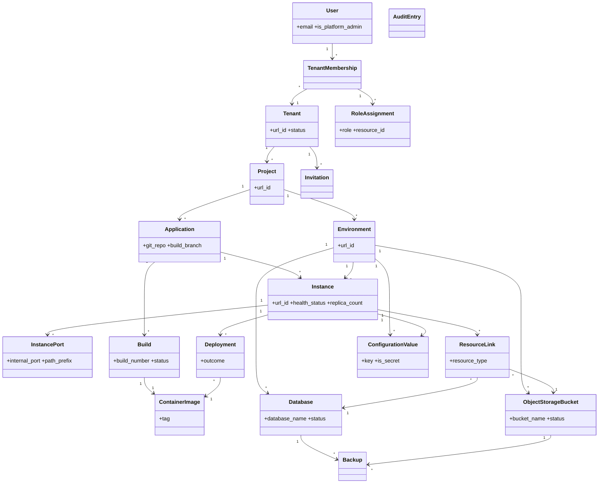

# Requirements: Operations Portal

**Domain:** DevOps / Platform-as-a-Service for technical business users [AI-SUGGESTED: AI-001] **Created:** 2026-04-30 **Status:** draft **Last finalised at:** 2026-04-30 [AI-SUGGESTED: AI-002]

> Inferred content is marked `[AI-SUGGESTED]` inline. Field-level marking when only some sub-fields are inferred; heading-level marking when the whole item is invented. The fill-every-field rule applies — no blanks.

---

## 1. Application context

**Name:** Operations Portal

**Purpose / business value:** Manages build, deployment, execution, and lifecycle operations for custom applications generated by the platform's AI agents. Allows technical business users (not professional developers or DevOps specialists) to run and manage what they build, by abstracting underlying container orchestration infrastructure into business-aligned concepts. Designed for consulting companies that deliver custom software to clients on a project basis, with on-premise installation also supported.

**Domain:** DevOps / Platform-as-a-Service for technical business users [AI-SUGGESTED: AI-001]

**Business goal:** Enable consulting companies and their technical business-user teams to operate AI-generated custom software without container orchestration or DevOps expertise, while preserving strict tenant and project isolation, full auditability, and enterprise-grade security. The immediate scope is an interactive prototype for stakeholder demo and feedback before committing to full development. [AI-SUGGESTED: AI-003]

<!-- rev: run-1 2026-04-30 -->

---

## 2. Domain model

> The BA's framing of the business domain in **ubiquitous language**, implementation-free.

### 2.1 Concepts

| Concept | Persistence | Definition (ubiquitous language) |
| --- | --- | --- |
| User | persistent | A person who uses the portal, uniquely identified by email; exists at system level and may belong to one or more tenants. |
| Tenant | persistent | A consulting company or organisation that holds projects; the top-level isolation boundary. |
| TenantMembership | persistent | The association by which a user belongs to a tenant. |
| Platform Administrator | persistent | A system-level role responsible for managing the platform itself — creating tenants, assigning initial tenant administrators, and overseeing tenant lifecycle (stored as a flag on User). |
| Project | persistent | A client engagement or initiative within a tenant; the access-isolation boundary for users and resources. |
| RoleAssignment | persistent | Grants a tenant member a role at tenant, project, or environment scope. |
| Environment | persistent | A logical grouping (e.g. dev, staging, production) within a project containing instances, databases, buckets, and configuration. |
| Application | persistent | A deployable unit of software, defined by a Git repository at project level. |
| Instance | persistent | The per-environment running form of an application, with its own health, configuration, and resource limits. |
| InstancePort | persistent | An exposed port mapping for an instance, with a path prefix for public routing. |
| Build | persistent | The process and record of compiling source code into a container image. |
| ContainerImage | persistent | A versioned, runnable container image produced by a build, stored in the registry. |
| Deployment | persistent | A record of deploying a container image to an instance, with outcome. |
| Database | persistent | A provisioned PostgreSQL database scoped to an environment. |
| ObjectStorageBucket | persistent | An S3-compatible bucket scoped to an environment. |
| ResourceLink | persistent | An association linking a database or bucket to an instance within the same environment. |
| ConfigurationValue | persistent | A key-value configuration entry scoped to an environment or instance; may be marked secret. |
| Invitation | persistent | A pending invitation for a user to join a tenant; deleted on acceptance or expiry. |
| AuditEntry | persistent | An immutable record of a significant action in the system. |
| Backup | persistent | A record of a backup operation for a database or bucket. |
| Notification | persistent | An asynchronous-operation completion notification delivered to the invoking user. [AI-SUGGESTED: AI-004] |
| Health Status | derived | The computed running condition of an instance (running / degraded / stopped / failed) based on replica health checks. |
| Build Trigger | policy | Rule that a push to an application's configured build branch (filtered to its subdirectory for monorepos) automatically initiates a build. |
| Image Retention Policy | policy | Rule that retains the latest build image, any deployed image, and the two most recently previously-deployed images per instance; all others are auto-deleted. |
| Backup Retention Policy | policy | Daily backups retained 7 days; weekly backups retained 30 days; schedule and retention not user-configurable. |
| Audit Retention Policy | policy | Audit entries retained for at least 1 year; older entries may be archived to cold storage but remain retrievable. |
| Configuration Precedence | policy | Instance-level configuration values override environment-level defaults where keys overlap (applies to plain values and secrets). |
| Tenant Suspension | policy | Suspended tenants block member access and stop running instances; data is preserved. |
| URL ID Convention | policy | Tenants, projects, environments, and instances each have an editable display name and an immutable url_id (lowercase alphanumeric + hyphens) used in DNS, URLs, and service discovery. |

### 2.2 Relationships

- User **belongs to** Tenant via TenantMembership [0..*:1..*]
- TenantMembership **holds** RoleAssignment [1:0..*]
- RoleAssignment **scopes to** Tenant or Project or Environment [polymorphic]
- Tenant **contains** Project [1:1..*]
- Project **contains** Environment [1:0..*]
- Project **contains** Application [1:0..*]
- Application **runs as** Instance in Environment [1:0..*]
- Instance **exposes** InstancePort [1:0..*]
- Application **produces** Build [1:0..*]
- Build **produces** ContainerImage [1:1]
- Instance **records** Deployment [1:0..*]
- Deployment **deploys** ContainerImage [*:1]
- Environment **contains** Database [1:0..*]
- Environment **contains** ObjectStorageBucket [1:0..*]
- Instance **links to** Database or ObjectStorageBucket via ResourceLink [0..*:0..*] (same-environment only)
- Environment or Instance **defines** ConfigurationValue [1:0..*]
- Tenant **invites** User via Invitation [1:0..*]
- User **performs** Action recorded as AuditEntry [1:0..*]
- Database or ObjectStorageBucket **is backed up by** Backup [1:0..*]
- User **receives** Notification for asynchronous operations they invoked [1:0..*] [AI-SUGGESTED: AI-005]

### 2.3 Aggregates & lifecycles

#### Tenant

| Field | Value |
| --- | --- |
| Member concepts | TenantMembership, RoleAssignment (tenant-scoped), Project, Invitation |
| Lifecycle states | Active → Suspended → Active (reactivation) → Deleted (only if Suspended and no running instances, databases, or buckets) |
| Key invariants | Each tenant must have at least one tenant administrator at all times (RBAC-07); deletion requires typing tenant url_id; suspension stops all running instances and blocks member access without deleting data; max 100 tenants system-wide (NFR-40). |

#### Project

| Field | Value |
| --- | --- |
| Member concepts | Environment, Application, RoleAssignment (project-scoped) |
| Lifecycle states | Active → Deleted (only when no associated resources) |
| Key invariants | All resources must belong to a project and must not be shared across projects (PRJ-03); users only see projects they are explicitly assigned to (PRJ-02); deletion blocked while resources exist (PRJ-07). |

#### Application

| Field | Value |
| --- | --- |
| Member concepts | Build, ContainerImage, Instance |
| Lifecycle states | Registered → Building → Buildable (with images) → Deleted (only if no running instances) |
| Key invariants | Each application has exactly one configured build branch; multiple applications may share a Git repository via subdirectory; deletion blocked while running instances exist (APP-07); applications have no url_id — referenced by display_name and internal id. |

#### Environment

| Field | Value |
| --- | --- |
| Member concepts | Instance, Database, ObjectStorageBucket, ConfigurationValue (environment-level) |
| Lifecycle states | Active → Deleted (only if no running instances, databases, or buckets) |
| Key invariants | Instances within the same environment can communicate; cross-environment communication is disabled by default (ENV-03, ENV-04); per-tenant environment limit governed by NFR-41 (100). |

#### Instance

| Field | Value |
| --- | --- |
| Member concepts | InstancePort, Deployment, ResourceLink, ConfigurationValue (instance-level) |
| Lifecycle states | Created → Running → Degraded → Failed → Stopped → Running (rolling updates with auto-rollback on health check failure) |
| Key invariants | Replica count 1–10 (INS-07); scaling to zero only via Stop action; rolling update is the only deployment strategy (INS-04); linked resources must be in the same environment (LNK-01); a new replica must pass health checks before any old replica is removed; failed rollouts auto-rollback to the previous version. |

#### Build

| Field | Value |
| --- | --- |
| Member concepts | ContainerImage, build log_output |
| Lifecycle states | Queued → In Progress → Succeeded \| Failed \| Cancelled |
| Key invariants | Build number is auto-incremented per application and is the primary user-facing version identifier; commit SHA is retained for traceability; system-wide build timeout auto-cancels overruns (BLD-12); cancelled builds are recorded as cancelled (BLD-14). |

#### Database

| Field | Value |
| --- | --- |
| Member concepts | Backup, ResourceLink |
| Lifecycle states | Provisioning → Available → Deleting → (deleted) ; Error from any state |
| Key invariants | Scoped to a single environment (DB-02); deletion blocked while linked to any instance; deletion confirmation by typing database name; schema migrations are the application's responsibility. |

#### ObjectStorageBucket

| Field | Value |
| --- | --- |
| Member concepts | Backup, ResourceLink |
| Lifecycle states | Provisioning → Available → Deleting → (deleted) ; Error from any state |
| Key invariants | Scoped to a single environment (OBJ-03); deletion blocked while linked to any instance; deletion confirmation by typing bucket name. |

### 2.4 Diagram (optional)

<!-- rev: run-1 2026-04-30 -->

---

## 3. Target users

> Target-user personas — the end users of the application being designed. Not to be confused with the Unicorn (LLM) or the Consultant (audience).

### Platform Administrator

| Field | Value |
| --- | --- |
| Role / job title | Platform Administrator (system-level operator of the portal installation) |
| Expertise level | High — comfortable with platform/infrastructure concepts; typically the consulting company's internal IT lead or the on-premise customer's platform owner. [AI-SUGGESTED: AI-006] |
| Stakes | Very high — controls tenant lifecycle for the entire installation; mistakes affect all tenants. |
| Frequency of use | Very low — a few times per year, tied to onboarding new tenants, suspension, and platform admin role changes. |
| Driving forces — wants | Reliable tenant onboarding, clear visibility of tenant status, clean separation from tenant-internal data, full audit trail. [AI-SUGGESTED: AI-007] |
| Driving forces — fears | Accidentally accessing tenant-internal data; deleting an active tenant; leaving the platform without an admin (PADM-08). [AI-SUGGESTED: AI-008] |

### Tenant Administrator

| Field | Value |
| --- | --- |
| Role / job title | Tenant Administrator — typically a consulting-company partner, delivery lead, or operations manager. [AI-SUGGESTED: AI-009] |
| Expertise level | Medium-high — comfortable with org/role concepts, OAuth/SSO providers, and project structure; not a DevOps specialist. [AI-SUGGESTED: AI-010] |
| Stakes | High — controls who has access to client engagements and tenant-wide identity/SSO settings. |
| Frequency of use | Low — weekly or as the team and client portfolio change. |
| Driving forces — wants | Quick user onboarding, clear directory of who has access to what, ability to enforce SSO-only login, confidence that membership changes are auditable. [AI-SUGGESTED: AI-011] |
| Driving forces — fears | Letting a former employee retain access; locking the tenant out by removing the last admin; accidentally deleting a project with live resources. [AI-SUGGESTED: AI-012] |

### Project Administrator

| Field | Value |
| --- | --- |
| Role / job title | Project Administrator — the lead for a specific client engagement. [AI-SUGGESTED: AI-013] |
| Expertise level | Medium-high — technically literate business user; understands environments, Git providers, role-based access, but not container orchestration. [AI-SUGGESTED: AI-014] |
| Stakes | High — owns environment topology, project-level integrations, and member roles for the engagement. |
| Frequency of use | Medium — daily project dashboard checks; environment and membership changes a few times per week. [AI-SUGGESTED: AI-015] |
| Driving forces — wants | A clear project dashboard, simple environment management, reliable Git integration, easy assignment of operators and viewers. [AI-SUGGESTED: AI-016] |
| Driving forces — fears | Losing track of which member has which role across environments; misconfigured Git credentials breaking builds; deleting an environment that still has resources. [AI-SUGGESTED: AI-017] |

### Operator

| Field | Value |
| --- | --- |
| Role / job title | Operator — technical business user who builds with AI agents and runs the resulting applications. |
| Expertise level | Medium — comfortable with Git, build/deploy concepts, configuration, and logs, but not Kubernetes or container orchestration internals. |
| Stakes | High in the moment — incorrect deploys or stopped instances directly affect running applications and clients. [AI-SUGGESTED: AI-018] |
| Frequency of use | Very high — multiple times per day; this persona generates the majority of portal traffic. |
| Driving forces — wants | Fastest path to deploy, fastest path to logs, immediate visibility of instance health, confidence that rollback is one click away. [AI-SUGGESTED: AI-019] |
| Driving forces — fears | Deploying a broken build to production; losing log context during an incident; accidentally deleting an instance, database, or bucket; not noticing a degraded instance. [AI-SUGGESTED: AI-020] |

### Viewer

| Field | Value |
| --- | --- |
| Role / job title | Viewer — read-only stakeholder (often the client, a QA engineer, or a non-technical project lead). [AI-SUGGESTED: AI-021] |
| Expertise level | Low-medium — wants to see status without having to interpret infrastructure terms. [AI-SUGGESTED: AI-022] |
| Stakes | Low — cannot change anything; risk is misreading status. [AI-SUGGESTED: AI-023] |
| Frequency of use | Very high for dashboard/log viewing during demos, releases, and support windows. [AI-SUGGESTED: AI-024] |
| Driving forces — wants | A clear at-a-glance picture of project health, easy navigation to logs and dashboards, masked secrets so they can be shown freely. [AI-SUGGESTED: AI-025] |
| Driving forces — fears | Misreporting status to stakeholders; accidentally trying an action they don't have rights for. [AI-SUGGESTED: AI-026] |

<!-- rev: run-1 2026-04-30 -->

---

## 4. User goals & stories

> Quality signals live on the goal (outcome-level), not the story (behaviour-level).

### 4.1 Goals catalogue

| ID | Goal statement | Quality signals | Goal kind | Layout pref (optional) | UX-pattern pref (optional) |
| --- | --- | --- | --- | --- | --- |
| G-01 | Sign in to the portal and reach my last-used tenant and project | low-friction; SSO-first; respects last-used context (USR-10) | top-level | enterprise console shell | SSO buttons + email/password fallback [AI-SUGGESTED: AI-027] |
| G-02 | Switch tenant context without re-authenticating | seamless; preserves session (AUTH-06) | sub-level | top bar tenant switcher [AI-SUGGESTED: AI-028] | dropdown/menu in header |
| G-03 | See the health of all environments and applications in my project at a glance | clear; ≤3 clicks to logs/health from dashboard (NFR-03) | top-level | project dashboard | summary cards + status badges [AI-SUGGESTED: AI-029] |
| G-04 | Deploy a specific build to an environment quickly and safely | reversible (rollback INS-05); rolling-update with auto-rollback (INS-04); deployable in ≤3 clicks from project dashboard (NFR-03) | top-level | environment overview | build picker + confirm modal [AI-SUGGESTED: AI-030] |
| G-05 | Diagnose a runtime issue using logs and metrics | log filters by time/keyword/severity (OBS-02); near-real-time tail (OBS-03); query results <5s for last 24h (NFR-31) | top-level | logs panel + metrics dashboard | log viewer with tail toggle; metric tiles [AI-SUGGESTED: AI-031] |
| G-06 | Build, view, and cancel application builds | build status visible (BLD-05); real-time and post-hoc logs (BLD-04); clear failure output (BLD-07) | sub-level | application detail → builds tab [AI-SUGGESTED: AI-032] | build history list + log streamer |
| G-07 | Manage application source linkage and build branch | edit branch (BLD-02); edit metadata (APP-06); validate Git repo at registration (APP-01) | sub-level | application settings [AI-SUGGESTED: AI-033] | form with validation feedback |
| G-08 | Manage instance lifecycle (start/stop/restart, scale, resource profile, health check) | one-click start/stop/restart (INS-03); scale 1–10 (INS-07); preset resource profiles (INS-10, INS-11) | sub-level | instance detail | inline action buttons + side panel form [AI-SUGGESTED: AI-034] |
| G-09 | Provision and manage databases for an environment | provisioning state visible (DB-03); deletion safety (DB-06) | sub-level | environment → databases tab [AI-SUGGESTED: AI-035] | resource list + provision wizard |
| G-10 | Provision and manage object storage buckets for an environment | usage visible (OBJ-05); deletion safety (OBJ-02) | sub-level | environment → buckets tab [AI-SUGGESTED: AI-036] | resource list + provision wizard |
| G-11 | Link/unlink databases and buckets to/from instances safely | same-environment-only (LNK-01); restart on link change (LNK-06); audited (LNK-08) | interaction-level | instance detail → linked resources panel | link/unlink action with restart-warning modal [AI-SUGGESTED: AI-037] |
| G-12 | Manage environment- and instance-level configuration values and secrets | precedence shown (CFG-02); secret values write-only (SEC-04); restart on change (CFG-03) | sub-level | configuration tab | key/value table with secret toggle [AI-SUGGESTED: AI-038] |
| G-13 | Expose an instance publicly via the API gateway | only via gateway (NET-02); generated public URL (NET-04); per-port path prefix routing | sub-level | instance → networking tab [AI-SUGGESTED: AI-039] | toggle + path/port editor |
| G-14 | Trigger and restore from backups | manual on-demand backup (NFR-62); restore confirmation (NFR-64); audited (NFR-65) | sub-level | resource detail → backups tab [AI-SUGGESTED: AI-040] | backup list + restore wizard |
| G-15 | Receive completion notifications for builds, deployments, and provisioning | retention last 50 / 30 days (NOT-03); covers builds, deployments, resource provisioning (NOT-02) | interaction-level | top bar notification tray [AI-SUGGESTED: AI-041] | toast + bell tray |
| G-16 | Invite, deactivate, and reactivate tenant members | email invitation with delivery-failure surfacing (USR-02); deactivation preserves audit history (USR-05) | sub-level | tenant → users page [AI-SUGGESTED: AI-042] | directory table + invite modal |
| G-17 | Manage user roles at tenant, project, and environment scope | granular four-level RBAC (RBAC-03); audited (RBAC-06); cannot remove last tenant admin (RBAC-07) | sub-level | role assignment matrix [AI-SUGGESTED: AI-043] | matrix or per-user editor |
| G-18 | Create, edit, and delete projects within a tenant | name/description editable (PRJ-06); deletion blocked while resources exist (PRJ-07) | sub-level | tenant → projects page [AI-SUGGESTED: AI-044] | list + create wizard |
| G-19 | Create, edit, and delete environments within a project | display name editable (ENV-08); deletion blocked while resources exist (ENV-09) | sub-level | project → environments page [AI-SUGGESTED: AI-045] | list + create wizard |
| G-20 | Search and inspect the audit trail | filterable by user/project/action/resource/time/environment (AUD-04); immutable (AUD-05) | sub-level | tenant → audit page [AI-SUGGESTED: AI-046] | filter form + paginated table |
| G-21 | Manage tenants at platform level (create, suspend, reactivate, delete) | requires url_id confirm to delete (PADM-06); platform admin cannot view tenant-internal data (PADM-04) | top-level | platform admin console | tenant list + side drawer detail [AI-SUGGESTED: AI-047] |
| G-22 | Grant and revoke the platform administrator role | cannot remove the last platform admin (PADM-08); audited (PADM-09) | sub-level | platform admin → admins page [AI-SUGGESTED: AI-048] | grantee picker + confirm modal |
| G-23 | View internal address and public URL of an instance | internal DNS surfaced (NET-01); generated URL surfaced (NET-04) | interaction-level | instance overview side panel [AI-SUGGESTED: AI-049] | copyable address fields |
| G-24 | View and edit own profile (display name) | password handled by IdP (USR-10) | interaction-level | profile menu | simple form |

### 4.2 Stories by persona

#### Platform Administrator <!-- → §3 -->

##### Story: As a Platform Administrator, I want to create a new tenant by specifying a display name, url_id, and first tenant admin, so that a consulting company can begin onboarding their team

| Field | Value |
| --- | --- |
| Goal | → §4.1 G-21 |
| Objective | Create a new tenant with first admin in a single guided flow, and have it immediately appear in the tenant list. |
| Context (frequency / expertise / stakes) | Very low / high / very high — handled by the platform owner; mistakes affect tenant onboarding. |
| Linked task flow (optional) | → §5 Flow: Create tenant |

##### Story: As a Platform Administrator, I want to suspend or reactivate a tenant, so that I can immediately stop access without losing data

| Field | Value |
| --- | --- |
| Goal | → §4.1 G-21 |
| Objective | Suspend a tenant and confirm all running instances stop; reactivate later with full restoration of access. |
| Context (frequency / expertise / stakes) | Very low / high / very high. |
| Linked task flow (optional) | → §5 Flow: Suspend tenant |

##### Story: As a Platform Administrator, I want to delete a suspended tenant after confirming its url_id, so that I can permanently remove an empty tenant from the platform

| Field | Value |
| --- | --- |
| Goal | → §4.1 G-21 |
| Objective | Permanently delete a suspended tenant only when no running instances, databases, or buckets remain (PADM-06). |
| Context (frequency / expertise / stakes) | Very low / high / very high. |
| Linked task flow (optional) | → §5 Flow: Delete tenant |

##### Story: As a Platform Administrator, I want to grant or revoke the platform administrator role, so that the right people can run the platform without ever leaving the platform without an admin

| Field | Value |
| --- | --- |
| Goal | → §4.1 G-22 |
| Objective | Grant/revoke is_platform_admin with the system preventing removal of the last platform admin (PADM-08). |
| Context (frequency / expertise / stakes) | Very low / high / very high. |
| Linked task flow (optional) | → §5 Flow: Grant platform admin |

##### Story: As a Platform Administrator, I want to view a list of all tenants and a per-tenant summary, so that I can monitor the platform without seeing tenant-internal data

| Field | Value |
| --- | --- |
| Goal | → §4.1 G-21 |
| Objective | See display name, status, creation date, and project count per tenant; drill into per-tenant summary (PADM-04, PADM-10). |
| Context (frequency / expertise / stakes) | Medium / high / very high. |
| Linked task flow (optional) | — |

##### Story: As a Platform Administrator, I want to view the platform audit trail, so that I can investigate platform-level actions

| Field | Value |
| --- | --- |
| Goal | → §4.1 G-20 |
| Objective | Search and filter platform-scoped audit entries (PADM-09, AUD-01). |
| Context (frequency / expertise / stakes) | Medium / high / very high. |
| Linked task flow (optional) | — |

#### Tenant Administrator <!-- → §3 -->

##### Story: As a Tenant Administrator, I want to invite users by email and re-send failed invitations, so that I can onboard team members quickly

| Field | Value |
| --- | --- |
| Goal | → §4.1 G-16 |
| Objective | Invite by email, see delivery status, re-send if delivery failed (USR-01, USR-02). |
| Context (frequency / expertise / stakes) | Low / medium-high / high. |
| Linked task flow (optional) | → §5 Flow: Invite user |

##### Story: As a Tenant Administrator, I want to deactivate or reactivate a member's tenant membership, so that I can revoke or restore access without losing audit history

| Field | Value |
| --- | --- |
| Goal | → §4.1 G-16 |
| Objective | Deactivate/reactivate while preserving audit attribution (USR-05, USR-06). |
| Context (frequency / expertise / stakes) | Low / medium-high / high. |
| Linked task flow (optional) | — |

##### Story: As a Tenant Administrator, I want to create a project (display name, url_id, description), so that a new client engagement has its own isolated workspace

| Field | Value |
| --- | --- |
| Goal | → §4.1 G-18 |
| Objective | Create a project with valid url_id and description (PRJ-01, PRJ-06). |
| Context (frequency / expertise / stakes) | Low / medium-high / high. |
| Linked task flow (optional) | → §5 Flow: Create project |

##### Story: As a Tenant Administrator, I want to delete an empty project, so that retired engagements are cleaned up

| Field | Value |
| --- | --- |
| Goal | → §4.1 G-18 |
| Objective | Delete only when no resources remain (PRJ-07). |
| Context (frequency / expertise / stakes) | Very low / medium-high / high. |
| Linked task flow (optional) | → §5 Flow: Delete project |

##### Story: As a Tenant Administrator, I want to assign tenant members to projects with specific roles, so that access matches engagement responsibilities

| Field | Value |
| --- | --- |
| Goal | → §4.1 G-17 |
| Objective | Assign/remove project membership and choose role at project or environment scope (RBAC-03, USR-08). |
| Context (frequency / expertise / stakes) | Low / medium-high / high. |
| Linked task flow (optional) | — |

##### Story: As a Tenant Administrator, I want to configure tenant settings (display name, allowed identity providers), so that the tenant matches my organisation's identity policy

| Field | Value |
| --- | --- |
| Goal | → §4.1 G-17 |
| Objective | Edit display name and toggle SSO providers; cannot disable email/password without ≥1 SSO enabled (AUTH-04, TEN-07). |
| Context (frequency / expertise / stakes) | Very low / medium-high / high. |
| Linked task flow (optional) | — |

##### Story: As a Tenant Administrator, I want to view the tenant audit trail, so that I can see who did what across my tenant

| Field | Value |
| --- | --- |
| Goal | → §4.1 G-20 |
| Objective | Search/filter audit entries scoped to my tenant (AUD-04). |
| Context (frequency / expertise / stakes) | Medium / medium-high / high. |
| Linked task flow (optional) | — |

#### Project Administrator <!-- → §3 -->

##### Story: As a Project Administrator, I want a project dashboard that summarises environments, applications, and statuses, so that I have one place to see project health

| Field | Value |
| --- | --- |
| Goal | → §4.1 G-03 |
| Objective | Open the project and see all environments, all applications, and their current state (PRJ-08). |
| Context (frequency / expertise / stakes) | Very high / medium-high / high. |
| Linked task flow (optional) | — |

##### Story: As a Project Administrator, I want to create and edit environments, so that I can match the engagement's promotion topology

| Field | Value |
| --- | --- |
| Goal | → §4.1 G-19 |
| Objective | Create environments with display name and url_id; edit display name; delete only when empty (ENV-01, ENV-08, ENV-09). |
| Context (frequency / expertise / stakes) | Low / medium-high / high. |
| Linked task flow (optional) | → §5 Flow: Create environment |

##### Story: As a Project Administrator, I want to manage Git provider integrations for the project, so that applications can build from GitHub or BitBucket

| Field | Value |
| --- | --- |
| Goal | → §4.1 G-07 |
| Objective | Add and rotate Git credentials stored as project-level secrets (APP-02). |
| Context (frequency / expertise / stakes) | Low / medium-high / high. |
| Linked task flow (optional) | — |

##### Story: As a Project Administrator, I want to manage members and their roles within my project, so that operators and viewers have the right access

| Field | Value |
| --- | --- |
| Goal | → §4.1 G-17 |
| Objective | Assign/remove members and edit per-environment roles (USR-07, USR-08). |
| Context (frequency / expertise / stakes) | Low / medium-high / high. |
| Linked task flow (optional) | — |

##### Story: As a Project Administrator, I want to edit project name and description, so that the engagement is correctly labelled

| Field | Value |
| --- | --- |
| Goal | → §4.1 G-18 |
| Objective | Edit name/description (PRJ-06). |
| Context (frequency / expertise / stakes) | Low / medium-high / high. |
| Linked task flow (optional) | — |

#### Operator <!-- → §3 -->

##### Story: As an Operator, I want to register a new application by linking a Git repository, so that I can begin building and deploying it

| Field | Value |
| --- | --- |
| Goal | → §4.1 G-07 |
| Objective | Choose provider, repo, branch, optional subdirectory, with repo accessibility validated at registration (APP-01, APP-03). |
| Context (frequency / expertise / stakes) | Low / medium / high. |
| Linked task flow (optional) | → §5 Flow: Register application |

##### Story: As an Operator, I want to view the list and details of applications in my project, so that I can navigate to whichever one I need to work on

| Field | Value |
| --- | --- |
| Goal | → §4.1 G-03 |
| Objective | List all apps; drill into details with per-environment instance breakdown (APP-04, APP-05). |
| Context (frequency / expertise / stakes) | Very high / medium / high. |
| Linked task flow (optional) | — |

##### Story: As an Operator, I want to see build history, watch in-progress builds, and view build logs, so that I can confirm what produced each container

| Field | Value |
| --- | --- |
| Goal | → §4.1 G-06 |
| Objective | See build number, status, trigger, commit, duration, and stream logs in real time (BLD-04, BLD-05, BLD-06). |
| Context (frequency / expertise / stakes) | Very high / medium / high. |
| Linked task flow (optional) | — |

##### Story: As an Operator, I want to manually trigger or cancel a build, so that I can produce or stop a build on demand

| Field | Value |
| --- | --- |
| Goal | → §4.1 G-06 |
| Objective | Manual trigger (BLD-13) and cancel-in-progress (BLD-14) with cancelled status preserved. |
| Context (frequency / expertise / stakes) | Medium / medium / high. |
| Linked task flow (optional) | — |

##### Story: As an Operator, I want to deploy a specific build to an instance and roll back if needed, so that I can ship safely and recover quickly

| Field | Value |
| --- | --- |
| Goal | → §4.1 G-04 |
| Objective | Pick a build number, deploy via rolling update with auto-rollback on health failure (INS-01, INS-04, INS-05). |
| Context (frequency / expertise / stakes) | High / medium / high. |
| Linked task flow (optional) | → §5 Flow: Deploy build to instance |

##### Story: As an Operator, I want to start, stop, restart, scale, and adjust resource profile of an instance, so that I can respond to load and incidents

| Field | Value |
| --- | --- |
| Goal | → §4.1 G-08 |
| Objective | One-click lifecycle actions; scale 1–10; choose Small/Medium/Large profile; override health check (INS-03, INS-07, INS-10, INS-14). |
| Context (frequency / expertise / stakes) | Medium / medium / high. |
| Linked task flow (optional) | — |

##### Story: As an Operator, I want to view instance health per environment, so that I can spot degraded or failed instances at a glance

| Field | Value |
| --- | --- |
| Goal | → §4.1 G-03 |
| Objective | See running/degraded/stopped/failed status on every instance in each environment (INS-09, ENV-05). |
| Context (frequency / expertise / stakes) | Very high / medium / high. |
| Linked task flow (optional) | — |

##### Story: As an Operator, I want to view, filter, and tail instance logs, so that I can debug issues quickly

| Field | Value |
| --- | --- |
| Goal | → §4.1 G-05 |
| Objective | Filter by time/keyword/severity and tail in near real-time within retention (OBS-02, OBS-03, OBS-13). |
| Context (frequency / expertise / stakes) | Very high / medium / high. |
| Linked task flow (optional) | → §5 Flow: Investigate runtime issue |

##### Story: As an Operator, I want to see metrics dashboards for instances, so that I can monitor CPU, memory, errors, restarts, and (for public instances) request rate and latency

| Field | Value |
| --- | --- |
| Goal | → §4.1 G-05 |
| Objective | View native built-in dashboards with default metrics (OBS-11, OBS-12). |
| Context (frequency / expertise / stakes) | High / medium / high. |
| Linked task flow (optional) | — |

##### Story: As an Operator, I want to manage environment- and instance-level configuration values and secrets, so that I can configure each instance correctly

| Field | Value |
| --- | --- |
| Goal | → §4.1 G-12 |
| Objective | Add/edit/delete config; create/rotate secrets; see precedence; restart-on-change behaviour (CFG-01 to CFG-05, SEC-01 to SEC-08). |
| Context (frequency / expertise / stakes) | Medium / medium / high. |
| Linked task flow (optional) | → §5 Flow: Update configuration |

##### Story: As an Operator, I want to provision and manage databases and object storage buckets in an environment, so that my applications have the resources they need

| Field | Value |
| --- | --- |
| Goal | → §4.1 G-09, G-10 |
| Objective | Provision, view, delete (with confirmation when not linked) databases and buckets (DB-01 to DB-06, OBJ-01 to OBJ-05). |
| Context (frequency / expertise / stakes) | Low / medium / high. |
| Linked task flow (optional) | — |

##### Story: As an Operator, I want to link/unlink databases and buckets to/from instances, so that connection details are auto-injected and updated on change

| Field | Value |
| --- | --- |
| Goal | → §4.1 G-11 |
| Objective | Link/unlink in same environment with auto-restart on change (LNK-01, LNK-02, LNK-04, LNK-06). |
| Context (frequency / expertise / stakes) | Low / medium / high. |
| Linked task flow (optional) | → §5 Flow: Link resource to instance |

##### Story: As an Operator, I want to expose an instance publicly via the API gateway and view its public URL, so that external traffic can reach it

| Field | Value |
| --- | --- |
| Goal | → §4.1 G-13 |
| Objective | Toggle public exposure, configure ports/path prefixes, copy generated URL (NET-02, NET-03, NET-04). |
| Context (frequency / expertise / stakes) | Low / medium / high. |
| Linked task flow (optional) | — |

##### Story: As an Operator, I want to trigger manual backups and restore from a backup, so that I can protect data before risky changes and recover from problems

| Field | Value |
| --- | --- |
| Goal | → §4.1 G-14 |
| Objective | Manual backup; restore to same or different environment within the project with confirmation (NFR-62, NFR-64). |
| Context (frequency / expertise / stakes) | Low / medium / high. |
| Linked task flow (optional) | → §5 Flow: Restore from backup |

##### Story: As an Operator, I want to receive notifications for completed asynchronous operations, so that I don't have to keep refreshing pages

| Field | Value |
| --- | --- |
| Goal | → §4.1 G-15 |
| Objective | See completion notifications for builds, deployments, and resource provisioning (NOT-01, NOT-02). |
| Context (frequency / expertise / stakes) | High / medium / high. [AI-SUGGESTED: AI-050] |
| Linked task flow (optional) | — |

##### Story: As an Operator, I want to search the audit trail for actions on my project, so that I can understand what changed and when

| Field | Value |
| --- | --- |
| Goal | → §4.1 G-20 |
| Objective | Filter by user/project/action/resource/time/environment within scope (AUD-04). |
| Context (frequency / expertise / stakes) | Medium / medium / high. |
| Linked task flow (optional) | — |

#### Viewer <!-- → §3 -->

##### Story: As a Viewer, I want to view the project dashboard and environment overviews, so that I can see status without changing anything

| Field | Value |
| --- | --- |
| Goal | → §4.1 G-03 |
| Objective | Read-only access to project dashboard and environment overview (PRJ-08, ENV-05). |
| Context (frequency / expertise / stakes) | Very high / low-medium / low. |
| Linked task flow (optional) | — |

##### Story: As a Viewer, I want to view application list and detail, build history, and deployment history, so that I can track what was shipped

| Field | Value |
| --- | --- |
| Goal | → §4.1 G-06 |
| Objective | Read-only access to apps, builds, deployments (APP-04, APP-05, BLD-06, INS-06). |
| Context (frequency / expertise / stakes) | Very high / low-medium / low. |
| Linked task flow (optional) | — |

##### Story: As a Viewer, I want to view logs and metrics dashboards, so that I can monitor live behaviour

| Field | Value |
| --- | --- |
| Goal | → §4.1 G-05 |
| Objective | Read-only logs filter/tail; metrics dashboards (OBS-02, OBS-03, OBS-11, OBS-12). |
| Context (frequency / expertise / stakes) | Very high / low-medium / low. |
| Linked task flow (optional) | — |

##### Story: As a Viewer, I want to view configuration values with secrets masked, so that I can verify configuration safely

| Field | Value |
| --- | --- |
| Goal | → §4.1 G-12 |
| Objective | Read-only configuration; secret values are not displayed (CFG-01, CFG-02, SEC-04). |
| Context (frequency / expertise / stakes) | Medium / low-medium / low. |
| Linked task flow (optional) | — |

##### Story: As a Viewer, I want to view databases, buckets, and backup status, so that I know data resources are healthy

| Field | Value |
| --- | --- |
| Goal | → §4.1 G-09, G-10, G-14 |
| Objective | Read-only resource and backup-status views (DB-03, OBJ-02, NFR-63). |
| Context (frequency / expertise / stakes) | Medium / low-medium / low. |
| Linked task flow (optional) | — |

#### All authenticated users <!-- → §3 -->

##### Story: As any authenticated user, I want to log in via SSO or email/password and be returned to my last-used tenant and project, so that I can resume work quickly

| Field | Value |
| --- | --- |
| Goal | → §4.1 G-01 |
| Objective | Sign in via Google, Microsoft, OIDC, or email/password (if enabled) and route to last-used context (AUTH-01 to AUTH-04, USR-10). |
| Context (frequency / expertise / stakes) | High / mixed / high. |
| Linked task flow (optional) | → §5 Flow: Sign in |

##### Story: As a multi-tenant user, I want to switch tenant context without re-authenticating, so that I can move between client engagements quickly

| Field | Value |
| --- | --- |
| Goal | → §4.1 G-02 |
| Objective | Switch tenant within a single authenticated session (AUTH-06, TEN-06). |
| Context (frequency / expertise / stakes) | Medium / mixed / medium. |
| Linked task flow (optional) | — |

##### Story: As any authenticated user, I want to view and edit my own profile (display name) and log out, so that I control my identity in the portal

| Field | Value |
| --- | --- |
| Goal | → §4.1 G-24 |
| Objective | Edit display name; log out (USR-10, AUTH-05). |
| Context (frequency / expertise / stakes) | Low / mixed / low. |
| Linked task flow (optional) | — |

---

## 5. Task flows

### Flow: Sign in

| Field | Value |
| --- | --- |
| Actor | All personas (→ §3) |
| Trigger | User opens the portal URL while unauthenticated. |
| Steps | 1) User reaches login screen. 2) User chooses an enabled identity provider (Google, Microsoft, OIDC) or email/password. 3) IdP authenticates the user. 4) Portal establishes session. 5) Portal routes user to last-used tenant and last-used project (or to a tenant chooser if no last-used or membership in multiple tenants without a default). |
| Decision points | If email/password is disabled by the tenant, only SSO buttons are shown (AUTH-04). If user has a single tenant membership, route directly to that tenant; otherwise show tenant chooser. [AI-SUGGESTED: AI-051] |
| Exception paths | Authentication failure → return to login screen with an inline error and recorded failed-attempt audit entry (AUTH-05). Session timeout → redirect to login (AUTH-06). |
| Role-conditional behaviour | Platform Administrators may have no tenant membership; route them to the platform admin console instead of a tenant chooser. [AI-SUGGESTED: AI-052] |

### Flow: Create tenant

| Field | Value |
| --- | --- |
| Actor | Platform Administrator |
| Trigger | Admin clicks "Create tenant" in the platform admin console. |
| Steps | 1) Enter display name and url_id. 2) Specify first tenant administrator (existing portal user email or new email). 3) Confirm. 4) Portal creates Tenant (active), creates the user if needed, creates TenantMembership, and assigns tenant_admin RoleAssignment. 5) Send invitation email if user is new. |
| Decision points | If url_id is not unique or fails the lowercase alphanumeric+hyphens rule, block submission with inline validation. |
| Exception paths | Email delivery to first admin fails → admin sees a failure indicator and can re-send (USR-02). |
| Role-conditional behaviour | Only Platform Admins can perform this flow (PADM-02, PADM-03). |

### Flow: Suspend tenant

| Field | Value |
| --- | --- |
| Actor | Platform Administrator |
| Trigger | Admin selects "Suspend" on a tenant row. |
| Steps | 1) Confirm intent. 2) Portal sets tenant.status = suspended, blocks all member access, and stops all running instances. 3) Audit entry written. |
| Decision points | None — suspension is reversible. |
| Exception paths | Stop-instance failure does not block suspension; failed stops are recorded for retry. [AI-SUGGESTED: AI-053] |
| Role-conditional behaviour | Platform Admin only (PADM-05). |

### Flow: Delete tenant

| Field | Value |
| --- | --- |
| Actor | Platform Administrator |
| Trigger | Admin selects "Delete" on a suspended tenant. |
| Steps | 1) Verify tenant is suspended and has no running instances, databases, or buckets. 2) Admin types the tenant url_id to confirm. 3) Portal performs permanent deletion. 4) Audit entry written (PADM-06, PADM-09). |
| Decision points | Block if tenant is not suspended OR if any running instances/DBs/buckets remain. |
| Exception paths | Mismatch between typed url_id and tenant url_id → keep dialog open with error. |
| Role-conditional behaviour | Platform Admin only. |

### Flow: Grant platform admin

| Field | Value |
| --- | --- |
| Actor | Platform Administrator |
| Trigger | Admin grants/revokes the role from a user. |
| Steps | 1) Select user. 2) Toggle is_platform_admin. 3) Confirm. 4) Audit entry written. |
| Decision points | Block revocation if it would leave zero platform admins (PADM-08). |
| Exception paths | — |
| Role-conditional behaviour | Platform Admin only. |

### Flow: Invite user

| Field | Value |
| --- | --- |
| Actor | Tenant Administrator (also Project Administrator per USR-08) |
| Trigger | Admin clicks "Invite user". |
| Steps | 1) Enter email; optionally select project and role. 2) If user does not exist, create user account; create Invitation. 3) Send invitation email. 4) On acceptance, create TenantMembership and (if specified) project RoleAssignment, then delete Invitation. |
| Decision points | If email matches existing portal user → create only the missing TenantMembership; skip account creation (USR-01). |
| Exception paths | Email delivery failure → log, surface to inviter, allow re-send (USR-02, T-TEN-03). |
| Role-conditional behaviour | Project Admins inviting → invitee is auto-assigned to that project (USR-08). |

### Flow: Create project

| Field | Value |
| --- | --- |
| Actor | Tenant Administrator |
| Trigger | Admin clicks "Create project". |
| Steps | 1) Enter display name, url_id, optional description. 2) Submit. 3) Portal creates Project. |
| Decision points | url_id must be unique within the tenant and match the lowercase alphanumeric+hyphens rule. |
| Exception paths | Validation failure → inline error. |
| Role-conditional behaviour | Tenant Admin only. |

### Flow: Delete project

| Field | Value |
| --- | --- |
| Actor | Tenant Administrator |
| Trigger | Admin selects "Delete" on a project row. |
| Steps | 1) Portal verifies project has no resources. 2) Admin confirms. 3) Project deleted; audit entry written (PRJ-07). |
| Decision points | Block deletion if any environments, applications, databases, buckets, or secrets exist. |
| Exception paths | — |
| Role-conditional behaviour | Tenant Admin only. |

### Flow: Create environment

| Field | Value |
| --- | --- |
| Actor | Project Administrator |
| Trigger | Admin clicks "Create environment". |
| Steps | 1) Enter display name and url_id. 2) Submit. 3) Portal creates Environment within project. |
| Decision points | Tenant must not exceed NFR-41 environment limit (100 across all projects). |
| Exception paths | Validation failure → inline error. |
| Role-conditional behaviour | Project Admin only (ENV-01). |

### Flow: Register application

| Field | Value |
| --- | --- |
| Actor | Operator (or Project Administrator) [AI-SUGGESTED: AI-054] |
| Trigger | Operator clicks "Register application" in the project. |
| Steps | 1) Choose Git provider (GitHub or BitBucket). 2) Enter repository URL, build branch, optional subdirectory. 3) Portal validates repo accessibility using project Git credentials (APP-01). 4) Save Application; build is not yet triggered. |
| Decision points | If repo not accessible → block registration with clear error. |
| Exception paths | Credentials become invalid later → builds will fail with clear error message (APP-01). |
| Role-conditional behaviour | Requires permission to manage applications. |

### Flow: Deploy build to instance

| Field | Value |
| --- | --- |
| Actor | Operator |
| Trigger | Operator clicks "Deploy" on an instance. |
| Steps | 1) Choose target build (build number) from successful builds for the application. 2) Confirm. 3) Portal performs rolling update: spin up new replica, wait for health check, remove old replica, repeat until all replicas updated. 4) Record Deployment with outcome (INS-01, INS-04, INS-06). |
| Decision points | If a new replica fails health checks → automatically halt rollout and roll back to previous version, record outcome rolled_back. |
| Exception paths | Total rollout failure → instance returns to previous build; deployment recorded as failed/rolled_back. |
| Role-conditional behaviour | Requires deploy permission on the environment (e.g., env_operator or project_operator). |

### Flow: Investigate runtime issue

| Field | Value |
| --- | --- |
| Actor | Operator (or Viewer in read-only mode) |
| Trigger | Operator notices a degraded/failed instance or receives a report. |
| Steps | 1) Open environment overview, identify the affected instance (INS-09, ENV-05). 2) Open instance logs; filter by time, keyword, severity (OBS-02). 3) Tail logs for live behaviour (OBS-03). 4) Open metrics dashboard for CPU/memory/errors/restarts (and request/latency if publicly exposed) (OBS-12). 5) Decide on action: restart instance, roll back, or update configuration. |
| Decision points | If issue caused by a recent deploy → roll back to previous build (INS-05). If caused by configuration → update config and accept that instance will restart (CFG-03). |
| Exception paths | Logs older than retention window unavailable (OBS-13). |
| Role-conditional behaviour | Viewers can only view; only operators can take corrective actions. |

### Flow: Update configuration

| Field | Value |
| --- | --- |
| Actor | Operator |
| Trigger | Operator opens the configuration tab on an environment or instance. |
| Steps | 1) Add/edit/delete key-value pair. 2) Optionally mark new entry as secret at creation. 3) Save. 4) Portal applies change and automatically restarts the affected instance(s) (CFG-03). |
| Decision points | If marking secret → value field becomes write-only after save; cannot be unmarked later (SEC-04, CFG-05). |
| Exception paths | Restart failure → instance enters failed state and surfaces in logs/metrics. [AI-SUGGESTED: AI-055] |
| Role-conditional behaviour | Requires config-management permission on the scope. |

### Flow: Link resource to instance

| Field | Value |
| --- | --- |
| Actor | Operator |
| Trigger | Operator chooses "Link database/bucket" from the instance's Linked Resources view or from the resource detail drawer on the environment overview (T-LNK-02). |
| Steps | 1) Pick a database or bucket from the same environment (LNK-01). 2) Confirm. 3) Portal injects connection details (LNK-02 / LNK-04). 4) Instance is automatically restarted on subsequent unlink/delete (LNK-06, LNK-07). |
| Decision points | Block if resource is in a different environment. |
| Exception paths | Resource later deleted → all links removed and instances restarted automatically (LNK-07). |
| Role-conditional behaviour | Requires resource-link permission on the environment. |

### Flow: Restore from backup

| Field | Value |
| --- | --- |
| Actor | Operator |
| Trigger | Operator picks "Restore" on a backup point. |
| Steps | 1) Choose target (same or different environment within the project). 2) Confirm intent. 3) Portal overwrites target resource with backup contents. 4) Linked instances are automatically restarted on completion (NFR-64). 5) Audit entry written (NFR-65). |
| Decision points | Restore must require explicit confirmation and is destructive on the target. |
| Exception paths | Restore failure → previous state preserved where possible; failure surfaced in notifications and audit. [AI-SUGGESTED: AI-056] |
| Role-conditional behaviour | Requires backup/restore permission. |

---

## 6. Requirements

### 6.1 Functional

- **Authentication & identity** — Support login via Google OAuth 2.0, Microsoft (Azure AD/Entra ID), OIDC, and email/password. Tenant administrators may disable email/password to enforce SSO-only login if at least one SSO provider is enabled. Record all auth events in the audit trail. Provide a single authenticated session for users with multiple tenant memberships and allow tenant-context switching without re-auth (AUTH-01 to AUTH-06).
- **Multi-tenancy & project isolation** — Support up to 100 tenants with full data, compute, database, and storage isolation. Enforce strict project access isolation. Tenant administrators manage memberships, roles, and projects. Tenant configuration includes display name and allowed identity providers. (TEN-01 to TEN-07, PRJ-01 to PRJ-08)
- **Platform administration** — Provide a Platform Administrator role above tenants for tenant lifecycle (create, suspend, reactivate, delete with url_id confirmation), per-tenant summaries that exclude tenant-internal data, and platform admin role grant/revoke with last-admin protection. All platform actions audited. (PADM-01 to PADM-10)
- **RBAC** — Enforce RBAC for all operations with assignment at platform, tenant, project, and environment scope. Default roles: Platform Admin, Tenant Admin, Project Admin, Operator, Viewer. No custom roles in v1. Audit all role changes. Always preserve at least one tenant administrator per tenant. (RBAC-01, RBAC-03 to RBAC-07)
- **User management** — Invite users by email; create user account if new; send invitation; surface delivery failures and allow re-send. Provide user directory at tenant and project level (with last login). Deactivate/reactivate tenant memberships. Project admins assign existing tenant members to their project, manage roles, and may invite new users (auto-assigned to that project). Users may view/edit their own display name; password is handled by the IdP. Audit all user-management actions. (USR-01 to USR-10)
- **Application management** — Register an application within a project by linking a GitHub or BitBucket repo with a configured build branch and optional subdirectory. Validate accessibility at registration. Multiple applications may share a repo via subdirectories. Provide list and detail views including per-environment instance build number and health. Edit metadata. Delete only when no running instances exist. Git credentials stored as project-level secrets. (APP-01 to APP-07)
- **Resource linking** — Link databases or object storage buckets to instances within the same environment. On link, auto-inject non-sensitive details as configuration and credentials as secrets. Provide list of linked resources per instance. Unlink restarts the instance. Resource deletion auto-removes all links and restarts affected instances. Audit link/unlink. (LNK-01, LNK-02, LNK-04 to LNK-08)
- **Build & containerisation** — Built-in build system that produces container images without external CI; auto-trigger on build-branch changes (filtered to subdirectory for monorepos); manual trigger and cancel; produce versioned images tagged with commit SHA and a per-application sequential build number; capture and stream build logs in real time and after; record build history; surface clear errors; standard build image with fixed resources and system-wide timeout that auto-cancels overruns. (BLD-01 to BLD-07, BLD-12 to BLD-14)
- **Container registry** — Built-in registry with tenant/project isolation; auto-push successful builds; image retention policy retains latest build, currently deployed images, and the two most recent previously-deployed images per instance. (REG-01 to REG-04)
- **Environment management** — Project admins define environments within a project; each is logically isolated with its own instances, configuration, databases, and storage; intra-environment networking allowed; cross-environment networking disabled by default; environment-level configuration and secrets serve as defaults overridden at instance level; no automated promotion; edit display name; delete only when empty. (ENV-01 to ENV-09)
- **Instance management** — Deploy a specific build to an instance via rolling update with auto-rollback on health-check failure; start/stop/restart; configure replicas 1–10 (stop = 0 replicas; start restores prior count); roll back to a previous build; record deployment history; preset resource profiles (Small/Medium/Large) within tenant/project constraints; default health check HTTP GET on port 8080 path `/health` expecting 200; users may override path and port. (INS-01 to INS-07, INS-09 to INS-11, INS-13, INS-14)
- **Database management** — Provision PostgreSQL databases scoped to environment; isolated at the database level (no shared schemas); list with status and linked instances; auto-inject connection details on link; deletion blocked while linked, otherwise requires typing database name; backups via platform backup system; schema migrations are the application's responsibility. (DB-01 to DB-07)
- **Object storage** — Provision S3-compatible buckets scoped to environment; create/view/delete with deletion blocked while linked, otherwise requires typing bucket name; auto-inject access credentials on link; display object count and total size; included in platform backup. (OBJ-01 to OBJ-06)
- **Configuration management** — Define environment-level and instance-level key-value configuration; instance overrides environment where keys overlap; changes auto-restart affected instances; values may be marked secret at creation (write-only thereafter; to change, delete and recreate as plain). (CFG-01 to CFG-03, CFG-05)
- **Secrets management** — Store sensitive values encrypted at rest in a dedicated secrets backend; injectable into instances; values write-only after creation (metadata visible); access and modification audited; scope to environment with optional instance-level overrides; rotate by creating a new version; metadata-only version history. (SEC-01 to SEC-08)
- **Networking & API gateway** — Internal DNS by instance url_id within environment; instances private by default; API gateway for public exposure with per-port path-prefix routing and a generated default URL `<app>.<env>.<project>.<tenant>.<portal-domain>`. (NET-01 to NET-04)
- **Observability** — Collect logs from all instances; per-instance viewer with time/keyword/severity filtering and near-real-time tail; collect metrics from instances and infrastructure; native built-in dashboards including CPU/memory, error rates, container restarts, and (for publicly exposed instances) request rates and latencies; logs retained 30 days, metrics 90 days; older data auto-purged. (OBS-01 to OBS-03, OBS-10 to OBS-13)
- **Notifications** — Deliver completion notifications to the user who invoked an asynchronous operation, covering build start/completion (succeeded/failed/cancelled), deployment start/completion (succeeded/failed/rolled-back), and resource provisioning start/completion. Per-user retention: last 50 or 30 days, whichever is smaller. (NOT-01 to NOT-03)
- **Audit trail** — Maintain a full operational audit trail covering platform admin actions, auth events, user/role management, project lifecycle, application/build/instance/resource/config/secret/database/environment/network actions; record timestamp, user, tenant, project, environment, action, target, outcome; searchable/filterable; immutable; retained at least 1 year with cold-storage archival permitted. (AUD-01 to AUD-06)
- **Backup & recovery** — Automatic platform-managed backups of all stateful resources on a single platform-defined schedule (daily, with 7-day daily and 30-day weekly retention); manual on-demand backups for a database or bucket; per-project visibility of backup status; restore to same or different environment in the same project with explicit confirmation and auto-restart of linked instances; backup/restore audited. (NFR-60 to NFR-66)

### 6.2 Business rules

| ID | Statement (when / then) | Enforcement point | Source | Severity |
| --- | --- | --- | --- | --- |
| BR-01 | When a tenant has only one tenant administrator, then the system must prevent any action (role reassignment, deactivation, or membership removal) that would leave the tenant with zero tenant administrators. | service / cross-layer | RBAC-07 | blocker |
| BR-02 | When a tenant is suspended, then all member access is blocked and all running instances are stopped (data preserved). | service | PADM-05 | blocker |
| BR-03 | When deleting a tenant, then the tenant must be suspended AND have no running instances, databases, or storage buckets, AND the actor must type the tenant url_id to confirm. | UI / service | PADM-06 | blocker |
| BR-04 | When deleting a project, then the project must have no environments, applications, databases, buckets, secrets, or other associated resources. | service | PRJ-07 | blocker |
| BR-05 | When deleting an environment, then the environment must have no running instances, databases, or storage buckets. | service | ENV-09 | blocker |
| BR-06 | When deleting an application, then the application must have no running instances. | service | APP-07 | blocker |
| BR-07 | When deleting a database, then the database must not be linked to any instance, AND the actor must type the database name to confirm. | UI / service | DB-06 | blocker |
| BR-08 | When deleting a bucket, then the bucket must not be linked to any instance, AND the actor must type the bucket name to confirm. | UI / service | OBJ-02 | blocker |
| BR-09 | When linking a database or bucket to an instance, then the resource and the instance must be in the same environment. | service | LNK-01 | blocker |
| BR-10 | When a database or bucket is unlinked or deleted, then injected connection details are removed and affected instances are automatically restarted. | service | LNK-06, LNK-07 | major |
| BR-11 | When a configuration value or secret changes, then the affected instance is automatically restarted. | service | CFG-03 | major |
| BR-12 | When a configuration value is marked secret at creation, then it cannot be unmarked; to change to plain, delete and recreate. | service | CFG-05 | major |
| BR-13 | When a secret value has been saved, then its value must not be displayed in the UI again (write-only); only metadata remains visible. | UI / service | SEC-04 | blocker |
| BR-14 | When an instance is being updated to a new build, then a rolling update is used and a new replica must pass health checks before any old replica is removed. | service | INS-04 | blocker |
| BR-15 | When a new replica fails its health check during a rollout, then the rollout is automatically halted and rolled back to the previous version. | service | INS-04 | blocker |
| BR-16 | When email/password authentication is being disabled, then at least one SSO identity provider must already be enabled for the tenant. | UI / service | AUTH-04 | blocker |
| BR-17 | When a build runs longer than the system-wide timeout, then it is automatically cancelled and marked as failed. | service | BLD-12 | major |
| BR-18 | When a push to an application's configured build branch occurs, then a build is automatically triggered (for monorepos, only changes within the application's subdirectory). | service | BLD-02 | major |
| BR-19 | When an instance is stopped, then its replica count is set to zero; when started, the previously configured replica count is restored. | service | INS-03, INS-07 | major |
| BR-20 | When the last platform administrator is being revoked, then the action is blocked. | service | PADM-08 | blocker |
| BR-21 | When a tenant url_id, project url_id, environment url_id, or instance url_id is created, then it must be lowercase alphanumeric+hyphens and unique within scope, and immutable thereafter. | UI / service | Naming Convention | blocker |
| BR-22 | When restoring from a backup, then explicit confirmation is required and linked instances are automatically restarted upon completion. | UI / service | NFR-64 | major |
| BR-23 | When a build successfully completes, then its image is automatically pushed to the registry; old images outside the retention policy (latest build, currently deployed, two most-recent previously-deployed per instance) are automatically deleted. | service | REG-02, REG-04 | major |
| BR-24 | When an action is recorded in the audit trail, then it is immutable and retained at least 1 year. | data | AUD-05, AUD-06 | blocker |
| BR-25 | When determining a user's effective role for a resource, then the most specific scope wins (environment overrides project, project overrides tenant). | service | Domain model §2.4 | major |
| BR-26 | When inviting a user via a project administrator, then the new user is automatically assigned to that project on acceptance. | service | USR-08 | major |

### 6.3 Data

- See §7 for the implementation-prep entity catalogue. All persistent concepts in §2.1 must be persisted as described in §7.
- Email is the unique identifier for User and is immutable.
- Tenants, projects, environments, and instances each carry both an editable display_name and an immutable url_id (lowercase alphanumeric + hyphens, unique within scope). Applications use display_name and internal id only. Databases and buckets use database_name / bucket_name as their immutable URI slug.
- Secrets are stored encrypted at rest in a dedicated secrets backend; the portal stores only the vault path/key in ConfigurationValue rows where is_secret = true; secret versioning and rotation are managed by the vault.
- Audit entries are append-only and may be archived to cold storage but must remain retrievable for at least 1 year.
- Logs retained 30 days; metrics retained 90 days; older observability data auto-purged.
- Backup retention: daily backups 7 days, weekly backups 30 days; user-non-configurable.
- Maximum 100 tenants system-wide; up to 100 environments per tenant across all projects (soft caps; system not constrained to these — NFR-40, NFR-41).

### 6.4 User-facing

- Enterprise console layout: fixed top bar for global actions, persistent left sidebar navigation, main content area for primary tasks; UI feels like a single workspace, not separate pages.
- Visual style: clean enterprise SaaS, calm/structured/professional, no marketing decoration, flat design, subtle borders on cards, minimal readable typography (Inter, system-ui), medium density.
- Always-visible left sidebar with clear section grouping; no mobile/responsive requirement; desktop-only.
- Strict use of provided color tokens (primary, primaryHover, primarySoft, accent, neutrals, status colors); maximum 2 colors per component.
- Common operations (deploy, view logs, check status) achievable within 3 clicks from the project dashboard (NFR-03).
- Infrastructure terminology must be abstracted to business-friendly language: "application", "instance", and "environment" instead of "pod", "deployment", "replica set", or "namespace"; "service" is reserved for application-internal business logic services (NFR-02).
- Secrets values are write-only after creation; only metadata is shown. Viewers see all configuration with secret values masked.
- Deletion of high-impact resources (tenant, database, bucket) requires typing the resource identifier to confirm; deletion of projects, applications, environments, configs and links requires explicit confirmation.
- A persistent notification tray surfaces completion of asynchronous operations (builds, deployments, provisioning); retention last 50 / 30 days.
- Tenant context is selectable in the top bar; switching does not require re-auth.
- Modern evergreen browsers supported (Chrome, Firefox, Edge, Safari) (NFR-04). English only (no i18n).

### 6.5 Access control (RBAC)

> Roles-×-resources matrix. Cell values use the action vocabulary below; blanks mean "no access".

**Action vocabulary:** `C` create · `R` read · `U` update · `D` delete · `X` execute / invoke · `A` approve · `—` no access. Suffix with a BR ref for conditional access (e.g. `U†BR-07` = update gated by BR-07). [AI-SUGGESTED: AI-057] Cells below are inferred from PADM-*, TEN-*, PRJ-*, RBAC-*, USR-*, APP-*, BLD-*, INS-*, ENV-*, DB-*, OBJ-*, CFG-*, SEC-*, NET-*, NFR-6x and the user-tasks document; the detailed permission matrix is to be finalised during design (RBAC-04).

| Role (→ §3) | Tenant | Project | Environment | Application | Build | Instance | Database | Bucket | Configuration | Secret | ResourceLink | Networking (public expose) | Backup/Restore | User mgmt | Role assignment | Audit log | Tenant lifecycle (suspend/delete) | Platform admin role |
| --- | --- | --- | --- | --- | --- | --- | --- | --- | --- | --- | --- | --- | --- | --- | --- | --- | --- | --- |
| Platform Administrator | C R U†BR-03 D†BR-03 X†BR-02 | — | — | — | — | — | — | — | — | — | — | — | — | — | — | R (platform-scoped) | C R U D | C R U D†BR-20 |
| Tenant Administrator | R U (own tenant) | C R U D†BR-04 | R | R | R | R | R | R | R | R (metadata) | R | R | R | C R U D | C R U†BR-01 D†BR-01 | R (tenant-scoped) | — | — |
| Project Administrator | — | R U (own project) | C R U D†BR-05 | R | R | R | R | R | R U†BR-11 | R U†BR-11 | R | R | R | C R U D (project) | C R U D (project) | R (project-scoped) | — | — |
| Operator | — | R | R | C R U D†BR-06 | C R X†BR-17 | C R U†BR-14 D†BR-06 X | C R D†BR-07 | C R D†BR-08 | C R U D†BR-11 | C R U D†BR-11 | C R U D†BR-09 | C R U D | C R X†BR-22 | — | — | R (project-scoped) | — | — |
| Viewer | — | R | R | R | R | R | R | R | R (secrets masked) | R (metadata only) | R | R | R | — | — | R (project-scoped) | — | — |

Notes (inferred): [AI-SUGGESTED: AI-058]
- Platform Administrators have R only on tenants (no access to tenant-internal resources, per PADM-04, PADM-10) and full lifecycle on tenant-level operations (suspend, reactivate, delete) and the platform-admin role.
- Tenant Administrators have R on tenant-internal resources for visibility but operational create/update/delete of those is delegated to project admins and operators per role; explicit tenant-admin operational actions on resources are not required by the inputs and are conservatively restricted here.
- Project Administrators inherit Operator-level read on most resources and additionally manage environments, members, and Git integrations.
- Operators perform build/deploy/configure/provision/link/expose actions within projects to which they are assigned (per RBAC-03 environment-vs-project precedence, BR-25).
- Viewers are read-only; secret values are masked (SEC-04, BR-13).
- Conditional cells use BR refs from §6.2 (e.g., D†BR-04 means delete gated by the project-deletion rule).

### 6.6 Non-functional

> NFRs are first-class and **must be filled even when inferred** — domain heuristics drive defaults (financial services ≠ marketing site). Inferred values carry `[AI-SUGGESTED]`.

#### 6.6.1 Security & session

| Field | Value | Source |
| --- | --- | --- |
| Idle session timeout | 30 minutes [AI-SUGGESTED: AI-059] | inferred |
| Absolute session timeout | 12 hours [AI-SUGGESTED: AI-060] | inferred |
| Idle warning lead-time | 60 seconds [AI-SUGGESTED: AI-061] | inferred |
| Re-auth scope | Step-up re-auth for: tenant deletion, platform-admin role grant/revoke, secret rotation, restore-from-backup. [AI-SUGGESTED: AI-062] | inferred |
| Account lockout policy | 5 failed attempts → 15-minute cooldown for email/password; SSO failures handled by IdP. [AI-SUGGESTED: AI-063] | inferred |
| MFA requirement | Required for Platform Administrators; recommended for Tenant Administrators; otherwise per IdP policy. [AI-SUGGESTED: AI-064] | inferred |

#### 6.6.2 Performance

| Metric | Target | Source |
| --- | --- | --- |
| UI response time under normal load | < 2s | stated (NFR-30) |
| Log/metrics query latency for last 24h | < 5s | stated (NFR-31) |
| p95 page TTI on dashboard screens | < 2s [AI-SUGGESTED: AI-065] | inferred |
| Log tail end-to-end latency | < 3s [AI-SUGGESTED: AI-066] | inferred |

#### 6.6.3 Availability

| Field | Value | Source |
| --- | --- | --- |
| Target uptime | 99.9% [AI-SUGGESTED: AI-067] | inferred (HA design per NFR-20) |
| Maintenance window | Outside business hours, customer-configurable per installation [AI-SUGGESTED: AI-068] | inferred |
| RTO / RPO | 4 hours / 24 hours | stated (NFR-66) |

#### 6.6.4 Compliance & audit

- Full operational audit trail covering all significant actions (AUD-01 to AUD-06).
- Audit retention ≥ 1 year; immutable; archival to cold storage permitted (AUD-05, AUD-06).
- All portal communication over TLS (NFR-10); all API endpoints enforce authn/authz (NFR-11); sensitive data encrypted at rest and in transit (NFR-14).
- Data residency determined by the on-premise / hosted installation choice; the portal does not assume a specific jurisdiction. [AI-SUGGESTED: AI-069]
- POPIA / GDPR alignment expected for hosted deployments; specific compliance regimes to be confirmed per installation. [AI-SUGGESTED: AI-070]
- PCI-DSS scope: out of scope (the portal does not process payment card data). [AI-SUGGESTED: AI-071]

#### 6.6.5 Accessibility

- WCAG 2.2 AA target. [AI-SUGGESTED: AI-072]
- Keyboard-navigable enterprise console; visible focus states; sufficient contrast within the provided colour tokens. [AI-SUGGESTED: AI-073]
- Screen-reader support for primary tasks (dashboards, logs, deploys). [AI-SUGGESTED: AI-074]

---

## 7. Data entities

> Implementation-prep view: storage shape, types, validations, FK plumbing.

### Entity: User

| Field | Type | Required | Validation | Notes |
| --- | --- | --- | --- | --- |
| id | UUID | yes | PK | — |
| email | String | yes | Unique, valid email format, immutable | AUTH-06, USR-01 |
| display_name | String | yes | Non-empty, editable by user | USR-10 |
| is_platform_admin | Boolean | yes | Default false | PADM-01, PADM-08 |
| created_at | Timestamp | yes | Not null | — |

**Domain concept:** User

**Relationships:** User 1—* TenantMembership; User 1—* AuditEntry (acting user); User 1—* Deployment (deployed_by); User 1—* Build (triggered_by, nullable); User 1—* Database/Bucket (created_by); User 1—* Invitation (invited_by).

**Enums:** —

### Entity: Tenant

| Field | Type | Required | Validation | Notes |
| --- | --- | --- | --- | --- |
| id | UUID | yes | PK | — |
| url_id | String | yes | Unique system-wide, immutable, lowercase alphanumeric + hyphens (BR-21) | Naming Convention |
| display_name | String | yes | Non-empty, editable | TEN-07 |
| status | Enum(TenantStatus) | yes | Default `active` | PADM-05 |
| identity_providers | List<String> | yes | Non-empty; values from {`email_password`, `google`, `microsoft`, `oidc`}; `email_password` removable only if ≥1 SSO present (BR-16) | AUTH-04, TEN-07 |
| created_at | Timestamp | yes | Not null | — |

**Domain concept:** Tenant

**Relationships:** Tenant 1—* TenantMembership; Tenant 1—* Project; Tenant 1—* Invitation; Tenant 1—* AuditEntry (scoped).

**Enums:** TenantStatus = {`active`, `suspended`}.

### Entity: TenantMembership

| Field | Type | Required | Validation | Notes |
| --- | --- | --- | --- | --- |
| id | UUID | yes | PK | — |
| user_id | UUID | yes | FK → User | USR-01 |
| tenant_id | UUID | yes | FK → Tenant | USR-01 |
| last_login_at | Timestamp | no | — | USR-04 |
| created_at | Timestamp | yes | — | — |

**Domain concept:** TenantMembership

**Relationships:** User 1—* TenantMembership *—1 Tenant; TenantMembership 1—* RoleAssignment.

**Enums:** —

### Entity: RoleAssignment

| Field | Type | Required | Validation | Notes |
| --- | --- | --- | --- | --- |
| id | UUID | yes | PK | — |
| tenant_membership_id | UUID | yes | FK → TenantMembership | RBAC-03 |
| resource_id | UUID | yes | Polymorphic FK → Tenant/Project/Environment; type implied by role prefix | RBAC-03 |
| role | Enum(Role) | yes | Role prefix must match resource type | RBAC-05 |
| created_at | Timestamp | yes | — | — |

**Domain concept:** RoleAssignment

**Relationships:** TenantMembership 1—* RoleAssignment; RoleAssignment *—1 Tenant or Project or Environment via resource_id.

**Enums:** Role = {`tenant_admin`, `project_admin`, `project_operator`, `project_viewer`, `env_operator`, `env_viewer`}. (Platform Admin is stored on User.is_platform_admin, not as a Role enum value.)

### Entity: Project

| Field | Type | Required | Validation | Notes |
| --- | --- | --- | --- | --- |
| id | UUID | yes | PK | — |
| tenant_id | UUID | yes | FK → Tenant | PRJ-01 |
| url_id | String | yes | Unique within tenant, immutable, lowercase alphanumeric + hyphens (BR-21) | Naming Convention |
| display_name | String | yes | Non-empty, editable | PRJ-06 |
| description | String | no | Editable | PRJ-06 |
| created_at | Timestamp | yes | — | — |

**Domain concept:** Project

**Relationships:** Tenant 1—* Project; Project 1—* Environment; Project 1—* Application.

**Enums:** —

### Entity: Environment

| Field | Type | Required | Validation | Notes |
| --- | --- | --- | --- | --- |
| id | UUID | yes | PK | — |
| project_id | UUID | yes | FK → Project | ENV-01 |
| url_id | String | yes | Unique within project, immutable, lowercase alphanumeric + hyphens (BR-21) | Naming Convention |
| display_name | String | yes | Non-empty, editable | ENV-08 |
| created_at | Timestamp | yes | — | — |

**Domain concept:** Environment

**Relationships:** Project 1—* Environment; Environment 1—* Instance; Environment 1—* Database; Environment 1—* ObjectStorageBucket; Environment 1—* ConfigurationValue (env-level).

**Enums:** —

### Entity: Application

| Field | Type | Required | Validation | Notes |
| --- | --- | --- | --- | --- |
| id | UUID | yes | PK | — |
| project_id | UUID | yes | FK → Project | APP-01 |
| display_name | String | yes | Non-empty, editable | APP-06 |
| description | String | no | Editable | APP-06 |
| git_provider | Enum(GitProvider) | yes | — | APP-01 |
| git_repository_url | String | yes | Validated at registration | APP-01 |
| git_subdirectory | String | no | Defaults to repo root | APP-03 |
| build_branch | String | yes | Editable | BLD-02 |
| created_at | Timestamp | yes | — | — |

**Domain concept:** Application

**Relationships:** Project 1—* Application; Application 1—* Build; Application 1—* Instance.

**Enums:** GitProvider = {`github`, `bitbucket`}.

### Entity: Instance

| Field | Type | Required | Validation | Notes |
| --- | --- | --- | --- | --- |
| id | UUID | yes | PK | — |
| application_id | UUID | yes | FK → Application | INS-01 |
| environment_id | UUID | yes | FK → Environment | INS-01 |
| url_id | String | yes | Unique within environment, immutable, lowercase alphanumeric + hyphens (BR-21) | NET-01, NET-04 |
| current_build_id | UUID | no | FK → Build (null if not yet deployed) | BLD-03, INS-01 |
| health_status | Enum(HealthStatus) | yes | — | INS-09 |
| replica_count | Integer | yes | 1–10; 0 only when stopped | INS-07, BR-19 |
| resource_profile | Enum(ResourceProfile) | yes | — | INS-10, INS-11 |
| health_check | String | yes | Format `:<port><path>`, default `:8080/health` | INS-13, INS-14 |
| created_at | Timestamp | yes | — | — |

**Domain concept:** Instance

**Relationships:** Application 1—* Instance; Environment 1—* Instance; Instance 1—* InstancePort; Instance 1—* Deployment; Instance 1—* ResourceLink; Instance 1—* ConfigurationValue (instance-level).

**Enums:** HealthStatus = {`running`, `degraded`, `stopped`, `failed`}; ResourceProfile = {`small`, `medium`, `large`}. (The domain model also lists `custom`; v1 inputs only define Small/Medium/Large, so `custom` is excluded from v1.) [AI-SUGGESTED: AI-075]

### Entity: InstancePort

| Field | Type | Required | Validation | Notes |
| --- | --- | --- | --- | --- |
| id | UUID | yes | PK | — |
| instance_id | UUID | yes | FK → Instance | NET-03 |
| internal_port | Integer | yes | 1–65535 | NET-03 |
| path_prefix | String | yes | Default `/` | NET-03 |
| display_name | String | no | — | — |
| created_at | Timestamp | yes | — | — |

**Domain concept:** InstancePort

**Relationships:** Instance 1—* InstancePort. Unique on (instance_id, internal_port) and (instance_id, path_prefix).

**Enums:** —

### Entity: Build

| Field | Type | Required | Validation | Notes |
| --- | --- | --- | --- | --- |
| id | UUID | yes | PK | — |
| application_id | UUID | yes | FK → Application | BLD-01 |
| build_number | Integer | yes | Auto-increment per application | BLD-03 |
| status | Enum(BuildStatus) | yes | — | BLD-05, BLD-14 |
| git_commit_sha | String | yes | — | BLD-03 |
| triggered_by | UUID | no | FK → User (null if auto-triggered) | BLD-06, BLD-13 |
| trigger_type | Enum(BuildTriggerType) | yes | — | BLD-02, BLD-13 |
| started_at | Timestamp | no | — | BLD-06 |
| completed_at | Timestamp | no | — | BLD-06 |
| duration_seconds | Integer | no | Computed | BLD-06 |
| log_output | Text | yes | Captured in real time | BLD-04, BLD-07 |
| created_at | Timestamp | yes | — | — |

**Domain concept:** Build

**Relationships:** Application 1—* Build; Build 1—1 ContainerImage.

**Enums:** BuildStatus = {`queued`, `in_progress`, `succeeded`, `failed`, `cancelled`}; BuildTriggerType = {`automatic`, `manual`}.

### Entity: ContainerImage

| Field | Type | Required | Validation | Notes |
| --- | --- | --- | --- | --- |
| id | UUID | yes | PK | — |
| build_id | UUID | yes | FK → Build | REG-02 |
| application_id | UUID | yes | FK → Application | REG-03 |
| tag | String | yes | Git commit SHA | BLD-03 |
| created_at | Timestamp | yes | — | — |

**Domain concept:** ContainerImage

**Relationships:** Build 1—1 ContainerImage; Deployment *—1 ContainerImage.

**Enums:** —

### Entity: Deployment

| Field | Type | Required | Validation | Notes |
| --- | --- | --- | --- | --- |
| id | UUID | yes | PK | — |
| instance_id | UUID | yes | FK → Instance | INS-06 |
| container_image_id | UUID | yes | FK → ContainerImage | INS-01 |
| deployed_by | UUID | yes | FK → User | INS-06 |
| outcome | Enum(DeploymentOutcome) | yes | — | INS-06 |
| deployed_at | Timestamp | yes | — | INS-06 |

**Domain concept:** Deployment

**Relationships:** Instance 1—* Deployment; Deployment *—1 ContainerImage; Deployment *—1 User.

**Enums:** DeploymentOutcome = {`succeeded`, `failed`, `rolled_back`}.

### Entity: Database

| Field | Type | Required | Validation | Notes |
| --- | --- | --- | --- | --- |
| id | UUID | yes | PK | — |
| environment_id | UUID | yes | FK → Environment | DB-02 |
| database_name | String | yes | Unique within environment, immutable, lowercase alphanumeric + hyphens | DB-05, Naming Convention |
| status | Enum(ProvisioningStatus) | yes | — | DB-03 |
| created_by | UUID | yes | FK → User | — |
| created_at | Timestamp | yes | — | — |

**Domain concept:** Database

**Relationships:** Environment 1—* Database; Database 1—* ResourceLink; Database 1—* Backup.

**Enums:** ProvisioningStatus = {`provisioning`, `available`, `deleting`, `error`}.

### Entity: ObjectStorageBucket

| Field | Type | Required | Validation | Notes |
| --- | --- | --- | --- | --- |
| id | UUID | yes | PK | — |
| environment_id | UUID | yes | FK → Environment | OBJ-03 |
| bucket_name | String | yes | Unique within environment, immutable, lowercase alphanumeric + hyphens | OBJ-04, Naming Convention |
| status | Enum(ProvisioningStatus) | yes | — | — |
| created_by | UUID | yes | FK → User | — |
| created_at | Timestamp | yes | — | — |

**Domain concept:** ObjectStorageBucket

**Relationships:** Environment 1—* ObjectStorageBucket; ObjectStorageBucket 1—* ResourceLink; ObjectStorageBucket 1—* Backup.

**Enums:** ProvisioningStatus = {`provisioning`, `available`, `deleting`, `error`}.

### Entity: ResourceLink

| Field | Type | Required | Validation | Notes |
| --- | --- | --- | --- | --- |
| id | UUID | yes | PK | — |
| instance_id | UUID | yes | FK → Instance | LNK-01 |
| resource_type | Enum(ResourceType) | yes | — | LNK-01 |
| resource_id | UUID | yes | FK → Database or ObjectStorageBucket | LNK-01 |
| created_by | UUID | yes | FK → User | — |
| created_at | Timestamp | yes | — | — |

**Domain concept:** ResourceLink

**Relationships:** Instance 1—* ResourceLink; ResourceLink *—1 Database or ObjectStorageBucket. Unique on (instance_id, resource_type, resource_id).

**Enums:** ResourceType = {`database`, `object_storage_bucket`}.

### Entity: ConfigurationValue

| Field | Type | Required | Validation | Notes |
| --- | --- | --- | --- | --- |
| id | UUID | yes | PK | — |
| environment_id | UUID | no | FK → Environment (set for environment-level) | CFG-01, SEC-06 |
| instance_id | UUID | no | FK → Instance (set for instance-level) | CFG-02, SEC-06 |
| key | String | yes | Non-empty | CFG-01 |
| value | String | yes | Plain value or vault path/key for secrets | CFG-05 |
| is_secret | Boolean | yes | Immutable once true (BR-12) | CFG-05 |
| created_at | Timestamp | yes | — | — |
| updated_at | Timestamp | yes | — | — |

**Domain concept:** ConfigurationValue

**Relationships:** Environment 1—* ConfigurationValue; Instance 1—* ConfigurationValue. Exactly one of environment_id / instance_id is set. Unique on (environment_id, key) and (instance_id, key) respectively.

**Enums:** —

### Entity: Invitation

| Field | Type | Required | Validation | Notes |
| --- | --- | --- | --- | --- |
| id | UUID | yes | PK | — |
| tenant_id | UUID | yes | FK → Tenant | USR-01 |
| email | String | yes | Valid email format | USR-01 |
| invited_by | UUID | yes | FK → User | USR-01 |
| project_id | UUID | no | FK → Project (auto-assigned on acceptance) | USR-08 |
| project_role | Enum(Role) | no | Set if project_id is set; project-scoped role | USR-08 |
| created_at | Timestamp | yes | — | — |

**Domain concept:** Invitation

**Relationships:** Tenant 1—* Invitation; on acceptance, Invitation is deleted and TenantMembership (and optional RoleAssignment) is created.

**Enums:** Role (subset: project-scoped roles only when project_id is set).

### Entity: AuditEntry

| Field | Type | Required | Validation | Notes |
| --- | --- | --- | --- | --- |
| id | UUID | yes | PK | — |
| timestamp | Timestamp | yes | — | AUD-03 |
| user_id | UUID | yes | FK → User | AUD-03 |
| tenant_id | UUID | no | FK → Tenant (null for platform-level actions) | AUD-03, PADM-09 |
| project_id | UUID | no | FK → Project | AUD-03 |
| environment_id | UUID | no | FK → Environment | AUD-03 |
| action | String | yes | e.g., `user.invite`, `instance.deploy`, `build.trigger` | AUD-02, AUD-03 |
| target_resource_type | String | yes | — | AUD-03 |
| target_resource_id | UUID | yes | — | AUD-03 |
| outcome | Enum(AuditOutcome) | yes | — | AUD-03 |
| details | JSON | no | Additional context | — |

**Domain concept:** AuditEntry

**Relationships:** AuditEntry *—1 User; AuditEntry *—0..1 Tenant/Project/Environment.

**Enums:** AuditOutcome = {`success`, `failure`}.

### Entity: Backup

| Field | Type | Required | Validation | Notes |
| --- | --- | --- | --- | --- |
| id | UUID | yes | PK | — |
| resource_type | Enum(ResourceType) | yes | — | NFR-60 |
| resource_id | UUID | yes | FK → Database or ObjectStorageBucket | NFR-60 |
| backup_type | Enum(BackupType) | yes | — | NFR-61, NFR-62 |
| status | Enum(BackupStatus) | yes | — | NFR-63 |
| created_at | Timestamp | yes | — | NFR-63 |
| completed_at | Timestamp | no | — | — |
| size_bytes | Long | no | — | — |
| retention_expires_at | Timestamp | yes | — | NFR-61 |

**Domain concept:** Backup

**Relationships:** Database or ObjectStorageBucket 1—* Backup.

**Enums:** BackupType = {`automatic`, `manual`}; BackupStatus = {`in_progress`, `succeeded`, `failed`}.

### Entity: Notification

| Field | Type | Required | Validation | Notes |
| --- | --- | --- | --- | --- |
| id | UUID | yes | PK | — |
| user_id | UUID | yes | FK → User (recipient) | NOT-01 |
| event_type | Enum(NotificationEvent) | yes | — | NOT-02 |
| event_phase | Enum(NotificationPhase) | yes | — | NOT-02 |
| target_resource_type | String | yes | e.g., `build`, `deployment`, `database`, `bucket` | NOT-02 |
| target_resource_id | UUID | yes | — | NOT-02 |
| status | Enum(NotificationStatus) | yes | — | NOT-02 |
| created_at | Timestamp | yes | — | NOT-03 |
| read_at | Timestamp | no | — | NOT-03 [AI-SUGGESTED: AI-076] |

**Domain concept:** Notification [AI-SUGGESTED: AI-077]

**Relationships:** User 1—* Notification.

**Enums:** NotificationEvent = {`build`, `deployment`, `resource_provisioning`} [AI-SUGGESTED: AI-078]; NotificationPhase = {`start`, `completion`} [AI-SUGGESTED: AI-079]; NotificationStatus = {`succeeded`, `failed`, `cancelled`, `rolled_back`} [AI-SUGGESTED: AI-080].

---

## 8. Source UI references

| Reference | Location | Notes |
| --- | --- | --- |
| Enterprise console reference (AWS, Azure, Vercel) | input/brief.md (Layout Preferences) | Single workspace shell with fixed top bar, persistent left sidebar, main content area; medium density; flat design. |
| Design system tokens | input/brief.md (Visual Style) | Colours, typography (Inter), spacing, radius — must be used as-is; no new colours. |
| No screenshots/wireframes supplied | — | Brief explicitly states "There is no screen list. Propose options based on the information provided." |
| Domain model relationship diagram | input/domain-model-v1.md §3 | ASCII relationship diagram and aggregate sketch — informs §2 and §7. |
| User-task frequency table | input/user-tasks-v1.md §8 | Frequency-priority ranking informs UI prominence and §4 goal kinds. |

---

## 9. Key terminology

> Domain-concept definitions or non-domain-concept terms (process, role, UI).

| Term | Definition | Inconsistency flag |
| --- | --- | --- |
| User | A person uniquely identified by email; system-level, may belong to multiple tenants (→ §2.1). | — |
| Tenant | Consulting company or organisation; top-level isolation boundary (→ §2.1). | — |
| Project | Client engagement within a tenant; access-isolation boundary for users and resources (→ §2.1). | — |
| Environment | Logical grouping (e.g., dev/staging/production) within a project (→ §2.1). | Reserved word: must be used in UI in place of "namespace" (NFR-02). |
| Application | Project-level deployable unit defined by a Git repository (→ §2.1). | — |
| Instance | Per-environment running form of an application (→ §2.1). | Reserved word: must be used in UI in place of "pod", "deployment", "replica set" (NFR-02). |
| Service | Reserved for backend business-logic services within generated application code (e.g., UserService). NOT used to denote portal Applications or Instances (NFR-02). | Strong reservation — must not be used in portal UI for portal concepts. |
| Build | Process of compiling source code into a container image (→ §2.1). | — |
| Container | A packaged, versioned, runnable instance of an application (per requirements §2). | "Container" is requirements terminology; the equivalent persistent entity is ContainerImage in the domain model. [AI-SUGGESTED: AI-081] |
| Build Number | Per-application sequential identifier; primary user-facing version (BLD-03). | Used in the UI in preference to commit SHA. |
| Commit SHA | Git commit SHA tagged on the container image; shown in build details for traceability. | — |
| url_id | Immutable, lowercase alphanumeric + hyphens identifier used in DNS, URLs, and service discovery. | Applications do not have a url_id; databases/buckets use database_name/bucket_name as their slug. |
| Display name | Editable human-readable name for tenants, projects, environments, instances, applications. | — |
| Platform Administrator | System-level role above all tenants; not a tenant or project member; stored as User.is_platform_admin. | — |
| Tenant Administrator | Tenant-scoped role; manages tenant memberships, projects, and tenant settings. | — |
| Project Administrator | Project-scoped role; manages environments, members, and project settings. | — |
| Operator | Project- or environment-scoped role; primary day-to-day portal user. | — |
| Viewer | Project- or environment-scoped read-only role. | — |
| Resource link | Association between an instance and a database or bucket within the same environment (LNK-01). | — |
| Secret | A configuration value marked as secret at creation; stored encrypted via the secrets backend; write-only after creation (CFG-05, SEC-04). | — |
| Rolling update | The only supported deployment strategy: gradual replica replacement with health-check gating and auto-rollback (INS-04). | Blue-green/canary explicitly out of scope. |
| Resource profile | Preset CPU/memory allocation: Small / Medium / Large (INS-10, INS-11). | Domain model lists a `custom` value; not in v1 inputs — excluded from v1 (see [AI-SUGGESTED: AI-075]). |
| Audit trail | Immutable, searchable record of all significant actions (AUD-01 to AUD-06). | — |
| Backup | Platform-managed snapshot of databases or buckets per platform schedule plus on-demand (NFR-60 to NFR-66). | — |
| Notification | Per-user completion notification for asynchronous operations (NOT-01 to NOT-03). | — |
| API gateway | The portal-managed ingress for exposing instances publicly (NET-02). | — |
| Internal DNS | Intra-environment instance discovery by `<instance-url-id>` (NET-01). | — |
| Tenant context | The tenant a user is currently operating in; switching does not require re-auth (AUTH-06, TEN-06). | — |
| Suspension | Reversible state in which a tenant's members are blocked and instances stopped, with data preserved (PADM-05). | — |

---

## 10. Volumes

| Metric | Value | Source |
| --- | --- | --- |
| Tenants | Up to 100 (system not constrained beyond this) | stated (NFR-40) |
| Environments per tenant | Up to 100 across all projects (system not constrained beyond this) | stated (NFR-41) |
| Projects per tenant | Up to ~50 [AI-SUGGESTED: AI-082] | inferred |
| Applications per project | Up to ~30 [AI-SUGGESTED: AI-083] | inferred |
| Instances per environment | Up to ~30 [AI-SUGGESTED: AI-084] | inferred |
| Replicas per instance | 1–10 (default 1) | stated (INS-07) |
| Builds per application per day | Up to ~20 [AI-SUGGESTED: AI-085] | inferred |
| Concurrent users (portal-wide) | Up to ~500 [AI-SUGGESTED: AI-086] | inferred (horizontal scaling per NFR-42) |
| Concurrent users (per tenant) | Up to ~50 [AI-SUGGESTED: AI-087] | inferred |
| Log retention | 30 days | stated (OBS-13) |
| Metrics retention | 90 days | stated (OBS-13) |
| Audit retention | ≥ 1 year (cold-storage archival permitted) | stated (AUD-06) |
| Backup retention (daily / weekly) | 7 days / 30 days | stated (NFR-61) |
| Per-user notification retention | last 50 or 30 days, whichever is smaller | stated (NOT-03) |
| RPO / RTO | 24 hours / 4 hours | stated (NFR-66) |
| Image registry retention | latest build, currently deployed, two most recent previously-deployed per instance | stated (REG-04) |

---
