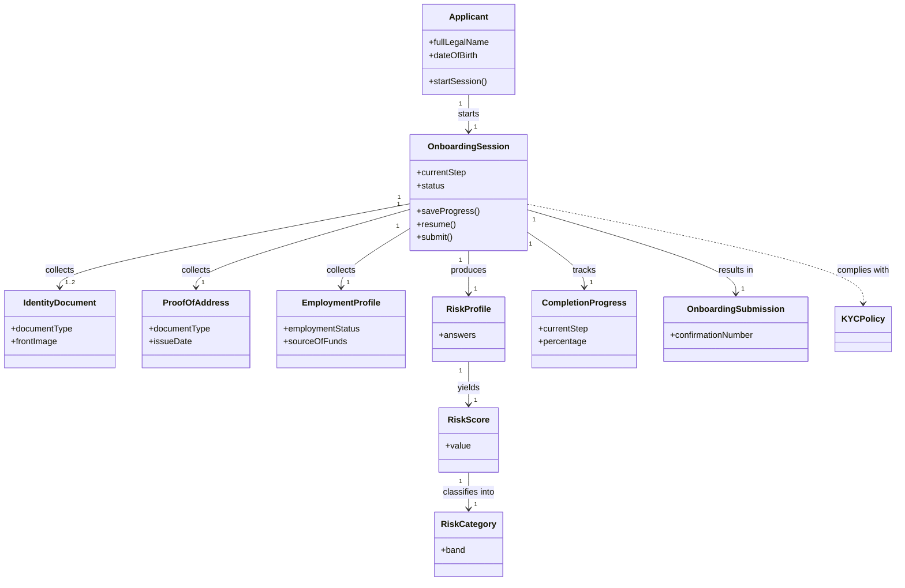

<!-- ROLE: artefact. Section order matches `framework/assets/topics-requirements.md` one-to-one. Audience is LLM-only (no human stakeholder consumption). -->

# Requirements: Northstar Wealth Client Onboarding & KYC Wizard [SRC: C-001]

**Domain:** Wealth management (financial services) — regulated [SRC: C-002] **Target:** application **Created:** 2026-05-30 **Status:** draft **Last finalised at:** —

> **Authoring guardrails.** Cells across §1–§10 obey `GR-20` (no stack specifics) and `GR-21` (no UI layout in §6.4/§6.7/§6.8/§6.9). Inferred content carries one of `[AI-SUGGESTED: AI-NNN | blocking|non-blocking]`, `[STANDARD-RULE: GR-NN]`, or (under `target = application`) a value-only fill with no marker. Input-grounded cells carry a trailing `[SRC: C-NNN]` tag backed by `requirements/draft-claims.ndjson`.

---

## 0.1 Target-mode applicability

| Section | `prototype` | `application` | Mode-conditional? |
| --- | --- | --- | --- |
| §6.10 Consumed backend contracts | fixture references | pointers into the sibling backend requirements document | yes — sub-block content differs |
| §7 Data shapes consumed by FE | shape sourced from fixtures | shape sourced from backend contracts | provenance label only |
| `## Prototype invariants` appendix | appended (PI-01..PI-07) | omitted | yes — merger conditional |
| (all other sections) | identical | identical | no |

> This draft is authored under `target = application`. §6.10 emits the application sub-block; §7 shapes are sourced from backend contracts; the Prototype-invariants appendix is omitted.

---

## 1. Application context

**Name:** Northstar Wealth Client Onboarding & KYC Wizard [SRC: C-001]

**Purpose / business value:** Shift most information gathering, verification, and risk assessment activities to a self-service digital experience that clients can complete from home [SRC: C-003], reducing the advisor-led onboarding meeting to approximately 20 minutes [SRC: C-004].

**Domain:** Wealth management — Northstar Wealth is a wealth management firm modernizing its client onboarding process [SRC: C-002]. Onboarding complies with Know Your Customer (KYC) and Anti-Money Laundering (AML) onboarding practices [SRC: C-005].

**Business goal:** Reduce advisor-led onboarding time from 2–3 hours to approximately 20 minutes [SRC: C-006], while collecting all information required for KYC and suitability assessments before advisor review [SRC: C-007].

---

## 1.5 Scope

| Bucket | Items |
| --- | --- |
| In | Multi-step onboarding workflow [SRC: C-008]; progress indicator [SRC: C-009]; forward and backward navigation [SRC: C-010]; validation and error handling [SRC: C-011]; save and resume capability [SRC: C-012]; file upload and preview [SRC: C-013]; risk profile calculation [SRC: C-014]; review and edit functionality [SRC: C-015]; submission confirmation [SRC: C-016] |
| Out | Mobile and tablet layouts — desktop viewport only [SRC: C-017]; a full authentication system — only a minimum identity check is provided [SRC: C-018] |
| Deferred | Advisor-facing review and approval console [AI-SUGGESTED: AI-001 | non-blocking] |

---

## 1.6 Assumptions & dependencies

| Kind | Statement | Source |
| --- | --- | --- |
| Abstract service dependency | A binary blob storage tier accepts uploaded identity and proof-of-address documents (the brief specifies a mock upload endpoint for the prototype path) [SRC: C-019] | stated |
| Abstract service dependency | A submission-processing service accepts the completed onboarding application (the brief specifies a mock submission endpoint) [SRC: C-020] | stated |
| Abstract service dependency | A client-side local persistence tier retains in-progress session state across reloads (the brief specifies browser-local persistence) [SRC: C-021] | stated |
| Persona prerequisite | The prospective client is opening a new investment account and is required to provide identity and financial information [SRC: C-022] | stated |
| Environment assumption | The client uses a desktop web application at a viewport width of 1280px and above [SRC: C-023] | stated |

---

## 1.7 Architectural implications

| Capability category | Driving requirement(s) | Recommendation (optional) |
| --- | --- | --- |
| Client-side state management | → §6.1 F-10 / → §6.1 F-12 / → §10 | [AI-SUGGESTED: AI-002 | non-blocking] in-memory session model acceptable at this volume |
| Offline cache / local persistence | → §6.1 F-11 / → §10 | [AI-SUGGESTED: AI-003 | non-blocking] |
| File upload / binary blob handling | → §6.1 F-03 / → §6.1 F-04 | [AI-SUGGESTED: AI-004 | non-blocking] binary blob storage tier required |
| Notification delivery surface | → §6.8 NT-01 / → §6.8 NT-02 | [AI-SUGGESTED: AI-005 | non-blocking] in-app channel only |

---

## 2. Domain model

### 2.1 Concepts

| Concept | Persistence | Definition (ubiquitous language) |
| --- | --- | --- |
| Onboarding Session | persistent | A resumable client onboarding application that establishes a session at the start and is stored locally for resumption [SRC: C-024] |
| Applicant | persistent | The prospective client whose identity and residency information is collected for KYC compliance [SRC: C-025] |
| Identity Document | persistent | Supporting documentation collected for KYC verification, of type Passport, Driver's License, or National ID [SRC: C-026] |
| Proof of Address | persistent | A utility bill or bank statement dated within the last three months that evidences the applicant's address [SRC: C-027] |
| Employment Profile | persistent | The applicant's employment status, income, and source-of-funds information collected for regulatory compliance [SRC: C-028] |
| Risk Profile | persistent | The outcome of a questionnaire that determines the client's investment risk tolerance [SRC: C-029] |
| Onboarding Submission | persistent | The completed onboarding application submitted for advisor review, identified by a confirmation number [SRC: C-030] |
| Risk Score | derived | The integer sum of the five risk-question answers, ranging from a minimum of 5 to a maximum of 20 [SRC: C-031] |
| Risk Category | derived | The risk band (Conservative, Balanced, Growth, or Aggressive) computed from the Risk Score [SRC: C-032] |
| Completion Progress | derived | The current step, total steps, and completion percentage of the onboarding session [SRC: C-033] |
| KYC / AML policy | policy | Know Your Customer and Anti-Money Laundering onboarding practices the experience must comply with [SRC: C-005] |

### 2.2 Relationships

- Applicant **starts** Onboarding Session [1:1]
- Onboarding Session **collects** Identity Document [1:1..2]
- Onboarding Session **collects** Proof of Address [1:1]
- Onboarding Session **collects** Employment Profile [1:1]
- Onboarding Session **produces** Risk Profile [1:1]
- Risk Profile **yields** Risk Score [1:1]
- Risk Score **classifies into** Risk Category [1:1]
- Onboarding Session **results in** Onboarding Submission [1:1]

### 2.3 Aggregates & lifecycles

#### Onboarding Session

| Field | Value |
| --- | --- |
| Member concepts | Applicant, Identity Document, Proof of Address, Employment Profile, Risk Profile, Onboarding Submission |
| Lifecycle states | Not Started → In Progress → Ready to Submit → Submitted [AI-SUGGESTED: AI-006 | blocking] |
| Key invariants | A session cannot reach Submitted until all mandatory KYC documentation is submitted [SRC: C-034]; the applicant must be 18 years or older [SRC: C-035]; required declarations must be accepted before submission [SRC: C-036] |

### 2.4 Diagram

### 2.5 State-transition matrix

#### Onboarding Session

| From → To | Trigger | Pre-condition | Visible effect |
| --- | --- | --- | --- |
| Not Started → In Progress | Client begins onboarding [SRC: C-037] | Valid email provided [SRC: C-038] | Session is created and stored locally for resumption [SRC: C-039]; wizard advances to Step 2 [AI-SUGGESTED: AI-007 | non-blocking] |
| In Progress → In Progress (resume) | Existing progress detected on return [SRC: C-040] | Re-entry of the email used to start onboarding [SRC: C-041] | "Welcome back. Continue from Step X." message shown [SRC: C-042] |
| In Progress → Ready to Submit | All steps completed and review reached [SRC: C-043] | All mandatory KYC documentation submitted [SRC: C-034] | Read-only review summary shown with per-section Edit actions [SRC: C-044] |
| Ready to Submit → Submitted | Client submits the onboarding application [SRC: C-045] | Required declarations accepted [SRC: C-036] | Confirmation number and submission confirmation message shown [SRC: C-046]; local session state cleared after successful submission [SRC: C-047] |

---

## 3. Target users

### Prospective Client

| Field | Value |
| --- | --- |
| Role / job title | A prospective Northstar Wealth client opening a new investment account [SRC: C-022] |
| Expertise level | Financial knowledge may vary significantly [SRC: C-048]; may be unfamiliar with KYC terminology [SRC: C-049]; comfortable using desktop web applications [SRC: C-050] |
| Stakes | Required to provide identity and financial information to open the account [SRC: C-051] |
| Frequency of use | One-time onboarding, completed independently from home at the client's own pace [SRC: C-052] |
| Driving forces — wants | To understand what information is needed before starting [SRC: C-053]; to complete onboarding from home at their own pace [SRC: C-054]; to save progress and continue later [SRC: C-055]; to receive confirmation the application was submitted successfully [SRC: C-056] |
| Driving forces — fears | Expects professionalism and clarity [SRC: C-057]; may be cautious about sharing personal and financial information online [SRC: C-058]; wants to know why sensitive information is being requested [SRC: C-059] |

---

## 4. User goals & stories

### 4.1 Goals catalogue

| ID | Goal statement | Quality signals | Goal kind | Layout pref (optional) | UX-pattern pref (optional) |
| --- | --- | --- | --- | --- | --- |
| G-01 | Complete onboarding from home at the client's own pace [SRC: C-054] | Onboarding completable within approximately 15 minutes [SRC: C-060] | top-level | — | — |
| G-02 | Pause and resume onboarding without losing progress [SRC: C-061] | No data loss during refresh [SRC: C-062] | top-level | — | — |
| G-03 | Understand and validate the information being provided before submission [SRC: C-063] | Increased data accuracy through client review and validation [SRC: C-064] | top-level | — | — |
| G-04 | Understand the client's own investment risk profile [SRC: C-065] | Risk profile assessments completed consistently and accurately [SRC: C-066] | top-level | — | — |
| G-05 | Feel confident personal information is handled securely and professionally [SRC: C-067] | Client feels Northstar Wealth handles their information professionally and responsibly [SRC: C-068] | top-level | — | — |

### 4.2 Stories by persona

#### Prospective Client <!-- → §3 -->

##### Story: As a prospective client, I want to understand what information I need before starting, so that I can prepare and complete onboarding in one sitting

| Field | Value |
| --- | --- |
| Goal | → §4.1 G-01 |
| Objective | See estimated completion time and the list of required documents before beginning [SRC: C-069] |
| Context (frequency / expertise / stakes) | One-time; financial knowledge varies; required to provide identity and financial information |
| Linked task flow (optional) | → §5 Complete onboarding wizard |
| Acceptance criteria | Estimated completion time (15 minutes) and required documents (government-issued ID, proof of address, employment details) are displayed before the client begins [SRC: C-070] |

##### Story: As a prospective client, I want to save my progress and continue later, so that I do not lose work if I stop partway

| Field | Value |
| --- | --- |
| Goal | → §4.1 G-02 |
| Objective | Resume an in-progress onboarding session after leaving and returning [SRC: C-055] |
| Context (frequency / expertise / stakes) | Completed independently at the client's own pace |
| Linked task flow (optional) | → §5 Save and resume |
| Acceptance criteria | When existing progress is detected, a "Welcome back. Continue from Step X." prompt is shown and the session resumes after the client re-enters the email used to start onboarding [SRC: C-071] |

##### Story: As a prospective client, I want to review and correct my information before submission, so that what I submit is accurate

| Field | Value |
| --- | --- |
| Goal | → §4.1 G-03 |
| Objective | Review a read-only summary and edit any section before submitting [SRC: C-072] |
| Context (frequency / expertise / stakes) | Targeted corrections rather than re-completing the workflow |
| Linked task flow (optional) | → §5 Review and edit |
| Acceptance criteria | Each review section can be edited and, after saving, the client returns directly to Review [SRC: C-073] |

##### Story: As a prospective client, I want to understand my investment risk profile, so that I know how my answers translate into a risk category

| Field | Value |
| --- | --- |
| Goal | → §4.1 G-04 |
| Objective | Complete the risk questionnaire and see the resulting risk category [SRC: C-074] |
| Context (frequency / expertise / stakes) | Financial knowledge varies; may be unfamiliar with terminology |
| Linked task flow (optional) | → §5 Complete onboarding wizard |
| Acceptance criteria | After answering all five questions, the risk category and a one-sentence description are displayed [SRC: C-075] |

##### Story: As a prospective client, I want confirmation that my application was submitted successfully, so that I know onboarding is complete

| Field | Value |
| --- | --- |
| Goal | → §4.1 G-05 |
| Objective | Receive a clear submission confirmation [SRC: C-056] |
| Context (frequency / expertise / stakes) | One-time; cautious about sharing information online |
| Linked task flow (optional) | → §5 Submit application |
| Acceptance criteria | On successful submission, a confirmation number, a submission confirmation message, the advisor follow-up process, and a contact email address are displayed [SRC: C-076] |

---

## 5. Task flows

### Flow: Complete onboarding wizard

| Field | Value |
| --- | --- |
| Actor | Prospective Client <!-- → §3 --> |
| Trigger | Client begins onboarding from the Get Started step [SRC: C-037] |
| Steps | (Enter email and begin; session is created and stored locally [SRC: C-077]) → (Enter personal and residency details; required fields validated [SRC: C-078]) → (Upload identity document and proof of address; uploads previewed [SRC: C-079]) → (Provide employment and source-of-funds information [SRC: C-080]) → (Answer five risk questions; risk category displayed [SRC: C-081]) → (Review all information and submit; confirmation shown [SRC: C-082]) |
| Decision points | Identity document type determines required images (Passport: front only; Driver's License and National ID: front and back) [SRC: C-083]; employment status determines conditional fields [SRC: C-084] |
| Exception paths | {Unsupported file type → "Supported file type" validation feedback → re-select a JPG, PNG, or PDF [SRC: C-085]} ; {Upload failure → "We couldn't upload your document right now. Please try again." → retry the upload [SRC: C-086]} |
| Role-conditional behaviour | None — single self-service persona [AI-SUGGESTED: AI-008 | non-blocking] |

### Flow: Save and resume

| Field | Value |
| --- | --- |
| Actor | Prospective Client <!-- → §3 --> |
| Trigger | Client returns to onboarding with existing progress detected [SRC: C-040] |
| Steps | (Re-enter the email used to start onboarding; minimum identity check passes [SRC: C-087]) → (See "Welcome back. Continue from Step X."; resume at the saved step [SRC: C-088]) |
| Decision points | Whether existing progress is detected in local storage [SRC: C-089] |
| Exception paths | {Email does not match the one used to start onboarding → identity check fails → re-enter the correct email [AI-SUGGESTED: AI-009 | non-blocking]} |
| Role-conditional behaviour | None — single self-service persona [AI-SUGGESTED: AI-010 | non-blocking] |

### Flow: Review and edit

| Field | Value |
| --- | --- |
| Actor | Prospective Client <!-- → §3 --> |
| Trigger | Client reaches the Review & Submit step [SRC: C-090] |
| Steps | (Review the read-only summary grouped by section [SRC: C-091]) → (Choose Edit on a section; make targeted corrections [SRC: C-092]) → (Save changes; return directly to Review [SRC: C-073]) |
| Decision points | Which section the client chooses to edit [AI-SUGGESTED: AI-011 | non-blocking] |
| Exception paths | {Validation error on an edited field → inline corrective message → fix the field before saving [AI-SUGGESTED: AI-012 | non-blocking]} |
| Role-conditional behaviour | None — single self-service persona [AI-SUGGESTED: AI-013 | non-blocking] |

### Flow: Submit application

| Field | Value |
| --- | --- |
| Actor | Prospective Client <!-- → §3 --> |
| Trigger | Client submits from the Review & Submit step [SRC: C-045] |
| Steps | (Accept the required declarations [SRC: C-093]) → (Submit the onboarding application to the submission endpoint [SRC: C-094]) → (See the confirmation number and submission confirmation message [SRC: C-046]) |
| Decision points | Whether all required declaration checkboxes are accepted [SRC: C-095] |
| Exception paths | {Submission fails → apologetic, actionable system message → retry submission [AI-SUGGESTED: AI-014 | non-blocking]} |
| Role-conditional behaviour | None — single self-service persona [AI-SUGGESTED: AI-015 | non-blocking] |

---

## 6. Requirements

### 6.1 Functional

| ID | Statement | Acceptance criteria | Source |
| --- | --- | --- | --- |
| F-01 | The client can enter an email address and begin onboarding, creating a resumable session stored locally [SRC: C-096] | A valid email is required before beginning; on begin, an onboarding session is created and stored locally for resumption [SRC: C-097] | stated |
| F-02 | The client can provide personal and residency details required for KYC compliance [SRC: C-098] | Full legal name, preferred name, date of birth, nationality, country of residence, tax residency, mobile number, and email confirmation are captured [SRC: C-099] | stated |
| F-03 | The client can upload an identity document of type Passport, Driver's License, or National ID [SRC: C-100] | The required images are enforced per document type (Passport: front only; Driver's License and National ID: front and back) [SRC: C-101] | stated |
| F-04 | The client can upload a proof of address (utility bill or bank statement) [SRC: C-102] | The document must be dated within the last three months [SRC: C-103] | stated |
| F-05 | The client can provide employment status and source-of-funds information for regulatory compliance [SRC: C-104] | Conditional fields are shown per employment status; if Source of Funds is "Other", an explanation of at least 20 characters is required [SRC: C-105] | stated |
| F-06 | The client can complete a five-question risk assessment that produces a risk score and category [SRC: C-106] | The score ranges from 5 to 20 and maps to Conservative, Balanced, Growth, or Aggressive [SRC: C-107] | stated |
| F-07 | The client can review a read-only summary of all entered information grouped by section [SRC: C-108] | The summary is grouped by Personal Details, Identity Verification, Employment & Source of Funds, and Risk Profile [SRC: C-109] | stated |
| F-08 | The client can accept the required declarations and submit the onboarding application [SRC: C-110] | All three declarations must be accepted before the application can be submitted [SRC: C-111] | stated |
| F-09 | The system displays a submission confirmation after a successful submit [SRC: C-112] | A confirmation number, confirmation message, advisor follow-up process, and contact email address are shown [SRC: C-076] | stated |
| F-10 | The system displays onboarding progress (current step, total steps, completion percentage) [SRC: C-033] | Current step, total steps, and completion percentage are shown throughout the wizard [SRC: C-113] | stated |
| F-11 | The client can pause and resume onboarding using locally persisted state [SRC: C-114] | On return with detected progress, the client re-enters the starting email and resumes at the saved step [SRC: C-115] | stated |
| F-12 | The client can navigate forward and backward through the wizard steps [SRC: C-010] | Forward and backward navigation between steps is available [AI-SUGGESTED: AI-016 | non-blocking] | inferred |
| F-13 | The system validates input and surfaces inline error feedback [SRC: C-011] | Validation is consistent across steps and provides clear, corrective feedback [SRC: C-116] | stated |
| F-14 | The client can preview uploaded documents and see upload progress [SRC: C-013] | An upload progress indicator and a preview thumbnail are shown after upload [SRC: C-117] | stated |
| F-15 | The system displays the resulting risk category with a one-sentence description [SRC: C-118] | The risk category and a one-sentence description are displayed (e.g., "Balanced — You are comfortable accepting moderate fluctuations in pursuit of long-term investment growth.") [SRC: C-119] | stated |
| F-16 | Each step displays a short explanation of why the information is required [SRC: C-120] | Each step includes a short explanation describing why the information is required [SRC: C-121] | stated |
| F-17 | When editing from Review, the client returns directly to Review after saving changes [SRC: C-073] | After saving an edit initiated from Review, the client returns to the Review step rather than re-completing the workflow [SRC: C-122] | stated |

### 6.2 Business rules

| ID | Statement (when / then) | Enforcement point | Acceptance criteria | Source | Severity |
| --- | --- | --- | --- | --- | --- |
| BR-01 | When the applicant's age is under 18, then onboarding cannot proceed | cross-layer | Date of birth indicating an age under 18 blocks progression with a corrective message [SRC: C-035] | → §6.3 | blocker |
| BR-02 | When mandatory KYC documentation is incomplete, then the application cannot be submitted | cross-layer | Submission is blocked until all mandatory KYC documentation is submitted [SRC: C-034] | → §2.3 invariant | blocker |
| BR-03 | When the email confirmation does not match the Step 1 email, then the personal details step cannot be completed | ui | Email confirmation must match the Step 1 email [SRC: C-123] | → §6.3 | major |
| BR-04 | When an uploaded file exceeds 5 MB or is not a supported type, then the upload is rejected | ui | Files must be JPG, PNG, or PDF and at most 5 MB per file [SRC: C-124] | → §6.3 | major |
| BR-05 | When Source of Funds is "Other", then an explanation of at least 20 characters is required | ui | An "Other" selection requires an explanation of at least 20 characters [SRC: C-125] | → §6.3 | major |
| BR-06 | When the required declarations are not all accepted, then submission is blocked | ui | All three declarations (accuracy, terms, identity-verification consent) must be accepted before submit [SRC: C-126] | → §6.1 F-08 | blocker |
| BR-07 | When resuming, then the client must re-enter the email used to start onboarding before continuing | ui | Resuming requires re-entering the starting email as a minimum identity check [SRC: C-127] | → §6.1 F-11 | major |

### 6.3 Validation rules

| Field (→ §7) | Validation type | Rule | Error message |
| --- | --- | --- | --- |
| OnboardingSession.email | required | Email is required [SRC: C-128] | "Please enter your email address." [AI-SUGGESTED: AI-017 | non-blocking] |
| OnboardingSession.email | format | Valid email format [SRC: C-129] | "Please enter a valid email address." [AI-SUGGESTED: AI-018 | non-blocking] |
| Applicant.dateOfBirth | business-rule-ref | Age must be 18 years or older → BR-01 [SRC: C-035] | "You must be 18 years or older to open an account." [AI-SUGGESTED: AI-019 | non-blocking] |
| Applicant.emailConfirmation | cross-field | Email confirmation matches Step 1 email → BR-03 [SRC: C-123] | "This email does not match the one you started with." [AI-SUGGESTED: AI-020 | non-blocking] |
| Applicant.mobileNumber | format | Mobile number valid format [SRC: C-130] | "Please enter a valid mobile number." [AI-SUGGESTED: AI-021 | non-blocking] |
| Applicant.nationality | required | Nationality must be selected [SRC: C-131] | "Please select your nationality." [AI-SUGGESTED: AI-022 | non-blocking] |
| IdentityDocument.file | enum | Supported file type (JPG, PNG, PDF) → BR-04 [SRC: C-132] | "Supported file types are JPG, PNG, and PDF." [AI-SUGGESTED: AI-023 | non-blocking] |
| IdentityDocument.file | range | Maximum 5 MB per file → BR-04 [SRC: C-133] | "Each file must be 5 MB or smaller." [AI-SUGGESTED: AI-024 | non-blocking] |
| ProofOfAddress.issueDate | range | Dated within the last three months [SRC: C-103] | "Your proof of address must be dated within the last three months." [SRC: C-134] |
| EmploymentProfile.otherExplanation | length | If "Other" source of funds, minimum 20 characters → BR-05 [SRC: C-125] | "Please provide an explanation of at least 20 characters." [AI-SUGGESTED: AI-025 | non-blocking] |
| OnboardingSubmission.declarations | required | All required declarations accepted → BR-06 [SRC: C-126] | "Please accept all declarations to submit." [AI-SUGGESTED: AI-026 | non-blocking] |

### 6.4 UI feature needs

| ID | Feature need | Linked (G / story / BR) | Acceptance criteria |
| --- | --- | --- | --- |
| UI-01 | The client can move forward and backward through the steps [SRC: C-010] | → §4.1 G-01 | Both forward and backward navigation are available between steps [AI-SUGGESTED: AI-027 | non-blocking] |
| UI-02 | The client sees current step, total steps, and completion percentage [SRC: C-033] | → §4.1 G-01 | Progress is visible on every step [SRC: C-113] |
| UI-03 | The client can save progress and resume later [SRC: C-012] | → §4.1 G-02 / → §6.2 BR-07 | A resume prompt appears when prior progress exists [SRC: C-040] |
| UI-04 | The client can upload a document and see a preview and upload progress [SRC: C-013] | → §4.2 / → §6.1 F-14 | Upload progress and a preview thumbnail are shown after upload [SRC: C-117] |
| UI-05 | The client receives clear, corrective validation feedback [SRC: C-135] | → §6.2 BR-04 | Error messages are specific and corrective [SRC: C-136] |
| UI-06 | The client can edit any section from the review summary [SRC: C-015] | → §4.1 G-03 / → §6.1 F-17 | Each review section has an Edit action [SRC: C-137] |
| UI-07 | The client sees their risk category and description after the assessment [SRC: C-014] | → §4.1 G-04 / → §6.1 F-15 | Risk category and one-sentence description are shown [SRC: C-138] |
| UI-08 | The client sees a per-step explanation of why information is requested [SRC: C-120] | → §4.1 G-05 | A short "why we ask" explanation is present on each step [SRC: C-121] |
| UI-09 | The client sees a submission confirmation on success [SRC: C-016] | → §4.1 G-05 / → §6.1 F-09 | Confirmation number and message are shown after submit [SRC: C-046] |

#### 6.4.5 Edge, empty & error states

| Surface (→ story / flow / UI-NN) | Condition | Expected UI behaviour | Recovery action |
| --- | --- | --- | --- |
| → §5 onboarding flow (upload) | error | An apologetic, actionable message is shown when a document cannot be uploaded [SRC: C-086] | The client retries the upload [AI-SUGGESTED: AI-028 | non-blocking] |
| → §6.1 F-14 (upload) | loading | An upload progress indicator is shown while a document uploads [SRC: C-139] | Wait for upload to complete [AI-SUGGESTED: AI-029 | non-blocking] |
| → §5 Save and resume | partial | A "Welcome back. Continue from Step X." prompt is shown when prior progress exists [SRC: C-042] | Re-enter the starting email to resume [SRC: C-041] |
| → §6.1 F-13 (any step) | error | Specific, corrective validation messages are shown for user mistakes [SRC: C-140] | The client corrects the highlighted field [AI-SUGGESTED: AI-030 | non-blocking] |

### 6.5 Access control (RBAC)

**Action vocabulary:** `C` create · `R` read · `U` update · `D` delete · `X` execute / invoke · `A` approve · `—` no access.

| Role (→ §3) | OnboardingSession | Applicant | IdentityDocument | ProofOfAddress | EmploymentProfile | RiskProfile | OnboardingSubmission | Complete onboarding wizard | Save and resume | Review and edit | Submit application |
| --- | --- | --- | --- | --- | --- | --- | --- | --- | --- | --- | --- |
| Prospective Client | C R U [AI-SUGGESTED: AI-031 | non-blocking] | C R U [AI-SUGGESTED: AI-032 | non-blocking] | C R U D [AI-SUGGESTED: AI-033 | non-blocking] | C R U D [AI-SUGGESTED: AI-034 | non-blocking] | C R U [AI-SUGGESTED: AI-035 | non-blocking] | C R U [AI-SUGGESTED: AI-036 | non-blocking] | C R [AI-SUGGESTED: AI-037 | non-blocking] | X [AI-SUGGESTED: AI-038 | non-blocking] | X [AI-SUGGESTED: AI-039 | non-blocking] | X [AI-SUGGESTED: AI-040 | non-blocking] | X [AI-SUGGESTED: AI-041 | non-blocking] |

### 6.6 Non-functional (FE-only)

#### 6.6.1 Session UX

| Field | Value | Source |
| --- | --- | --- |
| Idle session timeout | 15 minutes [STANDARD-RULE: GR-19] | inferred |
| Absolute session timeout | 8 hours [STANDARD-RULE: GR-19] | inferred |
| Idle warning lead-time | 60 seconds (T-1 min) [STANDARD-RULE: GR-19] | inferred |
| Re-auth scope | Re-entry of the starting email to resume an application — a minimum identity check without a full authentication system [SRC: C-141] | stated |
| Account lockout messaging | Not applicable — only a minimum identity check is provided, without a full authentication system [SRC: C-018] | stated |
| MFA prompt scope | Not applicable — no full authentication system is in scope [SRC: C-142] | stated |

#### 6.6.2 Frontend performance budgets

| Metric | Target | Source |
| --- | --- | --- |
| Time to interactive (p95) | p95 ≤ 2.0s [AI-SUGGESTED: AI-042 | non-blocking] | inferred |
| Initial bundle size budget | ≤ 250KB gzipped [AI-SUGGESTED: AI-043 | non-blocking] | inferred |
| Render budget for largest list/table | Step transitions under 300ms [SRC: C-143] | stated |
| Time to meaningful content | Upload simulation under 2 seconds [SRC: C-144] | stated |

#### 6.6.4 Compliance UI behaviour

- Each step includes a short explanation describing why the information is required (e.g., "We collect your tax residency information to meet international regulatory requirements.") [SRC: C-145]
- Reassuring, plain-language security copy is used (e.g., "Your documents are securely transmitted and only used to verify your identity."); vague claims such as "Bank-grade security", "Military-grade encryption", or "Completely secure" are avoided [SRC: C-146]
- The client must give consent to identity verification checks via a required declaration [SRC: C-147]

#### 6.6.5 Accessibility

- Keyboard accessible navigation [SRC: C-148]
- Visible focus states [SRC: C-149]
- Associated labels for all fields [SRC: C-150]
- Screen-reader friendly error messages [SRC: C-151]
- WCAG 2.2 AA target [AI-SUGGESTED: AI-044 | non-blocking]

### 6.7 Reporting feature needs

> No client-facing reporting is described in the inputs; this onboarding flow produces a single submission for downstream advisor review rather than reports. No RPT rows are emitted. [AI-SUGGESTED: AI-045 | non-blocking]

### 6.8 Notification points

| ID | Event | Audience (→ §3) | Channel category | Trigger condition |
| --- | --- | --- | --- | --- |
| NT-01 | Onboarding application submitted successfully [SRC: C-152] | Prospective Client | in-app | On successful submission to the submission endpoint [SRC: C-153] |
| NT-02 | Existing in-progress onboarding detected on return [SRC: C-040] | Prospective Client | in-app | When prior progress exists in local storage [SRC: C-154] |

### 6.10 Consumed backend contracts

#### Under `target = application`

| Operation | Backend contract pointer | Notes |
| --- | --- | --- |
| Create onboarding session | → ../backend/requirements.md#operation-create-onboarding-session | The brief specifies a session created at start and stored locally for resumption [SRC: C-039] |
| Upload document | → ../backend/requirements.md#operation-upload-document | The brief specifies a mock upload endpoint for the prototype path [SRC: C-155] |
| Submit onboarding application | → ../backend/requirements.md#operation-submit-onboarding-application | The brief specifies submission to a submission endpoint that returns a confirmation number [SRC: C-156] |

---

## 7. Data shapes consumed by the FE

> Under `target = application`, these shapes describe payloads exchanged with the backend; the authoritative shape lives in the sibling backend requirements document.

### Shape: OnboardingSession

| Field | Type | Required | UI-display | Notes |
| --- | --- | --- | --- | --- |
| email | string | yes | form-input | Captured at Step 1 [SRC: C-157] |
| currentStep | integer | yes | hidden | Drives resume and progress |
| status | enum | yes | hidden | Not Started / In Progress / Ready to Submit / Submitted |
| completionPercentage | integer | no | detail | Derived progress value |

**Domain concept:** → §2.1 Onboarding Session
**Source:** backend-contract
**Enums:** status: Not Started, In Progress, Ready to Submit, Submitted

### Shape: Applicant

| Field | Type | Required | UI-display | Notes |
| --- | --- | --- | --- | --- |
| fullLegalName | string | yes | form-input | [SRC: C-158] |
| preferredName | string | no | form-input | [SRC: C-159] |
| dateOfBirth | date | yes | form-input | Age must be 18+ [SRC: C-160] |
| nationality | enum | yes | enum | Dropdown of at least the 20 most common countries [SRC: C-161] |
| countryOfResidence | enum | yes | enum | [SRC: C-162] |
| taxResidency | enum | yes | enum | At least the 20 most common countries [SRC: C-163] |
| mobileNumber | string | yes | form-input | Valid format [SRC: C-164] |
| emailConfirmation | string | yes | form-input | Must match Step 1 email [SRC: C-165] |

**Domain concept:** → §2.1 Applicant
**Source:** backend-contract
**Enums:** nationality / countryOfResidence / taxResidency: at least the 20 most common countries

### Shape: IdentityDocument

| Field | Type | Required | UI-display | Notes |
| --- | --- | --- | --- | --- |
| documentType | enum | yes | enum | Passport / Driver's License / National ID [SRC: C-166] |
| frontImage | file | yes | form-input | Required for all types [SRC: C-167] |
| backImage | file | no | form-input | Required for Driver's License and National ID [SRC: C-168] |

**Domain concept:** → §2.1 Identity Document
**Source:** backend-contract
**Enums:** documentType: Passport, Driver's License, National ID

### Shape: ProofOfAddress

| Field | Type | Required | UI-display | Notes |
| --- | --- | --- | --- | --- |
| documentType | enum | yes | enum | Utility bill / Bank statement [SRC: C-169] |
| file | file | yes | form-input | JPG, PNG, or PDF; max 5 MB [SRC: C-170] |
| issueDate | date | yes | detail | Dated within the last three months [SRC: C-103] |

**Domain concept:** → §2.1 Proof of Address
**Source:** backend-contract
**Enums:** documentType: Utility bill, Bank statement

### Shape: EmploymentProfile

| Field | Type | Required | UI-display | Notes |
| --- | --- | --- | --- | --- |
| employmentStatus | enum | yes | enum | Employed / Self-employed / Retired / Unemployed / Student [SRC: C-171] |
| incomeBracket | enum | no | enum | Annual income bracket where applicable [SRC: C-172] |
| sourceOfFunds | enum | yes | enum | Salary / Savings / Inheritance / Sale of property / Business proceeds / Other [SRC: C-173] |
| otherExplanation | string | no | form-input | Required (min 20 chars) when Source of Funds is "Other" [SRC: C-174] |
| conditionalDetails | string | no | form-input | Status-specific fields (e.g. employer name, occupation, institution name) [SRC: C-175] |

**Domain concept:** → §2.1 Employment Profile
**Source:** backend-contract
**Enums:** employmentStatus: Employed, Self-employed, Retired, Unemployed, Student; incomeBracket: Under $25,000, $25,000–$50,000, $50,001–$100,000, $100,001–$250,000, Above $250,000; sourceOfFunds: Salary, Savings, Inheritance, Sale of property, Business proceeds, Other

### Shape: RiskProfile

| Field | Type | Required | UI-display | Notes |
| --- | --- | --- | --- | --- |
| answers | integer[] | yes | hidden | Five answers scored 1–4 each [SRC: C-176] |

**Domain concept:** → §2.1 Risk Profile
**Source:** backend-contract
**Enums:** each answer: 1–4

### Shape: OnboardingSubmission

| Field | Type | Required | UI-display | Notes |
| --- | --- | --- | --- | --- |
| confirmationNumber | string | yes | detail | Generated on successful submission [SRC: C-177] |
| contactEmail | string | yes | detail | Contact email address shown in the success state [SRC: C-178] |

**Domain concept:** → §2.1 Onboarding Submission
**Source:** backend-contract
**Enums:** —

### 7.X Derivations

| Derived concept (→ §2.1) | Derivation rule (business language) | Inputs | Refresh trigger |
| --- | --- | --- | --- |
| Risk Score | Sum of the five risk-question answers (each 1–4), giving a value from 5 to 20 [SRC: C-179] | RiskProfile.answers | on-change |
| Risk Category | Map the Risk Score to a band: 5–8 Conservative, 9–12 Balanced, 13–16 Growth, 17–20 Aggressive [SRC: C-180] | Risk Score | on-change |
| Completion Progress | Compute completion percentage from the current step against total steps [SRC: C-181] | OnboardingSession.currentStep | on-change |

---

## 8. Source UI references

| Reference | Location | Notes |
| --- | --- | --- |
| Northstar Wealth onboarding brief | input/brief.md | Primary source brief — six-step onboarding wizard, fields, validation, risk scoring, trust & tone strategy [SRC: C-182] |

---

## 9. Key terminology

| Term | Definition | Inconsistency flag |
| --- | --- | --- |
| KYC | Know Your Customer onboarding practices the experience must comply with [SRC: C-183] | — |
| AML | Anti-Money Laundering onboarding practices the experience must comply with [SRC: C-184] | — |
| Risk Category | → §2.1 Risk Category | — |
| Suitability assessment | Collection of information required to assess investment suitability before advisor review [SRC: C-185] | — |
| Source of Funds | The origin of the funds the client will invest (Salary, Savings, Inheritance, Sale of property, Business proceeds, Other) [SRC: C-186] | — |

---

## 10. Volumes

| Metric | Value | Source |
| --- | --- | --- |
| Data volume | One onboarding session per client; on the order of 10²–10³ in-progress sessions retained at a time [AI-SUGGESTED: AI-046 | blocking] | inferred |
| Frequency | New onboardings on the order of 10¹–10² per day [AI-SUGGESTED: AI-047 | blocking] | inferred |
| Concurrency | On the order of 10¹–10² concurrent clients onboarding [AI-SUGGESTED: AI-048 | blocking] | inferred |

---
