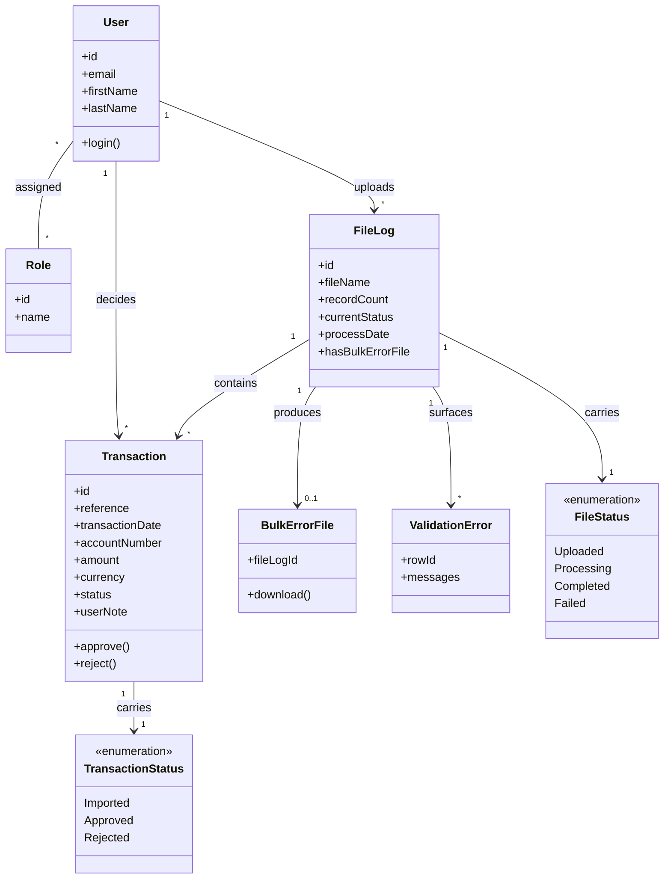

# Requirements: Transaction Import & Approval System

**Domain:** Financial services / back-office transaction processing [AI-SUGGESTED: AI-001 | blocking] **Created:** 2026-05-04 **Status:** draft **Last finalised at:** —

> Inferred content is marked inline with one of three markers per the drafter's decision tree (`framework/agents/requirements-drafter.md > Classification`):
> - `[AI-SUGGESTED: AI-NNN | blocking|non-blocking]` — inferred completeness-gating, in-scope value; resolver asks the consultant.
> - `[STANDARD-RULE: GR-NN]` — deterministic answer from `framework/shared/general-rules.md`; resolver skips.
> - `[OUT-OF-SCOPE: domain-default]` — required by template but outside prototype scope per `framework/shared/prototype-scope.md`; resolver skips, consultant can scan-review.

---

## 1. Application context

**Name:** Transaction Import & Approval System

**Purpose / business value:** Provide a dual-role workspace where Importers can upload transaction files and Approvers can review, approve or reject the resulting transaction records, with file-driven ingestion and explicit transaction lifecycle states. Source: `PrototypeBrief.md` §1.

**Domain:** Financial services / back-office transaction processing [AI-SUGGESTED: AI-001 | blocking]

**Business goal:** Enforce a separation-of-duties workflow over batch-imported financial transactions so that no transaction reaches a downstream system without an Approver's explicit decision, while preserving a per-file audit trail of file logs, transaction status, and reject reasons. [AI-SUGGESTED: AI-002 | blocking]

<!-- rev: run-1 2026-05-04 -->

---

## 2. Domain model

> The BA's framing of the business domain in **ubiquitous language**, implementation-free.

### 2.1 Concepts

| Concept | Persistence | Definition (ubiquitous language) |
| --- | --- | --- |
| File Log | persistent | A single uploaded transaction file and its processing state — the anchor object the system is organised around. |
| Transaction | persistent | An individual financial movement record extracted from a File Log, carrying reference, date, account, amount, currency, type, and status. |
| User | persistent | An authenticated actor who interacts with the system in one or more Roles. |
| Role | persistent | A named capability set (Importer, Approver) that determines which screens and actions a User may access. |
| Bulk Error File | derived | A downloadable error report produced when a File Log's bulk import surfaces row-level validation failures; not authored by a user — generated as a side-effect of validation. |
| Validation Error | derived | A per-row failure record exposed when a File Log's transactions contain malformed or non-conforming data. |
| Transaction Status | policy | Enumerated lifecycle value for a Transaction: `Imported`, `Approved`, `Rejected`. |
| File Status | policy | Enumerated lifecycle value for a File Log: `Uploaded`, `Processing`, `Completed`, `Failed`. |
| Reject Reason | policy | The mandatory user note captured when an Approver rejects a Transaction. |

### 2.2 Relationships

- **File Log** **contains** **Transaction** [1..*]
- **User** **is assigned** **Role** [*..*]
- **User (Importer)** **uploads** **File Log** [1..*]
- **User (Approver)** **decides on** **Transaction** [1..*]
- **File Log** **may produce** **Bulk Error File** [0..1]
- **File Log** **may surface** **Validation Error** [0..*]
- **Transaction** **carries** **Transaction Status** [exactly 1]
- **File Log** **carries** **File Status** [exactly 1]
- **Rejected Transaction** **carries** **Reject Reason** [exactly 1]

### 2.3 Aggregates & lifecycles

#### File Log

| Field | Value |
| --- | --- |
| Member concepts | File Log, Transaction, Bulk Error File, Validation Error, File Status |
| Lifecycle states | `Uploaded` → `Processing` → `Completed` \| `Failed` |
| Key invariants | The system, not the user, drives File Status transitions. A File Log in `Failed` cannot have its Transactions decided on by an Approver. Once `Completed`, the File Log's Transactions are visible for review. |

#### Transaction

| Field | Value |
| --- | --- |
| Member concepts | Transaction, Transaction Status, Reject Reason |
| Lifecycle states | `Imported` → `Approved` \| `Rejected` |
| Key invariants | Approve and Reject are valid only when Transaction Status is `Imported`. Reject requires a non-empty Reject Reason. Once a Transaction is `Approved` or `Rejected`, its status is terminal for this prototype. |

### 2.4 Diagram

<!-- rev: run-1 2026-05-04 -->

---

## 3. Target users

> Target-user personas — the end users of the application being designed.

### Importer

| Field | Value |
| --- | --- |
| Role / job title | Operations clerk / data-ingest specialist [AI-SUGGESTED: AI-003 | non-blocking] |
| Expertise level | Comfortable with file-upload tools and tabular data; not a transaction reviewer [AI-SUGGESTED: AI-004 | non-blocking] |
| Stakes | Late or failed uploads delay the Approver queue and hold up downstream settlement [AI-SUGGESTED: AI-005 | non-blocking] |
| Frequency of use | Daily, batch-driven (one or more uploads per business day) [AI-SUGGESTED: AI-006 | non-blocking] |
| Driving forces — wants | Fast confirmation that a file has been ingested cleanly; clear visibility of validation errors; quick re-upload on failure |
| Driving forces — fears | Uploading a duplicate or wrong-period file; missing a hidden validation failure; being held responsible for file content they did not author |

### Approver

| Field | Value |
| --- | --- |
| Role / job title | Finance officer / authorised signatory [AI-SUGGESTED: AI-007 | non-blocking] |
| Expertise level | Strong domain knowledge of transactions, reconciliation, and policy; modest tolerance for UI friction [AI-SUGGESTED: AI-008 | non-blocking] |
| Stakes | Approving an erroneous transaction causes downstream financial impact and audit exposure; rejecting valid ones causes operational delay [AI-SUGGESTED: AI-009 | blocking] |
| Frequency of use | Several sessions per day; longer working sessions per file batch [AI-SUGGESTED: AI-010 | non-blocking] |
| Driving forces — wants | Confidence that they are reviewing the right batch; efficient bulk review; clear audit trail of their decisions; export of approved transactions |
| Driving forces — fears | Approving a duplicate or out-of-policy transaction; losing context when interrupted; rejecting without an adequate reason that satisfies audit |

<!-- rev: run-1 2026-05-04 -->

---

## 4. User goals & stories

> Quality signals live on the goal (outcome-level), not the story (behaviour-level).

### 4.1 Goals catalogue

| ID | Goal statement | Quality signals | Goal kind | Layout pref (optional) | UX-pattern pref (optional) |
| --- | --- | --- | --- | --- | --- |
| G-01 | Authenticate and land in the role-appropriate workspace | Trustworthy, Secure | top-level | Centred form | Single-step credentials [AI-SUGGESTED: AI-011 | non-blocking] |
| G-02 | Upload a transaction file and confirm successful ingestion | Reliable, Reassuring | top-level | Drag-and-drop panel | Upload-with-progress [AI-SUGGESTED: AI-012 | non-blocking] |
| G-03 | Browse uploaded File Logs and their processing state | Scannable, Status-aware | top-level | Dense data table | Sortable/filterable list [AI-SUGGESTED: AI-013 | non-blocking] |
| G-04 | Drill from a File Log into its individual Transactions | Continuous, Context-preserving | sub-level | Master-detail | Row-click drilldown |
| G-05 | Approve a Transaction confidently | Decisive, Auditable | top-level | Inline row action with confirmation | Confirm-modal pattern |
| G-06 | Reject a Transaction with a recorded reason | Decisive, Documented | top-level | Inline row action with reason form | Modal with required note |
| G-07 | Export the currently filtered Transaction set | Portable, Exact | top-level | Export button on toolbar | CSV download [AI-SUGGESTED: AI-014 | non-blocking] |
| G-08 | Find specific transactions across status, file, date, amount, and free text | Efficient, Permissive | sub-level | Filter bar above table | Multi-facet filtering with chips [AI-SUGGESTED: AI-015 | non-blocking] |
| G-09 | Understand a File Log at a glance via a summary | Concise, At-a-glance | sub-level | Summary header above transactions | KPI tiles + counts |

### 4.2 Stories by persona

#### Importer

##### Story: As an Importer, I want to log in, so that I can reach the upload workspace

| Field | Value |
| --- | --- |
| Goal | → §4.1 G-01 |
| Objective | Submit credentials and arrive on the Importer landing screen |
| Context (frequency / expertise / stakes) | Daily / familiar with login forms / blocked from work until login succeeds |
| Linked task flow (optional) | → §5 Authentication |

##### Story: As an Importer, I want to upload a transaction file with the correct File Setting, so that the system can process it

| Field | Value |
| --- | --- |
| Goal | → §4.1 G-02 |
| Objective | Select a file, choose its File Setting, submit, and see ingestion confirmation |
| Context (frequency / expertise / stakes) | Several times per day / file-handling competent / blocks the Approver queue |
| Linked task flow (optional) | → §5 File Upload |

##### Story: As an Importer, I want to see the live status of my uploaded files, so that I can detect failures and react

| Field | Value |
| --- | --- |
| Goal | → §4.1 G-03 |
| Objective | Browse a File Log table and identify failed or stuck uploads |
| Context (frequency / expertise / stakes) | Throughout the day / status-aware / drives re-upload decisions |
| Linked task flow (optional) | → §5 File Log Drilldown |

##### Story: As an Importer, I want to drill into a File Log's transactions, so that I can verify what was ingested

| Field | Value |
| --- | --- |
| Goal | → §4.1 G-04 |
| Objective | Open a File Log and inspect the Transactions it produced (read-only for Importer) |
| Context (frequency / expertise / stakes) | Per file / domain-light / supports quick spot-check |
| Linked task flow (optional) | → §5 File Log Drilldown |

##### Story: As an Importer, I want to filter and search transactions, so that I can locate specific records I need to confirm

| Field | Value |
| --- | --- |
| Goal | → §4.1 G-08 |
| Objective | Apply status, file, date, amount, and text filters to the Transaction table |
| Context (frequency / expertise / stakes) | Several times per day / power-user comfort / supports issue triage |
| Linked task flow (optional) | → §5 Search & Filter |

##### Story: As an Importer, I want to see a per-file summary, so that I can confirm record counts and error indicators

| Field | Value |
| --- | --- |
| Goal | → §4.1 G-09 |
| Objective | View total records and per-status counts plus any bulk-error indicator for a File Log |
| Context (frequency / expertise / stakes) | Per file / domain-light / surfaces hidden problems |
| Linked task flow (optional) | → §5 File Log Drilldown |

#### Approver

##### Story: As an Approver, I want to log in, so that I can reach the review workspace

| Field | Value |
| --- | --- |
| Goal | → §4.1 G-01 |
| Objective | Submit credentials and arrive on the Approver landing screen |
| Context (frequency / expertise / stakes) | Multiple sessions per day / familiar / blocks all approval work |
| Linked task flow (optional) | → §5 Authentication |

##### Story: As an Approver, I want to browse File Logs by status, so that I can find batches ready for review

| Field | Value |
| --- | --- |
| Goal | → §4.1 G-03 |
| Objective | Filter File Logs to those in `Completed` state and identify those needing review |
| Context (frequency / expertise / stakes) | Several times per day / domain-strong / drives daily workload |
| Linked task flow (optional) | → §5 File Log Drilldown |

##### Story: As an Approver, I want to drill into a File Log's transactions, so that I can review them individually

| Field | Value |
| --- | --- |
| Goal | → §4.1 G-04 |
| Objective | Open a File Log and see its Transactions in a reviewable table |
| Context (frequency / expertise / stakes) | Per batch / domain-strong / supports sequential review |
| Linked task flow (optional) | → §5 File Log Drilldown |

##### Story: As an Approver, I want to approve a Transaction, so that it can flow to downstream systems

| Field | Value |
| --- | --- |
| Goal | → §4.1 G-05 |
| Objective | Select a Transaction in `Imported` state, confirm, and have it transition to `Approved` |
| Context (frequency / expertise / stakes) | Many times per session / domain-strong / financial and audit impact |
| Linked task flow (optional) | → §5 Transaction Approval |

##### Story: As an Approver, I want to reject a Transaction with a mandatory note, so that audit has a documented reason

| Field | Value |
| --- | --- |
| Goal | → §4.1 G-06 |
| Objective | Select a Transaction in `Imported` state, capture a non-empty reason, submit, and have it transition to `Rejected` |
| Context (frequency / expertise / stakes) | Several per session / domain-strong / audit-critical |
| Linked task flow (optional) | → §5 Transaction Rejection |

##### Story: As an Approver, I want to filter and search transactions, so that I can locate batches and outliers

| Field | Value |
| --- | --- |
| Goal | → §4.1 G-08 |
| Objective | Apply multi-facet filters to narrow the Transaction table |
| Context (frequency / expertise / stakes) | Throughout review / power-user comfort / drives review efficiency |
| Linked task flow (optional) | → §5 Search & Filter |

##### Story: As an Approver, I want to export the filtered transaction set, so that I can share it with downstream stakeholders

| Field | Value |
| --- | --- |
| Goal | → §4.1 G-07 |
| Objective | Apply filters, click Export, receive a CSV of the current dataset |
| Context (frequency / expertise / stakes) | End of review / domain-strong / supports reporting |
| Linked task flow (optional) | → §5 Transaction Export |

##### Story: As an Approver, I want to see the per-file summary, so that I can decide where to focus first

| Field | Value |
| --- | --- |
| Goal | → §4.1 G-09 |
| Objective | View total records and per-status counts plus any bulk-error indicator for a File Log |
| Context (frequency / expertise / stakes) | Per batch / domain-strong / drives prioritisation |
| Linked task flow (optional) | → §5 File Log Drilldown |

---

## 5. Task flows

### Flow: Authentication

| Field | Value |
| --- | --- |
| Actor | Importer, Approver |
| Trigger | User opens the application unauthenticated |
| Steps | 1. User enters email and password. 2. User submits. 3. On success, system routes to role-specific landing (Importer → Upload + File Logs; Approver → File Logs). 4. On failure, system shows an error and keeps the form populated with the email. |
| Decision points | Credentials valid? → routed by primary role |
| Exception paths | Invalid credentials → error banner, focus returns to password field [STANDARD-RULE: GR-05]. Server error → blocking error banner with retry. |
| Role-conditional behaviour | Landing route depends on role (Importer vs Approver); a User holding both roles defaults to Approver landing with a role-switch control [AI-SUGGESTED: AI-016 | blocking] |

### Flow: File Upload (Importer only)

| Field | Value |
| --- | --- |
| Actor | Importer |
| Trigger | Importer initiates an upload from the Upload screen |
| Steps | 1. Importer selects file via drag-and-drop or file picker. 2. Importer selects File Setting (which auto-populates File Setting Name). 3. Importer confirms or edits File Name. 4. Importer submits. 5. System creates a File Log and shows progress. 6. System reports `Uploaded` → `Processing` → `Completed` or `Failed`. |
| Decision points | File Setting chosen? File present? Server accepted upload? |
| Exception paths | No File Setting selected → inline validation. Upload network failure → toast + retry control. Server `Failed` → File Log row shows `Failed` with link to error detail (and Bulk Error File if applicable). |
| Role-conditional behaviour | Upload controls visible only to Importer; Approver-only sessions never reach this flow |

### Flow: File Log Drilldown

| Field | Value |
| --- | --- |
| Actor | Importer, Approver |
| Trigger | User clicks a row on the File Log table |
| Steps | 1. User opens the File Log details screen. 2. System renders File Summary (record counts by status, error indicator). 3. System renders the Transaction table scoped to the File Log. 4. User can apply filters or take row-level actions per role. |
| Decision points | Does the File Log have a Bulk Error File? Does the user have an Approver role? |
| Exception paths | File Log in `Failed` state → show banner, hide row-level actions [STANDARD-RULE: GR-03]. File Log in `Processing` → show banner indicating transactions are not yet final. |
| Role-conditional behaviour | Approve/Reject actions visible only to Approver; Bulk Error File download visible to all readers; Export visible only to Approver |

### Flow: Transaction Approval

| Field | Value |
| --- | --- |
| Actor | Approver |
| Trigger | Approver clicks Approve on a Transaction row whose Status is `Imported` |
| Steps | 1. System opens a confirmation dialog naming the Transaction reference and amount [STANDARD-RULE: GR-04]. 2. Approver confirms. 3. System sends approval. 4. Status transitions to `Approved`. 5. System shows success toast [STANDARD-RULE: GR-14]. |
| Decision points | Is Transaction Status `Imported`? (gated by BR-01) |
| Exception paths | Server error → keep status, show error banner. Race condition (status changed) → reload row and show updated state. |
| Role-conditional behaviour | Approve action hidden for Importer (BR-03) and hidden when Status ≠ `Imported` (BR-05) |

### Flow: Transaction Rejection

| Field | Value |
| --- | --- |
| Actor | Approver |
| Trigger | Approver clicks Reject on a Transaction row whose Status is `Imported` |
| Steps | 1. System opens a modal with a mandatory User Note field [STANDARD-RULE: GR-04, GR-07]. 2. Approver enters note. 3. Approver submits. 4. Status transitions to `Rejected` with the note recorded. 5. System shows success toast [STANDARD-RULE: GR-14]. |
| Decision points | Is Transaction Status `Imported`? Is the note non-empty? (BR-02) |
| Exception paths | Empty note on submit → inline validation [STANDARD-RULE: GR-05]. Server error → modal stays open, error banner shown. |
| Role-conditional behaviour | Reject action hidden for Importer (BR-03) and hidden when Status ≠ `Imported` (BR-05) |

### Flow: Search & Filter

| Field | Value |
| --- | --- |
| Actor | Importer, Approver |
| Trigger | User opens the Transaction table or File Log table with filters available |
| Steps | 1. User applies one or more filters: Status, File (FileLogId), Date range, Amount range, Free text (Reference / Account). 2. System updates the table in place. 3. Active filters render as removable chips. 4. User can clear individual chips or clear all. |
| Decision points | Are any filters active? Are there matching results? |
| Exception paths | Zero results from filters → empty state with chips and Clear-all CTA [STANDARD-RULE: GR-09]. Long-running query → skeleton then "still loading…" [STANDARD-RULE: GR-10]. |
| Role-conditional behaviour | Filter set is identical across roles |

### Flow: Transaction Export (Approver)

| Field | Value |
| --- | --- |
| Actor | Approver |
| Trigger | Approver clicks Export on the Transaction table toolbar |
| Steps | 1. System captures the active filter set. 2. System produces a CSV of the filtered Transactions. 3. Browser downloads the CSV [AI-SUGGESTED: AI-017 | non-blocking]. |
| Decision points | Are there any filtered results to export? |
| Exception paths | Zero rows → toast warning, no file produced. Server error → error banner. |
| Role-conditional behaviour | Export hidden for Importer |

---

## 6. Requirements

### 6.1 Functional

- F-01 Authenticate Users via email and password and route to a role-specific landing.
- F-02 Allow Importers to upload transaction files with an associated File Setting, capturing the original file name.
- F-03 Display File Logs in a sortable, filterable table including File Name, Process Date, Record Count, Status, and Bulk-Error indicator.
- F-04 Allow drill-down from a File Log row into its constituent Transactions.
- F-05 Display Transactions in a sortable, filterable table including Reference, Date, Account, Description, Amount, Currency, Type, Status, and (for rejected rows) User Note.
- F-06 Allow Approvers to approve a Transaction whose Status is `Imported` (BR-01).
- F-07 Allow Approvers to reject a Transaction whose Status is `Imported`, capturing a mandatory note (BR-02).
- F-08 Display per-file summary including total records and counts by Status.
- F-09 Provide multi-facet filtering (Status, File, Date range, Amount range, free-text on Reference / Account) across the Transaction and File Log tables.
- F-10 Allow Approvers to export the currently filtered Transaction set as CSV.
- F-11 Allow any authenticated user to download the Bulk Error File for a File Log when one is present.
- F-12 Show role-specific top-level navigation (Dashboard / Transactions for both; Upload only for Importers).

### 6.2 Business rules

| ID | Statement (when / then) | Enforcement point | Source | Severity |
| --- | --- | --- | --- | --- |
| BR-01 | When a User attempts to Approve or Reject a Transaction, then the action is permitted only if Transaction Status is `Imported`. | UI + service | → §2.3 Transaction invariant | blocker |
| BR-02 | When an Approver Rejects a Transaction, then a non-empty User Note must be provided. | UI + service | `PrototypeBrief.md` §5.7 | blocker |
| BR-03 | When the active User holds only the Importer role, then Approve and Reject controls are hidden everywhere. | UI | `PrototypeBrief.md` §4 | blocker |
| BR-04 | When the active User holds only the Approver role, then Upload controls and the Upload navigation entry are hidden. | UI | `PrototypeBrief.md` §4 | blocker |
| BR-05 | When a Transaction's Status is not `Imported`, then row-level Approve/Reject controls are hidden on every screen. | UI | `PrototypeBrief.md` §6 | blocker |
| BR-06 | When a Transaction's Status changes, then every visible badge and count is updated within the same screen render. | UI | `PrototypeBrief.md` §6 | major |
| BR-07 | When a File Log's Status is `Failed` or `Processing`, then row-level decision actions on its Transactions are hidden and a state banner is shown. | UI | → §2.3 File Log invariant + GR-03 | major |
| BR-08 | When the active filter set returns zero rows, then the empty state references the active filters and offers a clear-all action; the create CTA is suppressed. | UI | [STANDARD-RULE: GR-09] | minor |
| BR-09 | When an Approver attempts to Approve a Transaction whose amount exceeds a per-role threshold, then a step-up authentication is required. | UI + service | [AI-SUGGESTED: AI-018 | blocking] | major |

### 6.3 Data

- Persistent entities: File Log, Transaction, User, Role; reference data for File Settings, File Sources, File Types, File Locations is consumed read-only by the Upload flow but is **not** managed within the prototype's screens [OUT-OF-SCOPE: domain-default].
- Transaction columns surfaced in UI: Reference (alphanumeric, e.g., `TXN-20260415-0001`), Transaction Date (date-time, format displayed as `YYYY-MM-DD HH:mm`), Account Number (string, formatted with hyphens), Description (free text), Amount (decimal, two-decimal display), Currency (ISO-4217 code; observed sample is `ZAR`), Transaction Type (`C` credit / `D` debit; surfaced as a labelled badge [AI-SUGGESTED: AI-019 | non-blocking]), Status (enum), User Note (free text, present only when rejected).
- File Log columns surfaced in UI: File Name, Process Date, Record Count, Current Status, Bulk-Error indicator, Setting Name [AI-SUGGESTED: AI-020 | non-blocking].
- Reject Reason length: 1–500 characters [AI-SUGGESTED: AI-021 | non-blocking].

### 6.4 User-facing

- Login form: 2 fields (Email, Password), single-step pattern [STANDARD-RULE: GR-13]; autofocus on Email [STANDARD-RULE: GR-07]; on-blur validation for format, on-submit for credentials [STANDARD-RULE: GR-05]; required-field marking via leading asterisk [STANDARD-RULE: GR-06]; a "Forgot password" link is **not** included in this prototype [AI-SUGGESTED: AI-022 | non-blocking].
- Upload panel: drag-and-drop zone plus file picker; File Setting selector (dropdown sourced from `/v1/file-settings`); File Name editable defaulting to the OS file name; primary `Upload` action; visible upload progress (percentage and skeleton transitions per [STANDARD-RULE: GR-10]); success toast on `Completed` [STANDARD-RULE: GR-14], error banner on `Failed`.
- File Log table: paginated [STANDARD-RULE: GR-11], sortable [STANDARD-RULE: GR-12]; status rendered as colour-mapped badge with text label [STANDARD-RULE: GR-16]; bulk-error indicator rendered as an icon-only control with tooltip and `aria-label` [STANDARD-RULE: GR-17]; row click drills into transactions; collapses to card list below 768 px [STANDARD-RULE: GR-18].
- Transaction table: paginated [STANDARD-RULE: GR-11], sortable [STANDARD-RULE: GR-12], filterable; status badge per [STANDARD-RULE: GR-16]; row-level Approve / Reject (Approver only) shown only when Status = `Imported` (BR-05); bulk selection with Approve / Reject available to Approver [AI-SUGGESTED: AI-023 | blocking]; toolbar exposes Filter and Export (Approver only); empty states distinguish zero-data from zero-filter-results [STANDARD-RULE: GR-08, GR-09].
- Reject modal: single required note field (1–500 chars), default focus on note field, primary action "Submit rejection", secondary "Cancel" focused initially per [STANDARD-RULE: GR-04].
- Approve confirmation: modal naming Transaction reference and amount, primary `Approve`, default focus on Cancel per [STANDARD-RULE: GR-04].
- File Summary panel: KPI tiles for Total / Imported / Approved / Rejected; bulk-error indicator with link to download Bulk Error File when present.
- Toasts for completed actions (4–8 s, top-right) per [STANDARD-RULE: GR-14]; banners for state ("File processing", "File failed", "Permission denied") per [STANDARD-RULE: GR-14].
- Notification badge counts (e.g., "Files awaiting your decision") use the 99+ cap per [STANDARD-RULE: GR-15] [AI-SUGGESTED: AI-024 | non-blocking].
- Permission-denied: hidden in navigation; on direct link, in-page banner naming the missing permission and a "request access" path per [STANDARD-RULE: GR-02].

### 6.5 Access control (RBAC)

> Roles-×-resources matrix. Cell values use the action vocabulary below; blanks mean "no access".

**Action vocabulary:** `C` create · `R` read · `U` update · `D` delete · `X` execute / invoke · `A` approve · `—` no access. Suffix with a BR ref for conditional access (e.g. `U†BR-07` = update gated by BR-07).

| Role (→ §3) | File Log | Transaction | User | Role | Bulk Error File | Authentication flow | File Upload flow | File Log Drilldown flow | Transaction Approval flow | Transaction Rejection flow | Search & Filter flow | Transaction Export flow |
| --- | --- | --- | --- | --- | --- | --- | --- | --- | --- | --- | --- | --- |
| Importer | R | R | R (own profile) | R (own roles) | R | X | X | X | — | — | X | — |
| Approver | R | R · A†BR-01 · A†BR-09 | R (own profile) | R (own roles) | R | X | — | X | X†BR-01 | X†BR-01 | X | X |

### 6.6 Non-functional

#### 6.6.1 Security & session

| Field | Value | Source |
| --- | --- | --- |
| Idle session timeout | 15 minutes | inferred [STANDARD-RULE: GR-19] |
| Absolute session timeout | 8 hours | inferred [STANDARD-RULE: GR-19] |
| Idle warning lead-time | 60 seconds before idle logout | inferred [STANDARD-RULE: GR-19] |
| Re-auth scope | Step-up auth required for Approve and Reject actions, and for any Approve where the Transaction amount exceeds the per-role threshold (see BR-09) | inferred [STANDARD-RULE: GR-19] |
| Account lockout policy | 5 failed attempts → 15-minute cooldown | [OUT-OF-SCOPE: domain-default] |
| MFA requirement | Required for Approver; optional for Importer | [OUT-OF-SCOPE: domain-default] |

#### 6.6.2 Performance

| Metric | Target | Source |
| --- | --- | --- |
| File Log table p95 page load (≤ 1 000 rows) | ≤ 1.5 s | [OUT-OF-SCOPE: domain-default] |
| Transaction table p95 page load (≤ 5 000 rows in current File Log) | ≤ 2 s | [OUT-OF-SCOPE: domain-default] |
| Approve / Reject p95 round-trip | ≤ 1 s | [OUT-OF-SCOPE: domain-default] |
| Upload p95 ack | ≤ 3 s after submit | [OUT-OF-SCOPE: domain-default] |

#### 6.6.3 Availability

| Field | Value | Source |
| --- | --- | --- |
| Target uptime | 99.5 % within business hours | [OUT-OF-SCOPE: domain-default] |
| Maintenance window | Outside business hours, communicated in-app via banner | [OUT-OF-SCOPE: domain-default] |
| RTO / RPO | RTO 4 h / RPO 1 h | [OUT-OF-SCOPE: domain-default] |

#### 6.6.4 Compliance & audit

- POPIA-aligned handling of personal data captured in transaction descriptions and account numbers; account numbers displayed in full to authorised roles, with no public-facing exposure of the system [AI-SUGGESTED: AI-025 | blocking].
- Immutable audit trail for every Approve and Reject action capturing actor, timestamp, prior status, and (for rejection) the User Note; surfaced in UI as a per-Transaction history panel [AI-SUGGESTED: AI-026 | blocking].
- Audit-log retention horizon and data-residency constraints [OUT-OF-SCOPE: domain-default].

#### 6.6.5 Accessibility

- WCAG 2.2 AA target across all interactive views; status badges always pair colour with icon and text [STANDARD-RULE: GR-16]; icon-only controls always carry tooltip and `aria-label` [STANDARD-RULE: GR-17]; tables collapse to card list below 768 px [STANDARD-RULE: GR-18]. [AI-SUGGESTED: AI-027 | non-blocking]

---

## 7. Data entities

> Implementation-prep view: storage shape, types, validations, FK plumbing.

### Entity: FileLog

| Field | Type | Required | Validation | Notes |
| --- | --- | --- | --- | --- |
| Id | integer | yes | system-generated | [OUT-OF-SCOPE: domain-default] |
| FileName | string | yes | non-empty, ≤ 255 chars | shown in File Log table |
| RecordCount | integer | yes | ≥ 0 | shown in File Log table |
| CurrentStatus | enum | yes | one of `Uploaded`, `Processing`, `Completed`, `Failed` | shown as status badge |
| ProcessDate | datetime | yes | ISO-8601 | shown in File Log table |
| HasBulkErrorFile | boolean | yes | — | drives bulk-error icon in row |
| SettingId | integer | yes | references File Setting | [OUT-OF-SCOPE: domain-default] |
| SettingName | string | yes | non-empty | shown in summary view |
| BulkErrorFile | string | no | path string | not shown directly; resolved by download endpoint |
| LastChangedUser | string | yes | non-empty | [OUT-OF-SCOPE: domain-default] |
| LastChangedDate | datetime | yes | ISO-8601 | [OUT-OF-SCOPE: domain-default] |

**Domain concept:** File Log

**Relationships:** FileLog 1 → * Transaction; FileLog 0..1 → BulkErrorFile (storage view of §2.2 "contains" / "produces").

**Enums:** `CurrentStatus ∈ { Uploaded, Processing, Completed, Failed }`.

### Entity: Transaction

| Field | Type | Required | Validation | Notes |
| --- | --- | --- | --- | --- |
| Id | integer | yes | system-generated | [OUT-OF-SCOPE: domain-default] |
| FileLogId | integer | yes | FK → FileLog.Id | [OUT-OF-SCOPE: domain-default] |
| Reference | string | yes | non-empty, format `TXN-YYYYMMDD-NNNN` observed | shown as primary identifier |
| TransactionDate | datetime | yes | ISO-8601 | shown in Transaction table |
| AccountNumber | string | yes | non-empty | shown in Transaction table; format `NNNN-NNNN-NNNN` observed |
| Description | string | no | ≤ 255 chars | shown in Transaction table |
| Amount | decimal | yes | two-decimal currency value, > 0 in observed sample | shown right-aligned |
| TransactionType | enum | yes | one of `C` (credit), `D` (debit) | shown as labelled badge [AI-SUGGESTED: AI-019 | non-blocking] |
| Currency | string | yes | ISO-4217; observed `ZAR` | shown as suffix or column |
| Status | enum | yes | one of `Imported`, `Approved`, `Rejected` | shown as status badge |
| UserNote | string | conditional | required when Status = `Rejected` (BR-02), 1–500 chars | shown only on rejected rows; full text in detail view |
| LastChangedUser | string | yes | non-empty | [OUT-OF-SCOPE: domain-default] |
| LastChangedDate | datetime | yes | ISO-8601 | [OUT-OF-SCOPE: domain-default] |

**Domain concept:** Transaction

**Relationships:** Transaction *→ 1 FileLog (storage view of §2.2 "contains").

**Enums:** `Status ∈ { Imported, Approved, Rejected }`; `TransactionType ∈ { C, D }`.

### Entity: User

| Field | Type | Required | Validation | Notes |
| --- | --- | --- | --- | --- |
| Id | integer | yes | system-generated | [OUT-OF-SCOPE: domain-default] |
| Email | string | yes | RFC-5322 e-mail format, unique | shown in user-profile view |
| FirstName | string | yes | non-empty | shown in greeting |
| LastName | string | yes | non-empty | shown in greeting |
| RolesString | string | yes | derived | summarised in user-profile view |
| Roles | array<Role> | yes | ≥ 1 | drives role-based UI gating |
| LastChangedUser | string | yes | non-empty | [OUT-OF-SCOPE: domain-default] |
| LastChangedDate | datetime | yes | ISO-8601 | [OUT-OF-SCOPE: domain-default] |

**Domain concept:** User

**Relationships:** User *→* Role (storage view of §2.2 "is assigned"); User 1→* FileLog (uploaded by); User 1→* Transaction (decided by).

**Enums:** none at this entity.

### Entity: Role

| Field | Type | Required | Validation | Notes |
| --- | --- | --- | --- | --- |
| Id | integer | yes | system-generated | [OUT-OF-SCOPE: domain-default] |
| Name | string | yes | one of `Importer`, `Approver` for this prototype | drives RBAC |
| Pages | array<Page> | yes | — | [OUT-OF-SCOPE: domain-default] |

**Domain concept:** Role

**Relationships:** Role *→* User (storage view of §2.2 "is assigned").

**Enums:** `Name` constrained to `{ Importer, Approver }` for this prototype [AI-SUGGESTED: AI-028 | blocking].

---

## 8. Source UI references

| Reference | Location | Notes |
| --- | --- | --- |
| — | — | No source UI references (screenshots, wireframes, existing-tool screens) were supplied with the brief; the prototype is greenfield from `PrototypeBrief.md` and `openapi.json`. [AI-SUGGESTED: AI-029 | non-blocking] |

---

## 9. Key terminology

| Term | Definition | Inconsistency flag |
| --- | --- | --- |
| File Log | → §2.1 Concept; the anchor object representing an uploaded file. | none |
| Transaction | → §2.1 Concept; a single financial movement record. | none |
| Reference | The `TXN-YYYYMMDD-NNNN` identifier on a Transaction; not the same as a File Log Id. | none |
| Importer | → §3 persona; uploads files, reads transactions, cannot approve or reject. | none |
| Approver | → §3 persona; reads transactions, approves or rejects, exports, cannot upload. | none |
| Imported (status) | The initial state of a Transaction after ingestion; the only state in which Approve and Reject are permitted. | none |
| Approved / Rejected (status) | Terminal states for a Transaction in this prototype. | none |
| Bulk Error File | A downloadable error report produced when row-level validation fails during bulk import. | none |
| Validation Error | A per-row failure record exposed via the validation-errors endpoint. | none |
| User Note | The free-text reason captured when an Approver rejects a Transaction; mandatory per BR-02. | none |
| File Setting | A pre-configured ingestion profile (source, type, target schema/table) selected at upload time. | Brief uses "FileSettingId" / "FileSettingName" interchangeably; prototype refers to the human-readable Setting Name in the UI. |

---

## 10. Volumes

| Metric | Value | Source |
| --- | --- | --- |
| Data volume | ~10²–10⁴ Transactions per File Log; tens of File Logs per business day; cumulative ~10⁵–10⁶ Transactions in a working window | inferred [AI-SUGGESTED: AI-030 | blocking] |
| Frequency | Multiple uploads per business day; review activity throughout the working day | inferred [AI-SUGGESTED: AI-031 | non-blocking] |
| Concurrency | 5–20 concurrent users across both roles in a single tenant | inferred [AI-SUGGESTED: AI-032 | non-blocking] |

---
