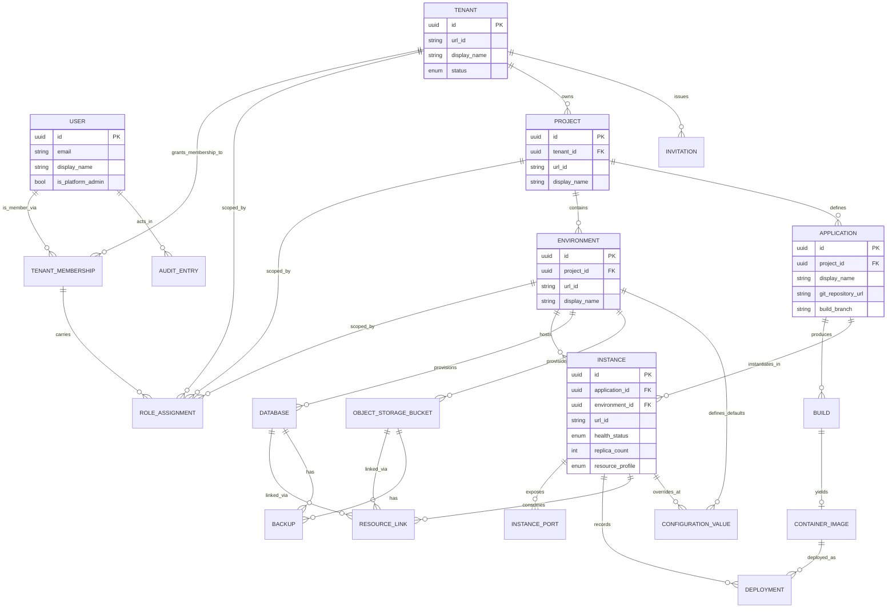

# Requirements: Operations Portal

**Domain:** DevOps / Platform-as-a-Service operations portal for technical business users **Created:** 2026-05-01 **Status:** draft **Last finalised at:** —

> Inferred content is marked `[AI-SUGGESTED: AI-NNN | blocking|non-blocking]` inline. Field-level marking when only some sub-fields are inferred; heading-level marking when the whole item is invented. The fill-every-field rule applies — no blanks.

---

## 1. Application context

**Name:** Operations Portal

**Purpose / business value:** Manage build, deployment, execution, and lifecycle operations for custom applications generated by the platform's AI agents. The portal abstracts underlying container orchestration infrastructure so that technical business users — the same people who use AI agents to build the applications — can run and manage what they build without DevOps expertise. It targets consulting companies delivering custom software to clients on a project basis (consulting company = tenant, client engagement = project) and supports an on-premise installation model where customer business units act as tenants.

**Domain:** DevOps / Platform-as-a-Service operations portal for technical business users. Source: stated (brief.md, requirements-v1.md §1).

**Business goal:** Build an interactive prototype suitable for demoing the concept to stakeholders and gathering feedback before committing to full development. The prototype itself has no backend integration; it must convey the full operating model and UI behaviour with realistic mock data. Source: stated (brief.md Overview / Constraints).

<!-- rev: run-1 2026-05-01 -->

---

## 2. Domain model

> The BA's framing of the business domain in **ubiquitous language**, implementation-free.

### 2.1 Concepts

| Concept | Persistence | Definition (ubiquitous language) |
| --- | --- | --- |
| User | persistent | A person who uses the portal, uniquely identified by email; exists at system level and may belong to one or more tenants. |
| Tenant | persistent | A consulting company or organisation; the top-level isolation boundary owning all projects and resources. |
| TenantMembership | persistent | The association that grants a User access to a Tenant. |
| Project | persistent | A client engagement or initiative within a Tenant, providing strict access isolation. |
| Environment | persistent | A logical grouping (e.g., dev, staging, production) within a Project, with isolated configuration, instances, databases, and storage. |
| Application | persistent | A deployable unit of software defined at the Project level by linking a Git repository. |
| Instance | persistent | The per-Environment running form of an Application; has health, replicas, and resource allocations. |
| InstancePort | persistent | An exposed port mapping enabling a specific port of an Instance to be publicly routable with a path prefix. |
| Build | persistent | The process and record of compiling Application source code into a container image. |
| ContainerImage | persistent | A versioned, runnable image produced by a Build, retained per registry policy. |
| Deployment | persistent | A record of deploying a specific ContainerImage version to an Instance. |
| Database | persistent | A provisioned PostgreSQL database scoped to an Environment. |
| ObjectStorageBucket | persistent | An S3-compatible storage bucket scoped to an Environment. |
| ResourceLink | persistent | The association that links a Database or ObjectStorageBucket into an Instance, with auto-injection of connection details. |
| ConfigurationValue | persistent | A key/value entry scoped to either an Environment (default) or an Instance (override); may be plain or marked secret. |
| Secret | persistent | A ConfigurationValue with `is_secret = true`; values stored encrypted in the secrets backend and never displayed after creation. |
| RoleAssignment | persistent | Grants a TenantMembership a role on a Tenant, Project, or Environment. |
| Invitation | persistent | A pending invitation for a user (by email) to join a Tenant, optionally pre-assigned to a Project and role. |
| AuditEntry | persistent | Immutable record of a significant action taken in the system. |
| Backup | persistent | A backup record for a Database or ObjectStorageBucket, automatic or manual. |
| PlatformAdministrator | derived | A system-level role status held on the User entity (`is_platform_admin`); operates above all tenants. |
| Role | policy | The named permission set granted via RoleAssignment (Tenant Admin, Project Admin, Operator, Viewer, Env Operator, Env Viewer). |
| HealthStatus | derived | Computed state of an Instance (Running / Degraded / Stopped / Failed) based on replica health checks. |
| BuildStatus | derived | Lifecycle state of a Build (queued / in_progress / succeeded / failed / cancelled). |
| DeploymentOutcome | derived | Outcome of a Deployment (succeeded / failed / rolled_back). |
| RetentionPolicy | policy | Platform-defined rules governing image retention, log retention, metric retention, audit retention, and backup retention. |
| IsolationBoundary | policy | The compute / data / network isolation enforced at Tenant, Project, and Environment levels. |
| IdentityProvider | policy | An authentication source available for tenant login: Google OAuth 2.0, Microsoft (Entra ID), generic OIDC, or email/password. |
| ApiGateway | policy | The platform-managed ingress that exposes selected Instances publicly via generated URLs. |

### 2.2 Relationships

- User **has** TenantMembership in Tenant [1..*]
- TenantMembership **carries** RoleAssignment on Tenant | Project | Environment [1..*]
- Tenant **owns** Project [1..*]
- Project **contains** Environment [1..*]
- Project **defines** Application [0..*]
- Application **runs as** Instance in Environment [0..* per environment, 0..* per app]
- Application **produces** Build [0..*]
- Build **produces** ContainerImage [0..1]
- Instance **runs** ContainerImage via Deployment [0..*]
- Instance **exposes** InstancePort [0..*]
- Environment **provisions** Database [0..*]
- Environment **provisions** ObjectStorageBucket [0..*]
- Instance **links to** Database | ObjectStorageBucket via ResourceLink [0..*] (link-target must be in same Environment)
- Environment **defines** ConfigurationValue (defaults) [0..*]
- Instance **defines** ConfigurationValue (overrides) [0..*]
- Tenant **invites** User via Invitation [0..*]
- PlatformAdministrator **administers** Tenant [1..*]
- AuditEntry **records** action by User on Tenant | Project | Environment | resource [1..*]
- Database | ObjectStorageBucket **has** Backup [0..*]

### 2.3 Aggregates & lifecycles

#### Tenant

| Field | Value |
| --- | --- |
| Member concepts | Tenant, TenantMembership, RoleAssignment (tenant-scoped), Invitation, IdentityProvider configuration |
| Lifecycle states | active → suspended → (re)active → deleted |
| Key invariants | (1) A Tenant must always have at least one active `tenant_admin` RoleAssignment (RBAC-07). (2) Suspension stops all running Instances and blocks tenant access without deleting data (PADM-05). (3) Deletion is only permitted from the suspended state and only when no Instances, Databases, or storage buckets exist; requires typing the tenant `url_id` to confirm (PADM-06). (4) The platform must always have at least one active Platform Administrator (PADM-08). |

#### Project

| Field | Value |
| --- | --- |
| Member concepts | Project, Environment, Application, RoleAssignment (project-scoped) |
| Lifecycle states | created → active → deleted |
| Key invariants | (1) Project deletion blocked while any Environment, Application, Database, or ObjectStorageBucket exists (PRJ-07). (2) All resources beneath a Project are scoped to it and never shared across Projects (PRJ-03). (3) A user only sees a Project they have an explicit RoleAssignment for, at any scope under it (PRJ-02). |

#### Environment

| Field | Value |
| --- | --- |
| Member concepts | Environment, Instance, Database, ObjectStorageBucket, environment-level ConfigurationValue / Secret |
| Lifecycle states | created → active → deleted |
| Key invariants | (1) Cross-environment networking is disabled by default (ENV-04). (2) Deletion blocked while any running Instance, Database, or ObjectStorageBucket is present (ENV-09). (3) Linked resources must reside in the same Environment as their Instance (LNK-01). |

#### Application

| Field | Value |
| --- | --- |
| Member concepts | Application, Build, ContainerImage, Instance (per Environment), ResourceLink, instance-level ConfigurationValue / Secret |
| Lifecycle states | registered → building → deployable → (instances per environment with their own lifecycles) → deleted |
| Key invariants | (1) Application deletion blocked while any running Instance exists (APP-07). (2) The configured build branch governs automatic build triggers (BLD-02). (3) Each Build assigns a sequential per-Application `build_number` retained for the lifetime of the Application (BLD-03). |

#### Instance

| Field | Value |
| --- | --- |
| Member concepts | Instance, Deployment, InstancePort, instance-level ConfigurationValue / Secret, ResourceLink |
| Lifecycle states | not-yet-deployed → running → stopped → degraded → failed → (rolled-back / restarted / scaled) |
| Key invariants | (1) Replica count is 1–10; "Stop" sets replicas to 0; restart restores prior replica count (INS-07, INS-03). (2) Rolling updates require new replica health checks to pass before old replicas are removed; failed health checks roll back automatically (INS-04). (3) Default health check is HTTP GET `/health` on port 8080 expecting 200 (INS-13); port and path are user-overridable (INS-14). (4) Configuration changes auto-restart the instance (CFG-03). (5) Resource link/unlink and resource deletion auto-restart affected instances (LNK-06, LNK-07). |

#### Build

| Field | Value |
| --- | --- |
| Member concepts | Build, ContainerImage, log_output |
| Lifecycle states | queued → in_progress → (succeeded / failed / cancelled) |
| Key invariants | (1) Builds use a fixed platform-provided build image with a system-wide timeout; exceeding it forces cancellation (BLD-12). (2) Successful builds always push to the project-scoped registry (REG-02, REG-03). (3) Build numbers are sequential and never reused per Application (BLD-03). |

#### Database

| Field | Value |
| --- | --- |
| Member concepts | Database, Backup |
| Lifecycle states | provisioning → available → (deleting → deleted) / error |
| Key invariants | (1) Deletion blocked while any ResourceLink references the Database (DB-06). (2) Deletion confirmation requires typing the database name (DB-06). (3) Schema migrations are the application's responsibility, not the portal's (DB-07). |

#### ObjectStorageBucket

| Field | Value |
| --- | --- |
| Member concepts | ObjectStorageBucket, Backup |
| Lifecycle states | provisioning → available → (deleting → deleted) / error |
| Key invariants | (1) Deletion blocked while any ResourceLink references the bucket (OBJ-02). (2) Deletion confirmation requires typing the bucket name (OBJ-02). |

#### AuditEntry

| Field | Value |
| --- | --- |
| Member concepts | AuditEntry |
| Lifecycle states | created (immutable) |
| Key invariants | (1) Immutable once written — no user, including any administrator, may modify or delete entries (AUD-05). (2) Retained for at least 1 year; older entries may be archived but must remain retrievable (AUD-06). |

### 2.4 Diagram

<!-- rev: run-1 2026-05-01 -->

---

## 3. Target users

> Target-user personas — the end users of the application being designed. Not to be confused with the Unicorn (LLM) or the Consultant (audience).

### Platform Administrator

| Field | Value |
| --- | --- |
| Role / job title | Platform operator / SRE responsible for the platform installation itself. |
| Expertise level | Strong technical operator; familiar with multi-tenant SaaS administration. |
| Stakes | Very high — actions affect every tenant on the platform; deletions and suspensions are platform-wide events. |
| Frequency of use | Very low to Low — onboarding, suspension, role changes happen during specific events. |
| Driving forces — wants | Clean tenant lifecycle controls; clear visibility of platform health; never accidentally exposing tenant-internal data; assurance that the last platform admin can never be removed. |
| Driving forces — fears | Accidental tenant deletion; locking the platform out by removing the final admin; cross-tenant data leakage; auditability gaps for platform-level actions. |

### Tenant Administrator

| Field | Value |
| --- | --- |
| Role / job title | Tenant lead at a consulting company (or business-unit lead in on-premise installs); responsible for the tenant's people and projects. |
| Expertise level | Technically literate business user; comfortable with role assignment, identity providers, and project structure. |
| Stakes | High — controls tenant membership, project creation, and identity-provider configuration. |
| Frequency of use | Low — invitations, role changes, project creations are not daily. |
| Driving forces — wants | Easy onboarding/offboarding of team members; clear directory of users and their access; simple project creation; confidence that SSO-only enforcement is safe. |
| Driving forces — fears | Locking the tenant out by revoking the wrong role; failed invitation emails going unnoticed; cross-project data leakage. |

### Project Administrator

| Field | Value |
| --- | --- |
| Role / job title | Engagement lead for a specific client project; manages environments and project-level access. |
| Expertise level | Technical; understands multi-environment workflows (dev/staging/production) and Git provider integrations. |
| Stakes | High within their project — controls environments, project membership, and Git credentials. |
| Frequency of use | Medium — environment edits, member assignment, integration management happen weekly. |
| Driving forces — wants | Clean environment lifecycle; per-environment role granularity; reliable Git provider connectivity; quick member onboarding to a project. |
| Driving forces — fears | Misconfigured environments; orphaned resources blocking deletion; accidentally exposing production access. |

### Operator

| Field | Value |
| --- | --- |
| Role / job title | Day-to-day operator — registers applications, runs builds, deploys, manages configuration, secrets, databases, and observes runtime behaviour. The primary daily user of the portal. |
| Expertise level | Strong technical business user; understands deploys, environment variables, and observability concepts but not Kubernetes or DevOps tooling. |
| Stakes | High — operator actions change running production behaviour. |
| Frequency of use | Very high — multiple times per day. |
| Driving forces — wants | Fast paths to environment overview, instance health, logs, and metrics; one-click deploy and rollback; clear feedback during builds; confidence that resource link changes won't surprise me. |
| Driving forces — fears | Deploying the wrong build; secrets leaking into logs or UI; configuration changes silently breaking instances; long, ambiguous troubleshooting cycles. |

### Viewer

| Field | Value |
| --- | --- |
| Role / job title | Read-only stakeholder — product manager, support engineer, business sponsor, or junior team member. |
| Expertise level | Technical literacy varies; understands what an environment, instance, and build are. |
| Stakes | Low — cannot mutate state. |
| Frequency of use | Very high — checks dashboards, logs, and build status frequently. |
| Driving forces — wants | Same fast read paths as operators; clear visibility of who deployed what, when; obvious indication that controls are read-only. |
| Driving forces — fears | Mistaking read-only state for action; missing context (e.g., why is this instance failing). |

<!-- rev: run-1 2026-05-01 -->

---

## 4. User goals & stories

> Quality signals live on the goal (outcome-level), not the story (behaviour-level).

### 4.1 Goals catalogue

| ID | Goal statement | Quality signals | Goal kind | Layout pref (optional) | UX-pattern pref (optional) |
| --- | --- | --- | --- | --- | --- |
| G-01 | Sign in to the portal and arrive at the right tenant/project context with minimum friction. | Login completes in ≤ 2 clicks after provider selection; tenant switcher visible at all times; SSO-only enforcement does not lock out the last admin. | top-level | Top bar with tenant/project switcher | SSO + email/password chooser |
| G-02 | Get an at-a-glance view of every project I'm assigned to and dive into the one I need. | Project dashboard reachable in 1 click; per-project status tiles show environment counts and aggregate health. | top-level | Sidebar + cards | Dashboard |
| G-03 | Understand the state of an environment (instances, versions, health, databases, storage) on a single screen. | All instances + linked resources + health visible without scrolling on a 1440px viewport; states are colour-coded using the platform palette only. | top-level | Master/detail | Environment overview page |
| G-04 | Deploy a new build of an application to an environment with confidence and a clear rollback path. | Deploy reachable in ≤ 3 clicks from project dashboard (NFR-03); build selector shows build number + commit + status; rollback to previous build is one action. | top-level | Wizard or drawer | Step-form / confirmation |
| G-05 | Watch a build in progress in real time and diagnose failures fast. | Live-streaming logs with no perceptible lag; failed builds surface error output prominently; cancellation is one click. | top-level | Split (header + log panel) | Streaming logs |
| G-06 | Investigate runtime behaviour of an instance through logs, metrics, and deployment history. | Logs queryable by time range / severity / keyword in ≤ 5 s for last 24 h (NFR-31); tail mode streams new logs live; metrics dashboards always visible. | top-level | Tabbed instance detail | Time-range filter + chart panels |
| G-07 | Manage configuration values and secrets with clear precedence (environment defaults vs instance overrides). | Override relationship is visualised on the instance config screen; secrets are write-only after creation; rotation creates a new version visibly. | sub-level | Two-pane (env vs instance) | Editable list + masked field |
| G-08 | Provision and manage databases and object storage buckets, link them to instances safely. | Link/unlink shows the auto-restart consequence before confirmation; deletion blocked-when-linked is explained inline; type-name-to-confirm is enforced for destructive deletion. | sub-level | List + drawer | Confirmation dialog |
| G-09 | Onboard, offboard, and re-role users within a tenant or a project without surprises. | Invitation status (sent / failed / pending) is always visible; last-tenant-admin guard surfaces in-context; role changes are audited. | sub-level | Directory list + side panel | Form with explanatory guards |
| G-10 | Operate the platform itself (tenants, platform admins) from a single console with strong guardrails. | Tenant create / suspend / delete are protected by typed-confirmation; running-instance counts visible before destructive ops; last-platform-admin guard is enforced. | sub-level | Dedicated platform-admin section | Guarded action sheet |
| G-11 | Search and inspect the audit trail to answer "who did what, when". | Filters by user / project / action / resource / time range / environment; results paginate without exceeding NFR-30 response budget. | sub-level | Filter bar + table | Faceted search |
| G-12 | Trust the platform's backups and restore a database or bucket when needed. | Backup status is visible per resource; manual backup is one click; restore confirmation explains overwrite + auto-restart consequences. | sub-level | Resource detail | Confirmation dialog |
| G-13 | Expose an instance publicly (or take it private again) without writing infrastructure config. | The "expose" action is reachable from instance detail; the resulting public URL is shown immediately; reverting is symmetric. | sub-level | Instance detail panel | Toggle + URL display |
| G-14 | Feel that the portal is a calm, low-noise console — not a marketing site — so I can stay focused. | Strict design-token adherence (only stated colours); whitespace > complexity; flat design; no decorative gradients. | interaction-level | Console (top bar + persistent sidebar + main) | Enterprise console (AWS/Azure/Vercel-like) |
| G-15 | Receive notifications when long-running asynchronous operations I started complete. | Per-user retention of 50 notifications or 30 days (whichever is smaller); notifications cover build, deploy, and resource provisioning lifecycle. | interaction-level | Top-bar notification tray | Notification centre |

### 4.2 Stories by persona

#### Platform Administrator <!-- → §3 -->

##### Story: As a Platform Administrator, I want to create a new tenant and assign the first tenant admin, so that a consulting company can begin onboarding its team.
| Field | Value |
| --- | --- |
| Goal | → §4.1 G-10 |
| Objective | Create a tenant by display name + url_id and nominate the first tenant administrator (PADM-02, PADM-03). |
| Context (frequency / expertise / stakes) | Low frequency, very high stakes — affects platform-wide tenancy. |
| Linked task flow (optional) | → §5 Flow: Create Tenant |

##### Story: As a Platform Administrator, I want to suspend or delete a tenant under the documented preconditions, so that I can offboard a customer safely.
| Field | Value |
| --- | --- |
| Goal | → §4.1 G-10 |
| Objective | Suspend a tenant (stops instances, blocks access, preserves data); reactivate; delete only from suspended state with no instances/databases/buckets and only after typing url_id (PADM-05, PADM-06). |
| Context (frequency / expertise / stakes) | Very low frequency, very high stakes. |
| Linked task flow (optional) | → §5 Flow: Suspend / Delete Tenant |

##### Story: As a Platform Administrator, I want to grant or revoke the platform admin role to/from another user with a guard against removing the last one, so that the platform always has at least one administrator.
| Field | Value |
| --- | --- |
| Goal | → §4.1 G-10 |
| Objective | Grant/revoke `is_platform_admin`; the action is blocked if it would leave zero platform admins (PADM-08). |
| Context (frequency / expertise / stakes) | Very low frequency, very high stakes. |
| Linked task flow (optional) | — |

#### Tenant Administrator <!-- → §3 -->

##### Story: As a Tenant Administrator, I want to invite a user to the tenant by email and pre-assign them to a project, so that they can start work immediately.
| Field | Value |
| --- | --- |
| Goal | → §4.1 G-09 |
| Objective | Send an invitation; if the email matches an existing portal user, create a TenantMembership; otherwise create both account and membership (USR-01, USR-08). Failed deliveries are surfaced and re-sendable (USR-02). |
| Context (frequency / expertise / stakes) | Low frequency, high stakes. |
| Linked task flow (optional) | → §5 Flow: Invite User |

##### Story: As a Tenant Administrator, I want to deactivate / reactivate a user's tenant membership and change their roles per project or environment, so that access matches the team's current needs.
| Field | Value |
| --- | --- |
| Goal | → §4.1 G-09 |
| Objective | Deactivate / reactivate membership preserving audit history; assign per-project and per-environment roles; the last `tenant_admin` guard prevents lockout (USR-05, USR-06, RBAC-03, RBAC-07). |
| Context (frequency / expertise / stakes) | Low frequency, high stakes. |
| Linked task flow (optional) | — |

##### Story: As a Tenant Administrator, I want to configure tenant settings (display name, identity providers), so that the tenant uses our preferred login methods.
| Field | Value |
| --- | --- |
| Goal | → §4.1 G-01 |
| Objective | Update display name; add/remove SSO providers; enable / disable email/password (only when ≥ 1 SSO provider remains) (TEN-07, AUTH-04). |
| Context (frequency / expertise / stakes) | Very low frequency, high stakes. |
| Linked task flow (optional) | — |

#### Project Administrator <!-- → §3 -->

##### Story: As a Project Administrator, I want to create environments inside a project, so that we can separate dev, staging, and production work.
| Field | Value |
| --- | --- |
| Goal | → §4.1 G-03 |
| Objective | Create environment (display name + url_id); rename; delete only when no running instances / databases / buckets exist (ENV-01, ENV-08, ENV-09). |
| Context (frequency / expertise / stakes) | Low frequency, high stakes. |
| Linked task flow (optional) | → §5 Flow: Create Environment |

##### Story: As a Project Administrator, I want to manage Git provider credentials and assign tenant members to my project, so that operators can register applications and start work.
| Field | Value |
| --- | --- |
| Goal | → §4.1 G-09 |
| Objective | Maintain GitHub / BitBucket credentials as project-level secrets; assign existing tenant members; manage their roles (APP-02, USR-08). |
| Context (frequency / expertise / stakes) | Low frequency, high stakes. |
| Linked task flow (optional) | — |

#### Operator <!-- → §3 -->

##### Story: As an Operator, I want to land on a project dashboard and immediately see every environment and application's status, so that I know where to focus next.
| Field | Value |
| --- | --- |
| Goal | → §4.1 G-02 |
| Objective | View project dashboard summarising environments, applications, and aggregate health (PRJ-08). |
| Context (frequency / expertise / stakes) | Very high frequency, high stakes. |
| Linked task flow (optional) | → §5 Flow: View Project Dashboard |

##### Story: As an Operator, I want to register a new application by linking a Git repository and configuring its build branch, so that the platform can build it.
| Field | Value |
| --- | --- |
| Goal | → §4.1 G-04 |
| Objective | Pick provider (GitHub / BitBucket), repo URL, branch, optional subdirectory; the portal validates accessibility at registration; subsequent invalid credentials surface as build errors (APP-01, APP-03, BLD-02). |
| Context (frequency / expertise / stakes) | Low frequency, medium stakes. |
| Linked task flow (optional) | → §5 Flow: Register Application |

##### Story: As an Operator, I want to deploy a specific build to an environment with rolling-update safety and a one-click rollback path, so that production updates are low-risk.
| Field | Value |
| --- | --- |
| Goal | → §4.1 G-04 |
| Objective | Pick build by build number; deploy via rolling update with health-gated promotion; auto-rollback on health-check failure; manual rollback to a previous build (INS-01, INS-04, INS-05). |
| Context (frequency / expertise / stakes) | High frequency, high stakes. |
| Linked task flow (optional) | → §5 Flow: Deploy Build |

##### Story: As an Operator, I want to start, stop, restart, and scale an instance, so that I can respond to load and incidents.
| Field | Value |
| --- | --- |
| Goal | → §4.1 G-04 |
| Objective | Start/stop/restart an instance; set replica count 1–10 (INS-03, INS-07); start restores prior replica count. |
| Context (frequency / expertise / stakes) | Medium frequency, high stakes. |
| Linked task flow (optional) | — |

##### Story: As an Operator, I want to watch a build in progress with streaming logs and cancel if needed, so that I can stop wasted runs early.
| Field | Value |
| --- | --- |
| Goal | → §4.1 G-05 |
| Objective | View build status (queued / in_progress / succeeded / failed / cancelled); stream logs in real time; cancel an in-progress build (BLD-04, BLD-05, BLD-14). |
| Context (frequency / expertise / stakes) | High frequency, medium stakes. |
| Linked task flow (optional) | → §5 Flow: Watch Build |

##### Story: As an Operator, I want to view, filter, and tail instance logs, so that I can diagnose runtime issues fast.
| Field | Value |
| --- | --- |
| Goal | → §4.1 G-06 |
| Objective | View logs filtered by time range, severity (DEBUG/INFO/WARN/ERROR), and keyword; tail in near real time (OBS-02, OBS-03). |
| Context (frequency / expertise / stakes) | Very high frequency, high stakes. |
| Linked task flow (optional) | → §5 Flow: Investigate Instance |

##### Story: As an Operator, I want to view metrics dashboards (CPU, memory, error rates, restarts; request rate/latency for exposed instances), so that I can monitor health and performance.
| Field | Value |
| --- | --- |
| Goal | → §4.1 G-06 |
| Objective | View native dashboards rendered in the portal (OBS-11, OBS-12). |
| Context (frequency / expertise / stakes) | High frequency, medium stakes. |
| Linked task flow (optional) | — |

##### Story: As an Operator, I want to manage environment-level and instance-level configuration (including secrets) with clear precedence, so that overrides are predictable.
| Field | Value |
| --- | --- |
| Goal | → §4.1 G-07 |
| Objective | Add/edit/delete env-level and instance-level configuration; mark a value as secret at creation (irrevocable) (CFG-01, CFG-02, CFG-05); rotate secrets as new versions (SEC-07, SEC-08). |
| Context (frequency / expertise / stakes) | Medium frequency, high stakes. |
| Linked task flow (optional) | → §5 Flow: Edit Configuration |

##### Story: As an Operator, I want to provision a database or storage bucket and link it to an instance with auto-injected connection details, so that applications get the dependencies they need.
| Field | Value |
| --- | --- |
| Goal | → §4.1 G-08 |
| Objective | Create database / bucket scoped to an environment; link to an instance in the same environment; injection of host/port/db-name as configuration and credentials as secrets (DB-01, OBJ-01, LNK-01, LNK-02, LNK-04). |
| Context (frequency / expertise / stakes) | Low frequency, high stakes. |
| Linked task flow (optional) | → §5 Flow: Link Resource |

##### Story: As an Operator, I want to expose an instance publicly via the API gateway and see the generated URL, so that external traffic can reach it.
| Field | Value |
| --- | --- |
| Goal | → §4.1 G-13 |
| Objective | Mark an instance public; the platform generates a URL `<app>.<env>.<project>.<tenant>.<portal-domain>` (NET-02, NET-03, NET-04). |
| Context (frequency / expertise / stakes) | Low frequency, high stakes. |
| Linked task flow (optional) | — |

##### Story: As an Operator, I want to receive notifications for completion of builds, deploys, and provisioning operations, so that I don't have to babysit progress screens.
| Field | Value |
| --- | --- |
| Goal | → §4.1 G-15 |
| Objective | Receive in-portal notifications per NOT-01..03. |
| Context (frequency / expertise / stakes) | High frequency, low stakes. |
| Linked task flow (optional) | — |

##### Story: As an Operator, I want to trigger a manual backup or restore a database/bucket from a backup point, so that I can protect data before risky changes.
| Field | Value |
| --- | --- |
| Goal | → §4.1 G-12 |
| Objective | Manual backup at any time; restore from a backup point overwrites the target and restarts linked instances (NFR-62, NFR-64). |
| Context (frequency / expertise / stakes) | Low–very-low frequency, very high stakes. |
| Linked task flow (optional) | — |

#### Viewer <!-- → §3 -->

##### Story: As a Viewer, I want to see project dashboards, environment overviews, application detail, build history, deployment history, logs, and metrics, so that I can monitor what the team is doing without making changes.
| Field | Value |
| --- | --- |
| Goal | → §4.1 G-02, G-03, G-06 |
| Objective | Read-only access to dashboards, environment / instance / application views, logs (with filters and tail), metrics, deployment history, configuration values (secrets masked), and backup status. |
| Context (frequency / expertise / stakes) | Very high frequency, low stakes (read-only). |
| Linked task flow (optional) | → §5 Flow: View Project Dashboard, Investigate Instance |

##### Story: As a Viewer, I want all mutating controls to be visibly disabled or hidden, so that I never mistake a read-only screen for an actionable one.
| Field | Value |
| --- | --- |
| Goal | → §4.1 G-14 |
| Objective | All actions excluded from a Viewer's RoleAssignment must be either hidden or rendered disabled with explanatory tooltip. [AI-SUGGESTED: AI-001 | non-blocking — choice between hidden vs disabled is a UX preference; brief did not specify.] |
| Context (frequency / expertise / stakes) | Very high frequency, low stakes. |
| Linked task flow (optional) | — |

#### Cross-role: Audit

##### Story: As an administrator or operator, I want to search and inspect the audit trail (filtered by user / project / action / resource / time / environment), so that I can answer compliance and forensic questions.
| Field | Value |
| --- | --- |
| Goal | → §4.1 G-11 |
| Objective | Search audit log; view audit entry detail; visibility scoped to the user's role (AUD-04). |
| Context (frequency / expertise / stakes) | Medium frequency, medium stakes. |
| Linked task flow (optional) | — |

---

## 5. Task flows

### Flow: Sign in and land in tenant context
| Field | Value |
| --- | --- |
| Actor | Any persona (§3) |
| Trigger | User opens the portal URL. |
| Steps | (1) Choose identity provider (Google / Microsoft / OIDC) or email/password; (2) authenticate with provider; (3) if user belongs to multiple tenants, select tenant context (or auto-route to last-used tenant per USR-10); (4) optionally select last-used project; (5) land on project dashboard or tenant home. |
| Decision points | (a) Tenant has email/password disabled → email/password option is hidden. (b) User's tenant is suspended → block access with explanatory message. (c) Multiple tenant memberships → present switcher. |
| Exception paths | Authentication failure → error message and retry; account lockout per policy (see §6.6.1). Audit event recorded for failed attempts (AUTH-05). |
| Role-conditional behaviour | Platform Administrators with no tenant membership land on the platform admin console instead of a tenant home. |

### Flow: View Project Dashboard
| Field | Value |
| --- | --- |
| Actor | Project Admin / Operator / Viewer |
| Trigger | User selects a project from the sidebar. |
| Steps | (1) Resolve user's roles for the project; (2) load environment list with aggregate instance health; (3) load application list with current build / health per environment; (4) render dashboard tiles. |
| Decision points | If user has no role on the project → not shown in sidebar (PRJ-02). |
| Exception paths | Backend errors render placeholder tiles with retry. |
| Role-conditional behaviour | Viewer sees the same data; mutation actions are not rendered. |

### Flow: Create Tenant (Platform Admin)
| Field | Value |
| --- | --- |
| Actor | Platform Administrator |
| Trigger | "Create tenant" action from platform admin console. |
| Steps | (1) Enter display name; (2) enter url_id (validated lowercase alphanumeric+hyphens, unique system-wide); (3) nominate first tenant admin (existing User by email, or invite by email — Invitation auto-created); (4) confirm; (5) tenant is provisioned with isolated databases / storage / compute (TEN-01..04). |
| Decision points | Url_id collision → block with inline error. |
| Exception paths | Provisioning failure → roll back partial provisioning; surface error; record failure in audit. |
| Role-conditional behaviour | Only Platform Administrators see this flow (PADM-01..03). Action recorded in audit (PADM-09). |

### Flow: Suspend / Delete Tenant
| Field | Value |
| --- | --- |
| Actor | Platform Administrator |
| Trigger | "Suspend" or "Delete" on a tenant row. |
| Steps | Suspend: confirm → suspended state set → all running instances are stopped → access blocked for tenant members. Reactivate: confirm → state set to active. Delete: only enabled when status=suspended AND no instances/databases/buckets remain → user types tenant url_id → confirm → permanent deletion. |
| Decision points | Delete blocked unless preconditions met (PADM-06). |
| Exception paths | Stop-instances step fails → surface error; tenant remains in transitional state until resolved. |
| Role-conditional behaviour | Recorded in audit (PADM-09). |

### Flow: Invite User
| Field | Value |
| --- | --- |
| Actor | Tenant Administrator (or Project Administrator with the same effect, USR-08) |
| Trigger | "Invite user" from user directory. |
| Steps | (1) Enter email; (2) optionally pre-assign to a project + role; (3) submit; (4) Invitation created and email dispatched; (5) on acceptance, user is created (if new) and TenantMembership + RoleAssignment are created (USR-01, USR-02, USR-08). |
| Decision points | Email already a tenant member → block with inline message. |
| Exception paths | Email delivery failure → log and surface to inviter; allow re-send (USR-02). |
| Role-conditional behaviour | Project Admins may only invite into their project; Tenant Admins may invite without a project pre-assignment. Action audited (USR-09). |

### Flow: Create Environment
| Field | Value |
| --- | --- |
| Actor | Project Administrator |
| Trigger | "Create environment" from project dashboard. |
| Steps | (1) Enter display name; (2) enter url_id (lowercase alphanumeric+hyphens, unique within project); (3) confirm; (4) environment provisioned with own configuration / instances / databases / storage namespace (ENV-01..02). |
| Decision points | Url_id collision within project → inline error. |
| Exception paths | — |
| Role-conditional behaviour | Recorded in audit. |

### Flow: Register Application
| Field | Value |
| --- | --- |
| Actor | Operator |
| Trigger | "Register application" from project applications view. |
| Steps | (1) Pick Git provider (GitHub / BitBucket); (2) enter repository URL; (3) pick build branch; (4) optionally enter subdirectory (monorepo); (5) portal validates repo accessibility (APP-01); (6) application is created. |
| Decision points | Validation failure → inline error; no application created. |
| Exception paths | Git credentials become invalid later → builds fail with clear error (APP-01). |
| Role-conditional behaviour | Audit logs the registration. |

### Flow: Watch Build
| Field | Value |
| --- | --- |
| Actor | Operator (or Viewer to watch read-only) |
| Trigger | Build starts (auto on branch push, BLD-02; or manual via T-BLD-04). |
| Steps | (1) Open build detail; (2) view live status (queued → in_progress → succeeded/failed/cancelled); (3) tail logs in real time; (4) on failure, error output is surfaced; (5) on success, build is pushed to registry (REG-02). |
| Decision points | Operator may cancel an in-progress build (BLD-14). |
| Exception paths | Build exceeds platform timeout → auto-cancelled (BLD-12). |
| Role-conditional behaviour | Viewer cannot trigger or cancel. |

### Flow: Deploy Build
| Field | Value |
| --- | --- |
| Actor | Operator |
| Trigger | "Deploy" action on an instance, or "Deploy here" on a build. |
| Steps | (1) Pick target instance (existing in target environment); (2) pick build by build number (build status must be `succeeded`); (3) confirm; (4) rolling update — new replica must pass health check before next old replica is removed (INS-04); (5) on success → Deployment recorded with outcome=`succeeded`; (6) on health-check failure → automatic rollback to previous build, outcome=`rolled_back`. |
| Decision points | If no instance exists in the target environment, the operator first creates one (T-INS-03a). |
| Exception paths | Build does not exist or was cancelled → block with error. |
| Role-conditional behaviour | Operators (project / environment scope) only; auditable. |

### Flow: Investigate Instance (logs + metrics)
| Field | Value |
| --- | --- |
| Actor | Operator / Viewer |
| Trigger | Click an instance from environment overview. |
| Steps | (1) Open instance detail; (2) check health status (INS-09); (3) open Logs tab → filter by time range / severity / keyword (OBS-02); (4) optionally enable tail mode (OBS-03); (5) open Metrics tab → view CPU / memory / error rate / restart counts; for publicly exposed instances, also request rate / latency (OBS-12); (6) cross-reference deployment history if recent change suspected. |
| Decision points | If user is a Viewer, controls remain read-only. |
| Exception paths | Time range exceeds retention (logs > 30 days, metrics > 90 days) → empty result with explanation. |
| Role-conditional behaviour | Viewer cannot tail-attach in a "follow" mode that triggers writes; the read path is identical. [AI-SUGGESTED: AI-002 | non-blocking — assumes streaming reads are read-only.] |

### Flow: Edit Configuration
| Field | Value |
| --- | --- |
| Actor | Operator |
| Trigger | Open Configuration tab on an environment or instance. |
| Steps | (1) Pick scope (environment-level default OR instance-level override); (2) add / edit / delete key-value entry; (3) optionally mark new entry as secret (irrevocable, CFG-05); (4) confirm — instance is auto-restarted (CFG-03). |
| Decision points | Adding an instance-level entry that overrides an environment-level default is shown as such in the UI. Marking as secret cannot be undone. |
| Exception paths | Restart failure → instance falls into Failed state → operator must investigate. |
| Role-conditional behaviour | Viewer sees masked secret values. Audit logged (AUD-02). |

### Flow: Link Resource (Database / Bucket)
| Field | Value |
| --- | --- |
| Actor | Operator |
| Trigger | "Link" action from Instance Linked Resources view or from resource detail drawer on environment overview. |
| Steps | (1) Pick resource (must be in same environment as the instance, LNK-01); (2) confirm; (3) connection details auto-injected — non-sensitive as configuration, credentials as secrets (LNK-02, LNK-04); (4) instance is restarted on link change. |
| Decision points | Resource in different environment → not selectable. |
| Exception paths | Link change fails → no injection occurs. Unlink restarts instance (LNK-06). Resource deletion forces unlink + restart of all linked instances (LNK-07). |
| Role-conditional behaviour | Audit logged (LNK-08). |

### Flow: Search Audit Trail
| Field | Value |
| --- | --- |
| Actor | Tenant Admin / Project Admin / Operator (scoped); Platform Admin (platform-level only). |
| Trigger | Open Audit view. |
| Steps | (1) Apply filters (user / project / action / resource / time range / environment) (AUD-04); (2) browse paginated results; (3) open an entry to see action, target, outcome, and details (AUD-03). |
| Decision points | Visibility is role-scoped — Platform Admins see only platform-level events (no tenant-internal data, PADM-04, PADM-09). |
| Exception paths | Query exceeds retention horizon → archived-data prompt; cold-storage retrieval initiated. [AI-SUGGESTED: AI-003 | non-blocking — UX detail of cold-storage retrieval (synchronous wait vs async ticket) not stated.] |
| Role-conditional behaviour | Records are immutable (AUD-05). |

---

## 6. Requirements

### 6.1 Functional

#### Authentication & Identity (AUTH)

- **F-AUTH-01** Support login via Google OAuth 2.0. (AUTH-01)
- **F-AUTH-02** Support login via Microsoft Entra ID / Azure AD. (AUTH-02)
- **F-AUTH-03** Support login via generic OpenID Connect (OIDC) identity providers. (AUTH-03)
- **F-AUTH-04** Support email/password login alongside SSO. Tenant administrators may disable email/password to enforce SSO-only login, but only when at least one SSO provider remains enabled. (AUTH-04)
- **F-AUTH-05** Record all authentication events (login, logout, failed attempts) in the audit trail. (AUTH-05)
- **F-AUTH-06** Redirect to login on session timeout. A user with multiple tenant memberships has a single authenticated session and switches tenant context without re-authenticating. (AUTH-06)

#### Multi-Tenancy & Isolation (TEN, PRJ, PADM)

- **F-TEN-01..07** Multi-tenant support up to 100 tenants with full data, compute, database, and storage isolation; cross-tenant data access disallowed; per-tenant configuration of name and identity providers. (TEN-01 to TEN-07)
- **F-PRJ-01..08** Multi-project per tenant with strict access isolation; resources scoped to project; project assignment by tenant or project admin; multi-project membership with potentially different roles per project; project name/description editable; deletion only when no associated resources; project dashboard with environments, applications, status. (PRJ-01 to PRJ-08)
- **F-PADM-01..10** Platform Administrator role at system level; create/suspend/reactivate/delete tenants under documented preconditions (typed url_id confirmation for delete; tenant must be suspended and empty); list tenants with display name, status, creation date, project count; per-tenant summary (project / environment / instance / database / bucket / membership counts and suspension history) without exposing tenant-internal data; first platform admin created via setup; grant/revoke platform admin with last-admin guard; all platform admin actions audited. (PADM-01 to PADM-10)

#### Role-Based Access Control (RBAC)

- **F-RBAC-01** Enforce RBAC for all operations. (RBAC-01)
- **F-RBAC-03** Roles assignable at four levels: platform-wide, tenant-wide, per-project, per-environment within a project. (RBAC-03)
- **F-RBAC-04** Permissions cover project / application / environment / data storage / secrets / user management / audit viewing. The detailed action-to-role permission matrix is to be defined during the design phase. (RBAC-04, defer to design)
- **F-RBAC-05** Default roles: Platform Admin, Tenant Admin, Project Admin, Operator, Viewer. Custom roles are not supported in v1. (RBAC-05)
- **F-RBAC-06** Audit role assignments (who, what, where, when). (RBAC-06)
- **F-RBAC-07** Each tenant must always have ≥ 1 tenant administrator; the platform must prevent any action that would leave a tenant with zero. (RBAC-07)

#### User Management (USR)

- **F-USR-01..10** Invite users by email (existing users get a new tenant membership; new users are created and invited). Email delivery failures logged and re-sendable. Tenant directory (members, roles, project assignments, last login). Deactivate / reactivate tenant memberships preserving audit history. Project Admins may invite-and-assign to their project. Self-service profile (display name); password handled by IDP; no portal session management in v1 (last-used preferences are backend state, not session management). (USR-01, USR-02, USR-04, USR-05, USR-06, USR-07, USR-08, USR-09, USR-10)

#### Application Management (APP, LNK)

- **F-APP-01..07** Register an application by linking a Git repository (GitHub / BitBucket); validate at registration; subsequent invalid credentials surface as build errors. Git credentials stored as project-level secrets. Multiple applications may share a repo (monorepo) with optional subdirectory. List and view applications; per-environment instance breakdown. Edit name/description. Delete only when no running instances. (APP-01 to APP-07)
- **F-LNK-01..08** Link / unlink Database or ObjectStorageBucket to an instance in the same environment; auto-inject connection details (non-sensitive as config, credentials as secrets); view linked resources; unlink restarts instance; resource deletion auto-removes links and restarts affected instances; all link changes audited. (LNK-01, LNK-02, LNK-04, LNK-05, LNK-06, LNK-07, LNK-08)

#### Build & Containerisation (BLD, REG)

- **F-BLD-01..14** Built-in container build system; configured build branch per application with auto-trigger on branch changes (filtered by subdirectory for monorepos); per-build versioned image tagged with commit SHA; sequential per-application build numbers; real-time and post-hoc build logs; build status visible (queued / in_progress / succeeded / failed / cancelled); build history with build number, who triggered, source commit, duration, outcome; failed-build error output; standard platform build image with fixed resources and system-wide timeout (auto-cancel on overrun); manual trigger and cancellation supported. (BLD-01..07, BLD-12, BLD-13, BLD-14)
- **F-REG-01..04** Built-in container registry as platform infrastructure; auto-push successful builds; tenant + project isolation of images; retention policy (latest build, currently deployed, two most recent previously-deployed images per instance — others auto-deleted). (REG-01 to REG-04)

#### Environment Management (ENV)

- **F-ENV-01..09** Define environments per project (limit governed by NFR-41); environment-level isolation of instances / configuration / databases / storage; intra-environment networking allowed; cross-environment networking disabled by default; environment overview screen (instances / databases / buckets / health); environment-level configuration as defaults overridable at instance level; no automatic promotion (deploys are explicit per environment); rename and delete environment (only if empty). (ENV-01 to ENV-09)

#### Instance Management (INS)

- **F-INS-01..14** Deploy a specific build (by build number) to an existing instance via rolling update; instance lifecycle (start/stop/restart); rolling update with health-gated promotion and auto-rollback; manual rollback to previous build; deployment history per instance; replica count 1–10 (start restores prior count); health states (Running / Degraded / Stopped / Failed); resource profiles (Small / Medium / Large) — actual CPU/memory allocations to be defined during design phase; default health check HTTP GET `:8080/health` with 200 response — interval / timeout / failure thresholds to be defined during design phase; user-overridable port and path. (INS-01..07, INS-09 to INS-11, INS-13, INS-14)

#### Data Storage (DB, OBJ)

- **F-DB-01..07** Provision PostgreSQL databases (version to be defined during design phase); environment-scoped; database isolation (separate DB per resource); list databases with status and consumers; backups via platform backup system; auto-injection on link; deletion blocked-when-linked, otherwise typed-name confirmation. Schema migrations are application's responsibility, not portal's. (DB-01 to DB-07)
- **F-OBJ-01..06** Provision S3-compatible buckets; create / view / delete with same delete guards as DB; environment-scoped; auto-injection on link; bucket usage display (object count, size); included in platform backup system. (OBJ-01 to OBJ-06)

#### Configuration & Secrets (CFG, SEC)

- **F-CFG-01..05** Environment-level configuration (defaults); instance-level configuration (overrides on key collision); changes auto-restart instance; values may be marked secret at creation (irrevocable). (CFG-01 to CFG-03, CFG-05)
- **F-SEC-01..08** Secrets management with encrypted-at-rest storage; injectable into instances; values write-only (metadata visible after creation); access/modification audited; environment- or instance-scoped (instance-level overrides); rotate creates a new version; metadata-only version history. (SEC-01 to SEC-08)

#### Networking (NET)

- **F-NET-01..04** Internal DNS for intra-environment instance discovery; private-by-default with API gateway for public ingress; per-instance public exposure toggle; default URL `<app-id>.<env-id>.<project-id>.<tenant-id>.<portal-domain>`. (NET-01 to NET-04)

#### Observability (OBS, NOT)

- **F-OBS-01..03** Collect and store instance logs; filter by time range / keyword / severity (DEBUG/INFO/WARN/ERROR); near real-time tailing. (OBS-01..03)
- **F-OBS-10..13** Collect metrics from instances + infrastructure; native built-in dashboards in the portal UI; default dashboards include CPU/memory/error rate/restart counts (and request rate/latency for publicly exposed instances); log retention 30 days, metric retention 90 days, older data auto-purged. (OBS-10..13)
- **F-NOT-01..03** In-portal completion notifications for asynchronous user-initiated operations (build, deploy, resource provisioning), retained per-user as last 50 or 30 days, whichever is smaller. (NOT-01..03)

#### Audit Trail (AUD)

- **F-AUD-01..06** Maintain a full operational audit trail covering all significant actions (auth / platform admin / user-and-role / project / app / build / deploy / instance / resource link / config / secret / database / environment / networking). Each entry: timestamp, acting user, tenant, project, environment (where applicable), action, target, outcome. Searchable / filterable; visibility scoped to user role. Immutable. Retained ≥ 1 year; older may be archived but must remain retrievable. (AUD-01..06)

#### Backup & Restore (NFR-60..66)

- **F-BAK-01..06** Automatic daily backups of all stateful resources (databases, buckets, configuration, secrets, portal state) with platform-defined schedule and retention (daily 7 days, weekly 30 days); manual on-demand backups; backup status visible; restore overwrites target resource and restarts linked instances; restore requires confirmation; all operations audited; RPO 24 h / RTO 4 h. (NFR-60..66)

#### Out of Scope (informational)

- AI agent functionality; source code editing; billing / metering; environment promotion workflows; infrastructure provisioning of clusters; database schema migrations; CLI tooling; advanced deployment strategies (blue-green, canary, traffic-splitting); cross-region failover; i18n/l10n; persistent file volumes (v2); auth proxy for hosted apps (v2); alerting / webhooks (v2); custom domains / advanced API gateway routing (v2); usage tracking / reporting (v2); REST API for automation (v2). (Source: requirements-v1.md §20.)

#### Technology Constraints (informational)

- Container orchestration: Kubernetes. Metrics collection: Prometheus. Dashboards: native (portal-built, querying Prometheus directly). Observability export: OpenTelemetry. Supported databases: PostgreSQL. (Source: requirements-v1.md §21.)

#### Prototype Constraints

- **F-PROTO-01** This release is an interactive prototype for stakeholder demo; no backend integration is required. All data shown must be realistic mock data (not lorem ipsum). Mobile responsiveness is out of scope. (Source: brief.md Constraints.)

### 6.2 Business rules

| ID | Statement (when / then) | Enforcement point | Source | Severity |
| --- | --- | --- | --- | --- |
| BR-01 | When a user attempts to disable email/password authentication, then the action is blocked unless at least one SSO provider is enabled for the tenant. | UI + service | AUTH-04 | blocker |
| BR-02 | When a session times out, then the user is redirected to the login screen, but a user with multiple tenant memberships does not re-authenticate when switching tenant context within an active session. | UI + service | AUTH-06 | major |
| BR-03 | When any action would leave a tenant with zero `tenant_admin` role assignments (role removal, deactivation, or membership removal), then the action is blocked. | service | RBAC-07 | blocker |
| BR-04 | When any action would leave the platform with zero active platform administrators, then the action is blocked. | service | PADM-08 | blocker |
| BR-05 | When a tenant deletion is requested, then the tenant must be in suspended state, must have zero running instances/databases/buckets, and the administrator must type the tenant url_id to confirm. | UI + service | PADM-06 | blocker |
| BR-06 | When a project deletion is requested, then it must have no associated environments / applications / databases / buckets / secrets. | service | PRJ-07 | blocker |
| BR-07 | When an environment deletion is requested, then it must have no running instances / databases / buckets. | service | ENV-09 | blocker |
| BR-08 | When an application deletion is requested, then it must have no running instances. | service | APP-07 | blocker |
| BR-09 | When a database / bucket deletion is requested, then it must have no resource links to any instance, and the operator must type the database / bucket name to confirm. | UI + service | DB-06, OBJ-02 | blocker |
| BR-10 | When a resource link or unlink occurs, then connection details / credentials are auto-injected (link) or removed (unlink) and the affected instance is automatically restarted. | service | LNK-02, LNK-04, LNK-06 | major |
| BR-11 | When a database or bucket is deleted, then all its resource links are removed and affected instances are restarted. | service | LNK-07 | major |
| BR-12 | When a configuration value or secret is created / updated / deleted, then the affected instance is automatically restarted. | service | CFG-03 | major |
| BR-13 | When a configuration value is created with `is_secret = true`, then it cannot be changed back to a plain value — the value must be deleted and recreated. | service | CFG-05 | major |
| BR-14 | When a build runs longer than the system-wide build timeout, then the build is cancelled and marked failed. | service | BLD-12 | major |
| BR-15 | When a successful build completes, then the resulting image is pushed to the project-scoped container registry. | service | REG-02, REG-03 | major |
| BR-16 | When the registry retention policy runs, then images that are not the latest build, currently deployed, or among the two most recently previously-deployed images per instance are deleted. | service | REG-04 | major |
| BR-17 | When a deploy occurs, then the rolling update must wait for each new replica's health check to pass before removing the next old replica; if a new replica fails its health check, the rollout is halted and rolled back. | service | INS-04 | blocker |
| BR-18 | When an instance is stopped, then replicas are set to zero; when started again, replicas are restored to the previously configured count. | service | INS-03, INS-07 | major |
| BR-19 | When a resource link is created, then the linked Database / ObjectStorageBucket must be in the same Environment as the Instance. | service | LNK-01 | blocker |
| BR-20 | When public exposure is configured, then the platform generates a URL of the form `<app>.<env>.<project>.<tenant>.<portal-domain>`; instances without InstancePort records are not publicly accessible. | service | NET-02..04 | major |
| BR-21 | When a tenant is suspended, then all its running instances are stopped and tenant access is blocked, but data is preserved. | service | PADM-05 | blocker |
| BR-22 | When a Platform Administrator queries tenant detail, then no tenant-internal data (project contents, application data, log content, full user profile) is exposed — only counts and high-level status. | service | PADM-04, PADM-10 | blocker |
| BR-23 | When the audit log is queried, then visibility is scoped to events the user's role permits; entries are immutable; retention ≥ 1 year. | service | AUD-04, AUD-05, AUD-06 | blocker |
| BR-24 | When a backup restore is requested, then it requires explicit confirmation, fully overwrites the target resource, and restarts linked instances. | service | NFR-64 | blocker |
| BR-25 | When a tenant_membership is deactivated, then the user cannot access the tenant or perform actions, but audit history and resource attribution are preserved. | service | USR-05 | major |
| BR-26 | When a user is identified, then email is the unique system-level identifier and is immutable. | data | AUTH-06, USR-01 | blocker |
| BR-27 | When a tenant / project / environment / instance is created, then the supplied url_id must match `^[a-z0-9-]+$`, must be unique within its scope, and is immutable thereafter. | UI + service | Naming Convention | blocker |
| BR-28 | When configuration keys overlap, then instance-level values override environment-level defaults; this applies to plain values and secrets alike. | service | CFG-02, SEC-06 | major |
| BR-29 | When a notification is generated, then it is delivered for build start/completion, deployment start/completion (with rolled-back outcome counted), and resource provisioning start/completion; per-user retention is the smaller of 50 entries or 30 days. | service | NOT-01..03 | minor |
| BR-30 | When a Viewer accesses any screen, then mutating controls must not be operable — they are either hidden or rendered disabled with an explanatory tooltip. [AI-SUGGESTED: AI-004 \| non-blocking — "hidden vs disabled" is a UX choice not stated in inputs.] | UI | RBAC-05 | minor |

### 6.3 Data

- **F-DATA-01** All persistent entities listed in §2.1 must be modelled per §7. Source: stated (domain-model-v1.md).
- **F-DATA-02** Every persistent entity must have an immutable `id` (UUID PK); creation timestamp; and where applicable a `url_id` matching `^[a-z0-9-]+$` unique within scope (Tenant, Project, Environment, Instance). (Naming Convention.)
- **F-DATA-03** User identification is by email and is unique system-wide and immutable. (USR-01, AUTH-06)
- **F-DATA-04** RoleAssignment is polymorphic on `resource_id` referencing Tenant / Project / Environment; permission resolution is "most specific scope wins" — environment overrides project overrides tenant. Platform admin status is held on the User entity (`is_platform_admin`), not via RoleAssignment. (RBAC-03, RBAC-05; domain-model §2.4.)
- **F-DATA-05** Build numbers are sequential per Application and never reused; ContainerImages are tagged with the Git commit SHA. (BLD-03)
- **F-DATA-06** Configuration values are scoped to exactly one of Environment or Instance (XOR); secrets are stored as references to the secrets backend, never inline values. (CFG-01, CFG-02, SEC-02, SEC-04)
- **F-DATA-07** Audit entries are append-only and indexed for filtering by user / tenant / project / environment / action / resource / time. (AUD-04, AUD-05)
- **F-DATA-08** Backups have an explicit `retention_expires_at`; daily 7 days, weekly 30 days. (NFR-61)
- **F-DATA-09** All data shown in this prototype is realistic mock data (not lorem ipsum); no live backend integration is required. (Source: brief.md Constraints.)
- **F-DATA-10** Data residency is not specified by the inputs. [AI-SUGGESTED: AI-005 | blocking — enterprise SaaS with EU/UK customers commonly requires regional data residency; default assumption is single-region with no residency guarantees, to be confirmed.]

### 6.4 User-facing

#### Visual style and tokens (from brief.md)

- **F-UX-01** Use only the colour tokens defined in `brief.md` Colors block. No new colours may be introduced. Maximum two colours per component. (Source: brief.md Visual Style.)
- **F-UX-02** Typography: Inter / system-ui / sans-serif at the sizes (xs 12 / sm 14 / base 16 / lg 18 / xl 20 / 2xl 24) and weights (400 / 500 / 600) defined in brief.md.
- **F-UX-03** Spacing: xs 4px / sm 8px / md 16px / lg 24px / xl 32px. Radius: sm 6px / md 10px / lg 14px.
- **F-UX-04** Visual style: clean enterprise SaaS — flat (no heavy shadows / gradients), whitespace over complexity, simple cards with subtle borders, minimal readable typography, no decorative hero sections. (Source: brief.md Style.)

#### Layout and navigation

- **F-UX-10** Console layout (AWS / Azure / Vercel-style): fixed top bar for global actions, persistent left sidebar navigation, main content area for primary tasks. Always-visible sidebar; clear section grouping. (Source: brief.md Layout Preferences.)
- **F-UX-11** Maintain strict alignment and consistent spacing; avoid large decorative elements; keep visual hierarchy subtle using spacing and typography. Density: medium. (Source: brief.md Design Principles.)
- **F-UX-12** Top bar must include tenant context switcher, project context, notification tray (NOT-01..03), and user menu. [AI-SUGGESTED: AI-006 | non-blocking — composition of the top bar derived from goals G-01, G-02, G-15; not enumerated in inputs.]
- **F-UX-13** Sidebar groups by current scope (Tenant / Project) and collapses platform-admin sections only for users with `is_platform_admin`. [AI-SUGGESTED: AI-007 | non-blocking.]
- **F-UX-14** Common operations (deploy, view logs, check status) must be reachable in ≤ 3 clicks from the project dashboard. (NFR-03)

#### Browser / device support

- **F-UX-20** Support modern evergreen browsers (Chrome, Firefox, Edge, Safari). Desktop only — mobile and offline are not supported. (NFR-04, brief.md Constraints.)

#### Interaction patterns

- **F-UX-30** Destructive actions (delete tenant, project, environment, application, database, bucket; restore; suspend tenant) require explicit confirmation; for tenant / database / bucket deletion the user must type the resource identifier to confirm. (PADM-06, PRJ-07, ENV-09, APP-07, DB-06, OBJ-02, NFR-64)
- **F-UX-31** Logs view supports time-range / keyword / severity filters and a "tail" mode that streams new lines live. (OBS-02, OBS-03)
- **F-UX-32** Build view shows status icon, build number, commit SHA, trigger user (or "automatic"), duration, and a streaming log panel with cancel control while in_progress. (BLD-04, BLD-05, BLD-13, BLD-14)
- **F-UX-33** Configuration view distinguishes environment-level defaults from instance-level overrides; secrets render as masked fields after creation. (CFG-01, CFG-02, SEC-04)
- **F-UX-34** State colours: success uses `success` token, warning uses `warning` token, danger / failure uses `danger` token; healthy/running uses `primary` family; degraded/warning uses `warning`. [AI-SUGGESTED: AI-008 | non-blocking — mapping of HealthStatus to tokens is a UI choice, not stated.]
- **F-UX-35** Notification tray shows last 50 notifications or 30 days, whichever is smaller, with read/unread state. (NOT-03)

### 6.5 Access control (RBAC)

> Roles-×-resources matrix. Cell values use the action vocabulary below; blanks mean "no access".
>
> The detailed action-to-role permission matrix is to be finalised during the design phase (RBAC-04). The matrix below captures the documented rules for v1 default roles and is consistent with §6.2 business rules. Cells marked `[AI-SUGGESTED]` are reasonable defaults derived from the role description and should be confirmed.

**Action vocabulary:** `C` create · `R` read · `U` update · `D` delete · `X` execute / invoke · `A` approve · `—` no access. Suffix with a BR ref for conditional access (e.g. `U†BR-07` = update gated by BR-07).

| Role (→ §3) | Tenant | Project | Environment | Application | Build | Instance | Database | ObjectStorageBucket | ResourceLink | ConfigurationValue / Secret | RoleAssignment / Membership | AuditEntry | InstancePort (public exposure) | Backup |
| --- | --- | --- | --- | --- | --- | --- | --- | --- | --- | --- | --- | --- | --- | --- |
| Platform Administrator | C R U†BR-21 D†BR-05 | — (counts only via PADM-10) | — | — | — | — (counts only) | — (counts only) | — (counts only) | — | — | C R U D (platform admin role only, †BR-04) | R (platform-level only) | — | — |
| Tenant Administrator | R U (own tenant) | C R U D†BR-06 | C R U D†BR-07 [AI-SUGGESTED: AI-009 \| non-blocking] | R [AI-SUGGESTED: AI-010 \| non-blocking] | R [AI-SUGGESTED: AI-011 \| non-blocking] | R [AI-SUGGESTED: AI-012 \| non-blocking] | R [AI-SUGGESTED: AI-013 \| non-blocking] | R [AI-SUGGESTED: AI-014 \| non-blocking] | R [AI-SUGGESTED: AI-015 \| non-blocking] | R [AI-SUGGESTED: AI-016 \| non-blocking] | C R U D (tenant + project + environment scopes, †BR-03) | R (tenant scope) | — | R [AI-SUGGESTED: AI-017 \| non-blocking] |
| Project Administrator | — | R U (own project) | C R U D†BR-07 | R [AI-SUGGESTED: AI-018 \| non-blocking] | R [AI-SUGGESTED: AI-019 \| non-blocking] | R [AI-SUGGESTED: AI-020 \| non-blocking] | R [AI-SUGGESTED: AI-021 \| non-blocking] | R [AI-SUGGESTED: AI-022 \| non-blocking] | R [AI-SUGGESTED: AI-023 \| non-blocking] | R [AI-SUGGESTED: AI-024 \| non-blocking] | C R U D (project + environment scopes within project) | R (project scope) | — | R [AI-SUGGESTED: AI-025 \| non-blocking] |
| Operator (project- or env-scoped) | — | R | R | C R U D†BR-08 | C R U†(cancel)X (trigger) | C R U D X (start/stop/restart/deploy/rollback/scale; constraints per BR-17, BR-18) | C R U D†BR-09 | C R U D†BR-09 | C D†BR-10 | C R U D (with BR-12, BR-13, BR-28) | — | R (operator scope per AUD-04) | C D (expose / unexpose) | C X (manual backup), X (restore†BR-24) |
| Viewer | — | R | R | R | R | R | R | R | R | R (secrets masked, F-UX-33) | — | R (viewer scope per AUD-04) | R (URLs only) | R |

Notes:

- Platform Administrators have no read access to tenant-internal data (PADM-04, PADM-10) — their visibility is limited to counts and high-level status.
- The detailed mapping of fine-grained actions (e.g., scale vs deploy vs rollback) to role granularity (project-level Operator vs environment-level `env_operator`) is to be defined during the design phase per RBAC-04.
- Conditional cells (`U†BR-NN`, `D†BR-NN`) reference the §6.2 business rule that gates the action.

### 6.6 Non-functional

> NFRs are first-class and **must be filled even when inferred** — domain heuristics drive defaults. Inferred values carry `[AI-SUGGESTED]`.

#### 6.6.1 Security & session

| Field | Value | Source |
| --- | --- | --- |
| Idle session timeout | 30 minutes [AI-SUGGESTED: AI-030 \| blocking — common enterprise SaaS default; not stated in inputs.] | inferred |
| Absolute session timeout | 12 hours [AI-SUGGESTED: AI-031 \| blocking — common enterprise SaaS default; not stated in inputs.] | inferred |
| Idle warning lead-time | 60 seconds before idle logout [AI-SUGGESTED: AI-032 \| non-blocking.] | inferred |
| Re-auth scope | Step-up re-authentication for: tenant deletion, platform admin role grant/revoke, granting/revoking tenant_admin, restoring a database/bucket, exposing/unexposing an instance publicly. [AI-SUGGESTED: AI-033 \| blocking — protects highest-stakes actions; specific list inferred from PADM-06, PADM-08, RBAC-07, NFR-64, NET-02..03.] | inferred |
| Account lockout policy | After 5 failed email/password attempts within 15 minutes, lock the account for 15 minutes; lockouts and resets are audited. [AI-SUGGESTED: AI-034 \| blocking — standard enterprise default; AUTH-05 logs failures but threshold not stated.] | inferred |
| MFA requirement | MFA is delegated to the configured identity provider (Google, Microsoft, OIDC). For email/password, MFA is required for Platform Administrators and Tenant Administrators; optional for other roles. [AI-SUGGESTED: AI-035 \| blocking — enterprise SaaS norm; inputs do not specify.] | inferred |
| Encryption in transit | TLS for all portal communication. | NFR-10 (stated) |
| Encryption at rest | Sensitive data (secrets, credentials) encrypted at rest. | NFR-14, SEC-02 (stated) |
| AuthZ at every endpoint | All API endpoints enforce authentication and authorisation. | NFR-11 (stated) |
| Isolation | Compute / data / database / storage / networking isolation between tenants and projects at every layer. | NFR-12, TEN-01..04 (stated) |
| External IDP integration | Google OAuth 2.0, Microsoft (Entra ID), generic OIDC. | NFR-13, AUTH-01..03 (stated) |

#### 6.6.2 Performance

| Metric | Target | Source |
| --- | --- | --- |
| Portal UI response under normal load | ≤ 2 seconds | NFR-30 (stated) |
| Log and metrics queries (most recent 24 h) | ≤ 5 seconds | NFR-31 (stated) |
| Dashboard tile refresh interval | 30 seconds (default), user-controllable to 10–60 s [AI-SUGGESTED: AI-040 \| non-blocking.] | inferred |
| Log tail latency | ≤ 2 seconds end-to-end [AI-SUGGESTED: AI-041 \| non-blocking — implied by OBS-03 "near real-time" but not quantified.] | inferred |

#### 6.6.3 Availability

| Field | Value | Source |
| --- | --- | --- |
| Target uptime | 99.9% (three nines) for the portal control plane [AI-SUGGESTED: AI-050 \| blocking — common B2B SaaS default; NFR-20 states "designed for HA, no SPOF" but no quantitative SLA in inputs.] | inferred |
| Maintenance window | None — rolling upgrades only [AI-SUGGESTED: AI-051 \| non-blocking — derived from "no SPOF" and the lifecycle independence in NFR-21.] | inferred |
| RTO / RPO | RTO 4 hours / RPO 24 hours | NFR-66 (stated) |
| Application availability decoupled from portal | Portal downtime must not affect running applications. | NFR-21 (stated) |
| Build/deploy resilience | Retries with backoff for transient failures. | NFR-22 (stated) |
| Backup retention | Daily 7 days, weekly 30 days. | NFR-61 (stated) |

#### 6.6.4 Compliance & audit

- Audit logs retained ≥ 1 year; older entries may be archived to cold storage but must remain retrievable. (AUD-06, stated.)
- Audit logs are immutable. (AUD-05, stated.)
- Compliance regimes in scope for v1: SOC 2 Type II controls (logical access, change management, audit) and general best-practice security baseline. [AI-SUGGESTED: AI-060 | blocking — inputs do not name a specific compliance regime; assumption follows enterprise SaaS norms for a multi-tenant operations platform.]
- Data residency: single-region by default; multi-region not in scope for v1. [AI-SUGGESTED: AI-061 | blocking — inputs are silent on residency; cross-region failover is explicitly out of scope per requirements-v1 §20.]
- PII handled: user email and display name. No special-category personal data is collected by the portal itself; application-level data residency is the application owner's responsibility. [AI-SUGGESTED: AI-062 | non-blocking.]

#### 6.6.5 Accessibility

- WCAG 2.2 Level AA for the prototype's interactive components. [AI-SUGGESTED: AI-070 | blocking — enterprise SaaS norm; brief is silent on accessibility.]
- Keyboard operability for all primary flows (sign-in, sidebar nav, deploy, log-tail toggle, configuration edit). [AI-SUGGESTED: AI-071 | non-blocking.]
- Colour contrast must meet 4.5:1 for text using the provided palette; the only `accent` colour (`#22C55E`) must not be used as the sole carrier of meaning. [AI-SUGGESTED: AI-072 | non-blocking.]
- Screen-reader labels for all icon-only controls (state badges, action buttons in tables). [AI-SUGGESTED: AI-073 | non-blocking.]

---

## 7. Data entities

> Implementation-prep view: storage shape, types, validations, FK plumbing.

### Entity: User

| Field | Type | Required | Validation | Notes |
| --- | --- | --- | --- | --- |
| id | UUID | yes | PK | — |
| email | String | yes | Unique, immutable, RFC 5322 valid | System-level identifier (USR-01, AUTH-06) |
| display_name | String | yes | Length 1–80 [AI-SUGGESTED: AI-080 \| non-blocking] | Editable by user (USR-10) |
| is_platform_admin | Boolean | yes | Default false | PADM-01, PADM-08 |
| created_at | Timestamp | yes | Not null | — |

**Domain concept:** User (§2.1)

**Relationships:** User 1—* TenantMembership; User 1—* AuditEntry; User 1—* (RoleAssignment via TenantMembership). Platform admin status is a flag on User, not a RoleAssignment.

**Enums:** —

### Entity: Tenant

| Field | Type | Required | Validation | Notes |
| --- | --- | --- | --- | --- |
| id | UUID | yes | PK | — |
| url_id | String | yes | Unique, immutable, `^[a-z0-9-]+$` | DNS / URL component (Naming Convention) |
| display_name | String | yes | Length 1–120 [AI-SUGGESTED: AI-081 \| non-blocking] | Editable (TEN-07) |
| status | Enum | yes | `active` / `suspended`, default `active` | PADM-05 |
| identity_providers | List<String> | yes | Non-empty; values from {`google`, `microsoft`, `oidc`, `email_password`}; `email_password` removable only when ≥ 1 SSO entry remains | AUTH-04, TEN-07 |
| created_at | Timestamp | yes | Not null | — |

**Domain concept:** Tenant (§2.1)

**Relationships:** Tenant 1—* Project; Tenant 1—* TenantMembership; Tenant 1—* Invitation.

**Enums:** TenantStatus = {active, suspended}.

### Entity: TenantMembership

| Field | Type | Required | Validation | Notes |
| --- | --- | --- | --- | --- |
| id | UUID | yes | PK | — |
| user_id | UUID | yes | FK → User | USR-01 |
| tenant_id | UUID | yes | FK → Tenant | USR-01 |
| status | Enum | yes | `active` / `deactivated`, default `active` | USR-05, USR-06 |
| last_login_at | Timestamp | no | Nullable | USR-04 |
| created_at | Timestamp | yes | Not null | — |

**Domain concept:** TenantMembership (§2.1)

**Relationships:** User 1—* TenantMembership *—1 Tenant; TenantMembership 1—* RoleAssignment.

**Enums:** MembershipStatus = {active, deactivated} [AI-SUGGESTED: AI-082 | non-blocking — explicit status field added because USR-05/06 require deactivate/reactivate semantics; domain-model inputs imply but don't name the field.]

### Entity: RoleAssignment

| Field | Type | Required | Validation | Notes |
| --- | --- | --- | --- | --- |
| id | UUID | yes | PK | — |
| tenant_membership_id | UUID | yes | FK → TenantMembership | RBAC-03 |
| resource_type | Enum | yes | `tenant` / `project` / `environment` | RBAC-03 |
| resource_id | UUID | yes | Polymorphic FK consistent with resource_type | RBAC-03 |
| role | Enum | yes | One of {tenant_admin, project_admin, project_operator, project_viewer, env_operator, env_viewer} | RBAC-05 |
| created_at | Timestamp | yes | Not null | — |

**Domain concept:** RoleAssignment (§2.1)

**Relationships:** RoleAssignment *—1 TenantMembership; RoleAssignment *—1 (Tenant | Project | Environment).

**Enums:** Role = {tenant_admin, project_admin, project_operator, project_viewer, env_operator, env_viewer}; ResourceType (RA) = {tenant, project, environment}.

**Constraints:** Unique on (tenant_membership_id, resource_type, resource_id, role). Permission resolution: most specific scope wins (env > project > tenant). At least one `tenant_admin` role assignment per tenant at all times (RBAC-07).

### Entity: Invitation

| Field | Type | Required | Validation | Notes |
| --- | --- | --- | --- | --- |
| id | UUID | yes | PK | — |
| tenant_id | UUID | yes | FK → Tenant | USR-01 |
| email | String | yes | RFC 5322 valid | USR-01 |
| invited_by | UUID | yes | FK → User | USR-01 |
| project_id | UUID | no | FK → Project, set if pre-assigned | USR-08 |
| project_role | Enum | no | Required iff project_id set | USR-08 |
| status | Enum | yes | `pending` / `delivery_failed`, default `pending` | USR-02 [AI-SUGGESTED: AI-083 \| non-blocking — explicit status added so failed deliveries can be surfaced; domain-model says invitations are deleted on accept/expire and didn't include status.] |
| created_at | Timestamp | yes | Not null | — |

**Domain concept:** Invitation (§2.1)

**Relationships:** Invitation *—1 Tenant; Invitation *—1 User (invited_by); Invitation *—0..1 Project.

**Enums:** InvitationStatus = {pending, delivery_failed}.

### Entity: Project

| Field | Type | Required | Validation | Notes |
| --- | --- | --- | --- | --- |
| id | UUID | yes | PK | — |
| tenant_id | UUID | yes | FK → Tenant | PRJ-01 |
| url_id | String | yes | Unique within tenant, immutable, `^[a-z0-9-]+$` | Naming Convention |
| display_name | String | yes | Length 1–120 [AI-SUGGESTED: AI-084 \| non-blocking] | PRJ-06 |
| description | String | no | Length 0–500 [AI-SUGGESTED: AI-085 \| non-blocking] | PRJ-06 |
| created_at | Timestamp | yes | Not null | — |

**Domain concept:** Project (§2.1)

**Relationships:** Project *—1 Tenant; Project 1—* Environment; Project 1—* Application.

**Enums:** —

### Entity: Environment

| Field | Type | Required | Validation | Notes |
| --- | --- | --- | --- | --- |
| id | UUID | yes | PK | — |
| project_id | UUID | yes | FK → Project | ENV-01 |
| url_id | String | yes | Unique within project, immutable, `^[a-z0-9-]+$` | Naming Convention |
| display_name | String | yes | Length 1–80 [AI-SUGGESTED: AI-086 \| non-blocking] | ENV-08 |
| created_at | Timestamp | yes | Not null | — |

**Domain concept:** Environment (§2.1)

**Relationships:** Environment *—1 Project; Environment 1—* Instance; Environment 1—* Database; Environment 1—* ObjectStorageBucket; Environment 1—* ConfigurationValue (env-scoped).

**Enums:** —

### Entity: Application

| Field | Type | Required | Validation | Notes |
| --- | --- | --- | --- | --- |
| id | UUID | yes | PK | — |
| project_id | UUID | yes | FK → Project | APP-01 |
| display_name | String | yes | Length 1–120 [AI-SUGGESTED: AI-087 \| non-blocking] | APP-06 |
| description | String | no | Length 0–500 [AI-SUGGESTED: AI-088 \| non-blocking] | APP-06 |
| git_provider | Enum | yes | `github` / `bitbucket` | APP-01 |
| git_repository_url | String | yes | URL, validated at registration | APP-01 |
| git_subdirectory | String | no | Path-like string, default repo root | APP-03 |
| build_branch | String | yes | Editable | BLD-02 |
| created_at | Timestamp | yes | Not null | — |

**Domain concept:** Application (§2.1)

**Relationships:** Application *—1 Project; Application 1—* Build; Application 1—* Instance.

**Enums:** GitProvider = {github, bitbucket}.

### Entity: Build

| Field | Type | Required | Validation | Notes |
| --- | --- | --- | --- | --- |
| id | UUID | yes | PK | — |
| application_id | UUID | yes | FK → Application | BLD-01 |
| build_number | Integer | yes | Sequential per application, ≥ 1 | BLD-03 |
| status | Enum | yes | `queued` / `in_progress` / `succeeded` / `failed` / `cancelled` | BLD-05, BLD-14 |
| git_commit_sha | String | yes | Valid Git SHA | BLD-03 |
| triggered_by | UUID | no | FK → User; null if automatic | BLD-06, BLD-13 |
| trigger_type | Enum | yes | `automatic` / `manual` | BLD-02, BLD-13 |
| started_at | Timestamp | no | Nullable | BLD-06 |
| completed_at | Timestamp | no | Nullable | BLD-06 |
| duration_seconds | Integer | no | Computed | BLD-06 |
| log_output | Text | no | Captured in real time | BLD-04, BLD-07 |
| created_at | Timestamp | yes | Not null | — |

**Domain concept:** Build (§2.1)

**Relationships:** Build *—1 Application; Build 1—0..1 ContainerImage; Build *—0..1 User (triggered_by).

**Enums:** BuildStatus = {queued, in_progress, succeeded, failed, cancelled}; BuildTriggerType = {automatic, manual}.

### Entity: ContainerImage

| Field | Type | Required | Validation | Notes |
| --- | --- | --- | --- | --- |
| id | UUID | yes | PK | — |
| build_id | UUID | yes | FK → Build | REG-02 |
| application_id | UUID | yes | FK → Application | REG-03 |
| tag | String | yes | Git commit SHA | BLD-03 |
| created_at | Timestamp | yes | Not null | — |

**Domain concept:** ContainerImage (§2.1)

**Relationships:** ContainerImage *—1 Build; ContainerImage *—1 Application; ContainerImage 1—* Deployment.

**Enums:** —

### Entity: Instance

| Field | Type | Required | Validation | Notes |
| --- | --- | --- | --- | --- |
| id | UUID | yes | PK | — |
| application_id | UUID | yes | FK → Application | INS-01 |
| environment_id | UUID | yes | FK → Environment | INS-01 |
| url_id | String | yes | Unique within environment, immutable, `^[a-z0-9-]+$` | NET-01, NET-04 |
| current_build_id | UUID | no | FK → Build (nullable until first deploy) | BLD-03, INS-01 |
| health_status | Enum | yes | `running` / `degraded` / `stopped` / `failed` | INS-09 |
| replica_count | Integer | yes | 1..10, default 1 | INS-07 |
| resource_profile | Enum | yes | `small` / `medium` / `large` | INS-10, INS-11 |
| health_check | String | yes | Format `:<port><path>`, default `:8080/health` | INS-13, INS-14 |
| created_at | Timestamp | yes | Not null | — |

**Domain concept:** Instance (§2.1)

**Relationships:** Instance *—1 Application; Instance *—1 Environment; Instance 1—* InstancePort; Instance 1—* Deployment; Instance 1—* ResourceLink; Instance 1—* ConfigurationValue (instance-scoped).

**Enums:** HealthStatus = {running, degraded, stopped, failed}; ResourceProfile = {small, medium, large}.

### Entity: InstancePort

| Field | Type | Required | Validation | Notes |
| --- | --- | --- | --- | --- |
| id | UUID | yes | PK | — |
| instance_id | UUID | yes | FK → Instance | NET-03 |
| internal_port | Integer | yes | 1..65535 | NET-03 |
| path_prefix | String | yes | Default `/`, must start with `/` | NET-03 |
| display_name | String | no | e.g. "API", "Admin UI" | — |
| created_at | Timestamp | yes | Not null | — |

**Domain concept:** InstancePort (§2.1)

**Relationships:** InstancePort *—1 Instance.

**Enums:** —

**Constraints:** Unique on (instance_id, internal_port); unique on (instance_id, path_prefix).

### Entity: Deployment

| Field | Type | Required | Validation | Notes |
| --- | --- | --- | --- | --- |
| id | UUID | yes | PK | — |
| instance_id | UUID | yes | FK → Instance | INS-06 |
| container_image_id | UUID | yes | FK → ContainerImage | INS-01 |
| deployed_by | UUID | yes | FK → User | INS-06 |
| outcome | Enum | yes | `succeeded` / `failed` / `rolled_back` | INS-04, INS-06 |
| deployed_at | Timestamp | yes | Not null | INS-06 |

**Domain concept:** Deployment (§2.1)

**Relationships:** Deployment *—1 Instance; Deployment *—1 ContainerImage; Deployment *—1 User.

**Enums:** DeploymentOutcome = {succeeded, failed, rolled_back}.

### Entity: Database

| Field | Type | Required | Validation | Notes |
| --- | --- | --- | --- | --- |
| id | UUID | yes | PK | — |
| environment_id | UUID | yes | FK → Environment | DB-02 |
| database_name | String | yes | Unique within environment, immutable, `^[a-z0-9-]+$` | DB-05, Naming Convention |
| status | Enum | yes | `provisioning` / `available` / `deleting` / `error` | DB-03 |
| created_by | UUID | yes | FK → User | — |
| created_at | Timestamp | yes | Not null | — |

**Domain concept:** Database (§2.1)

**Relationships:** Database *—1 Environment; Database 1—* ResourceLink; Database 1—* Backup.

**Enums:** ProvisioningStatus = {provisioning, available, deleting, error}.

### Entity: ObjectStorageBucket

| Field | Type | Required | Validation | Notes |
| --- | --- | --- | --- | --- |
| id | UUID | yes | PK | — |
| environment_id | UUID | yes | FK → Environment | OBJ-03 |
| bucket_name | String | yes | Unique within environment, immutable, `^[a-z0-9-]+$` | OBJ-04, Naming Convention |
| status | Enum | yes | `provisioning` / `available` / `deleting` / `error` | — |
| object_count | Integer | no | Computed for display | OBJ-05 |
| total_bytes | Long | no | Computed for display | OBJ-05 |
| created_by | UUID | yes | FK → User | — |
| created_at | Timestamp | yes | Not null | — |

**Domain concept:** ObjectStorageBucket (§2.1)

**Relationships:** Bucket *—1 Environment; Bucket 1—* ResourceLink; Bucket 1—* Backup.

**Enums:** ProvisioningStatus.

### Entity: ResourceLink

| Field | Type | Required | Validation | Notes |
| --- | --- | --- | --- | --- |
| id | UUID | yes | PK | — |
| instance_id | UUID | yes | FK → Instance | LNK-01 |
| resource_type | Enum | yes | `database` / `object_storage_bucket` | LNK-01 |
| resource_id | UUID | yes | FK → Database or ObjectStorageBucket consistent with resource_type | LNK-01 |
| created_by | UUID | yes | FK → User | — |
| created_at | Timestamp | yes | Not null | — |

**Domain concept:** ResourceLink (§2.1)

**Relationships:** ResourceLink *—1 Instance; ResourceLink *—1 (Database | ObjectStorageBucket).

**Enums:** ResourceType (Link) = {database, object_storage_bucket}.

**Constraints:** Unique on (instance_id, resource_type, resource_id). The linked resource and the instance must be in the same environment.

### Entity: ConfigurationValue

| Field | Type | Required | Validation | Notes |
| --- | --- | --- | --- | --- |
| id | UUID | yes | PK | — |
| environment_id | UUID | no | FK → Environment, set for env-scope only | CFG-01, SEC-06 |
| instance_id | UUID | no | FK → Instance, set for instance-scope only | CFG-02, SEC-06 |
| key | String | yes | Length 1–128, `^[A-Za-z_][A-Za-z0-9_]*$` [AI-SUGGESTED: AI-090 \| non-blocking — keys typically env-var-style; not stated.] | CFG-01 |
| value | String | yes | For plain: literal value. For secrets: vault path/key reference. | CFG-05, SEC-04 |
| is_secret | Boolean | yes | Immutable once set to true | CFG-05 |
| created_at | Timestamp | yes | Not null | — |
| updated_at | Timestamp | yes | Not null | — |

**Domain concept:** ConfigurationValue / Secret (§2.1)

**Relationships:** ConfigurationValue *—1 (Environment XOR Instance).

**Enums:** —

**Constraints:** Exactly one of environment_id / instance_id must be set. Unique on (environment_id, key) and on (instance_id, key). Instance-scope overrides env-scope on key collision.

### Entity: AuditEntry

| Field | Type | Required | Validation | Notes |
| --- | --- | --- | --- | --- |
| id | UUID | yes | PK | — |
| timestamp | Timestamp | yes | Not null; serves as creation time | AUD-03 |
| user_id | UUID | yes | FK → User | AUD-03 |
| tenant_id | UUID | no | FK → Tenant; null for platform-level events | AUD-03, PADM-09 |
| project_id | UUID | no | FK → Project | AUD-03 |
| environment_id | UUID | no | FK → Environment | AUD-03 |
| action | String | yes | e.g. `user.invite`, `instance.deploy`, `build.trigger` | AUD-02 |
| target_resource_type | String | yes | — | AUD-03 |
| target_resource_id | UUID | yes | — | AUD-03 |
| outcome | Enum | yes | `success` / `failure` | AUD-03 |
| details | JSON | no | Optional context | — |

**Domain concept:** AuditEntry (§2.1)

**Relationships:** AuditEntry *—1 User; *—0..1 Tenant; *—0..1 Project; *—0..1 Environment.

**Enums:** AuditOutcome = {success, failure}.

**Constraints:** Immutable. Indexed by (user_id), (tenant_id, timestamp), (project_id, timestamp), (action, timestamp). Retained ≥ 1 year.

### Entity: Backup

| Field | Type | Required | Validation | Notes |
| --- | --- | --- | --- | --- |
| id | UUID | yes | PK | — |
| resource_type | Enum | yes | `database` / `object_storage_bucket` | NFR-60 |
| resource_id | UUID | yes | FK → Database or Bucket consistent with resource_type | NFR-60 |
| backup_type | Enum | yes | `automatic` / `manual` | NFR-61, NFR-62 |
| status | Enum | yes | `in_progress` / `succeeded` / `failed` | NFR-63 |
| created_at | Timestamp | yes | Not null | NFR-63 |
| completed_at | Timestamp | no | Nullable | — |
| size_bytes | Long | no | Nullable | — |
| retention_expires_at | Timestamp | yes | Daily backups +7 days, weekly backups +30 days | NFR-61 |

**Domain concept:** Backup (§2.1)

**Relationships:** Backup *—1 (Database | ObjectStorageBucket).

**Enums:** BackupType = {automatic, manual}; BackupStatus = {in_progress, succeeded, failed}.

---

## 8. Source UI references

| Reference | Location | Notes |
| --- | --- | --- |
| (none provided) | — | brief.md states explicitly: "There is no screen list. Propose options based on the information provided." No consultant-supplied screenshots or wireframes were provided. The design phase is expected to propose screens consistent with §6.4 visual style and §6.6 NFRs. [AI-SUGGESTED: AI-100 \| non-blocking — confirms absence per inputs; not an inference.] |

---

## 9. Key terminology

> Domain-concept definitions or non-domain-concept terms (process, role, UI).

| Term | Definition | Inconsistency flag |
| --- | --- | --- |
| Application | A deployable unit of software defined at the project level (Git repo, branch, optional subdir) — see §2.1. | — |
| Instance | The per-environment running form of an application — see §2.1. | — |
| Service (reserved) | Used in the portal **only** to refer to backend business-logic services within generated application code (e.g., UserService). The portal UI does not use "service" for orchestration concepts. | NFR-02 |
| Environment | A logical grouping (dev, staging, production) within a project — see §2.1. Replaces the Kubernetes term "namespace" in user-facing copy. | NFR-02 |
| Replica | A running copy of an instance; UI uses "replica count" rather than "pod count" or "deployment replicas". | NFR-02 |
| Build | The compile-to-image process; identified by a per-application sequential `build_number` — see §2.1, BLD-03. | — |
| Container | A packaged, versioned, runnable image of an application — see requirements-v1 §2 Key Concepts. | — |
| Tenant | A consulting company / organisation; top-level isolation boundary — see §2.1. | — |
| Project | A client engagement / initiative within a tenant; isolation boundary for membership and resources — see §2.1. | — |
| url_id | The immutable lowercase-alphanumeric-and-hyphens identifier for tenants, projects, environments, and instances; used in DNS / URLs / service discovery — see Naming Convention in requirements-v1 §2. | — |
| Display name | The editable human-readable label, distinct from `url_id`; used in the UI; changing it does not affect infrastructure. | — |
| Platform Administrator | System-level operator above all tenants; tracked as `is_platform_admin` on User — see §2.1, PADM-01. Distinct from Tenant Administrator. | — |
| Operator | A primary daily user — registers, builds, deploys, monitors; not a DevOps engineer. | — |
| Viewer | Read-only stakeholder. | — |
| API gateway | Platform-managed ingress for exposing instances publicly via generated URLs (NET-02..04). | — |
| Health check | Default HTTP GET `:8080/health` expecting 200; per-instance overridable port and path (INS-13, INS-14). | — |
| Rolling update | Default and only deployment strategy in v1; health-gated promotion with auto-rollback (INS-04). | — |
| Resource link | Association between an instance and a database / bucket in the same environment, with auto-injected connection details (LNK-01..04). | — |
| Step-up re-authentication | Additional authentication required for high-stakes actions — list defined in §6.6.1. [AI-SUGGESTED: AI-110 \| non-blocking — terminology defined here because the policy is inferred.] | inferred |

---

## 10. Volumes

| Metric | Value | Source |
| --- | --- | --- |
| Maximum tenants system-wide | 100 (target; not a hard cap on the system itself) | NFR-40 (stated, with note "we don't constrain the system to this") |
| Maximum environments per tenant (across all projects) | 100 (target; not a hard cap) | NFR-41 (stated, with same note) |
| Projects per tenant | No explicit cap; design assumption ~ 10 active projects per tenant (low-tens) [AI-SUGGESTED: AI-120 \| non-blocking — derived from "consulting company with multiple client engagements" framing in requirements-v1 §1.] | inferred |
| Applications per project | Design assumption ~ 5–20 applications per project [AI-SUGGESTED: AI-121 \| non-blocking — typical platform-as-a-service density.] | inferred |
| Instances per environment | Design assumption ~ 5–30 instances per environment, replica_count 1–10 each (INS-07) | INS-07 (replica range stated); count of instances inferred [AI-SUGGESTED: AI-122 \| non-blocking] |
| Databases / buckets per environment | Design assumption ≤ 20 each [AI-SUGGESTED: AI-123 \| non-blocking] | inferred |
| Concurrent active users (across all tenants) | Design assumption ~ 200 concurrent (peak) for the prototype scaling target [AI-SUGGESTED: AI-124 \| blocking — required for sizing horizontal scaling targets per NFR-42; inputs are silent.] | inferred |
| Build frequency | Design assumption ~ 1–10 builds per application per day under normal load [AI-SUGGESTED: AI-125 \| non-blocking — drives queue and registry sizing.] | inferred |
| Log volume per instance | Design assumption ≤ 1 GB / day average, ≤ 10 GB / day peak per instance [AI-SUGGESTED: AI-126 \| non-blocking — drives 30-day log retention sizing per OBS-13.] | inferred |
| Audit-log entries per tenant | Design assumption 1k–100k entries per tenant per year [AI-SUGGESTED: AI-127 \| non-blocking — drives retention and indexing per AUD-06.] | inferred |
| Backup data volume | Function of database / bucket sizes; daily 7d + weekly 30d retention applied (NFR-61). | NFR-61 |

---
