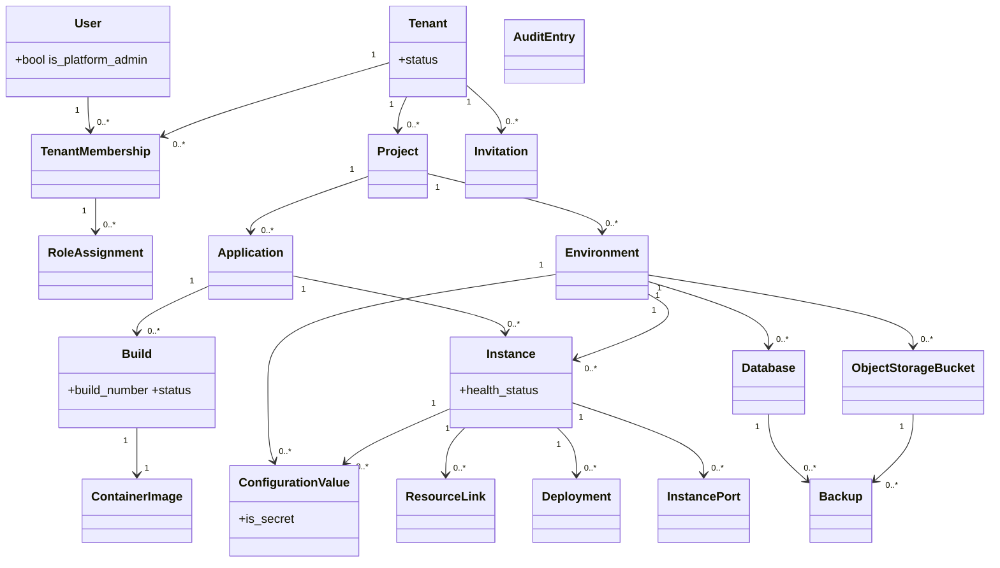

# Requirements: Operations Portal

**Domain:** Developer / Platform Operations Tooling [AI-SUGGESTED: AI-001 | non-blocking] **Created:** 2026-04-30 [AI-SUGGESTED: AI-002 | non-blocking] **Status:** draft **Last finalised at:** — [AI-SUGGESTED: AI-003 | non-blocking]

> Inferred content is marked `[AI-SUGGESTED]` inline. Field-level marking when only some sub-fields are inferred; heading-level marking when the whole item is invented. The fill-every-field rule applies — no blanks.

---

## 1. Application context

**Name:** Operations Portal

**Purpose / business value:** Provide a single web portal for technically strong business users to build, deploy, run, and operate the custom applications produced by the platform's AI agents — abstracting container-orchestration concepts behind business-friendly language so consulting teams can deliver and operate per-client software without DevOps specialists.

**Domain:** Developer / Platform Operations Tooling for AI-generated custom software [AI-SUGGESTED: AI-004 | non-blocking]

**Business goal:** Enable consulting companies (and on-premise customers) to deliver, operate, and govern AI-generated custom software for their own clients on a per-project basis, with strict tenant and project isolation, predictable build/deploy/observe workflows, and minimal infrastructure expertise required from end users. The portal will be demoed to stakeholders as an interactive prototype to gather feedback before full development. [AI-SUGGESTED: AI-005 | blocking] (the prototype/feedback framing is from the brief; the broader consulting-delivery framing is inferred from §1 of `requirements-v1.md`)

<!-- rev: run-1 2026-04-30 -->

---

## 2. Domain model

> The BA's framing of the business domain in **ubiquitous language**, implementation-free.

### 2.1 Concepts

| Concept | Persistence | Definition (ubiquitous language) |
| --- | --- | --- |
| User | persistent | A person who uses the portal, uniquely identified by email, who may be a member of one or more tenants. |
| Tenant | persistent | A consulting company or on-premise organisation; the top-level isolation boundary for all data, compute, and storage. |
| Tenant Membership | persistent | The association linking a User to a Tenant, granting that user access to that tenant's projects per their role assignments. |
| Role Assignment | persistent | The grant of a role to a Tenant Membership on a specific resource (tenant, project, or environment). |
| Platform Administrator | policy | A system-level designation on a User authorising platform-wide tenant management; not scoped to any tenant. |
| Project | persistent | A client engagement or initiative within a tenant; the scope inside which all environments, applications, and resources live. |
| Environment | persistent | A logical grouping (e.g. dev/staging/production) within a project, with its own instances, configuration, databases, and storage. |
| Application | persistent | A deployable unit of software defined at the project level by linking a Git repository (with optional subdirectory). |
| Instance | persistent | The per-environment running form of an Application, with its own health, configuration, replicas, and resource profile. |
| Instance Port | persistent | A port-and-path-prefix mapping that exposes an Instance via the API gateway. |
| Build | persistent | The process and record of compiling source code from an Application's Git repository into a container image. |
| Container Image | persistent | A versioned, runnable container artefact produced by a Build and held in the platform registry. |
| Deployment | persistent | A record of pushing a specific Container Image to a specific Instance, with deploying user, outcome, and timestamp. |
| Database | persistent | A provisioned PostgreSQL database scoped to an environment. |
| Object Storage Bucket | persistent | An S3-compatible object storage bucket scoped to an environment. |
| Resource Link | persistent | The association connecting a Database or Object Storage Bucket to an Instance for credential injection. |
| Configuration Value | persistent | A key-value pair scoped to either an environment or an instance, optionally marked as secret (vault-backed). |
| Secret | persistent | A configuration value flagged secret; portal stores the vault path/key, never the secret itself. |
| Audit Entry | persistent | An immutable record of a significant action taken in the system, retained ≥1 year. |
| Backup | persistent | A platform-managed backup record for a Database or Object Storage Bucket. |
| Invitation | persistent | A pending invitation for a user to join a tenant; deleted on acceptance or expiry. |
| Health Status | derived | The computed running state of an Instance (running / degraded / stopped / failed) from replica health checks. |
| Build Status | derived | The lifecycle state of a Build (queued / in_progress / succeeded / failed / cancelled). |
| Resource Profile | policy | A named CPU/memory bundle (Small / Medium / Large) that constrains an Instance's compute. |
| Notification | persistent | A per-user record of completion of an asynchronous operation (build, deployment, resource provisioning); retained last 50 or 30 days, whichever smaller. |

### 2.2 Relationships

- User **may join** Tenant via TenantMembership [0..* per side]
- TenantMembership **carries** RoleAssignment [1..*]
- RoleAssignment **scopes to** Tenant or Project or Environment (polymorphic by `resource_id`)
- Tenant **contains** Project [1..*]
- Project **contains** Environment [1..*]
- Project **contains** Application [0..*]
- Application **runs as** Instance in an Environment [0..* per Application; one per (Application, Environment) by convention] [AI-SUGGESTED: AI-006 | blocking] (`requirements-v1.md` §11 implies one Instance per Application per Environment, but does not state uniqueness; v1 may permit multiple)
- Application **produces** Build [1..*]
- Build **produces** ContainerImage [1..1]
- Instance **receives** Deployment of ContainerImage [0..*]
- Instance **exposes** InstancePort [0..*]
- Environment **contains** Database [0..*]
- Environment **contains** ObjectStorageBucket [0..*]
- Instance **links** Database or ObjectStorageBucket via ResourceLink [0..*; same environment only]
- Environment **defines** ConfigurationValue [0..*; environment-level]
- Instance **defines** ConfigurationValue [0..*; instance-level, overrides environment]
- User **performs** action recorded as AuditEntry [0..*]
- Database **has** Backup [1..*]
- ObjectStorageBucket **has** Backup [1..*]
- Tenant **issues** Invitation to a prospective User [0..*]

### 2.3 Aggregates & lifecycles

#### Tenant

| Field | Value |
| --- | --- |
| Member concepts | Tenant, TenantMembership, RoleAssignment (tenant-scoped), Invitation |
| Lifecycle states | Active → Suspended → Deleted (Suspended → Active reactivation also permitted) |
| Key invariants | A tenant must have ≥1 active `tenant_admin` at all times (RBAC-07); deletion only when suspended and no running instances/databases/buckets (PADM-06); maximum 100 tenants system-wide (NFR-40). |

#### Project

| Field | Value |
| --- | --- |
| Member concepts | Project, Environment, Application |
| Lifecycle states | Active → Deleted [AI-SUGGESTED: AI-007 | blocking] (`requirements-v1.md` §4.1 implies a single Active state with a delete gate; no soft-delete or archival defined) |
| Key invariants | A project may only be deleted when it has no environments, applications, databases, buckets, secrets, or configuration (PRJ-07). |

#### Environment

| Field | Value |
| --- | --- |
| Member concepts | Environment, Instance, Database, ObjectStorageBucket, environment-level ConfigurationValue |
| Lifecycle states | Active → Deleted [AI-SUGGESTED: AI-008 | blocking] (single state implied by `requirements-v1.md` §10) |
| Key invariants | Deletion only when environment has no running instances, databases, or buckets (ENV-09). |

#### Application

| Field | Value |
| --- | --- |
| Member concepts | Application, Build, ContainerImage |
| Lifecycle states | Registered → Deleted [AI-SUGGESTED: AI-009 | blocking] (single state implied by `requirements-v1.md` §7) |
| Key invariants | Deletion only when no running instances exist for the application (APP-07). |

#### Instance

| Field | Value |
| --- | --- |
| Member concepts | Instance, InstancePort, Deployment, ResourceLink, instance-level ConfigurationValue |
| Lifecycle states | Created → Running → Degraded → Failed; Running ⇄ Stopped (start/stop); Running → Running' (rolling update / rollback) |
| Key invariants | A new replica must pass its health check before the next old replica is removed; failed rollouts auto-rollback (INS-04); replica count 1–10 (INS-07); resource_profile ∈ {small, medium, large}. |

#### Build

| Field | Value |
| --- | --- |
| Member concepts | Build, ContainerImage |
| Lifecycle states | Queued → InProgress → Succeeded \| Failed \| Cancelled |
| Key invariants | Builds exceeding system-wide timeout are auto-cancelled (BLD-12); cancelled builds remain in history (BLD-14); each successful build produces exactly one ContainerImage tagged with the Git commit SHA (BLD-03, REG-02). |

#### Database / ObjectStorageBucket

| Field | Value |
| --- | --- |
| Member concepts | Database (or ObjectStorageBucket), Backup |
| Lifecycle states | Provisioning → Available → Deleting; Error (terminal/transient) [AI-SUGGESTED: AI-010 | blocking] (status enum stated in domain model; `Error` semantics — recoverable or terminal — not stated) |
| Key invariants | Deletion blocked while linked to any instance; otherwise requires typing the resource name to confirm (DB-06, OBJ-02); backups follow platform-defined schedule (NFR-61). |

### 2.4 Diagram (optional)

<!-- rev: run-1 2026-04-30 -->

---

## 3. Target users

> Target-user personas — the end users of the application being designed.

### Platform Administrator

| Field | Value |
| --- | --- |
| Role / job title | Platform Administrator (operates above the tenant level) |
| Expertise level | High — comfortable with multi-tenant SaaS administration; understands isolation, audit, lifecycle, but does not need DevOps depth. [AI-SUGGESTED: AI-011 | blocking] (no expertise level stated; inferred from PADM-* responsibilities) |
| Stakes | High — actions affect every tenant on the platform; suspension/deletion are destructive. [AI-SUGGESTED: AI-012 | blocking] |
| Frequency of use | Very low — only during tenant provisioning, suspension, deletion, or audit review. (per `user-tasks-v1.md` §2 frequency ratings) |
| Driving forces — wants | Confidence that tenant lifecycle actions are irreversible-when-they-need-to-be and reversible-when-they-can-be; clear, type-to-confirm gates; an authoritative platform audit trail. [AI-SUGGESTED: AI-013 | non-blocking] |
| Driving forces — fears | Accidentally deleting a live tenant; losing the last platform admin and locking themselves out; missing a destructive action in the audit trail. [AI-SUGGESTED: AI-014 | non-blocking] |

### Tenant Administrator

| Field | Value |
| --- | --- |
| Role / job title | Tenant Administrator (e.g. consulting-company operations lead, on-premise IT lead) |
| Expertise level | Medium-high — strong in user/access governance and SaaS administration, light on container/orchestration concepts. [AI-SUGGESTED: AI-015 | blocking] |
| Stakes | High — actions affect the tenant's user base, projects, and cross-project access. [AI-SUGGESTED: AI-016 | blocking] |
| Frequency of use | Low — bursts during onboarding, role changes, project setup; otherwise infrequent. (`user-tasks-v1.md` §3) |
| Driving forces — wants | A clear directory of who has access to what, fast invite/deactivate flows, the ability to enforce SSO-only login, confidence that the last tenant admin cannot be removed by mistake. [AI-SUGGESTED: AI-017 | non-blocking] |
| Driving forces — fears | Stranded users with too much access; SSO misconfiguration locking the tenant out; project deletion that silently leaks resources. [AI-SUGGESTED: AI-018 | non-blocking] |

### Project Administrator

| Field | Value |
| --- | --- |
| Role / job title | Project Administrator (typically the lead for one client engagement) |
| Expertise level | Medium-high — comfortable with environments and Git basics; not a DevOps specialist. [AI-SUGGESTED: AI-019 | blocking] |
| Stakes | Medium — affects the project's environments, members, and integrations but not other projects. [AI-SUGGESTED: AI-020 | blocking] |
| Frequency of use | Low–medium — environment creation is rare, member changes occasional, but the project dashboard is checked very often (T-PRJ-01 = Very high). [AI-SUGGESTED: AI-021 | blocking] (the dashboard view is used very often even though admin tasks are infrequent) |
| Driving forces — wants | A single dashboard that surfaces project-wide health; quick environment creation; clean Git-credentials and member-management screens. [AI-SUGGESTED: AI-022 | non-blocking] |
| Driving forces — fears | A failing instance going unnoticed; granting a teammate the wrong role on production; deleting an environment that still has live resources. [AI-SUGGESTED: AI-023 | non-blocking] |

### Operator

| Field | Value |
| --- | --- |
| Role / job title | Operator (technically strong business user; same person who builds the app via AI agents) |
| Expertise level | Medium-high in business logic and Git; low in container orchestration (Kubernetes terms must be hidden — NFR-02). |
| Stakes | Medium — drives most production change (deploys, restarts, config edits) for one project. [AI-SUGGESTED: AI-024 | blocking] |
| Frequency of use | Very high — multiple times per day; logs/health/dashboard are the most-used surfaces (`user-tasks-v1.md` §8 priority list). |
| Driving forces — wants | Speed: 3-clicks-to-anything (NFR-03), tail logs without page reloads, deploy a build with confidence (rolling update + auto-rollback), readable health states. [AI-SUGGESTED: AI-025 | non-blocking] |
| Driving forces — fears | Deploying a broken build to production; losing a database by accidental deletion; secret exposure; an instance silently failing health checks. [AI-SUGGESTED: AI-026 | non-blocking] |

### Viewer

| Field | Value |
| --- | --- |
| Role / job title | Viewer (read-only stakeholder — e.g. account manager, observer, junior engineer) |
| Expertise level | Mixed — may include non-technical stakeholders; UI must remain readable without DevOps vocabulary. [AI-SUGGESTED: AI-027 | blocking] |
| Stakes | Low — cannot change anything; misreads only affect personal mental model. [AI-SUGGESTED: AI-028 | non-blocking] |
| Frequency of use | Very high (for the dashboard, environment overview, logs) per `user-tasks-v1.md` §6. |
| Driving forces — wants | Fast read-only access to dashboards, logs, and metrics; clear "you cannot do this" affordances on actions they don't have. [AI-SUGGESTED: AI-029 | non-blocking] |
| Driving forces — fears | Noisy dashboards that hide the real problem; secrets exposed in plaintext (must be masked — SEC-04). [AI-SUGGESTED: AI-030 | non-blocking] |

<!-- rev: run-1 2026-04-30 -->

---

## 4. User goals & stories

> Quality signals live on the goal (outcome-level), not the story (behaviour-level).

### 4.1 Goals catalogue

| ID | Goal statement | Quality signals | Goal kind | Layout pref (optional) | UX-pattern pref (optional) |
| --- | --- | --- | --- | --- | --- |
| G-01 | Maintain real-time operational awareness across all instances in a project | calm, scannable, accurate, not noisy | top-level | console: sidebar + main area, summary cards | status badges, summary cards, sortable table [AI-SUGGESTED: AI-031 | non-blocking] |
| G-02 | Diagnose runtime issues in a specific instance quickly | low-friction filtering, real-time tail, copyable | top-level | log viewer with filter rail | streaming log pane, severity filter chips, time-range picker [AI-SUGGESTED: AI-032 | non-blocking] |
| G-03 | Deploy a new build to an environment with confidence | reversible, observable, gated | top-level | environment overview + drawer | rolling-update progress, rollback affordance, deploy-confirm modal [AI-SUGGESTED: AI-033 | non-blocking] |
| G-04 | Manage application configuration and secrets safely | scoped, masked, auditable | top-level | tabbed view (env-level / instance-level) | key-value editor, secret-masked inputs, "override" badge [AI-SUGGESTED: AI-034 | non-blocking] |
| G-05 | Govern tenant memberships, project assignments, and roles | clear, auditable, last-admin-safe | top-level | directory + side drawer | user directory, role pickers, last-admin guard banner [AI-SUGGESTED: AI-035 | non-blocking] |
| G-06 | Provision and link the data resources that an instance needs (databases, buckets) | safe-by-default, blocked-when-unsafe, type-to-confirm | top-level | resource list + detail drawer | resource cards, link/unlink action, type-to-confirm modal [AI-SUGGESTED: AI-036 | non-blocking] |
| G-07 | Operate the platform across tenants without seeing tenant-internal data | minimal, isolated, type-to-confirm | top-level | platform-admin console | tenant table, suspension toggle, summary detail panel [AI-SUGGESTED: AI-037 | non-blocking] |
| G-08 | Verify history and accountability of every significant action | searchable, immutable, role-scoped | top-level | audit log search | filter rail (user/project/action/time), entry detail [AI-SUGGESTED: AI-038 | non-blocking] |
| G-09 | Build a new application from a Git repository without DevOps knowledge | guided, self-validating, business-language | sub-level | wizard/form | Git provider picker, repo URL with validation, branch/subdir fields [AI-SUGGESTED: AI-039 | non-blocking] |
| G-10 | Watch and triage build progress for an application | real-time, log-rich, cancellable | sub-level | build history + detail | streaming build logs, status pill, cancel action [AI-SUGGESTED: AI-040 | non-blocking] |
| G-11 | Recover from operational incidents (rollback / restart / restore) | one-click-where-safe, confirm-where-destructive | sub-level | inline action menu on instance/resource | rollback/restart actions, restore wizard [AI-SUGGESTED: AI-041 | non-blocking] |
| G-12 | Understand which resources an instance depends on | explicit, navigable | sub-level | linked-resources panel on instance detail | linked-resource list with cross-links [AI-SUGGESTED: AI-042 | non-blocking] |
| G-13 | Expose an instance publicly via the API gateway with a clear default URL | predictable, copyable, revocable | sub-level | networking tab on instance detail | public-URL display, expose toggle, copy-to-clipboard [AI-SUGGESTED: AI-043 | non-blocking] |
| G-14 | Receive timely notifications for asynchronous operations the user invoked | non-intrusive, scoped to actor, capped retention | interaction-level | top-bar notification tray | toast + inbox, last-50/30-days store [AI-SUGGESTED: AI-044 | non-blocking] |

### 4.2 Stories by persona

#### Platform Administrator

##### Story: As a platform administrator, I want to onboard a new tenant with its first administrator, so that the tenant can begin using the portal independently
| Field | Value |
| --- | --- |
| Goal | → §4.1 G-07 |
| Objective | Create a new tenant by entering display name and url_id, designate the first tenant admin, and observe creation in the platform audit trail. |
| Context (frequency / expertise / stakes) | Low frequency; high expertise in administration; high stakes (tenant boundary). |
| Linked task flow (optional) | → §5 Flow: Create Tenant |

##### Story: As a platform administrator, I want to suspend or delete a tenant, so that I can stop a tenant from operating without losing its data, or remove it permanently after its data has been confirmed disposable
| Field | Value |
| --- | --- |
| Goal | → §4.1 G-07 |
| Objective | Suspend a tenant (data preserved, instances stopped) or, once suspended and emptied, delete it via type-to-confirm. |
| Context | Very low frequency; high expertise; very high stakes. |
| Linked task flow (optional) | → §5 Flow: Suspend / Delete Tenant |

##### Story: As a platform administrator, I want to view the platform audit trail, so that I can verify and investigate platform-level actions
| Field | Value |
| --- | --- |
| Goal | → §4.1 G-08 |
| Objective | Search/filter platform audit entries by user, action, time, target tenant; view entry detail. |
| Context | Medium frequency; high expertise; medium stakes. |
| Linked task flow (optional) | → §5 Flow: Audit Search |

#### Tenant Administrator

##### Story: As a tenant administrator, I want to invite users to my tenant by email, so that team members can access the projects I assign them to
| Field | Value |
| --- | --- |
| Goal | → §4.1 G-05 |
| Objective | Invite by email, see delivery status, re-send on failure, deactivate/reactivate memberships, manage tenant-level identity providers. |
| Context | Low frequency; medium-high expertise; high stakes. |
| Linked task flow (optional) | → §5 Flow: Invite User |

##### Story: As a tenant administrator, I want to assign users to projects with appropriate roles, so that access is properly scoped to each engagement
| Field | Value |
| --- | --- |
| Goal | → §4.1 G-05 |
| Objective | Assign tenant members to projects with project/environment-scoped roles, with the system blocking removal of the last tenant admin. |
| Context | Low frequency; high stakes. |
| Linked task flow (optional) | → §5 Flow: Assign User to Project |

##### Story: As a tenant administrator, I want to create projects and configure the tenant's identity providers, so that engagements can be set up cleanly and login policy matches my organisation
| Field | Value |
| --- | --- |
| Goal | → §4.1 G-05 |
| Objective | Create a project (display name, url_id, description); configure tenant identity providers (SSO + email/password). |
| Context | Very low frequency; high stakes. |
| Linked task flow (optional) | → §5 Flow: Create Project |

#### Project Administrator

##### Story: As a project administrator, I want a project dashboard that shows every environment, application, and its status, so that I can see the health of my engagement at a glance
| Field | Value |
| --- | --- |
| Goal | → §4.1 G-01 |
| Objective | Open the project dashboard and see all environments and applications with current health/version. |
| Context | Very high frequency; medium-high expertise; medium stakes. |
| Linked task flow (optional) | — |

##### Story: As a project administrator, I want to define environments and configure project integrations, so that the project is set up to run applications
| Field | Value |
| --- | --- |
| Goal | → §4.1 G-06 |
| Objective | Create environments (display name + url_id); manage Git provider credentials; edit project name/description. |
| Context | Low frequency; medium stakes. |
| Linked task flow (optional) | → §5 Flow: Create Environment |

##### Story: As a project administrator, I want to manage project membership and roles, so that the right people have the right access without escalation paths slipping
| Field | Value |
| --- | --- |
| Goal | → §4.1 G-05 |
| Objective | Assign tenant members to project; remove members from project; change roles per project/environment; invite new users with auto-assignment. |
| Context | Low frequency; medium stakes. |
| Linked task flow (optional) | → §5 Flow: Manage Project Membership |

#### Operator

##### Story: As an operator, I want to deploy a specific build to an environment, so that I can release a tested version with confidence and a path back if it fails
| Field | Value |
| --- | --- |
| Goal | → §4.1 G-03 |
| Objective | Pick a build by build number, deploy to a target instance, watch the rolling update succeed or auto-rollback, and see the deployment recorded in history. |
| Context | High frequency; medium-high expertise; medium stakes. |
| Linked task flow (optional) | → §5 Flow: Deploy a Build |

##### Story: As an operator, I want to investigate why an instance is unhealthy, so that I can find and fix the cause quickly
| Field | Value |
| --- | --- |
| Goal | → §4.1 G-02 |
| Objective | Open instance detail, check health status, tail logs in real time, filter by severity/keyword, view metrics dashboard, and drill into deployment history. |
| Context | Very high frequency; medium expertise; medium stakes. |
| Linked task flow (optional) | → §5 Flow: Diagnose Unhealthy Instance |

##### Story: As an operator, I want to register a new application and trigger its first build, so that I can take an AI-generated repo from "code" to "running instance"
| Field | Value |
| --- | --- |
| Goal | → §4.1 G-09 |
| Objective | Register an application (Git provider, repo URL, branch, optional subdirectory), confirm the repo is accessible, configure the build branch, watch the first build, deploy. |
| Context | Low frequency; medium-high expertise; medium stakes. |
| Linked task flow (optional) | → §5 Flow: Register Application |

##### Story: As an operator, I want to manage configuration values and secrets per environment and per instance, so that an application has the inputs it needs without me leaking sensitive values
| Field | Value |
| --- | --- |
| Goal | → §4.1 G-04 |
| Objective | Add/edit/delete environment-level and instance-level config; mark values as secret (write-only); rotate secrets; view metadata-only version history. |
| Context | Medium frequency; medium-high stakes. |
| Linked task flow (optional) | → §5 Flow: Edit Configuration |

##### Story: As an operator, I want to provision and link a database or storage bucket to an instance, so that the instance has its data dependencies wired up automatically
| Field | Value |
| --- | --- |
| Goal | → §4.1 G-06 |
| Objective | Provision a Postgres database / S3-compatible bucket in an environment; link to an instance (auto-injects connection details and credentials); unlink (auto-restart). |
| Context | Low frequency; medium stakes. |
| Linked task flow (optional) | → §5 Flow: Link Resource |

##### Story: As an operator, I want to expose an instance publicly via the API gateway, so that external users can reach it at a predictable default URL
| Field | Value |
| --- | --- |
| Goal | → §4.1 G-13 |
| Objective | Configure InstancePort entries, see the generated public URL, copy it, and revoke public exposure. |
| Context | Low frequency; medium stakes. |
| Linked task flow (optional) | → §5 Flow: Expose Instance Publicly |

##### Story: As an operator, I want to trigger and watch backups, and restore when needed, so that I can protect a database before risky changes and recover when something goes wrong
| Field | Value |
| --- | --- |
| Goal | → §4.1 G-11 |
| Objective | Trigger an on-demand backup; view backup status; request a restore (same or different env in same project) with explicit confirm. |
| Context | Low / very-low frequency; medium-high stakes. |
| Linked task flow (optional) | → §5 Flow: Backup / Restore |

#### Viewer

##### Story: As a viewer, I want to monitor project, environment, and instance state without changing anything, so that I can stay informed without risk
| Field | Value |
| --- | --- |
| Goal | → §4.1 G-01 |
| Objective | Open project dashboard, environment overview, application detail; tail logs; view metrics dashboards. |
| Context | Very high frequency for dashboards/logs; mixed expertise; low stakes. |
| Linked task flow (optional) | — |

##### Story: As a viewer, I want to inspect configuration values with secrets masked, so that I can understand the deployed app without seeing sensitive material
| Field | Value |
| --- | --- |
| Goal | → §4.1 G-04 |
| Objective | View env- and instance-level config; secrets shown as metadata only. |
| Context | Medium frequency; low stakes. |
| Linked task flow (optional) | — |

#### All authenticated users

##### Story: As any authenticated user, I want to log in (SSO or email/password), switch tenants, edit my profile, and log out, so that my identity context is correct for the work I am doing
| Field | Value |
| --- | --- |
| Goal | → §4.1 G-05 |
| Objective | Authenticate via supported provider; switch active tenant context with a single authenticated session; edit display name; log out. |
| Context | High frequency (login/logout); medium frequency (tenant switch); low (profile). |
| Linked task flow (optional) | → §5 Flow: Authenticate / Switch Tenant |

---

## 5. Task flows

### Flow: Authenticate / Switch Tenant
| Field | Value |
| --- | --- |
| Actor | Any persona (→ §3) |
| Trigger | User opens portal URL; session expired; user clicks tenant switcher. |
| Steps | (1) Choose identity provider (SSO or email/password). (2) Complete provider auth. (3) Land on default project dashboard for last-used tenant (or be prompted to choose tenant if none). (4) From top bar, open tenant switcher; pick another tenant; main area re-renders with that tenant's projects. |
| Decision points | If multiple tenant memberships → show switcher; if one → skip. If email/password is disabled by tenant → only SSO providers are presented. |
| Exception paths | Provider auth fails → return to login screen with error. Tenant is suspended → block access with a "tenant suspended" message (PADM-05). Session timeout → redirect to login (AUTH-06). |
| Role-conditional behaviour | Available to every authenticated user; platform admin lands on platform-admin home, not on a tenant. [AI-SUGGESTED: AI-045 | blocking] (`requirements-v1.md` does not state platform-admin landing page) |

### Flow: Create Tenant (Platform Admin)
| Field | Value |
| --- | --- |
| Actor | Platform Administrator |
| Trigger | New tenant onboarding. |
| Steps | (1) Open Tenants list. (2) Click "Create tenant". (3) Enter display name and url_id (validated lowercase alphanumeric + hyphens). (4) Pick first tenant admin (existing user or new email). (5) Confirm; tenant is created Active and audit-recorded. |
| Decision points | url_id uniqueness; first tenant admin must be a valid email. |
| Exception paths | url_id already in use → show inline error. Email-delivery failure on invitation → surface and offer re-send (USR-02). |
| Role-conditional behaviour | Platform Admin only (PADM-02, PADM-03). |

### Flow: Suspend / Delete Tenant
| Field | Value |
| --- | --- |
| Actor | Platform Administrator |
| Trigger | Decision to suspend or terminate a tenant. |
| Steps | (1) Tenants list → tenant detail. (2) Click "Suspend"; confirm; running instances stop; access blocked; data preserved. (3) (Optional, later) "Delete" only if suspended and empty; require typing url_id to confirm; permanent. |
| Decision points | Suspended? Empty (no running instances/databases/buckets)? |
| Exception paths | Resources still present → "Delete" disabled with reason. Cancel during type-to-confirm. |
| Role-conditional behaviour | Platform Admin only (PADM-05, PADM-06). |

### Flow: Invite User (Tenant or Project Admin)
| Field | Value |
| --- | --- |
| Actor | Tenant Admin or Project Admin (USR-08) |
| Trigger | Need to grant access to a new person. |
| Steps | (1) Open user directory. (2) Enter email. (3) (Optional, when invoked from project context) pick project + role for auto-assignment on acceptance. (4) Send. (5) On acceptance: TenantMembership and optional RoleAssignment are created; Invitation deleted. |
| Decision points | Email exists as portal user? (silently links to that User.) Tenant has email/password disabled and the invitee has no SSO identity? — still allowed; user authenticates via available SSO at first login. [AI-SUGGESTED: AI-046 | blocking] (`requirements-v1.md` USR-01 does not specify behaviour when invitee can't authenticate via available providers) |
| Exception paths | Email delivery fails → surface to admin with a re-send action (USR-02). |
| Role-conditional behaviour | Tenant Admin can invite at tenant scope; Project Admin's invitation auto-assigns to that project (USR-08). |

### Flow: Assign User to Project / Manage Project Membership
| Field | Value |
| --- | --- |
| Actor | Tenant Admin (PRJ-04, USR-08) or Project Admin (USR-08) |
| Trigger | New project member, role change, or removal. |
| Steps | (1) Open project member directory. (2) Add tenant member or invite; pick role at project or environment scope. (3) Save. (4) Or: change/remove existing role. |
| Decision points | Removal would leave 0 tenant admins → blocked (RBAC-07). Last project admin removal — proceed (no equivalent invariant stated for project admin). [AI-SUGGESTED: AI-047 | blocking] (`requirements-v1.md` does not require ≥1 project admin per project; resolver to confirm) |
| Exception paths | Self-removal of the last tenant admin → blocked with explicit message. |
| Role-conditional behaviour | Tenant Admin: any project; Project Admin: only their own project. |

### Flow: Create Project
| Field | Value |
| --- | --- |
| Actor | Tenant Administrator |
| Trigger | New client engagement. |
| Steps | (1) Tenant home → Projects → Create. (2) Enter display name, url_id, description. (3) Save. |
| Decision points | url_id unique within tenant. |
| Exception paths | Validation errors on url_id format. |
| Role-conditional behaviour | Tenant Admin only (TEN-05). |

### Flow: Create Environment
| Field | Value |
| --- | --- |
| Actor | Project Administrator |
| Trigger | Need a new logical grouping (dev/staging/prod). |
| Steps | (1) Project → Environments → Create. (2) Enter display name and url_id. (3) Save. |
| Decision points | url_id unique within project; tenant has not exceeded 100 environments (NFR-41). |
| Exception paths | Limit reached → show non-blocking advisory (NFR-41 says "we don't constrain the system to this"). [AI-SUGGESTED: AI-048 | non-blocking] (advisory wording) |
| Role-conditional behaviour | Project Admin only (ENV-01). |

### Flow: Register Application
| Field | Value |
| --- | --- |
| Actor | Operator |
| Trigger | New AI-generated repo to operate. |
| Steps | (1) Project → Applications → Register. (2) Pick Git provider (GitHub / Bitbucket). (3) Enter repo URL; portal validates accessibility. (4) Enter build branch; optional subdirectory. (5) Save. (6) (Optional immediate) trigger first build. |
| Decision points | Repo accessible? Build branch resolves on the remote? Subdirectory present? |
| Exception paths | Repo inaccessible → inline error; do not save. Credentials invalid later → builds fail with clear message (APP-01). |
| Role-conditional behaviour | Operator and above. |

### Flow: Build (Manual + Watch)
| Field | Value |
| --- | --- |
| Actor | Operator |
| Trigger | Manual build, or push to build branch (auto). |
| Steps | (1) Application → Builds → "Run build". (2) Build is queued, transitions to in_progress; logs stream live. (3) On success → ContainerImage produced and pushed to registry; user is notified. (4) On failure → user sees error output. |
| Decision points | Manual or auto trigger; subdirectory filter for monorepo (BLD-02). |
| Exception paths | Timeout → auto-cancel and mark failed (BLD-12). User cancels in-progress build (BLD-14). |
| Role-conditional behaviour | Operator and above (BLD-13). |

### Flow: Deploy a Build
| Field | Value |
| --- | --- |
| Actor | Operator |
| Trigger | A successful build; a release decision. |
| Steps | (1) Application detail → choose target environment/instance. (2) Pick build number to deploy. (3) Confirm. (4) Watch rolling update progress: new replica starts → passes health check → next old replica is removed; repeats. (5) On success: deployment recorded; notification sent. |
| Decision points | Health check passes for new replica? If not → halt and rollback automatically (INS-04). |
| Exception paths | Auto-rollback on failed health → instance returns to previous build; deployment marked `rolled_back`. |
| Role-conditional behaviour | Operator and above (INS-01). |

### Flow: Diagnose Unhealthy Instance
| Field | Value |
| --- | --- |
| Actor | Operator or Viewer |
| Trigger | Instance reports Degraded or Failed in environment overview. |
| Steps | (1) Project dashboard → environment overview → instance row → instance detail. (2) View health status and replica counts. (3) Open Logs tab; tail real-time; filter by severity/keyword/time. (4) Open Metrics tab (CPU/memory/error rate/restarts; request rate/latency for publicly exposed). (5) View Deployment history; if recent deployment correlates → roll back. |
| Decision points | Was a recent deploy involved? Resource exhaustion vs. application error? |
| Exception paths | Logs unavailable → show retention/back-pressure notice. |
| Role-conditional behaviour | Operator can roll back; Viewer is read-only (RBAC-05). |

### Flow: Edit Configuration / Rotate Secret
| Field | Value |
| --- | --- |
| Actor | Operator |
| Trigger | Configuration change or secret rotation. |
| Steps | (1) Environment or instance detail → Configuration tab. (2) Add/edit/delete a key; optionally mark as secret at creation (immutable thereafter). (3) Save → instance auto-restarts (CFG-03). (4) For secrets: rotate value (creates new version; metadata only retained — SEC-08). |
| Decision points | Secret cannot be unmarked once set (CFG-05). Instance-level overrides environment-level on overlapping keys. |
| Exception paths | Concurrent edit → last-write-wins or conflict warning. [AI-SUGGESTED: AI-049 | non-blocking] (concurrency policy not stated) |
| Role-conditional behaviour | Operator and above; Viewers see metadata only with secret values masked (SEC-04). |

### Flow: Link Resource (Database / Bucket)
| Field | Value |
| --- | --- |
| Actor | Operator |
| Trigger | An instance needs a Postgres database or S3-compatible bucket. |
| Steps | (1) Provision the resource in the same environment (Database or Bucket). (2) From instance detail or resource detail, "Link to instance". (3) Portal injects connection details (env vars / secrets). (4) Instance is restarted to pick up changes. |
| Decision points | Same environment? Already linked? |
| Exception paths | Cross-environment link → blocked. Unlink → restart and remove injected values (LNK-06). |
| Role-conditional behaviour | Operator and above. |

### Flow: Backup / Restore
| Field | Value |
| --- | --- |
| Actor | Operator |
| Trigger | Pre-deploy precaution; recovery from data corruption. |
| Steps | (1) Resource detail → Backups. (2) Trigger manual backup (NFR-62). (3) Or pick an available backup; choose restore target (same env or different env in same project) (NFR-64); confirm → restore proceeds; linked instances restart. |
| Decision points | Target env different? Confirmation typed? |
| Exception paths | Restore in progress is non-cancellable [AI-SUGGESTED: AI-050 | non-blocking] (cancellability not stated). |
| Role-conditional behaviour | Operator and above (NFR-62, NFR-64). |

### Flow: Expose Instance Publicly
| Field | Value |
| --- | --- |
| Actor | Operator |
| Trigger | Instance must be reachable externally. |
| Steps | (1) Instance detail → Networking. (2) Add InstancePort (internal port + path prefix; optional display name). (3) Save → public URL is generated (`<instance-url-id>.<env-url-id>.<project-url-id>.<tenant-url-id>.<portal-domain><path_prefix>`). (4) Copy URL; share. |
| Decision points | Path prefix unique within instance (NET-03). |
| Exception paths | Removing all InstancePort records → instance no longer publicly accessible. |
| Role-conditional behaviour | Operator and above (NET-03). |

### Flow: Audit Search
| Field | Value |
| --- | --- |
| Actor | Platform Admin (platform scope), Tenant Admin / Project Admin / Operator (tenant scope, role-scoped) |
| Trigger | Investigation, review. |
| Steps | (1) Open Audit. (2) Filter by user, project, action, resource, time range, environment. (3) Open entry detail. |
| Decision points | Visibility scoped to events the role permits (AUD-04). |
| Exception paths | Query exceeds time-range bounds for retained data (≥1 year primary; archived older) → show retention notice. |
| Role-conditional behaviour | Platform Admin: platform-level entries; Tenant/Project/Operator: scoped to their tenant/project. |

---

## 6. Requirements

### 6.1 Functional

- **Authentication & Identity**: Support login via Google OAuth 2.0 (AUTH-01), Microsoft / Entra ID (AUTH-02), generic OIDC (AUTH-03), and email/password (AUTH-04). Tenant administrators may disable email/password if at least one SSO provider remains. All authentication events are audited (AUTH-05). On session timeout the user is redirected to login; users with multiple tenant memberships keep one authenticated session and switch contexts without re-authenticating (AUTH-06).
- **Multi-tenancy & isolation**: Up to 100 tenants with full data and resource isolation (TEN-01); compute, database, and storage isolation enforced at the infrastructure level (TEN-02 to TEN-04); tenant admins manage their own memberships, roles, and projects (TEN-05); cross-tenant data access is impossible through portal or hosted apps; one active tenant context per user at a time (TEN-06); tenant-level configuration of name and identity providers (TEN-07).
- **Project isolation**: Multiple projects per tenant (PRJ-01); strict access isolation — users only see projects they are assigned to (PRJ-02); all resources scoped to a project, with environment- and instance-level scoping for databases, storage, secrets, and configuration (PRJ-03); project assignment by tenant or project admin (PRJ-04); a user may have different roles on different projects (PRJ-05); editable project name and description (PRJ-06); deletion blocked unless empty, with explicit confirmation (PRJ-07); a project dashboard summarising environments, applications, and statuses (PRJ-08).
- **Platform administration**: Platform Admin role at system level (PADM-01); create tenant with display name, url_id, and first tenant admin (PADM-02, PADM-03); list tenants without tenant-internal data (PADM-04); suspend (stops instances, preserves data) and reactivate (PADM-05); delete only if suspended and empty, with type-to-confirm (PADM-06); first platform admin seeded at install (PADM-07); grant/revoke platform-admin role with last-admin guard (PADM-08); audit all platform actions (PADM-09); per-tenant summary view that excludes tenant-internal data (PADM-10).
- **RBAC**: Enforce RBAC for all operations (RBAC-01); roles assignable at platform / tenant / project / environment scope (RBAC-03); granular permissions across project, application, environment, data storage, secrets, user, and audit areas — detailed action matrix in §6.5 (RBAC-04); default roles Platform Admin, Tenant Admin, Project Admin, Operator, Viewer; custom roles not supported in v1 (RBAC-05); audit role assignments (RBAC-06); ≥1 tenant admin invariant (RBAC-07).
- **User management**: Invite by email (USR-01) with re-send on delivery failure (USR-02); tenant directory with project assignments and last-login (USR-04); deactivate / reactivate tenant memberships (USR-05, USR-06); project user directory (USR-07); project admin assigns members and manages roles (USR-08); audit all user-management actions (USR-09); user profile (display name) editable; passwords managed by IdP; backend-persisted user preferences (last-used tenant/project) for login routing (USR-10).
- **Application management**: Register with Git provider (GitHub/Bitbucket), repo URL, branch, optional subdirectory; validate at registration; clear error if credentials later become invalid (APP-01); Git credentials stored as project-level secrets (APP-02); multiple applications may share a repo (monorepo) (APP-03); application list (APP-04); application detail with per-environment instance status (APP-05); editable metadata (APP-06); delete only when no running instances, with confirmation and audit (APP-07).
- **Resource linking**: Link/unlink databases or buckets to instances within the same environment (LNK-01); inject connection details and credentials automatically (LNK-02 / LNK-04); view linked resources (LNK-05); unlink restarts instance (LNK-06); deletion of resource removes all links and restarts dependent instances (LNK-07); audit link changes (LNK-08).
- **Build & containerisation**: Built-in build system (BLD-01); per-application build branch with auto-trigger filtered by subdirectory for monorepos (BLD-02); container image tagged by Git commit SHA, with sequential build_number per application as user-facing version (BLD-03); real-time build logs and post-build retention (BLD-04); status visible (BLD-05); build history with attribution and duration (BLD-06); clear error output on failure (BLD-07); standard build image with fixed allocations and system-wide timeout, auto-cancelled on timeout (BLD-12); manual trigger (BLD-13); cancel in-progress build (BLD-14).
- **Container registry**: Built-in registry (REG-01); images auto-pushed after successful build (REG-02); tenant- and project-scoped (REG-03); retention: latest, currently deployed, and last 2 previously deployed per instance (REG-04).
- **Environment management**: Create / edit / delete environments per project (ENV-01, ENV-08, ENV-09); per-environment isolation (ENV-02); intra-environment networking (ENV-03); inter-environment isolation by default (ENV-04); environment overview screen (ENV-05); env-level config and secrets independent, instance overrides env (ENV-06); no automated promotion (ENV-07).
- **Instance management**: Deploy a build to an instance via rolling update (INS-01, INS-04); platform manages orchestration concepts away (INS-02); start / stop / restart (INS-03); roll back to a prior build (INS-05); deployment history per instance (INS-06); replica scaling 1–10 (manual; stop = 0; start restores previous count) (INS-07); display health states {running, degraded, stopped, failed} (INS-09); resource limits per instance via Small/Medium/Large profiles (INS-10, INS-11; actual values to be defined in design — [AI-SUGGESTED: AI-051 | blocking] preliminary values: Small 0.25 vCPU / 512 MiB, Medium 1 vCPU / 2 GiB, Large 2 vCPU / 4 GiB); default health check `:8080/health` overridable per instance (INS-13, INS-14; check interval/timeout/failure-threshold to be defined in design — [AI-SUGGESTED: AI-052 | blocking] preliminary values: 10s interval, 3s timeout, 3 consecutive failures).
- **Database management**: Provision PostgreSQL per environment (DB-01; PostgreSQL version to be defined in design — [AI-SUGGESTED: AI-053 | blocking] preliminary value: PostgreSQL 16); environment-scoped (DB-02); list with status and linked instances (DB-03); backups via platform system (DB-04); auto-injection on link (DB-05); deletion blocked while linked, type-to-confirm otherwise (DB-06); schema migrations are the application's responsibility (DB-07).
- **Object storage**: Provision S3-compatible buckets per environment (OBJ-01, OBJ-03); CRUD with deletion gates (OBJ-02); auto-injection on link (OBJ-04); display usage (object count + total size) (OBJ-05); buckets included in backup system (OBJ-06).
- **Configuration**: Env-level (CFG-01) and per-instance (CFG-02) values; auto-restart on change (CFG-03); secret-marking is immutable once set (CFG-05).
- **Secrets**: Encrypted-at-rest via dedicated backend (SEC-01, SEC-02); injectable into instances (SEC-03); write-only for values (SEC-04); access/modification audited (SEC-05); env / instance scoping with instance overriding env (SEC-06); rotation creates a new version (SEC-07); metadata-only version history (SEC-08).
- **Networking & API gateway**: Internal DNS for intra-environment service discovery, with internal address displayed (NET-01); private by default; gateway provides public ingress (NET-02); user controls public exposure per instance (NET-03); generated default URL pattern (NET-04).
- **Observability — logging**: Collect logs from all instances (OBS-01); filter by time/keyword/severity, recognising DEBUG/INFO/WARN/ERROR; queryable range bounded by retention (OBS-02); near-real-time tail (OBS-03).
- **Observability — metrics**: Collect metrics (OBS-10); native built-in dashboards (OBS-11); default panels for CPU/memory, error rate, container restarts, plus request rate/latency for gateway-exposed instances (OBS-12); 30-day log retention, 90-day metric retention, auto-purge older (OBS-13).
- **Notifications**: User-scoped completion notifications for asynchronous operations the user invoked (NOT-01); covered events: build start/completion, deployment start/completion, resource provisioning start/completion (NOT-02); per-user retention min(50, 30 days) (NOT-03).
- **Audit trail**: Full operational audit (AUD-01); event coverage as enumerated (AUD-02); each entry records timestamp, user, tenant, project, environment, action, target, outcome (AUD-03); searchable/filterable, role-scoped visibility (AUD-04); immutable (AUD-05); retained ≥1 year, archivable but retrievable (AUD-06).

### 6.2 Business rules

| ID | Statement (when / then) | Enforcement point | Source | Severity |
| --- | --- | --- | --- | --- |
| BR-01 | When deleting a tenant, then it must be suspended and have no running instances, databases, or storage buckets, and the platform admin must type the tenant url_id to confirm. | service / UI | → §2.3 Tenant invariant / PADM-06 | blocker |
| BR-02 | When suspending a tenant, then all running instances must be stopped and tenant access blocked; data is preserved. | service | PADM-05 | blocker |
| BR-03 | When granting or revoking the platform-admin role, then the system must prevent removal of the last platform admin. | service | PADM-08 | blocker |
| BR-04 | When changing or removing a tenant-admin role assignment, then the system must prevent any action that would leave the tenant with zero tenant admins. | service | RBAC-07 | blocker |
| BR-05 | When deleting a project, then it must be empty (no environments, applications, databases, buckets, secrets, configuration), with explicit confirmation. | service / UI | PRJ-07 | blocker |
| BR-06 | When deleting an environment, then it must have no running instances, databases, or buckets, with explicit confirmation. | service / UI | ENV-09 | blocker |
| BR-07 | When deleting an application, then it must have no running instances, with explicit confirmation. | service / UI | APP-07 | blocker |
| BR-08 | When deleting a database, then it must not be linked to any instance; otherwise blocked. If unlinked, the user must type the database name to confirm. | service / UI | DB-06 | blocker |
| BR-09 | When deleting a storage bucket, then it must not be linked to any instance; otherwise blocked. If unlinked, the user must type the bucket name to confirm. | service / UI | OBJ-02 | blocker |
| BR-10 | When linking a database/bucket to an instance, then both must be in the same environment. | service | LNK-01 | blocker |
| BR-11 | When unlinking a resource from an instance, then connection details/secrets must be removed and the instance restarted. | service | LNK-06 | major |
| BR-12 | When a database/bucket is deleted, then all links to it must be removed and dependent instances restarted. | service | LNK-07 | major |
| BR-13 | When a configuration value (env or instance) is changed, then the affected instance(s) must be auto-restarted. | service | CFG-03 | major |
| BR-14 | When a secret-marked configuration value is created, then it cannot be unmarked; to revert it must be deleted and recreated as plain. | service / UI | CFG-05 | blocker |
| BR-15 | When deploying a new build, then a new replica must pass its health check before the next old replica is removed; on failure the rollout halts and rolls back automatically. | service | INS-04 | blocker |
| BR-16 | When stopping an instance, then replica count is set to 0; on start, the previously configured replica count is restored. | service | INS-07 | major |
| BR-17 | When a build branch receives a change (filtered to subdirectory for monorepos), then a build is automatically triggered. | service | BLD-02 | major |
| BR-18 | When a build exceeds the system-wide timeout, then it must be auto-cancelled and marked failed. | service | BLD-12 | major |
| BR-19 | When a tenant disables email/password, then at least one SSO provider must remain enabled. | service / UI | AUTH-04 | blocker |
| BR-20 | When a session times out, then the user is redirected to the login screen. | UI | AUTH-06 | major |
| BR-21 | When a user has memberships in multiple tenants, then they share one authenticated session and switch tenant context without re-authenticating, with no cross-tenant data leakage. | service / UI | AUTH-06, TEN-06 | blocker |
| BR-22 | When a public URL is generated for an instance, then it follows `<instance-url-id>.<env-url-id>.<project-url-id>.<tenant-url-id>.<portal-domain><path_prefix>`. | service | NET-04 | major |
| BR-23 | When listing audit entries, then visibility is scoped to events the user's role permits. | service / UI | AUD-04 | blocker |
| BR-24 | When archiving audit entries older than 1 year, then they must remain retrievable. | service | AUD-06 | major |
| BR-25 | When provisioning a database/bucket, then a daily automatic backup is scheduled; daily backups retained 7 days, weekly 30 days. | service | NFR-61 | major |
| BR-26 | When restoring a backup, then the target resource is fully overwritten and linked instances are restarted; explicit confirmation required. | service / UI | NFR-64 | blocker |
| BR-27 | When resolving permissions, then the most specific scope wins (env > project > tenant). | service | domain-model §2.4 | blocker |
| BR-28 | When the registry retains images, then it keeps latest, currently deployed, and the last 2 previously deployed images per instance; others are auto-deleted. | service | REG-04 | major |
| BR-29 | When an invitation is accepted, then the Invitation record is deleted and a TenantMembership (and optional RoleAssignment) is created; on expiry, the Invitation is deleted. | service | domain-model §2.19 | major |
| BR-30 | When inviting via project context, then on acceptance the user is auto-assigned to that project with the chosen role. | service | USR-08 | major |

### 6.3 Data

- All entities are persisted in a relational store (PostgreSQL implied by §21 of `requirements-v1.md`); secret values are stored only as vault references, with the vault being a dedicated encrypted secrets backend (SEC-02, SEC-04).
- All persistent entities defined in §7 (`Data entities`) below; cardinalities and key constraints follow §2.2 and §7.
- Logs retained 30 days, metrics 90 days (OBS-13); audit ≥1 year (AUD-06); backups: daily 7 days, weekly 30 days (NFR-61); RPO 24h / RTO 4h (NFR-66).
- Tenant url_id, project url_id (within tenant), environment url_id (within project), instance url_id (within environment), database_name (within environment), bucket_name (within environment) are all immutable, lowercase alphanumeric + hyphens, and unique within their respective scopes (Naming Convention).
- Audit entries are append-only and immutable (AUD-05).
- `created_at`/`updated_at` are recorded on every entity (per domain model).

### 6.4 User-facing

- Console layout: fixed top bar (global actions, tenant switcher, profile, notifications), persistent left sidebar (project navigation: dashboard, environments, applications, configuration, audit), main content area (brief §Layout Preferences).
- Density: medium; flat design; ≤2 colours per component; cards with subtle borders; typography minimal (brief §Visual Style).
- Modern evergreen browsers — Chrome / Firefox / Edge / Safari; desktop only; mobile and offline are not supported (NFR-04, brief §Constraints).
- Common operations (deploy, view logs, check status) reachable in ≤3 clicks from the project dashboard (NFR-03).
- Infrastructure-specific terminology must be hidden — e.g. "application" not "pod"; "instance" not "deployment/replica set"; "environment" not "namespace" (NFR-02).
- Type-to-confirm modals for destructive actions on tenants, databases, and buckets (PADM-06, DB-06, OBJ-02); explicit confirmation modals for project, environment, and application deletes.
- Realtime UI affordances: streaming build logs, streaming instance logs, build status pill, deployment progress.
- Secret values are write-only — never displayed after creation (SEC-04); secret rotation creates a new version, with metadata-only history (SEC-07, SEC-08).
- Notifications: top-bar tray; per-user inbox of last 50 / 30 days (NOT-03).
- All data in the prototype is realistic mock data, not lorem ipsum (brief §Constraints).

### 6.5 Access control (RBAC)

> Roles-×-resources matrix. `C` create · `R` read · `U` update · `D` delete · `X` execute / invoke · `A` approve · `—` no access. Suffix with a BR ref for conditional access.

Note: matrix below reflects portal-level resource and flow scope. Inferred per RBAC-04 ("detailed action-to-role permission matrix must be defined during the design phase"). [AI-SUGGESTED: AI-054 | blocking] (entire matrix is inferred consistent with role definitions and individual requirement IDs)

| Role (→ §3) | Tenant | Project | Environment | Application | Instance (start/stop/restart) | Build (trigger/cancel) | Deployment (deploy/rollback) | Database | ObjectStorageBucket | ResourceLink | ConfigurationValue (plain) | ConfigurationValue (secret) | RoleAssignment (project/env scope) | Backup (manual/restore) | InstancePort (expose) | AuditEntry | Tenant settings (TEN-07) | Platform tenant lifecycle |
| --- | --- | --- | --- | --- | --- | --- | --- | --- | --- | --- | --- | --- | --- | --- | --- | --- | --- | --- |
| Platform Admin | C R U D†BR-01 | — | — | — | — | — | — | — | — | — | — | — | — | — | — | R (platform scope) | — | C R U D†BR-01 |
| Tenant Admin | R U†tenant | C R U D†BR-05 | R | R | R | — | — | R | R | R | R | R (metadata only — SEC-04) | C R U D†BR-04 (project/env scope) | — | R | R (tenant scope, role-scoped — BR-23) | C R U | — |
| Project Admin | — | R U (own project; PRJ-06) | C R U D†BR-06 | R | R | — | — | R | R | R | R | R (metadata only — SEC-04) | C R U D†BR-04 (project/env scope, own project) | — | R | R (project scope) | — | — |
| Operator | — | R (assigned only) | R | C R U D†BR-07 | C R U D X (start/stop/restart) | C X (trigger/cancel) | C X (deploy/rollback) | C R D†BR-08 | C R D†BR-09 | C R D | C R U D | C R U†BR-14 D (metadata only) | — | C X (manual backup; restore — BR-26) | C R D | R (project scope) | — | — |
| Viewer | — | R (assigned only) | R | R | R | R | R | R | R | R | R | R (metadata only — SEC-04) | — | R | R | R (project scope) | — | — |

### 6.6 Non-functional

#### 6.6.1 Security & session

| Field | Value | Source |
| --- | --- | --- |
| Idle session timeout | 30 minutes [AI-SUGGESTED: AI-055 | blocking] | inferred |
| Absolute session timeout | 12 hours [AI-SUGGESTED: AI-056 | blocking] | inferred |
| Idle warning lead-time | 60 seconds [AI-SUGGESTED: AI-057 | non-blocking] | inferred |
| Re-auth scope | step-up re-auth required for: deleting a tenant, granting/revoking platform-admin, restoring a database/bucket, rotating a secret, removing the last tenant admin (block) [AI-SUGGESTED: AI-058 | blocking] | inferred |
| Account lockout policy | 5 failed attempts → 15-minute cooldown (email/password only; SSO lockout governed by IdP) [AI-SUGGESTED: AI-059 | blocking] | inferred |
| MFA requirement | Required for Platform Admin; required for Tenant Admin; optional for Project Admin / Operator / Viewer (enforced by IdP for SSO; for email/password, enforced by portal) [AI-SUGGESTED: AI-060 | blocking] | inferred |
| TLS in transit | Required (TLS 1.2+) for all portal communication | NFR-10 (stated); TLS-version inferred [AI-SUGGESTED: AI-061 | blocking] |
| Encryption at rest for sensitive data | Required (secrets, credentials) | NFR-14 (stated) |
| Authentication & authorisation enforcement | All API endpoints | NFR-11 (stated) |
| Isolation enforcement | API, data, compute, networking — both tenants and projects | NFR-12 (stated) |
| External IdP integration for SSO | Required (Google, Microsoft / Entra ID, OIDC) | NFR-13, AUTH-01..03 (stated) |

#### 6.6.2 Performance

| Metric | Target | Source |
| --- | --- | --- |
| Portal UI response under normal load | within 2 seconds | NFR-30 (stated) |
| Log/metrics queries (most recent 24h) | within 5 seconds | NFR-31 (stated) |
| API p95 latency | ≤500 ms [AI-SUGGESTED: AI-062 | blocking] | inferred |
| API p99 latency | ≤1 s [AI-SUGGESTED: AI-063 | blocking] | inferred |
| First Contentful Paint (project dashboard) | ≤1.5 s [AI-SUGGESTED: AI-064 | non-blocking] | inferred |
| Build queue start latency | ≤30 s from trigger to in_progress [AI-SUGGESTED: AI-065 | non-blocking] | inferred |

#### 6.6.3 Availability

| Field | Value | Source |
| --- | --- | --- |
| Target uptime | 99.5% per calendar month [AI-SUGGESTED: AI-066 | blocking] (NFR-20 states "high availability"; specific SLO not stated) | inferred |
| Maintenance window | Sundays 02:00–04:00 in tenant primary timezone, with 7-day prior notice [AI-SUGGESTED: AI-067 | blocking] | inferred |
| RTO / RPO | 4 hours / 24 hours | NFR-66 (stated) |
| Portal downtime impact on running apps | None — applications continue to run if the portal is unavailable | NFR-21 (stated) |
| Build/deploy resilience | Retry with backoff for transient failures | NFR-22 (stated) |
| Horizontal scaling of portal components | Required | NFR-42 (stated) |

#### 6.6.4 Compliance & audit

- Operational audit retained ≥1 year, archivable to cold storage but retrievable (AUD-05, AUD-06).
- No specific regulatory regime is stated in the inputs. Inferred posture: portal must be deployable into POPIA / GDPR-relevant jurisdictions; PCI-DSS scope is out of scope (no payment data handled). Data residency: per-deployment, defined at install time. [AI-SUGGESTED: AI-068 | blocking]
- On-premise installation supported (`requirements-v1.md` §1) — implies tenant data residency aligns with the on-premise customer's jurisdiction by deployment topology.

#### 6.6.5 Accessibility

- WCAG 2.2 AA on all primary screens (project dashboard, environment overview, instance detail, log viewer, audit search) [AI-SUGGESTED: AI-069 | blocking] (no accessibility requirement stated).
- Assistive-tech scope: keyboard-only navigation and screen-reader (NVDA, JAWS, VoiceOver) on supported evergreen browsers [AI-SUGGESTED: AI-070 | blocking].

---

## 7. Data entities

> Implementation-prep view: storage shape, types, validations, FK plumbing.

### Entity: User
| Field | Type | Required | Validation | Notes |
| --- | --- | --- | --- | --- |
| id | UUID | yes | PK | — |
| email | String | yes | unique, immutable, RFC-5322 | identity key (AUTH-06, USR-01) |
| display_name | String | yes | length 1–80 [AI-SUGGESTED: AI-071 | non-blocking] | user-editable (USR-10) |
| is_platform_admin | Boolean | yes | default false | platform-level role (PADM-01, PADM-08) |
| created_at | Timestamp | yes | — | — |

**Domain concept:** User
**Relationships:** User 1 — 0..* TenantMembership; User 1 — 0..* AuditEntry (acting user); User 1 — 0..* RoleAssignment (via TenantMembership)
**Enums:** —

### Entity: Tenant
| Field | Type | Required | Validation | Notes |
| --- | --- | --- | --- | --- |
| id | UUID | yes | PK | — |
| url_id | String | yes | unique, immutable, lowercase alphanumeric + hyphens, length 3–63 [AI-SUGGESTED: AI-072 | non-blocking] | DNS-safe |
| display_name | String | yes | length 1–120 [AI-SUGGESTED: AI-073 | non-blocking] | editable (TEN-07) |
| status | TenantStatus | yes | default active | suspended via PADM-05 |
| identity_providers | List<String> | yes | non-empty; subset of {email_password, google, microsoft, oidc} | AUTH-04, TEN-07 |
| created_at | Timestamp | yes | — | — |

**Domain concept:** Tenant
**Relationships:** Tenant 1 — 0..* Project; Tenant 1 — 0..* TenantMembership; Tenant 1 — 0..* Invitation
**Enums:** TenantStatus = `active`, `suspended`

### Entity: TenantMembership
| Field | Type | Required | Validation | Notes |
| --- | --- | --- | --- | --- |
| id | UUID | yes | PK | — |
| user_id | UUID | yes | FK→User | — |
| tenant_id | UUID | yes | FK→Tenant | — |
| last_login_at | Timestamp | no | — | USR-04 |
| is_active | Boolean | yes | default true [AI-SUGGESTED: AI-074 | blocking] | deactivation per USR-05/USR-06; not explicitly modelled in domain-model.md as a field but implied |
| created_at | Timestamp | yes | — | — |

**Domain concept:** Tenant Membership
**Relationships:** TenantMembership 1 — 0..* RoleAssignment
**Enums:** —

### Entity: RoleAssignment
| Field | Type | Required | Validation | Notes |
| --- | --- | --- | --- | --- |
| id | UUID | yes | PK | — |
| tenant_membership_id | UUID | yes | FK→TenantMembership | RBAC-03 |
| resource_id | UUID | yes | polymorphic ref to Tenant/Project/Environment | RBAC-03 |
| role | Role | yes | prefix matches resource type | RBAC-05 |
| created_at | Timestamp | yes | — | — |

**Domain concept:** Role Assignment
**Relationships:** unique on (tenant_membership_id, resource_id, role)
**Enums:** Role = `tenant_admin`, `project_admin`, `project_operator`, `project_viewer`, `env_operator`, `env_viewer`

### Entity: Project
| Field | Type | Required | Validation | Notes |
| --- | --- | --- | --- | --- |
| id | UUID | yes | PK | — |
| tenant_id | UUID | yes | FK→Tenant | — |
| url_id | String | yes | unique within tenant, immutable, lowercase alnum+hyphens | — |
| display_name | String | yes | length 1–120 | PRJ-06 |
| description | String | no | length ≤500 [AI-SUGGESTED: AI-075 | non-blocking] | PRJ-06 |
| created_at | Timestamp | yes | — | — |

**Domain concept:** Project
**Relationships:** Project 1 — 0..* Environment; Project 1 — 0..* Application
**Enums:** —

### Entity: Environment
| Field | Type | Required | Validation | Notes |
| --- | --- | --- | --- | --- |
| id | UUID | yes | PK | — |
| project_id | UUID | yes | FK→Project | — |
| url_id | String | yes | unique within project, immutable, lowercase alnum+hyphens | — |
| display_name | String | yes | length 1–120 | ENV-08 |
| created_at | Timestamp | yes | — | — |

**Domain concept:** Environment
**Relationships:** Environment 1 — 0..* Instance; Environment 1 — 0..* Database; Environment 1 — 0..* ObjectStorageBucket; Environment 1 — 0..* ConfigurationValue (env-level)
**Enums:** —

### Entity: Application
| Field | Type | Required | Validation | Notes |
| --- | --- | --- | --- | --- |
| id | UUID | yes | PK | — |
| project_id | UUID | yes | FK→Project | — |
| display_name | String | yes | length 1–120 | APP-06 |
| description | String | no | length ≤500 [AI-SUGGESTED: AI-076 | non-blocking] | APP-06 |
| git_provider | GitProvider | yes | — | APP-01 |
| git_repository_url | String | yes | URL syntax; accessible at registration | APP-01 |
| git_subdirectory | String | no | path-safe | APP-03 |
| build_branch | String | yes | non-empty | BLD-02 |
| created_at | Timestamp | yes | — | — |

**Domain concept:** Application
**Relationships:** Application 1 — 0..* Build; Application 1 — 0..* Instance
**Enums:** GitProvider = `github`, `bitbucket`

### Entity: Instance
| Field | Type | Required | Validation | Notes |
| --- | --- | --- | --- | --- |
| id | UUID | yes | PK | — |
| application_id | UUID | yes | FK→Application | — |
| environment_id | UUID | yes | FK→Environment | — |
| url_id | String | yes | unique within environment, immutable, lowercase alnum+hyphens | NET-01, NET-04 |
| current_build_id | UUID | no | FK→Build | INS-01 |
| health_status | HealthStatus | yes | — | INS-09 |
| replica_count | Integer | yes | 1–10 (0 when stopped) | INS-07 |
| resource_profile | ResourceProfile | yes | — | INS-10 |
| health_check | String | yes | format `:<port><path>`, default `:8080/health` | INS-13, INS-14 |
| created_at | Timestamp | yes | — | — |

**Domain concept:** Instance
**Relationships:** Instance 1 — 0..* InstancePort; Instance 1 — 0..* Deployment; Instance 1 — 0..* ResourceLink; Instance 1 — 0..* ConfigurationValue (instance-level)
**Enums:** HealthStatus = `running`, `degraded`, `stopped`, `failed`; ResourceProfile = `small`, `medium`, `large`

### Entity: InstancePort
| Field | Type | Required | Validation | Notes |
| --- | --- | --- | --- | --- |
| id | UUID | yes | PK | — |
| instance_id | UUID | yes | FK→Instance | — |
| internal_port | Integer | yes | 1–65535; unique on (instance_id, internal_port) | NET-03 |
| path_prefix | String | yes | unique on (instance_id, path_prefix); default `/` | NET-03 |
| display_name | String | no | length ≤80 [AI-SUGGESTED: AI-077 | non-blocking] | — |
| created_at | Timestamp | yes | — | — |

**Domain concept:** Instance Port
**Relationships:** unique on (instance_id, internal_port); unique on (instance_id, path_prefix)
**Enums:** —

### Entity: Build
| Field | Type | Required | Validation | Notes |
| --- | --- | --- | --- | --- |
| id | UUID | yes | PK | — |
| application_id | UUID | yes | FK→Application | — |
| build_number | Integer | yes | sequential per application | BLD-03 |
| status | BuildStatus | yes | — | BLD-05, BLD-14 |
| git_commit_sha | String | yes | hex 40 chars [AI-SUGGESTED: AI-078 | non-blocking] | BLD-03 |
| triggered_by | UUID | no | FK→User; null if auto | BLD-06, BLD-13 |
| trigger_type | BuildTriggerType | yes | — | BLD-02, BLD-13 |
| started_at | Timestamp | no | — | BLD-06 |
| completed_at | Timestamp | no | — | BLD-06 |
| duration_seconds | Integer | no | computed | BLD-06 |
| log_output | Text | no | — | BLD-04 |
| created_at | Timestamp | yes | — | — |

**Domain concept:** Build
**Relationships:** Build 1 — 1 ContainerImage
**Enums:** BuildStatus = `queued`, `in_progress`, `succeeded`, `failed`, `cancelled`; BuildTriggerType = `automatic`, `manual`

### Entity: ContainerImage
| Field | Type | Required | Validation | Notes |
| --- | --- | --- | --- | --- |
| id | UUID | yes | PK | — |
| build_id | UUID | yes | FK→Build | — |
| application_id | UUID | yes | FK→Application | — |
| tag | String | yes | Git commit SHA | BLD-03 |
| created_at | Timestamp | yes | — | — |

**Domain concept:** Container Image
**Relationships:** Image scoped to project (REG-03); retention per REG-04
**Enums:** —

### Entity: Deployment
| Field | Type | Required | Validation | Notes |
| --- | --- | --- | --- | --- |
| id | UUID | yes | PK | — |
| instance_id | UUID | yes | FK→Instance | — |
| container_image_id | UUID | yes | FK→ContainerImage | — |
| deployed_by | UUID | yes | FK→User | INS-06 |
| outcome | DeploymentOutcome | yes | — | INS-04, INS-06 |
| deployed_at | Timestamp | yes | — | — |

**Domain concept:** Deployment
**Relationships:** Deployment N — 1 Instance, N — 1 ContainerImage
**Enums:** DeploymentOutcome = `succeeded`, `failed`, `rolled_back`

### Entity: Database
| Field | Type | Required | Validation | Notes |
| --- | --- | --- | --- | --- |
| id | UUID | yes | PK | — |
| environment_id | UUID | yes | FK→Environment | — |
| database_name | String | yes | unique within environment, immutable, lowercase alnum+hyphens | DB-05 |
| status | ProvisioningStatus | yes | — | DB-03 |
| created_by | UUID | yes | FK→User | — |
| created_at | Timestamp | yes | — | — |

**Domain concept:** Database
**Relationships:** Database 1 — 0..* ResourceLink; Database 1 — 0..* Backup
**Enums:** ProvisioningStatus = `provisioning`, `available`, `deleting`, `error`

### Entity: ObjectStorageBucket
| Field | Type | Required | Validation | Notes |
| --- | --- | --- | --- | --- |
| id | UUID | yes | PK | — |
| environment_id | UUID | yes | FK→Environment | — |
| bucket_name | String | yes | unique within environment, immutable, lowercase alnum+hyphens | OBJ-04 |
| status | ProvisioningStatus | yes | — | — |
| created_by | UUID | yes | FK→User | — |
| created_at | Timestamp | yes | — | — |

**Domain concept:** Object Storage Bucket
**Relationships:** Bucket 1 — 0..* ResourceLink; Bucket 1 — 0..* Backup
**Enums:** ProvisioningStatus (above)

### Entity: ResourceLink
| Field | Type | Required | Validation | Notes |
| --- | --- | --- | --- | --- |
| id | UUID | yes | PK | — |
| instance_id | UUID | yes | FK→Instance | — |
| resource_type | ResourceType | yes | — | LNK-01 |
| resource_id | UUID | yes | FK→Database or ObjectStorageBucket; same env as instance | LNK-01 |
| created_by | UUID | yes | FK→User | — |
| created_at | Timestamp | yes | — | — |

**Domain concept:** Resource Link
**Relationships:** unique on (instance_id, resource_type, resource_id)
**Enums:** ResourceType = `database`, `object_storage_bucket`

### Entity: ConfigurationValue
| Field | Type | Required | Validation | Notes |
| --- | --- | --- | --- | --- |
| id | UUID | yes | PK | — |
| environment_id | UUID | conditional | FK→Environment | exactly one of env or instance |
| instance_id | UUID | conditional | FK→Instance | exactly one of env or instance |
| key | String | yes | length 1–128 [AI-SUGGESTED: AI-079 | non-blocking] | CFG-01 |
| value | String | yes | for secrets, holds vault path/key | CFG-05 |
| is_secret | Boolean | yes | immutable once true | CFG-05 |
| created_at | Timestamp | yes | — | — |
| updated_at | Timestamp | yes | — | — |

**Domain concept:** Configuration Value (incl. Secret-flagged)
**Relationships:** unique on (environment_id, key) for env-level; unique on (instance_id, key) for instance-level
**Enums:** —

### Entity: AuditEntry
| Field | Type | Required | Validation | Notes |
| --- | --- | --- | --- | --- |
| id | UUID | yes | PK | — |
| timestamp | Timestamp | yes | — | AUD-03 |
| user_id | UUID | yes | FK→User | AUD-03 |
| tenant_id | UUID | no | null for platform-level actions | AUD-03 |
| project_id | UUID | no | — | AUD-03 |
| environment_id | UUID | no | — | AUD-03 |
| action | String | yes | dotted-namespace identifier (e.g. `instance.deploy`) | AUD-02 |
| target_resource_type | String | yes | — | AUD-03 |
| target_resource_id | UUID | yes | — | AUD-03 |
| outcome | AuditOutcome | yes | — | AUD-03 |
| details | JSON | no | — | — |

**Domain concept:** Audit Entry
**Relationships:** immutable; append-only
**Enums:** AuditOutcome = `success`, `failure`

### Entity: Backup
| Field | Type | Required | Validation | Notes |
| --- | --- | --- | --- | --- |
| id | UUID | yes | PK | — |
| resource_type | ResourceType | yes | — | NFR-60 |
| resource_id | UUID | yes | FK→Database or ObjectStorageBucket | NFR-60 |
| backup_type | BackupType | yes | — | NFR-61, NFR-62 |
| status | BackupStatus | yes | — | NFR-63 |
| created_at | Timestamp | yes | — | NFR-63 |
| completed_at | Timestamp | no | — | — |
| size_bytes | Long | no | — | — |
| retention_expires_at | Timestamp | yes | — | NFR-61 |

**Domain concept:** Backup
**Relationships:** Backup N — 1 Database or ObjectStorageBucket
**Enums:** BackupType = `automatic`, `manual`; BackupStatus = `in_progress`, `succeeded`, `failed`

### Entity: Invitation
| Field | Type | Required | Validation | Notes |
| --- | --- | --- | --- | --- |
| id | UUID | yes | PK | — |
| tenant_id | UUID | yes | FK→Tenant | — |
| email | String | yes | RFC-5322 | USR-01 |
| invited_by | UUID | yes | FK→User | USR-01 |
| project_id | UUID | no | FK→Project; auto-assign on acceptance | USR-08 |
| project_role | Role | no | required if project_id set | USR-08 |
| created_at | Timestamp | yes | — | — |
| expires_at | Timestamp | yes | created_at + 14 days [AI-SUGGESTED: AI-080 | blocking] (expiry duration not stated) | — |

**Domain concept:** Invitation
**Relationships:** Invitation N — 1 Tenant; deleted on acceptance/expiry
**Enums:** Role (above)

### Entity: Notification
[AI-SUGGESTED: AI-081 | blocking] (entity inferred from §17.3 NOT-01..03; not present in domain-model.md)
| Field | Type | Required | Validation | Notes |
| --- | --- | --- | --- | --- |
| id | UUID | yes | PK | — |
| user_id | UUID | yes | FK→User | NOT-01 |
| event_type | String | yes | one of {build.start, build.complete, deploy.start, deploy.complete, resource.provision.start, resource.provision.complete} | NOT-02 |
| target_resource_type | String | yes | — | — |
| target_resource_id | UUID | yes | — | — |
| outcome | String | no | success / failed / cancelled / rolled_back (where applicable) | — |
| created_at | Timestamp | yes | — | — |
| read_at | Timestamp | no | — | — |

**Domain concept:** Notification
**Relationships:** Notification N — 1 User
**Enums:** —

---

## 8. Source UI references

| Reference | Location | Notes |
| --- | --- | --- |
| AWS / Azure / Vercel console layouts (referent only) | brief.md §Layout Preferences | Inspiration for top bar + persistent sidebar + main area shell. No screenshots supplied. [AI-SUGGESTED: AI-082 | non-blocking] |

[AI-SUGGESTED: AI-083 | non-blocking] No consultant-supplied screenshots, wireframes, or existing-tool screens were included in the input. The brief explicitly relies on its written design direction.

---

## 9. Key terminology

| Term | Definition | Inconsistency flag |
| --- | --- | --- |
| User | → §2.1 User | — |
| Tenant | → §2.1 Tenant | — |
| Tenant Membership | → §2.1 | — |
| Role / Role Assignment | → §2.1; default roles per RBAC-05 | — |
| Platform Administrator | → §2.1; role stored on User as `is_platform_admin`, not as a Role enum | — |
| Project | → §2.1 | — |
| Environment | → §2.1; **must not** be referred to as "namespace" in UI (NFR-02) | — |
| Application | → §2.1; **must not** be called "pod" / "deployment" / "replica set" (NFR-02) | — |
| Instance | → §2.1; per-environment running form of an Application | — |
| Build | The process and record of producing a ContainerImage from source. | — |
| Build number | Sequential per-application user-facing identifier (BLD-03). | — |
| Container / Container Image | Versioned, runnable artefact from a Build (REG-02). | — |
| Service | Reserved for backend business logic services *inside* generated application code (e.g. UserService). The portal UI uses Application / Instance, never Service (NFR-02). | inputs explicitly disambiguate — observe |
| url_id | Immutable lowercase-alnum-and-hyphens identifier used in DNS/URLs/service discovery. Tenant/project/environment/instance each have one. | — |
| display_name | Editable human-readable label; never used in URLs. | — |
| database_name / bucket_name | Immutable URI slug used for Database / ObjectStorageBucket (no separate url_id). | — |
| Health Status | Computed instance state (running/degraded/stopped/failed) from replica health checks. | — |
| Resource Profile | Named CPU/memory bundle (Small/Medium/Large). | — |
| Rolling update | Sole supported deployment strategy (INS-04); blue-green / canary out of scope (§20). | — |
| Step-up re-auth | A second authentication challenge before high-risk actions. [AI-SUGGESTED: AI-084 | non-blocking] (term used in §6.6.1 inferences) | inferred |

---

## 10. Volumes

| Metric | Value | Source |
| --- | --- | --- |
| Tenants per platform | up to 100 (target; not constrained) | NFR-40 (stated) |
| Environments per tenant | up to 100 across all projects (target; not constrained) | NFR-41 (stated) |
| Replicas per instance | 1–10 (manual) | INS-07 (stated) |
| Concurrent active users (platform-wide) | 500 [AI-SUGGESTED: AI-085 | non-blocking] | inferred |
| Concurrent active users per tenant | 50 [AI-SUGGESTED: AI-086 | non-blocking] | inferred |
| Builds per minute (platform-wide peak) | 20 [AI-SUGGESTED: AI-087 | non-blocking] | inferred |
| Log volume per instance per day | 1 GB [AI-SUGGESTED: AI-088 | non-blocking] | inferred |
| Audit entries per day (peak) | 100k [AI-SUGGESTED: AI-089 | non-blocking] | inferred |
| Notifications retained per user | min(50, 30 days) | NOT-03 (stated) |
| Log retention | 30 days | OBS-13 (stated) |
| Metric retention | 90 days | OBS-13 (stated) |
| Audit retention | ≥1 year (archivable) | AUD-06 (stated) |
| Backup retention (database / bucket) | daily 7 days; weekly 30 days | NFR-61 (stated) |

---
