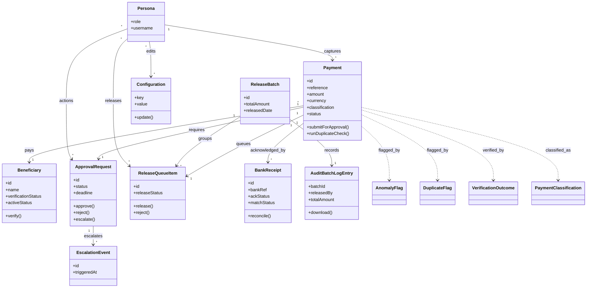

# Requirements: AugmentRisk Payments Workflow POC

**Domain:** Financial services — UK enterprise payments  **Created:** 2026-05-04  **Status:** draft  **Last finalised at:** —

> Inferred content is marked inline with one of three markers per the drafter's decision tree (`framework/agents/requirements-drafter.md > Classification`):
> - `[AI-SUGGESTED: AI-NNN | blocking|non-blocking]` — inferred completeness-gating, in-scope value; resolver asks the consultant.
> - `[STANDARD-RULE: GR-NN]` — deterministic answer from `framework/shared/general-rules.md`; resolver skips.
> - `[OUT-OF-SCOPE: domain-default]` — required by template but outside prototype scope per `framework/shared/prototype-scope.md`; resolver skips, consultant can scan-review.
>
> Field-level marking when only some sub-fields are inferred; heading-level marking when the whole item is invented.

---

## 1. Application context

**Name:** AugmentRisk Payments Workflow POC

**Purpose / business value:** Demonstrate, end-to-end, an enterprise UK-payments workflow for the AugmentRisk client, covering manual and ERP-fed payment capture, beneficiary management, duplicate detection, account verification (CoP/IBAN/Sort-Code-Account), tiered approval with auto-escalation, batch release to a simulated bank, receipt reconciliation, audit, dashboards, and a re-runnable demo.

**Domain:** Financial services — UK enterprise treasury / accounts-payable payments.

**Business goal:** Validate the proposed workflow design with the client by walking the prototype through scripted demo scenarios that exercise each control (CFO threshold, dual auth, anomaly flag, escalation, CoP failure paths), and produce a clickable prototype the client can use to converge on the production specification. [AI-SUGGESTED: AI-001 \| non-blocking]

<!-- rev: run-1 2026-05-04 -->

---

## 2. Domain model

> The BA's framing of the business domain in **ubiquitous language**, implementation-free.

### 2.1 Concepts

| Concept                  | Persistence | Definition (ubiquitous language) |
| ------------------------ | ----------- | -------------------------------- |
| Beneficiary              | persistent  | A party (entity or individual) to whom payments may be sent; holds bank-account details (Sort/Account or IBAN/SWIFT) and a verification status. |
| Payment                  | persistent  | An instruction to pay a Beneficiary a specified amount in a specified currency on a specified date, originated either by a Payments Initiator or by an ERP-feed import. |
| ApprovalRequest          | persistent  | A workflow item representing the need for one or two approvers to authorise a Payment; bound to exactly one Payment. |
| ReleaseQueueItem         | persistent  | A Payment that has cleared approval and is awaiting Release Officer action. |
| ReleaseBatch             | persistent  | A grouping of ReleaseQueueItems released together to the bank in a single transmission, with a Batch Id used for export and reconciliation. |
| BankReceipt              | persistent  | A message from the (simulated) bank acknowledging a released payment with a status (Accepted, Rejected, Pending, Partial), used for reconciliation against the originating Payment. |
| Configuration            | persistent  | A named, typed setting that governs system behaviour (CFO threshold, anomaly threshold, escalation SLA, CoP toggle, dual-auth toggle). |
| AuditBatchLogEntry       | persistent  | An immutable record of a release batch, including count, total amount, releaser identity, timestamp, status, and downloadable audit file reference. |
| AnomalyFlag              | derived     | A boolean computed on a Payment when amount exceeds the configured anomaly threshold (default £1,000,000), driving warning UI and CFO-confirmation gating. |
| DuplicateFlag            | derived     | A boolean computed on a Payment by exact-match check across Beneficiary, Invoice Number, Amount, and Date. |
| VerificationOutcome      | derived     | The result of running CoP (UK) or IBAN+BIC (Foreign) checks plus Sort/Account modulus checks; one of Pending, Passed, Failed, Inconclusive. |
| EscalationEvent          | derived     | An event raised when an ApprovalRequest's Pending state has aged beyond the configured SLA (default 2 hours, 2 minutes for POC), promoting the request to the next approver tier or to the CFO. |
| PaymentClassification    | policy      | The Domestic-vs-Foreign classification of a Payment, derived from Beneficiary Country (GB → Domestic; else Foreign) or from IBAN prefix; gates the dual-auth rule. |
| Persona / Role           | policy      | The user-role identity (Super User, Payments Initiator, Approver 1, Approver 2, CFO, Configurator, Release Officer) determining what the user may see and do. |

<!-- persistent concepts must also appear in §7 -->

### 2.2 Relationships

- Payments Initiator **captures** Payment [1:*]
- ERP feed **imports** Payment [1:*]
- Payment **pays** Beneficiary [*:1]
- Payment **requires** ApprovalRequest [1:1] (per Payment)
- Approver **actions** ApprovalRequest [*:*] (one approver acts on many; Foreign requires two distinct Approvers per request)
- ApprovalRequest **escalates to** EscalationEvent [1:*]
- Approved Payment **queues into** ReleaseQueueItem [1:1]
- Release Officer **releases** ReleaseQueueItem [*:*]
- ReleaseBatch **groups** ReleaseQueueItem [1:*]
- BankReceipt **acknowledges** Payment [*:1] (one Payment may receive multiple BankReceipts — e.g. Pending then Accepted)
- BankReceipt **belongs to** ReleaseBatch [*:1] (via PaymentRef matching)
- Configurator **edits** Configuration [1:*]
- AuditBatchLogEntry **records** ReleaseBatch [1:1]
- Configuration **governs** Payment, ApprovalRequest, EscalationEvent, AnomalyFlag (read-only effects)

### 2.3 Aggregates & lifecycles

#### Payment

| Field            | Value |
| ---------------- | ----- |
| Member concepts  | Payment, ApprovalRequest, ReleaseQueueItem, AnomalyFlag, DuplicateFlag, VerificationOutcome, BankReceipt, EscalationEvent |
| Lifecycle states | Draft → Submitted → Pending Approval → Approved → Pending Release → Released → Pending Acknowledgement → Pending Receipt → Settled · with side states: Rejected (terminal), Failed (terminal at release), Partial Match (post-receipt), Unmatched (post-receipt) |
| Key invariants   | I-01 A Payment cannot be **Approved** while DuplicateFlag = true unless the Initiator has marked it non-duplicate. · I-02 A Payment whose Amount > CFO Approval Threshold (default £500,000) cannot be **Approved** without a CFO approval. · I-03 A Payment with PaymentClassification = Foreign cannot be **Approved** without two distinct Approvers having actioned it (Dual Authorisation). · I-04 A Payment cannot be **Released** unless ApprovalRequest.status = Approved AND VerificationOutcome = Passed AND DuplicateFlag check has been resolved. · I-05 A Payment whose Amount > Anomaly Threshold (default £1,000,000) requires a CFO-only approval and a confirmation modal on approve. · I-06 An ApprovalRequest in Pending state for longer than the Escalation Time Limit (default 2 h, 2 min for POC) auto-escalates per the configured ladder. |

#### Beneficiary

| Field            | Value |
| ---------------- | ----- |
| Member concepts  | Beneficiary, VerificationOutcome, DuplicateFlag (beneficiary-level) |
| Lifecycle states | New → Verification Pending → Active · side states: Failed Verification, Inactive (terminal until reactivated by re-verification), Possible Duplicate (Inactive variant) |
| Key invariants   | I-07 A Beneficiary cannot be selected on a new Payment unless ActiveStatus = true AND VerificationStatus = Passed. · I-08 A Beneficiary whose duplicate check fails is set to Inactive and gets VerificationNote = "Possible duplicate beneficiary". · I-09 Currency must match Beneficiary country (GBP→GB, EUR→EU member, USD→US). |

#### ReleaseBatch

| Field            | Value |
| ---------------- | ----- |
| Member concepts  | ReleaseBatch, ReleaseQueueItem, AuditBatchLogEntry, BankReceipt |
| Lifecycle states | Created → Released → (per-item: Acknowledged | Rejected | Pending) → Reconciled · terminal: Failed (transmission error) |
| Key invariants   | I-10 A ReleaseBatch's Total Amount equals the sum of member Payment amounts. · I-11 Each ReleaseBatch produces exactly one AuditBatchLogEntry on creation. |

### 2.4 Diagram

<!-- rev: run-1 2026-05-04 -->

---

## 3. Target users

> Target-user personas — the end users of the application being designed.

### Super User

| Field                  | Value |
| ---------------------- | ----- |
| Role / job title       | Super User (POC catch-all administrator) |
| Expertise level        | High — comfortable across every screen and configuration setting [AI-SUGGESTED: AI-002 \| non-blocking] |
| Stakes                 | Demo integrity: ability to drive any scenario from a single login; mid stakes — the Super User exists to support demos rather than represent a real production role. [AI-SUGGESTED: AI-003 \| non-blocking] |
| Frequency of use       | Daily during the POC build/demo phase. [AI-SUGGESTED: AI-004 \| non-blocking] |
| Driving forces — wants | Single-login access to every screen and action; ability to walk a demo without re-authenticating. [AI-SUGGESTED: AI-005 \| non-blocking] |
| Driving forces — fears | Being unable to exercise a control mid-demo because of a missing permission. [AI-SUGGESTED: AI-006 \| non-blocking] |

### Payments Initiator

| Field                  | Value |
| ---------------------- | ----- |
| Role / job title       | Accounts-payable / treasury operations clerk |
| Expertise level        | Mid — familiar with payment forms, beneficiaries, ERP exports; not deeply familiar with bank protocols. [AI-SUGGESTED: AI-007 \| non-blocking] |
| Stakes                 | High — a mistyped account number or sort code routes funds to the wrong recipient. [AI-SUGGESTED: AI-008 \| blocking] |
| Frequency of use       | Multiple times a day; primary screen for this user. [AI-SUGGESTED: AI-009 \| non-blocking] |
| Driving forces — wants | Fast, low-friction capture; clear validation feedback before submit; clear status of what they have submitted. [AI-SUGGESTED: AI-010 \| non-blocking] |
| Driving forces — fears | Submitting a duplicate; entering wrong beneficiary details that pass validation but route incorrectly. [AI-SUGGESTED: AI-011 \| non-blocking] |

### Approver 1

| Field                  | Value |
| ---------------------- | ----- |
| Role / job title       | Treasury / finance approver — first line |
| Expertise level        | Mid-high — understands the duplicate, verification, and out-of-range signals on a payment. [AI-SUGGESTED: AI-012 \| non-blocking] |
| Stakes                 | High — wrongful approval results in funds leaving the business; controls compliance posture. [AI-SUGGESTED: AI-013 \| blocking] |
| Frequency of use       | Several times a day in batches. [AI-SUGGESTED: AI-014 \| non-blocking] |
| Driving forces — wants | At-a-glance visibility of out-of-range and duplicate flags; bulk approve where safe. [AI-SUGGESTED: AI-015 \| non-blocking] |
| Driving forces — fears | Approving a payment that breaches the CFO threshold or that has a failing verification. [AI-SUGGESTED: AI-016 \| non-blocking] |

### Approver 2

| Field                  | Value |
| ---------------------- | ----- |
| Role / job title       | Treasury / finance approver — second line / escalation handler |
| Expertise level        | Mid-high — sees only payments escalated past SLA. [AI-SUGGESTED: AI-017 \| non-blocking] |
| Stakes                 | High — same as Approver 1 with the additional pressure of overdue items. [AI-SUGGESTED: AI-018 \| blocking] |
| Frequency of use       | Daily during POC, sporadic outside SLA-breach windows. [AI-SUGGESTED: AI-019 \| non-blocking] |
| Driving forces — wants | Clear view of overdue items and how they got escalated. [AI-SUGGESTED: AI-020 \| non-blocking] |
| Driving forces — fears | Missing a payment that has aged past secondary-approval SLA. [AI-SUGGESTED: AI-021 \| non-blocking] |

### CFO

| Field                  | Value |
| ---------------------- | ----- |
| Role / job title       | Chief Financial Officer (executive approver) |
| Expertise level        | High — domain expertise; uses the system selectively for high-value sign-off. [AI-SUGGESTED: AI-022 \| non-blocking] |
| Stakes                 | Very high — all payments above the CFO threshold (£500,000) and all anomalies (£1,000,000+) require their personal approval. [AI-SUGGESTED: AI-023 \| blocking] |
| Frequency of use       | Daily but in short, focused sessions. [AI-SUGGESTED: AI-024 \| non-blocking] |
| Driving forces — wants | Filtered view of high-value items only; clear at-a-glance attestation that the verification, duplicate, and out-of-range checks have run. [AI-SUGGESTED: AI-025 \| non-blocking] |
| Driving forces — fears | Approving a £1M+ payment without seeing the anomaly indicator; missing a foreign payment that needs dual auth. [AI-SUGGESTED: AI-026 \| non-blocking] |

### Configurator

| Field                  | Value |
| ---------------------- | ----- |
| Role / job title       | System configurator — finance-controls steward |
| Expertise level        | High — owns thresholds and toggles. [AI-SUGGESTED: AI-027 \| non-blocking] |
| Stakes                 | High — wrong threshold values misclassify CFO routing or anomaly flagging system-wide. [AI-SUGGESTED: AI-028 \| blocking] |
| Frequency of use       | Rarely — set-and-forget; revisit when policy changes. [AI-SUGGESTED: AI-029 \| non-blocking] |
| Driving forces — wants | Clear units (currency vs minutes), validated input ranges, audit of who changed what. [AI-SUGGESTED: AI-030 \| non-blocking] |
| Driving forces — fears | Accidentally setting an SLA in the wrong unit (hours vs minutes) or dropping a threshold by an order of magnitude. [AI-SUGGESTED: AI-031 \| non-blocking] |

### Release Officer

| Field                  | Value |
| ---------------------- | ----- |
| Role / job title       | Treasury operations — bank-release executor |
| Expertise level        | Mid — knows the bank-rail differences (Faster, BACS, CHAPS, SWIFT) at a working level. [AI-SUGGESTED: AI-032 \| non-blocking] |
| Stakes                 | High — once released, a payment cannot be undone. [AI-SUGGESTED: AI-033 \| blocking] |
| Frequency of use       | Several times a day in release windows. [AI-SUGGESTED: AI-034 \| non-blocking] |
| Driving forces — wants | Confidence in the batch contents before transmission; single confirmation step; quick batch export for audit. [AI-SUGGESTED: AI-035 \| non-blocking] |
| Driving forces — fears | Releasing the wrong payment; missing a partial-match receipt during reconciliation. [AI-SUGGESTED: AI-036 \| non-blocking] |

<!-- rev: run-1 2026-05-04 -->

---

## 4. User goals & stories

> Quality signals live on the goal (outcome-level), not the story (behaviour-level).

### 4.1 Goals catalogue

| ID | Goal statement | Quality signals | Goal kind | Layout pref (optional) | UX-pattern pref (optional) |
| --- | --- | --- | --- | --- | --- |
| G-01 | Capture a manual ad-hoc payment and submit it for approval. | Time-to-submit; zero data-entry errors at submit; clear in-line validation feedback. [AI-SUGGESTED: AI-037 \| non-blocking] | top-level | full-page form | guided form with sectioned fields |
| G-02 | Import / capture an ERP-fed payment and route it through workflow. | Visibility of inbound queue; one-click submit-to-workflow per row. [AI-SUGGESTED: AI-038 \| non-blocking] | top-level | data grid | inline row actions |
| G-03 | Add and verify a beneficiary. | Verification result visible before activation; duplicate prevention. [AI-SUGGESTED: AI-039 \| non-blocking] | top-level | modal or full-page | search-then-confirm |
| G-04 | Review and approve / reject pending payments respecting CFO threshold and dual-auth rules. | Bulk action efficiency; visibility of out-of-range / duplicate / verification flags; SLA awareness. [AI-SUGGESTED: AI-040 \| non-blocking] | top-level | data grid with detail drawer | filter-and-bulk-act |
| G-05 | Release approved payments to the bank as a batch. | Pre-release confirmation; post-release attestation showing batch contents. [AI-SUGGESTED: AI-041 \| non-blocking] | top-level | data grid | confirm-modal |
| G-06 | Reconcile bank receipts against released payments. | Match status visibility (Settled / Partial / Unmatched); one-screen view. [AI-SUGGESTED: AI-042 \| non-blocking] | top-level | data grid | colour-coded list |
| G-07 | Configure system thresholds and feature toggles. | Single-screen authoritative source; clear units; change auditability. [AI-SUGGESTED: AI-043 \| non-blocking] | top-level | settings form | sectioned settings page |
| G-08 | Audit which batches were released, by whom, and download the audit file. | Filterable history; CSV/PDF download. [AI-SUGGESTED: AI-044 \| non-blocking] | top-level | data grid | filter-then-download |
| G-09 | Monitor the operational state at a glance via a dashboard. | At-a-glance KPIs; period filter affects all widgets; click-through to detail screens. [AI-SUGGESTED: AI-045 \| non-blocking] | top-level | dashboard | card-and-graph |
| G-10 | Reset the demo to a known starting state. | One-click reset; predictable post-reset data set. [AI-SUGGESTED: AI-046 \| non-blocking] | top-level | admin action | single confirmation |
| G-11 | Re-action escalated approvals before they age past secondary SLA. | Clear "overdue" filter and visual indicator. [AI-SUGGESTED: AI-047 \| non-blocking] | sub-level | embedded in My Approvals | filter-driven |
| G-12 | Approve a high-value (>£1,000,000) payment with explicit confirmation. | Confirmation modal that names the amount and beneficiary. [AI-SUGGESTED: AI-048 \| blocking] | interaction-level | modal over approvals grid | confirm-modal |

### 4.2 Stories by persona

#### Super User <!-- → §3 -->

##### Story: As a Super User, I want to access every screen with a single login, so that I can demonstrate the workflow end-to-end without switching accounts.

| Field                                    | Value |
| ---------------------------------------- | ----- |
| Goal                                     | → §4.1 G-09 |
| Objective                                | Surface a navigation menu where every screen is reachable in one click. [AI-SUGGESTED: AI-049 \| non-blocking] |
| Context (frequency / expertise / stakes) | Daily during POC demo; high expertise; mid stakes. |
| Linked task flow (optional)              | → §5 Flow: Demo walk-through |

#### Payments Initiator <!-- → §3 -->

##### Story: As a Payments Initiator, I want to capture an ad-hoc payment with inline validation, so that I do not submit malformed account details to the workflow.

| Field                                    | Value |
| ---------------------------------------- | ----- |
| Goal                                     | → §4.1 G-01 |
| Objective                                | Inline (on-blur) validation feedback for sort code, IBAN, and amount; submit blocked until required fields pass. |
| Context (frequency / expertise / stakes) | Multiple times a day; mid expertise; high stakes. |
| Linked task flow (optional)              | → §5 Flow: Manual payment capture |

##### Story: As a Payments Initiator, I want to add a new beneficiary with verification before use, so that the first payment to that beneficiary cannot be sent to an unverified account.

| Field                                    | Value |
| ---------------------------------------- | ----- |
| Goal                                     | → §4.1 G-03 |
| Objective                                | Beneficiary cannot be selected on a Payment until its verification status reaches Passed. |
| Context (frequency / expertise / stakes) | Daily; mid expertise; high stakes. |
| Linked task flow (optional)              | → §5 Flow: Add beneficiary |

##### Story: As a Payments Initiator, I want to add a new ERP payment to the inbound queue and submit it to workflow, so that the simulated ERP feed is exercised in the demo.

| Field                                    | Value |
| ---------------------------------------- | ----- |
| Goal                                     | → §4.1 G-02 |
| Objective                                | The ERP queue grid supports per-row Submit-to-Workflow and an Add-ERP-Payment action. |
| Context (frequency / expertise / stakes) | Several times a day; mid expertise; mid stakes. |
| Linked task flow (optional)              | → §5 Flow: ERP inbound submission |

#### Approver 1 <!-- → §3 -->

##### Story: As an Approver 1, I want to filter pending approvals by foreign payments and overdue items, so that I focus on items that need dual auth or are about to breach SLA.

| Field                                    | Value |
| ---------------------------------------- | ----- |
| Goal                                     | → §4.1 G-04 |
| Objective                                | Filter chips on the My Approvals grid include: All, CFO – High Value, Foreign, Overdue, Pending Approval (default). |
| Context (frequency / expertise / stakes) | Several times a day; mid-high expertise; high stakes. |
| Linked task flow (optional)              | → §5 Flow: Approve payment |

##### Story: As an Approver 1, I want to bulk-approve low-risk payments and reject one with a comment, so that I clear the queue efficiently while documenting rejections.

| Field                                    | Value |
| ---------------------------------------- | ----- |
| Goal                                     | → §4.1 G-04 |
| Objective                                | Multi-select with a primary Approve action; reject-modal requires a comment before submit. |
| Context (frequency / expertise / stakes) | Daily; mid-high expertise; high stakes. |
| Linked task flow (optional)              | → §5 Flow: Approve payment |

#### Approver 2 <!-- → §3 -->

##### Story: As an Approver 2, I want to see only items escalated to me with a clear "overdue" indicator, so that I action escalated payments before secondary SLA breach.

| Field                                    | Value |
| ---------------------------------------- | ----- |
| Goal                                     | → §4.1 G-11 |
| Objective                                | A persona-aware default filter shows only escalated items; row colour-codes per status (red overdue / orange within-SLA / green approved / grey rejected). |
| Context (frequency / expertise / stakes) | Sporadic; mid-high expertise; high stakes. |
| Linked task flow (optional)              | → §5 Flow: Approve payment (escalated) |

#### CFO <!-- → §3 -->

##### Story: As the CFO, I want a toggle to view only payments above £500,000, so that I focus on the items that require my personal approval.

| Field                                    | Value |
| ---------------------------------------- | ----- |
| Goal                                     | → §4.1 G-04 |
| Objective                                | A "CFO – High Value (>500k)" filter is available only to the CFO persona. |
| Context (frequency / expertise / stakes) | Daily, short focused sessions; high expertise; very high stakes. |
| Linked task flow (optional)              | → §5 Flow: Approve payment |

##### Story: As the CFO, I want a confirmation modal naming the payment when I approve any payment over £1,000,000, so that I do not approve an anomaly by accident.

| Field                                    | Value |
| ---------------------------------------- | ----- |
| Goal                                     | → §4.1 G-12 |
| Objective                                | Approval of a payment whose Amount > Anomaly Threshold opens a modal with payment ref, beneficiary, and amount. |
| Context (frequency / expertise / stakes) | Occasional; high expertise; very high stakes. |
| Linked task flow (optional)              | → §5 Flow: Approve payment (high-value) |

#### Configurator <!-- → §3 -->

##### Story: As a Configurator, I want to update CFO threshold, anomaly threshold, escalation SLA, CoP toggle, and dual-auth toggle from a single screen, so that I keep the system aligned with finance policy.

| Field                                    | Value |
| ---------------------------------------- | ----- |
| Goal                                     | → §4.1 G-07 |
| Objective                                | A Configuration screen exposes the five settings, with per-field input validation and unit labels. |
| Context (frequency / expertise / stakes) | Rare; high expertise; high stakes. |
| Linked task flow (optional)              | → §5 Flow: Configure thresholds |

#### Release Officer <!-- → §3 -->

##### Story: As a Release Officer, I want a Release-All action that batches all pending items and shows me a confirmation before transmission, so that I can transmit a batch confidently.

| Field                                    | Value |
| ---------------------------------------- | ----- |
| Goal                                     | → §4.1 G-05 |
| Objective                                | A Release-All button on the Release Queue triggers a confirmation modal that names the count and total amount, then submits the batch. |
| Context (frequency / expertise / stakes) | Several times a day; mid expertise; high stakes. |
| Linked task flow (optional)              | → §5 Flow: Release payment batch |

##### Story: As a Release Officer, I want to export a release batch as CSV after release, so that I have an offline audit copy of what was sent.

| Field                                    | Value |
| ---------------------------------------- | ----- |
| Goal                                     | → §4.1 G-08 |
| Objective                                | Each released batch exposes a download / export action that produces a CSV with all payment details. |
| Context (frequency / expertise / stakes) | Daily; mid expertise; high stakes. |
| Linked task flow (optional)              | → §5 Flow: Audit batch download |

##### Story: As a Release Officer, I want to reset the demo data to a known starting point, so that I can re-run the same scenarios for different audiences.

| Field                                    | Value |
| ---------------------------------------- | ----- |
| Goal                                     | → §4.1 G-10 |
| Objective                                | A one-click Reset Demo action available on a controlled screen; produces a confirmation modal before executing. |
| Context (frequency / expertise / stakes) | Daily during POC demo; mid expertise; mid stakes. |
| Linked task flow (optional)              | → §5 Flow: Reset demo |

---

## 5. Task flows

### Flow: Manual payment capture

| Field                      | Value |
| -------------------------- | ----- |
| Actor                      | Payments Initiator |
| Trigger                    | Initiator opens Payments → Manual capture (Adhoc) and clicks Add. |
| Steps                      | 1) Enter Payment Reference, Invoice Number, Date, Amount, Currency. 2) Toggle Domestic / Foreign. 3) Select existing Beneficiary or capture beneficiary fields inline. 4) Select Payment Method (Faster Payments / BACS / CHAPS / SWIFT). 5) Add Reason Code, Remittance Advice. 6) Submit for Approval. 7) System runs duplicate check + account verification on submit. 8) On success, Payment status moves to Submitted → Pending Approval. |
| Decision points            | DP-1 If amount > Anomaly Threshold → display out-of-range warning banner (BR-02). DP-2 If Foreign → display dual-auth banner (BR-03). DP-3 If duplicate detected → require Initiator confirmation of non-duplicate or send to Exceptions queue (BR-11). |
| Exception paths            | EX-1 Verification fails → block submit; show inline reason. EX-2 Duplicate confirmed by user as legitimate → proceed; flag retained on payment for approver visibility. |
| Role-conditional behaviour | Only Payments Initiator and Super User may capture payments. Approvers and Release Officers can view only. |

### Flow: ERP inbound submission

| Field                      | Value |
| -------------------------- | ----- |
| Actor                      | Payments Initiator |
| Trigger                    | Initiator opens Payments → ERP Inbound Queue. |
| Steps                      | 1) Initiator clicks "Add new ERP payment" (simulated feed). 2) New row appears in grid with status Received. 3) Initiator clicks Submit-to-Workflow on a row. 4) System runs duplicate + verification, sets status Validated → Submitted → Processed as it advances. |
| Decision points            | DP-1 ERP Ref must be unique; duplicates rejected. DP-2 Beneficiary Name must match an active Beneficiary. |
| Exception paths            | EX-1 ERP Ref already used → row remains in Error status with reason. EX-2 Beneficiary not found / inactive → row remains in Error. |
| Role-conditional behaviour | Same as Manual payment capture — Initiator + Super User only. |

### Flow: Add beneficiary

| Field                      | Value |
| -------------------------- | ----- |
| Actor                      | Payments Initiator |
| Trigger                    | Initiator opens Beneficiaries → Add Beneficiaries. |
| Steps                      | 1) Enter Beneficiary Name, account details (Sort/Account or IBAN/SWIFT), Currency, Country. 2) Save. 3) System runs duplicate check on account details (Account number, IBAN, BIC/SWIFT). 4) System runs account verification (CoP for UK, IBAN for foreign). 5) Verification status = Pending until check completes; Passed activates the beneficiary. |
| Decision points            | DP-1 Country = GB or IBAN prefix GB → Domestic; else Foreign + dual-auth flag. DP-2 Currency must match country (BR-17). |
| Exception paths            | EX-1 Duplicate detected → mark beneficiary Inactive, set verification note "Possible duplicate beneficiary" (BR-18). EX-2 CoP / IBAN check fails → status Failed; not selectable on payments. |
| Role-conditional behaviour | Payments Initiator and Super User may create beneficiaries. Other roles read-only. |

### Flow: Approve payment

| Field                      | Value |
| -------------------------- | ----- |
| Actor                      | Approver 1 |
| Trigger                    | Approver opens My Approvals; default filter Pending Approval. |
| Steps                      | 1) Approver reviews row flags (Verification, Duplicate, Out-of-Range). 2) Approver opens detail drawer for any flagged row. 3) Approver multi-selects rows for bulk approve, or rejects with comment. 4) On approve → payment status moves to Approved; on reject → comment required, payment returns to Initiator (or to ERP queue if ERP-fed). |
| Decision points            | DP-1 Amount > CFO Threshold (£500k) → only CFO may approve (BR-01). DP-2 Amount > Anomaly Threshold (£1M) → CFO confirmation modal on approve (BR-02). DP-3 PaymentClassification = Foreign → require two distinct approvers (BR-03). DP-4 Approval pending > Escalation SLA → auto-escalate (BR-04). |
| Exception paths            | EX-1 Approver attempts to approve a > £500k payment without CFO role → action disabled / hidden per role. EX-2 Single approver action on a Foreign payment → payment remains Pending Approval awaiting second approver. |
| Role-conditional behaviour | Approver 1, Approver 2, CFO, Super User may approve subject to threshold rules. Configurator, Initiator, Release Officer view-only. |

### Flow: Approve payment (escalated)

| Field                      | Value |
| -------------------------- | ----- |
| Actor                      | Approver 2 |
| Trigger                    | An ApprovalRequest auto-escalates to Approver 2 / CFO when it has been Pending longer than the configured SLA. |
| Steps                      | 1) Approver 2 sees escalated rows in My Approvals with overdue indicator. 2) Same approve / reject action as Approve payment flow. |
| Decision points            | DP-1 If still pending > secondary SLA → escalate to CFO. (POC: 2 minute SLA; production default 2 hours.) |
| Exception paths            | EX-1 None beyond Approve payment flow. |
| Role-conditional behaviour | Approver 2 + CFO + Super User; others view-only. |

### Flow: Approve payment (high-value)

| Field                      | Value |
| -------------------------- | ----- |
| Actor                      | CFO |
| Trigger                    | A payment with Amount > Anomaly Threshold reaches the CFO's queue. |
| Steps                      | 1) CFO opens My Approvals with high-value filter. 2) CFO clicks Approve on a > £1M payment. 3) System opens confirmation modal naming Payment Ref, Beneficiary, Amount. 4) CFO clicks Confirm Approval. |
| Decision points            | DP-1 Anomaly threshold breach gates the modal (BR-02). |
| Exception paths            | EX-1 CFO clicks Cancel → payment remains Pending Approval. |
| Role-conditional behaviour | CFO + Super User only. |

### Flow: Release payment batch

| Field                      | Value |
| -------------------------- | ----- |
| Actor                      | Release Officer |
| Trigger                    | Release Officer opens Payment Release Queue; default filter Pending release. |
| Steps                      | 1) Officer multi-selects rows (or all). 2) Clicks Release / Release All. 3) Confirmation modal names Payment Ref + Beneficiary + Amount; officer clicks Confirm Release. 4) System creates a ReleaseBatch + AuditBatchLogEntry; release status updates to Released. 5) Post-release modal shows count + total + Batch Id. |
| Decision points            | DP-1 If approval status not Approved or verification not Passed → row hidden / not releasable (BR-04 release invariant). |
| Exception paths            | EX-1 Officer rejects from queue → returns the payment to approver. EX-2 Bank API simulation returns Failed → release status Failed; AuditBatchLogEntry status Failed. |
| Role-conditional behaviour | Release Officer + Super User only. |

### Flow: Reconcile bank receipts

| Field                      | Value |
| -------------------------- | ----- |
| Actor                      | Release Officer |
| Trigger                    | A bank receipt arrives (simulated import). |
| Steps                      | 1) System matches receipt to Payment by PaymentRef (primary). 2) On no primary match: secondary match on Beneficiary name + Amount + Value Date. 3) Multiple candidates → Match Status = Partial. 4) Single match → Match Status = Matched + Status from bank ACK applied. 5) No match → Match Status = Unmatched. 6) Officer opens Bank Receipts grid to review by colour-coded status. |
| Decision points            | DP-1 Match priority: PaymentRef first, secondary criteria second (BR-13/14/15). |
| Exception paths            | EX-1 Receipt rejected by bank (Account Closed / Insufficient funds) → status Rejected; payment status Pending Receipt persists for reattempt visibility. |
| Role-conditional behaviour | Release Officer, CFO, Super User; others view-only. |

### Flow: Configure thresholds

| Field                      | Value |
| -------------------------- | ----- |
| Actor                      | Configurator |
| Trigger                    | Configurator opens Configuration screen. |
| Steps                      | 1) Configurator edits CFO Approval Threshold, Anomaly Detection Threshold, Escalation Time Limit, CoP Toggle, Dual-Auth Toggle. 2) Saves. 3) System validates units and persists. |
| Decision points            | DP-1 Numeric inputs validated against min/max bands. [AI-SUGGESTED: AI-050 \| non-blocking] |
| Exception paths            | EX-1 Save fails validation → inline error, no persistence. |
| Role-conditional behaviour | Configurator + Super User may edit. All other roles see read-only values. |

### Flow: Audit batch download

| Field                      | Value |
| -------------------------- | ----- |
| Actor                      | Release Officer |
| Trigger                    | Release Officer opens Audit Logs. |
| Steps                      | 1) Officer filters by Release date / Released by / Status. 2) Selects a batch row. 3) Clicks Download Audit File. 4) CSV / PDF export of all payments within batch. |
| Decision points            | DP-1 Optional filter selection. |
| Exception paths            | EX-1 Empty result set → no-results state per GR-09. |
| Role-conditional behaviour | Any persona with audit-read may download; default include Release Officer + CFO + Configurator + Super User. [AI-SUGGESTED: AI-051 \| blocking] |

### Flow: Demo walk-through

| Field                      | Value |
| -------------------------- | ----- |
| Actor                      | Super User |
| Trigger                    | Demo presentation begins. |
| Steps                      | 1) Super User logs in. 2) Walks each screen in menu order: Home → Payments capture → ERP queue → Beneficiaries → My Approvals → Release Queue → Bank Receipts → Audit → Configuration. |
| Decision points            | None. |
| Exception paths            | None. |
| Role-conditional behaviour | Super User has full access. |

### Flow: Reset demo

| Field                      | Value |
| -------------------------- | ----- |
| Actor                      | Super User |
| Trigger                    | Operator clicks Reset Demo on the admin entry point. |
| Steps                      | 1) Operator clicks Reset Demo. 2) Confirmation modal: "This will drop the current data and restore the seed data set. Proceed?". 3) On confirm → API call (simulated) reseeds DB; UI shows toast on completion. |
| Decision points            | DP-1 Confirmation gate per GR-04. |
| Exception paths            | EX-1 Reset failure → banner with reason. |
| Role-conditional behaviour | Super User only (and any persona with reset permission — POC limited to Super User). [AI-SUGGESTED: AI-052 \| blocking] |

---

## 6. Requirements

### 6.1 Functional

- F-01 Capture a manual ad-hoc payment with all fields per the Manual Payment Capture screen, run duplicate + verification on submit, route to Pending Approval.
- F-02 Display an ERP Inbound Queue grid with row-level Submit-to-Workflow and an Add-ERP-Payment action.
- F-03 Provide an Add Beneficiary screen that runs duplicate + verification on save and gates activation on verification Passed.
- F-04 Display a My Approvals screen with multi-select bulk approve, reject-with-comment, persona-aware filters, and SLA / out-of-range / duplicate / verification flags.
- F-05 Auto-escalate a Pending ApprovalRequest when its age exceeds the configured Escalation SLA.
- F-06 Enforce CFO-only approval on payments above the CFO Threshold and a CFO confirmation modal on payments above the Anomaly Threshold.
- F-07 Enforce dual authorisation by two distinct approvers on Foreign payments before they enter the Release Queue.
- F-08 Display a Payment Release Queue with multi-select Release / Release-All, reject, export-CSV, and a confirmation modal that names payment ref, beneficiary, amount.
- F-09 Provide a Bank Receipts screen that combines receipts and bank ACKs, runs reconciliation logic, and colour-codes per match status.
- F-10 Provide an Audit Logs screen listing released batches with download.
- F-11 Provide a Configuration screen exposing CFO Threshold, Anomaly Threshold, Escalation SLA, CoP toggle, Dual-auth toggle.
- F-12 Provide a Home dashboard with the seven KPI widgets (M1–M7) and a global period filter (Today / Past 7 days / Past month / Past year).
- F-13 Support seven user-role logins (Super User, Payments Initiator, Approver 1, Approver 2, CFO, Configurator, Release Officer) with the documented credentials.
- F-14 Provide a Reset Demo action that returns the application data to a known starting state.
- F-15 Each payment exposes a Payment Detail view with all attributes, the approval / release / reconciliation history, and the current lifecycle status.

### 6.2 Business rules

| ID | Statement (when / then) | Enforcement point | Source | Severity |
| --- | --- | --- | --- | --- |
| BR-01 | When Payment.Amount > CFO Threshold (default £500,000), then Payment must be approved by the CFO and not by Approver 1 / Approver 2. | UI + service | → §2.3 invariant I-02 | blocker |
| BR-02 | When Payment.Amount > Anomaly Threshold (default £1,000,000), then Payment is flagged out-of-range; on approval a confirmation modal naming Ref + Beneficiary + Amount must be shown to the CFO. | UI + service | → §2.3 invariant I-05 | blocker |
| BR-03 | When PaymentClassification = Foreign, then two distinct approvers must action the ApprovalRequest before it advances to Release. | UI + service | → §2.3 invariant I-03 | blocker |
| BR-04 | When ApprovalRequest.Status = Pending and Created + Escalation SLA has elapsed, then auto-escalate to the next approver tier (Approver 2 → CFO). | service | → §2.3 invariant I-06 | blocker |
| BR-05 | When Beneficiary.Name contains 'Test' (case-insensitive), then CoP verification must Fail. | service | source-manifest §Account Verification | major |
| BR-06 | When IBAN starts with 'ZZ', then IBAN verification must Fail. | service | source-manifest §Account Verification | major |
| BR-07 | When IBAN length < 22, then IBAN verification must Fail. | service | source-manifest §Account Verification | major |
| BR-08 | When 6-digit Sort Code ends with '00', then verification must Fail. | service | source-manifest §Account Verification | major |
| BR-09 | When 8-digit Account Number ends with an odd digit, then verification must Fail. | service | source-manifest §Account Verification | major |
| BR-10 | When 8-digit Account Number ends with an even digit, then verification must Pass (subject to other checks). | service | source-manifest §Account Verification | major |
| BR-11 | When Payment Duplicate Check returns IsDuplicate = true, then the Initiator must confirm non-duplicate (or send to Exceptions) before submit; the duplicate flag remains visible to approvers. | UI | source-manifest §Manual Capture | blocker |
| BR-12 | When Beneficiary Country = GB OR IBAN prefix = "GB", then PaymentClassification = Domestic; else Foreign. | UI + service | source-manifest §Add Beneficiary | blocker |
| BR-13 | When BankReceipt's PaymentRef matches exactly one released Payment, then Match Status = Matched and Payment status = Settled (subject to ACK Status). | service | source-manifest §Bank Receipts | major |
| BR-14 | When BankReceipt has multiple candidate Payments by secondary match (Beneficiary + Amount + Value Date), then Match Status = Partial. | service | source-manifest §Bank Receipts | major |
| BR-15 | When BankReceipt has no candidate Payment, then Match Status = Unmatched. | service | source-manifest §Bank Receipts | major |
| BR-16 | When Beneficiary Country != GB, then mark Beneficiary as needing dual authorisation (visual indicator on selection). | UI | source-manifest §Add Beneficiary | major |
| BR-17 | When Beneficiary.Currency does not match Beneficiary.Country canonical currency (GBP↔GB, EUR↔EU, USD↔US), then save is blocked with inline validation error. | UI | source-manifest §Add Beneficiary | major |
| BR-18 | When Beneficiary duplicate-check returns true, then mark Beneficiary Inactive and set VerificationNote = "Possible duplicate beneficiary". | service | source-manifest §Add Beneficiary | major |
| BR-19 | When Approver acts on a Foreign Payment as the **same** user twice, then the second action is rejected (must be a distinct second approver per BR-03). | service | → §2.3 invariant I-03 | blocker |
| BR-20 | When the Reject action is invoked on an ApprovalRequest, then a Comment is required before submit. | UI | source-manifest §My Approvals | major |
| BR-21 | When a payment is in a Released or terminal state (Settled, Failed), then mutating actions are hidden and a state banner is shown on the detail screen. | UI | [STANDARD-RULE: GR-03] | major |
| BR-22 | When the Reject action on the Release Queue is invoked on a payment, then return the payment to the originating approver tier. | service | source-manifest §Release Queue | major |
| BR-23 | When Release / Release-All is invoked, then a confirmation modal naming Ref + Beneficiary + Amount must be shown before transmission. | UI | [STANDARD-RULE: GR-04] | blocker |
| BR-24 | When the user is the CFO, then the My Approvals filter set additionally exposes "CFO – High Value (>500k)". | UI | source-manifest §My Approvals | major |
| BR-25 | When the user is **not** the CFO, then payments with Amount > CFO Threshold are visible read-only and the Approve action is hidden / disabled. | UI | [STANDARD-RULE: GR-02] (and BR-01) | blocker |

### 6.3 Data

- D-01 Payment fields per §7 Payment entity must be persisted on capture and updated through lifecycle.
- D-02 Beneficiary fields per §7 Beneficiary entity must be persisted on creation and updated on verification.
- D-03 ApprovalRequest, ReleaseQueueItem, ReleaseBatch, BankReceipt, AuditBatchLogEntry, Configuration each persist per §7.
- D-04 Each Payment exposes a status timeline derived from ApprovalRequest, ReleaseQueueItem, BankReceipt history.
- D-05 Configuration values are typed (Numeric, Boolean) and addressed by Key.
- D-06 The audit history retention window: prototype scope. [OUT-OF-SCOPE: domain-default]
- D-07 Backup / restore mechanics for the demo-reset feature: prototype scope. [OUT-OF-SCOPE: domain-default]

### 6.4 User-facing

- UF-01 Required-field marking per [STANDARD-RULE: GR-06] (asterisk + legend; switch to "(optional)" if ≥ 80 % required).
- UF-02 Validation timing per [STANDARD-RULE: GR-05] (on-blur for sync; on-submit for async/cross-field; never on-keystroke).
- UF-03 Forms autofocus first editable field per [STANDARD-RULE: GR-07], except after a confirmation modal.
- UF-04 Status colour mapping per [STANDARD-RULE: GR-16] (success/active green; error/failed red; warning/pending amber; info blue; archived/neutral grey; pair colour with icon or text label).
    - Specific overrides retained from inputs: Approved → green; Pending within SLA → orange; Pending outside SLA / Overdue → red; Rejected → grey; Settled (receipt) → green; Partial Match → orange; Matched but rejected → blue; Unmatched → red.
- UF-05 Tables — sortable columns per [STANDARD-RULE: GR-12]; pagination + rows-per-page per [STANDARD-RULE: GR-11] (5 / 10 / 20 / 50, default 20).
- UF-06 Empty-state copy per [STANDARD-RULE: GR-08]; no-results vs zero-data distinction per [STANDARD-RULE: GR-09].
- UF-07 Loading indicator thresholds per [STANDARD-RULE: GR-10] (no spinner < 300 ms; skeleton 300 ms – 3 s; "still loading…" > 3 s).
- UF-08 Toast vs banner placement per [STANDARD-RULE: GR-14] (toasts top-right 4–8 s for transient confirmations; banners persistent for state).
- UF-09 Notification badge cap per [STANDARD-RULE: GR-15] (1–99, "99+" beyond, hide at 0).
- UF-10 Icon-only control labelling per [STANDARD-RULE: GR-17] (tooltip + aria-label; never icon-only for primary destructive).
- UF-11 Confirmation modals per [STANDARD-RULE: GR-04] for Approve, Reject, Release, Reset Demo, and any > Anomaly-Threshold payment approval; default focus on Cancel.
- UF-12 Form length escalation per [STANDARD-RULE: GR-13] — Manual Payment Capture form has 17 fields (9–20 band), so use single-form with section headers (Reference, Amount, Beneficiary, Payment Method, Reference Data).
- UF-13 Mobile breakpoint table-to-card collapse per [STANDARD-RULE: GR-18] (below 768 px). Note: dashboard and approval queues are desktop-primary; mobile is best-effort. [AI-SUGGESTED: AI-053 \| non-blocking]
- UF-14 Out-of-range warning banner on the Manual Capture form when Amount > Anomaly Threshold (BR-02).
- UF-15 Dual-auth banner on the Manual Capture form when PaymentClassification = Foreign (BR-03).
- UF-16 Pre-release confirmation modal must include a single visible payment (Release) or aggregate count + total (Release All) per inputs.
- UF-17 Post-release attestation modal showing Number of payments released, Total amount, Batch Id.
- UF-18 Dashboard period selector: Today / Past 7 days / Past month / Past year, applied globally across all KPI widgets.
- UF-19 KPI widget click-throughs per inputs: M1 → Release Queue; M2 → My Approvals; M3 → Bank Receipts; M5 → My Approvals (filter Anomalies); M6 → My Approvals (filter Overdue); M7 → My Approvals.
- UF-20 Account-verification statuses on Beneficiary: Pending (chip amber), Failed (red), Passed (green) per UF-04.
- UF-21 Bank Receipts colour mapping per inputs (Settled green, Partial orange, Matched-rejected blue, Unmatched red); pair colour with status text.
- UF-22 Search and filter controls on every grid (My Approvals, Release Queue, Bank Receipts, Audit Logs, Beneficiaries, ERP Queue) with active-filter chips and Clear-all per UF-06.

### 6.5 Access control (RBAC)

> Roles-×-resources matrix. Cell values use the action vocabulary below; blanks mean "no access".

**Action vocabulary:** `C` create · `R` read · `U` update · `D` delete · `X` execute / invoke · `A` approve · `—` no access. Suffix with a BR ref for conditional access (e.g. `U†BR-07` = update gated by BR-07).

| Role (→ §3) | Beneficiary | Payment | ApprovalRequest | ReleaseQueueItem | ReleaseBatch | BankReceipt | Configuration | AuditBatchLogEntry | Flow: Manual capture | Flow: ERP submission | Flow: Add beneficiary | Flow: Approve payment | Flow: Approve (escalated) | Flow: Approve (high-value) | Flow: Release batch | Flow: Reconcile receipts | Flow: Configure thresholds | Flow: Audit batch download | Flow: Demo walk-through | Flow: Reset demo |
| --- | --- | --- | --- | --- | --- | --- | --- | --- | --- | --- | --- | --- | --- | --- | --- | --- | --- | --- | --- | --- |
| Super User | C R U D | C R U D | R A | R X | R X | R | R U | R | X | X | X | X | X | X | X | X | X | X | X | X |
| Payments Initiator | C R U | C R U | R | R | — | — | R | — | X | X | X | — | — | — | — | — | — | — | — | — |
| Approver 1 | R | R | R A†BR-01,BR-03 | R | — | — | R | — | — | — | — | X | — | — | — | — | — | — | — | — |
| Approver 2 | R | R | R A†BR-04 | R | — | — | R | — | — | — | — | — | X | — | — | — | — | — | — | — |
| CFO | R | R | R A | R | — | R | R | R | — | — | — | X | X | X | — | R | — | X†BR-25 | — | — |
| Configurator | R | R | — | — | — | — | R U | R | — | — | — | — | — | — | — | — | X | X†BR-25 | — | — |
| Release Officer | R | R | — | R X | R X | R U†BR-13 | R | R | — | — | — | — | — | — | X | X | — | X | — | X [AI-SUGGESTED: AI-054 \| blocking] |

> Cell-level inferences across the matrix not directly stated in inputs (e.g. Approver tiers' read access to Beneficiaries; Release Officer's update right on Bank Receipts to record reconciliation; CFO's broad read across operational entities) are flagged here as a single **blocking** gap-pass tuple — [AI-SUGGESTED: AI-055 \| blocking] — so the resolver can re-confirm the matrix as a whole. The deny-on-direct-link affordance for any denied cell follows [STANDARD-RULE: GR-02]; the hide-not-disable rule for the Configurator (read-only on Configuration UI for non-editors) follows [STANDARD-RULE: GR-01].

### 6.6 Non-functional

> NFRs are first-class and **must be filled even when inferred** — domain heuristics drive defaults (financial services ≠ marketing site). Inferred values carry `[AI-SUGGESTED]`.

#### 6.6.1 Security & session

| Field                    | Value                                                                             | Source            |
| ------------------------ | --------------------------------------------------------------------------------- | ----------------- |
| Idle session timeout     | 15 minutes [STANDARD-RULE: GR-19]                                                  | inferred          |
| Absolute session timeout | 8 hours [STANDARD-RULE: GR-19]                                                    | inferred          |
| Idle warning lead-time   | 60 seconds [STANDARD-RULE: GR-19]                                                  | inferred          |
| Re-auth scope            | Approve-class actions (My Approvals approve/reject; Release; Configuration save) [STANDARD-RULE: GR-19] | inferred          |
| Account lockout policy   | Prototype scope. [OUT-OF-SCOPE: domain-default]                                   | inferred          |
| MFA requirement          | Prototype scope. [OUT-OF-SCOPE: domain-default]                                   | inferred          |

#### 6.6.2 Performance

| Metric                                                 | Target    | Source            |
| ------------------------------------------------------ | --------- | ----------------- |
| p95 page TTI                                            | Prototype scope. [OUT-OF-SCOPE: domain-default] | inferred |
| API p99 latency                                         | Prototype scope. [OUT-OF-SCOPE: domain-default] | inferred |

#### 6.6.3 Availability

| Field              | Value             | Source            |
| ------------------ | ----------------- | ----------------- |
| Target uptime      | Prototype scope. [OUT-OF-SCOPE: domain-default] | inferred |
| Maintenance window | Prototype scope. [OUT-OF-SCOPE: domain-default] | inferred |
| RTO / RPO          | Prototype scope. [OUT-OF-SCOPE: domain-default] / [OUT-OF-SCOPE: domain-default] | inferred |

#### 6.6.4 Compliance & audit

- C-01 Payment-data retention and encryption at rest and in transit. [OUT-OF-SCOPE: domain-default]
- C-02 PCI-DSS scope: prototype handles no real PAN data; payment instrument fields are bank account numbers (UK Sort/Account, IBAN/SWIFT) and not card primary account numbers. [AI-SUGGESTED: AI-056 \| non-blocking]
- C-03 UK FCA-aligned segregation of duties: distinct Initiator / Approver / Release Officer roles; CFO sign-off above £500k; dual-auth on Foreign — already encoded in §6.2 BR-01 / BR-03. [AI-SUGGESTED: AI-057 \| non-blocking]
- C-04 GDPR / UK-GDPR: Beneficiary contact email and personal-name data is stored. PII redaction on screen / consent banner — visual manifestation: redact PII columns for personas without read on Beneficiary. [AI-SUGGESTED: AI-058 \| blocking]
- C-05 Audit-log retention period. [OUT-OF-SCOPE: domain-default]

#### 6.6.5 Accessibility

- A-01 WCAG 2.2 AA target across all screens (colour-pairing per UF-04, keyboard nav, focus management per GR-07, aria labelling per GR-17). [AI-SUGGESTED: AI-059 \| blocking]
- A-02 Assistive-tech scope: screen readers (NVDA, JAWS, VoiceOver), keyboard-only operation, high-contrast mode. [AI-SUGGESTED: AI-060 \| non-blocking]

---

## 7. Data entities

> Implementation-prep view: storage shape, types, validations, FK plumbing.

### Entity: Beneficiary

| Field            | Type        | Required | Validation     | Notes |
| ---------------- | ----------- | -------- | -------------- | ----- |
| Id               | integer     | yes      | system-generated | [OUT-OF-SCOPE: domain-default] (DB-only) |
| BeneficiaryName  | string(140) | yes      | non-empty; legal entity / individual name; CoP key | UI form input + table column |
| SortCode         | string(6)   | yes (Domestic) | UK NN-NN-NN or NNNNNN | UI form input |
| AccountNumber    | string(8)   | yes (Domestic) | 8 digits | UI form input |
| IBAN             | string(34)  | yes (Foreign) | IBAN checksum; first two letters = country code | UI form input |
| SwiftCode        | string(11)  | yes (Foreign) | 8 or 11 chars A–Z 0–9 | UI form input (label "BIC / SWIFT") |
| Currency         | string(3)   | yes      | ISO 4217 | UI dropdown |
| Country          | string(2)   | yes      | ISO 3166 alpha-2 | UI dropdown / inferred from IBAN prefix |
| IsActive         | boolean     | yes      | default true | UI toggle |
| AddressLine1     | string      | optional | — | UI form input |
| City             | string      | optional | — | UI form input |
| PostalCode       | string      | optional | — | UI form input |
| ContactEmail     | string(120) | optional | RFC-compliant email | UI form input |
| VerificationStatus | enum     | yes      | one of Pending / Passed / Failed | UI status chip |
| VerificationNote | string(250) | no       | — | UI detail-view label |
| LastChangedBy    | string      | yes      | system-generated | [OUT-OF-SCOPE: domain-default] (audit field; not user-edited) |
| LastChangedDate  | datetime    | yes      | system-generated | [OUT-OF-SCOPE: domain-default] |
| ValidFrom        | datetime    | yes      | system-generated | [OUT-OF-SCOPE: domain-default] (history) |
| ValidTo          | datetime    | yes      | system-generated | [OUT-OF-SCOPE: domain-default] (history) |

**Domain concept:** Beneficiary

**Relationships:** Beneficiary 1 ←→ * Payment (a payment pays exactly one beneficiary).

**Enums:** VerificationStatus { Pending, Passed, Failed }

### Entity: Payment

| Field            | Type        | Required | Validation     | Notes |
| ---------------- | ----------- | -------- | -------------- | ----- |
| Id               | integer     | yes      | system-generated | [OUT-OF-SCOPE: domain-default] |
| Reference        | string(50)  | yes      | unique (Manual capture) | UI form input + table column |
| InvoiceNumber    | string(50)  | yes      | unique within scope of beneficiary | UI form input |
| PaymentDate      | date        | yes      | DD/MM/YYYY; not in past beyond business days [AI-SUGGESTED: AI-061 \| non-blocking] | UI date picker |
| Amount           | decimal(18,2) | yes    | > 0; out-of-range warning if > Anomaly Threshold | UI numeric input |
| Currency         | string(3)   | yes      | ISO 4217; locked to GBP for Domestic | UI dropdown |
| PaymentType      | enum        | yes      | Domestic / Foreign | UI dropdown / system-derived from beneficiary country |
| BeneficiaryId    | integer     | optional | active beneficiary | UI searchable dropdown |
| BeneficiaryName  | string(120) | yes      | inline-editable when allowed | UI form input |
| SortCode         | string(6)   | yes (Domestic) | UK format | UI form input |
| AccountNumber    | string(8)   | yes (Domestic) | 8 digits | UI form input |
| IBAN             | string(34)  | yes (Foreign) | checksum | UI form input |
| SwiftCode        | string(11)  | yes (Foreign) | 8 or 11 chars | UI form input |
| PaymentMethod    | enum        | yes      | Faster Payments / BACS / CHAPS / SWIFT | UI dropdown |
| RemittanceAdvice | string(240) | optional | — | UI form input |
| CostCentre       | string(20)  | optional | — | UI dropdown |
| GLCode           | string(20)  | optional | — | UI dropdown |
| ReasonCode       | enum        | yes      | Supplier invoice / Refund / Payroll / Adhoc / … | UI dropdown |
| IsERP            | boolean     | yes      | derived (true if ERP-fed) | UI badge / filter |
| ERPRef           | string(50)  | optional | unique per ERP record | UI table column on ERP queue |
| Status           | enum        | yes      | system-managed (Submitted, Pending Approval, Approved, Pending Release, Released, Pending Acknowledgement, Pending Receipt, Settled, Rejected, Failed, Partial Match, Unmatched) | UI status chip |
| IsDuplicate      | boolean     | yes      | system-derived | UI flag indicator |
| OutOfRangeFlag   | boolean     | yes      | system-derived (Amount > Anomaly Threshold) | UI flag indicator |
| CreatedBy        | string      | yes      | system | UI table column |
| CreatedDate      | datetime    | yes      | system | UI table column / SLA ageing |
| ValidFrom        | datetime    | yes      | system | [OUT-OF-SCOPE: domain-default] |
| ValidTo          | datetime    | yes      | system | [OUT-OF-SCOPE: domain-default] |

**Domain concept:** Payment

**Relationships:** Payment * → 1 Beneficiary; Payment 1 → 1 ApprovalRequest; Payment 1 → 1 ReleaseQueueItem (post-approval); Payment 1 → * BankReceipt.

**Enums:** PaymentType { Domestic, Foreign } · PaymentMethod { Faster Payments, BACS, CHAPS, SWIFT } · ReasonCode { Supplier invoice, Refund, Payroll, Adhoc } [AI-SUGGESTED: AI-062 \| non-blocking] · Status (see above).

### Entity: ApprovalRequest

| Field            | Type        | Required | Validation     | Notes |
| ---------------- | ----------- | -------- | -------------- | ----- |
| Id               | integer     | yes      | system | [OUT-OF-SCOPE: domain-default] |
| Status           | enum        | yes      | Pending / Approved / Rejected / Escalated / Released | UI status chip |
| CreatedBy        | string      | yes      | system | UI table column |
| CreatedDate      | datetime    | yes      | system | UI table column / SLA |
| IsDuplicate      | boolean     | yes      | from Payment | UI flag |
| IsOutOfRange     | boolean     | yes      | from Payment | UI flag |
| IsEscalated      | boolean     | yes      | system | UI flag |
| Comments         | text        | optional | required on rejection | UI form input |
| Approver1        | string      | optional | — | UI display |
| Approver2        | string      | optional | required for Foreign | UI display |
| Deadline         | datetime    | yes      | CreatedDate + Escalation SLA | UI ageing chip |
| VerificationStatus | enum     | yes      | Passed / Failed / Pending / Inconclusive | UI status chip |
| VerificationNote | string      | optional | from verification service | UI tooltip |
| PaymentRef       | string(50)  | yes      | from Payment | UI table column |
| BeneficiaryName  | string(120) | yes      | from Payment | UI table column |
| Amount           | decimal     | yes      | from Payment | UI table column |
| Currency         | string(3)   | yes      | from Payment | UI display |
| PaymentType      | enum        | yes      | Domestic / Foreign | UI badge |
| ApprovalCount    | integer     | yes      | derived | UI counter (1 of 2 for Foreign) |
| CfoApprovalRequired | boolean  | yes      | derived (Amount > CFO Threshold) | UI flag |
| CfoApproved      | boolean     | yes      | derived | UI flag |
| ApprovedCount    | integer     | yes      | derived | UI counter |
| ValidFrom        | datetime    | yes      | system | [OUT-OF-SCOPE: domain-default] |
| ValidTo          | datetime    | yes      | system | [OUT-OF-SCOPE: domain-default] |

**Domain concept:** ApprovalRequest

**Relationships:** ApprovalRequest 1 → 1 Payment; ApprovalRequest 1 → * EscalationEvent.

**Enums:** Status (see above) · VerificationStatus (Passed / Failed / Pending / Inconclusive).

### Entity: ReleaseQueueItem

| Field            | Type        | Required | Validation     | Notes |
| ---------------- | ----------- | -------- | -------------- | ----- |
| Id               | integer     | yes      | system | [OUT-OF-SCOPE: domain-default] |
| ApprovalStatus   | enum        | yes      | from ApprovalRequest | UI display |
| ReleaseStatus    | enum        | yes      | Pending / Released / Failed / Rejected | UI status chip |
| ReleasedBy       | string      | optional | system on release | UI display |
| ReleasedDate     | datetime    | optional | system on release | UI display |
| BatchId          | integer     | optional | from ReleaseBatch | UI link to batch |
| PaymentRef       | string(50)  | yes      | from Payment | UI table column |
| BeneficiaryName  | string(120) | yes      | from Payment | UI table column |
| Amount           | decimal     | yes      | from Payment | UI table column |
| Currency         | string(3)   | yes      | from Payment | UI table column |
| PaymentType      | enum        | yes      | Domestic / Foreign | UI badge |
| CreatedBy        | string      | yes      | from Payment | UI display |
| CreatedDate      | datetime    | yes      | from Payment | UI display |
| VerificationStatus | enum     | yes      | from Payment | UI status chip |
| DuplicateFlag    | boolean     | yes      | from Payment | UI flag |
| OutOfRangeFlag   | boolean     | yes      | from Payment | UI flag |
| Comments         | text        | optional | — | UI display |
| Deadline         | datetime    | optional | — | UI display |
| ValidFrom        | datetime    | yes      | system | [OUT-OF-SCOPE: domain-default] |
| ValidTo          | datetime    | yes      | system | [OUT-OF-SCOPE: domain-default] |

**Domain concept:** ReleaseQueueItem

**Relationships:** ReleaseQueueItem 1 → 1 Payment; ReleaseQueueItem * → 1 ReleaseBatch.

**Enums:** ReleaseStatus { Pending, Released, Failed, Rejected }.

### Entity: ReleaseBatch

| Field            | Type        | Required | Validation     | Notes |
| ---------------- | ----------- | -------- | -------------- | ----- |
| BatchId          | integer     | yes      | system, unique | UI table column |
| ReleasedDate     | datetime    | yes      | system | UI table column |
| ReleasedBy       | string      | yes      | session user | UI table column |
| PaymentCount     | integer     | yes      | derived | UI table column |
| TotalAmount      | decimal     | yes      | sum of member payment amounts | UI table column (formatted) |
| Status           | enum        | yes      | Released / Failed | UI status chip |
| ReceiptCount     | integer     | optional | derived from receipts | UI table column |
| Comments         | text        | optional | user entry | UI form input |

**Domain concept:** ReleaseBatch

**Relationships:** ReleaseBatch 1 → * ReleaseQueueItem; ReleaseBatch 1 → 1 AuditBatchLogEntry; ReleaseBatch 1 → * BankReceipt (indirectly via member payments).

**Enums:** Status { Released, Failed }.

### Entity: BankReceipt

| Field            | Type        | Required | Validation     | Notes |
| ---------------- | ----------- | -------- | -------------- | ----- |
| Id               | integer     | yes      | system | [OUT-OF-SCOPE: domain-default] |
| BankRef          | string(100) | yes      | unique per bank message | UI table column |
| MatchedPaymentId | integer     | optional | system on match | [OUT-OF-SCOPE: domain-default] (FK) |
| PaymentRef       | string(50)  | yes      | matched against Payment.Reference | UI table column |
| BeneficiaryName  | string(120) | yes      | from matched Payment | UI table column |
| Amount           | decimal     | yes      | from bank message; must match released payment | UI table column |
| Currency         | string(3)   | yes      | from bank message | UI table column |
| Method           | enum        | yes      | Faster / BACS / CHAPS / SWIFT | UI badge |
| Status           | enum        | yes      | ACCEPTED / REJECTED / PENDING / PARTIAL | UI status chip |
| AckStatus        | enum        | yes      | Accepted / Rejected / Pending | UI status chip |
| StatusReason     | string(255) | optional | — | UI tooltip |
| ValueDate        | date        | yes      | from bank message | UI table column |
| ReceivedDate     | datetime    | yes      | system on ingest | UI table column |
| MatchStatus      | enum        | yes      | Matched / Unmatched / Partial | UI status chip |
| ValidFrom        | datetime    | yes      | system | [OUT-OF-SCOPE: domain-default] |
| ValidTo          | datetime    | yes      | system | [OUT-OF-SCOPE: domain-default] |

**Domain concept:** BankReceipt

**Relationships:** BankReceipt * → 1 Payment (via MatchedPaymentId / PaymentRef).

**Enums:** Status { ACCEPTED, REJECTED, PENDING, PARTIAL } · AckStatus { Accepted, Rejected, Pending } · MatchStatus { Matched, Unmatched, Partial }.

### Entity: Configuration

| Field            | Type        | Required | Validation     | Notes |
| ---------------- | ----------- | -------- | -------------- | ----- |
| Id               | integer     | yes      | system | [OUT-OF-SCOPE: domain-default] |
| Key              | string      | yes      | one of CFO_THRESHOLD / ANOMALY_THRESHOLD / ESCALATION_SLA / COP_TOGGLE / DUAL_AUTH_TOGGLE | UI label |
| DataType         | enum        | yes      | Numeric / Boolean | UI input type selector |
| Value            | string      | yes      | typed by DataType | UI form input |

**Domain concept:** Configuration

**Relationships:** Configuration governs Payment, ApprovalRequest, EscalationEvent, AnomalyFlag.

**Enums:** DataType { Numeric, Boolean }.

### Entity: AuditBatchLogEntry

| Field            | Type        | Required | Validation     | Notes |
| ---------------- | ----------- | -------- | -------------- | ----- |
| BatchId          | integer     | yes      | from ReleaseBatch | UI table column |
| ReleaseDate      | datetime    | yes      | from ReleaseBatch | UI table column |
| ReleasedBy       | string      | yes      | from ReleaseBatch | UI table column |
| NoOfPayments     | integer     | yes      | from ReleaseBatch | UI table column |
| TotalAmount      | decimal     | yes      | formatted £ | UI table column |
| Status           | enum        | yes      | Released / Failed | UI status chip |
| ReceiptCount     | integer     | optional | derived | UI table column |
| DownloadAuditFile | button      | yes      | system | UI button — CSV / PDF export |
| Comments         | text        | optional | user entry | UI form input |

**Domain concept:** AuditBatchLogEntry

**Relationships:** AuditBatchLogEntry 1 → 1 ReleaseBatch.

**Enums:** Status { Released, Failed }.

---

## 8. Source UI references

| Reference | Location        | Notes |
| --------- | --------------- | ----- |
| Requirements Definition (Word) | input/Augment_Payments_Workflow_POC_Requirements - v001.converted.md | All screens, fields, actions, business rules, user roles, and KPI definitions are sourced from this doc. The doc embeds a process-flow image (described inline as "A diagram of a company") that summarises the end-to-end payment journey; the textual flow is the canonical source. |
| API Definition (OpenAPI 3.0) | input/API Definition.yml | Confirms the entity shapes (Beneficiary, Payment, Approval, ReleaseQueue, BankReceipt, Configuration), the Reset-Demo endpoint, the Dashboard-Items aggregate, and the endpoint surface for the seven role personas. |

---

## 9. Key terminology

> Domain-concept definitions or non-domain-concept terms (process, role, UI).

| Term | Definition | Inconsistency flag |
| ---- | ---------- | ------------------ |
| CoP | Confirmation of Payee — UK industry name-matching check between the payment instruction and the receiving bank's record of the account holder. | — |
| IBAN | International Bank Account Number; ISO 13616 string with country prefix and checksum. | — |
| BIC / SWIFT | Bank Identifier Code; 8 or 11 characters, used to address foreign payments. | inputs use both "BIC/SWIFT" and "SwiftCode" |
| Sort Code | UK domestic 6-digit bank-routing number, written NN-NN-NN. | — |
| Faster Payments | UK same-day low-value payment scheme. | — |
| BACS | UK 3-day batched payment scheme. | — |
| CHAPS | UK same-day high-value payment scheme. | — |
| SWIFT (rail) | International payment rail used for Foreign payments. | inputs reuse "SWIFT" both for the payment rail and the bank-identifier code |
| ERP | Enterprise Resource Planning system; in this POC simulated as an inbound-feed source. | — |
| ACK | Bank acknowledgement message; in this POC merged into the Bank Receipts screen. | — |
| Anomaly | A payment whose amount exceeds the configured Anomaly Threshold (default £1,000,000). | — |
| Out-of-range | UI synonym for an Anomaly-flagged payment. | inputs use both "Out-of-Range" and "Anomaly" |
| SLA | Service-level-agreement; here the configured Approval timeout (default 2 hours; POC value 2 minutes). | — |
| CFO Threshold | Currency value above which CFO approval is required (default £500,000). | — |
| Dual Authorisation | Two distinct approvers must action a Foreign payment before it advances to release. | — |
| Persona / Role | One of: Super User, Payments Initiator, Approver 1, Approver 2, CFO, Configurator, Release Officer. | — |

---

## 10. Volumes

| Metric      | Value                                                                                                                   | Source   |
| ----------- | ----------------------------------------------------------------------------------------------------------------------- | -------- |
| Data volume | ~10²–10³ active beneficiaries; ~10³–10⁴ payments per quarter; receipts ≈ 1× payments. [AI-SUGGESTED: AI-063 \| blocking] | inferred |
| Frequency   | ~10–10² payments captured per business day during demo; ERP feed simulated at 1–10 payments per batch. [AI-SUGGESTED: AI-064 \| blocking] | inferred |
| Concurrency | 5–10 concurrent users during demo windows; production assumption ~50–100 concurrent users for medium UK enterprise treasury. [AI-SUGGESTED: AI-065 \| blocking] | inferred |

<!-- volumes drive UI pattern selection (pagination thresholds, virtualization) -->

---
