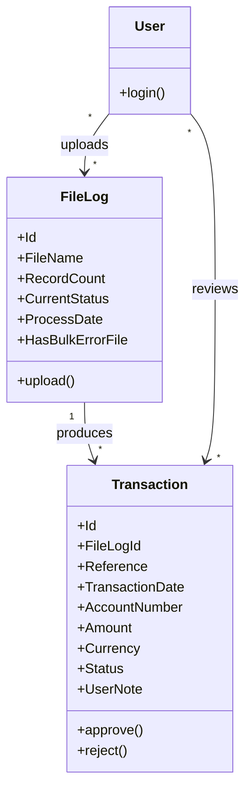

<!-- ROLE: asset. Section order matches `framework/assets/topics-requirements.md` one-to-one. Audience is LLM-only (no human stakeholder consumption). -->

# Requirements: Transaction Import & Approval System [SRC: C-001]

**Domain:** transaction processing [AI-SUGGESTED: AI-001 | blocking] **Target:** prototype **Created:** 2026-05-19 **Status:** draft **Last finalised at:** —

> **Authoring guardrails.** Cells across §1–§10 must obey `GR-20` (no stack specifics) and `GR-21` (no UI layout in §6.4/§6.7/§6.8/§6.9). Inferred content is marked inline with one of `[AI-SUGGESTED: AI-NNN | blocking|non-blocking]`, `[STANDARD-RULE: GR-NN]`, or `[OUT-OF-SCOPE: domain-default]`. Input-grounded cells carry `[SRC: C-NNN]`, backed by `requirements/draft-claims.ndjson`.

---

## 0.1 Target-mode applicability

| Section | `prototype` | `application` | Mode-conditional? |
| --- | --- | --- | --- |
| §6.10 Consumed backend contracts | fixture references | pointers into the sibling backend requirements document | yes — sub-block content differs |
| §7 Data shapes consumed by FE | shape sourced from fixtures | shape sourced from backend contracts | provenance label only |
| `## Prototype invariants` appendix | appended (PI-01..PI-07) | omitted | yes — merger conditional |
| (all other sections) | identical | identical | no |

---

## 1. Application context

**Name:** Transaction Import & Approval System [SRC: C-002]

**Purpose / business value:** Enable Importers to upload and review transaction files [SRC: C-003], and Approvers to review, approve/reject, and export transactions [SRC: C-004].

**Domain:** transaction processing [AI-SUGGESTED: AI-001 | blocking]

**Business goal:** Provide a controlled, role-gated workflow for file-driven ingestion of transactions [SRC: C-005] and subsequent approval / rejection by a separate Approver role, so that data entering downstream systems has passed a human review gate. [AI-SUGGESTED: AI-002 | blocking]

<!-- rev: run-1 2026-05-19 -->

---

## 1.5 Scope

| Bucket | Items |
| --- | --- |
| In | file-driven ingestion of transactions [SRC: C-006]; transaction lifecycle tracking [SRC: C-007]; role-based interaction constraints [SRC: C-008]; transaction review and approve/reject workflow [SRC: C-009]; transaction search and filtering [SRC: C-010]; transaction export [SRC: C-011]; per-file summary view [SRC: C-012] |
| Out | backend persistence design [AI-SUGGESTED: AI-003 | non-blocking]; identity-provider integration internals [AI-SUGGESTED: AI-004 | non-blocking] |
| Deferred | bulk transaction approval [AI-SUGGESTED: AI-005 | non-blocking]; multi-currency normalisation [AI-SUGGESTED: AI-006 | non-blocking] |

<!-- rev: run-1 2026-05-19 -->

---

## 1.6 Assumptions & dependencies

| Kind | Statement | Source |
| --- | --- | --- |
| Abstract service dependency | an identity provider authenticates users via an email-and-password credential exchange [SRC: C-013] | stated |
| Abstract service dependency | a transaction-ingestion service that extracts individual records from an uploaded file [SRC: C-014] | stated |
| Abstract service dependency | a binary blob storage tier holds uploaded transaction files [AI-SUGGESTED: AI-007 | non-blocking] | inferred |
| Persona prerequisite | users have a pre-provisioned account in the identity provider, accessed via the login endpoint [SRC: C-015] | stated |
| Environment assumption | users operate on modern evergreen browsers with a stable broadband connection [AI-SUGGESTED: AI-008 | non-blocking] | inferred |

<!-- rev: run-1 2026-05-19 -->

---

## 1.7 Architectural implications

| Capability category | Driving requirement(s) | Recommendation (optional) |
| --- | --- | --- |
| Client-side state management | → §6.1 F-01, F-04, F-09, F-10, F-16 | [AI-SUGGESTED: AI-009 | non-blocking] |
| Client-side search / filtering | → §6.1 F-03, F-04, F-05, F-06, F-07, F-08; → §10 | in-memory index acceptable [AI-SUGGESTED: AI-010 | non-blocking] |
| File upload / binary blob handling | → §6.1 F-01; → §7 File Log | binary blob storage tier required [AI-SUGGESTED: AI-011 | non-blocking] |
| Export rendering capability | → §6.1 F-12; → §6.7 RPT-01 | [AI-SUGGESTED: AI-012 | non-blocking] |
| Drag-and-drop interaction | → §6.1 F-01; → §6.4 UI-01 | [AI-SUGGESTED: AI-013 | non-blocking] |
| Role-conditional rendering | → §6.5; → §6.1 F-09, F-10, F-12 | [AI-SUGGESTED: AI-014 | non-blocking] |

<!-- rev: run-1 2026-05-19 -->

---

## 2. Domain model

### 2.1 Concepts

| Concept | Persistence | Definition (ubiquitous language) |
| --- | --- | --- |
| File Log [SRC: C-016] | persistent [AI-SUGGESTED: AI-015 | non-blocking] | An uploaded file together with its processing state [SRC: C-017]. |
| Transaction [SRC: C-018] | persistent [AI-SUGGESTED: AI-016 | non-blocking] | An individual record extracted from an uploaded file [SRC: C-019]. |
| User [SRC: C-020] | persistent [AI-SUGGESTED: AI-017 | non-blocking] | An authenticated principal who interacts with the system via email-and-password login [SRC: C-021]. |

### 2.2 Relationships

- File Log **produces** Transaction [1..*] [SRC: C-022]
- Transaction **inherits context from** File Log (file name, source) [SRC: C-023]
- User **acts on** Transaction (approve / reject) [SRC: C-024]
- User **acts on** File Log (upload / view) [AI-SUGGESTED: AI-018 | non-blocking]

### 2.3 Aggregates & lifecycles

#### File Log

| Field | Value |
| --- | --- |
| Member concepts | File Log [SRC: C-025], Transaction [SRC: C-026] |
| Lifecycle states | Uploaded [SRC: C-027] → Processing [SRC: C-028] → Completed [SRC: C-029] \| Failed [SRC: C-030] |
| Key invariants | A File Log cannot reach Completed unless transaction extraction succeeded; a File Log carrying any bulk extraction error transitions to Failed and exposes an error indicator [SRC: C-031]. [AI-SUGGESTED: AI-019 | blocking] |

#### Transaction

| Field | Value |
| --- | --- |
| Member concepts | Transaction [SRC: C-032] |
| Lifecycle states | Imported [SRC: C-033] → Approved [SRC: C-034] \| Rejected [SRC: C-035] |
| Key invariants | A Transaction cannot be approved or rejected while its status is not Imported [SRC: C-036]; approve/reject actions are role-gated to the Approver persona [SRC: C-037]; a rejection requires a mandatory note [SRC: C-038]. |

### 2.4 Diagram (optional)

### 2.5 State-transition matrix

#### File Log

| From → To | Trigger | Pre-condition | Visible effect |
| --- | --- | --- | --- |
| (none) → Uploaded | Importer submits a file via the upload action [SRC: C-039] | Importer authenticated, file selected [SRC: C-040] | The new File Log row appears in the file-log list with status Uploaded [AI-SUGGESTED: AI-020 | non-blocking] |
| Uploaded → Processing | Ingestion service begins extracting transactions [SRC: C-041] | The file has been received [AI-SUGGESTED: AI-021 | non-blocking] | The file-log row's status badge updates to Processing [AI-SUGGESTED: AI-022 | non-blocking] |
| Processing → Completed | All transactions in the file have been extracted successfully [SRC: C-042] | → §6.2 BR-04 | The file-log row's status badge updates to Completed and the record count displays [AI-SUGGESTED: AI-023 | non-blocking] |
| Processing → Failed | Extraction fails or the file carries bulk extraction errors [SRC: C-043] | → §6.2 BR-05 | The file-log row's status badge updates to Failed and an error indicator displays [SRC: C-044] |

#### Transaction

| From → To | Trigger | Pre-condition | Visible effect |
| --- | --- | --- | --- |
| (none) → Imported | Transaction is extracted from a File Log [SRC: C-045] | The parent File Log reached Completed [AI-SUGGESTED: AI-024 | non-blocking] | The transaction row appears in the transactions table with status Imported [AI-SUGGESTED: AI-025 | non-blocking] |
| Imported → Approved | Approver invokes the approve action and confirms [SRC: C-046] | → §6.2 BR-01 | The transaction row's status badge updates to Approved and the row's approve/reject actions become unavailable [AI-SUGGESTED: AI-026 | non-blocking] |
| Imported → Rejected | Approver invokes the reject action and submits a mandatory note [SRC: C-047] | → §6.2 BR-01; → §6.2 BR-02 | The transaction row's status badge updates to Rejected and the row's approve/reject actions become unavailable [AI-SUGGESTED: AI-027 | non-blocking] |

<!-- rev: run-1 2026-05-19 -->

---

## 3. Target users

### Importer

| Field | Value |
| --- | --- |
| Role / job title | Importer [SRC: C-048] |
| Expertise level | Operational user familiar with the file format and the upload workflow [AI-SUGGESTED: AI-028 | non-blocking] |
| Stakes | Files must be uploaded promptly so downstream Approvers can act within the business day [AI-SUGGESTED: AI-029 | non-blocking] |
| Frequency of use | Daily, in batches aligned with the upstream system's file production cadence [AI-SUGGESTED: AI-030 | non-blocking] |
| Driving forces — wants | Upload files [SRC: C-049]; view transactions [SRC: C-050]; search and filter transactions [SRC: C-051]; view file summaries [SRC: C-052] |
| Driving forces — fears | Uploading a malformed or duplicate file that triggers downstream rework [AI-SUGGESTED: AI-031 | non-blocking] |

### Approver

| Field | Value |
| --- | --- |
| Role / job title | Approver [SRC: C-053] |
| Expertise level | Reviewer with authority to approve or reject individual transactions [AI-SUGGESTED: AI-032 | non-blocking] |
| Stakes | Approval or rejection decisions affect what reaches downstream systems; rework cost is high [AI-SUGGESTED: AI-033 | non-blocking] |
| Frequency of use | Daily, working through the day's transactions after the Importer has uploaded the file [AI-SUGGESTED: AI-034 | non-blocking] |
| Driving forces — wants | View transactions [SRC: C-054]; search and filter [SRC: C-055]; approve and reject [SRC: C-056]; export data [SRC: C-057]; view file summaries [SRC: C-058] |
| Driving forces — fears | Approving an incorrect transaction without recourse [AI-SUGGESTED: AI-035 | non-blocking] |

<!-- rev: run-1 2026-05-19 -->

---

## 4. User goals & stories

### 4.1 Goals catalogue

| ID | Goal statement | Quality signals | Goal kind | Layout pref (optional) | UX-pattern pref (optional) |
| --- | --- | --- | --- | --- | --- |
| G-01 | Get an uploaded file's transactions into the review queue quickly and with confidence the upload succeeded [AI-SUGGESTED: AI-036 | non-blocking] | Upload feedback within seconds; status transitions visible without page refresh [AI-SUGGESTED: AI-037 | non-blocking] | top-level | — | — |
| G-02 | Locate the transactions that need attention out of a large batch [AI-SUGGESTED: AI-038 | non-blocking] | Filter and search return scoped result set; current filters always visible [AI-SUGGESTED: AI-039 | non-blocking] | top-level | — | — |
| G-03 | Apply approve / reject decisions to transactions with auditable evidence of intent [AI-SUGGESTED: AI-040 | blocking] | Confirmation gate on approve; mandatory note on reject; status updates instantly after the action [AI-SUGGESTED: AI-041 | non-blocking] | top-level | — | — |
| G-04 | Export the post-review transactions for downstream consumption [AI-SUGGESTED: AI-042 | non-blocking] | Export honours the active filter set [SRC: C-059] | top-level | — | — |
| G-05 | Audit a file's outcome at a glance — total records and counts per state [SRC: C-060] | Counts visible per state; error indicator visible when present [SRC: C-061] | sub-level | — | — |

### 4.2 Stories by persona

#### Importer

##### Story: As an Importer, I want to upload a transaction file and see that it has been received, so that downstream Approvers can act on it

| Field | Value |
| --- | --- |
| Goal | → §4.1 G-01 |
| Objective | Submit a file through the upload action and observe the system's acknowledgement of receipt and progress [AI-SUGGESTED: AI-043 | non-blocking] |
| Context (frequency / expertise / stakes) | Daily, by an operational user, where late uploads delay the entire day's approval queue [AI-SUGGESTED: AI-044 | non-blocking] |
| Linked task flow (optional) | → §5 Flow: File upload |
| Acceptance criteria | Given an authenticated Importer, when a transaction file is selected and the upload action is invoked, then the system shows upload progress [SRC: C-062] and on success or failure shows feedback [SRC: C-063]; and a new File Log row appears in the file-log list [AI-SUGGESTED: AI-045 | non-blocking]. |

##### Story: As an Importer, I want to confirm the system processed the file correctly, so that I can investigate before downstream review begins

| Field | Value |
| --- | --- |
| Goal | → §4.1 G-05 |
| Objective | Open a file summary view that shows record counts and per-state counts [AI-SUGGESTED: AI-046 | non-blocking] |
| Context (frequency / expertise / stakes) | After every upload, by an operational user [AI-SUGGESTED: AI-047 | non-blocking] |
| Linked task flow (optional) | → §5 Flow: File summary |
| Acceptance criteria | Given a File Log in Completed or Failed status, when the Importer opens the file summary, then total records [SRC: C-064], counts per state — Imported, Approved, Rejected [SRC: C-065] — and an error indicator [SRC: C-066] are visible. |

#### Approver

##### Story: As an Approver, I want to locate the transactions that need my attention, so that I can work through them efficiently

| Field | Value |
| --- | --- |
| Goal | → §4.1 G-02 |
| Objective | Filter the transactions table to the subset that needs review [AI-SUGGESTED: AI-048 | non-blocking] |
| Context (frequency / expertise / stakes) | Daily, by a reviewer working through large batches [AI-SUGGESTED: AI-049 | non-blocking] |
| Linked task flow (optional) | → §5 Flow: Search & filtering |
| Acceptance criteria | Given the transactions table, when the Approver applies a filter — status, file, date range, amount range, or text search by Reference or Account [SRC: C-067] — then the table updates to show the matching subset and the active filters remain visible. [AI-SUGGESTED: AI-050 | non-blocking] |

##### Story: As an Approver, I want to approve or reject transactions with a clear record of my decision, so that downstream systems receive a reviewed set

| Field | Value |
| --- | --- |
| Goal | → §4.1 G-03 |
| Objective | Apply approve or reject to a transaction, with confirmation on approve and a mandatory note on reject [SRC: C-068] |
| Context (frequency / expertise / stakes) | Daily, by an authorised reviewer; an incorrect approval has downstream rework cost [AI-SUGGESTED: AI-051 | non-blocking] |
| Linked task flow (optional) | → §5 Flow: Approve transaction; → §5 Flow: Reject transaction |
| Acceptance criteria | Given a transaction with status Imported, when the Approver invokes approve, then a confirmation gate is presented [SRC: C-069] and on confirm the transaction's status updates to Approved [SRC: C-070]. Given a transaction with status Imported, when the Approver invokes reject, then a mandatory note input is presented [SRC: C-071] and on submit the transaction's status updates to Rejected [SRC: C-072]. Approve and reject actions are unavailable for transactions whose status is not Imported [SRC: C-073]. |

##### Story: As an Approver, I want to export the reviewed transactions, so that they can feed downstream consumers

| Field | Value |
| --- | --- |
| Goal | → §4.1 G-04 |
| Objective | Trigger an export of the current filtered transaction set [SRC: C-074] |
| Context (frequency / expertise / stakes) | End-of-batch, by an authorised reviewer [AI-SUGGESTED: AI-052 | non-blocking] |
| Linked task flow (optional) | → §5 Flow: Export transactions |
| Acceptance criteria | Given a transactions table with an active filter set, when the Approver invokes export, then a CSV file is produced [SRC: C-075] containing the filtered transactions only [SRC: C-076]. |

---

## 5. Task flows

### Flow: Authentication

| Field | Value |
| --- | --- |
| Actor | → §3 Importer; → §3 Approver |
| Trigger | User opens the application and submits email and password [SRC: C-077] |
| Steps | (User enters email and password; the credential form indicates submission is pending) [SRC: C-078]; (System validates the credentials against the login endpoint; on success the user is routed to a role-specific landing) [SRC: C-079]; (On failure the system shows an error state in the credential form) [SRC: C-080] |
| Decision points | Credentials valid? → role-specific landing [SRC: C-081]; else error state [SRC: C-082] |
| Exception paths | {invalid credentials → an error state is shown on the credential form [SRC: C-083] → the user re-enters credentials [AI-SUGGESTED: AI-053 | non-blocking]} |
| Role-conditional behaviour | On success the user is routed to a role-specific landing screen [SRC: C-084] — Importer to the file-log landing; Approver to the transactions landing [AI-SUGGESTED: AI-054 | non-blocking] |

### Flow: File upload

| Field | Value |
| --- | --- |
| Actor | → §3 Importer |
| Trigger | The Importer initiates a file upload [SRC: C-085] |
| Steps | (Importer selects a file; the selection is reflected on the upload surface) [SRC: C-086]; (Importer provides FileSettingId, FileSettingName, and FileName; the values are captured on the upload surface) [SRC: C-087]; (Importer invokes upload; the upload-progress indicator updates) [SRC: C-088]; (System creates a File Log; the new File Log appears in the file-log list with its current status visible) [SRC: C-089]; (On success or failure the system shows feedback) [SRC: C-090] |
| Decision points | Upload succeeded? → File Log appears with status Uploaded [AI-SUGGESTED: AI-055 | non-blocking]; else error feedback is shown [AI-SUGGESTED: AI-056 | non-blocking] |
| Exception paths | {upload failure → a failure feedback message is shown [SRC: C-091] → the Importer can retry the upload [AI-SUGGESTED: AI-057 | non-blocking]} |
| Role-conditional behaviour | Available to the Importer only; the Approver cannot upload [SRC: C-092] |

### Flow: File log overview

| Field | Value |
| --- | --- |
| Actor | → §3 Importer; → §3 Approver |
| Trigger | The user opens the file-log list [SRC: C-093] |
| Steps | (User opens the file-log list; the system retrieves the uploaded files and displays them in a table with columns File Name, Process Date, Record Count, and Status) [SRC: C-094]; (User clicks a row; the system drills into that file's transactions) [SRC: C-095] |
| Decision points | Row clicked? → drill into transactions [SRC: C-096] |
| Exception paths | {no uploaded files yet → the list shows an entity-specific empty state with the upload call-to-action — Importer only [STANDARD-RULE: GR-08]; {an active filter returns no results → the list shows a zero-results state with active filter chips and a Clear-all action [STANDARD-RULE: GR-09]} |
| Role-conditional behaviour | Shared between both personas [SRC: C-097]; the upload call-to-action surfaces only to the Importer [SRC: C-098] |

### Flow: Transaction table

| Field | Value |
| --- | --- |
| Actor | → §3 Importer; → §3 Approver |
| Trigger | The user opens the transactions surface, either directly or by drilling from a file-log row [AI-SUGGESTED: AI-058 | non-blocking] |
| Steps | (User opens the transactions surface; the system retrieves transactions and displays them in a table with Reference, Date, Account, Amount, Currency, and Status) [SRC: C-099]; (Approver invokes a row-level action — Approve or Reject — when the transaction is Imported) [SRC: C-100]; (User may select multiple rows for bulk handling) [SRC: C-101] |
| Decision points | Persona is Approver and transaction status is Imported? → approve/reject actions are available on the row [SRC: C-102] |
| Exception paths | {no transactions for the active filter → the table shows a zero-results state with active filter chips and a Clear-all action [STANDARD-RULE: GR-09]}; {no transactions at all → the table shows an entity-specific empty state [STANDARD-RULE: GR-08]} |
| Role-conditional behaviour | Row-level approve/reject actions are visible to the Approver only [SRC: C-103]; both personas may view, search, and filter [SRC: C-104] |

### Flow: Search & filtering

| Field | Value |
| --- | --- |
| Actor | → §3 Importer; → §3 Approver |
| Trigger | The user invokes a filter or search control on the transactions table or the file-log list [SRC: C-105] |
| Steps | (User selects a Status value — Imported, Approved, or Rejected — and the result set narrows) [SRC: C-106]; (User selects a File — FileLogId — and the result set narrows) [SRC: C-107]; (User enters a Date range and the result set narrows) [SRC: C-108]; (User enters an Amount range and the result set narrows) [SRC: C-109]; (User types a text search by Reference or Account and the result set narrows) [SRC: C-110] |
| Decision points | At least one filter has changed? → the result set is recomputed and the active filters remain visible [AI-SUGGESTED: AI-059 | non-blocking] |
| Exception paths | {no results for the active filter set → zero-results state with active filter chips and a Clear-all action is shown [STANDARD-RULE: GR-09]} |
| Role-conditional behaviour | Available to both personas with identical filter semantics [AI-SUGGESTED: AI-060 | non-blocking] |

### Flow: Approve transaction

| Field | Value |
| --- | --- |
| Actor | → §3 Approver |
| Trigger | The Approver selects a transaction with status Imported and invokes approve [SRC: C-111] |
| Steps | (Approver selects a transaction; the row is highlighted as the action target) [SRC: C-112]; (Approver clicks approve; a confirmation gate is presented) [SRC: C-113]; (Approver confirms; the transaction's status updates to Approved) [SRC: C-114] |
| Decision points | Confirmation accepted? → status updates to Approved [SRC: C-115]; cancelled? → the transaction remains Imported [AI-SUGGESTED: AI-061 | non-blocking] |
| Exception paths | {transaction status is not Imported → the approve action is unavailable on the row [SRC: C-116]} |
| Role-conditional behaviour | Available to the Approver only [SRC: C-117]; the Importer cannot approve [SRC: C-118] |

### Flow: Reject transaction

| Field | Value |
| --- | --- |
| Actor | → §3 Approver |
| Trigger | The Approver selects a transaction with status Imported and invokes reject [SRC: C-119] |
| Steps | (Approver selects a transaction; the row is highlighted as the action target) [AI-SUGGESTED: AI-062 | non-blocking]; (Approver clicks reject; a mandatory-note input is presented) [SRC: C-120]; (Approver enters a note and submits; the transaction's status updates to Rejected) [SRC: C-121] |
| Decision points | Mandatory note provided? → status updates to Rejected [SRC: C-122]; note missing → submission is blocked with an inline validation error [AI-SUGGESTED: AI-063 | blocking] |
| Exception paths | {transaction status is not Imported → the reject action is unavailable on the row [SRC: C-123]} |
| Role-conditional behaviour | Available to the Approver only [SRC: C-124]; the Importer cannot reject [SRC: C-125] |

### Flow: Export transactions

| Field | Value |
| --- | --- |
| Actor | → §3 Approver |
| Trigger | The Approver invokes the export action [SRC: C-126] |
| Steps | (Approver applies any filters they want included in the export; the active filter set is visible) [AI-SUGGESTED: AI-064 | non-blocking]; (Approver invokes export; the system produces a CSV using the current filter set) [SRC: C-127]; (System provides the file for download; the Approver retains the file) [AI-SUGGESTED: AI-065 | non-blocking] |
| Decision points | Filters active? → export contains the filtered subset only [SRC: C-128] |
| Exception paths | {no transactions in the active filter → an empty-export-prevention message is shown [AI-SUGGESTED: AI-066 | non-blocking]} |
| Role-conditional behaviour | Available to the Approver only [SRC: C-129]; the Importer has no export action [AI-SUGGESTED: AI-067 | non-blocking] |

### Flow: File summary

| Field | Value |
| --- | --- |
| Actor | → §3 Importer; → §3 Approver |
| Trigger | The user opens the file summary for a File Log [SRC: C-130] |
| Steps | (User opens a file summary; the system derives totals from the File Log and its transactions and displays them) [SRC: C-131]; (User reads total records and counts per state — Imported, Approved, Rejected — and an error indicator when present) [SRC: C-132] |
| Decision points | HasBulkErrorFile is true? → the error indicator is shown [SRC: C-133] |
| Exception paths | {File Log has no transactions yet → the per-state counts show zero [AI-SUGGESTED: AI-068 | non-blocking]} |
| Role-conditional behaviour | Available to both personas [SRC: C-134] |

---

## 6. Requirements

### 6.1 Functional

| ID | Statement | Acceptance criteria | Source |
| --- | --- | --- | --- |
| F-01 | The system enables the Importer to upload a transaction file [SRC: C-135] | Given an authenticated Importer, when they invoke upload with a selected file and the required parameters FileSettingId, FileSettingName, FileName [SRC: C-136], then the system creates a File Log [SRC: C-137] and shows upload progress and success/failure feedback [SRC: C-138]. | stated |
| F-02 | The system extracts transactions from an uploaded file [SRC: C-139] | When a File Log reaches Processing, each individual record in the file becomes a Transaction with status Imported [SRC: C-140]. | stated |
| F-03 | The system enables searching and filtering of transactions [SRC: C-141] | Given the transactions table, when the user applies a filter or text search, then the table updates to show the matching subset [AI-SUGGESTED: AI-069 | non-blocking]. | stated |
| F-04 | The system filters transactions by status — Imported, Approved, Rejected [SRC: C-142] | When the user selects a status value, the table updates accordingly [AI-SUGGESTED: AI-070 | non-blocking]. | stated |
| F-05 | The system filters transactions by File (FileLogId) [SRC: C-143] | When the user selects a file, the table shows only that file's transactions [AI-SUGGESTED: AI-071 | non-blocking]. | stated |
| F-06 | The system filters transactions by date range [SRC: C-144] | When the user enters a date range, the table updates to that range [AI-SUGGESTED: AI-072 | non-blocking]. | stated |
| F-07 | The system filters transactions by amount range [SRC: C-145] | When the user enters an amount range, the table updates to that range [AI-SUGGESTED: AI-073 | non-blocking]. | stated |
| F-08 | The system supports text search across Reference and Account [SRC: C-146] | When the user types a search term, the table updates to rows whose Reference or Account contains the term [AI-SUGGESTED: AI-074 | non-blocking]. | stated |
| F-09 | The system enables the Approver to approve a transaction [SRC: C-147] | Given a transaction with status Imported, when the Approver invokes approve, then a confirmation gate is shown [SRC: C-148] and on confirm the status updates to Approved [SRC: C-149]. | stated |
| F-10 | The system enables the Approver to reject a transaction [SRC: C-150] | Given a transaction with status Imported, when the Approver invokes reject, then a mandatory note is required [SRC: C-151] and on submit the status updates to Rejected [SRC: C-152]. | stated |
| F-11 | The system enforces a mandatory note on reject [SRC: C-153] | When the Approver submits a reject without a note, the system blocks submission with an inline validation error [AI-SUGGESTED: AI-075 | blocking]. | stated |
| F-12 | The system enables the Approver to export transactions [SRC: C-154] | When the Approver invokes export, the system produces a CSV containing the currently filtered set [SRC: C-155]. | stated |
| F-13 | The system disables approve and reject for transactions whose status is not Imported [SRC: C-156] | Given a transaction with status Approved or Rejected, when the user views the row, then approve and reject are not available actions [AI-SUGGESTED: AI-076 | non-blocking]. | stated |
| F-14 | The system reflects status changes instantly without requiring a manual refresh [SRC: C-157] | When a transaction's status changes, the row's status badge updates within the current session view [AI-SUGGESTED: AI-077 | non-blocking]. | stated |
| F-15 | The system displays a file summary with total records and per-state counts and an error indicator [SRC: C-158] | When the user opens a file summary, total records, counts per state — Imported, Approved, Rejected — and an error indicator (HasBulkErrorFile) are visible [SRC: C-159]. | stated |
| F-16 | The system enables bulk selection of transactions [SRC: C-160] | When the user selects multiple transaction rows, the selection state is reflected for subsequent actions [AI-SUGGESTED: AI-078 | non-blocking]. | stated |
| F-17 | The system authenticates users via an email-and-password login [SRC: C-161] | When valid credentials are submitted, the user is routed to a role-specific landing [SRC: C-162]; when invalid, an error state is shown [SRC: C-163]. | stated |

### 6.2 Business rules

| ID | Statement (when / then) | Enforcement point | Acceptance criteria | Source | Severity |
| --- | --- | --- | --- | --- | --- |
| BR-01 | When a transaction's status is not Imported, then approve and reject actions are not available on the row [SRC: C-164] | UI | Approve and reject actions are visibly unavailable for Approved or Rejected rows [AI-SUGGESTED: AI-079 | non-blocking] | → §2.3 Transaction invariant; → §6.1 F-13 | blocker |
| BR-02 | When the Approver invokes reject, then a non-empty note must be provided before submission can proceed [SRC: C-165] | UI | Submit is blocked with an inline validation error until a non-empty note is entered [AI-SUGGESTED: AI-080 | blocking] | → §6.1 F-11 | blocker |
| BR-03 | When the Approver invokes approve, then a confirmation gate must be acknowledged before the status changes [SRC: C-166] | UI | The status does not change until confirmation is accepted [AI-SUGGESTED: AI-081 | non-blocking] | → §6.1 F-09; → `GR-04` | major |
| BR-04 | When all transactions in a file have been extracted successfully, then the File Log transitions to Completed [SRC: C-167] | service | The File Log row's status badge transitions to Completed and the record count is populated [AI-SUGGESTED: AI-082 | non-blocking] | → §2.3 File Log invariant | major |
| BR-05 | When extraction fails or the file carries bulk extraction errors, then the File Log transitions to Failed and exposes an error indicator [SRC: C-168] | service | The File Log row's status badge transitions to Failed and an error indicator displays [SRC: C-169] | → §2.3 File Log invariant; → §6.1 F-15 | major |
| BR-06 | When export is invoked, then the produced CSV contains only the currently filtered transactions [SRC: C-170] | UI | The export reflects the active filter chips [AI-SUGGESTED: AI-083 | non-blocking] | → §6.1 F-12 | major |
| BR-07 | When a row-level action would change a transaction's status, then it is gated on the user's role being Approver [SRC: C-171] | UI | Approve and reject are not visible to the Importer [SRC: C-172] | → §6.5 | blocker |

### 6.3 Validation rules

| Field (→ §7) | Validation type | Rule | Error message |
| --- | --- | --- | --- |
| Transaction.UserNote | required | A non-empty note is required when rejecting → §6.2 BR-02 | A note is required to reject a transaction. [AI-SUGGESTED: AI-084 | non-blocking] |
| User.email | format | Must be a valid email address [AI-SUGGESTED: AI-085 | non-blocking] | Enter a valid email address. [AI-SUGGESTED: AI-086 | non-blocking] |
| User.password | required | A non-empty password is required to submit credentials [AI-SUGGESTED: AI-087 | non-blocking] | Enter your password. [AI-SUGGESTED: AI-088 | non-blocking] |

### 6.4 UI feature needs

| ID | Feature need | Linked (G / story / BR) | Acceptance criteria |
| --- | --- | --- | --- |
| UI-01 | User can upload a transaction file with the required parameters [SRC: C-173] | → §4.2 Importer upload story; → §6.1 F-01 | Given an authenticated Importer, when they invoke upload with a selected file and the required parameters [SRC: C-174], then the system shows upload progress and success or failure feedback [SRC: C-175]. |
| UI-02 | User can view the list of uploaded files with File Name, Process Date, Record Count, and Status [SRC: C-176] | → §6.1 F-15 | Given uploaded files exist, when the user opens the file-log list, then File Name, Process Date, Record Count, and Status are displayed for each entry [AI-SUGGESTED: AI-089 | non-blocking]. |
| UI-03 | User can drill from a file-log entry into that file's transactions [SRC: C-177] | → §4.2 Approver search story | When the user activates a file-log entry, the transactions for that file are displayed [AI-SUGGESTED: AI-090 | non-blocking]. |
| UI-04 | User can view the transactions with Reference, Date, Account, Amount, Currency, and Status [SRC: C-178] | → §6.1 F-02 | When the transactions surface is opened, Reference, Date, Account, Amount, Currency, and Status are displayed for each transaction [AI-SUGGESTED: AI-091 | non-blocking]. |
| UI-05 | User can select multiple transactions for subsequent bulk handling [SRC: C-179] | → §6.1 F-16 | When the user activates multi-select, the selection state is reflected and bulk actions become available [AI-SUGGESTED: AI-092 | non-blocking]. |
| UI-06 | User can filter the transactions surface by status, file, date range, amount range, and text search by Reference or Account [SRC: C-180] | → §6.1 F-03..F-08 | When the user applies a filter, the result set narrows and the active filters remain visible [AI-SUGGESTED: AI-093 | non-blocking]. |
| UI-07 | User can approve a transaction with a confirmation gate [SRC: C-181] | → §6.1 F-09; → §6.2 BR-03 | When the Approver invokes approve, a confirmation is presented and the status only changes on confirm [AI-SUGGESTED: AI-094 | non-blocking]. |
| UI-08 | User can reject a transaction by submitting a mandatory note [SRC: C-182] | → §6.1 F-10; → §6.2 BR-02 | When the Approver invokes reject, a note input is presented and submission is blocked until a non-empty note is provided [AI-SUGGESTED: AI-095 | non-blocking]. |
| UI-09 | User can export the currently filtered transactions to CSV [SRC: C-183] | → §6.1 F-12; → §6.2 BR-06 | When the Approver invokes export, a CSV file containing the filtered set is produced [SRC: C-184]. |
| UI-10 | User can view a file summary showing total records, counts per state, and an error indicator [SRC: C-185] | → §6.1 F-15 | When the user opens a file summary, total records, per-state counts, and the error indicator are visible [AI-SUGGESTED: AI-096 | non-blocking]. |
| UI-11 | Approve and reject actions are unavailable on transactions whose status is not Imported [SRC: C-186] | → §6.2 BR-01 | Approved and Rejected transactions show no approve or reject actions [AI-SUGGESTED: AI-097 | non-blocking]. |
| UI-12 | Status changes are reflected instantly without requiring a manual refresh [SRC: C-187] | → §6.1 F-14 | The status badge updates within the same session view after an approve or reject [AI-SUGGESTED: AI-098 | non-blocking]. |
| UI-13 | User authenticates by submitting an email and password and is routed to a role-specific landing on success [SRC: C-188] | → §6.1 F-17 | Valid credentials route the user to a role-specific landing [SRC: C-189]; invalid credentials show an error state [SRC: C-190]. |
| UI-14 | Required fields are marked per the standard convention [STANDARD-RULE: GR-06] | → §6.3 | Required-field marking applies per `GR-06` [STANDARD-RULE: GR-06]. |
| UI-15 | Forms autofocus the first editable field on open [STANDARD-RULE: GR-07] | → §4.2 Approver review stories | The first editable field receives focus when a form opens [STANDARD-RULE: GR-07]. |
| UI-16 | Pagination affordances are always rendered on transactions and file-log lists [STANDARD-RULE: GR-11] | → §6.1 F-03; → §10 | Pagination behaviour applies per `GR-11` (rows-per-page ladder 5/10/20/50, default 20) [STANDARD-RULE: GR-11]. |
| UI-17 | Tabular data is sortable by default [STANDARD-RULE: GR-12] | → §6.1 F-03 | Sort behaviour applies per `GR-12` (single-axis sort, ascending then descending) [STANDARD-RULE: GR-12]. |
| UI-18 | Status values are presented as colour-and-icon pairs per the standard status mapping [STANDARD-RULE: GR-16] | → §2.3; → §6.7 | Status badges map intent — success, error, warning, in-progress, neutral — to the standard palette and always include a text label [STANDARD-RULE: GR-16]. |
| UI-19 | Toast or banner placement follows the standard intent split [STANDARD-RULE: GR-14] | → §6.4.5 | Transient confirmations use toasts; persistent state uses banners [STANDARD-RULE: GR-14]. |
| UI-20 | Loading indicators follow the standard threshold ladder [STANDARD-RULE: GR-10] | → §6.1 F-02; → §6.1 F-12 | No indicator under 300 ms; skeleton between 300 ms and 3 s; skeleton plus still-loading copy beyond 3 s [STANDARD-RULE: GR-10]. |

#### 6.4.5 Edge, empty & error states

| Surface (→ story / flow / UI-NN) | Condition | Expected UI behaviour | Recovery action |
| --- | --- | --- | --- |
| → §5 Flow: File log overview | empty | Show an entity-specific empty state naming the File Log and offering the upload call-to-action when the persona is Importer [STANDARD-RULE: GR-08] | The Importer invokes upload [STANDARD-RULE: GR-08] |
| → §5 Flow: File log overview | partial | When upload completes for some files but a new upload is still processing, the new entry appears with status Processing and updates as the back-end progresses [AI-SUGGESTED: AI-099 | non-blocking] | The user waits or invokes retry on a failed entry [AI-SUGGESTED: AI-100 | non-blocking] |
| → §5 Flow: Transaction table | empty | Show an entity-specific empty state naming Transactions [STANDARD-RULE: GR-08] | Persona-appropriate call-to-action — Importer is prompted to upload a file [STANDARD-RULE: GR-08] |
| → §5 Flow: Transaction table | error | When transaction retrieval fails, show a banner explaining the failure and a retry action [AI-SUGGESTED: AI-101 | non-blocking] | The user invokes retry [AI-SUGGESTED: AI-102 | non-blocking] |
| → §5 Flow: Search & filtering | filter-no-results | Show active filter chips and a Clear-all action; copy references the search/filter — no create CTA [STANDARD-RULE: GR-09] | The user clears filters or adjusts the search term [STANDARD-RULE: GR-09] |
| → §5 Flow: File upload | error | On upload failure, show a banner with the failure context and an option to retry [SRC: C-191] | The Importer retries the upload [AI-SUGGESTED: AI-103 | non-blocking] |
| → §6.4 UI-07 / UI-08 | permission-denied | Approve and reject actions are not visible to the Importer; reaching the transaction via a deep link shows an in-page permission-denied banner naming the missing permission [STANDARD-RULE: GR-02] | The user requests access through the contact path [STANDARD-RULE: GR-02] |
| → §6.4 UI-04 | loading | While transactions are being retrieved, show a skeleton matching the target list for 300 ms to 3 s, and add a still-loading message after 3 s [STANDARD-RULE: GR-10] | The user waits or invokes retry [STANDARD-RULE: GR-10] |
| → §6.4 UI-09 | empty-export | When the active filter set yields zero transactions, the export action is unavailable or shows an empty-export-prevention message [AI-SUGGESTED: AI-104 | non-blocking] | The user broadens the filter set [AI-SUGGESTED: AI-105 | non-blocking] |

### 6.5 Access control (RBAC)

**Action vocabulary:** `C` create · `R` read · `U` update · `D` delete · `X` execute / invoke · `A` approve · `—` no access. Suffix with a BR ref for conditional access.

| Role (→ §3) | File Log | Transaction | User | Authentication | File upload | File log overview | Transaction table | Search & filtering | Approve transaction | Reject transaction | Export transactions | File summary |
| --- | --- | --- | --- | --- | --- | --- | --- | --- | --- | --- | --- | --- |
| Importer [SRC: C-192] | C R [SRC: C-193] | R [SRC: C-194] | R [AI-SUGGESTED: AI-106 | non-blocking] | X [AI-SUGGESTED: AI-107 | non-blocking] | X [SRC: C-195] | X [SRC: C-196] | R [SRC: C-197] | X [SRC: C-198] | — [SRC: C-199] | — [SRC: C-200] | — [AI-SUGGESTED: AI-108 | non-blocking] | X [SRC: C-201] |
| Approver [SRC: C-202] | R [AI-SUGGESTED: AI-109 | non-blocking] | R A†BR-01 [SRC: C-203] | R [AI-SUGGESTED: AI-110 | non-blocking] | X [AI-SUGGESTED: AI-111 | non-blocking] | — [SRC: C-204] | X [SRC: C-205] | X [SRC: C-206] | X [SRC: C-207] | X†BR-01 [SRC: C-208] | X†BR-01,BR-02 [SRC: C-209] | X [SRC: C-210] | X [SRC: C-211] |

### 6.6 Non-functional (FE-only)

#### 6.6.1 Session UX

| Field | Value | Source |
| --- | --- | --- |
| Idle session timeout | 15 minutes [STANDARD-RULE: GR-19] | inferred |
| Absolute session timeout | 8 hours [STANDARD-RULE: GR-19] | inferred |
| Idle warning lead-time | 60 seconds [STANDARD-RULE: GR-19] | inferred |
| Re-auth scope | step-up authentication required for approve and reject actions [STANDARD-RULE: GR-19] | inferred |
| Account lockout messaging | A persistent banner explains the lockout state and the contact path after repeated failed attempts [AI-SUGGESTED: AI-112 | non-blocking] | inferred |
| MFA prompt scope | Step-up multi-factor prompt presented before approve or reject actions in the regulated branch [STANDARD-RULE: GR-19] | inferred |

#### 6.6.2 Frontend performance budgets

| Metric | Target | Source |
| --- | --- | --- |
| Time to interactive (p95) | p95 ≤ 2.5 s on the transactions table over 10⁴ rows [AI-SUGGESTED: AI-113 | non-blocking] | inferred |
| Initial bundle size budget | ≤ 350 KB gzipped initial route [AI-SUGGESTED: AI-114 | non-blocking] | inferred |
| Render budget for largest list/table | p95 ≤ 1.5 s for the transactions table on filter change [AI-SUGGESTED: AI-115 | non-blocking] | inferred |
| Time to meaningful content | p95 ≤ 1.2 s for first row visibility on the transactions surface [AI-SUGGESTED: AI-116 | non-blocking] | inferred |

#### 6.6.4 Compliance UI behaviour

- Approve and reject actions log the actor's identity, the affected transaction, and any submitted note for downstream audit consumption [AI-SUGGESTED: AI-117 | blocking]
- Step-up authentication is required before approve or reject actions in the regulated branch [STANDARD-RULE: GR-19]
- No PII is shown beyond what is required for review — Account is the only account identifier rendered in the transactions table [AI-SUGGESTED: AI-118 | non-blocking]

#### 6.6.5 Accessibility

- WCAG 2.2 AA across all interactive surfaces [AI-SUGGESTED: AI-119 | non-blocking]
- Keyboard-only operability for upload, search, approve, reject, and export actions [AI-SUGGESTED: AI-120 | non-blocking]
- Screen-reader-compatible status badges with text labels in addition to colour [STANDARD-RULE: GR-16]

### 6.7 Reporting feature needs

| ID | Purpose | Audience (→ §3) | Source concept(s) (→ §2.1) | Filter dimensions | Measures / columns | Export formats | Scheduling |
| --- | --- | --- | --- | --- | --- | --- | --- |
| RPT-01 | Export reviewed transactions for downstream consumption [SRC: C-212] | Approver [SRC: C-213] | Transaction [SRC: C-214] | status, file, date range, amount range, text search by Reference or Account [SRC: C-215] | Reference, Date, Account, Amount, Currency, Status [SRC: C-216] | csv [SRC: C-217] | on-demand [AI-SUGGESTED: AI-121 | non-blocking] |
| RPT-02 | Per-file summary of total records and counts by state [SRC: C-218] | Importer; Approver [SRC: C-219] | File Log [SRC: C-220]; Transaction [SRC: C-221] | per File Log [AI-SUGGESTED: AI-122 | non-blocking] | total records [SRC: C-222]; counts by status — Imported, Approved, Rejected [SRC: C-223]; error indicator [SRC: C-224] | none [AI-SUGGESTED: AI-123 | non-blocking] | on-demand [AI-SUGGESTED: AI-124 | non-blocking] |

### 6.8 Notification points

_No notification points captured from the input. Status changes are surfaced as in-session status badge updates only (see §6.1 F-14, §6.4 UI-12)._

### 6.9 Audit-trail UI feature

_Not emitted. Input documents do not call for user-visible audit history; compliance §6.6.4 logging is downstream-only._

### 6.10 Consumed backend contracts

#### Under `target = prototype`

| Operation | Fixture reference | Notes |
| --- | --- | --- |
| POST /v1/users/login [SRC: C-225] | fixtures/users.json [AI-SUGGESTED: AI-125 | non-blocking] | Authenticates email-and-password [SRC: C-226]; returns role for landing routing [AI-SUGGESTED: AI-126 | non-blocking]. → §6.1 F-17 |
| POST /v1/files/upload [SRC: C-227] | fixtures/file-logs.json [AI-SUGGESTED: AI-127 | non-blocking] | Receives a file plus FileSettingId, FileSettingName, FileName; produces a File Log [SRC: C-228]. → §6.1 F-01 |
| GET /v1/file-logs [SRC: C-229] | fixtures/file-logs.json [AI-SUGGESTED: AI-128 | non-blocking] | Lists uploaded files with their current status [AI-SUGGESTED: AI-129 | non-blocking]. → §6.1 F-15 |
| GET /v1/transactions [SRC: C-230] | fixtures/transactions.json [AI-SUGGESTED: AI-130 | non-blocking] | Returns transactions optionally scoped by FileLogId or filter set [AI-SUGGESTED: AI-131 | non-blocking]. → §6.1 F-02, F-03 |
| POST /v1/transactions/approve [SRC: C-231] | fixtures/transactions.json (mutated in memory) [AI-SUGGESTED: AI-132 | non-blocking] | Mutates the targeted transaction's status from Imported to Approved [SRC: C-232]. → §6.1 F-09 |
| POST /v1/transactions/reject [SRC: C-233] | fixtures/transactions.json (mutated in memory) [AI-SUGGESTED: AI-133 | non-blocking] | Mutates the targeted transaction's status from Imported to Rejected and records the submitted note [SRC: C-234]. → §6.1 F-10 |
| Export (no explicit endpoint provided → simulate) [SRC: C-235] | fixtures/transactions.json (filtered subset projected) [AI-SUGGESTED: AI-134 | non-blocking] | Projects the active filter set to a CSV payload [AI-SUGGESTED: AI-135 | non-blocking]. → §6.1 F-12 |

---

## 7. Data shapes consumed by the FE

### Shape: File Log

| Field | Type | Required | UI-display | Notes |
| --- | --- | --- | --- | --- |
| Id [SRC: C-236] | string [OUT-OF-SCOPE: domain-default] | yes | hidden | Stable identifier; not displayed in the file-log list [OUT-OF-SCOPE: domain-default] |
| FileName [SRC: C-237] | string [AI-SUGGESTED: AI-138 | non-blocking] | yes | table-col | Displayed as the File Name column [SRC: C-238] |
| RecordCount [SRC: C-239] | integer [AI-SUGGESTED: AI-139 | non-blocking] | yes | table-col | Displayed as the Record Count column [SRC: C-240] |
| CurrentStatus [SRC: C-241] | enum | yes | chip | Status badge for the file; values per the File Log lifecycle [AI-SUGGESTED: AI-140 | non-blocking] |
| ProcessDate [SRC: C-242] | date [AI-SUGGESTED: AI-141 | non-blocking] | yes | table-col | Displayed as the Process Date column [SRC: C-243] |
| HasBulkErrorFile [SRC: C-244] | boolean [AI-SUGGESTED: AI-142 | non-blocking] | yes | chip | Drives the error indicator shown in the file summary [SRC: C-245] |

**Domain concept:** → §2.1 File Log
**Source:** prototype-fixture
**Enums:** CurrentStatus ∈ { Uploaded [SRC: C-246], Processing [SRC: C-247], Completed [SRC: C-248], Failed [SRC: C-249] }

### Shape: Transaction

| Field | Type | Required | UI-display | Notes |
| --- | --- | --- | --- | --- |
| Id [SRC: C-250] | string [OUT-OF-SCOPE: domain-default] | yes | hidden | Stable identifier [OUT-OF-SCOPE: domain-default] |
| FileLogId [SRC: C-251] | string [OUT-OF-SCOPE: domain-default] | yes | hidden | Parent File Log reference; drives the File filter [SRC: C-252] |
| Reference [SRC: C-253] | string [AI-SUGGESTED: AI-146 | non-blocking] | yes | table-col | Displayed as the Reference column [SRC: C-254] |
| TransactionDate [SRC: C-255] | date [AI-SUGGESTED: AI-147 | non-blocking] | yes | table-col | Displayed as the Date column [SRC: C-256] |
| AccountNumber [SRC: C-257] | string [AI-SUGGESTED: AI-148 | non-blocking] | yes | table-col | Displayed as the Account column [SRC: C-258] |
| Amount [SRC: C-259] | decimal [AI-SUGGESTED: AI-149 | non-blocking] | yes | table-col | Displayed as the Amount column [SRC: C-260] |
| Currency [SRC: C-261] | enum | yes | table-col | Displayed as the Currency column [SRC: C-262] |
| Status [SRC: C-263] | enum | yes | chip | Status badge per the Transaction lifecycle [SRC: C-264] |
| UserNote [SRC: C-265] | string | no | detail | Required on reject; visible on the transaction detail surface [AI-SUGGESTED: AI-150 | non-blocking] |

**Domain concept:** → §2.1 Transaction
**Source:** prototype-fixture
**Enums:** Status ∈ { Imported [SRC: C-266], Approved [SRC: C-267], Rejected [SRC: C-268] }; Currency is captured at extraction time and rendered verbatim in the table column [AI-SUGGESTED: AI-151 | non-blocking]

### Shape: User

| Field | Type | Required | UI-display | Notes |
| --- | --- | --- | --- | --- |
| email | string [AI-SUGGESTED: AI-152 | non-blocking] | yes | form-input | Authentication credential [SRC: C-269] |
| password | string [AI-SUGGESTED: AI-153 | non-blocking] | yes | form-input | Authentication credential [AI-SUGGESTED: AI-154 | non-blocking] |
| role | enum [OUT-OF-SCOPE: domain-default] | yes | hidden | Drives role-specific landing on successful login [SRC: C-270] |

**Domain concept:** → §2.1 User
**Source:** prototype-fixture
**Enums:** role ∈ { Importer [SRC: C-275], Approver [SRC: C-276] }

---

## 8. Source UI references

| Reference | Location | Notes |
| --- | --- | --- |
| (none supplied) | — | Input brief is text-only; no wireframes, screenshots, or existing-tool screens were attached. |

---

## 9. Key terminology

| Term | Definition | Inconsistency flag |
| --- | --- | --- |
| File Log | → §2.1 File Log | — |
| Transaction | → §2.1 Transaction | — |
| User | → §2.1 User | — |
| Importer | The persona authorised to upload transaction files and view transactions [SRC: C-271] | — |
| Approver | The persona authorised to review, approve, reject, and export transactions [SRC: C-272] | — |
| File Settings (FileSettingId, FileSettingName) | Configuration parameters supplied alongside the file at upload time [SRC: C-273] | Inputs name the fields without defining their purpose; treated as opaque parameters at the FE boundary [AI-SUGGESTED: AI-158 | non-blocking] |
| Bulk Error File | Indicator on a File Log that the file carries extraction errors at file scope rather than per-record [SRC: C-274] | — |

---

## 10. Volumes

| Metric | Value | Source |
| --- | --- | --- |
| Data volume | 10²–10⁴ transactions per file; 10³–10⁵ retained per active file log over a rolling window [AI-SUGGESTED: AI-159 | blocking] | inferred |
| Frequency | 1–10 file uploads per Importer per business day [AI-SUGGESTED: AI-160 | blocking] | inferred |
| Concurrency | 10–50 concurrent users across both personas [AI-SUGGESTED: AI-161 | blocking] | inferred |

---
