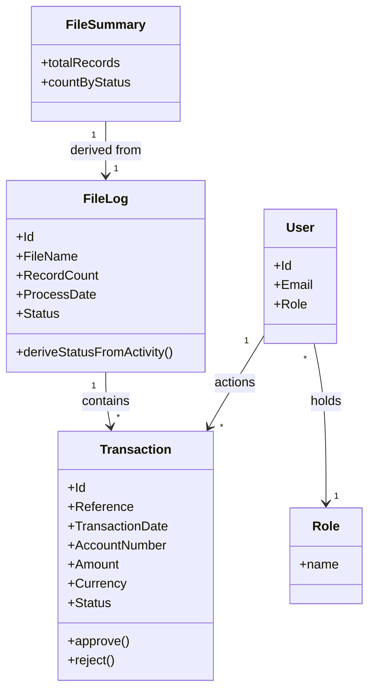

<!-- ROLE: requirements draft. LLM-audience. Populated from requirements/source-manifest.json inputs. -->

# Requirements: Transaction Import & Approval System [SRC: C-001]

**Domain:** Enterprise financial transaction data management [SRC: C-003] **Target:** prototype **Created:** 2026-06-12 **Status:** draft **Last finalised at:** —

> **Authoring guardrails.** `GR-20` (no stack specifics) and `GR-21` (no UI layout in §6.4/§6.7/§6.8/§6.9) observed. Inferred content marked inline: `[AI-SUGGESTED: AI-NNN | blocking|non-blocking]`, `[STANDARD-RULE: GR-NN]`, `[OUT-OF-SCOPE: domain-default]`. Input-grounded cells carry `[SRC: C-NNN]`, backed by `requirements/draft-claims.ndjson`.

---

## 0.1 Target-mode applicability

| Section | `prototype` | `application` | Mode-conditional? |
| --- | --- | --- | --- |
| §1.6 Assumptions & dependencies | emitted (≥1 dependency applies) | emitted | yes — content-conditional |
| §1.7 Architectural implications | emitted (drafter-derived; scope-noted) | carried through at export | no — scope-noted |
| §6.1 `Rationale` column | column emitted (optional, per-cell) | same | no |
| §6.6.1 Session UX | emitted (scope-noted) | carried through at export | no — scope-noted |
| §6.6.2 FE performance budgets | emitted (scope-noted) | carried through at export | no — scope-noted |
| §6.10 Consumed backend contracts | fixture references | pointers into backend doc | yes — sub-block content differs |
| §7 Data shapes consumed by FE | shape sourced from fixtures | shape sourced from backend contracts | provenance label only |
| §8 Source UI references | omitted (no consultant-supplied reference) | same | yes — content-conditional |
| §9 Key terminology | emitted (≥1 inconsistency flag exists) | same | yes — content-conditional |
| `## Prototype invariants` appendix | appended (PI-01..PI-08) | omitted | yes — merger conditional |
| (all other sections) | identical | identical | no |

---

## 1. Application context

**Name:** Transaction Import & Approval System [SRC: C-001]

**Purpose / business value:** A dual-role frontend that lets Importers upload and review transaction files [SRC: C-002] and lets Approvers review, approve or reject, and export transactions [SRC: C-005]. The system reflects file-driven ingestion, transaction lifecycle states, and role-based interaction constraints — "reflect" here meaning the frontend displays and surfaces them (read-oriented), not that it enforces them [SRC: C-058].

**Domain:** Enterprise financial transaction data management [SRC: C-003]

**Business goal:** Provide a file-driven ingestion-and-approval surface — files are ingested via File Logs [SRC: C-004], and the transactions they contain are reviewed and actioned through role-constrained screens.

---

## 1.5 Scope

> §1.5 is in-scope-only. The brief's seven named key screens are the explicit in-scope MVP set; anything outside that set is out of scope by default [SRC: C-047].

| Bucket | Items |
| --- | --- |
| In | Credentials-based authentication; role-based post-login routing; file upload (Importer); file-log overview; transaction table with client-side search/filter/pagination; transaction approve/reject; client-side CSV export of the filtered grid [SRC: C-005]; file-summary display [SRC: C-043] |
| Out | User and role administration (create/update/delete users and roles) [SRC: C-006]; file-validation-error review [SRC: C-007]; process-definition management [SRC: C-066]; file-settings configuration [OUT-OF-SCOPE: domain-default]; bulk-error-file download flow [OUT-OF-SCOPE: domain-default] |
| Deferred | User-facing recovery flow for a Failed file (unspecified, treated as not-yet-defined) [SRC: C-069] |

---

## 1.6 Assumptions & dependencies

> Abstract services and environment assumptions the FE depends on.

| Kind | Statement | Source |
| --- | --- | --- |
| Abstract service dependency | A credentials-based authentication service issues an HttpOnly, Secure, SameSite=Strict session cookie on successful login [SRC: C-064] | stated |
| Abstract service dependency | A transaction-management backend exposes file-log, transaction list, approve, reject, and upload operations the FE consumes | inferred |
| Persona prerequisite | Each user holds one of the two application roles (Importer or Approver) before sign-in [SRC: C-011] | stated |
| Environment assumption | Users operate desktop browsers first; a baseline accessibility standard is met [SRC: C-046] | stated |

---

## 1.7 Architectural implications

> **Application-build guidance — not a prototype design input; prototype behaviour is governed by PI-01/PI-03/PI-08.** Capability categories derived from §6 functional requirements + §10 volumes + §6.7 reporting needs. Recommendation column optional and non-deterministic.

| Capability category | Driving requirement(s) | Recommendation (optional) |
| --- | --- | --- |
| Client-side state management | → §6.1 F-06 / §6.1 F-07 / §6.1 F-08 | [AI-SUGGESTED: AI-001 \| non-blocking] |
| Client-side search / filtering | → §6.1 F-07 / §6.7 RPT-01 / §10 | in-memory index acceptable at this volume [AI-SUGGESTED: AI-002 \| non-blocking] |
| File upload / binary blob handling | → §6.1 F-03 / §10 | binary blob storage tier required [AI-SUGGESTED: AI-003 \| non-blocking] |
| Export rendering capability | → §6.1 F-11 / §6.7 RPT-02 | [AI-SUGGESTED: AI-004 \| non-blocking] |
| Notification delivery surface | → §6.8 NT-01 / §6.8 NT-02 | in-app channel [AI-SUGGESTED: AI-005 \| non-blocking] |
| Role-conditional rendering | → §6.5 / §6.1 F-02 | [AI-SUGGESTED: AI-006 \| non-blocking] |

---

## 2. Domain model

### 2.1 Concepts

| Concept | Persistence | Definition (ubiquitous language) |
| --- | --- | --- |
| File Log | persistent | Represents an uploaded file and its processing state [SRC: C-008] |
| Transaction | persistent | Represents individual records extracted from a file [SRC: C-009] |
| User | persistent | An authenticated person who holds one of the two application roles, Importer or Approver [SRC: C-011] |
| Role | policy | The permission class (Importer or Approver) that constrains which screens and actions a user may reach [SRC: C-011] |
| File Summary | derived | A per-file summary derived from a File Log and its Transactions [SRC: C-010] |

### 2.2 Relationships

- File Log **contains** Transaction [1 → many] [SRC: C-012]
- Transaction **inherits file context from** File Log [many → 1]
- User **holds** Role [many → 1] [SRC: C-011]
- Approver **actions** Transaction (approve / reject — affects status only, not structure) [SRC: C-013]
- File Summary **is derived from** File Log + its Transactions [SRC: C-010]

### 2.3 Aggregates & lifecycles

#### Transaction

| Field | Value |
| --- | --- |
| Member concepts | Transaction |
| Lifecycle states | Imported → Approved / Rejected [SRC: C-014] |
| Key invariants | Approve/reject are available only while a transaction is Imported [SRC: C-016]; terminal statuses (Approved, Rejected) are immutable and cannot be re-actioned or reversed [SRC: C-015] |

#### File Log

| Field | Value |
| --- | --- |
| Member concepts | File Log, Transaction |
| Lifecycle states | Uploaded → Processing → Completed / Failed (inferred, provisional model — to be confirmed) [SRC: C-017] |
| Key invariants | File Status is derived from the LastExecutedActivityName field via an activity-name-to-status mapping [SRC: C-068]; the FE displays file status and does not drive these transitions (backend-owned) [SRC: C-058] |

### 2.4 Diagram

### 2.5 State-transition matrix

> One sub-block per aggregate with more than two lifecycle states.

#### Transaction

| From → To | Trigger | Pre-condition | Visible effect |
| --- | --- | --- | --- |
| Imported → Approved | Approver confirms approve [SRC: C-018] | status is Imported (→ §6.2 BR-01) | status chip changes Imported → Approved; approve/reject actions removed |
| Imported → Rejected | Approver submits reject with a mandatory note [SRC: C-019] | status is Imported (→ §6.2 BR-01); note supplied (→ §6.2 BR-03) | status chip changes Imported → Rejected; approve/reject actions removed |

#### File Log

| From → To | Trigger | Pre-condition | Visible effect |
| --- | --- | --- | --- |
| Uploaded → Processing | backend processing begins (out-of-FE-scope context) [AI-SUGGESTED: AI-007 \| non-blocking] | a file has been uploaded | File Status reflects new state on the File Log list |
| Processing → Completed | backend processing succeeds (out-of-FE-scope context) [AI-SUGGESTED: AI-008 \| non-blocking] | processing finished without error | File Status reflects Completed on the File Log list |
| Processing → Failed | backend processing fails (out-of-FE-scope context) [AI-SUGGESTED: AI-009 \| non-blocking] | processing encountered an error | File Status reflects Failed on the File Log list; recovery flow unspecified [SRC: C-069] |

---

## 3. Target users

### Importer

| Field | Value |
| --- | --- |
| Role / job title | Importer — uploads and reviews transaction files [SRC: C-020] |
| Expertise level | [OUT-OF-SCOPE: domain-default] |
| Stakes | [OUT-OF-SCOPE: domain-default] |
| Frequency of use | [OUT-OF-SCOPE: domain-default] |
| Driving forces — wants | [OUT-OF-SCOPE: domain-default] |
| Driving forces — fears | [OUT-OF-SCOPE: domain-default] |

### Approver

| Field | Value |
| --- | --- |
| Role / job title | Approver — reviews, approves/rejects, and exports transactions [SRC: C-022] |
| Expertise level | [OUT-OF-SCOPE: domain-default] |
| Stakes | [OUT-OF-SCOPE: domain-default] |
| Frequency of use | [OUT-OF-SCOPE: domain-default] |
| Driving forces — wants | [OUT-OF-SCOPE: domain-default] |
| Driving forces — fears | [OUT-OF-SCOPE: domain-default] |

---

## 4. User goals & stories

### 4.1 Goals catalogue

| ID | Goal statement | Quality signals | Goal kind | Layout pref (optional) | UX-pattern pref (optional) |
| --- | --- | --- | --- | --- | --- |
| G-01 | Upload transaction files and track their processing [SRC: C-002] | [OUT-OF-SCOPE: domain-default] | top-level | | |
| G-02 | Review and action (approve/reject) transactions accurately [SRC: C-022] | [OUT-OF-SCOPE: domain-default] | top-level | | |
| G-03 | Export the filtered transaction set [SRC: C-005] | [OUT-OF-SCOPE: domain-default] | top-level | | |
| G-04 | Find specific transactions quickly via search and filter [SRC: C-042] | [OUT-OF-SCOPE: domain-default] | sub-level | | |
| G-05 | See transaction and file status at a glance [SRC: C-041] | [OUT-OF-SCOPE: domain-default] | interaction-level | | |

### 4.2 Stories by persona

#### Importer <!-- → §3 -->

##### Story: As an Importer, I want to upload a transaction file, so that its records are ingested and tracked

| Field | Value |
| --- | --- |
| Goal | → §4.1 G-01 |
| Priority | Must [STANDARD-RULE: GR-24] |
| Objective | Select a file, supply the required file-setting details, and upload it [SRC: C-028] |
| Context (frequency / expertise / stakes) | [OUT-OF-SCOPE: domain-default] |
| Linked task flow (optional) | → §5 Flow: File Upload |
| Acceptance criteria | Given a selected file and required details, when the Importer uploads, then upload progress is shown and a success or failure result is presented |

##### Story: As an Importer, I want to see uploaded files and their status, so that I can confirm ingestion

| Field | Value |
| --- | --- |
| Goal | → §4.1 G-05 |
| Priority | Must [STANDARD-RULE: GR-24] |
| Objective | View the list of uploaded files with their file name, process date, record count, and status [SRC: C-030] |
| Context (frequency / expertise / stakes) | [OUT-OF-SCOPE: domain-default] |
| Linked task flow (optional) | → §5 Flow: File Log Overview |
| Acceptance criteria | Given uploaded files exist, when the Importer opens the file-log overview, then each file's name, process date, record count, and status are shown |

##### Story: As an Importer, I want to search and filter transactions, so that I can review the records of a file

| Field | Value |
| --- | --- |
| Goal | → §4.1 G-04 |
| Priority | Should [STANDARD-RULE: GR-24] |
| Objective | Filter and search the transaction table by status, file, date, amount, and free text [SRC: C-042] |
| Context (frequency / expertise / stakes) | [OUT-OF-SCOPE: domain-default] |
| Linked task flow (optional) | → §5 Flow: Search & Filtering |
| Acceptance criteria | Given the transaction table is loaded, when the Importer applies a filter, then only matching rows remain visible |

#### Approver <!-- → §3 -->

##### Story: As an Approver, I want to approve a transaction, so that it is marked Approved

| Field | Value |
| --- | --- |
| Goal | → §4.1 G-02 |
| Priority | Must [STANDARD-RULE: GR-24] |
| Objective | Select an Imported transaction and confirm approval [SRC: C-018] |
| Context (frequency / expertise / stakes) | [OUT-OF-SCOPE: domain-default] |
| Linked task flow (optional) | → §5 Flow: Approve Transaction |
| Acceptance criteria | Given an Imported transaction, when the Approver confirms approve, then its status becomes Approved and the new status appears within about one second [SRC: C-040] |

##### Story: As an Approver, I want to reject a transaction with a note, so that the reason is recorded

| Field | Value |
| --- | --- |
| Goal | → §4.1 G-02 |
| Priority | Must [STANDARD-RULE: GR-24] |
| Objective | Select an Imported transaction, enter a mandatory note, and submit the rejection [SRC: C-033] |
| Context (frequency / expertise / stakes) | [OUT-OF-SCOPE: domain-default] |
| Linked task flow (optional) | → §5 Flow: Reject Transaction |
| Acceptance criteria | Given an Imported transaction, when the Approver submits a rejection without a note, then submission is blocked; when a note is supplied, then status becomes Rejected |

##### Story: As an Approver, I want to export the filtered transactions, so that I can use the data elsewhere

| Field | Value |
| --- | --- |
| Goal | → §4.1 G-03 |
| Priority | Must [STANDARD-RULE: GR-24] |
| Objective | Export the currently filtered transaction set to CSV [SRC: C-036] |
| Context (frequency / expertise / stakes) | [OUT-OF-SCOPE: domain-default] |
| Linked task flow (optional) | → §5 Flow: Export Transactions |
| Acceptance criteria | Given an active filter, when the Approver exports, then a CSV of the filtered rows is produced; when the filtered set is empty, then a no-op state is shown [SRC: C-037] |

---

## 5. Task flows

### Flow: Authentication

| Field | Value |
| --- | --- |
| Actor | Importer / Approver (→ §3) |
| Trigger | User opens the application and submits credentials [SRC: C-024] |
| Steps | (User enters email and password; fields accept input) [SRC: C-024]; (User submits to POST /v1/auth/login; on success a session cookie is set and the user is routed to a role landing) [SRC: C-025]; (On failure; a generic error is shown that does not reveal which field was incorrect) [SRC: C-065] |
| Decision points | success → role-specific landing; failure → error state |
| Exception paths | {invalid credentials → generic 401 error message → user retries} [SRC: C-065] |
| Role-conditional behaviour | Importers land on the File Upload / File Log area; Approvers land on the Transaction Table [SRC: C-026] |

### Flow: File Upload

| Field | Value |
| --- | --- |
| Actor | Importer (→ §3) |
| Trigger | Importer chooses to upload a transaction file [SRC: C-020] |
| Steps | (Select a file; file is staged for upload); (Provide FileSettingId, FileSettingName, FileName; required details captured) [SRC: C-028]; (Upload; the backend creates a File Log) [SRC: C-027]; (Upload result; success or failure feedback is shown) |
| Decision points | upload accepted → File Log created; upload rejected → failure feedback |
| Exception paths | {upload fails → failure feedback shown → Importer retries} |
| Role-conditional behaviour | Only Importers can upload; Approvers cannot upload [SRC: C-023] |

### Flow: File Log Overview

| Field | Value |
| --- | --- |
| Actor | Importer / Approver (→ §3) |
| Trigger | User opens the file-log overview (GET /v1/file-logs) [SRC: C-029] |
| Steps | (Open overview; uploaded files are listed with file name, process date, record count, and status) [SRC: C-030]; (Click a file row; the user drills into that file's transactions) [SRC: C-031] |
| Decision points | row click → transaction table scoped to the file |
| Exception paths | {no files uploaded → entity-specific empty state → Importer uploads a file} [STANDARD-RULE: GR-08] |
| Role-conditional behaviour | shared by both roles |

### Flow: Transaction Table

| Field | Value |
| --- | --- |
| Actor | Importer / Approver (→ §3) |
| Trigger | User opens the transaction table (GET /v1/transactions) [SRC: C-032] |
| Steps | (Open table; transactions are shown with reference, date, account, amount, currency, and status) [SRC: C-053]; (Approver selects a row action; approve or reject is offered only on Imported rows) [SRC: C-016] |
| Decision points | row status = Imported → approve/reject available; otherwise actions hidden/disabled |
| Exception paths | {filter yields no matches → no-results state with active filters and clear-all → user clears filters} [STANDARD-RULE: GR-09] |
| Role-conditional behaviour | row-level approve/reject visible to Approvers only [SRC: C-021] |

### Flow: Search & Filtering

| Field | Value |
| --- | --- |
| Actor | Importer / Approver (→ §3) |
| Trigger | User applies a filter or search on the transaction table or file logs |
| Steps | (Apply status / file / date-range / amount-range / text filter; matching rows remain) [SRC: C-042]; (Filtering runs client-side over the full list returned by the transactions endpoint) [SRC: C-036] |
| Decision points | matches found → filtered rows; none → no-results state |
| Exception paths | {no matches → no-results state with active filters and clear-all → user clears filters} [STANDARD-RULE: GR-09] |
| Role-conditional behaviour | shared by both roles |

### Flow: Approve Transaction

| Field | Value |
| --- | --- |
| Actor | Approver (→ §3) |
| Trigger | Approver chooses to approve an Imported transaction |
| Steps | (Select transaction; selection confirmed); (Click approve; a confirmation gate is shown) [STANDARD-RULE: GR-04]; (Confirm; status updates to Approved and reflects within about one second) [SRC: C-040] |
| Decision points | confirm → Approved; cancel → no change |
| Exception paths | {transaction already actioned by another Approver → stale-action notice → user sees updated status} [SRC: C-039] |
| Role-conditional behaviour | Approvers only; Importers cannot approve [SRC: C-021] |

### Flow: Reject Transaction

| Field | Value |
| --- | --- |
| Actor | Approver (→ §3) |
| Trigger | Approver chooses to reject an Imported transaction |
| Steps | (Select transaction; selection confirmed); (Click reject; a note field is presented); (Enter mandatory note; note captured) [SRC: C-033]; (Submit; status updates to Rejected) [SRC: C-019] |
| Decision points | note supplied → submit enabled; note empty → submit blocked |
| Exception paths | {note left empty → inline required-note error → user enters a note}; {transaction already actioned → stale-action notice → user sees updated status} [SRC: C-039] |
| Role-conditional behaviour | Approvers only; Importers cannot reject [SRC: C-021] |

### Flow: Export Transactions

| Field | Value |
| --- | --- |
| Actor | Approver (→ §3) |
| Trigger | Approver chooses to export the filtered transactions |
| Steps | (Apply filters; the grid reflects the filter) [SRC: C-034]; (Export; a CSV is generated client-side from the filtered grid) [SRC: C-036]; (Default format CSV; file is produced) [SRC: C-035] |
| Decision points | filtered set non-empty → CSV produced; empty → no-op state [SRC: C-037] |
| Exception paths | {filtered set empty → no-op state → user adjusts filters} [SRC: C-037] |
| Role-conditional behaviour | Approvers only [SRC: C-005] |

---

## 6. Requirements

### 6.1 Functional

| ID | Priority | Statement | Acceptance criteria (EARS — GR-23) | Source | Rationale (optional) |
| --- | --- | --- | --- | --- | --- |
| F-01 | Must [STANDARD-RULE: GR-24] | Authenticate a user with email and password via POST /v1/auth/login [SRC: C-025] | When valid credentials are submitted, the system shall establish a session and route to a role landing. If credentials are invalid, then the system shall show a generic error that does not reveal which field was incorrect [SRC: C-065]. | → §5 Flow: Authentication | Serves → §3 Importer |
| F-02 | Must [STANDARD-RULE: GR-24] | Route each role to its primary landing surface after login [SRC: C-026] | When an Importer signs in, the system shall present the File Upload / File Log area. When an Approver signs in, the system shall present the Transaction Table [SRC: C-026]. | → §5 Flow: Authentication | Enables → §5 Flow: Authentication |
| F-03 | Must [STANDARD-RULE: GR-24] | Allow an Importer to upload a transaction file with FileSettingId, FileSettingName, and FileName [SRC: C-028] | When an Importer submits a file with the required details, the system shall display upload progress and a success or failure result. | → §5 Flow: File Upload | Supports → §4.1 G-01 |
| F-04 | Must [STANDARD-RULE: GR-24] | Display the list of uploaded files with file name, process date, record count, and status [SRC: C-030] | While the file-log overview is open, the system shall show each file's name, process date, record count, and status. | GET /v1/file-logs [SRC: C-029] | Supports → §4.1 G-05 |
| F-05 | Should [STANDARD-RULE: GR-24] | Allow drilling from a file-log row into that file's transactions [SRC: C-031] | When a user selects a file-log row, the system shall show the transactions belonging to that file. | → §5 Flow: File Log Overview | Enables → §5 Flow: Transaction Table |
| F-06 | Must [STANDARD-RULE: GR-24] | Display transactions with reference, date, account, amount, currency, and status [SRC: C-053] | While the transaction table is loaded, the system shall show reference, date, account, amount, currency, and status for each transaction. | GET /v1/transactions [SRC: C-032] | Supports → §4.1 G-02 |
| F-07 | Must [STANDARD-RULE: GR-24] | Provide client-side search and filtering of transactions by status, file, date range, amount range, and free text [SRC: C-042] | When a user applies a filter, the system shall display only matching transactions. The system shall filter client-side over the full list returned by the transactions endpoint [SRC: C-036]. | → §5 Flow: Search & Filtering | Supports → §4.1 G-04 |
| F-08 | Must [STANDARD-RULE: GR-24] | Allow an Approver to approve an Imported transaction [SRC: C-018] | When an Approver confirms approval of an Imported transaction, the system shall set its status to Approved and reflect the change within about one second [SRC: C-040]. While a transaction is not Imported, the system shall not offer approve [SRC: C-016]. | POST /v1/transactions/approve [SRC: C-060] | Supports → §4.1 G-02 |
| F-09 | Must [STANDARD-RULE: GR-24] | Allow an Approver to reject an Imported transaction with a mandatory note [SRC: C-033] | If a rejection is submitted without a note, then the system shall block submission. When a note is supplied, the system shall set status to Rejected and record the note [SRC: C-019]. | POST /v1/transactions/reject [SRC: C-061] | Enforces → §2.3 Transaction |
| F-10 | Should [STANDARD-RULE: GR-24] | Guard against acting on an already-actioned transaction [SRC: C-039] | If a transaction has already been actioned, then the system shall prevent re-action and show that its status has changed [SRC: C-039]. | → §5 Flow: Approve Transaction | Enforces → §2.3 Transaction |
| F-11 | Must [STANDARD-RULE: GR-24] | Export the currently filtered transaction set to CSV, generated client-side [SRC: C-036] | When an Approver exports, the system shall generate a CSV from the filtered grid. If the filtered set is empty, then the system shall show a no-op state [SRC: C-037]. | → §5 Flow: Export Transactions | Supports → §4.1 G-03 |
| F-12 | Should [STANDARD-RULE: GR-24] | Display a file summary of total records and count by status [SRC: C-043] | While a file summary is open, the system shall show total records and a count of transactions by status. | → §6.7 RPT-01 | Supports → §4.1 G-05 |
| F-13 | Should [STANDARD-RULE: GR-24] | Mask AccountNumber on screen, showing only its last group of digits [SRC: C-045] | Where AccountNumber is displayed, the system shall mask all but its last group of digits [SRC: C-045]. | → §6.6.4 | Enforces → §2.3 Transaction |
| F-14 | Should [STANDARD-RULE: GR-24] | Present transaction status as a status chip [SRC: C-041] | While a transaction is displayed, the system shall present its status as a labelled status chip [SRC: C-041]. | → §6.4 UI-05 | Supports → §4.1 G-05 |
| F-15 | Should [STANDARD-RULE: GR-24] | Allow a user to sign out and clear the session | When a user signs out, the system shall invalidate the session and wait for confirmation before navigating away [SRC: C-064]. | POST /v1/auth/logout | Serves → §3 Approver |
| F-16 | Could [STANDARD-RULE: GR-24] | Verify session validity and render a welcome on page load | When the application loads, the system shall verify session validity and render the authenticated user's welcome [AI-SUGGESTED: AI-010 \| non-blocking]. | GET /v1/auth/userinfo | Serves → §3 Importer |

### 6.2 Business rules

| ID | Statement (when / then) | Enforcement point | Acceptance criteria (EARS — GR-23) | Source | Severity |
| --- | --- | --- | --- | --- | --- |
| BR-01 | When a transaction's status is not Imported, then approve and reject must be unavailable | cross-layer | While a transaction is not Imported, the system shall not offer approve or reject [SRC: C-016]. | → §2.3 Transaction | blocker |
| BR-02 | When a transaction is Approved or Rejected, then its status is terminal and cannot change | cross-layer | If a user attempts to re-action a terminal transaction, then the system shall prevent the change [SRC: C-015]. | → §2.3 Transaction | blocker |
| BR-03 | When a transaction is rejected, then a note is mandatory | ui | If a rejection is submitted without a note, then the system shall block submission and show a required-note error [SRC: C-033]. | → §5 Flow: Reject Transaction | major |
| BR-04 | When a transaction has already been actioned, then a second action must be prevented | cross-layer | If a transaction has already been actioned, then the system shall prevent re-action and surface the updated status [SRC: C-039]. | → §6.1 F-10 | major |
| BR-05 | When the user is an Importer, then approve and reject must be hidden | ui | Where the user is an Importer, the system shall hide approve and reject [SRC: C-021]. | → §6.5 | major |
| BR-06 | When the user is an Approver, then upload must be hidden | ui | Where the user is an Approver, the system shall hide upload [SRC: C-023]. | → §6.5 | major |
| BR-07 | When AccountNumber is shown, then all but its last group of digits must be masked | ui | Where AccountNumber is displayed, the system shall mask all but the last group of digits [SRC: C-045]. | → §6.6.4 | major |
| BR-08 | When a File Log is displayed, then its Status is derived from LastExecutedActivityName via an activity-name-to-status mapping | cross-layer | When a File Log is shown, the system shall display the Status mapped from LastExecutedActivityName per the activity-name-to-status mapping [AI-SUGGESTED: AI-011 \| blocking]. | → §2.3 File Log | major |

### 6.3 Validation rules

> Field-level validation surfaced as inline UI feedback. Timing follows `GR-05`.

| Field (→ §7) | Validation type | Rule | Error message |
| --- | --- | --- | --- |
| User.Email | required | Email must be supplied to sign in [SRC: C-024] | "Email and password are required." |
| User.(password, transient credential) | required | Password must be supplied to sign in (not a persisted field) [SRC: C-024] | "Email and password are required." |
| Transaction.UserNote | business-rule-ref | → §6.2 BR-03 (note mandatory on reject) [SRC: C-033] | "A note is required to reject this transaction." |
| FileLog.FileName | required | A file and file name must be supplied before upload [SRC: C-028] | "Select a file and provide a file name to upload." |
| Transaction.Amount | format | Amount must be a number [AI-SUGGESTED: AI-012 \| non-blocking] | "Enter a valid amount." |

### 6.4 UI feature needs

> Behavioural phrasing only (`GR-21`).

| ID | Priority | Feature need | Linked (G / story / BR) | Acceptance criteria |
| --- | --- | --- | --- | --- |
| UI-01 | Must [STANDARD-RULE: GR-24] | User can upload a transaction file and see upload progress and a result [SRC: C-027] | → §4.1 G-01 | Given a selected file, when the user uploads, then progress and a success/failure result are shown |
| UI-02 | Must [STANDARD-RULE: GR-24] | User can view uploaded files and their status [SRC: C-030] | → §4.1 G-05 | Given uploaded files, when the overview opens, then each file's status is shown |
| UI-03 | Must [STANDARD-RULE: GR-24] | User can search and filter transactions by status, file, date range, amount range, and free text [SRC: C-042] | → §4.1 G-04 | Given the table, when a filter is applied, then only matching rows remain |
| UI-04 | Must [STANDARD-RULE: GR-24] | Approver can approve or reject a transaction directly from its listed actions [SRC: C-022] | → §4.1 G-02 / → §6.2 BR-01 | Given an Imported transaction, when an Approver acts, then the action is offered and applied |
| UI-05 | Should [STANDARD-RULE: GR-24] | System shows transaction status as a labelled status chip [SRC: C-041] | → §4.1 G-05 | Given a transaction, when it is displayed, then its status is shown as a labelled chip |
| UI-06 | Must [STANDARD-RULE: GR-24] | Approver can export the filtered transactions to CSV [SRC: C-005] | → §4.1 G-03 | Given an active filter, when the Approver exports, then a CSV of the filtered rows is produced |
| UI-07 | Should [STANDARD-RULE: GR-24] | System paginates the transaction list client-side [SRC: C-038] | → §4.1 G-04 | Given many transactions, when the table renders, then results are paginated client-side |
| UI-08 | Should [STANDARD-RULE: GR-24] | User can see a file summary of total records and count by status [SRC: C-043] | → §4.1 G-05 / → §6.7 RPT-01 | Given a file, when its summary opens, then total records and count by status are shown |

#### 6.4.5 Edge, empty & error states

| Surface (→ story / flow / UI-NN) | Condition | Expected UI behaviour | Recovery action |
| --- | --- | --- | --- |
| → §5 Flow: File Log Overview | empty | Entity-specific empty state naming files and offering the upload action [STANDARD-RULE: GR-08] | Importer uploads a file |
| → §5 Flow: Search & Filtering | partial | No-results state showing active filters and a clear-all action [STANDARD-RULE: GR-09] | User clears filters |
| → §5 Flow: Export Transactions | empty | No-op state when the filtered set is empty [SRC: C-037] | User adjusts filters |
| → §5 Flow: Approve Transaction | error | Stale-action notice when the transaction was already actioned [SRC: C-039] | User reviews the updated status |
| → §6.1 F-06 | loading | Skeleton matching the target while transactions load [STANDARD-RULE: GR-10] | Wait for load to complete |
| → §6.1 F-08 | permission-denied | In-page permission-denied notice for a role lacking the action [STANDARD-RULE: GR-02] | User requests access via the named path |

### 6.5 Access control (RBAC)

> Cell values: `C` create · `R` read · `U` update · `X` execute/invoke · `A` approve · `—` no access. Suffix `†BR-NN` for conditional access.

| Role (→ §3) | File Log | Transaction | File Summary | User | Authentication | File Upload | File Log Overview | Transaction Table | Search & Filtering | Approve Transaction | Reject Transaction | Export Transactions |
| --- | --- | --- | --- | --- | --- | --- | --- | --- | --- | --- | --- | --- |
| Importer | C R [SRC: C-020] | R [SRC: C-070] | R [SRC: C-071] | — [SRC: C-006] | X [SRC: C-024] | X [SRC: C-020] | X [SRC: C-029] | X [SRC: C-070] | X [SRC: C-042] | — [SRC: C-021] | — [SRC: C-021] | — [SRC: C-005] |
| Approver | R [SRC: C-029] | R, A†BR-01 [SRC: C-018] | R [SRC: C-071] | — [SRC: C-006] | X [SRC: C-024] | — [SRC: C-023] | X [SRC: C-029] | X [SRC: C-070] | X [SRC: C-042] | X†BR-01 [SRC: C-018] | X†BR-01 [SRC: C-019] | X [SRC: C-005] |

### 6.6 Non-functional (FE-only)

#### 6.6.1 Session UX

> **Application-build guidance — not a prototype design input; prototype behaviour is governed by PI-01/PI-03.** Domain is financial/regulated, so `GR-19` financial defaults apply where input is silent.

| Field | Value | Source |
| --- | --- | --- |
| Idle session timeout | 15 min [STANDARD-RULE: GR-19] | inferred |
| Absolute session timeout | 8 h [STANDARD-RULE: GR-19] | inferred |
| Idle warning lead-time | 60 s (warn at T-1 min) [STANDARD-RULE: GR-19] | inferred |
| Re-auth scope | Step-up auth required for approve-class actions (approve/reject) [STANDARD-RULE: GR-19] | inferred |
| Account lockout messaging | Generic locked-account message after repeated failed logins [AI-SUGGESTED: AI-013 \| non-blocking] | inferred |
| MFA prompt scope | No MFA prompt in the MVP [AI-SUGGESTED: AI-014 \| non-blocking] | inferred |

#### 6.6.2 Frontend performance budgets

> **Application-build guidance — not a prototype design input; prototype behaviour is governed by PI-08.**

| Metric | Target | Source |
| --- | --- | --- |
| Time to interactive (p95) | p95 ≤ 2.5 s [AI-SUGGESTED: AI-015 \| non-blocking] | inferred |
| Initial bundle size budget | ≤ 300 KB gzipped [AI-SUGGESTED: AI-016 \| non-blocking] | inferred |
| Render budget for largest list/table | p95 ≤ 500 ms for the transaction table [AI-SUGGESTED: AI-017 \| non-blocking] | inferred |
| Time to meaningful content | ≤ 1.5 s [AI-SUGGESTED: AI-018 \| non-blocking] | inferred |

#### 6.6.4 Compliance UI behaviour

- AccountNumber is masked on screen by default, showing only its last group of digits, reflecting POPIA-aligned handling of personal financial data [SRC: C-045].
- The corpus claims no specific compliance regime; non-functional and compliance signals are stamped from domain defaults [SRC: C-067].

#### 6.6.5 Accessibility

- The application targets desktop browsers first and meets a baseline accessibility standard [SRC: C-046].

### 6.7 Reporting feature needs

| ID | Purpose | Audience (→ §3) | Source concept(s) (→ §2.1) | Filter dimensions | Measures / columns | Export formats | Scheduling |
| --- | --- | --- | --- | --- | --- | --- | --- |
| RPT-01 | File summary: total records and count by status [SRC: C-043] | Importer, Approver | File Log, Transaction | file | total records; count by status (Imported / Approved / Rejected) | none | on-demand |
| RPT-02 | Export of the filtered transaction set [SRC: C-036] | Approver | Transaction | status, file, date range, amount range, free text | reference, date, account, amount, currency, status | csv | on-demand |

### 6.8 Notification points

| ID | Event | Audience (→ §3) | Channel category | Trigger condition |
| --- | --- | --- | --- | --- |
| NT-01 | File upload result (success or failure) | Importer | in-app | when an upload completes [SRC: C-027] |
| NT-02 | Transaction action result (approved / rejected) | Approver | in-app | when an approve or reject completes (→ §6.2 BR-01) [SRC: C-040] |

### 6.10 Consumed backend contracts

> FE-facing only. Prototype sub-block (fixtures). Every operation maps to a §6.1 F-NN.

#### Under `target = prototype`

| Operation | Fixture reference | Notes |
| --- | --- | --- |
| Authenticate (POST /v1/auth/login) | `fixtures/auth-login.json` | → §6.1 F-01; sets a simulated session [SRC: C-025] |
| Logout (POST /v1/auth/logout) | `fixtures/auth-logout.json` | → §6.1 F-15 |
| User info (GET /v1/auth/userinfo) | `fixtures/userinfo.json` | → §6.1 F-16 |
| List file logs (GET /v1/file-logs) | `fixtures/file-logs.json` | → §6.1 F-04 [SRC: C-029] |
| List transactions (GET /v1/transactions) | `fixtures/transactions.json` | → §6.1 F-06 [SRC: C-032] |
| Upload file (POST /v1/files/upload) | `fixtures/file-upload.json` | → §6.1 F-03; simulated [SRC: C-059] |
| Approve transaction (POST /v1/transactions/approve) | `fixtures/transaction-approve.json` | → §6.1 F-08 [SRC: C-060] |
| Reject transaction (POST /v1/transactions/reject) | `fixtures/transaction-reject.json` | → §6.1 F-09 [SRC: C-061] |

---

## 7. Data shapes consumed by the FE

> Under `target = prototype`: the shape of in-memory fixtures (PI-02).

### Shape: FileLog

| Field | Type | Required | UI-display | Notes |
| --- | --- | --- | --- | --- |
| Id | integer | yes | hidden | [OUT-OF-SCOPE: domain-default] |
| FileName | string | yes | table-col | [SRC: C-056] |
| RecordCount | integer | yes | table-col | canonical type integer [SRC: C-052] |
| ProcessDate | string | yes | table-col | process date of the file |
| Status | enum | yes | chip | derived from LastExecutedActivityName [SRC: C-068] |
| IsActive | boolean | no | hidden | [OUT-OF-SCOPE: domain-default] |

**Domain concept:** → §2.1 File Log
**Source:** prototype-fixture
**Enums:** Status ∈ { Uploaded, Processing, Completed, Failed } (inferred, provisional) [SRC: C-017]

### Shape: Transaction

| Field | Type | Required | UI-display | Notes |
| --- | --- | --- | --- | --- |
| Id | integer | yes | hidden | [OUT-OF-SCOPE: domain-default] |
| FileLogId | integer | yes | hidden | foreign reference to File Log [OUT-OF-SCOPE: domain-default] |
| Reference | string | yes | table-col | [SRC: C-053] |
| TransactionDate | string | yes | table-col | canonical display format YYYY-MM-DD HH:mm [SRC: C-050] |
| AccountNumber | string | yes | table-col | plain digits; masked on screen to last group [SRC: C-051] |
| Description | string | no | table-col | included in the displayed model [SRC: C-048] |
| Amount | number | yes | table-col | [SRC: C-053] |
| TransactionType | enum | yes | chip | full words Credit / Debit [SRC: C-049] |
| Currency | string | yes | table-col | e.g. ZAR [SRC: C-057] |
| Status | enum | yes | chip | [SRC: C-014] |
| UserNote | string | no | detail | note captured on rejection [SRC: C-055] |

**Domain concept:** → §2.1 Transaction
**Source:** prototype-fixture
**Enums:** Status ∈ { Imported, Approved, Rejected } [SRC: C-014]; TransactionType ∈ { Credit, Debit } [SRC: C-049]

### Shape: User

| Field | Type | Required | UI-display | Notes |
| --- | --- | --- | --- | --- |
| Id | integer | yes | hidden | [OUT-OF-SCOPE: domain-default] |
| Email | string | yes | detail | sign-in identifier |
| FirstName | string | no | detail | [OUT-OF-SCOPE: domain-default] |
| LastName | string | no | detail | [OUT-OF-SCOPE: domain-default] |
| Role | enum | yes | chip | Importer or Approver [SRC: C-011] |

**Domain concept:** → §2.1 User
**Source:** prototype-fixture
**Enums:** Role ∈ { Importer, Approver } [SRC: C-011]

### 7.X Derivations

| Derived concept (→ §2.1) | Derivation rule (business language) | Inputs | Refresh trigger |
| --- | --- | --- | --- |
| File Summary | Total records and count of transactions by status for a file [SRC: C-043] | File Log, its Transactions | on-load |

---

## 9. Key terminology

> Inconsistency register, not a glossary.

| Term | Definition | Inconsistency flag |
| --- | --- | --- |
| Login endpoint | The authentication endpoint is POST /v1/auth/login [SRC: C-025] | inputs disagree — the brief's POST /v1/users/login is superseded by auth-api.yaml's /v1/auth/login |
| Viewer (role) | Not an application role; an illustrative placeholder in API examples | inputs disagree — authoritative roles are Importer and Approver [SRC: C-011] |
| TransactionType | Full words Credit and Debit; CSV codes C and D map to them [SRC: C-049] | inputs disagree — CSV uses single-letter codes, API uses full words |
| AccountNumber | Plain digits canonical; hyphen-grouped CSV form is an ingest variant [SRC: C-051] | inputs disagree — CSV is hyphen-grouped, API is plain digits |
| File status | Derived from LastExecutedActivityName via an activity-name-to-status mapping [SRC: C-068] | mapping not enumerated in the corpus |

---

## 10. Volumes

> Volumes drive UI pattern selection only.

| Metric | Value | Source |
| --- | --- | --- |
| Data volume | ~20 transactions per imported file; no corpus-stated overall cap, so a client-side band of 10²–10⁴ retained transactions is assumed [AI-SUGGESTED: AI-019 \| blocking] | inferred |
| Frequency | Daily file imports (one or more files per business day) [AI-SUGGESTED: AI-020 \| non-blocking] | inferred |
| Concurrency | A small team of Importers and Approvers (10¹ order) [AI-SUGGESTED: AI-021 \| non-blocking] | inferred |
