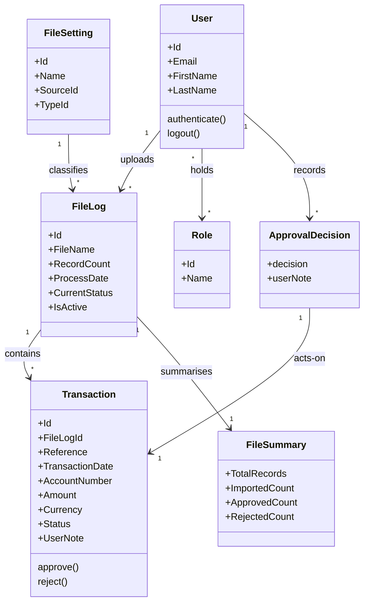

# Requirements: Transaction Import & Approval System [SRC: C-001]

**Domain:** financial transaction management **Target:** application **Created:** 2026-05-26 **Status:** draft **Last finalised at:** —

> **Authoring guardrails.** Cells across §1–§10 must obey:
> - **`GR-20` No stack specifics.** No framework, library, vendor, product, version, or brand name in any cell. Speak in capability categories ("client-side state management", "binary blob storage tier"). Stack picks happen at code-generation time, not here.
> - **`GR-21` No UI layout.** §6.4 / §6.7 / §6.8 / §6.9 cells describe *what UI elements/behaviours must exist*, never *how they are arranged or styled*. Layout, component choice, and visual design are produced by a later UX design step. Exceptions: §5 may name screen-level navigation; §6.5 may describe role-conditional visibility; §8 may quote consultant-supplied layout observations as input citations.
>
> Inferred content is marked inline with one of three markers per the drafter's decision tree (`framework/agents/requirements-drafter.md > Classification`):
> - `[AI-SUGGESTED: AI-NNN | blocking|non-blocking]` — inferred completeness-gating, in-scope value; resolver asks the consultant.
> - `[STANDARD-RULE: GR-NN]` — deterministic answer from `framework/shared/general-rules.md`; resolver skips.
> - `[OUT-OF-SCOPE: domain-default]` — required by template but outside prototype scope per `framework/shared/prototype-scope.md`; emitted under `target = prototype` only; resolver skips, consultant can scan-review.
>
> Citation: input-grounded cells carry a trailing `[SRC: C-NNN]` tag in the draft, backed by `requirements/draft-claims.ndjson`. The merger **retains** `[SRC:]` tags in the final doc (LLM-only audience) and strips all other markers.
>
> Field-level marking when only some sub-fields are inferred; heading-level marking when the whole item is invented. Fill every field — no blanks.

---

## 0.1 Target-mode applicability

> The `target` field on the source manifest is `prototype` or `application`. The drafter picks the matching variant for the rows below at fill-time; the merger does not see both.

| Section | `prototype` | `application` | Mode-conditional? |
| --- | --- | --- | --- |
| §6.10 Consumed backend contracts | fixture references | pointers into the sibling backend requirements document | yes — sub-block content differs |
| §7 Data shapes consumed by FE | shape sourced from fixtures | shape sourced from backend contracts | provenance label only |
| `## Prototype invariants` appendix | appended (PI-01..PI-07) | omitted | yes — merger conditional |
| (all other sections) | identical | identical | no |

---

## 1. Application context

**Name:** Transaction Import & Approval System [SRC: C-001]

**Purpose / business value:** A dual-role system that enables Importers to upload and review transaction files, and Approvers to review, approve/reject, and export transactions. [SRC: C-002]

**Domain:** financial transaction management [AI-SUGGESTED: AI-001 | blocking]

**Business goal:** Provide controlled file-based transaction ingestion with auditable two-person approval to reduce manual processing errors and enforce dual-control over financial postings. [AI-SUGGESTED: AI-002 | non-blocking]

<!-- rev: run-1 2026-05-26 -->

---

## 1.5 Scope

> §1.5 is in-scope-only — unsupplied buckets emit `[AI-SUGGESTED]` under both targets. `[OUT-OF-SCOPE: domain-default]` is **not** valid in this section (the section *defines* scope; OOS would be self-referential).

| Bucket | Items |
| --- | --- |
| In | file-driven ingestion via File Logs [SRC: C-003], transaction lifecycle review and approval [SRC: C-004], role-based interaction constraints [SRC: C-005], search and filter capability over transactions and file logs [SRC: C-006], CSV export of filtered transaction sets [SRC: C-007], file summary view with per-status counts [SRC: C-008] |
| Out | server-side file parsing internals [AI-SUGGESTED: AI-003 | non-blocking], backend identity provider implementation [AI-SUGGESTED: AI-004 | non-blocking] |
| Deferred | bulk file setting configuration UI [AI-SUGGESTED: AI-005 | non-blocking], scheduled / unattended file imports [AI-SUGGESTED: AI-006 | non-blocking] |

<!-- rev: run-1 2026-05-26 -->

---

## 1.6 Assumptions & dependencies

| Kind | Statement | Source |
| --- | --- | --- |
| Abstract service dependency | an identity provider exposing credentials-based login with session-cookie issuance [SRC: C-041] | stated |
| Abstract service dependency | a transaction-management backend exposing file ingestion, transaction CRUD, and approve/reject operations [SRC: C-009] | stated |
| Abstract service dependency | a binary blob storage tier holding uploaded source files retrievable by file log id [SRC: C-010] | stated |
| Persona prerequisite | users have an existing account in the identity provider with at least one assigned role [SRC: C-011] | stated |
| Environment assumption | frontend SPA and backend share an eTLD+1 so SameSite=Strict session cookies are delivered on cross-origin same-site requests [SRC: C-012] | stated |
| Environment assumption | users on modern evergreen browser | inferred |

<!-- rev: run-1 2026-05-26 -->

---

## 1.7 Architectural implications

| Capability category | Driving requirement(s) | Recommendation (optional) |
| --- | --- | --- |
| Client-side state management | → §6.1 F-14 / → §6.1 F-21 / → §10 | |
| Client-side search / filtering | → §6.1 F-21 / → §6.7 RPT-01 | in-memory index acceptable given ≤10⁴ records per file [AI-SUGGESTED: AI-007 | non-blocking] |
| File upload / binary blob handling | → §6.1 F-04 | binary blob storage tier required [AI-SUGGESTED: AI-008 | non-blocking] |
| Export rendering capability | → §6.7 RPT-01 / → §6.1 F-22 | |
| Audit-trail viewer | → §6.9 | |
| Role-conditional rendering | → §6.5 | |

<!-- rev: run-1 2026-05-26 -->

---

## 2. Domain model

> The BA's framing of the business domain in **ubiquitous language**, implementation-free.

### 2.1 Concepts

| Concept          | Persistence | Definition (ubiquitous language)     |
| ---------------- | ----------- | ------------------------------------ |
| File Log [SRC: C-013] | persistent | A record representing an uploaded file and its processing state, anchoring all transactions extracted from that file. [SRC: C-014] |
| Transaction [SRC: C-015] | persistent | An individual financial record extracted from a File Log, carrying a reference, date, account, amount, currency, status, and optional user note. [SRC: C-016] |
| User | persistent | A person authenticated to the system who acts in one or more roles. [SRC: C-017] |
| Role | persistent | A named bundle of access permissions assigned to one or more Users. [AI-SUGGESTED: AI-009 | non-blocking] |
| File Setting | persistent | A named configuration that governs how an uploaded file is interpreted (file type, source, location, target staging table). [SRC: C-018] |
| File Summary | derived | A computed view over a single File Log showing total record count and counts per Transaction status. [SRC: C-019] |
| Approval Decision | policy | A non-persistent business judgement that determines whether a Transaction transitions to Approved or to Rejected with a mandatory note. [SRC: C-020] |

### 2.2 Relationships

- File Log **contains** Transaction [1..*]
- User **uploads** File Log [1..* per Importer User] [SRC: C-021]
- User **approves** Transaction [1..* per Approver User] [SRC: C-022]
- User **rejects** Transaction [1..* per Approver User] [SRC: C-023]
- User **holds** Role [1..* per User] [AI-SUGGESTED: AI-010 | non-blocking]
- File Setting **classifies** File Log [1..* per File Setting] [SRC: C-024]
- File Summary **derives-from** File Log [1..1]

### 2.3 Aggregates & lifecycles

#### File Log

| Field            | Value                                                                                                                              |
| ---------------- | ---------------------------------------------------------------------------------------------------------------------------------- |
| Member concepts  | File Log, Transaction, File Summary [SRC: C-025] |
| Lifecycle states | Uploaded → Processing → Completed → Failed [SRC: C-026] |
| Key invariants   | A File Log cannot transition to Completed while any contained Transaction is still being processed. [AI-SUGGESTED: AI-011 | blocking] |

#### Transaction

| Field            | Value                                                                                                                              |
| ---------------- | ---------------------------------------------------------------------------------------------------------------------------------- |
| Member concepts  | Transaction, Approval Decision |
| Lifecycle states | Imported → Approved; Imported → Rejected [SRC: C-027] |
| Key invariants   | A Transaction cannot be approved or rejected unless its current Status is Imported. [SRC: C-028] |
| Key invariants   | A Rejected Transaction must carry a non-empty user note recorded at the moment of rejection. [SRC: C-029] |

### 2.4 Diagram (optional)

### 2.5 State-transition matrix

> Emitted only when ≥1 §2.3 aggregate has more than two lifecycle states. One sub-block per qualifying aggregate. Pre-condition cells may reference `→ §6.2 BR-NN`.

#### File Log

| From → To                       | Trigger                       | Pre-condition                                  | Visible effect                                                          |
| ------------------------------- | ----------------------------- | ---------------------------------------------- | ----------------------------------------------------------------------- |
| Uploaded → Processing | server begins extracting transactions from the uploaded file [SRC: C-030] | the file has been received by the backend [SRC: C-031] | the File Log row shows status Processing in the file log list [AI-SUGGESTED: AI-012 | non-blocking] |
| Processing → Completed | all transactions extracted and persisted [AI-SUGGESTED: AI-013 | non-blocking] | → §6.2 BR-01 [AI-SUGGESTED: AI-014 | non-blocking] | the File Log row shows status Completed and the file summary becomes available [SRC: C-032] |
| Processing → Failed | extraction encountered an unrecoverable error [SRC: C-033] | → §6.2 BR-02 [AI-SUGGESTED: AI-015 | non-blocking] | the File Log row shows status Failed and a retry-validation action becomes available [SRC: C-034] |

#### Transaction

| From → To                       | Trigger                       | Pre-condition                                  | Visible effect                                                          |
| ------------------------------- | ----------------------------- | ---------------------------------------------- | ----------------------------------------------------------------------- |
| Imported → Approved | Approver invokes the approve action on the transaction [SRC: C-035] | → §6.2 BR-03 | the transaction's status badge updates to Approved and the approve/reject actions disappear from the row [SRC: C-036] |
| Imported → Rejected | Approver invokes the reject action and supplies a user note [SRC: C-037] | → §6.2 BR-04 | the transaction's status badge updates to Rejected, the user note is captured on the transaction, and the approve/reject actions disappear from the row [SRC: C-038] |

<!-- rev: run-1 2026-05-26 -->

---

## 3. Target users

> Target-user personas — the end users of the application being designed. Not to be confused with the Unicorn (LLM) or the Consultant (audience).

### Importer

| Field                  | Value                |
| ---------------------- | -------------------- |
| Role / job title       | Importer [SRC: C-039] |
| Expertise level        | operational user; comfortable selecting and uploading files, reading status indicators, applying search and filter |
| Stakes                 | responsible for getting transaction files into the system correctly so downstream Approver review can begin |
| Frequency of use       | daily during business hours |
| Driving forces — wants | quick visual confirmation that an upload succeeded, fast review of file content, clear search across previously uploaded files [SRC: C-040] |
| Driving forces — fears | uploading the wrong file, losing track of which files have been processed, having an upload silently fail |

### Approver

| Field                  | Value                |
| ---------------------- | -------------------- |
| Role / job title       | Approver [SRC: C-041] |
| Expertise level        | financially literate reviewer; comfortable interpreting amounts, currencies, references, and applying judgement under audit |
| Stakes                 | accountable for the correctness of every transaction posted; their approval is the gate before downstream processing [SRC: C-042] |
| Frequency of use       | daily during business hours |
| Driving forces — wants | clear visibility into which transactions are awaiting decision, the ability to drill into supporting information, fast bulk filter and export [SRC: C-043] |
| Driving forces — fears | approving a wrong transaction, rejecting without a captured reason, missing a transaction that should have been actioned |

<!-- rev: run-1 2026-05-26 -->

---

## 4. User goals & stories

> Quality signals live on the goal (outcome-level), not the story (behaviour-level).

### 4.1 Goals catalogue

| ID | Goal statement | Quality signals | Goal kind | Layout pref (optional) | UX-pattern pref (optional) |
| --- | --- | --- | --- | --- | --- |
| G-01 | Successfully import transaction files for downstream approval [SRC: C-044] | uploads visibly succeed; record counts match expectation; processing status is observable [AI-SUGGESTED: AI-016 | non-blocking] | top-level | — | — |
| G-02 | Maintain control over which transactions are approved and which are rejected with reason [SRC: C-045] | each transaction has a deliberate decision; rejected transactions carry a captured reason; status changes are immediate [AI-SUGGESTED: AI-017 | non-blocking] | top-level | — | — |
| G-03 | Provide visibility into file processing status and per-file outcomes [SRC: C-046] | file status is always visible; per-status counts are derivable from the file summary view [SRC: C-047] | sub-level | — | — |
| G-04 | Export decided transactions for downstream processing and reconciliation [SRC: C-048] | the export reflects the user's active filter set; the exported file is in CSV format by default [SRC: C-049] | sub-level | — | — |
| G-05 | Locate specific transactions and files quickly across the working set [SRC: C-006] | filter and search return results within a perceptibly short time; active filters are visible [AI-SUGGESTED: AI-018 | non-blocking] | interaction-level | — | — |

### 4.2 Stories by persona

#### Importer

##### Story: As an Importer, I want to upload a transaction file, so that its records become available for Approver review

| Field                                    | Value                                                                                      |
| ---------------------------------------- | ------------------------------------------------------------------------------------------ |
| Goal                                     | → §4.1 G-01                                                                            |
| Objective                                | Successfully transmit a chosen file to the system along with its file setting context so the system can create the corresponding File Log. [SRC: C-050] |
| Context (frequency / expertise / stakes) | daily; operational user; high stakes when wrong file uploaded |
| Linked task flow (optional)              | → §5 Flow: File Upload                                                                 |
| Acceptance criteria                      | Given the Importer has selected a file and supplied FileSettingId, FileSettingName, and FileName, when they submit, then a File Log is created and the upload screen surfaces either a success confirmation or a failure message naming the cause. [SRC: C-051] |

##### Story: As an Importer, I want to view the file log overview, so that I can confirm which uploads have been processed

| Field                                    | Value                                                                                      |
| ---------------------------------------- | ------------------------------------------------------------------------------------------ |
| Goal                                     | → §4.1 G-03                                                                            |
| Objective                                | Inspect the table of uploaded files, their record counts, process dates, and current statuses. [SRC: C-052] |
| Context (frequency / expertise / stakes) | daily; operational user |
| Linked task flow (optional)              | → §5 Flow: File Log Overview                                                                  |
| Acceptance criteria                      | Given the Importer has been authenticated, when they open the file log overview, then they see a list of File Logs with File Name, Process Date, Record Count, and Status, and selecting a row drills into the contained transactions. [SRC: C-053] |

##### Story: As an Importer, I want to search and filter file logs and transactions, so that I can find a specific file or record quickly

| Field                                    | Value                                                                                      |
| ---------------------------------------- | ------------------------------------------------------------------------------------------ |
| Goal                                     | → §4.1 G-05                                                                            |
| Objective                                | Narrow the visible set of file logs and transactions to those matching status, file, date range, amount range, or free-text reference / account input. [SRC: C-054] |
| Context (frequency / expertise / stakes) | daily; operational user |
| Linked task flow (optional)              | → §5 Flow: Search and Filter                                                                  |
| Acceptance criteria                      | Given the Importer has applied one or more filter dimensions, when the filter set changes, then the visible result set updates and the active filter set is observable in the UI. [STANDARD-RULE: GR-09] |

##### Story: As an Importer, I want to view the file summary, so that I can confirm the record counts per status

| Field                                    | Value                                                                                      |
| ---------------------------------------- | ------------------------------------------------------------------------------------------ |
| Goal                                     | → §4.1 G-03                                                                            |
| Objective                                | Read the derived summary for a single File Log showing total records and counts by transaction status. [SRC: C-055] |
| Context (frequency / expertise / stakes) | daily |
| Linked task flow (optional)              | → §5 Flow: File Summary View                                                                  |
| Acceptance criteria                      | Given the Importer has selected a File Log, when they open its file summary, then they see Total records, Imported count, Approved count, and Rejected count. [SRC: C-056] |

#### Approver

##### Story: As an Approver, I want to view transactions awaiting decision, so that I can begin processing them

| Field                                    | Value                                                                                      |
| ---------------------------------------- | ------------------------------------------------------------------------------------------ |
| Goal                                     | → §4.1 G-02                                                                            |
| Objective                                | Inspect the working list of transactions and identify those whose status is still Imported. [SRC: C-057] |
| Context (frequency / expertise / stakes) | daily; financially literate reviewer; high stakes |
| Linked task flow (optional)              | → §5 Flow: Transaction Review                                                                 |
| Acceptance criteria                      | Given the Approver has been authenticated, when they open the transactions screen, then they see a list of Transactions with Reference, Date, Account, Amount, Currency, and Status, with row-level approve and reject actions available where the status is Imported. [SRC: C-058] |

##### Story: As an Approver, I want to approve a transaction, so that the system records my acceptance of it

| Field                                    | Value                                                                                      |
| ---------------------------------------- | ------------------------------------------------------------------------------------------ |
| Goal                                     | → §4.1 G-02                                                                            |
| Objective                                | Move a specific Imported transaction to Approved status with a confirmed deliberate action. [SRC: C-059] |
| Context (frequency / expertise / stakes) | daily; high stakes |
| Linked task flow (optional)              | → §5 Flow: Approve Transaction                                                                |
| Acceptance criteria                      | Given the Approver has selected a transaction with Status = Imported, when they invoke the approve action and confirm, then the transaction's Status transitions to Approved and the approve/reject actions are no longer available on that row. [STANDARD-RULE: GR-04] |

##### Story: As an Approver, I want to reject a transaction with a captured reason, so that the rejection is auditable

| Field                                    | Value                                                                                      |
| ---------------------------------------- | ------------------------------------------------------------------------------------------ |
| Goal                                     | → §4.1 G-02                                                                            |
| Objective                                | Move a specific Imported transaction to Rejected status and persist the supplied user note. [SRC: C-060] |
| Context (frequency / expertise / stakes) | daily; high stakes |
| Linked task flow (optional)              | → §5 Flow: Reject Transaction                                                                 |
| Acceptance criteria                      | Given the Approver has selected a transaction with Status = Imported, when they invoke the reject action and supply a mandatory user note, then the transaction's Status transitions to Rejected, the user note is persisted on the transaction, and the action submission cannot complete without a non-empty note. [SRC: C-061] |

##### Story: As an Approver, I want to export the filtered transaction set as a CSV, so that I can hand it to downstream reconciliation

| Field                                    | Value                                                                                      |
| ---------------------------------------- | ------------------------------------------------------------------------------------------ |
| Goal                                     | → §4.1 G-04                                                                            |
| Objective                                | Produce a CSV file containing the transactions currently visible under the Approver's active filter set. [SRC: C-049] |
| Context (frequency / expertise / stakes) | daily; financially literate |
| Linked task flow (optional)              | → §5 Flow: Export Transactions                                                                |
| Acceptance criteria                      | Given the Approver has applied a filter set to the transactions list, when they invoke export, then a CSV file is produced containing exactly the visible filtered rows and the default format is CSV. [SRC: C-062] |

##### Story: As an Approver, I want to search and filter transactions across all files, so that I can decide on a specific transaction quickly

| Field                                    | Value                                                                                      |
| ---------------------------------------- | ------------------------------------------------------------------------------------------ |
| Goal                                     | → §4.1 G-05                                                                            |
| Objective                                | Narrow the visible set of transactions by status, file, date range, amount range, or free-text on reference and account. [SRC: C-054] |
| Context (frequency / expertise / stakes) | daily |
| Linked task flow (optional)              | → §5 Flow: Search and Filter                                                                  |
| Acceptance criteria                      | Given the Approver has applied one or more filter dimensions, when the filter set changes, then the visible result set updates and the active filter set is observable in the UI. [STANDARD-RULE: GR-09] |

---

## 5. Task flows

### Flow: Authentication

| Field                      | Value                                                        |
| -------------------------- | ------------------------------------------------------------ |
| Actor                      | → §3 Importer or Approver                                        |
| Trigger                    | the user opens the application and is not yet authenticated [SRC: C-063] |
| Steps                      | (user enters email and password; the login form indicates the input is accepted) → (the user submits credentials; on success they are routed to their role-specific landing page; on failure the form displays a generic credentials-incorrect error message) [SRC: C-064] |
| Decision points            | success vs failure of credential validation [SRC: C-064] |
| Exception paths            | {invalid credentials → generic incorrect-credentials banner → re-enter credentials} [SRC: C-065]; {unexpected server error → top-of-form banner with retry → user retries} |
| Role-conditional behaviour | the landing page differs by role: Importer lands on the Dashboard with the upload affordance available; Approver lands on the Dashboard without the upload affordance [SRC: C-066] |

### Flow: File Upload

| Field                      | Value                                                        |
| -------------------------- | ------------------------------------------------------------ |
| Actor                      | → §3 Importer                                        |
| Trigger                    | the Importer chooses to upload a transaction file [SRC: C-067] |
| Steps                      | (Importer selects the file via the upload affordance; the file name appears as selected) → (Importer supplies FileSettingId, FileSettingName, and FileName; the form indicates the values are accepted) → (Importer submits the upload; the system creates a File Log and the UI shows status; on completion the upload screen surfaces a success confirmation or a failure message) [SRC: C-068] |
| Decision points            | upload success vs upload failure [SRC: C-069] |
| Exception paths            | {upload failure → failure feedback message → Importer reviews and retries} [SRC: C-069]; {network interruption mid-upload → resumable retry affordance → Importer retries the upload} |
| Role-conditional behaviour | only Importers see the upload affordance; Approvers do not [SRC: C-070] |

### Flow: File Log Overview

| Field                      | Value                                                        |
| -------------------------- | ------------------------------------------------------------ |
| Actor                      | → §3 Importer or Approver                                        |
| Trigger                    | the user opens the Dashboard [SRC: C-071] |
| Steps                      | (user opens the file log overview; the system shows a list of uploaded File Logs with File Name, Process Date, Record Count, and Status) → (user selects a row; the system drills into that File Log's contained transactions) [SRC: C-072] |
| Decision points            | which File Log to drill into [SRC: C-073] |
| Exception paths            | {no File Logs present → empty state copy naming File Logs and offering an upload CTA (Importer only) → user uploads a file or signals readiness to wait} [STANDARD-RULE: GR-08]; {a File Log is in Failed state → row visually marks the failure and offers a retry-validation action → user retries validation or cancels the file} [SRC: C-074] |
| Role-conditional behaviour | upload CTA in the empty state is shown only to Importers [SRC: C-070] |

### Flow: Transaction Review

| Field                      | Value                                                        |
| -------------------------- | ------------------------------------------------------------ |
| Actor                      | → §3 Importer or Approver                                        |
| Trigger                    | the user opens the Transactions screen [SRC: C-075] |
| Steps                      | (user opens the transaction table; the system shows a list with Reference, Date, Account, Amount, Currency, and Status) → (Approver only: user identifies an Imported transaction and uses the row-level approve or reject action; the row's available actions match the Status) [SRC: C-076] |
| Decision points            | which transaction to action; approve vs reject [SRC: C-077] |
| Exception paths            | {no transactions match the active filter → empty-results copy referencing the filter, with an action to clear filters → user clears or adjusts filters} [STANDARD-RULE: GR-09] |
| Role-conditional behaviour | row-level approve and reject actions are visible only to Approvers; Importers see the same list without those actions [SRC: C-078] |

### Flow: Approve Transaction

| Field                      | Value                                                        |
| -------------------------- | ------------------------------------------------------------ |
| Actor                      | → §3 Approver                                        |
| Trigger                    | the Approver selects a Transaction with Status = Imported and chooses approve [SRC: C-079] |
| Steps                      | (Approver chooses approve on the row; a confirmation appears) → (Approver confirms; the system transitions the transaction's Status to Approved and the row's approve/reject actions are no longer available) [SRC: C-080] |
| Decision points            | confirm vs cancel [STANDARD-RULE: GR-04] |
| Exception paths            | {transaction is no longer in Imported state when confirm is invoked → inline message that the action is no longer applicable → user re-opens the transaction or applies a different filter} [AI-SUGGESTED: AI-019 | blocking] |
| Role-conditional behaviour | only Approvers see the approve action [SRC: C-009] |

### Flow: Reject Transaction

| Field                      | Value                                                        |
| -------------------------- | ------------------------------------------------------------ |
| Actor                      | → §3 Approver                                        |
| Trigger                    | the Approver selects a Transaction with Status = Imported and chooses reject [SRC: C-081] |
| Steps                      | (Approver chooses reject on the row; a reject form appears requiring a mandatory user note) → (Approver enters the note and submits; submission is prevented when the note is empty) → (the system transitions the transaction's Status to Rejected and persists the user note; the row's approve/reject actions are no longer available) [SRC: C-082] |
| Decision points            | submit with note vs cancel; note empty vs non-empty [SRC: C-083] |
| Exception paths            | {note is empty → inline required-field error message → user enters a non-empty note} [STANDARD-RULE: GR-06]; {transaction is no longer in Imported state when submit is invoked → inline message that the action is no longer applicable → user re-opens the transaction or applies a different filter} [AI-SUGGESTED: AI-020 | blocking] |
| Role-conditional behaviour | only Approvers see the reject action [SRC: C-009] |

### Flow: Export Transactions

| Field                      | Value                                                        |
| -------------------------- | ------------------------------------------------------------ |
| Actor                      | → §3 Approver                                        |
| Trigger                    | the Approver chooses to export the currently filtered transaction set [SRC: C-084] |
| Steps                      | (Approver applies a filter set to the transaction list; the filter set is observable in the UI) → (Approver invokes export; the system produces a CSV file containing exactly the visible filtered rows) [SRC: C-085] |
| Decision points            | which filters to apply before exporting |
| Exception paths            | {filter set yields zero rows → empty-results message and the export action is disabled → user clears or adjusts filters} [STANDARD-RULE: GR-09] |
| Role-conditional behaviour | only Approvers see the export action [SRC: C-086] |

### Flow: File Summary View

| Field                      | Value                                                        |
| -------------------------- | ------------------------------------------------------------ |
| Actor                      | → §3 Importer or Approver                                        |
| Trigger                    | the user opens the file summary for a specific File Log [SRC: C-087] |
| Steps                      | (user selects a File Log; the system shows the derived File Summary with Total records, Imported count, Approved count, Rejected count) [SRC: C-056] |
| Decision points            | none |
| Exception paths            | {File Log has zero transactions extracted → empty-state copy with the File Log's status and any available retry action → user retries validation or cancels} [STANDARD-RULE: GR-08] |
| Role-conditional behaviour | both roles see the summary [SRC: C-088] |

### Flow: Search and Filter

| Field                      | Value                                                        |
| -------------------------- | ------------------------------------------------------------ |
| Actor                      | → §3 Importer or Approver                                        |
| Trigger                    | the user opens the transactions screen or the file logs screen [SRC: C-089] |
| Steps                      | (user opens the search and filter controls; the controls show the available dimensions: status, file, date range, amount range, free-text on reference and account) → (user applies one or more filters; the active filter set is observable in the UI) → (the visible list updates to match the filter set) [SRC: C-054] |
| Decision points            | which filter dimensions to apply [SRC: C-054] |
| Exception paths            | {no results → empty-results copy with the active filters visible and a clear-all action → user clears or adjusts filters} [STANDARD-RULE: GR-09] |
| Role-conditional behaviour | both roles can search and filter on both surfaces [SRC: C-006] |

---

## 6. Requirements

### 6.1 Functional

| ID       | Statement              | Acceptance criteria                                                       | Source                                |
| -------- | ---------------------- | ------------------------------------------------------------------------- | ------------------------------------- |
| F-01 | The system authenticates a user via email and password and returns a session indicator. [SRC: C-090] | Given valid credentials, when the user submits the login form, then a successful authentication is acknowledged and the user is routed to a role-specific landing; on failure, a generic credentials-incorrect message is shown. [SRC: C-091] | stated / → §5 Flow: Authentication |
| F-02 | The system signs the user out and invalidates the active session. [SRC: C-092] | Given the user is signed in, when they invoke logout, then the active session is invalidated and the user is returned to the login surface. [AI-SUGGESTED: AI-021 | non-blocking] | stated / → §6.10 |
| F-03 | The system returns the authenticated user's profile (identity and roles). [SRC: C-093] | Given a valid session, when the application requests user information, then the authenticated user's identity and assigned roles are returned and rendered in the application chrome. [SRC: C-094] | stated / → §6.10 |
| F-04 | The system accepts a transaction file upload with FileSettingId, FileSettingName, and FileName. [SRC: C-068] | Given an Importer has selected a file and supplied the three parameters, when they submit, then the system records the upload as a File Log and returns success or failure feedback. [SRC: C-051] | stated / → §5 Flow: File Upload |
| F-05 | The system lists File Logs, filterable by IsActive. [SRC: C-095] | Given the user requests the file log overview with an IsActive value, when the list is requested, then the system returns File Logs matching the active filter and the UI renders File Name, Process Date, Record Count, and Status per row. [SRC: C-052] | stated / → §6.10 |
| F-06 | The system retrieves per-File-Log process log entries for a specific LogId. [SRC: C-096] | Given the user opens process detail for a specific File Log, when the entries are requested, then the system returns the activity history for that File Log. [AI-SUGGESTED: AI-022 | non-blocking] | stated / → §6.10 |
| F-07 | The system supports downloading the parsed data file for a File Log by LogId. [SRC: C-097] | Given the user requests the parsed data file for a File Log, when the request is invoked, then the file content is returned as a binary stream. [AI-SUGGESTED: AI-023 | non-blocking] | stated / → §6.10 |
| F-08 | The system supports downloading the original uploaded file for a File Log by FileLogId. [SRC: C-098] | Given the user requests the original uploaded file, when the request is invoked, then the file content is returned as a binary stream. [AI-SUGGESTED: AI-024 | non-blocking] | stated / → §6.10 |
| F-09 | The system supports downloading a bulk-error file for a File Log when one exists. [SRC: C-099] | Given a File Log indicates an available bulk-error file, when the user requests the bulk-error file, then the file content is returned as a binary stream and the download action is only offered when an error file exists. [SRC: C-100] | stated / → §6.10 |
| F-10 | The system supports cancelling and deactivating a File Log by LogId. [SRC: C-101] | Given the user invokes cancel on a File Log, when the action is confirmed, then the File Log is deactivated and removed from the active list. [SRC: C-102] | stated / → §6.10 |
| F-11 | The system supports retrying validation for a File Log in a failed state. [SRC: C-053] | Given a File Log is in Failed state, when the user invokes retry-validation, then validation is re-attempted and the File Log's status updates accordingly. [SRC: C-034] | stated / → §5 Flow: File Log Overview |
| F-12 | The system returns the column definitions for the validation-error view of a File Log. [SRC: C-103] | Given the user opens the validation errors for a File Log, when the column definitions are requested, then the UI renders the columns named by the system for that file. [SRC: C-104] | stated / → §6.10 |
| F-13 | The system returns the per-row validation errors for a File Log as a single JSON array string. [SRC: C-105] | Given the user opens the validation errors for a File Log, when the per-row errors are requested, then the UI renders the listed error rows. [SRC: C-106] | stated / → §6.10 |
| F-14 | The system lists Transactions with Reference, Date, Account, Amount, Currency, Status, and UserNote. [SRC: C-107] | Given an authenticated user opens the transactions screen, when the list is requested, then the listed rows show those fields and row-level approve/reject actions are available only to Approvers and only when the Status is Imported. [SRC: C-058] | stated / → §5 Flow: Transaction Review |
| F-15 | The system approves a Transaction by Id, transitioning its Status to Approved. [SRC: C-108] | Given an Approver invokes approve on a Transaction whose Status is Imported, when the action is confirmed, then the Transaction's Status transitions to Approved and the row's approve/reject actions are removed. [STANDARD-RULE: GR-04] | stated / → §5 Flow: Approve Transaction |
| F-16 | The system rejects a Transaction by Id with a captured user note, transitioning its Status to Rejected. [SRC: C-109] | Given an Approver invokes reject on a Transaction whose Status is Imported and supplies a non-empty user note, when submission is confirmed, then the Transaction's Status transitions to Rejected, the user note is persisted on the Transaction, and submission is prevented if the note is empty. [SRC: C-061] | stated / → §5 Flow: Reject Transaction |
| F-17 | The system lists, creates, updates, and deletes Users (administrative scope). [SRC: C-110] | Given an administrator invokes user-management operations, when each operation is submitted, then the system reflects the resulting User set and the operating user's identity is recorded on each change. [AI-SUGGESTED: AI-025 | non-blocking] | stated / → §6.10 |
| F-18 | The system lists, creates, updates, and deletes Roles, including Role-to-Page assignment (administrative scope). [SRC: C-111] | Given an administrator invokes role-management operations, when each operation is submitted, then the system reflects the resulting Role set and Page assignments. [AI-SUGGESTED: AI-026 | non-blocking] | stated / → §6.10 |
| F-19 | The system lists Pages available for assignment to Roles (administrative scope). [SRC: C-112] | Given an administrator opens role-to-page assignment, when Pages are requested, then the system returns the catalogue of assignable Pages. | stated / → §6.10 |
| F-20 | The system lists File Settings, File Sources, File Types, File Location Types, File Locations, Process Definitions, Bulk File Setting Databases, and Bulk File Settings (administrative scope). | Given an administrator opens the file-settings management surface, when each catalogue is requested, then the system returns the corresponding list and each editable record is updatable in place. | stated / → §6.10 |
| F-21 | The system filters and searches transactions by Status, File, Date range, Amount range, and free-text on Reference or Account. | Given the user has applied one or more filter dimensions, when the filter set changes, then the visible result set updates and the active filter set remains observable in the UI. | stated / → §5 Flow: Search and Filter |
| F-22 | The system exports the currently filtered set of Transactions as a CSV file with the default file format being CSV. | Given the user has applied a filter set, when they invoke export, then a CSV file containing exactly the visible filtered rows is produced and offered as a download. | stated / → §5 Flow: Export Transactions |

### 6.2 Business rules

| ID | Statement (when / then) | Enforcement point | Acceptance criteria | Source | Severity |
| --- | --- | --- | --- | --- | --- |
| BR-01 | When a File Log's contained transactions have all been extracted and persisted, then the File Log's status transitions to Completed and the File Summary becomes available. | service | Given a File Log whose extraction completes, when the system finalises extraction, then the file log overview displays Completed and the file summary is openable. | → §2.3 File Log | major |
| BR-02 | When extraction for a File Log fails for any reason, then the File Log's status transitions to Failed and a retry-validation action becomes available. | service | Given a File Log whose extraction fails, when the failure is recorded, then the file log overview displays Failed and the retry-validation action is offered for that row. | → §2.3 File Log / → §6.1 F-11 | major |
| BR-03 | When an Approver invokes approve on a Transaction whose current Status is Imported, then the Transaction's Status transitions to Approved. | cross-layer | Given a Transaction with Status = Imported, when an Approver confirms the approve action, then the Transaction's Status transitions to Approved and approve/reject actions are no longer available on that row. | → §2.3 Transaction / → §6.1 F-15 | blocker |
| BR-04 | When an Approver invokes reject on a Transaction whose current Status is Imported and supplies a non-empty user note, then the Transaction's Status transitions to Rejected and the user note is persisted on the Transaction. | cross-layer | Given a Transaction with Status = Imported and a non-empty user note, when an Approver confirms the reject action, then the Transaction's Status transitions to Rejected, the user note is stored, and submission is prevented when the user note is empty. | → §2.3 Transaction / → §6.1 F-16 | blocker |
| BR-05 | When a Transaction's Status is not Imported, then approve and reject actions must be unavailable on that row. | UI | Given a Transaction whose Status is not Imported, when the user views the row, then the approve and reject row actions are not rendered and direct invocation of either action is refused. | → §6.1 F-14 / consultant input | blocker |
| BR-06 | When a user submits the reject action without a user note, then the submission must be prevented and the user must be informed that the note is required. | UI | Given the reject form is open without a user note, when the user submits, then the submission is blocked and an inline required-field error message names the user-note field as required. | → §6.1 F-16 | blocker |
| BR-07 | When a user is not an Approver, then approve and reject actions on transactions must be hidden in the UI. | UI | Given a non-Approver user viewing a Transaction row, when the row is rendered, then approve and reject actions are not present in the row's action set. | → §6.5 / consultant input | blocker |
| BR-08 | When a user is not an Importer, then the upload action and the upload navigation entry must be hidden. | UI | Given a non-Importer user viewing the Dashboard, when the navigation is rendered, then the upload entry and any upload affordance are not present. | → §6.5 / consultant input | blocker |
| BR-09 | When credential validation fails on login, then the login surface must display a generic credentials-incorrect message that does not reveal which field was incorrect. | UI | Given an invalid login attempt, when the failure is returned, then the login surface shows a generic incorrect-credentials message and does not distinguish between username and password errors. | → §6.1 F-01 | major |
| BR-10 | When an export is invoked, then exactly the currently filtered visible rows must be exported in CSV format. | cross-layer | Given a filtered transaction list, when the user invokes export, then the produced CSV contains the visible rows and no others. | → §6.1 F-22 / → §5 Flow: Export Transactions | major |

### 6.3 Validation rules

> Field-level validation surfaced to the user as inline UI feedback (required-field markers, format hints, range/length errors). Validation timing follows `GR-05`. Backend enforcement of business invariants belongs to §6.2 BR-NN and the sibling backend doc; this section captures the *visible* validation surface only.

| Field (→ §7)              | Validation type                                                                | Rule                          | Error message              |
| ------------------------- | ------------------------------------------------------------------------------ | ----------------------------- | -------------------------- |
| LoginRequest.Username | required | Username must be supplied. | "Username and password are required." [SRC: C-113] |
| LoginRequest.Password | required | Password must be supplied. | "Username and password are required." [SRC: C-113] |
| FileUpload.FileSettingId | required | An associated File Setting must be selected. [SRC: C-114] | "Please choose a file setting before uploading." |
| FileUpload.FileSettingName | required | A File Setting name must be supplied for the upload. [SRC: C-114] | "Please choose a file setting before uploading." |
| FileUpload.FileName | required | A file must be selected before upload can proceed. [SRC: C-114] | "Please choose a file to upload." |
| TransactionRejectWrite.UserNote | required | → §6.2 BR-06 — a non-empty user note is required when rejecting. [SRC: C-115] | "A note is required to reject this transaction." |
| Transaction.Reference | format | Must follow the file's reference format (alphanumeric with hyphens). [STANDARD-RULE: GR-05] | "Reference format is not recognised." [STANDARD-RULE: GR-05] |
| Transaction.Amount | range | Amount must be a numeric value with at most two decimal places. [STANDARD-RULE: GR-05] | "Amount must be a numeric value." [STANDARD-RULE: GR-05] |
| Transaction.Currency | enum | Currency must be one of the configured ISO-4217 codes (e.g. ZAR). [SRC: C-117] | "Currency code not recognised." [STANDARD-RULE: GR-05] |

### 6.4 UI feature needs

> *What UI elements and behaviours the FE must provide.* Never layout, position, framework, component name, or visual design (`GR-21`). Phrase behaviourally ("user can filter by status", "save action is available"); do not phrase visually ("filter chips in the toolbar"). UI feature rows resolved deterministically by `GR-05..GR-18` carry `[STANDARD-RULE: GR-NN]`.

| ID | Feature need | Linked (G / story / BR) | Acceptance criteria |
| --- | --- | --- | --- |
| UI-01 | The user can drag-and-drop or select a file to upload, supplying File Setting context and File Name. [SRC: C-068] | → §4.2 Story: Importer Upload / → §6.1 F-04 | The upload surface accepts a single file at a time, the chosen file's name is shown back to the user, and the user is informed of upload progress and outcome. [SRC: C-118] |
| UI-02 | The user can view a list of uploaded files with File Name, Process Date, Record Count, and Status. [SRC: C-052] | → §4.2 Story: Importer File Log Overview / → §6.1 F-05 | The list always presents the four fields; selecting an entry drills into that file's transactions. [SRC: C-053] |
| UI-03 | The user can drill into a File Log to view its contained transactions. [SRC: C-025] | → §5 Flow: File Log Overview | Selecting a File Log entry navigates the user to the transactions screen filtered to that file. [STANDARD-RULE: GR-12] |
| UI-04 | The user can view transactions as a sortable, filterable list showing Reference, Date, Account, Amount, Currency, and Status. [SRC: C-107] | → §4.2 Story: Approver Transaction Review / → §6.1 F-14 | All listed fields are sortable; sorting is single-field; active sort is observable and persists for the session. [STANDARD-RULE: GR-12] |
| UI-05 | The Approver can invoke approve or reject on a transaction when the status is Imported. [SRC: C-058] | → §4.2 Story: Approver Approve / → §6.1 F-15 / → §6.1 F-16 | Approve and reject are visible only when Status = Imported; both invoke a confirmation gate; reject requires a non-empty user note. [STANDARD-RULE: GR-04] |
| UI-06 | The user can apply filters across status, file, date range, amount range, and free-text search on Reference or Account. [SRC: C-054] | → §4.2 Story: Search and Filter / → §6.1 F-21 | Active filters are observable and removable individually; clearing all filters returns the unfiltered view. [STANDARD-RULE: GR-09] |
| UI-07 | The Approver can export the currently filtered transaction set as a CSV file. [SRC: C-085] | → §4.2 Story: Approver Export / → §6.1 F-22 | The export action is offered only to Approvers; the produced CSV contains exactly the visible filtered rows; the default format is CSV. [SRC: C-049] |
| UI-08 | The user can view a file summary with Total records and counts by Imported / Approved / Rejected. [SRC: C-056] | → §4.2 Story: Importer File Summary / → §6.1 F-05 | The summary view is accessible from a File Log and shows the four counts; counts update as transactions are decided. [SRC: C-119] |
| UI-09 | Status changes on a transaction reflect immediately on the actioned transaction in the list. [SRC: C-120] | → §6.2 BR-03 / → §6.2 BR-04 | Approving or rejecting updates the actioned transaction's status badge and removes the approve/reject actions in the same interaction; no full-page reload is required. [SRC: C-120] |
| UI-10 | The login surface presents email + password inputs and a single submit affordance. [SRC: C-091] | → §4.2 Story: Authentication / → §6.1 F-01 | On success, the user is routed to their role-specific landing; on failure, a generic credentials-incorrect message is shown. [SRC: C-091] |
| UI-11 | The application chrome shows the authenticated user's name and offers a logout affordance. [SRC: C-094] | → §6.1 F-03 / → §6.1 F-02 | The chrome reflects the authenticated user; invoking logout invalidates the session and returns the user to the login surface. [AI-SUGGESTED: AI-027 | non-blocking] |
| UI-12 | The pagination affordance is always rendered on transaction and file-log lists with rows-per-page selector. [STANDARD-RULE: GR-11] | → §6.1 F-14 / → §6.1 F-05 | Rows-per-page offers 5, 10, 20, 50 with 20 as the default; navigation controls are visible even when only one page exists. [STANDARD-RULE: GR-11] |
| UI-13 | Required fields are marked with a leading asterisk and an explanatory legend. [STANDARD-RULE: GR-06] | → §6.3 | Required-field markers are present on the login form and the reject-with-note form. [STANDARD-RULE: GR-06] |
| UI-14 | Status badges use the standard intent-to-colour mapping with paired icon or text label. [STANDARD-RULE: GR-16] | → §6.1 F-14 / → §6.1 F-05 | Imported → blue/info; Approved → green/success; Rejected → red/error; never colour-only. [STANDARD-RULE: GR-16] |
| UI-15 | Icon-only per-transaction actions expose a hover-and-focus textual label and `aria-label` matching the action name; primary destructive actions are not icon-only. [STANDARD-RULE: GR-17] | → §6.1 F-15 / → §6.1 F-16 | Approve and reject per-transaction controls expose a textual label on hover and focus via `aria-label`; destructive actions are not represented as icon-only controls. [STANDARD-RULE: GR-17] |
| UI-16 | Empty states name the entity ("No files yet", "No transactions yet") and offer the appropriate creation CTA when permitted. [STANDARD-RULE: GR-08] | → §5 Flow: File Log Overview / → §5 Flow: Transaction Review | Each empty state surfaces a specific copy; zero-results-from-filter shows the active filter chips and a clear-all action instead. [STANDARD-RULE: GR-09] |

#### 6.4.5 Edge, empty & error states

> The UI behaviour the user sees in non-happy-path states. Captures empty datasets, partial loads, transient errors, offline degradation, loading affordances, and permission-denied surfaces. Behavioural phrasing only (`GR-21` — describe what the user sees and can do, not where it sits on screen).

| Surface (→ story / flow / UI-NN) | Condition                                                                | Expected UI behaviour                                          | Recovery action                       |
| -------------------------------- | ------------------------------------------------------------------------ | -------------------------------------------------------------- | ------------------------------------- |
| → UI-02                  | empty  | Empty-state copy reads "No files uploaded yet" and presents the upload CTA to Importers only. [STANDARD-RULE: GR-08] | Importer uploads a file; Approver waits or contacts an Importer. [STANDARD-RULE: GR-08] |
| → UI-04                  | empty | Empty-state copy reads "No transactions yet" with no action. [STANDARD-RULE: GR-08] | User waits for an Importer to upload a file. [STANDARD-RULE: GR-08] |
| → UI-06                  | empty | Empty-results copy references the active filter and offers a clear-all action; no creation CTA. [STANDARD-RULE: GR-09] | User clears or adjusts filters. [STANDARD-RULE: GR-09] |
| → UI-04                  | loading | A skeleton matching the list is shown for the 300 ms–3 s range; a still-loading message is added beyond 3 s. [STANDARD-RULE: GR-10] | User waits; manual retry not required. [STANDARD-RULE: GR-10] |
| → UI-01                  | error | Upload failure surfaces a feedback message naming the cause and offers a retry. [SRC: C-069] | User retries the upload. [SRC: C-069] |
| → UI-05                  | permission-denied | Approve and reject actions are hidden from non-Approvers; the transaction entry reads cleanly without disabled controls. [STANDARD-RULE: GR-01] | None — the action is not offered. [STANDARD-RULE: GR-01] |
| → UI-01                  | permission-denied | Upload affordance and navigation entry are hidden from non-Importers. [STANDARD-RULE: GR-01] | None — the action is not offered. [STANDARD-RULE: GR-01] |
| → UI-02                  | error | A File Log in Failed state shows the failure badge and offers retry-validation and cancel actions on that file entry. [SRC: C-074] | User retries validation or cancels the File Log. [SRC: C-034] |
| → UI-07                  | error | Export failure surfaces an actionable error message; the action remains invokable. [AI-SUGGESTED: AI-028 | non-blocking] | User retries the export. [AI-SUGGESTED: AI-029 | non-blocking] |
| → §5 Flow: Authentication | error | Login failure surfaces a generic incorrect-credentials message that does not reveal which field was incorrect. [SRC: C-091] | User re-enters credentials. [STANDARD-RULE: GR-09] |

### 6.5 Access control (RBAC)

> Roles-×-resources matrix. Cell values use the action vocabulary below; blanks mean "no access".

**Action vocabulary:** `C` create · `R` read · `U` update · `D` delete · `X` execute / invoke · `A` approve · `—` no access. Suffix with a BR ref for conditional access (e.g. `U†BR-07` = update gated by BR-07).

| Role (→ §3) | User | Role | FileLog | Transaction | FileSetting | Authentication | FileUpload | FileLogOverview | TransactionReview | ApproveTransaction | RejectTransaction | ExportTransactions | FileSummaryView | SearchAndFilter |
| --- | --- | --- | --- | --- | --- | --- | --- | --- | --- | --- | --- | --- | --- | --- |
| Importer | R | — | R | R | R | X | X | X | R | — | — | — | X | X |
| Approver | R | — | R | R†BR-05 | R | X | — | X | R | A | A | X | X | X |

### 6.6 Non-functional (FE-only)

> Frontend NFRs only. Backend availability / throughput / persistence concerns live in the sibling backend requirements doc. Inferred values carry `[AI-SUGGESTED]`.

#### 6.6.1 Session UX

| Field                    | Value                                                                             | Source            |
| ------------------------ | --------------------------------------------------------------------------------- | ----------------- |
| Idle session timeout     | 15 minutes [STANDARD-RULE: GR-19] | inferred (financial domain) |
| Absolute session timeout | 8 hours [STANDARD-RULE: GR-19] | inferred (financial domain) |
| Idle warning lead-time   | 60 seconds before idle logout [STANDARD-RULE: GR-19] | inferred (financial domain) |
| Re-auth scope            | step-up authentication required for approve and reject actions [STANDARD-RULE: GR-19] | inferred (financial domain) |
| Account lockout messaging | After 5 failed login attempts the account is temporarily locked and an in-page message instructs the user to retry after 15 minutes or contact support. [AI-SUGGESTED: AI-030 | blocking] | inferred |
| MFA prompt scope         | none in the initial scope — credentials-only login per the provided authentication contract. [SRC: C-121] | stated |

#### 6.6.2 Frontend performance budgets

| Metric                                                | Target    | Source            |
| ----------------------------------------------------- | --------- | ----------------- |
| Time to interactive (p95)                             | p95 ≤ 2.0 s [AI-SUGGESTED: AI-031 | non-blocking] | inferred |
| Initial bundle size budget                            | ≤ 300 KB gzipped [AI-SUGGESTED: AI-032 | non-blocking] | inferred |
| Render budget for largest list/table                  | p95 ≤ 500 ms for a page of 50 transaction rows [AI-SUGGESTED: AI-033 | non-blocking] | inferred |
| Time to meaningful content                            | p95 ≤ 1.5 s on the file log overview [AI-SUGGESTED: AI-034 | non-blocking] | inferred |

#### 6.6.4 Compliance UI behaviour

- The application displays a session-cookie-usage notice on first authentication that the session is conveyed via an HttpOnly, Secure, SameSite=Strict cookie set by the backend on successful login. [SRC: C-040]
- PII fields (account number, user name) are not masked in the visible UI; access is controlled by RBAC rather than masking. [AI-SUGGESTED: AI-035 | non-blocking]
- No regional UI variants are required in the initial scope. [AI-SUGGESTED: AI-036 | non-blocking]

#### 6.6.5 Accessibility

- WCAG 2.2 AA is the accessibility target across all screens. [AI-SUGGESTED: AI-037 | non-blocking]
- Keyboard-only navigation must reach every interactive element including approve, reject, export, and filter controls. [STANDARD-RULE: GR-17]
- Status conveyance never relies on colour alone — every status badge pairs colour with an icon or text label. [STANDARD-RULE: GR-16]

### 6.7 Reporting feature needs

> Each entry captures *what reporting must exist*, never *how it is visualised*. Chart type, layout, and visualisation choice are determined by the later UX step (`GR-21`).

| ID | Purpose | Audience (→ §3) | Source concept(s) (→ §2.1) | Filter dimensions | Measures / columns | Export formats | Scheduling |
| --- | --- | --- | --- | --- | --- | --- | --- |
| RPT-01 | Export of the currently filtered transactions set for downstream reconciliation. [SRC: C-049] | Approver | Transaction | status, file, date range, amount range, free-text reference / account [SRC: C-054] | Reference, Date, Account, Amount, Currency, Status, UserNote | csv | on-demand |
| RPT-02 | Per-file outcome summary showing record counts by transaction status. [SRC: C-008] | Importer | File Log, Transaction, File Summary | file id | Total records, Imported count, Approved count, Rejected count [SRC: C-056] | none | on-demand |

### 6.8 Notification points

> Channel category is capability-level only (`in-app`, `email`, `sms`, `webhook`, `push`); never a vendor name (`GR-20`). Trigger condition may reference a `BR-NN`.

| ID | Event | Audience (→ §3) | Channel category | Trigger condition |
| --- | --- | --- | --- | --- |
| NT-01 | A File Log has finished processing (Completed or Failed). | Importer | in-app | → §6.2 BR-01 / → §6.2 BR-02 [AI-SUGGESTED: AI-038 | non-blocking] |
| NT-02 | A File Log is now ready for Approver review (all transactions Imported). | Approver | in-app | → §6.2 BR-01 [AI-SUGGESTED: AI-039 | non-blocking] |

### 6.9 Audit-trail UI feature

> Emitted only when §6.6.4 compliance or input documents call for user-visible audit history. Backend audit logging is out of scope; this section specifies the *viewer UI* only.

| Entity (→ §7) | Audited fields | Retention surface         | Viewer access (→ §6.5)    |
| ------------- | -------------- | ------------------------- | ------------------------- |
| Transaction    | Status, UserNote, LastChangedUser, LastChangedDate [SRC: C-122]     | most recent change per Transaction visible in the detail view; full history retention is the backend doc's concern [AI-SUGGESTED: AI-040 | non-blocking] | Approver |
| FileLog | LastChangedUser, LastChangedDate, CurrentStatus, LastExecutedActivityName [SRC: C-123] | most recent change per File Log visible in the detail view [AI-SUGGESTED: AI-041 | non-blocking] | Importer, Approver |

### 6.10 Consumed backend contracts

> FE-facing only. The drafter emits one sub-block matching `manifest.target`; the merger does not see both.

#### Under `target = application`

| Operation | Backend contract pointer                                            | Notes     |
| --------- | ------------------------------------------------------------------- | --------- |
| AuthLogin (POST /v1/auth/login) | → backend doc operation AuthLogin [SRC: C-091] | The endpoint sets the session cookie and returns success or 401 on failure. [SRC: C-091] |
| AuthLogout (POST /v1/auth/logout) | → backend doc operation AuthLogout [SRC: C-124] | The endpoint invalidates the server-side session and clears the cookie. [SRC: C-044] |
| AuthUserInfoGet (GET /v1/auth/userinfo) | → backend doc operation AuthUserInfoGet [SRC: C-125] | Returns the authenticated user's profile and assigned roles. [SRC: C-045] |
| FilesUpload (POST /v1/files/upload) | → backend doc operation FilesUpload [SRC: C-067] | Accepts FileSettingId, FileSettingName, and FileName as parameters and a binary stream as the body. [SRC: C-068] |
| FileLogGetList (GET /v1/file-logs) | → backend doc operation FileLogGetList [SRC: C-095] | Returns the list filterable by IsActive. [SRC: C-095] |
| FileProcessLogGetList (GET /v1/file-process-logs/{LogId}) | → backend doc operation FileProcessLogGetList [SRC: C-096] | Returns the activity history for a single File Log. [SRC: C-096] |
| FileLogDataDownload (GET /v1/file-logs/data) | → backend doc operation FileLogDataDownload [SRC: C-097] | Downloads the parsed data file for a File Log by LogId. [SRC: C-097] |
| FilesDownload (GET /v1/files/download) | → backend doc operation FilesDownload [SRC: C-098] | Downloads the original uploaded file by FileLogId. [SRC: C-098] |
| FilesBulkErrorsDownload (GET /v1/files/bulk-errors/download) | → backend doc operation FilesBulkErrorsDownload [SRC: C-099] | Downloads a bulk-error file for a File Log when one exists. [SRC: C-099] |
| FilesDelete (DELETE /v1/files) | → backend doc operation FilesDelete [SRC: C-101] | Cancels and deactivates a File Log by LogId; the operation also carries the operating user's identity in a header. [SRC: C-102] |
| FilesRetryValidation (POST /v1/files/retry-validation) | → backend doc operation FilesRetryValidation [SRC: C-053] | Re-attempts validation for a failed File Log. [SRC: C-034] |
| FileValidationErrorColumnGetList (GET /v1/files/validation-errors/columns) | → backend doc operation FileValidationErrorColumnGetList [SRC: C-103] | Returns the UI column definitions for the validation-error view of a File Log. [SRC: C-104] |
| FileValidationErrorGetList (GET /v1/files/validation-errors) | → backend doc operation FileValidationErrorGetList [SRC: C-105] | Returns per-row validation errors for a File Log as a single JSON array string. [SRC: C-106] |
| TransactionGetList (GET /v1/transactions) | → backend doc operation TransactionGetList [SRC: C-107] | Returns the working list of transactions. [SRC: C-107] |
| TransactionApprove (POST /v1/transactions/approve) | → backend doc operation TransactionApprove [SRC: C-108] | Sets the Status of the transaction to Approved. [SRC: C-108] |
| TransactionReject (POST /v1/transactions/reject) | → backend doc operation TransactionReject [SRC: C-109] | Sets the Status of the transaction to Rejected and records the supplied user note. [SRC: C-109] |
| UserGetList / UserCreate / UserGetById / UserUpdate / UserDelete (/v1/users) | → backend doc operations for User CRUD [SRC: C-110] | Administrative User management; each mutating operation also carries the operating user's identity in a header. [AI-SUGGESTED: AI-042 | non-blocking] |
| RoleGetList / RoleCreate / RoleUpdate / RoleDelete (/v1/roles) | → backend doc operations for Role CRUD [SRC: C-111] | Administrative Role management. [AI-SUGGESTED: AI-043 | non-blocking] |
| PageGetList (GET /v1/pages) | → backend doc operation PageGetList [SRC: C-112] | Returns the catalogue of assignable Pages. [SRC: C-112] |
| FileSetting / FileSource / FileType / FileLocationType / FileLocation / ProcessDefinition / BulkFileSettingDatabase / BulkFileSetting list and update operations | → backend doc operations for file-settings management | Administrative configuration of file-handling parameters. [AI-SUGGESTED: AI-044 | non-blocking] |

---

## 7. Data shapes consumed by the FE

> Shape of data the FE reads and writes. Under `target = prototype`: the shape of in-memory fixtures (PI-02). Under `target = application`: the shape of payloads exchanged with the backend (authoritative shape lives in the sibling backend requirements doc). Persistence design — indexes, FK constraints, storage layout — is the backend doc's concern, not this section's.

### Shape: FileLog

| Field     | Type     | Required | UI-display                                                            | Notes     |
| --------- | -------- | -------- | --------------------------------------------------------------------- | --------- |
| Id | integer | yes | hidden | Internal identifier; never displayed. [SRC: C-126] |
| FileName | string | yes | table-col | Shown in the file log overview. [SRC: C-127] |
| RecordCount | integer | yes | table-col | Shown in the file log overview. [SRC: C-128] |
| ProcessDate | string | yes | table-col | Shown in the file log overview. [SRC: C-129] |
| CurrentStatus | string | yes | chip | Drives the badge in the file log overview. [SRC: C-130] |
| LastExecutedActivityName | string | yes | detail | Used as the file's status label in the prototype view. [SRC: C-131] |
| IsActive | boolean | yes | hidden | Drives the IsActive filter on the file log list; not shown directly. [SRC: C-132] |
| SettingId | integer | yes | hidden | Foreign reference to FileSetting. [SRC: C-133] |
| SettingName | string | yes | table-col | Shown in the file log overview as the file's classification. [SRC: C-134] |
| HasBulkErrorFile | string | no | chip | Indicates whether a bulk-error file is downloadable. [SRC: C-135] |
| BulkErrorFile | string | no | hidden | Pointer to the bulk-error file when present. [SRC: C-136] |

**Domain concept:** → §2.1 File Log
**Source:** backend-contract
**Enums:** CurrentStatus ∈ {Uploaded, Processing, Completed, Failed} [SRC: C-026]

### Shape: Transaction

| Field     | Type     | Required | UI-display                                                            | Notes     |
| --------- | -------- | -------- | --------------------------------------------------------------------- | --------- |
| Id | integer | yes | hidden | Internal identifier. [SRC: C-137] |
| FileLogId | integer | yes | hidden | Foreign reference to FileLog. [SRC: C-138] |
| FileName | string | no | detail | Shown in the transaction detail view to retain file context. [SRC: C-139] |
| Reference | string | yes | table-col | Primary identifier shown in the table. [SRC: C-140] |
| TransactionDate | string | yes | table-col | Shown in the table as Date. [SRC: C-141] |
| AccountNumber | string | yes | table-col | Shown in the table as Account. [SRC: C-142] |
| Description | string | no | detail | Shown in the transaction detail view. [SRC: C-143] |
| Amount | number | yes | table-col | Shown in the table. [SRC: C-144] |
| TransactionType | string | no | chip | Credit / Debit indicator shown in the detail view. [SRC: C-145] |
| Currency | string | yes | chip | Shown in the table. [SRC: C-146] |
| Status | string | yes | chip | Drives the badge in the table; gates row-level approve/reject availability. [SRC: C-147] |
| UserNote | string | no | detail | Captured on reject; shown in the detail view. [SRC: C-148] |
| LastChangedUser | string | no | detail | Identifies the user who last changed the transaction. [SRC: C-149] |
| LastChangedDate | string | no | detail | Timestamp of the last change. [SRC: C-150] |

**Domain concept:** → §2.1 Transaction
**Source:** backend-contract
**Enums:** Status ∈ {Imported, Approved, Rejected} [SRC: C-011]; TransactionType ∈ {Credit, Debit} [SRC: C-151]

### Shape: User

| Field     | Type     | Required | UI-display                                                            | Notes     |
| --------- | -------- | -------- | --------------------------------------------------------------------- | --------- |
| Id | integer | yes | hidden | Internal identifier. [SRC: C-152] |
| Email | string | yes | form-input | Shown on the user-management surface. [SRC: C-153] |
| FirstName | string | yes | form-input | Shown on the user-management surface and in the chrome. [SRC: C-154] |
| LastName | string | yes | form-input | Shown on the user-management surface and in the chrome. [SRC: C-155] |
| Password | string | yes | form-input | Captured on Create only; not returned on Read. [SRC: C-156] |
| Roles | array | yes | form-input | List of Role assignments. [SRC: C-157] |
| RolesString | string | no | chip | Comma-joined Role names for compact display. [SRC: C-158] |
| Pages | array | no | hidden | Derived from Roles; not directly edited. [SRC: C-159] |
| LastChangedUser | string | no | detail | Identifies the administrator who last changed the user. [SRC: C-160] |
| LastChangedDate | string | no | detail | Timestamp of the last change. [SRC: C-161] |

**Domain concept:** → §2.1 User
**Source:** backend-contract
**Enums:** —

### Shape: Role

| Field     | Type     | Required | UI-display                                                            | Notes     |
| --------- | -------- | -------- | --------------------------------------------------------------------- | --------- |
| Id | integer | yes | hidden | Internal identifier. [SRC: C-162] |
| Name | string | yes | form-input | Role name shown in the chrome and on the role-management surface. [SRC: C-163] |
| Pages | array | yes | form-input | Set of assignable Pages on which this Role can act. [SRC: C-164] |
| LastChangedUser | string | no | detail | Identifies the administrator who last changed the role. [SRC: C-165] |
| LastChangedDate | string | no | detail | Timestamp of the last change. [SRC: C-166] |

**Domain concept:** → §2.1 Role
**Source:** backend-contract
**Enums:** Name ∈ {Importer, Approver, …} (extensible via Role administration) [AI-SUGGESTED: AI-045 | non-blocking]

### Shape: FileSetting

| Field     | Type     | Required | UI-display                                                            | Notes     |
| --------- | -------- | -------- | --------------------------------------------------------------------- | --------- |
| Id | integer | yes | hidden | Internal identifier. [SRC: C-167] |
| Name | string | yes | form-input | Shown on file-settings management surface. [SRC: C-168] |
| SourceId | integer | yes | form-input | Foreign reference to FileSource. [SRC: C-169] |
| TypeId | integer | yes | form-input | Foreign reference to FileType. [SRC: C-170] |
| Direction | string | yes | form-input | Direction descriptor for the file setting. [SRC: C-171] |
| IsActive | boolean | yes | chip | Drives whether this file setting is selectable on upload. [SRC: C-172] |

**Domain concept:** → §2.1 File Setting
**Source:** backend-contract
**Enums:** Direction ∈ {Inbound, Outbound} [AI-SUGGESTED: AI-046 | non-blocking]

### 7.X Derivations

> Emitted only when ≥1 §2.1 concept has `Persistence = derived`. Derivation rule phrased in business language; computation tier is determined at code-generation time (capability category appears in §1.7 if non-trivial).

| Derived concept (→ §2.1) | Derivation rule (business language) | Inputs                          | Refresh trigger                |
| ------------------------ | ----------------------------------- | ------------------------------- | ------------------------------ |
| File Summary | For a given File Log, the file summary is computed as: TotalRecords = count of all Transactions belonging to that File Log; ImportedCount = count where Status = Imported; ApprovedCount = count where Status = Approved; RejectedCount = count where Status = Rejected. [SRC: C-056] | Transaction.Status, Transaction.FileLogId | on-change of any Transaction belonging to the File Log |

---

## 8. Source UI references

| Reference | Location        | Notes                                                        |
| --------- | --------------- | ------------------------------------------------------------ |
| Project brief | input/BriefV2.md | Identifies key screens (Login, File Log List, File Upload, Transaction Table, Transaction Detail / Action modal, File Summary view, Export interaction) and top-level navigation (Dashboard, Transactions, Upload). [SRC: C-173] |
| Authentication API contract | input/auth-api.yaml | Defines the BFF authentication surface (login, logout, userinfo, health) and the session-cookie security scheme. [SRC: C-041] |
| Transaction management API contract | input/transactions-api.yaml | Defines the transactions, file management, user, role, page, file settings, validation errors, and reporting surfaces. [SRC: C-174] |
| Sample transactions file | input/transactions_2026-04-15.csv | Sample of 20 rows showing the inbound CSV column layout. [SRC: C-175] |

---

## 9. Key terminology

> Domain-concept definitions or non-domain-concept terms (process, role, UI).

| Term     | Definition                                 | Inconsistency flag                              |
| -------- | ------------------------------------------ | ----------------------------------------------- |
| File Log | → §2.1 File Log | none |
| Transaction | → §2.1 Transaction | none |
| Importer | → §3 Importer persona | none |
| Approver | → §3 Approver persona | none |
| Imported (Status) | The Transaction has been extracted from a File Log and is awaiting an Approver decision. [SRC: C-011] | none |
| Approved (Status) | The Transaction has been accepted by an Approver and is no longer actionable. [SRC: C-011] | none |
| Rejected (Status) | The Transaction has been rejected by an Approver with a captured user note. [SRC: C-011] | none |
| Login endpoint | The user-authentication endpoint. | The project brief names this `POST /v1/users/login` [SRC: C-018]; the authentication API contract names this `POST /v1/auth/login` [SRC: C-090]. The contract is the authoritative source. [AI-SUGGESTED: AI-047 | blocking] |
| File Summary | → §2.1 File Summary | none |
| Approval Decision | → §2.1 Approval Decision | none |

---

## 10. Volumes

> Volumes drive UI pattern selection only — pagination thresholds, virtualization choices, list-vs-card density, chart-type suitability. Capacity planning, infrastructure sizing, and load testing belong to the backend doc.

| Metric      | Value                 | Source                |
| ----------- | --------------------- | --------------------- |
| Data volume | 10²–10⁴ transactions per File Log; 10³–10⁵ Transactions in the active working set per Approver session [AI-SUGGESTED: AI-048 | blocking] | inferred from sample CSV (20 rows) and typical batch import scale |
| Frequency   | 1–10 file uploads per Importer per day; 10²–10³ approve/reject actions per Approver per day [AI-SUGGESTED: AI-049 | blocking] | inferred |
| Concurrency | 1–10 concurrent Importer + Approver sessions [AI-SUGGESTED: AI-050 | blocking] | inferred |

---
