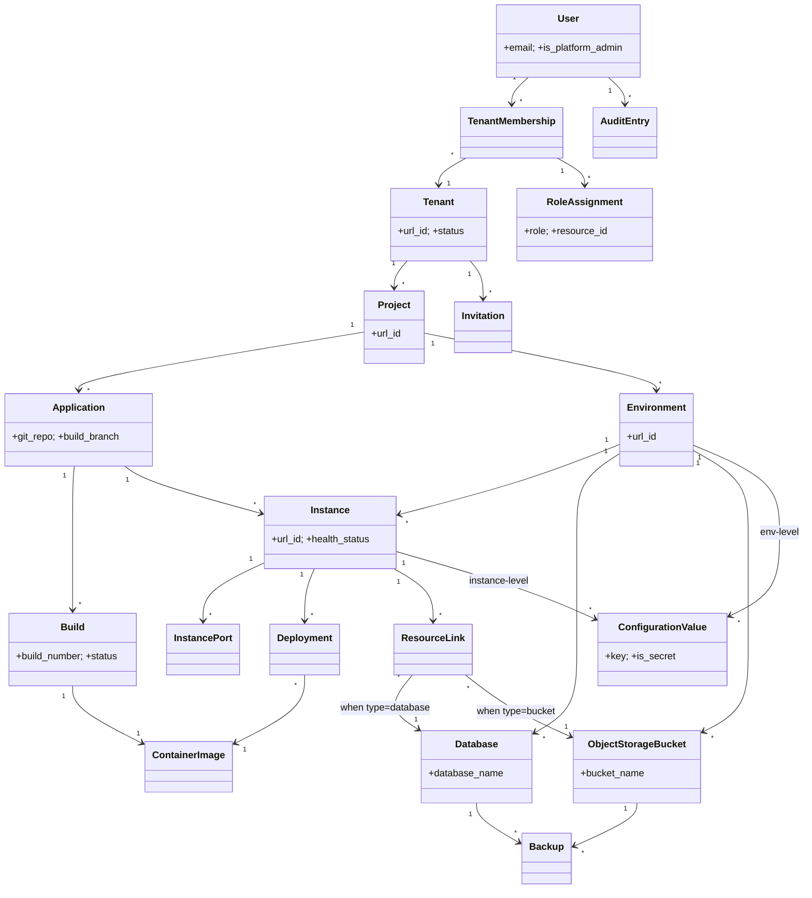

# Requirements: Operations Portal

**Domain:** Developer / DevOps tooling — multi-tenant container application operations [AI-SUGGESTED] **Created:** 2026-04-30 **Status:** draft **Last finalised at:** —

> Inferred content is marked `[AI-SUGGESTED]` inline. Field-level marking when only some sub-fields are inferred; heading-level marking when the whole item is invented. The fill-every-field rule applies — no blanks.

---

## 1. Application context

**Name:** Operations Portal

**Purpose / business value:** Provide consulting companies and on-premise customers with a single workspace for building, deploying, running, and observing the custom applications generated by the platform's AI agents — abstracting container orchestration behind business-friendly concepts so technically strong business users (not professional DevOps) can operate what they build.

**Domain:** Multi-tenant application operations / internal developer platform (IDP) for AI-generated custom software. [AI-SUGGESTED]

**Business goal:** Enable consulting companies to deliver and operate custom client software at scale (up to 100 tenants, ~100 environments per tenant) on a shared platform, with strict tenant and project isolation, while keeping operational overhead low enough for non-DevOps users. [AI-SUGGESTED — synthesised from brief and requirements-v1 §1, §19.5]

<!-- rev: run-1 2026-04-30 -->

---

## 2. Domain model

> The BA's framing of the business domain in **ubiquitous language**, implementation-free.

### 2.1 Concepts

| Concept | Persistence | Definition (ubiquitous language) |
| --- | --- | --- |
| User | persistent | A person who uses the portal, uniquely identified by email; exists at system level and may belong to many tenants. |
| Tenant | persistent | A consulting company or organisation; the top-level isolation boundary. All resources are scoped to a tenant. |
| Tenant Membership | persistent | The association linking a User to a Tenant, carrying the user's roles and last-login record within that tenant. |
| Project | persistent | A client engagement or initiative within a tenant; the access-isolation boundary for end users. |
| Environment | persistent | A logical grouping (e.g., dev, staging, production) within a project; isolated set of instances, configuration, databases and storage. |
| Application | persistent | A deployable unit of software defined at the project level by a Git repository (and optional subdirectory). |
| Instance | persistent | The per-environment running form of an Application — one Application × Environment pair. |
| Build | persistent | The process and record of compiling an Application's source into a container image. |
| Container Image | persistent | A versioned, runnable artifact produced by a successful Build. |
| Deployment | persistent | A record of placing a specific Container Image onto a specific Instance. |
| Database | persistent | A provisioned PostgreSQL database scoped to an Environment. |
| Object Storage Bucket | persistent | A provisioned S3-compatible bucket scoped to an Environment. |
| Resource Link | persistent | An association linking a Database or Object Storage Bucket to an Instance within the same Environment. |
| Configuration Value | persistent | A key-value entry scoped to either an Environment (default) or an Instance (override); may be marked secret. |
| Secret | persistent | A Configuration Value whose value is encrypted via the secrets backend; metadata visible, value write-only. |
| Audit Entry | persistent | An immutable record of a significant action in the system. |
| Backup | persistent | A record of a backup operation against a Database or Object Storage Bucket. |
| Invitation | persistent | A pending invitation for a user to join a tenant; deleted on acceptance or expiry. |
| Instance Port | persistent | An exposed port mapping on an Instance enabling public routing under a path prefix. |
| Role Assignment | persistent | Grants a tenant member a role on a tenant, project or environment resource. |
| Notification | persistent | A per-user record of an asynchronous operation outcome (build, deployment, provisioning); retention 50 / 30 days. [AI-SUGGESTED — derived from NOT-01..03] |
| Health Status | derived | The current operational state of an Instance computed from replica health checks (Running / Degraded / Stopped / Failed). |
| Public URL | derived | The portal-generated externally routable URL of an Instance Port, formed from the url_id chain. |
| Role | policy | A named bundle of permissions (Platform Admin, Tenant Admin, Project Admin, Operator, Viewer) assigned at platform / tenant / project / environment scope. |
| Tenant Suspension | policy | A platform-administrator action that disables tenant access and stops all running instances without data loss. |
| Image Retention Policy | policy | The rule retaining the latest image, the currently deployed image and the two prior deployed images per Instance; all others auto-deleted. |
| Backup Retention Policy | policy | Daily backups retained 7 days; weekly backups retained 30 days. |
| Rolling Update | policy | The single supported deployment strategy: replace replicas one at a time, halt and roll back on health-check failure. |
| Build Trigger | policy | The decision to start a Build — automatic on branch push (filtered by subdirectory for monorepos) or manual on user action. |

### 2.2 Relationships

- User **holds** Tenant Membership [1:N]
- Tenant Membership **belongs to** Tenant [N:1]
- Tenant Membership **carries** Role Assignment [1:N]
- Role Assignment **applies to** Tenant or Project or Environment [N:1, polymorphic]
- Tenant **contains** Project [1:N]
- Project **contains** Environment [1:N]
- Project **owns** Application [1:N]
- Application × Environment **realises** Instance [1:1 per pair]
- Application **produces** Build [1:N]
- Build **yields** Container Image [1:1 on success]
- Instance **runs** Container Image (via Deployment) [N:1 current; 1:N historical]
- Instance **exposes** Instance Port [1:N]
- Environment **provisions** Database [1:N]
- Environment **provisions** Object Storage Bucket [1:N]
- Instance **links** Database or Object Storage Bucket (via Resource Link) [N:M within environment]
- Environment **defines** Configuration Value [1:N]
- Instance **overrides** Configuration Value [1:N]
- Database **has** Backup [1:N]
- Object Storage Bucket **has** Backup [1:N]
- Tenant **invites** User (via Invitation) [1:N pending]
- User **performs** action recorded as Audit Entry [1:N]
- User **receives** Notification [1:N]

### 2.3 Aggregates & lifecycles

#### Tenant

| Field | Value |
| --- | --- |
| Member concepts | Tenant Membership, Role Assignment (tenant-scoped), Invitation, Project (composition root for Project subtree) |
| Lifecycle states | Active → Suspended → Deleted (Suspended ↔ Active reactivation allowed; Delete only from Suspended with zero running instances/databases/buckets) |
| Key invariants | At least one active Tenant Admin at all times (RBAC-07); at least one identity provider enabled, and email/password may be disabled only if at least one SSO provider remains (AUTH-04); tenant url_id immutable and unique platform-wide. |

#### Project

| Field | Value |
| --- | --- |
| Member concepts | Application, Environment (and its descendants), Role Assignment (project- and environment-scoped), Project-level secrets (e.g., Git credentials) |
| Lifecycle states | Created → Active → Deleted (Delete only when no descendant resources exist, PRJ-07) |
| Key invariants | All resources scoped to one Project (PRJ-03); user must have an explicit Role Assignment on the project or one of its environments to see it (PRJ-02); url_id immutable and unique within tenant. |

#### Application

| Field | Value |
| --- | --- |
| Member concepts | Build, Container Image, Application metadata (Git repo, subdirectory, build branch) |
| Lifecycle states | Registered → Active (with 0..N Instances) → Deleted (only when no running Instances, APP-07) |
| Key invariants | Git repository must be reachable at registration (APP-01); build_branch is required (BLD-02); applications do not own a url_id — referenced by display_name + internal id. |

#### Instance

| Field | Value |
| --- | --- |
| Member concepts | Deployment (history), Instance Port (0..*), Resource Link (0..*), instance-level Configuration Value & Secret, current Container Image |
| Lifecycle states | Created → Running ↔ Degraded ↔ Stopped ↔ Failed; Stopped sets replicas to zero, Start restores prior count (INS-03, INS-07, INS-09) |
| Key invariants | application_id × environment_id is unique; replica_count ∈ [1,10]; rolling update is the only update strategy; new replica must pass health check before old replica is removed; failed health check halts and rolls back (INS-04). |

#### Environment

| Field | Value |
| --- | --- |
| Member concepts | Instance, Database, Object Storage Bucket, environment-level Configuration Value & Secret |
| Lifecycle states | Created → Active → Deleted (only when no running instances, databases or buckets, ENV-09) |
| Key invariants | Instances within the same environment can communicate via internal DNS; instances across environments cannot communicate by default (ENV-03, ENV-04); environment-level config values are defaults, instance-level overrides on key collision. |

#### Build

| Field | Value |
| --- | --- |
| Member concepts | Build log output, build_number, git_commit_sha, Container Image (on success) |
| Lifecycle states | Queued → In Progress → Succeeded / Failed / Cancelled (BLD-05, BLD-14) |
| Key invariants | build_number auto-increments per application (BLD-03); Container Image tag = git_commit_sha; system-wide timeout auto-cancels (BLD-12). |

#### Database

| Field | Value |
| --- | --- |
| Member concepts | Backup (history) |
| Lifecycle states | Provisioning → Available → Deleting → Deleted; Error from any state |
| Key invariants | Scoped to one Environment; deletion blocked while any Resource Link exists (DB-06); name is the immutable URI slug. |

#### Object Storage Bucket

| Field | Value |
| --- | --- |
| Member concepts | Backup (history) |
| Lifecycle states | Provisioning → Available → Deleting → Deleted; Error from any state |
| Key invariants | Scoped to one Environment; deletion blocked while any Resource Link exists (OBJ-02); bucket_name is the immutable URI slug. |

### 2.4 Diagram

<!-- rev: run-1 2026-04-30 -->

---

## 3. Target users

> Target-user personas — the end users of the application being designed. Not to be confused with the Unicorn (LLM) or the Consultant (audience).

### Platform Administrator

| Field | Value |
| --- | --- |
| Role / job title | Platform Operator at the hosting consulting company or on-premise customer's IT team [AI-SUGGESTED] |
| Expertise level | High — comfortable with multi-tenant SaaS administration, infrastructure-aware, but not necessarily a Kubernetes specialist [AI-SUGGESTED] |
| Stakes | Very high — actions affect entire tenants (suspend, delete) and the platform admin role itself; mistakes are tenant-wide outages or data loss. |
| Frequency of use | Low — infrequent but high-impact tasks (per user-tasks-v1 §2). |
| Driving forces — wants | Clear visibility of all tenants, confidence that destructive actions are guarded, audit evidence for every platform-level change. [AI-SUGGESTED] |
| Driving forces — fears | Accidentally deleting or suspending the wrong tenant; locking the platform out of admin access; leaking tenant-internal data through the platform-admin view. [AI-SUGGESTED] |

### Tenant Administrator

| Field | Value |
| --- | --- |
| Role / job title | Engagement / delivery lead at the consulting company, or operations lead at an on-premise customer. [AI-SUGGESTED] |
| Expertise level | Medium-high — comfortable with SaaS admin UIs, identity providers, and team management; not a hands-on developer. [AI-SUGGESTED] |
| Stakes | High — controls who has access to the tenant and which projects exist; mistakes cause access outages or data exposure across projects. |
| Frequency of use | Low — task cadence on user joiners/leavers and project setup (user-tasks-v1 §3). |
| Driving forces — wants | Easy invitation and role assignment, confidence the tenant cannot be locked out (last-admin guard), tenant-wide audit visibility. |
| Driving forces — fears | Removing the last tenant admin, granting too-broad access, missing an offboarding step that leaves a contractor with access. [AI-SUGGESTED] |

### Project Administrator

| Field | Value |
| --- | --- |
| Role / job title | Tech lead / project lead for a single client engagement. |
| Expertise level | High — technically strong business user; comfortable with Git, environments, app concepts; not a DevOps engineer. |
| Stakes | High within their project — environment topology, project membership, integration credentials. |
| Frequency of use | Medium — daily project-dashboard checks, lower-frequency setup tasks (user-tasks-v1 §4). |
| Driving forces — wants | Fast project dashboard, simple environment management, clear per-environment role gating, simple credential management for Git. |
| Driving forces — fears | Misconfigured environments leaking to production; team members with wrong roles in production; broken Git credentials silently failing builds. [AI-SUGGESTED] |

### Operator

| Field | Value |
| --- | --- |
| Role / job title | Technically strong business user / power user who builds and operates the AI-generated applications. |
| Expertise level | High in business / app domain, comfortable with build-and-deploy mental models; explicitly **not** a Kubernetes / DevOps specialist (NFR-01, NFR-02). |
| Stakes | Medium-high — touches running production systems via deploys, restarts, secret rotation. |
| Frequency of use | Very high — primary daily user; most portal traffic comes from this persona (user-tasks-v1 §5). |
| Driving forces — wants | Speed: deploy / view logs / check status in ≤3 clicks (NFR-03); business-friendly language (no pods/replica sets); reliable logs and metrics; confident rollback. |
| Driving forces — fears | Deploying the wrong build to production; losing logs during an incident; silent build failures; making config changes without seeing the override picture. [AI-SUGGESTED] |

### Viewer

| Field | Value |
| --- | --- |
| Role / job title | Stakeholder, support engineer, account manager, junior team member, or auditor. [AI-SUGGESTED] |
| Expertise level | Mixed — some technical, some business-only; UI must remain readable without DevOps fluency. [AI-SUGGESTED] |
| Stakes | Low — read-only; cannot mutate state. |
| Frequency of use | Very high for log/dashboard checks during incidents and reviews (user-tasks-v1 §6). |
| Driving forces — wants | Quick read-only access to dashboards, logs, build history, deployment history; secret values masked; clear indication of why an action is unavailable. [AI-SUGGESTED] |
| Driving forces — fears | Being blamed for state they can see but cannot fix; mistaking masked secrets for empty values. [AI-SUGGESTED] |

<!-- rev: run-1 2026-04-30 -->

---

## 4. User goals & stories

> Quality signals live on the goal (outcome-level), not the story (behaviour-level).

### 4.1 Goals catalogue

| ID | Goal statement | Quality signals | Goal kind | Layout pref (optional) | UX-pattern pref (optional) |
| --- | --- | --- | --- | --- | --- |
| G-01 | Know at a glance whether each environment and instance is healthy. | Clarity of status; latency to first paint of dashboard; signal-to-noise ratio (no decorative chrome). [AI-SUGGESTED] | top-level | App shell with sidebar | Dashboard + KPI tiles |
| G-02 | Diagnose a misbehaving instance through logs and metrics. | Time-to-first-log-line; query responsiveness; ability to tail in real time; useful filter affordances. [AI-SUGGESTED] | top-level | Master-detail | Log viewer with filters; metrics dashboard |
| G-03 | Deploy a chosen build to a chosen environment with confidence. | Reversibility (rollback present); explicit confirmation; health-aware rollout. [AI-SUGGESTED] | top-level | Detail page + drawer | Modal confirmation; deployment history |
| G-04 | Get from "I noticed something" to "I'm acting on it" in ≤3 clicks (NFR-03). | Click count from project dashboard; navigability without search. | top-level | App shell with sidebar | Persistent sidebar; breadcrumbs |
| G-05 | Register a new application and watch its first build succeed. | Validation feedback at registration; clear error output on build failure. [AI-SUGGESTED] | sub-level | Centered form / wizard | Multi-step wizard; build log streaming |
| G-06 | Provision and connect a database or bucket to an instance without thinking about credentials. | Auto-injection of connection details; clear "linked to" view; safe unlink with restart. [AI-SUGGESTED] | sub-level | Master-detail | Drawer detail; modal confirmation |
| G-07 | Manage configuration and secrets per environment and per instance with the override picture visible. | Side-by-side view of env-level defaults and instance overrides; secrets write-only after creation. [AI-SUGGESTED] | sub-level | Settings shell | Tabs; inline edit |
| G-08 | Manage tenant membership, projects and per-project roles safely. | Last-admin guard surfaced in UI; per-environment role overrides visible; invite re-send on email failure. [AI-SUGGESTED] | sub-level | Settings shell | Table; modal form |
| G-09 | Run platform-administration actions (create/suspend/delete tenant) with strong confirmation. | Type-to-confirm for destructive actions; tenant-internal data screened out. | sub-level | Settings shell | Modal confirmation with type-to-confirm |
| G-10 | Search the audit trail for who did what, when, on which resource. | Filterable by user/project/action/resource/time/environment; immutable; permission-scoped. | sub-level | Master-detail | Search-and-filter; table |
| G-11 | Trigger and trust automated and on-demand backups, and restore when needed. | Visible last-backup time; explicit confirmation on restore; instance auto-restart after restore. [AI-SUGGESTED] | sub-level | Detail page | Modal confirmation |
| G-12 | Expose an instance publicly via the API gateway and see its URL. | Public URL visible and copyable; remove-public is a deliberate action. [AI-SUGGESTED] | interaction-level | Detail page | Inline edit; popover |
| G-13 | Switch between tenants and projects without re-authenticating. | Single session across tenants; last-used tenant/project remembered for routing. | interaction-level | Top bar | Tenant/project switcher (command palette / mega menu) |
| G-14 | Receive completion notifications for asynchronous operations they initiated. | Per-user inbox; retention of last 50 / 30 days; clear linkage back to the source action. | interaction-level | Top bar | Notification toast + tray |

### 4.2 Stories by persona

#### Platform Administrator → §3

##### Story: As a platform administrator, I want to view a list of all tenants with status and basic counts, so that I can identify tenants that need attention.

| Field | Value |
| --- | --- |
| Goal | → §4.1 G-09 |
| Objective | List tenants showing display_name, status, creation date, project count; drill-in to per-tenant summary. |
| Context | Frequency: medium; expertise: high; stakes: high. |
| Linked task flow | → §5 Flow: Tenant lifecycle (platform) |

##### Story: As a platform administrator, I want to create a new tenant and assign its first tenant admin, so that the tenant can begin self-managing.

| Field | Value |
| --- | --- |
| Goal | → §4.1 G-09 |
| Objective | Create tenant with display_name + immutable url_id; designate first tenant admin (existing user or new email). |
| Context | Frequency: low; expertise: high; stakes: high. |
| Linked task flow | → §5 Flow: Tenant lifecycle (platform) |

##### Story: As a platform administrator, I want to suspend, reactivate or delete a tenant with strong confirmation, so that I can take destructive action without making mistakes.

| Field | Value |
| --- | --- |
| Goal | → §4.1 G-09 |
| Objective | Suspend (reversible, stops running instances), reactivate, or delete (only if suspended with zero live resources, type-to-confirm url_id). |
| Context | Frequency: very low; expertise: high; stakes: very high. |
| Linked task flow | → §5 Flow: Tenant lifecycle (platform) |

##### Story: As a platform administrator, I want to grant or revoke the platform-admin role with the last-admin guard enforced, so that the platform is never left without an administrator.

| Field | Value |
| --- | --- |
| Goal | → §4.1 G-09 |
| Objective | Grant/revoke is_platform_admin; UI prevents revoking the last platform admin (PADM-08). |
| Context | Frequency: very low; expertise: high; stakes: very high. |
| Linked task flow | → §5 Flow: Platform-admin role management |

##### Story: As a platform administrator, I want to view the platform audit trail, so that I have evidence of every platform-level action.

| Field | Value |
| --- | --- |
| Goal | → §4.1 G-10 |
| Objective | Search platform-level audit entries by user, action, target tenant, and time. |
| Context | Frequency: medium; expertise: high; stakes: high. |
| Linked task flow | → §5 Flow: Audit search |

#### Tenant Administrator → §3

##### Story: As a tenant administrator, I want to invite a user by email and have the system create or attach a tenant membership, so that onboarding is one step.

| Field | Value |
| --- | --- |
| Goal | → §4.1 G-08 |
| Objective | Invite by email (USR-01), surface email-delivery failures, allow re-send (USR-02). |
| Context | Frequency: low; expertise: medium-high; stakes: high. |
| Linked task flow | → §5 Flow: Invite user to tenant |

##### Story: As a tenant administrator, I want to deactivate, reactivate, and manage roles for tenant members across projects and environments, so that access stays correct as the team changes.

| Field | Value |
| --- | --- |
| Goal | → §4.1 G-08 |
| Objective | Deactivate/reactivate membership (USR-05/06), assign to projects with roles (USR-08, RBAC-03), enforce last tenant-admin guard (RBAC-07). |
| Context | Frequency: low; expertise: medium-high; stakes: high. |
| Linked task flow | → §5 Flow: Manage tenant membership |

##### Story: As a tenant administrator, I want to create a new project and delete empty projects, so that I can shape the tenant to match active engagements.

| Field | Value |
| --- | --- |
| Goal | → §4.1 G-08 |
| Objective | Create project (display_name, url_id, description) (PRJ-01); delete empty project with explicit confirmation (PRJ-07). |
| Context | Frequency: low; expertise: medium-high; stakes: medium. |
| Linked task flow | → §5 Flow: Project lifecycle |

##### Story: As a tenant administrator, I want to configure tenant settings (display name, identity providers), so that I can adapt to enterprise SSO requirements.

| Field | Value |
| --- | --- |
| Goal | → §4.1 G-08 |
| Objective | Edit tenant display_name, enable/disable IDPs subject to AUTH-04 invariant. |
| Context | Frequency: very low; expertise: medium-high; stakes: high (lockout risk). |
| Linked task flow | — |

#### Project Administrator → §3

##### Story: As a project administrator, I want to see the project dashboard with all environments, applications and statuses, so that I have one place to start any task.

| Field | Value |
| --- | --- |
| Goal | → §4.1 G-01, G-04 |
| Objective | Render project dashboard (PRJ-08) with environment cards and application list. |
| Context | Frequency: very high; expertise: high; stakes: medium. |
| Linked task flow | → §5 Flow: Open project dashboard |

##### Story: As a project administrator, I want to manage project membership and per-environment roles, so that operators have correct access in dev vs production.

| Field | Value |
| --- | --- |
| Goal | → §4.1 G-08 |
| Objective | Assign members, manage env-scoped roles (RBAC-03), invite new users into project (USR-08). |
| Context | Frequency: low; expertise: high; stakes: high. |
| Linked task flow | → §5 Flow: Manage project membership |

##### Story: As a project administrator, I want to create, rename and delete environments within my project, so that I can shape the dev/staging/prod topology.

| Field | Value |
| --- | --- |
| Goal | → §4.1 G-08 |
| Objective | Create environment (display_name, url_id) (ENV-01), rename (ENV-08), delete only when empty (ENV-09). |
| Context | Frequency: low; expertise: high; stakes: medium. |
| Linked task flow | → §5 Flow: Environment lifecycle |

##### Story: As a project administrator, I want to manage Git provider credentials at project scope, so that builds can authenticate to the customer's Git host.

| Field | Value |
| --- | --- |
| Goal | → §4.1 G-08 |
| Objective | Store Git credentials as project-level secrets (APP-02); rotate when expired. |
| Context | Frequency: low; expertise: high; stakes: medium. |
| Linked task flow | → §5 Flow: Manage Git credentials |

#### Operator → §3

##### Story: As an operator, I want to register a new application by linking a Git repository, so that I can start building it.

| Field | Value |
| --- | --- |
| Goal | → §4.1 G-05 |
| Objective | Register application (provider, repo URL, build_branch, optional subdirectory), validate accessibility at registration (APP-01). |
| Context | Frequency: low; expertise: high; stakes: medium. |
| Linked task flow | → §5 Flow: Register application |

##### Story: As an operator, I want to watch a build in progress with streaming logs, so that I can react quickly to failures.

| Field | Value |
| --- | --- |
| Goal | → §4.1 G-02, G-05 |
| Objective | Tail build log; show queued/in-progress/succeeded/failed/cancelled state (BLD-04, BLD-05). |
| Context | Frequency: high; expertise: high; stakes: medium. |
| Linked task flow | → §5 Flow: Build & watch |

##### Story: As an operator, I want to deploy a chosen build to a chosen environment with rolling-update protection, so that I can ship safely.

| Field | Value |
| --- | --- |
| Goal | → §4.1 G-03 |
| Objective | Deploy specific build_number to instance (INS-01); rolling update with auto-rollback on health failure (INS-04). |
| Context | Frequency: medium; expertise: high; stakes: high in production. |
| Linked task flow | → §5 Flow: Deploy build to environment |

##### Story: As an operator, I want to start, stop, restart and rollback an instance, so that I can recover from incidents.

| Field | Value |
| --- | --- |
| Goal | → §4.1 G-03 |
| Objective | Lifecycle actions on instance (INS-03, INS-05). |
| Context | Frequency: medium; expertise: high; stakes: high (production). |
| Linked task flow | → §5 Flow: Instance lifecycle controls |

##### Story: As an operator, I want to scale replicas (1–10) and switch resource profiles, so that I can right-size the instance.

| Field | Value |
| --- | --- |
| Goal | → §4.1 G-03 |
| Objective | Set replica_count (INS-07); pick Small/Medium/Large profile (INS-10, INS-11). |
| Context | Frequency: low; expertise: high; stakes: medium. |
| Linked task flow | — |

##### Story: As an operator, I want to view and tail instance logs with filters, so that I can diagnose live problems.

| Field | Value |
| --- | --- |
| Goal | → §4.1 G-02 |
| Objective | View logs filtered by time, keyword, severity (OBS-02); tail in near real time (OBS-03). |
| Context | Frequency: very high; expertise: high; stakes: high during incidents. |
| Linked task flow | → §5 Flow: Investigate instance logs |

##### Story: As an operator, I want to view native dashboards for CPU/memory/error/restart and request rate/latency, so that I can spot regressions.

| Field | Value |
| --- | --- |
| Goal | → §4.1 G-02 |
| Objective | View instance metrics dashboard (OBS-11, OBS-12); request rate/latency for publicly-exposed instances. |
| Context | Frequency: high; expertise: high; stakes: medium. |
| Linked task flow | — |

##### Story: As an operator, I want to provision a database or storage bucket and link it to an instance, so that the application has its dependencies wired without me handling secrets.

| Field | Value |
| --- | --- |
| Goal | → §4.1 G-06 |
| Objective | Provision DB or bucket (DB-01, OBJ-01); link to instance with auto-injection (LNK-01, LNK-02, LNK-04); unlink restarts instance (LNK-06). |
| Context | Frequency: low / medium; expertise: high; stakes: high (data). |
| Linked task flow | → §5 Flow: Link a resource to an instance |

##### Story: As an operator, I want to manage configuration values and secrets at environment and instance scope with override clarity, so that I can change settings safely.

| Field | Value |
| --- | --- |
| Goal | → §4.1 G-07 |
| Objective | CRUD env-level and instance-level config (CFG-01, CFG-02); mark as secret (CFG-05); rotate secrets (SEC-07); show override resolution; change triggers restart (CFG-03). |
| Context | Frequency: medium; expertise: high; stakes: high. |
| Linked task flow | → §5 Flow: Edit configuration / secret |

##### Story: As an operator, I want to expose an instance publicly via the API gateway and view its URL, so that consumers can reach it.

| Field | Value |
| --- | --- |
| Goal | → §4.1 G-12 |
| Objective | Configure InstancePort(s); see generated URL `<app>.<env>.<project>.<tenant>.<portal-domain>` (NET-04). |
| Context | Frequency: low / medium; expertise: high; stakes: high (security). |
| Linked task flow | → §5 Flow: Expose instance publicly |

##### Story: As an operator, I want to trigger manual backups and restore from a backup point, so that I can protect data around risky changes.

| Field | Value |
| --- | --- |
| Goal | → §4.1 G-11 |
| Objective | Manual on-demand backup (NFR-62); restore to same or sibling environment with confirmation; auto-restart linked instances (NFR-64). |
| Context | Frequency: low / very low; expertise: high; stakes: very high (data overwrite). |
| Linked task flow | → §5 Flow: Restore from backup |

##### Story: As an operator, I want to see the audit trail scoped to my project, so that I can answer "who changed this and when?".

| Field | Value |
| --- | --- |
| Goal | → §4.1 G-10 |
| Objective | Search audit entries scoped to permitted projects/environments. |
| Context | Frequency: medium; expertise: high; stakes: medium. |
| Linked task flow | → §5 Flow: Audit search |

#### Viewer → §3

##### Story: As a viewer, I want to view the project dashboard, environment overview, application list and instance details read-only, so that I can monitor without changing anything.

| Field | Value |
| --- | --- |
| Goal | → §4.1 G-01 |
| Objective | Read-only access to dashboards, application/instance detail, deployment history (T-VIEW-01..07). |
| Context | Frequency: very high; expertise: mixed; stakes: low. |
| Linked task flow | — |

##### Story: As a viewer, I want to view and tail logs and metrics dashboards, so that I can support incidents and reviews.

| Field | Value |
| --- | --- |
| Goal | → §4.1 G-02 |
| Objective | View/tail logs and metrics with secrets masked in any config view (T-VIEW-05..08). |
| Context | Frequency: very high during incidents; expertise: mixed; stakes: low. |
| Linked task flow | — |

#### All authenticated users → §3

##### Story: As any authenticated user, I want to switch tenant context within a single session and update my display name, so that I can move between consulting engagements without re-login friction.

| Field | Value |
| --- | --- |
| Goal | → §4.1 G-13 |
| Objective | Tenant switcher; profile edit (display_name); password & MFA managed by IDP (USR-10, AUTH-06). |
| Context | Frequency: medium / low; expertise: any; stakes: low. |
| Linked task flow | → §5 Flow: Switch tenant |

##### Story: As any authenticated user, I want to receive completion notifications for asynchronous operations I started, so that I don't have to poll.

| Field | Value |
| --- | --- |
| Goal | → §4.1 G-14 |
| Objective | Per-user notifications for build/deploy/provisioning start & completion (NOT-01..03); retention 50 / 30 days. |
| Context | Frequency: high; expertise: any; stakes: low. |
| Linked task flow | — |

---

## 5. Task flows

### Flow: Open project dashboard

| Field | Value |
| --- | --- |
| Actor | Project Admin / Operator / Viewer (any project member) |
| Trigger | User selects a project from sidebar / switcher. |
| Steps | 1. Resolve user's RoleAssignments for project & environments. 2. Load project metadata. 3. Load environments with summary status. 4. Load applications with current per-environment instance health. 5. Render dashboard (PRJ-08). |
| Decision points | Has user any role on this project? If no — 403 / hide. |
| Exception paths | Tenant suspended → show suspension banner, hide actions. Project deletion in progress → read-only banner. [AI-SUGGESTED] |
| Role-conditional behaviour | Action buttons (deploy, edit, delete) shown only for Operator+ on the relevant scope; Viewer sees data only. |

### Flow: Register application

| Field | Value |
| --- | --- |
| Actor | Operator (or Project Admin) |
| Trigger | "Register application" from Applications view. |
| Steps | 1. Pick provider (GitHub / BitBucket). 2. Enter repo URL, branch, optional subdirectory, name, description. 3. Portal validates repo accessibility using project-scoped Git credentials (APP-01, APP-02). 4. Create Application record. 5. Optional: trigger first build. |
| Decision points | Repo reachable? Subdirectory present (monorepo)? |
| Exception paths | Credentials invalid → block with clear error and link to credential management. Repo unreachable → block. |
| Role-conditional behaviour | Operator+ on project required; Viewers see action disabled with reason. |

### Flow: Build & watch

| Field | Value |
| --- | --- |
| Actor | Operator (or Project Admin) |
| Trigger | Auto on branch push (BLD-02), or manual (BLD-13). |
| Steps | 1. Enqueue build with build_number, source commit. 2. Stream logs in real time. 3. On success push image to registry (REG-02). 4. On failure surface error output (BLD-07). 5. Optional cancel during in-progress (BLD-14). |
| Decision points | Source changed within subdirectory? Build timeout exceeded? Cancellation requested? |
| Exception paths | Timeout → auto-cancel & mark failed (BLD-12). Repo creds invalid → fail with clear error (APP-01). |
| Role-conditional behaviour | Manual trigger and cancel: Operator+ only; Viewers see history and live log only. |

### Flow: Deploy build to environment

| Field | Value |
| --- | --- |
| Actor | Operator |
| Trigger | "Deploy" from build detail or instance detail. |
| Steps | 1. Choose target Instance (Application × Environment) and build_number. 2. Confirm. 3. Rolling update: bring up new replica, wait for health check, then drain old (INS-04). 4. Record Deployment with outcome. 5. Notify user on completion (NOT-01, NOT-02). |
| Decision points | New replica health check passed within thresholds? Resource limits sufficient? |
| Exception paths | Replica health failure → halt and roll back; mark Deployment.outcome = `rolled_back`. |
| Role-conditional behaviour | Production deploys may require env-scoped Operator role (RBAC-03); enforced via BR-07. |

### Flow: Instance lifecycle controls (start/stop/restart/rollback)

| Field | Value |
| --- | --- |
| Actor | Operator |
| Trigger | Action button on instance detail. |
| Steps | 1. User picks action (start / stop / restart / rollback) 2. Confirm if destructive (rollback to specific build). 3. Apply action; for stop, set replicas=0 (INS-07); for start, restore prior replica count. 4. Update health_status. |
| Decision points | Is target build still retained? (REG-04 retention). |
| Exception paths | Target image purged → block rollback with informative message. [AI-SUGGESTED] |
| Role-conditional behaviour | Env-scoped Operator role required for production environments (BR-07). |

### Flow: Investigate instance logs

| Field | Value |
| --- | --- |
| Actor | Operator / Viewer |
| Trigger | "View logs" on instance. |
| Steps | 1. Open log view. 2. Apply filters (time range, keyword, severity). 3. Tail in real time (OBS-03). 4. Optionally pivot to metrics dashboard. |
| Decision points | Time range within retention (30 days for logs) (OBS-13)? |
| Exception paths | Out-of-retention range → show explanatory empty state. [AI-SUGGESTED] |
| Role-conditional behaviour | Viewer can read; cannot copy off in bulk if a future export feature is added. [AI-SUGGESTED — placeholder] |

### Flow: Edit configuration / secret

| Field | Value |
| --- | --- |
| Actor | Operator |
| Trigger | "Edit" on config row at environment or instance level. |
| Steps | 1. Choose scope (environment-level default vs instance-level override). 2. Add/edit/delete key-value. 3. If marking secret, value becomes write-only after save (SEC-04, CFG-05). 4. Save → portal restarts affected instance(s) automatically (CFG-03). |
| Decision points | Key already defined at the other scope? Show override resolution preview. |
| Exception paths | Attempt to unmark secret → blocked; user must delete and recreate (CFG-05). |
| Role-conditional behaviour | Operator+; Viewer sees masked secret values. |

### Flow: Link a resource to an instance

| Field | Value |
| --- | --- |
| Actor | Operator |
| Trigger | "Link" from instance Linked Resources view, or from resource detail drawer on environment overview (T-LNK-02). |
| Steps | 1. Select Database or Object Storage Bucket within same environment (LNK-01). 2. Confirm. 3. Portal injects connection details: non-sensitive as configuration, credentials as secrets (LNK-02, LNK-04). 4. Restart not required on link (only on unlink — LNK-06). [AI-SUGGESTED] |
| Decision points | Resource and instance in same environment? (BR-04). |
| Exception paths | Cross-environment selection blocked. |
| Role-conditional behaviour | Operator+ required. |

### Flow: Expose instance publicly

| Field | Value |
| --- | --- |
| Actor | Operator |
| Trigger | "Expose publicly" on instance. |
| Steps | 1. Define one or more InstancePort entries (internal_port, path_prefix). 2. Portal generates URL `<app>.<env>.<project>.<tenant>.<portal-domain><path_prefix>` (NET-04). 3. User copies URL. |
| Decision points | Port already exposed? Path prefix unique within instance? |
| Exception paths | Conflict on (instance_id, port) or (instance_id, path_prefix) → block with explanation. |
| Role-conditional behaviour | Operator+ required. |

### Flow: Restore from backup

| Field | Value |
| --- | --- |
| Actor | Operator |
| Trigger | "Restore" on backup history of database or bucket. |
| Steps | 1. Choose backup point. 2. Choose target (same or sibling environment within same project) (NFR-64). 3. Confirm (explicit). 4. Overwrite target. 5. Auto-restart linked instances. 6. Record outcome and audit. |
| Decision points | Target resource in same project? Confirmation typed? |
| Exception paths | Restore failure → instance left running on prior data; surface error and notify. [AI-SUGGESTED] |
| Role-conditional behaviour | Operator+ required. |

### Flow: Manage tenant membership

| Field | Value |
| --- | --- |
| Actor | Tenant Admin |
| Trigger | "Members" view in tenant settings. |
| Steps | 1. List members with last login, project assignments, roles. 2. Invite (USR-01) / re-send (USR-02) / deactivate (USR-05) / reactivate (USR-06) / change role (USR-08). |
| Decision points | Action would leave the tenant with zero tenant admins? Block (RBAC-07, BR-01). |
| Exception paths | Invitation email delivery failure surfaced (USR-02). |
| Role-conditional behaviour | Tenant Admin only. |

### Flow: Manage project membership

| Field | Value |
| --- | --- |
| Actor | Project Admin (or Tenant Admin) |
| Trigger | "Members" view in project settings. |
| Steps | 1. List project members with per-environment roles. 2. Add tenant member to project, set role (USR-08). 3. Invite new user to tenant + auto-assign to project (USR-08, USR-01). 4. Remove or change roles. |
| Decision points | Tenant has SSO-only with email/password disabled? Invitation routes through SSO. [AI-SUGGESTED] |
| Exception paths | Invitee already member of tenant → reuse membership, just add role. |
| Role-conditional behaviour | Project Admin only within their project. |

### Flow: Project lifecycle

| Field | Value |
| --- | --- |
| Actor | Tenant Admin (create / delete); Project Admin (rename, edit description). |
| Trigger | "Create project" or project settings. |
| Steps | 1. Create with display_name, immutable url_id, description. 2. Edit name/description (PRJ-06). 3. Delete only when empty (PRJ-07) with confirmation. |
| Decision points | Project has resources? Block delete. |
| Exception paths | Attempt to delete non-empty → block with list of remaining resources. [AI-SUGGESTED] |
| Role-conditional behaviour | Create/delete: Tenant Admin. Rename/edit: Project Admin or Tenant Admin. |

### Flow: Environment lifecycle

| Field | Value |
| --- | --- |
| Actor | Project Admin |
| Trigger | "Create environment" / environment settings. |
| Steps | 1. Create with display_name + url_id (ENV-01). 2. Rename display_name (ENV-08). 3. Delete only when no live instances/databases/buckets (ENV-09) with confirmation. |
| Decision points | Tenant environment-count cap (NFR-41) reached? (warn but do not hard-block per NFR-40/41 wording.) |
| Exception paths | Delete non-empty → block. |
| Role-conditional behaviour | Project Admin only. |

### Flow: Tenant lifecycle (platform)

| Field | Value |
| --- | --- |
| Actor | Platform Admin |
| Trigger | "Tenants" admin view. |
| Steps | 1. Create tenant (display_name + url_id) (PADM-02). 2. Assign first tenant admin (PADM-03). 3. Suspend / reactivate (PADM-05). 4. Delete: type tenant url_id to confirm (PADM-06); only if suspended and empty. |
| Decision points | Tenant has running instances/DBs/buckets? Block delete. |
| Exception paths | Suspension already in place; deletion attempted on active tenant → block. |
| Role-conditional behaviour | Platform Admin only. |

### Flow: Platform-admin role management

| Field | Value |
| --- | --- |
| Actor | Platform Admin |
| Trigger | "Platform admins" admin view. |
| Steps | 1. Grant `is_platform_admin` to existing user. 2. Revoke from another. 3. Last-admin guard prevents removing the last (PADM-08). |
| Decision points | Would action leave zero platform admins? |
| Exception paths | Block with last-admin warning. |
| Role-conditional behaviour | Platform Admin only. |

### Flow: Audit search

| Field | Value |
| --- | --- |
| Actor | Platform Admin / Tenant Admin / Project Admin / Operator (each scoped). |
| Trigger | "Audit" view (platform-level or tenant/project-level). |
| Steps | 1. Apply filters (user, project, action, resource, time, environment) (AUD-04). 2. View list. 3. Open entry detail. |
| Decision points | Visibility scoped to user's role: platform admins see platform-only entries; tenant/project users see entries within their permitted scope. |
| Exception paths | Query out of retention (>1y) → archive retrieval indicator. [AI-SUGGESTED] |
| Role-conditional behaviour | Result set is filtered server-side by RBAC. |

### Flow: Switch tenant

| Field | Value |
| --- | --- |
| Actor | Any authenticated user with multiple tenant memberships. |
| Trigger | Tenant switcher in top bar. |
| Steps | 1. Select target tenant from list. 2. Single session continues; tenant context updates (AUTH-06). 3. Last-used tenant preference saved as backend state (USR-10 note). |
| Decision points | Target tenant suspended? → read-only banner / block actions. |
| Exception paths | User has only one tenant → switcher hidden. |
| Role-conditional behaviour | n/a. |

### Flow: Manage Git credentials

| Field | Value |
| --- | --- |
| Actor | Project Admin |
| Trigger | Project settings → Integrations. |
| Steps | 1. Enter / rotate Git provider credential. 2. Stored as project-level secret (APP-02). 3. Used by all project applications. |
| Decision points | Credential validates against provider? [AI-SUGGESTED] |
| Exception paths | Validation failure → save blocked or marked unverified. [AI-SUGGESTED] |
| Role-conditional behaviour | Project Admin only. |

### Flow: Invite user to tenant

| Field | Value |
| --- | --- |
| Actor | Tenant Admin |
| Trigger | "Invite" in members view. |
| Steps | 1. Enter email + optional initial project + role. 2. Persist Invitation record. 3. Send invitation email. 4. On accept, create TenantMembership and (optional) RoleAssignment; delete Invitation. |
| Decision points | Email matches existing user? Reuse identity. |
| Exception paths | Email delivery failure → surface to admin and allow re-send (USR-02). |
| Role-conditional behaviour | Tenant Admin (full) and Project Admin (project-scoped invite, USR-08). |

---

## 6. Requirements

### 6.1 Functional

The full functional requirements catalogue is sourced from `input/requirements-v1.md`; IDs are preserved verbatim and grouped here by area.

- **Authentication & identity (AUTH-01..06):** SSO via Google, Microsoft, generic OIDC; email/password optional and disable-able subject to one SSO provider remaining; all auth events audited; single session across tenants with no re-auth on tenant switch.
- **Multi-tenancy & tenant isolation (TEN-01..07):** Up to 100 tenants; full data, compute, database, file-storage, and database-instance isolation; cross-tenant access prohibited; tenant-level config of tenant name and allowed identity providers.
- **Project isolation (PRJ-01..08):** Multiple projects per tenant; strict access isolation; all resources scoped to a project; project create/edit/delete (delete blocked if not empty) with confirmation; project dashboard.
- **Platform administration (PADM-01..10):** Platform Admin role above tenants; create tenants and assign first tenant admin; cannot view tenant-internal data; suspend/reactivate; delete only if suspended & empty with type-to-confirm; bootstrap first platform admin via setup; grant/revoke platform admin role with last-admin guard; full audit; per-tenant summary excludes tenant-internal data.
- **RBAC (RBAC-01..07):** Role-based access enforced on all operations; roles assignable at platform, tenant, project, and per-environment scope; granular permissions across project, application, environment, data, secret, user, audit; default roles Platform Admin / Tenant Admin / Project Admin / Operator / Viewer; role assignments audited; tenant must have ≥1 tenant admin at all times.
- **User management (USR-01..10):** Email-based invitation with email-delivery feedback and re-send; tenant directory; deactivate/reactivate membership; project member directory; project assignment & role management by Project Admin; profile edit (display_name); audit on all user changes.
- **Application management (APP-01..07):** Register Git-linked application (GitHub, BitBucket); validate accessibility; project-level Git secrets; monorepo subdirectory support; list & detail; metadata editable; delete only when no running instances.
- **Resource linking (LNK-01..08):** Link DB/bucket to instance within the same environment; auto-injection of connection details (config + secrets); list and unlink (unlink restarts); resource deletion removes links and restarts affected instances; audited.
- **Build & containerisation (BLD-01..14):** Built-in build system; configured branch with auto-trigger on push (subdirectory-filtered for monorepos); per-application sequential build_number tagged image with commit SHA; live and historical logs; status; build history; clear failure output; standard build image with fixed resources and timeout (auto-cancel); manual trigger; cancel in-progress.
- **Container registry (REG-01..04):** Built-in registry; push on success; tenant + project isolation; retention = latest + currently deployed + 2 prior per instance.
- **Environment management (ENV-01..09):** Per-project environments (cap NFR-41); isolated; intra-env communication; cross-env communication blocked by default; environment overview; env-level config independent of instance config (env defaults, instance overrides); no automated promotion; rename; delete only when empty with confirmation.
- **Instance management (INS-01..14):** Deploy specific build to instance with rolling update and auto-rollback on health-check failure; lifecycle (start/stop/restart); rollback to previous build; deployment history; replicas 1–10 (stop = zero, start restores prior count); health states Running/Degraded/Stopped/Failed; preset resource profiles Small/Medium/Large; default health check `:8080/health` with override.
- **Database management (DB-01..07):** Provision PostgreSQL per environment with database-level isolation; list view; backups via §18; auto-injection on link; delete blocked while linked, name confirmation otherwise, audited; schema migrations are the application's responsibility.
- **Object storage (OBJ-01..06):** Provision S3-compatible buckets per environment; CRUD with link-blocking on delete and bucket-name confirmation; auto-injection on link; usage display; included in backup system.
- **Configuration management (CFG-01..05):** Env-level defaults; instance-level overrides; changes restart affected instances; secret marker is one-way (delete-and-recreate to revert).
- **Secrets management (SEC-01..08):** Encrypted at rest in dedicated backend; injectable into instances; values write-only after creation; access and modification audited; environment-or-instance scope with override semantics matching CFG-02; rotate creates new version; metadata-only history.
- **Networking & API gateway (NET-01..04):** Internal DNS within environment; private by default; configurable public exposure; default URL `<app>.<env>.<project>.<tenant>.<portal-domain>`.
- **Observability (OBS-01..03, OBS-10..13, NOT-01..03):** Per-instance logs with filtering and tailing; native dashboards with default panels; logs 30d / metrics 90d retention; user notifications for build/deploy/provisioning, retention 50 / 30d.
- **Audit trail (AUD-01..06):** Comprehensive coverage; full record fields; filter/search; immutable; ≥1 year retention with archive but retrievable.
- **Backup & recovery (NFR-60..66):** Automatic backup of all stateful resources; daily 7d / weekly 30d retention; manual on-demand; visible status; restore to same or sibling env in same project with confirmation and instance restart; audited; RPO 24h / RTO 4h.

### 6.2 Business rules

| ID | Statement (when / then) | Enforcement point | Source | Severity |
| --- | --- | --- | --- | --- |
| BR-01 | When a role/membership change would leave a tenant with zero tenant admins, then the action is blocked with a last-admin error. | service + UI guard | RBAC-07 | blocker |
| BR-02 | When a role/permission change would leave the platform with zero platform admins, then the action is blocked. | service + UI guard | PADM-08 | blocker |
| BR-03 | When email/password is being disabled for a tenant, then at least one SSO provider must already be enabled. | service | AUTH-04 | blocker |
| BR-04 | When linking a Database or Object Storage Bucket to an Instance, then both must be in the same Environment. | service | LNK-01 | blocker |
| BR-05 | When deleting a Database or Object Storage Bucket, then it must not be linked to any instance and the user must type the resource name to confirm. | service + UI | DB-06, OBJ-02 | blocker |
| BR-06 | When deleting a Tenant, then the tenant must be Suspended and have no running instances/databases/buckets, and the admin must type the tenant url_id. | service + UI | PADM-06 | blocker |
| BR-07 | When deploying / starting / stopping / restarting / rolling back / scaling / changing health check on an Instance in a production-classified environment, then the user must hold an env-scoped Operator role on that environment (or higher project/tenant role). | service + UI | RBAC-03 | major [AI-SUGGESTED — operationalises RBAC-03 generically] |
| BR-08 | When a build branch receives a push, then the portal must trigger a build, filtered by the application's subdirectory if any. | service | BLD-02 | major |
| BR-09 | When a rolling-update replica fails its health check, then the rollout must halt and roll back automatically and the deployment outcome is `rolled_back`. | service | INS-04 | blocker |
| BR-10 | When configuration or a secret changes for an environment or instance, then affected running instances must be restarted automatically. | service | CFG-03, SEC-06 | major |
| BR-11 | When a Resource Link is created or deleted, or the underlying resource is deleted, then connection details are injected/removed and affected instances restart. | service | LNK-02, LNK-04, LNK-06, LNK-07 | major |
| BR-12 | When a configuration value is marked as secret, then it cannot be unmarked; it must be deleted and recreated as plain. | service + UI | CFG-05 | major |
| BR-13 | When a project has any resource (environment, application, database, bucket, secret), then deletion is blocked. | service | PRJ-07 | blocker |
| BR-14 | When deleting an Application, then it must have no running Instances. | service | APP-07 | blocker |
| BR-15 | When deleting an Environment, then it must have no running instances/databases/buckets. | service | ENV-09 | blocker |
| BR-16 | When stopping an instance, then replicas are set to 0; when starting, the previous replica_count is restored. | service | INS-03, INS-07 | major |
| BR-17 | When a build exceeds the system-wide timeout, then it is automatically cancelled and marked failed. | service | BLD-12 | major |
| BR-18 | When restoring a Database or Bucket from backup, then the restore must overwrite the target and automatically restart all linked instances after explicit confirmation. | service + UI | NFR-64 | major |
| BR-19 | When a tenant is suspended, then all members lose tenant access and all running instances stop; reactivation restores access and allows manual restart. | service | PADM-05 | major |
| BR-20 | When recording any audit entry, then it must be immutable — no user (including platform admins) can modify or delete it. | data + service | AUD-05 | blocker |
| BR-21 | When applying configuration to an instance, then instance-scoped values override environment-scoped defaults on key collision. | service | CFG-02, SEC-06 | major |
| BR-22 | When creating a tenant/project/environment/instance/database/bucket, then the user-provided url_id (or name) must be lowercase alphanumeric with hyphens only and unique within scope. | service + UI | Naming Convention | major |
| BR-23 | When a tenant exceeds 100 environments across all its projects, then the system warns but does not hard-block (per NFR-40/41 phrasing). | service | NFR-40, NFR-41 | minor [AI-SUGGESTED] |
| BR-24 | When a build's source image has been purged by the retention policy, then rollback to that build is unavailable and surfaced to the user with a clear message. | service + UI | REG-04 | major [AI-SUGGESTED] |

### 6.3 Data

- All persistent entities are listed in §7 with their fields, types, validations, and FK plumbing.
- Tenant, project, environment and instance carry an immutable `url_id` (lowercase alphanumeric + hyphens, unique within scope) used as the routing slug. Display names are independently editable.
- Applications do not have a url_id; databases and buckets reuse their immutable name as the URI slug.
- Secret values are stored encrypted in a dedicated secrets backend; the relational store retains only the vault path/key (per domain-model §2.16). [AI-SUGGESTED on backend implementation; aligned with SEC-02]
- Audit entries are append-only; minimum 1-year online retention then optional archive tier (AUD-06).
- Logs retained 30d, metrics 90d (OBS-13). Notifications retained 50 / 30d per user (NOT-03). Daily backups 7d, weekly 30d (NFR-61).
- All FK plumbing matches the domain-model document; cascade rules are documented in §7 and §6.5.
- Tenants cap at 100 (NFR-40); environments cap at 100/tenant (NFR-41) — both soft caps per the requirements wording.

### 6.4 User-facing

- The portal is a tool, not a marketing surface — flat design, calm/structured/professional, whitespace over complexity, max 2 colours per component, subtle borders on cards, minimal readable typography (project brief).
- App shell: fixed top bar for global actions (tenant/project switcher, notifications, profile), persistent left sidebar navigation, main content area for primary tasks; medium density.
- Tenant context and project context are first-class in the top bar; the sidebar groups by section and is always visible.
- 3-click rule: from the project dashboard, common operations (deploy, view logs, check status) must be reachable in ≤3 clicks (NFR-03).
- Business-friendly terminology: "application", "instance", "environment" — never "pod", "deployment", "replica set", "namespace" (NFR-02).
- Destructive actions use modal confirmation. Hard-destructive actions (delete tenant / database / bucket) require typing the resource identifier to confirm.
- Override resolution between environment-level defaults and instance-level overrides is shown side-by-side wherever instance-level configuration is edited.
- Secrets are write-only after creation; values are never re-displayed in the UI; only metadata and version history are shown (SEC-04, SEC-08).
- Build logs and instance logs stream in real time; the log surface supports time-range, keyword, and severity filters (OBS-02, OBS-03).
- Notifications appear as toasts and persist in a per-user inbox (last 50 / 30 days) (NOT-01..03).
- Modern evergreen browsers only (Chrome, Firefox, Edge, Safari). Desktop only — no mobile responsiveness, no offline (NFR-04, brief constraint).
- All data in the prototype is realistic mock data, not lorem ipsum (brief constraint).
- English only in v1 (out-of-scope item).
- Accessibility target: WCAG 2.2 AA. [AI-SUGGESTED — not stated; common enterprise SaaS baseline]
- Visual tokens (colours, typography, spacing, radius) are fixed by the brief and must be used as-is — no introduction of new colours.

### 6.5 Access control (RBAC)

> Roles-×-resources matrix. Cell values use the action vocabulary below; blanks mean "no access".

**Action vocabulary:** `C` create · `R` read · `U` update · `D` delete · `X` execute / invoke · `A` approve · `—` no access. Suffix with a BR ref for conditional access (e.g. `U†BR-07` = update gated by BR-07).

| Role (→ §3) | Tenant | Project | Environment | Application | Instance | Build | Database | Object Storage Bucket | Configuration / Secret (env / instance) | Resource Link | Network / Public Exposure | User / Membership / Role | Audit | Backup | Notification (own) |
| --- | --- | --- | --- | --- | --- | --- | --- | --- | --- | --- | --- | --- | --- | --- | --- |
| Platform Admin | C R U D | R†summary | — | — | — | — | — | — | — | — | — | C R U D (platform-admin role only; tenant memberships are tenant-scoped) | R (platform-scope) | — | R |
| Tenant Admin | R U (own tenant: name, IDPs) | C R U D†BR-13 | — | — | — | — | — | — | — | — | — | C R U D (within tenant) | R (within tenant) | — | R |
| Project Admin | — | R U (own project) | C R U D†BR-15 (own project) | — | — | — | — | — | — | — | — | C R U D (within project: members & roles) | R (within project) | — | R |
| Operator | — | R (assigned only) | R (assigned only) | C R U D†BR-14 | C R U†BR-07 D X†BR-07 (start/stop/restart/rollback/scale) | C R X (manual trigger / cancel) | C R D†BR-05 | C R D†BR-05 | C R U D†BR-12 | C R D†BR-11 | C R U D | — | R (within scope) | C R X (trigger / restore†BR-18) | R |
| Viewer | — | R (assigned only) | R (assigned only) | R | R (incl. health, deployment history) | R | R | R | R (secret values masked, SEC-04) | R | R | — | — | R (status only) | R |

Notes on the matrix:
- Project- and environment-scoped roles can be combined: a user may be Operator on Project A and Viewer on Project B, or Operator in dev and Viewer in production within the same project (RBAC-03).
- Conditional access (`U†BR-07`) reflects the env-scoped role gating in BR-07. [AI-SUGGESTED — concrete production-gating BR derived from RBAC-03]
- Platform Admin row reads `R†summary` on Project meaning per-tenant **summary** view only (counts, no internal data) per PADM-04, PADM-10.
- One column is shown per logical resource group rather than per individual entity, to keep the matrix tractable; finer-grained permissions are given in §6.1 and the requirements catalogue.

### 6.6 Non-functional

> NFRs are first-class and **must be filled even when inferred** — domain heuristics drive defaults (financial services ≠ marketing site). Inferred values carry `[AI-SUGGESTED]`.

#### 6.6.1 Security & session

| Field | Value | Source |
| --- | --- | --- |
| Idle session timeout | 30 minutes [AI-SUGGESTED — common enterprise SaaS default; brief says session management is delegated to IDP per USR-10] | inferred |
| Absolute session timeout | 12 hours [AI-SUGGESTED] | inferred |
| Idle warning lead-time | 60 seconds [AI-SUGGESTED] | inferred |
| Re-auth scope | Destructive platform-admin actions: delete tenant; revoke platform-admin role; delete database/bucket. [AI-SUGGESTED — extrapolated from type-to-confirm and last-admin guard requirements] | inferred |
| Account lockout policy | Delegated to identity provider. [AI-SUGGESTED — USR-10 delegates password to IDP] | inferred |
| MFA requirement | Required for Platform Admin and Tenant Admin; optional for Operator/Viewer; enforced by IDP. [AI-SUGGESTED] | inferred |

#### 6.6.2 Performance

| Metric | Target | Source |
| --- | --- | --- |
| UI response under normal load | ≤ 2 seconds | stated (NFR-30) |
| Log/metrics queries (last 24h) | ≤ 5 seconds | stated (NFR-31) |
| Project dashboard initial paint | ≤ 2 seconds [AI-SUGGESTED specialisation of NFR-30] | inferred |
| Build log streaming first byte | ≤ 1 second [AI-SUGGESTED] | inferred |
| Instance log tail latency | ≤ 2 seconds end-to-end [AI-SUGGESTED] | inferred |

#### 6.6.3 Availability

| Field | Value | Source |
| --- | --- | --- |
| Target uptime | 99.5% [AI-SUGGESTED — internal-developer-platform baseline; high-availability designed per NFR-20] | inferred |
| Maintenance window | Planned outside customer business hours, weekly slot 60 minutes [AI-SUGGESTED] | inferred |
| RTO / RPO | 4 hours / 24 hours | stated (NFR-66) |
| Portal-down vs apps-running | Portal downtime must not affect running applications. | stated (NFR-21) |
| Build/deploy resilience | Retry with backoff on transient failures. | stated (NFR-22) |

#### 6.6.4 Compliance & audit

- Operational audit trail covering all significant actions; immutable; ≥1 year retention with optional cold-storage archive but retrievable (AUD-01..06).
- Sensitive data (secrets, credentials) encrypted at rest and in transit (NFR-14); all communication TLS (NFR-10).
- Tenant compute, database and storage isolation at the infrastructure level (TEN-02..04); cross-tenant access prohibited at every layer (NFR-12).
- Compliance regimes: not specified by the inputs. Reasonable defaults for a multi-tenant developer platform usable on-premise: GDPR / POPIA-style data-protection (configurable by deployment region); SOC 2-style audit alignment from the audit trail and access controls; on-premise installations may be required to meet customer-specific regulatory regimes (e.g., HIPAA, PCI-DSS) which are deployment-specific. [AI-SUGGESTED]
- Data residency: dictated by deployment topology (SaaS region or on-premise); not constrained by the portal itself. [AI-SUGGESTED]

#### 6.6.5 Accessibility

- WCAG 2.2 AA target. [AI-SUGGESTED]
- Assistive-tech scope: keyboard navigation, screen-reader labelling for all interactive controls, focus management for modal/drawer, live regions for log streams. [AI-SUGGESTED]
- Desktop-only (NFR-04); mobile and offline are out of scope.

---

## 7. Data entities

> Implementation-prep view: storage shape, types, validations, FK plumbing.

### Entity: User

| Field | Type | Required | Validation | Notes |
| --- | --- | --- | --- | --- |
| id | UUID | yes | PK | |
| email | String | yes | Unique, immutable, RFC-5321 mailbox | AUTH-06, USR-01 |
| display_name | String | yes | Editable by user | USR-10 |
| is_platform_admin | Boolean | yes | Default false | PADM-01, PADM-08 |
| created_at | Timestamp | yes | | |

**Domain concept:** User
**Relationships:** User 1—* TenantMembership; User 1—* AuditEntry (acting user); User 1—* Notification.
**Enums:** —

### Entity: Tenant

| Field | Type | Required | Validation | Notes |
| --- | --- | --- | --- | --- |
| id | UUID | yes | PK | |
| url_id | String | yes | Unique, immutable, lowercase a–z 0–9 and `-` | Naming Convention |
| display_name | String | yes | Editable | Naming Convention, TEN-07 |
| status | Enum | yes | `active`, `suspended` (default `active`) | PADM-05 |
| identity_providers | List<String> | yes | Non-empty; if `email_password` removed at least one SSO must remain | AUTH-04, TEN-07 |
| created_at | Timestamp | yes | | |

**Domain concept:** Tenant
**Relationships:** Tenant 1—* TenantMembership; Tenant 1—* Project; Tenant 1—* Invitation. Constraint: ≤100 tenants system-wide (NFR-40, soft).
**Enums:** TenantStatus (`active`, `suspended`).

### Entity: TenantMembership

| Field | Type | Required | Validation | Notes |
| --- | --- | --- | --- | --- |
| id | UUID | yes | PK | |
| user_id | UUID | yes | FK → User | USR-01 |
| tenant_id | UUID | yes | FK → Tenant | USR-01 |
| last_login_at | Timestamp | no | | USR-04 |
| is_active | Boolean | yes | Default true; deactivate per USR-05 [AI-SUGGESTED — required to model deactivation without losing audit history] | USR-05 |
| created_at | Timestamp | yes | | |

**Domain concept:** Tenant Membership
**Relationships:** TenantMembership 1—* RoleAssignment; unique on (user_id, tenant_id).
**Enums:** —

### Entity: RoleAssignment

| Field | Type | Required | Validation | Notes |
| --- | --- | --- | --- | --- |
| id | UUID | yes | PK | |
| tenant_membership_id | UUID | yes | FK → TenantMembership | RBAC-03 |
| resource_id | UUID | yes | Polymorphic — Tenant, Project or Environment | RBAC-03 |
| resource_type | Enum | yes | `tenant`, `project`, `environment` [AI-SUGGESTED — needed alongside resource_id to disambiguate polymorphic FK] | RBAC-03 |
| role | Enum | yes | See enum | RBAC-05 |
| created_at | Timestamp | yes | | |

**Domain concept:** Role Assignment
**Relationships:** Unique on (tenant_membership_id, resource_id, role); RBAC-07 invariant on tenant_admin count.
**Enums:** Role (`tenant_admin`, `project_admin`, `project_operator`, `project_viewer`, `env_operator`, `env_viewer`); resource_type (`tenant`, `project`, `environment`).

### Entity: Project

| Field | Type | Required | Validation | Notes |
| --- | --- | --- | --- | --- |
| id | UUID | yes | PK | |
| tenant_id | UUID | yes | FK → Tenant | PRJ-01 |
| url_id | String | yes | Unique within tenant; immutable; lowercase a–z 0–9 and `-` | Naming Convention |
| display_name | String | yes | Editable | PRJ-06 |
| description | String | no | Editable | PRJ-06 |
| created_at | Timestamp | yes | | |

**Domain concept:** Project
**Relationships:** Project 1—* Environment; Project 1—* Application; Project 1—* (project-level secrets, e.g., Git credentials).
**Enums:** —

### Entity: Environment

| Field | Type | Required | Validation | Notes |
| --- | --- | --- | --- | --- |
| id | UUID | yes | PK | |
| project_id | UUID | yes | FK → Project | ENV-01 |
| url_id | String | yes | Unique within project; immutable; lowercase a–z 0–9 and `-` | Naming Convention |
| display_name | String | yes | Editable | ENV-08 |
| created_at | Timestamp | yes | | |

**Domain concept:** Environment
**Relationships:** Environment 1—* Instance; Environment 1—* Database; Environment 1—* ObjectStorageBucket; Environment 1—* ConfigurationValue (env-scoped).
**Enums:** —

### Entity: Application

| Field | Type | Required | Validation | Notes |
| --- | --- | --- | --- | --- |
| id | UUID | yes | PK | |
| project_id | UUID | yes | FK → Project | APP-01 |
| display_name | String | yes | Editable | APP-06 |
| description | String | no | Editable | APP-06 |
| git_provider | Enum | yes | `github`, `bitbucket` | APP-01 |
| git_repository_url | String | yes | Validated at registration | APP-01 |
| git_subdirectory | String | no | Defaults to repo root | APP-03 |
| build_branch | String | yes | Editable | BLD-02 |
| created_at | Timestamp | yes | | |

**Domain concept:** Application
**Relationships:** Application 1—* Build; Application 1—* Instance.
**Enums:** GitProvider (`github`, `bitbucket`).

### Entity: Instance

| Field | Type | Required | Validation | Notes |
| --- | --- | --- | --- | --- |
| id | UUID | yes | PK | |
| application_id | UUID | yes | FK → Application | INS-01 |
| environment_id | UUID | yes | FK → Environment | INS-01 |
| url_id | String | yes | Unique within environment; immutable; lowercase a–z 0–9 and `-` | Naming Convention |
| current_build_id | UUID | no | FK → Build | BLD-03, INS-01 |
| health_status | Enum | yes | `running`, `degraded`, `stopped`, `failed` | INS-09 |
| replica_count | Integer | yes | 1..10 (default 1) | INS-07 |
| previous_replica_count | Integer | no | Used to restore on start-after-stop [AI-SUGGESTED — required to satisfy INS-07 "restore previously configured replica count"] | INS-07 |
| resource_profile | Enum | yes | `small`, `medium`, `large` | INS-10, INS-11 |
| health_check_path | String | yes | Default `/health` | INS-13, INS-14 |
| health_check_port | Integer | yes | Default 8080 | INS-13, INS-14 |
| created_at | Timestamp | yes | | |

**Domain concept:** Instance
**Relationships:** Instance 1—* InstancePort; Instance 1—* Deployment; Instance 1—* ResourceLink; Instance 1—* ConfigurationValue (instance-scoped). Unique on (application_id, environment_id).
**Enums:** HealthStatus (`running`, `degraded`, `stopped`, `failed`); ResourceProfile (`small`, `medium`, `large`).

### Entity: InstancePort

| Field | Type | Required | Validation | Notes |
| --- | --- | --- | --- | --- |
| id | UUID | yes | PK | |
| instance_id | UUID | yes | FK → Instance | NET-03 |
| internal_port | Integer | yes | 1..65535 | NET-03 |
| path_prefix | String | yes | Default `/` | NET-03 |
| display_name | String | no | e.g. "API", "Admin UI" | |
| created_at | Timestamp | yes | | |

**Domain concept:** Instance Port
**Relationships:** Unique on (instance_id, internal_port); unique on (instance_id, path_prefix).
**Enums:** —

### Entity: Build

| Field | Type | Required | Validation | Notes |
| --- | --- | --- | --- | --- |
| id | UUID | yes | PK | |
| application_id | UUID | yes | FK → Application | BLD-01 |
| build_number | Integer | yes | Auto-increment per application | BLD-03 |
| status | Enum | yes | `queued`, `in_progress`, `succeeded`, `failed`, `cancelled` | BLD-05, BLD-14 |
| git_commit_sha | String | yes | | BLD-03 |
| triggered_by | UUID | no | FK → User; null if auto-triggered | BLD-06, BLD-13 |
| trigger_type | Enum | yes | `automatic`, `manual` | BLD-02, BLD-13 |
| started_at | Timestamp | no | | BLD-06 |
| completed_at | Timestamp | no | | BLD-06 |
| duration_seconds | Integer | no | Computed | BLD-06 |
| log_output | Text | no | | BLD-04, BLD-07 |
| created_at | Timestamp | yes | | |

**Domain concept:** Build
**Relationships:** Build 1—1 ContainerImage (on success).
**Enums:** BuildStatus, BuildTriggerType.

### Entity: ContainerImage

| Field | Type | Required | Validation | Notes |
| --- | --- | --- | --- | --- |
| id | UUID | yes | PK | |
| build_id | UUID | yes | FK → Build | REG-02 |
| application_id | UUID | yes | FK → Application | REG-03 |
| tag | String | yes | Git commit SHA | BLD-03 |
| created_at | Timestamp | yes | | |

**Domain concept:** Container Image
**Relationships:** ContainerImage *—1 Build; retention policy REG-04.
**Enums:** —

### Entity: Deployment

| Field | Type | Required | Validation | Notes |
| --- | --- | --- | --- | --- |
| id | UUID | yes | PK | |
| instance_id | UUID | yes | FK → Instance | INS-06 |
| container_image_id | UUID | yes | FK → ContainerImage | INS-01 |
| deployed_by | UUID | yes | FK → User | INS-06 |
| outcome | Enum | yes | `succeeded`, `failed`, `rolled_back` | INS-06 |
| deployed_at | Timestamp | yes | | INS-06 |

**Domain concept:** Deployment
**Relationships:** Deployment *—1 Instance; *—1 ContainerImage.
**Enums:** DeploymentOutcome.

### Entity: Database

| Field | Type | Required | Validation | Notes |
| --- | --- | --- | --- | --- |
| id | UUID | yes | PK | |
| environment_id | UUID | yes | FK → Environment | DB-02 |
| database_name | String | yes | Unique within environment; immutable; lowercase a–z 0–9 and `-` | DB-05, Naming Convention |
| status | Enum | yes | `provisioning`, `available`, `deleting`, `error` | DB-03 |
| created_by | UUID | yes | FK → User | |
| created_at | Timestamp | yes | | |

**Domain concept:** Database
**Relationships:** Database 1—* Backup; Database referenced by ResourceLink.
**Enums:** ProvisioningStatus.

### Entity: ObjectStorageBucket

| Field | Type | Required | Validation | Notes |
| --- | --- | --- | --- | --- |
| id | UUID | yes | PK | |
| environment_id | UUID | yes | FK → Environment | OBJ-03 |
| bucket_name | String | yes | Unique within environment; immutable; lowercase a–z 0–9 and `-` | OBJ-04, Naming Convention |
| status | Enum | yes | `provisioning`, `available`, `deleting`, `error` | |
| created_by | UUID | yes | FK → User | |
| created_at | Timestamp | yes | | |

**Domain concept:** Object Storage Bucket
**Relationships:** ObjectStorageBucket 1—* Backup; referenced by ResourceLink.
**Enums:** ProvisioningStatus.

### Entity: ResourceLink

| Field | Type | Required | Validation | Notes |
| --- | --- | --- | --- | --- |
| id | UUID | yes | PK | |
| instance_id | UUID | yes | FK → Instance | LNK-01 |
| resource_type | Enum | yes | `database`, `object_storage_bucket` | LNK-01 |
| resource_id | UUID | yes | FK → Database or ObjectStorageBucket | LNK-01 |
| created_by | UUID | yes | FK → User | |
| created_at | Timestamp | yes | | |

**Domain concept:** Resource Link
**Relationships:** Unique on (instance_id, resource_type, resource_id); both endpoints in same environment (BR-04).
**Enums:** ResourceType.

### Entity: ConfigurationValue

| Field | Type | Required | Validation | Notes |
| --- | --- | --- | --- | --- |
| id | UUID | yes | PK | |
| environment_id | UUID | no | FK → Environment (env-level only) | CFG-01, SEC-06 |
| instance_id | UUID | no | FK → Instance (instance-level only) | CFG-02, SEC-06 |
| key | String | yes | | CFG-01 |
| value | String | yes | For plain values, holds the value; for secrets, holds the vault path/key | CFG-05 |
| is_secret | Boolean | yes | Immutable once true | CFG-05 |
| created_at | Timestamp | yes | | |
| updated_at | Timestamp | yes | | |

**Domain concept:** Configuration Value (Secret if `is_secret`)
**Relationships:** Exactly one of environment_id/instance_id is set; unique on (environment_id, key) or (instance_id, key); precedence per BR-21.
**Enums:** —

### Entity: AuditEntry

| Field | Type | Required | Validation | Notes |
| --- | --- | --- | --- | --- |
| id | UUID | yes | PK | |
| timestamp | Timestamp | yes | | AUD-03 |
| user_id | UUID | yes | FK → User | AUD-03 |
| tenant_id | UUID | no | FK → Tenant; null for platform-level | AUD-03, PADM-09 |
| project_id | UUID | no | FK → Project | AUD-03 |
| environment_id | UUID | no | FK → Environment | AUD-03 |
| action | String | yes | e.g. `user.invite`, `instance.deploy` | AUD-02, AUD-03 |
| target_resource_type | String | yes | | AUD-03 |
| target_resource_id | UUID | yes | | AUD-03 |
| outcome | Enum | yes | `success`, `failure` | AUD-03 |
| details | JSON | no | | |

**Domain concept:** Audit Entry
**Relationships:** Immutable (BR-20); retention ≥1 year (AUD-06).
**Enums:** AuditOutcome.

### Entity: Backup

| Field | Type | Required | Validation | Notes |
| --- | --- | --- | --- | --- |
| id | UUID | yes | PK | |
| resource_type | Enum | yes | `database`, `object_storage_bucket` | NFR-60 |
| resource_id | UUID | yes | FK → Database or ObjectStorageBucket | NFR-60 |
| backup_type | Enum | yes | `automatic`, `manual` | NFR-61, NFR-62 |
| status | Enum | yes | `in_progress`, `succeeded`, `failed` | NFR-63 |
| created_at | Timestamp | yes | | NFR-63 |
| completed_at | Timestamp | no | | |
| size_bytes | Long | no | | |
| retention_expires_at | Timestamp | yes | Driven by daily 7d / weekly 30d retention | NFR-61 |

**Domain concept:** Backup
**Relationships:** Backup *—1 Database or ObjectStorageBucket.
**Enums:** ResourceType, BackupType, BackupStatus.

### Entity: Invitation

| Field | Type | Required | Validation | Notes |
| --- | --- | --- | --- | --- |
| id | UUID | yes | PK | |
| tenant_id | UUID | yes | FK → Tenant | USR-01 |
| email | String | yes | RFC-5321 mailbox | USR-01 |
| invited_by | UUID | yes | FK → User | USR-01 |
| project_id | UUID | no | FK → Project (auto-assign on acceptance) | USR-08 |
| project_role | Enum | no | Set if project_id is set | USR-08 |
| created_at | Timestamp | yes | | |

**Domain concept:** Invitation
**Relationships:** Invitation *—1 Tenant; deleted on accept/expiry; on accept creates TenantMembership and optional RoleAssignment.
**Enums:** Role (subset).

### Entity: Notification [AI-SUGGESTED — entity not enumerated in domain-model-v1.md but required by NOT-01..03]

| Field | Type | Required | Validation | Notes |
| --- | --- | --- | --- | --- |
| id | UUID | yes | PK | |
| user_id | UUID | yes | FK → User | NOT-01 |
| event_type | Enum | yes | `build.start`, `build.complete`, `deploy.start`, `deploy.complete`, `provision.start`, `provision.complete` [AI-SUGGESTED] | NOT-02 |
| status | Enum | yes | `succeeded`, `failed`, `cancelled`, `rolled_back`, `started` [AI-SUGGESTED] | NOT-02 |
| target_resource_type | String | yes | | NOT-02 |
| target_resource_id | UUID | yes | | NOT-02 |
| read_at | Timestamp | no | | [AI-SUGGESTED] |
| created_at | Timestamp | yes | | NOT-03 |

**Domain concept:** Notification [AI-SUGGESTED]
**Relationships:** Per-user inbox; retention min(50 most recent, 30 days) (NOT-03).
**Enums:** notification event_type and status as above. [AI-SUGGESTED]

---

## 8. Source UI references

| Reference | Location | Notes |
| --- | --- | --- |
| AWS Console / Azure Portal / Vercel dashboard (style reference, not screens) | Brief §Layout Preferences | Enterprise console layout pattern: fixed top bar, persistent left sidebar, main content area; medium density; flat, calm, structured. |
| Project brief style tokens | `input/brief.md` | Colour, typography, spacing, radius tokens to use as-is — no new colours. |
| User tasks taxonomy | `input/user-tasks-v1.md` | Frequency-prioritised task list; drives sidebar prominence and 3-click target. |
| Domain model | `input/domain-model-v1.md` | Authoritative entity model used as the basis for §7. |
| Functional requirements catalogue | `input/requirements-v1.md` | Authoritative requirement IDs (AUTH-, TEN-, PRJ-, PADM-, RBAC-, USR-, APP-, LNK-, BLD-, REG-, ENV-, INS-, DB-, OBJ-, CFG-, SEC-, NET-, OBS-, NOT-, AUD-, NFR-). |
| No client-supplied screenshots / wireframes | — | Brief explicitly: "There is no screen list. Propose options based on the information provided." [AI-SUGGESTED — recorded as absence] |

---

## 9. Key terminology

> Domain-concept definitions or non-domain-concept terms (process, role, UI).

| Term | Definition | Inconsistency flag |
| --- | --- | --- |
| User | → §2.1 Concepts. | — |
| Tenant | → §2.1 Concepts. | — |
| Project | → §2.1 Concepts. | — |
| Environment | → §2.1 Concepts. The portal's "environment" replaces infrastructure-level "namespace" (NFR-02). | NFR-02 — never call it "namespace" in UI. |
| Application | → §2.1 Concepts. The portal's "application" is the project-level definition; the running form is "Instance". | NFR-02 — never "pod"/"deployment"/"replica set". |
| Instance | The per-environment running form of an Application. The user-facing replacement for the orchestration concept of a deployment with replicas. | NFR-02. |
| Build | The process of compiling source into a Container Image. Identified to users by sequential `build_number`; the `git_commit_sha` is shown for source traceability only. | requirements-v1 BLD-03 — build_number is primary user-facing identifier. |
| Container | A packaged, versioned, runnable instance of an application. Used in v1 docs alongside "Container Image"; in this requirements document Container Image is the persisted artefact and "container" colloquially refers to a running replica of an instance. [AI-SUGGESTED — terminological reconciliation] | inputs use both "Container" and "Container Image"; alias resolved here. |
| Service | Reserved for backend business-logic services *inside* application code (e.g., UserService). Must NOT be used in the portal UI to refer to applications/instances. | NFR-02; requirements-v1 §2 note. |
| Replicas / Pods | Internal orchestration concepts (Kubernetes per §21). NOT exposed in UI; the user-facing knob is `replica_count` on the Instance ("scale", 1–10). | NFR-02. |
| Health status | The user-facing instance state: Running / Degraded / Stopped / Failed. | INS-09. |
| Public URL | Generated URL for an exposed instance: `<app>.<env>.<project>.<tenant>.<portal-domain>` plus optional path prefix per InstancePort. | NET-04. |
| url_id | An immutable, lowercase-alphanumeric-and-hyphens identifier defined by the user at creation, unique within scope, used in DNS and URLs. Display name is independent and editable. | Naming Convention. |
| Platform Administrator | A system-level role above all tenants, with no access to tenant-internal data. Distinct from Tenant Administrator. | PADM-01..10. |
| Tenant context | The tenant in whose scope the user is currently operating. A user with multiple tenant memberships switches between contexts within a single session. | AUTH-06, TEN-06. |
| Operator | The portal role of the primary daily user — registers, builds, deploys, monitors applications. Distinct from "operator" in Kubernetes terminology. | NFR-02 — internal terminology only. |
| Promotion (between environments) | Out of scope. Users deploy specific builds to specific environments independently (ENV-07). | requirements-v1 §20. |
| Service (in Kubernetes sense) | Out of scope as a UI term — not exposed to users. | NFR-02. |
| Notification | A per-user record of an asynchronous-operation outcome. Distinct from "Alert" (out of scope, deferred to v2). | NOT-01..03; out-of-scope §20. |

---

## 10. Volumes

| Metric | Value | Source |
| --- | --- | --- |
| Tenants | Up to 100 system-wide (soft cap; system designed not to constrain to this) | stated (NFR-40) |
| Environments | Up to 100 per tenant across all its projects (soft cap) | stated (NFR-41) |
| Projects per tenant | Not stated; typical engagement-size estimate: 5–50 active projects per tenant. [AI-SUGGESTED] | inferred |
| Applications per project | Not stated; typical estimate: 1–20 applications per project. [AI-SUGGESTED] | inferred |
| Instances per application | At most one per (application, environment) pair; with 100 envs/tenant and ~5 environments per project this implies low-tens of instances per application in practice. [AI-SUGGESTED] | inferred |
| Replicas per instance | 1–10 (per INS-07) | stated (INS-07) |
| Concurrent users | Not stated; design must handle hundreds of concurrent operators across tenants given 100×~10 active operators per tenant order-of-magnitude. [AI-SUGGESTED] | inferred |
| Build frequency | Not stated; typical estimate for active projects: tens of builds per day per tenant under normal development cadence. [AI-SUGGESTED] | inferred |
| Log volume | Drives 30-day retention sizing per OBS-13; specific GB/day not provided. [AI-SUGGESTED] | inferred |
| Metrics volume | Drives 90-day retention sizing per OBS-13; specific cardinality not provided. [AI-SUGGESTED] | inferred |
| Audit entries | Driven by AUD-02 coverage and ≥1-year retention per AUD-06; volume not stated. [AI-SUGGESTED] | inferred |

---
