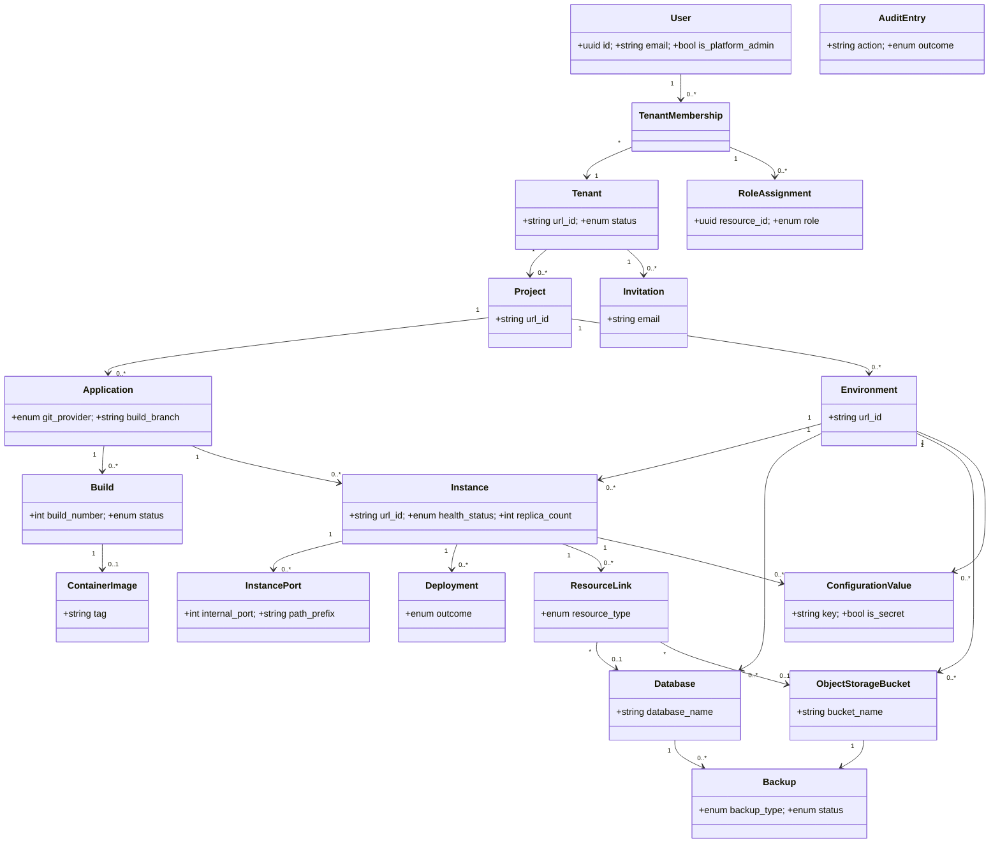

# Requirements: Operations Portal

**Domain:** Multi-tenant application lifecycle management for custom-software delivery `[AI-SUGGESTED]` **Created:** 2026-04-30 **Status:** draft **Last finalised at:** —

> Inferred content is marked `[AI-SUGGESTED]` inline. Field-level marking when only some sub-fields are inferred; heading-level marking when the whole item is invented. The fill-every-field rule applies — no blanks.

---

## 1. Application context

**Name:** Operations Portal

**Purpose / business value:** An interactive web portal for consulting companies (and on-premise customers) to manage build, deployment, execution, and lifecycle operations for custom applications generated by the platform's AI agents. The portal abstracts container orchestration so technical business users — not professional developers or DevOps specialists — can run and manage what they build for their clients. The current scope is an interactive prototype intended to demo the concept to stakeholders and gather feedback before committing to full development.

**Domain:** Application lifecycle management / multi-tenant DevOps platform for custom-software delivery `[AI-SUGGESTED]` (the input documents describe the use case and audience but do not state a named domain).

**Business goal:** Enable technically strong business users at consulting companies to deliver, operate, and monitor custom software for client engagements, with strict tenant and project isolation, without requiring container-orchestration expertise. Up to 100 tenants are supported. The same portal also runs on-premise, where the customer or consulting company manages the installation and internal business units act as tenants.

<!-- rev: run-1 2026-04-30 -->

---

## 2. Domain model

> The BA's framing of the business domain in **ubiquitous language**, implementation-free.

### 2.1 Concepts

| Concept                | Persistence | Definition (ubiquitous language)                                                                                                                  |
| ---------------------- | ----------- | ------------------------------------------------------------------------------------------------------------------------------------------------- |
| User                   | persistent  | A person who uses the portal, uniquely identified by email address and existing at the system level independent of any tenant.                    |
| Tenant                 | persistent  | A consulting company (or, on-premise, an internal business unit) that owns and isolates all its projects and resources.                           |
| Tenant Membership      | persistent  | A user's association with a tenant; the gate through which the user accesses any tenant-scoped resource.                                          |
| Role Assignment        | persistent  | A grant of a named role to a tenant member on a specific tenant, project, or environment.                                                         |
| Project                | persistent  | A client engagement or initiative within a tenant, isolating its environments, applications, and resources from other projects in the same tenant. |
| Environment            | persistent  | A logical grouping (e.g., dev, staging, production) within a project, holding instances and resources that may communicate internally.            |
| Application            | persistent  | A deployable unit of software defined at the project level by linking a Git repository (and optional subdirectory).                               |
| Instance               | persistent  | The per-environment running form of an application; the unit that is deployed, scaled, started, stopped, and monitored.                           |
| Instance Port          | persistent  | An exposed port on an instance with a path prefix, enabling routing through the API gateway.                                                      |
| Build                  | persistent  | The process and record of compiling an application's source from a specific Git commit into a container image.                                    |
| Container Image        | persistent  | A versioned, runnable image produced by a successful build, stored in the platform's container registry.                                          |
| Deployment             | persistent  | A record of deploying a specific container image (build) to an instance, including outcome.                                                       |
| Database               | persistent  | A provisioned PostgreSQL database scoped to an environment, available for linking to instances in the same environment.                           |
| Object Storage Bucket  | persistent  | A provisioned S3-compatible storage bucket scoped to an environment, available for linking to instances in the same environment.                  |
| Resource Link          | persistent  | An association linking a database or storage bucket to an instance in the same environment, with auto-injected connection details.                |
| Configuration Value    | persistent  | A key-value setting at environment level (default) or instance level (override). May be marked as a secret at creation.                           |
| Secret                 | persistent  | A configuration value marked secret at creation; stored encrypted via the secrets backend; values are write-only after creation.                  |
| Audit Entry            | persistent  | An immutable record of a significant action: who did what, where, when, and the outcome.                                                          |
| Backup                 | persistent  | A platform-scheduled or on-demand snapshot of a database or storage bucket; used to restore data on request.                                      |
| Invitation             | persistent  | A pending invite for an email to join a tenant; on acceptance becomes a Tenant Membership (and optional project Role Assignment).                 |
| Platform Administrator | policy      | A system-level role (stored on User) operating above all tenants; manages tenant lifecycle and platform-admin role grants.                         |
| Tenant Status          | derived     | Whether a tenant is `active` or `suspended`; suspension blocks access and stops running instances.                                                |
| Health Status          | derived     | Per-instance state computed from replica health: `running`, `degraded`, `stopped`, or `failed`.                                                   |
| Build Status           | derived     | `queued`, `in_progress`, `succeeded`, `failed`, or `cancelled`.                                                                                   |
| Deployment Outcome     | derived     | `succeeded`, `failed`, or `rolled_back`.                                                                                                          |
| Resource Profile       | policy      | A preset CPU/memory allocation for instances: Small, Medium, Large. Specific allocations to be defined during design phase.                       |
| Health Check           | policy      | Per-instance HTTP probe used to determine replica health; default `GET :8080/health`, port and path overridable per instance.                     |
| Image Retention Policy | policy      | Retain the latest build image, the currently deployed image per instance, and the two most recent prior deployed images per instance; purge rest. |
| Backup Policy          | policy      | Daily backups; daily retained 7 days, weekly retained 30 days; RPO 24h, RTO 4h. Not user-configurable.                                            |
| Audit Retention Policy | policy      | Audit entries retained ≥ 1 year; older entries may be archived to cold storage but must remain retrievable.                                       |
| Telemetry Retention    | policy      | Logs retained 30 days; metrics retained 90 days; older data purged.                                                                               |
| Notification           | policy      | Per-user, in-portal completion notification for asynchronous operations the user invoked; retention is last 50 or 30 days, whichever is smaller.  |

<!-- non-persistent concepts (Tenant Status, Health Status, Build Status, Deployment Outcome, Platform Administrator, all *Policy concepts, Notification) appear here alongside persistent ones; persistent concepts also appear in §7 -->

### 2.2 Relationships

- User **has** Tenant Membership [1:N]
- Tenant Membership **belongs to** Tenant [N:1]
- Tenant Membership **holds** Role Assignment [1:N]
- Tenant **owns** Project [1:N]
- Project **defines** Environment [1:N]
- Project **defines** Application [1:N]
- Application **has** Build [1:N]
- Build **produces** Container Image [1:0..1 — only on successful builds]
- Application × Environment **realises as** Instance [1:1 — one instance per application per environment]
- Instance **exposes** Instance Port [0:N]
- Instance **records** Deployment [1:N]
- Environment **provisions** Database [0:N]
- Environment **provisions** Object Storage Bucket [0:N]
- Instance **links** Database [N:M via Resource Link, same environment]
- Instance **links** Object Storage Bucket [N:M via Resource Link, same environment]
- Environment **defines** Configuration Value [0:N — environment-level defaults]
- Instance **overrides** Configuration Value [0:N — instance-level overrides]
- Configuration Value **may be marked as** Secret [boolean, immutable once true]
- Database **is captured by** Backup [1:N]
- Object Storage Bucket **is captured by** Backup [1:N]
- Tenant Admin **invites** User via Invitation [N:M]
- Every actor's significant action **emits** Audit Entry [1:1]
- Platform Administrator **creates / suspends / reactivates / deletes** Tenant [N:M]

<!-- verbs come from the business; cardinalities are preserved from domain-model-v1.md -->

### 2.3 Aggregates & lifecycles

#### Tenant

| Field            | Value                                                                                                                                                                                              |
| ---------------- | -------------------------------------------------------------------------------------------------------------------------------------------------------------------------------------------------- |
| Member concepts  | Tenant, Tenant Membership, Role Assignment (tenant-scoped), Invitation                                                                                                                              |
| Lifecycle states | created (active) → suspended → reactivated (active) → deleted (only from suspended + empty)                                                                                                         |
| Key invariants   | Cannot delete unless suspended and has no running instances, databases, or storage buckets (PADM-06). Must always have ≥ 1 tenant administrator (RBAC-07). Up to 100 tenants system-wide (NFR-40). |

#### Project

| Field            | Value                                                                                                                  |
| ---------------- | ---------------------------------------------------------------------------------------------------------------------- |
| Member concepts  | Project, Application, Build, Container Image                                                                            |
| Lifecycle states | created → active → deleted (only when empty of resources)                                                               |
| Key invariants   | Cannot delete a project that still has associated resources (PRJ-07). All resources must belong to a project (PRJ-03). |

#### Environment

| Field            | Value                                                                                                                                                                                                            |
| ---------------- | ---------------------------------------------------------------------------------------------------------------------------------------------------------------------------------------------------------------- |
| Member concepts  | Environment, Instance, Instance Port, Database, Object Storage Bucket, Configuration Value (env-level), Secret (env-level), Resource Link                                                                          |
| Lifecycle states | created → active → deleted (only when no running instances, databases, or storage buckets)                                                                                                                        |
| Key invariants   | Cross-environment networking forbidden by default (ENV-04). Up to 100 environments per tenant across all projects (NFR-41). Deletion blocked while resources remain (ENV-09).                                    |

#### Instance

| Field            | Value                                                                                                                                                                                                                                                                                          |
| ---------------- | -------------------------------------------------------------------------------------------------------------------------------------------------------------------------------------------------------------------------------------------------------------------------------------------- |
| Member concepts  | Instance, Instance Port, Deployment, Resource Link, Configuration Value (instance-level), Secret (instance-level)                                                                                                                                                                              |
| Lifecycle states | created (un-deployed) → running ↔ degraded ↔ stopped → failed → deleted                                                                                                                                                                                                                        |
| Key invariants   | Replica count 1–10 (INS-07); stop = replicas 0 (no scale-to-zero shortcut). Linked databases/buckets must be in the same environment (LNK-01). Default health check `GET :8080/health` (INS-13). Rolling update with auto-rollback on health-check failure during rollout (INS-04). |

#### Build

| Field            | Value                                                                                                                                                                                                                                              |
| ---------------- | -------------------------------------------------------------------------------------------------------------------------------------------------------------------------------------------------------------------------------------------------- |
| Member concepts  | Build, Container Image                                                                                                                                                                                                                              |
| Lifecycle states | queued → in_progress → succeeded \| failed \| cancelled                                                                                                                                                                                             |
| Key invariants   | Build number is monotonically increasing per application (BLD-03). Auto-trigger on configured branch and (for monorepos) within the configured subdirectory (BLD-02). System-wide timeout cancels long builds (BLD-12). Cancelled builds are recorded (BLD-14). |

#### Database / Object Storage Bucket

| Field            | Value                                                                                                                                                                                                                       |
| ---------------- | --------------------------------------------------------------------------------------------------------------------------------------------------------------------------------------------------------------------------- |
| Member concepts  | Database (or Object Storage Bucket); associated Resource Links and Backups                                                                                                                                                 |
| Lifecycle states | provisioning → available → deleting (terminal); error if provisioning fails                                                                                                                                                  |
| Key invariants   | Scoped to environment (DB-02, OBJ-03). Deletion blocked while linked; otherwise requires typing the resource name (DB-06, OBJ-02). On delete, links auto-removed and dependent instances automatically restarted (LNK-07). |

### 2.4 Diagram

<!-- rev: run-1 2026-04-30 -->

---

## 3. Target users

> Target-user personas — the end users of the application being designed. Five personas in total: Platform Administrator (system-level), and within a tenant: Tenant Administrator, Project Administrator, Operator, Viewer.

### Platform Administrator

| Field                  | Value                |
| ---------------------- | -------------------- |
| Role / job title       | Platform operator / system administrator at the host organisation that runs the portal across tenants (or the on-premise customer's IT lead). |
| Expertise level        | Technical; comfortable with hosting and tenant administration; not necessarily a developer or DevOps engineer. `[AI-SUGGESTED]` |
| Stakes                 | Very high — actions affect the entire platform and every tenant; mistakes are visible across all customers and may be irreversible. `[AI-SUGGESTED]` |
| Frequency of use       | Low — tenant CRUD and platform-admin grants are sporadic events (new client onboarding, suspension, decommissioning). Derived from `user-tasks-v1.md` §2 (most platform-admin tasks rated Low or Very low). |
| Driving forces — wants | Accurate inventory of tenants and their state; well-confirmed destructive actions; complete platform audit trail for compliance. `[AI-SUGGESTED]` |
| Driving forces — fears | Cross-tenant data leakage; deleting the wrong tenant; demoting the last platform admin and locking out platform administration. `[AI-SUGGESTED]` |

### Tenant Administrator

| Field                  | Value                |
| ---------------------- | -------------------- |
| Role / job title       | Senior member or operations lead at a consulting company (or business unit, on-premise) responsible for users, projects, and tenant settings. |
| Expertise level        | Technical business user with administrative responsibility; understands SSO, user lifecycle, and project organisation. `[AI-SUGGESTED]` |
| Stakes                 | Medium-high — controls who can access what; mistakes can lock out colleagues, expose work to the wrong members, or compromise SSO. `[AI-SUGGESTED]` |
| Frequency of use       | Low — user/project CRUD events; settings changes are very rare. Derived from `user-tasks-v1.md` §3. |
| Driving forces — wants | Clear directory of members and their project assignments; quick invite flow with delivery feedback; a path to recover from misconfigured SSO. `[AI-SUGGESTED]` |
| Driving forces — fears | Locking themselves out by removing the last tenant admin; accidentally deleting projects; SSO misconfigurations that block all users. `[AI-SUGGESTED]` |

### Project Administrator

| Field                  | Value                |
| ---------------------- | -------------------- |
| Role / job title       | Project lead — typically the technical lead on a client engagement, responsible for that project's environments and members. |
| Expertise level        | Technical business user; familiar with software delivery concepts (Git, environments, deployments) but not container orchestration. `[AI-SUGGESTED]` |
| Stakes                 | Medium — mistakes affect the project's team and client deliverables; rarely irreversible. `[AI-SUGGESTED]` |
| Frequency of use       | Low to medium — environment changes, member assignments, integration setup. Derived from `user-tasks-v1.md` §4. |
| Driving forces — wants | Visibility of project health across environments; fast environment provisioning; clear control of who can do what. `[AI-SUGGESTED]` |
| Driving forces — fears | Data loss when reorganising environments; bringing down production by mis-routing deployments; granting too much access. `[AI-SUGGESTED]` |

### Operator

| Field                  | Value                |
| ---------------------- | -------------------- |
| Role / job title       | Day-to-day driver of applications — registers, builds, deploys, monitors, and troubleshoots. The primary daily user of the portal. |
| Expertise level        | Technical business user; comfortable with deployment/configuration concepts and reading logs; not a DevOps specialist. `[AI-SUGGESTED]` (consistent with NFR-01 and the brief's "technically strong business users"). |
| Stakes                 | Medium — keeping client-facing systems healthy; mistakes can take an application down or leak secrets. `[AI-SUGGESTED]` |
| Frequency of use       | Very high — multiple times per day. Derived from `user-tasks-v1.md` §5 (many tasks rated Very high or High). |
| Driving forces — wants | Speed (deploy, restart, view logs in ≤ 3 clicks per NFR-03); clear health and log views during incidents; reliable rollback. `[AI-SUGGESTED]` |
| Driving forces — fears | Deploying broken builds; unclear failure modes and slow log search during incidents; secrets leaking into the UI. `[AI-SUGGESTED]` |

### Viewer

| Field                  | Value                |
| ---------------------- | -------------------- |
| Role / job title       | Read-only stakeholder — product manager, QA, junior team member, or client-side observer monitoring application state. |
| Expertise level        | Mixed; many viewers are less technical than operators. `[AI-SUGGESTED]` |
| Stakes                 | Low — observation only; cannot change state. `[AI-SUGGESTED]` |
| Frequency of use       | High — daily monitoring of dashboards and logs. Derived from `user-tasks-v1.md` §6 (many viewer tasks rated Very high). |
| Driving forces — wants | Quick health overview; easy log/metric access without training; clear "what's broken" signals. `[AI-SUGGESTED]` |
| Driving forces — fears | Misinterpreting status; missing important events; being unable to help diagnose because access is too narrow. `[AI-SUGGESTED]` |

<!-- rev: run-1 2026-04-30 -->

---

## 4. User goals & stories

> Quality signals live on the goal (outcome-level), not the story (behaviour-level).

### 4.1 Goals catalogue

| ID    | Goal statement                                                                                                            | Quality signals                                                                  | Goal kind          | Layout pref (optional)                                            | UX-pattern pref (optional)                                |
| ----- | ------------------------------------------------------------------------------------------------------------------------- | -------------------------------------------------------------------------------- | ------------------ | ----------------------------------------------------------------- | --------------------------------------------------------- |
| G-01  | Authenticate and switch tenant context without re-authenticating.                                                          | speed, clarity, isolation `[AI-SUGGESTED]`                                       | top-level          | global header / login `[AI-SUGGESTED]`                            | tenant switcher dropdown `[AI-SUGGESTED]`                 |
| G-02  | Operate the lifecycle of tenants on the platform (create, suspend, reactivate, delete).                                   | safety, traceability, clarity `[AI-SUGGESTED]`                                   | top-level          | platform-admin console `[AI-SUGGESTED]`                           | confirm-by-typing for destructive ops `[AI-SUGGESTED]`    |
| G-03  | Govern who is a platform administrator while preserving the "at least one platform admin" invariant.                      | safety, traceability `[AI-SUGGESTED]`                                            | top-level          | platform-admin console `[AI-SUGGESTED]`                           | guarded role-grant flow `[AI-SUGGESTED]`                  |
| G-04  | Manage tenant identity providers and tenant settings.                                                                     | clarity, safety `[AI-SUGGESTED]`                                                 | top-level          | tenant settings `[AI-SUGGESTED]`                                  | guarded toggle (e.g., last SSO) `[AI-SUGGESTED]`          |
| G-05  | Manage tenant memberships (invite, deactivate, reactivate, role changes).                                                 | clarity, traceability, safety `[AI-SUGGESTED]`                                   | top-level          | tenant directory `[AI-SUGGESTED]`                                 | invite-by-email + status-of-delivery `[AI-SUGGESTED]`     |
| G-06  | Curate projects within a tenant (create, rename, delete empty).                                                            | clarity, safety `[AI-SUGGESTED]`                                                 | top-level          | projects list `[AI-SUGGESTED]`                                    | empty-only delete with confirmation `[AI-SUGGESTED]`      |
| G-07  | Manage project membership and roles per project / per environment.                                                         | clarity, traceability, safety `[AI-SUGGESTED]`                                   | top-level          | project members tab `[AI-SUGGESTED]`                              | role matrix `[AI-SUGGESTED]`                              |
| G-08  | Configure project environments (create, rename, delete empty).                                                             | clarity, safety `[AI-SUGGESTED]`                                                 | top-level          | project environments tab `[AI-SUGGESTED]`                         | confirm-by-typing for delete `[AI-SUGGESTED]`             |
| G-09  | Register and maintain applications (Git repo, branch, subdirectory, metadata).                                             | clarity, traceability `[AI-SUGGESTED]`                                           | top-level          | applications list `[AI-SUGGESTED]`                                | repo-validation at registration `[AI-SUGGESTED]`          |
| G-10  | Build applications from source — automatically on commit and on demand.                                                    | speed, observability, traceability `[AI-SUGGESTED]`                              | top-level          | application build history `[AI-SUGGESTED]`                        | live-tailed build logs `[AI-SUGGESTED]`                   |
| G-11  | Deploy and manage instances (create, deploy build, start/stop/restart, scale, rollback).                                   | speed (NFR-03 ≤ 3 clicks), safety, observability `[AI-SUGGESTED]`               | top-level          | environment overview / instance detail `[AI-SUGGESTED]`           | rolling-update progress with auto-rollback `[AI-SUGGESTED]` |
| G-12  | Tune instance behaviour (replicas, resource profile, health-check path/port).                                              | clarity, safety `[AI-SUGGESTED]`                                                 | sub-level          | instance settings drawer `[AI-SUGGESTED]`                         | preset selector for resource profile `[AI-SUGGESTED]`     |
| G-13  | Manage configuration values and secrets at environment and instance level with predictable precedence.                    | clarity, safety, traceability `[AI-SUGGESTED]`                                   | top-level          | env/instance config tab `[AI-SUGGESTED]`                          | precedence overlay (env → instance) `[AI-SUGGESTED]`      |
| G-14  | Provision and manage stateful resources (databases and object storage buckets) within an environment.                     | clarity, safety, traceability `[AI-SUGGESTED]`                                   | top-level          | environment resources tab `[AI-SUGGESTED]`                        | confirm-by-typing for delete `[AI-SUGGESTED]`             |
| G-15  | Link/unlink databases or buckets to instances with auto-injected connection details.                                       | clarity, safety, observability `[AI-SUGGESTED]`                                  | sub-level          | instance linked resources panel `[AI-SUGGESTED]`                  | link picker scoped to environment `[AI-SUGGESTED]`        |
| G-16  | Expose instances publicly via the API gateway and view the generated URL.                                                  | clarity, safety `[AI-SUGGESTED]`                                                 | sub-level          | instance networking tab `[AI-SUGGESTED]`                          | toggle + URL copy `[AI-SUGGESTED]`                        |
| G-17  | Monitor health, logs, and metrics of running instances in near real-time.                                                  | speed, observability, clarity `[AI-SUGGESTED]`                                   | top-level          | environment overview / instance detail `[AI-SUGGESTED]`           | log tail + dashboards within portal `[AI-SUGGESTED]`      |
| G-18  | Receive in-portal notifications for completion of asynchronous operations the user invoked.                                | clarity, observability `[AI-SUGGESTED]`                                          | interaction-level  | global notification bell `[AI-SUGGESTED]`                         | in-app toast/center `[AI-SUGGESTED]`                      |
| G-19  | Back up and restore stateful resources (manual on-demand backup, restore to same or different environment).                | safety, traceability `[AI-SUGGESTED]`                                            | top-level          | resource detail / backups tab `[AI-SUGGESTED]`                    | confirm-restore + auto-restart linked instances `[AI-SUGGESTED]` |
| G-20  | Audit operational actions across the system, scoped to the user's permitted view.                                          | traceability, clarity `[AI-SUGGESTED]`                                           | top-level          | audit log view `[AI-SUGGESTED]`                                   | filterable timeline `[AI-SUGGESTED]`                      |

<!-- IDs are stable and referenced from §4.2 stories and §5 task flows. Quality signals are inferred where the inputs do not explicitly state outcome-level qualities. -->

### 4.2 Stories by persona

#### Platform Administrator

##### Story: As a Platform Administrator, I want to onboard a new tenant, so that a consulting company can begin using the portal for its client engagements.

| Field                                    | Value                                                                            |
| ---------------------------------------- | -------------------------------------------------------------------------------- |
| Goal                                     | → §4.1 G-02                                                                       |
| Objective                                | Create the tenant with display name + url_id, assign the first tenant admin, and surface the result in the platform tenant list. |
| Context (frequency / expertise / stakes) | Frequency: Low. Expertise: technical platform operator. Stakes: very high — visibility across all customers. `[AI-SUGGESTED]` |
| Linked task flow (optional)              | → §5 Flow: Onboard a new tenant                                                   |

##### Story: As a Platform Administrator, I want to suspend, reactivate, or delete a tenant safely, so that I can react to non-payment, decommissioning, or compliance events without risking data loss or cross-tenant impact.

| Field                                    | Value                                                                            |
| ---------------------------------------- | -------------------------------------------------------------------------------- |
| Goal                                     | → §4.1 G-02                                                                       |
| Objective                                | Suspend a tenant (blocks members, stops instances, preserves data); reactivate to restore; delete only if suspended and empty, requiring url_id confirmation. |
| Context (frequency / expertise / stakes) | Frequency: Very low. Expertise: technical platform operator. Stakes: very high. `[AI-SUGGESTED]` |
| Linked task flow (optional)              | → §5 Flow: Suspend / delete a tenant                                              |

##### Story: As a Platform Administrator, I want to grant or revoke the platform-admin role on other users, so that platform administration scales beyond a single individual without ever leaving the platform without an admin.

| Field                                    | Value                                                                            |
| ---------------------------------------- | -------------------------------------------------------------------------------- |
| Goal                                     | → §4.1 G-03                                                                       |
| Objective                                | Toggle `is_platform_admin` on users; the system blocks revocation of the last platform admin (PADM-08). |
| Context (frequency / expertise / stakes) | Frequency: Very low. Expertise: technical platform operator. Stakes: very high — the safeguard prevents lockout. `[AI-SUGGESTED]` |
| Linked task flow (optional)              | —                                                                                |

##### Story: As a Platform Administrator, I want to view and search the platform audit trail, so that I can investigate platform-level events and demonstrate compliance.

| Field                                    | Value                                                                            |
| ---------------------------------------- | -------------------------------------------------------------------------------- |
| Goal                                     | → §4.1 G-20                                                                       |
| Objective                                | View per-tenant summaries and platform-level audit entries (creation, suspension, reactivation, deletion, platform-admin role changes — PADM-09). |
| Context (frequency / expertise / stakes) | Frequency: Medium. Expertise: technical platform operator. Stakes: medium — investigation, not change. `[AI-SUGGESTED]` |
| Linked task flow (optional)              | —                                                                                |

#### Tenant Administrator

##### Story: As a Tenant Administrator, I want to invite users to my tenant by email, so that team members can begin working on the right projects with the right roles.

| Field                                    | Value                                                                            |
| ---------------------------------------- | -------------------------------------------------------------------------------- |
| Goal                                     | → §4.1 G-05                                                                       |
| Objective                                | Send an invitation email; if delivery fails, surface the failure and allow re-send (USR-01, USR-02). |
| Context (frequency / expertise / stakes) | Frequency: Low. Expertise: tenant admin. Stakes: medium-high — wrong invites can leak access. `[AI-SUGGESTED]` |
| Linked task flow (optional)              | → §5 Flow: Invite user and assign to project                                      |

##### Story: As a Tenant Administrator, I want to deactivate a member without losing audit history, so that someone leaving the team cannot keep accessing the tenant but their authorship is preserved.

| Field                                    | Value                                                                            |
| ---------------------------------------- | -------------------------------------------------------------------------------- |
| Goal                                     | → §4.1 G-05                                                                       |
| Objective                                | Deactivate the tenant membership (USR-05); reactivate when needed (USR-06).      |
| Context (frequency / expertise / stakes) | Frequency: Low. Expertise: tenant admin. Stakes: medium-high. `[AI-SUGGESTED]`   |
| Linked task flow (optional)              | —                                                                                |

##### Story: As a Tenant Administrator, I want to manage tenant settings and identity providers, so that the tenant follows our SSO policy without ever locking everyone out.

| Field                                    | Value                                                                            |
| ---------------------------------------- | -------------------------------------------------------------------------------- |
| Goal                                     | → §4.1 G-04                                                                       |
| Objective                                | Edit display name and identity-provider list; the system enforces "≥ 1 SSO provider before email/password can be disabled" (AUTH-04). |
| Context (frequency / expertise / stakes) | Frequency: Very low. Expertise: tenant admin. Stakes: high — SSO misconfiguration can lock all users out. `[AI-SUGGESTED]` |
| Linked task flow (optional)              | —                                                                                |

##### Story: As a Tenant Administrator, I want to create a new project for a client engagement, so that the project's environments, applications, and resources are isolated from other clients.

| Field                                    | Value                                                                            |
| ---------------------------------------- | -------------------------------------------------------------------------------- |
| Goal                                     | → §4.1 G-06                                                                       |
| Objective                                | Create the project with display name, url_id, description (PRJ-01).              |
| Context (frequency / expertise / stakes) | Frequency: Low. Expertise: tenant admin. Stakes: medium. `[AI-SUGGESTED]`        |
| Linked task flow (optional)              | —                                                                                |

#### Project Administrator

##### Story: As a Project Administrator, I want to create environments (e.g., dev, staging, production), so that operators can deploy each version to its own isolated runtime.

| Field                                    | Value                                                                            |
| ---------------------------------------- | -------------------------------------------------------------------------------- |
| Goal                                     | → §4.1 G-08                                                                       |
| Objective                                | Create environment with display name + url_id (ENV-01); rename later (ENV-08); delete only if empty (ENV-09). |
| Context (frequency / expertise / stakes) | Frequency: Low. Expertise: project lead. Stakes: medium. `[AI-SUGGESTED]`        |
| Linked task flow (optional)              | —                                                                                |

##### Story: As a Project Administrator, I want to manage project members and their roles per environment, so that production access is granted only to those who should have it.

| Field                                    | Value                                                                            |
| ---------------------------------------- | -------------------------------------------------------------------------------- |
| Goal                                     | → §4.1 G-07                                                                       |
| Objective                                | Assign tenant members; manage roles at project and environment level (USR-08, RBAC-03). |
| Context (frequency / expertise / stakes) | Frequency: Low. Expertise: project lead. Stakes: medium-high — controls production access. `[AI-SUGGESTED]` |
| Linked task flow (optional)              | → §5 Flow: Invite user and assign to project                                      |

##### Story: As a Project Administrator, I want to manage Git provider credentials at project level, so that all applications in the project can be built without each operator wiring credentials.

| Field                                    | Value                                                                            |
| ---------------------------------------- | -------------------------------------------------------------------------------- |
| Goal                                     | → §4.1 G-09                                                                       |
| Objective                                | Store Git credentials as project-level secrets (APP-02).                         |
| Context (frequency / expertise / stakes) | Frequency: Low. Expertise: project lead. Stakes: medium — leaked credentials risk. `[AI-SUGGESTED]` |
| Linked task flow (optional)              | —                                                                                |

#### Operator

##### Story: As an Operator, I want to register a new application by linking a Git repository, so that the platform can begin building it.

| Field                                    | Value                                                                            |
| ---------------------------------------- | -------------------------------------------------------------------------------- |
| Goal                                     | → §4.1 G-09                                                                       |
| Objective                                | Provide Git provider, repo URL, branch, optional subdirectory; portal validates repo access (APP-01, APP-03, BLD-02). |
| Context (frequency / expertise / stakes) | Frequency: Low. Expertise: operator. Stakes: medium. `[AI-SUGGESTED]`            |
| Linked task flow (optional)              | → §5 Flow: Register and first-deploy a new application                            |

##### Story: As an Operator, I want builds to start automatically when I push to the configured branch, and to manually trigger one when I need to, so that I never wait or fight CI.

| Field                                    | Value                                                                            |
| ---------------------------------------- | -------------------------------------------------------------------------------- |
| Goal                                     | → §4.1 G-10                                                                       |
| Objective                                | Auto-trigger on branch commits (BLD-02), filtered by subdirectory for monorepos (BLD-02); manual trigger (BLD-13); cancel in-progress builds (BLD-14). |
| Context (frequency / expertise / stakes) | Frequency: High (build watching). Expertise: operator. Stakes: medium. `[AI-SUGGESTED]` |
| Linked task flow (optional)              | —                                                                                |

##### Story: As an Operator, I want to deploy a specific build to an instance with a rolling update, so that updates happen with minimal downtime and roll back automatically if health checks fail.

| Field                                    | Value                                                                            |
| ---------------------------------------- | -------------------------------------------------------------------------------- |
| Goal                                     | → §4.1 G-11                                                                       |
| Objective                                | Deploy build #N to instance; new replica must pass health check before next old one is removed; auto-rollback on failure (INS-01, INS-04). |
| Context (frequency / expertise / stakes) | Frequency: Medium per instance, High aggregate. Expertise: operator. Stakes: medium-high. `[AI-SUGGESTED]` |
| Linked task flow (optional)              | → §5 Flow: Deploy a new build to an existing instance                             |

##### Story: As an Operator, I want to investigate and recover from a failing instance, so that I can restore service quickly during incidents.

| Field                                    | Value                                                                            |
| ---------------------------------------- | -------------------------------------------------------------------------------- |
| Goal                                     | → §4.1 G-17, G-11                                                                 |
| Objective                                | View health, tail logs (OBS-02, OBS-03); restart, roll back to a previous build (INS-03, INS-05). |
| Context (frequency / expertise / stakes) | Frequency: Very high during incidents. Expertise: operator. Stakes: high. `[AI-SUGGESTED]` |
| Linked task flow (optional)              | → §5 Flow: Investigate and recover from a failed instance                         |

##### Story: As an Operator, I want to provision a database in an environment and link it to an instance, so that the application has the connection details it needs without me copy-pasting credentials.

| Field                                    | Value                                                                            |
| ---------------------------------------- | -------------------------------------------------------------------------------- |
| Goal                                     | → §4.1 G-14, G-15                                                                 |
| Objective                                | Provision DB (DB-01); link to an instance in the same environment; portal injects host/port/credentials (LNK-01, LNK-02). |
| Context (frequency / expertise / stakes) | Frequency: Low (provision), Medium (linking). Expertise: operator. Stakes: medium. `[AI-SUGGESTED]` |
| Linked task flow (optional)              | → §5 Flow: Provision a database and link to instance                              |

##### Story: As an Operator, I want to manage configuration values and secrets at environment and instance levels, so that defaults are shared but specific instances can override.

| Field                                    | Value                                                                            |
| ---------------------------------------- | -------------------------------------------------------------------------------- |
| Goal                                     | → §4.1 G-13                                                                       |
| Objective                                | Set/edit/delete environment-level and instance-level config; mark as secret at creation (CFG-01, CFG-02, CFG-05); rotate secrets (SEC-07); changes restart the instance (CFG-03). |
| Context (frequency / expertise / stakes) | Frequency: Medium. Expertise: operator. Stakes: medium-high — secrets must not leak. `[AI-SUGGESTED]` |
| Linked task flow (optional)              | —                                                                                |

##### Story: As an Operator, I want to expose an instance publicly via the API gateway, so that the application is reachable on its generated URL.

| Field                                    | Value                                                                            |
| ---------------------------------------- | -------------------------------------------------------------------------------- |
| Goal                                     | → §4.1 G-16                                                                       |
| Objective                                | Configure instance ports and path prefixes; portal generates `<app>.<env>.<project>.<tenant>.<portal-domain>` (NET-02, NET-03, NET-04). |
| Context (frequency / expertise / stakes) | Frequency: Low. Expertise: operator. Stakes: medium. `[AI-SUGGESTED]`            |
| Linked task flow (optional)              | —                                                                                |

##### Story: As an Operator, I want to trigger an on-demand backup and restore from a backup point, so that I can protect data before risky changes and recover from accidents.

| Field                                    | Value                                                                            |
| ---------------------------------------- | -------------------------------------------------------------------------------- |
| Goal                                     | → §4.1 G-19                                                                       |
| Objective                                | Trigger manual backup of DB or bucket (NFR-62); request restore to same or different environment within the project (NFR-64); linked instances are auto-restarted. |
| Context (frequency / expertise / stakes) | Frequency: Low (backup), Very low (restore). Expertise: operator. Stakes: high — restore overwrites the target. `[AI-SUGGESTED]` |
| Linked task flow (optional)              | → §5 Flow: Restore a database from a backup                                       |

##### Story: As an Operator, I want completion notifications for long-running operations I invoked, so that I do not have to babysit the page.

| Field                                    | Value                                                                            |
| ---------------------------------------- | -------------------------------------------------------------------------------- |
| Goal                                     | → §4.1 G-18                                                                       |
| Objective                                | Receive notifications for build start/completion, deployment start/completion, and resource provisioning start/completion (NOT-01, NOT-02). |
| Context (frequency / expertise / stakes) | Frequency: very high (passive). Expertise: operator. Stakes: low — informational. `[AI-SUGGESTED]` |
| Linked task flow (optional)              | —                                                                                |

#### Viewer

##### Story: As a Viewer, I want a single environment overview showing instance health and versions, so that I can see at a glance what is running and what is broken.

| Field                                    | Value                                                                            |
| ---------------------------------------- | -------------------------------------------------------------------------------- |
| Goal                                     | → §4.1 G-17                                                                       |
| Objective                                | Read-only access to environment overview, application list, instance health, deployment history (ENV-05, INS-09, INS-06). |
| Context (frequency / expertise / stakes) | Frequency: Very high. Expertise: mixed. Stakes: low. `[AI-SUGGESTED]`            |
| Linked task flow (optional)              | —                                                                                |

##### Story: As a Viewer, I want to view logs and metrics dashboards for an instance, so that I can monitor and diagnose without needing operator privileges.

| Field                                    | Value                                                                            |
| ---------------------------------------- | -------------------------------------------------------------------------------- |
| Goal                                     | → §4.1 G-17                                                                       |
| Objective                                | Filter/search logs, tail in real-time, view CPU/memory/error/restart dashboards, and (for publicly exposed instances) request rate/latency (OBS-02, OBS-03, OBS-12). |
| Context (frequency / expertise / stakes) | Frequency: Very high (logs), High (metrics). Expertise: mixed. Stakes: low. `[AI-SUGGESTED]` |
| Linked task flow (optional)              | —                                                                                |

##### Story: As a Viewer, I want to view configuration values with secrets masked, so that I can understand instance behaviour without ever seeing secret values.

| Field                                    | Value                                                                            |
| ---------------------------------------- | -------------------------------------------------------------------------------- |
| Goal                                     | → §4.1 G-13                                                                       |
| Objective                                | Read-only configuration views with secret values hidden after creation (CFG-01, CFG-02, SEC-04). |
| Context (frequency / expertise / stakes) | Frequency: Medium. Expertise: mixed. Stakes: low. `[AI-SUGGESTED]`               |
| Linked task flow (optional)              | —                                                                                |

#### All authenticated users (cross-cutting persona slice)

##### Story: As any authenticated user, I want to log in once and switch between tenants without re-authenticating, so that working across multiple clients is fast.

| Field                                    | Value                                                                            |
| ---------------------------------------- | -------------------------------------------------------------------------------- |
| Goal                                     | → §4.1 G-01                                                                       |
| Objective                                | Single authenticated session across tenant memberships; switch context without re-auth (AUTH-06, TEN-06). |
| Context (frequency / expertise / stakes) | Frequency: High (login), Medium (switch). Expertise: any. Stakes: low to medium. `[AI-SUGGESTED]` |
| Linked task flow (optional)              | —                                                                                |

##### Story: As any authenticated user, I want to view and edit my own profile (display name), so that the portal shows me as I want to be shown.

| Field                                    | Value                                                                            |
| ---------------------------------------- | -------------------------------------------------------------------------------- |
| Goal                                     | → §4.1 G-01                                                                       |
| Objective                                | View and edit display name; password is managed by the IDP (USR-10).             |
| Context (frequency / expertise / stakes) | Frequency: Low. Expertise: any. Stakes: low. `[AI-SUGGESTED]`                    |
| Linked task flow (optional)              | —                                                                                |

---

## 5. Task flows

> Flows are constructed walkthroughs assembled from stated requirements. Each flow's individual steps trace to specific requirement IDs; the assembly into a step-by-step flow is an inference. `[AI-SUGGESTED]` at the heading level for every flow below unless noted otherwise.

### Flow: Onboard a new tenant `[AI-SUGGESTED]`

| Field                      | Value                                                                                                                                                                                                                            |
| -------------------------- | -------------------------------------------------------------------------------------------------------------------------------------------------------------------------------------------------------------------------------- |
| Actor                      | Platform Administrator (→ §3)                                                                                                                                                                                                    |
| Trigger                    | New consulting-company customer onboarded (or new business unit, on-premise).                                                                                                                                                    |
| Steps                      | (1) Open Tenants list. (2) Create tenant: enter display name and url_id (PADM-02). (3) Specify the first tenant administrator's email (PADM-03). (4) Submit. (5) Tenant appears with status `active` and project count 0 (PADM-04). |
| Decision points            | url_id must be unique and follow naming convention; if first-admin email matches an existing user, that user receives a new tenant membership (USR-01).                                                                          |
| Exception paths            | url_id collision → block with explanation. Email validation failure → block. Audit entry written for the creation (PADM-09).                                                                                                     |
| Role-conditional behaviour | Only Platform Administrators can perform this flow.                                                                                                                                                                              |

### Flow: Suspend / delete a tenant `[AI-SUGGESTED]`

| Field                      | Value                                                                                                                                                                                                                                                          |
| -------------------------- | -------------------------------------------------------------------------------------------------------------------------------------------------------------------------------------------------------------------------------------------------------------- |
| Actor                      | Platform Administrator                                                                                                                                                                                                                                          |
| Trigger                    | Non-payment, decommissioning, or compliance event.                                                                                                                                                                                                              |
| Steps                      | (1) Open Tenants list. (2) Open tenant detail. (3) Suspend (PADM-05) — all members lose access, all running instances stop. (4) When ready to delete, verify tenant has no running instances, databases, or storage buckets. (5) Type the tenant's url_id to confirm (PADM-06). (6) Confirm — deletion is permanent and audited (PADM-09). |
| Decision points            | Suspension is reversible (reactivate → restores access; instances must be re-started by their owners). Deletion only permitted from `suspended` AND empty.                                                                                                     |
| Exception paths            | If tenant has resources, block delete with explanation. If user mistypes url_id, block.                                                                                                                                                                         |
| Role-conditional behaviour | Only Platform Administrators.                                                                                                                                                                                                                                   |

### Flow: Invite user and assign to project `[AI-SUGGESTED]`

| Field                      | Value                                                                                                                                                                                                                                                                                                |
| -------------------------- | ---------------------------------------------------------------------------------------------------------------------------------------------------------------------------------------------------------------------------------------------------------------------------------------------------- |
| Actor                      | Tenant Administrator or Project Administrator                                                                                                                                                                                                                                                       |
| Trigger                    | New team member needs access.                                                                                                                                                                                                                                                                       |
| Steps                      | (1) From tenant directory or project members tab, click Invite. (2) Enter email and (optionally) target project + role (USR-01, USR-08). (3) Send. (4) Portal sends invitation email and creates an Invitation record. (5) Invitee accepts → TenantMembership and (optional) RoleAssignment created. |
| Decision points            | If email already belongs to an existing portal user, only a new TenantMembership is created (USR-01). If invitee never had a portal account, a new User is created on acceptance.                                                                                                                  |
| Exception paths            | Email delivery failure → log and surface to the inviting admin; admin can re-send (USR-02). Invitation expiry → invitation deleted; can be re-sent.                                                                                                                                                  |
| Role-conditional behaviour | Tenant Admins can invite to any project; Project Admins can invite only to their project (USR-08).                                                                                                                                                                                                  |

### Flow: First-time user accepts invitation `[AI-SUGGESTED]`

| Field                      | Value                                                                                                                                                                                                  |
| -------------------------- | ------------------------------------------------------------------------------------------------------------------------------------------------------------------------------------------------------ |
| Actor                      | Invited user (any persona)                                                                                                                                                                              |
| Trigger                    | Receipt of invitation email.                                                                                                                                                                            |
| Steps                      | (1) Click invitation link. (2) Authenticate via the configured identity provider(s) (AUTH-01..04). (3) On success, TenantMembership (and optional RoleAssignment) is provisioned. (4) Land on tenant home. |
| Decision points            | If email/password is disabled at tenant level, must use an SSO provider (AUTH-04).                                                                                                                      |
| Exception paths            | Authentication failure → standard auth error path; failed attempts logged (AUTH-05).                                                                                                                    |
| Role-conditional behaviour | Tenant context is determined by the invitation; user lands in that tenant.                                                                                                                              |

### Flow: Register and first-deploy a new application `[AI-SUGGESTED]`

| Field                      | Value                                                                                                                                                                                                                                                                                                                                                                                  |
| -------------------------- | -------------------------------------------------------------------------------------------------------------------------------------------------------------------------------------------------------------------------------------------------------------------------------------------------------------------------------------------------------------------------------------- |
| Actor                      | Operator                                                                                                                                                                                                                                                                                                                                                                                |
| Trigger                    | New application required for a project.                                                                                                                                                                                                                                                                                                                                                 |
| Steps                      | (1) Open project applications list. (2) Register: name, description, Git provider (GitHub/BitBucket), repo URL, branch, optional subdirectory (APP-01, APP-03, BLD-02). (3) Portal validates repo access (APP-01) — succeeds. (4) Initial automatic build runs on next branch commit, or operator triggers a manual build (BLD-13). (5) On build success, image pushed to registry (REG-02). (6) Operator creates an instance in target environment (T-INS-03a / inferred INS-01a — see §6.1 commentary), choosing replica count and resource profile (INS-07, INS-10). (7) Deploy build #N (INS-01); rolling update with health check (INS-04). |
| Decision points            | If repo credentials missing, build fails with clear error (APP-01). If build fails, fix source and retry (BLD-07). If health check fails during deployment, auto-rollback (INS-04).                                                                                                                                                                                                     |
| Exception paths            | Cancel in-progress build (BLD-14). Roll back to previous build manually (INS-05).                                                                                                                                                                                                                                                                                                       |
| Role-conditional behaviour | Operator can register, build, and deploy. Viewer can observe but not change.                                                                                                                                                                                                                                                                                                            |

### Flow: Deploy a new build to an existing instance `[AI-SUGGESTED]`

| Field                      | Value                                                                                                                                                                          |
| -------------------------- | ------------------------------------------------------------------------------------------------------------------------------------------------------------------------------ |
| Actor                      | Operator                                                                                                                                                                        |
| Trigger                    | New build #N succeeded; ready to roll out.                                                                                                                                     |
| Steps                      | (1) Open instance detail. (2) Choose Deploy. (3) Select build #N. (4) Confirm. (5) Rolling update begins; new replica must pass health check before next old replica is removed (INS-04). (6) Outcome recorded in Deployment history (INS-06). |
| Decision points            | If new replica fails health check, rollout halts and rolls back automatically (INS-04). User may also manually roll back to a previous build (INS-05).                          |
| Exception paths            | Build not found / image purged (REG-04 retains current + 2 prior + latest only). Deployment failure → rolled-back outcome recorded (INS-06).                                   |
| Role-conditional behaviour | Operator only on the relevant project/environment (RBAC-03).                                                                                                                    |

### Flow: Investigate and recover from a failed instance `[AI-SUGGESTED]`

| Field                      | Value                                                                                                                                                                                                                                                                          |
| -------------------------- | ------------------------------------------------------------------------------------------------------------------------------------------------------------------------------------------------------------------------------------------------------------------------------ |
| Actor                      | Operator                                                                                                                                                                                                                                                                        |
| Trigger                    | Health changes to `degraded` or `failed` (INS-09).                                                                                                                                                                                                                              |
| Steps                      | (1) Receive notification or notice on environment overview (NOT-02, ENV-05). (2) Open instance detail. (3) Tail logs (OBS-03), filter by ERROR (OBS-02). (4) Inspect dashboards (OBS-12). (5) Restart instance (INS-03) or roll back to a previous build (INS-05). (6) If recovery requires data, restore from backup (NFR-64) — see separate flow. |
| Decision points            | Pure transient failure → restart. Bad code → rollback. Data corruption → restore.                                                                                                                                                                                              |
| Exception paths            | Rollback target image purged → choose a different prior image still retained (REG-04).                                                                                                                                                                                          |
| Role-conditional behaviour | Operator can act; Viewer can observe.                                                                                                                                                                                                                                           |

### Flow: Provision a database and link to instance `[AI-SUGGESTED]`

| Field                      | Value                                                                                                                                                                                                                                                                                                |
| -------------------------- | ---------------------------------------------------------------------------------------------------------------------------------------------------------------------------------------------------------------------------------------------------------------------------------------------------- |
| Actor                      | Operator                                                                                                                                                                                                                                                                                              |
| Trigger                    | Application requires a database in a given environment.                                                                                                                                                                                                                                               |
| Steps                      | (1) Open environment resources tab. (2) Create database: choose `database_name` (also URI slug). (3) Database moves through `provisioning` → `available`. (4) From the instance's Linked Resources view (or from the resource drawer), Link the database (LNK-01). (5) Portal injects host/port/db_name as configuration and credentials as secrets (LNK-02). (6) Instance restarts to pick up new config (CFG-03). |
| Decision points            | If linking a resource that is not in the same environment, block (LNK-01).                                                                                                                                                                                                                            |
| Exception paths            | Provisioning error → bucket/db marked `error`. Unlink → injected details removed; instance restarted (LNK-06). Resource deletion → all links removed; affected instances restarted (LNK-07).                                                                                                          |
| Role-conditional behaviour | Operator only.                                                                                                                                                                                                                                                                                        |

### Flow: Restore a database (or bucket) from a backup `[AI-SUGGESTED]`

| Field                      | Value                                                                                                                                                                                                                          |
| -------------------------- | ------------------------------------------------------------------------------------------------------------------------------------------------------------------------------------------------------------------------------ |
| Actor                      | Operator                                                                                                                                                                                                                        |
| Trigger                    | Data accident or pre-migration safety step.                                                                                                                                                                                     |
| Steps                      | (1) Open the resource's backups view. (2) Choose a backup point (NFR-63). (3) Select target: same environment or another environment in the same project (NFR-64). (4) Confirm restore — destructive overwrite. (5) Linked instances are auto-restarted on completion (NFR-64). (6) Audit entry written (NFR-65). |
| Decision points            | Restore overwrites the target — confirmation must be explicit (NFR-64).                                                                                                                                                         |
| Exception paths            | Backup unavailable / failed → cannot restore from that point.                                                                                                                                                                   |
| Role-conditional behaviour | Operator only.                                                                                                                                                                                                                  |

### Flow: Configure public access for an instance `[AI-SUGGESTED]`

| Field                      | Value                                                                                                                                                                                                                  |
| -------------------------- | ---------------------------------------------------------------------------------------------------------------------------------------------------------------------------------------------------------------------- |
| Actor                      | Operator                                                                                                                                                                                                                |
| Trigger                    | Application needs to be reachable publicly.                                                                                                                                                                            |
| Steps                      | (1) Open instance networking tab. (2) Add an Instance Port (port + path prefix). (3) Save. (4) Portal generates a public URL: `<app-identifier>.<env-identifier>.<project-identifier>.<tenant-identifier>.<portal-domain>` (NET-04). |
| Decision points            | Path prefix must be unique within the instance.                                                                                                                                                                         |
| Exception paths            | Removing all instance ports makes the instance private again by default (NET-02).                                                                                                                                       |
| Role-conditional behaviour | Operator only.                                                                                                                                                                                                          |

<!-- rev: run-1 2026-04-30 -->

---

## 6. Requirements

### 6.1 Functional

> Requirement IDs are preserved verbatim from `input/requirements-v1.md`. Gaps in the source numbering (RBAC-02, INS-08, INS-12) are noted at end. `INS-01a` is referenced by `user-tasks-v1.md` but missing from `requirements-v1.md`; reconstructed below as INS-01a `[AI-SUGGESTED]`.

#### Authentication & Identity

- AUTH-01 — Support login via Google OAuth 2.0.
- AUTH-02 — Support login via Microsoft (Azure AD / Entra ID).
- AUTH-03 — Support login via OpenID Connect (OIDC) identity providers.
- AUTH-04 — Support email/password authentication alongside SSO. Tenant administrators may disable email/password to enforce SSO-only login; at least one SSO provider must be enabled before email/password can be disabled.
- AUTH-05 — All authentication events (login, logout, failed attempts) are recorded in the audit trail.
- AUTH-06 — On session timeout, redirect to login. Users with multiple tenant memberships have a single authenticated session and switch tenant context without re-authenticating.

#### Multi-Tenancy

- TEN-01 — Support multiple tenants (up to 100) with full data and resource isolation.
- TEN-02 — Compute isolation between tenants enforced at infrastructure level.
- TEN-03 — Each tenant has isolated databases (no shared database instances).
- TEN-04 — Each tenant has isolated file storage volumes.
- TEN-05 — Tenant administrators manage memberships, roles, and projects within their tenant.
- TEN-06 — Cross-tenant data access prohibited; users operate in one tenant context at a time, no leakage between contexts.
- TEN-07 — Tenant-level configuration of tenant name and allowed identity providers.

#### Project Isolation

- PRJ-01 — Tenants support multiple projects.
- PRJ-02 — Strict access isolation: users see only assigned projects.
- PRJ-03 — Resources belong to a project and are not shared across projects. Environments and applications scope to project; databases, storage, secrets, and configuration scope to environment within a project; secrets and configuration may further scope to a specific instance (DB-02, OBJ-03, SEC-06, CFG-01, CFG-02).
- PRJ-04 — Users assigned to projects by a tenant or project administrator.
- PRJ-05 — Users may have different roles on different projects in the same tenant.
- PRJ-06 — Project name and description editable by project administrators.
- PRJ-07 — Empty projects deletable by tenant administrators with explicit confirmation; deletion of non-empty projects blocked.
- PRJ-08 — Project dashboard showing all environments, applications, and statuses.

#### Platform Administration

- PADM-01 — Platform Administrator role at the system level, above tenants.
- PADM-02 — Platform admins can create tenants (display name + url_id).
- PADM-03 — Platform admins assign the first tenant administrator at tenant creation.
- PADM-04 — Platform admins view a list of tenants (display name, status, creation date, project count). May not view tenant-internal data.
- PADM-05 — Suspend a tenant (blocks members, stops running instances, preserves data) and reactivate.
- PADM-06 — Delete a tenant only if suspended and empty (no running instances, databases, storage buckets); requires typing url_id; permanent and audited.
- PADM-07 — First platform admin created during installation via setup or seed.
- PADM-08 — Grant/revoke platform admin role; system prevents removal of the last platform admin.
- PADM-09 — All platform admin actions audited.
- PADM-10 — Per-tenant summary (counts only, no internal data) viewable by platform admins.

#### Role-Based Access Control

- RBAC-01 — Enforce RBAC for all operations.
- RBAC-03 — Roles assignable at four levels: platform-wide, tenant-wide, per-project, per-environment.
- RBAC-04 — Granular permissions covering project, application, environment, data storage, secrets, user management, and audit viewing. Detailed action-to-role matrix to be defined during design phase (see §6.5 for first-pass `[AI-SUGGESTED]` matrix).
- RBAC-05 — Default roles only in v1: Platform Admin, Tenant Admin, Project Admin, Operator, Viewer. No custom roles.
- RBAC-06 — Role assignments audited.
- RBAC-07 — Each tenant always has ≥ 1 tenant administrator; system prevents any action that would remove the last.

> Source numbering gap: `RBAC-02` is absent from `requirements-v1.md`. No content to reconstruct; treated as a numbering gap, not a missing requirement.

#### User Management

- USR-01 — Tenant admins invite users by email; new email creates a new user account; existing email gets a new tenant membership.
- USR-02 — Invitation email sent; delivery failures logged and surfaced to inviter; re-send supported.
- USR-04 — Tenant admins view tenant directory (project assignments, roles, last login). No visibility into other tenants' memberships.
- USR-05 — Tenant admins deactivate a user's tenant membership; audit history and resource attribution preserved.
- USR-06 — Tenant admins reactivate a deactivated tenant membership.
- USR-07 — Project admins view project user directory (roles per project and environment).
- USR-08 — Project admins assign tenant members to project, remove them, manage their roles. Project admins may also invite new users to the tenant; such invitees are auto-assigned to the project.
- USR-09 — All user management actions audited.
- USR-10 — Users view and edit their own profile (display name). Password managed by IDP. Session management not in v1; backend-persisted user preferences (last-used tenant/project for routing) are not session management.

#### Application Management

- APP-01 — Register an application by linking a Git repository (GitHub, BitBucket). Validate repo access at registration. If credentials become invalid later, builds fail with a clear error.
- APP-02 — Git credentials stored as project-level secrets.
- APP-03 — Multiple applications may share a Git repository (monorepo); each application may specify a subdirectory; default is repo root.
- APP-04 — View list of applications in a project.
- APP-05 — View application detail (definition + per-environment instance breakdown with build number and health status).
- APP-06 — Edit application metadata (name, description).
- APP-07 — Delete application only if no running instances; explicit confirmation; audited.

#### Resource Linking

- LNK-01 — Link a database or bucket to an instance; both must be in the same environment.
- LNK-02 — On linking a database, inject host/port/database name as configuration and credentials as secrets.
- LNK-04 — On linking a bucket, inject endpoint URL/access key/secret key/bucket name via configuration or secrets.
- LNK-05 — View all databases and buckets linked to an instance.
- LNK-06 — Unlink removes injected details and auto-restarts the instance.
- LNK-07 — Deleting a database or bucket removes all links; affected instances auto-restart.
- LNK-08 — Link/unlink changes audited.

#### Build & Containerisation

- BLD-01 — Built-in build system; no external CI required.
- BLD-02 — Each application has a configured build branch (set at registration, editable). Branch commits auto-trigger builds; for monorepos, only changes within the configured subdirectory trigger builds.
- BLD-03 — Each build produces an image tagged with the Git commit SHA and assigned a sequential build number per application. Build number is the user-facing version; SHA shown in build details.
- BLD-04 — Build logs captured and viewable in real time and after completion.
- BLD-05 — Build status (queued/in-progress/succeeded/failed) visible.
- BLD-06 — Build history retained: build number, who triggered, source commit, duration, outcome.
- BLD-07 — Failed builds provide clear error output.
- BLD-12 — Standard platform-provided build image; fixed resource allocations; system-wide timeout cancels and marks failed.
- BLD-13 — Manual build trigger.
- BLD-14 — Cancel an in-progress build; recorded as cancelled in history.

#### Container Registry

- REG-01 — Built-in container registry as part of platform infrastructure.
- REG-02 — Successful builds auto-push images to registry.
- REG-03 — Tenant and project isolation enforced at registry level.
- REG-04 — Image retention: keep latest build image, currently deployed image, and the two most recent prior deployed images per instance; auto-delete others.

#### Environment Management

- ENV-01 — Project admins define environments. Per-tenant environment limit per NFR-41.
- ENV-02 — Environments are logically isolated (own instances, configuration, databases, storage).
- ENV-03 — Same-environment instances communicate via internal networking.
- ENV-04 — Different-environment instances cannot communicate by default.
- ENV-05 — Environment overview screen: all instances (with versions and health), databases, buckets.
- ENV-06 — Environment-level configuration (key-value + secrets) manageable independently of instance-level; environment defaults overridable at instance level.
- ENV-07 — No automated promotion between environments; users deploy specific versions per environment.
- ENV-08 — Project admins edit environment display name.
- ENV-09 — Project admins delete an environment only if it has no running instances, databases, or storage buckets; explicit confirmation required.

#### Instance Management

- INS-01 — Deploy a specific build to an existing instance (rolling update).
- INS-01a `[AI-SUGGESTED]` — Operators can create a new instance of an application in an environment, choosing initial replica count and resource profile, and (optionally) selecting an initial build to deploy. (Reconstructed from `user-tasks-v1.md` T-INS-03a, which references INS-01a; the requirement is implied but absent from `requirements-v1.md`.)
- INS-02 — Portal manages all underlying infrastructure resources without exposing orchestration concepts.
- INS-03 — Start, stop, restart an instance.
- INS-04 — Rolling updates: new replica must pass health check before next old replica is removed; if a new replica fails, halt and roll back automatically.
- INS-05 — Roll back to a previously deployed build.
- INS-06 — Deployment history per instance: who deployed which build, when, outcome.
- INS-07 — Replicas configurable 1–10 (manual scaling). No scale-to-zero — use stop (INS-03) which sets replicas to 0; starting restores the previously configured count.
- INS-09 — Health states: Running (all replicas healthy); Degraded (some healthy, some failing); Stopped (replicas = 0 by user); Failed (all failing or unable to start).
- INS-10 — CPU/memory configurable per instance within project and tenant constraints; preset profiles Small/Medium/Large.
- INS-11 — Default profiles Small, Medium, Large; allocations to be defined during design.
- INS-13 — Default health check: HTTP `GET :8080/health`, expects 200. Interval/timeout/threshold to be defined during design. Port and path overridable per instance.
- INS-14 — Override health check path and port per instance.

> Source numbering gaps: `INS-08` and `INS-12` absent from `requirements-v1.md`. No content to reconstruct.

#### Database Management

- DB-01 — Provision PostgreSQL databases. Same-environment databases isolated at database level (separate database, not shared schemas). PostgreSQL version to be defined during design.
- DB-02 — Each database scoped to an environment.
- DB-03 — View databases in an environment, statuses, and instances using them.
- DB-04 — Backups managed by platform-wide backup system (§ NFR-60..66).
- DB-05 — When linked to an instance, connection details auto-injected as configuration/secrets.
- DB-06 — Delete blocked while linked to any instance; otherwise requires typing the database name; permanent; audited.
- DB-07 — Schema migrations are the application's responsibility.

#### Object Storage

- OBJ-01 — Provision S3-compatible buckets.
- OBJ-02 — Create/view/delete buckets. Delete blocked while linked; otherwise requires typing the bucket name; permanent; audited.
- OBJ-03 — Buckets scoped to an environment.
- OBJ-04 — When linked, inject endpoint URL/access key/secret key/bucket name via configuration/secrets.
- OBJ-05 — Display bucket usage (object count, total size).
- OBJ-06 — Buckets included in platform backup system.

#### Configuration Management

- CFG-01 — Environment-level config values (key-value) apply as defaults to all instances.
- CFG-02 — Per-instance config values override environment defaults where keys overlap.
- CFG-03 — Configuration changes auto-restart running instances.
- CFG-05 — Config values may be marked secret at creation; secret values stored encrypted via the secrets backend. Secret marking is immutable — to convert to plain, delete and recreate.

#### Secrets Management

- SEC-01 — Secrets management capability for sensitive values.
- SEC-02 — Secrets encrypted at rest in a dedicated secrets backend.
- SEC-03 — Secrets injectable into instances.
- SEC-04 — Secret values not displayed in UI after creation (write-only; metadata visible).
- SEC-05 — Secret access and modification audited.
- SEC-06 — Secrets scoped to environment; defined at environment or instance level; instance overrides environment (same precedence as configuration).
- SEC-07 — Rotate secret value, creating a new version.
- SEC-08 — Secret version history (metadata only — no previous values).

#### Networking & API Gateway

- NET-01 — Same-environment instances discover each other via internal DNS at `<application-identifier>` hostname; portal displays internal address.
- NET-02 — Instances private by default; public access via API gateway.
- NET-03 — Configure which instances are public.
- NET-04 — Generated public URL format: `<app-identifier>.<environment-identifier>.<project-identifier>.<tenant-identifier>.<portal-domain>`.

#### Observability — Logging

- OBS-01 — Collect and store logs from all instances.
- OBS-02 — Per-instance log view with filtering by time range, search keywords, severity (DEBUG/INFO/WARN/ERROR). Time range bounded by retention.
- OBS-03 — Near real-time log viewing (streaming/tail).

#### Observability — Metrics & Dashboards

- OBS-10 — Collect metrics from instances and infrastructure.
- OBS-11 — Native built-in dashboards rendered in the portal.
- OBS-12 — Default dashboards: CPU/memory per instance, error rates, container restart counts. For publicly exposed instances, also request rates and latencies.
- OBS-13 — Logs retained 30 days; metrics retained 90 days; older data auto-purged.

#### Notifications

- NOT-01 — Deliver completion notifications to the user for asynchronous operations they invoke.
- NOT-02 — Notification events: build start/completion (succeeded/failed/cancelled), deployment start/completion (succeeded/failed/rolled-back), resource provisioning start/completion (database, object storage bucket).
- NOT-03 — Per-user notification retention: last 50 notifications or 30 days, whichever is smaller.

#### Audit Trail

- AUD-01 — Full operational audit trail covering all significant actions.
- AUD-02 — Audited events include platform admin actions, auth events, user/role changes, project CRUD, project assignments, application CRUD, build triggers and outcomes, instance actions (deploy/rollback/start/stop), resource linking/unlinking, configuration and secret changes, database operations, environment management, and gateway/networking changes.
- AUD-03 — Each audit entry: timestamp, acting user, tenant, project, environment (where applicable), action, target resource, outcome.
- AUD-04 — Audit logs searchable/filterable by user, project, action, resource, time range, environment. Visibility scoped to the user's role.
- AUD-05 — Audit logs immutable.
- AUD-06 — Retention ≥ 1 year; older may be archived to cold storage but must remain retrievable. Retention/archival policy to be defined during design.

#### Out of scope (preserved from `requirements-v1.md` §20)

AI-agent functionality; source-code editing; billing/metering; environment promotion workflows; infrastructure provisioning; database schema migrations; CLI tooling; advanced deployment strategies (blue-green, canary, traffic split); cross-region failover; i18n/l10n; persistent file volumes (v2); auth proxy for hosted apps (v2); alerting/webhooks (v2); custom domains and advanced gateway routing (v2); usage tracking/reporting (v2); public REST API (v2).

#### Technology decisions (preserved from `requirements-v1.md` §21)

Container orchestration: Kubernetes. Metrics: Prometheus. Dashboards: Native (portal-built, querying Prometheus). Observability export: OpenTelemetry. Supported databases: PostgreSQL.

### 6.2 Business rules

| ID    | Statement (when / then)                                                                                                                                                                                                                       | Enforcement point | Source                                          | Severity  |
| ----- | --------------------------------------------------------------------------------------------------------------------------------------------------------------------------------------------------------------------------------------------- | ----------------- | ----------------------------------------------- | --------- |
| BR-01 | When an action would leave a tenant with zero tenant administrators (role reassignment, deactivation, or membership removal), then block the action.                                                                                          | service           | → §2.3 Tenant invariant; → RBAC-07              | blocker   |
| BR-02 | When an action would remove the last platform administrator (revoke or deactivate), then block the action.                                                                                                                                    | service           | → PADM-08                                       | blocker   |
| BR-03 | When attempting to delete a tenant, then block unless tenant is `suspended` AND has no running instances, databases, or storage buckets, AND the user has typed the url_id to confirm.                                                          | service           | → PADM-06                                       | blocker   |
| BR-04 | When attempting to delete a project, then block if it still has any associated resources (environments, applications, databases, buckets, secrets, configuration).                                                                            | service           | → PRJ-07; → §2.3 Project invariant              | blocker   |
| BR-05 | When attempting to delete an environment, then block unless it has no running instances, databases, or storage buckets, and require explicit confirmation.                                                                                    | service           | → ENV-09                                         | blocker   |
| BR-06 | When attempting to delete an application, then block unless it has no running instances; require explicit confirmation; record audit entry.                                                                                                   | service           | → APP-07                                         | blocker   |
| BR-07 | When attempting to delete a database, then block if it is linked to any instance; otherwise require typing the database name to confirm; record audit entry.                                                                                    | service           | → DB-06                                          | blocker   |
| BR-08 | When attempting to delete an object storage bucket, then block if it is linked to any instance; otherwise require typing the bucket name to confirm; record audit entry.                                                                        | service           | → OBJ-02                                         | blocker   |
| BR-09 | When linking a database or bucket to an instance, then both must be in the same environment.                                                                                                                                                  | service           | → LNK-01                                         | blocker   |
| BR-10 | When disabling email/password authentication on a tenant, then at least one SSO provider (Google/Microsoft/OIDC) must remain enabled.                                                                                                         | service           | → AUTH-04                                        | blocker   |
| BR-11 | When a user is suspended at tenant level (i.e., tenant `status = suspended`), then prevent all tenant members from accessing the tenant and stop all running instances; do not delete data.                                                    | service           | → PADM-05                                        | major     |
| BR-12 | When a build branch (or, for monorepos, the configured subdirectory) receives a commit, then automatically trigger a build for the application.                                                                                              | service           | → BLD-02                                         | major     |
| BR-13 | When a build exceeds the system-wide timeout, then automatically cancel and mark it as failed.                                                                                                                                                | service           | → BLD-12                                         | major     |
| BR-14 | When a configuration value (plain or secret) is created, updated, or deleted at environment or instance level, then automatically restart the affected instance(s).                                                                            | service           | → CFG-03; → SEC-06                               | major     |
| BR-15 | When a database or storage bucket is unlinked from an instance, then remove injected connection details and restart the instance.                                                                                                             | service           | → LNK-06                                         | major     |
| BR-16 | When a database or storage bucket is deleted, then remove all links to it and restart all affected instances.                                                                                                                                  | service           | → LNK-07                                         | major     |
| BR-17 | When a new replica fails its health check during a rolling update, then halt the rollout and automatically roll back to the previous version.                                                                                                  | service           | → INS-04                                         | blocker   |
| BR-18 | When a new url_id is created for a tenant, project, environment, or instance, then it must be lowercase alphanumeric with hyphens, immutable, and unique within its scope.                                                                    | service / data    | → "Naming Convention" in `requirements-v1.md` §2 | blocker   |
| BR-19 | When a configuration value is created with `is_secret = true`, then `is_secret` cannot be changed; converting to plain requires delete + recreate.                                                                                            | service           | → CFG-05                                         | major     |
| BR-20 | When stopping an instance, then set replicas to 0 and remember the previous replica count; on starting, restore the previously configured replica count.                                                                                      | service           | → INS-03; → INS-07                               | major     |
| BR-21 | When restoring a database or bucket from a backup, then fully overwrite the target resource and automatically restart all instances linked to it.                                                                                              | service           | → NFR-64                                         | blocker   |
| BR-22 | When the action is destructive (delete tenant/project/environment/application/database/bucket; restore from backup; remove last admin), then require explicit confirmation appropriate to severity (typed url_id/name where specified).        | UI / service      | → PADM-06, PRJ-07, ENV-09, APP-07, DB-06, OBJ-02, NFR-64 | major     |
| BR-23 | When a tenant administrator views directories, audit logs, or summaries, then they must not see other tenants' memberships, projects, audit data, or internal data.                                                                            | service           | → TEN-06; → USR-04; → PADM-04                    | blocker   |
| BR-24 | When suspending a tenant, then all running instances must stop; data (databases, buckets, configuration, secrets) is preserved unchanged.                                                                                                     | service           | → PADM-05                                        | major     |
| BR-25 | When a build succeeds, then the produced container image must be auto-pushed to the registry; image retention follows REG-04 (latest, currently deployed, two most recent prior deployed per instance).                                       | service           | → REG-02; → REG-04                               | major     |

### 6.3 Data

> Storage shapes and FK plumbing are detailed in §7. Cross-cutting data requirements:

- Tenants must be isolated at the database, storage, compute, and networking layers (TEN-02..04, NFR-12).
- Each project's resources are not shared across projects (PRJ-03); environments isolate instances, configuration, databases, and storage within a project (ENV-02).
- Audit log entries are immutable, retained ≥ 1 year, archivable to cold storage but always retrievable (AUD-05, AUD-06).
- Logs retained 30 days; metrics retained 90 days; auto-purged thereafter (OBS-13).
- Backups: daily auto-backups for stateful resources (databases, storage, configuration, secrets, portal state). Daily retained 7 days, weekly retained 30 days. Manual on-demand backups supported. RPO 24h / RTO 4h. (NFR-60..66).
- Sensitive data (secrets, credentials) encrypted at rest and in transit (NFR-14, SEC-02).
- Secret values stored only in the dedicated secrets backend; the portal stores only the vault path/key reference, never the secret value itself (CFG-05, SEC-04).
- Container registry images scoped per project; retained per REG-04 policy.
- Notifications retained per user: last 50 or 30 days, whichever is smaller (NOT-03).
- url_id immutability: tenant, project, environment, instance url_ids are immutable post-creation; database_name and bucket_name play the same role for those resources and are immutable.
- Display names are mutable; changing a display name does not affect infrastructure references (which use url_ids).
- Volumetric guidance (see §10): up to 100 tenants; up to 100 environments per tenant.

### 6.4 User-facing

- Single-page enterprise console layout: fixed top bar, persistent left sidebar, main content area (per `brief.md` Layout Preferences).
- Always-visible sidebar with clear section grouping; medium density; desktop only.
- Common operations (deploy, view logs, check status) reachable in ≤ 3 clicks from the project dashboard (NFR-03).
- Use business-friendly terminology: "application", "instance", "environment". Do not surface "pod", "deployment", "replica set", "namespace". The word "service" is reserved for in-application backend services and not used in the portal UI for runtime units (NFR-02; `requirements-v1.md` §2 Note).
- Support modern evergreen browsers — Chrome, Firefox, Edge, Safari (NFR-04). Mobile and offline are not supported. The brief explicitly states mobile responsiveness is not required.
- Visual style per `brief.md`: clean enterprise SaaS UI; only the provided color tokens; flat design (no heavy shadows or gradients); maximum 2 colors per component; cards with subtle borders; minimal/readable typography. Calm, structured, professional; no visual noise.
- Confirmations for destructive actions are explicit (typing url_id for tenant deletion; typing database_name / bucket_name for those deletions; explicit confirm for project, environment, application deletion and for restore).
- Real-time log streaming/tailing in instance detail views (OBS-03); filterable by time, severity, and keywords (OBS-02).
- Native, in-portal dashboards (OBS-11); request rate / latency dashboards added automatically for publicly exposed instances (OBS-12).
- In-portal notification centre for the notifications defined in NOT-01..03; notifications are per-user and bound to operations the user invoked.
- Deployment progress visualises rolling-update state and surfaces auto-rollback when triggered (INS-04).
- Configuration screens show environment defaults with instance overrides clearly distinguished (CFG-01, CFG-02). Secrets are masked after creation (SEC-04); secret history shows metadata only (SEC-08).
- Tenant switcher in the global header for users with multiple memberships (AUTH-06).
- Audit log view filterable per AUD-04; visibility scoped per role.
- Empty / error states are explicit and actionable (e.g., "Repo unreachable" with re-validation; "Build timed out" with re-trigger; "Environment empty — create your first instance"). `[AI-SUGGESTED]`
- Demo prototype constraints: realistic mock data, not lorem ipsum (`brief.md` constraints).

<!-- rev: run-1 2026-04-30 -->

### 6.5 Access control (RBAC) `[AI-SUGGESTED]`

> RBAC-04 explicitly defers the action-to-role permission matrix to the design phase. The matrix below is a first-pass synthesis from the requirements and user-task catalogue, marked `[AI-SUGGESTED]` at section level. Cells may be tightened during design.
>
> **Action vocabulary:** `C` create · `R` read · `U` update · `D` delete · `X` execute / invoke · `A` approve · `—` no access. Suffix with a BR ref for conditional access (e.g. `D†BR-04` = delete gated by BR-04).
>
> **Roles** (→ §3): Platform Admin (PA), Tenant Admin (TA), Project Admin (PrA), Operator (Op), Viewer (Vi). Per RBAC-03, roles are scoped: TA is tenant-wide; PrA is per-project; Op and Vi are per-project (and may be further refined per-environment per RBAC-03). The most-specific scope wins (per `domain-model-v1.md` §2.4).

#### 6.5.1 Resources × roles

| Resource (→ §7 / §5)                  | PA               | TA              | PrA              | Op               | Vi |
| ------------------------------------- | ---------------- | --------------- | ---------------- | ---------------- | -- |
| Tenant (own)                          | C R U D†BR-03    | R U             | —                | —                | —  |
| Tenant suspension / reactivation       | X                | —               | —                | —                | —  |
| Platform-admin role grant             | C D†BR-02        | —               | —                | —                | —  |
| Platform tenants list                 | R                | —               | —                | —                | —  |
| Tenant-membership (own tenant)        | —                | C R U D†BR-01   | —                | —                | —  |
| Project                               | —                | C R U D†BR-04   | R U              | R                | R  |
| Project membership                    | —                | C R U D         | C R U D          | R                | —  |
| Environment                           | —                | R               | C R U D†BR-05    | R                | R  |
| Environment-level configuration       | —                | R               | C R U D          | C R U D          | R†SEC-04 |
| Environment-level secrets             | —                | —               | C R U D          | C R U D          | R†SEC-04 (masked) |
| Application                           | —                | R               | C R U D†BR-06    | C R U D†BR-06    | R  |
| Build                                 | —                | R               | R U X            | R U X (trigger / cancel) | R  |
| Container image (registry browse)     | —                | R               | R                | R                | R  |
| Instance                              | —                | R               | C R U D X        | C R U D X        | R  |
| Instance configuration / secrets      | —                | —               | C R U D          | C R U D          | R†SEC-04 |
| Instance public-access (gateway)      | —                | —               | C R U D          | C R U D          | R  |
| Database                              | —                | R               | C R U D†BR-07    | C R U D†BR-07    | R  |
| Object storage bucket                 | —                | R               | C R U D†BR-08    | C R U D†BR-08    | R  |
| Resource link                         | —                | —               | C R D†BR-09      | C R D†BR-09      | R  |
| Backup (manual trigger)               | —                | —               | X                | X                | R  |
| Backup restore                        | —                | —               | X†BR-21          | X†BR-21          | —  |
| Logs (instance)                       | —                | R               | R                | R                | R  |
| Metrics dashboards                    | —                | R               | R                | R                | R  |
| Notifications (own)                   | R                | R               | R                | R                | R  |
| Audit log (platform-level)            | R                | —               | —                | —                | —  |
| Audit log (tenant-level)              | —                | R               | R (project-scoped)| R (project-scoped)| —  |
| Tenant settings (display name, IDPs)  | —                | R U†BR-10       | —                | —                | —  |
| User profile (own)                    | R U              | R U             | R U              | R U              | R U |

<!--
Notes on the matrix (`[AI-SUGGESTED]` synthesis):
- Per RBAC-03, Operator and Viewer scopes can also be set per-environment; the cells above describe the project-level default. An env-level Viewer can read in that environment even if their project-level role is broader/narrower; an env-level Operator can act in only that environment.
- Per RBAC-04, the granular permissions cover project, application, environment, data storage, secrets, user management, and audit viewing.
- All write actions are audited per AUD-02.
- Secret values are write-only after creation (SEC-04); Viewer sees masked values and metadata only.
-->

### 6.6 Non-functional

#### 6.6.1 Security & session

| Field                    | Value                                                                                                                                                                                                | Source                          |
| ------------------------ | ---------------------------------------------------------------------------------------------------------------------------------------------------------------------------------------------------- | ------------------------------- |
| Idle session timeout     | 30 minutes `[AI-SUGGESTED]`                                                                                                                                                                          | inferred (enterprise SaaS default) |
| Absolute session timeout | 12 hours `[AI-SUGGESTED]`                                                                                                                                                                            | inferred (enterprise SaaS default) |
| Idle warning lead-time   | 60 seconds before logout `[AI-SUGGESTED]`                                                                                                                                                            | inferred                          |
| Re-auth scope            | Step-up re-authentication on destructive platform / tenant operations (`tenant.delete`, `project.delete`, `environment.delete`, `application.delete`, `database.delete`, `bucket.delete`, `restore`, `platform_admin.revoke_last_self_check`). `[AI-SUGGESTED]` | inferred (consistent with BR-22) |
| Account lockout policy   | After 5 consecutive failed email/password attempts, lock the account for 15 minutes; failed attempts logged (AUTH-05). `[AI-SUGGESTED]` (SSO failures handled by IDP.)                                | inferred                          |
| MFA requirement          | Required for Platform Administrator; required for Tenant Administrator; optional but recommended for other roles. Where SSO is in use, MFA is delegated to the IDP. `[AI-SUGGESTED]`                  | inferred                          |
| TLS                      | All portal communication over TLS.                                                                                                                                                                   | NFR-10 (stated)                  |
| Authentication / authorisation enforcement | All API endpoints enforce both.                                                                                                                                                              | NFR-11 (stated)                  |
| Encryption at rest       | Sensitive data (secrets, credentials) encrypted at rest. Secrets backend is the system of record for secret values.                                                                                  | NFR-14, SEC-02 (stated)          |
| Layered isolation        | Isolation enforced at API, data, compute, networking layers for both tenants and projects.                                                                                                           | NFR-12 (stated)                  |
| External IDP integration | Support enterprise SSO via Google, Microsoft, OIDC.                                                                                                                                                  | NFR-13, AUTH-01..03 (stated)     |
| Audit immutability       | Audit logs cannot be modified or deleted by any user.                                                                                                                                                | AUD-05 (stated)                  |

#### 6.6.2 Performance

| Metric                                                              | Target                                                          | Source                              |
| ------------------------------------------------------------------- | --------------------------------------------------------------- | ----------------------------------- |
| UI response under normal load                                       | ≤ 2 seconds                                                     | NFR-30 (stated)                     |
| Log and metrics queries (most recent 24h)                           | ≤ 5 seconds                                                     | NFR-31 (stated)                     |
| p95 page Time-to-Interactive (project dashboard, environment view)  | ≤ 2 seconds under normal load `[AI-SUGGESTED]` (specialisation of NFR-30) | inferred                  |
| p99 API latency (read)                                              | ≤ 1 second `[AI-SUGGESTED]`                                     | inferred                            |
| Build queue wait time                                               | ≤ 60 seconds at typical load `[AI-SUGGESTED]`                   | inferred                            |
| Notification latency (op completion → notification)                 | ≤ 5 seconds `[AI-SUGGESTED]`                                    | inferred                            |

#### 6.6.3 Availability

| Field              | Value                                                                                                                                  | Source                          |
| ------------------ | -------------------------------------------------------------------------------------------------------------------------------------- | ------------------------------- |
| Target uptime      | 99.9% portal control plane `[AI-SUGGESTED]`. Hosted application uptime is independent of portal — portal downtime does not stop running applications (NFR-21). | inferred / NFR-21 (stated)      |
| Maintenance window | Off-hours, weekly, scheduled and announced in advance `[AI-SUGGESTED]`                                                                | inferred                        |
| RTO / RPO          | RTO 4h, RPO 24h (NFR-66, applicable to stateful resources backed up by the platform).                                                  | NFR-66 (stated)                 |
| HA design          | No single point of failure for core services.                                                                                          | NFR-20 (stated)                 |
| Operational resilience | Build/deploy operations resilient to transient failures (retry with backoff).                                                       | NFR-22 (stated)                 |

#### 6.6.4 Compliance & audit

- Operational audit trail covering all significant actions, retained ≥ 1 year, immutable, archivable, searchable per role scope (AUD-01..06).
- Compliance regimes: applicable to operations of the host (the consulting company / on-premise customer). Likely scope: GDPR / POPIA, SOC 2 Type II, ISO/IEC 27001. `[AI-SUGGESTED]` (regimes are not stated in inputs but are typical for multi-tenant enterprise SaaS hosting client data, especially where a South-African operating context is plausible — POPIA — alongside European clients — GDPR.)
- Data residency: not stated; assume single region per platform deployment, with on-premise installs giving the customer full residency control. `[AI-SUGGESTED]`
- PCI scope: out of scope; the portal does not handle cardholder data in v1. `[AI-SUGGESTED]`
- Audit retention / archival policy details deferred to design phase (AUD-06).

#### 6.6.5 Accessibility

- Target conformance: WCAG 2.1 AA `[AI-SUGGESTED]` (not stated; standard enterprise SaaS baseline).
- Assistive-tech scope: keyboard-operable for all primary tasks; screen-reader labels on data tables, dashboards, and forms; visible focus states. Mobile and offline are explicitly not supported (NFR-04). `[AI-SUGGESTED]`

<!-- rev: run-1 2026-04-30 -->

---

## 7. Data entities

> Implementation-prep view: storage shape, types, validations, FK plumbing. All entities preserved verbatim from `domain-model-v1.md`; cardinalities and constraint notes align with §2.2 and §2.3.

### Entity: User

| Field             | Type      | Required | Validation                                                            | Notes                                                                                  |
| ----------------- | --------- | -------- | --------------------------------------------------------------------- | -------------------------------------------------------------------------------------- |
| id                | UUID      | yes      | PK                                                                    | —                                                                                      |
| email             | String    | yes      | Unique, immutable, RFC 5322 e-mail format                             | Identity key (AUTH-06, USR-01)                                                         |
| display_name      | String    | yes      | Editable by user                                                      | USR-10                                                                                 |
| is_platform_admin | Boolean   | yes      | Not null, default false                                               | Stored on User, not as a Role enum (PADM-01, PADM-08); last admin protected by BR-02   |
| created_at        | Timestamp | yes      | Not null                                                              | —                                                                                      |

**Domain concept:** User (→ §2.1)

**Relationships:** User 1—N TenantMembership; User 1—N AuditEntry (via `user_id`); platform admin role is a flag on this entity, not a separate row.

**Enums:** —

### Entity: Tenant

| Field              | Type             | Required | Validation                                                                                                                                                                                              | Notes                                            |
| ------------------ | ---------------- | -------- | ------------------------------------------------------------------------------------------------------------------------------------------------------------------------------------------------------- | ------------------------------------------------ |
| id                 | UUID             | yes      | PK                                                                                                                                                                                                      | —                                                |
| url_id             | String           | yes      | Unique, immutable, lowercase alphanumeric + hyphens (BR-18)                                                                                                                                              | Used in DNS / URLs (NET-04)                      |
| display_name       | String           | yes      | Editable, not null                                                                                                                                                                                      | Naming Convention, TEN-07                        |
| status             | Enum             | yes      | `active` \| `suspended`. Default `active`                                                                                                                                                              | Suspension lifecycle (PADM-05)                   |
| identity_providers | List\<String\>   | yes      | Not empty. Includes `email_password` alongside SSO providers (`google`, `microsoft`, `oidc`). `email_password` may only be removed if at least one other provider remains (BR-10).                       | AUTH-04, TEN-07                                  |
| created_at         | Timestamp        | yes      | Not null                                                                                                                                                                                                | —                                                |

**Domain concept:** Tenant (→ §2.1)

**Relationships:** Tenant 1—N Project; Tenant 1—N TenantMembership; Tenant 1—N Invitation; Tenant 1—N AuditEntry (via `tenant_id`).

**Enums:** TenantStatus = { active, suspended }.

### Entity: TenantMembership

| Field         | Type      | Required | Validation                  | Notes                                                                              |
| ------------- | --------- | -------- | --------------------------- | ---------------------------------------------------------------------------------- |
| id            | UUID      | yes      | PK                          | —                                                                                  |
| user_id       | UUID      | yes      | FK → User                   | USR-01                                                                             |
| tenant_id     | UUID      | yes      | FK → Tenant                 | USR-01                                                                             |
| last_login_at | Timestamp | no       | Nullable                    | USR-04                                                                             |
| created_at    | Timestamp | yes      | Not null                    | —                                                                                  |

**Domain concept:** Tenant Membership (→ §2.1)

**Relationships:** Unique on (user_id, tenant_id). TenantMembership 1—N RoleAssignment. Removal cascades to RoleAssignments for that tenant; AuditEntry is preserved via the User reference (USR-05).

**Enums:** —

### Entity: RoleAssignment

| Field                | Type      | Required | Validation                                                              | Notes                                                                                                                                                                                       |
| -------------------- | --------- | -------- | ----------------------------------------------------------------------- | ------------------------------------------------------------------------------------------------------------------------------------------------------------------------------------------- |
| id                   | UUID      | yes      | PK                                                                      | —                                                                                                                                                                                           |
| tenant_membership_id | UUID      | yes      | FK → TenantMembership                                                   | RBAC-03                                                                                                                                                                                     |
| resource_id          | UUID      | yes      | Polymorphic — Tenant, Project, or Environment                           | RBAC-03                                                                                                                                                                                     |
| role                 | Enum      | yes      | Role prefix must match resource type                                    | Tenant-scoped: `tenant_admin`. Project-scoped: `project_admin`, `project_operator`, `project_viewer`. Env-scoped: `env_operator`, `env_viewer`. Platform Admin not stored here.              |
| created_at           | Timestamp | yes      | Not null                                                                | —                                                                                                                                                                                           |

**Domain concept:** Role Assignment (→ §2.1)

**Relationships:** Unique on (tenant_membership_id, resource_id, role). Most-specific scope wins (env > project > tenant). Tenant must always have ≥ 1 `tenant_admin` (BR-01).

**Enums:** Role = { tenant_admin, project_admin, project_operator, project_viewer, env_operator, env_viewer }.

### Entity: Project

| Field        | Type      | Required | Validation                                                              | Notes                              |
| ------------ | --------- | -------- | ----------------------------------------------------------------------- | ---------------------------------- |
| id           | UUID      | yes      | PK                                                                      | —                                  |
| tenant_id    | UUID      | yes      | FK → Tenant                                                             | PRJ-01                             |
| url_id       | String    | yes      | Unique within tenant, immutable, lowercase alphanumeric + hyphens       | Naming Convention, BR-18           |
| display_name | String    | yes      | Editable, not null                                                      | PRJ-06                             |
| description  | String    | no       | Editable, nullable                                                      | PRJ-06                             |
| created_at   | Timestamp | yes      | Not null                                                                | —                                  |

**Domain concept:** Project (→ §2.1)

**Relationships:** Project 1—N Application; Project 1—N Environment. Deletion only when no associated resources exist (BR-04).

**Enums:** —

### Entity: Environment

| Field        | Type      | Required | Validation                                                                | Notes                          |
| ------------ | --------- | -------- | ------------------------------------------------------------------------- | ------------------------------ |
| id           | UUID      | yes      | PK                                                                        | —                              |
| project_id   | UUID      | yes      | FK → Project                                                              | ENV-01                         |
| url_id       | String    | yes      | Unique within project, immutable, lowercase alphanumeric + hyphens        | Naming Convention, BR-18       |
| display_name | String    | yes      | Editable, not null                                                        | ENV-08                         |
| created_at   | Timestamp | yes      | Not null                                                                  | —                              |

**Domain concept:** Environment (→ §2.1)

**Relationships:** Environment 1—N Instance; 1—N Database; 1—N ObjectStorageBucket; 1—N ConfigurationValue (env-scope). Cross-environment networking forbidden by default (ENV-04). Deletion only when empty of running instances, databases, buckets (BR-05).

**Enums:** —

### Entity: Application

| Field              | Type      | Required | Validation                          | Notes                                                                  |
| ------------------ | --------- | -------- | ----------------------------------- | ---------------------------------------------------------------------- |
| id                 | UUID      | yes      | PK                                  | —                                                                      |
| project_id         | UUID      | yes      | FK → Project                        | APP-01                                                                 |
| display_name       | String    | yes      | Editable, not null                  | APP-06                                                                 |
| description        | String    | no       | Editable, nullable                  | APP-06                                                                 |
| git_provider       | Enum      | yes      | `github` \| `bitbucket`            | APP-01                                                                 |
| git_repository_url | String    | yes      | Validated at registration           | APP-01                                                                 |
| git_subdirectory   | String    | no       | Nullable (default = repo root)      | APP-03                                                                 |
| build_branch       | String    | yes      | Editable; auto-trigger source       | BLD-02; BR-12                                                          |
| created_at         | Timestamp | yes      | Not null                            | —                                                                      |

**Domain concept:** Application (→ §2.1)

**Relationships:** Application 1—N Build; Application 1—N Instance (via Application × Environment). Multiple Applications may share `git_repository_url` (monorepo, APP-03). Deletion only when no running instances (BR-06).

**Enums:** GitProvider = { github, bitbucket }.

### Entity: Instance

| Field            | Type      | Required | Validation                                                                                                                                          | Notes                                                                                                                          |
| ---------------- | --------- | -------- | --------------------------------------------------------------------------------------------------------------------------------------------------- | ------------------------------------------------------------------------------------------------------------------------------ |
| id               | UUID      | yes      | PK                                                                                                                                                  | —                                                                                                                              |
| application_id   | UUID      | yes      | FK → Application                                                                                                                                    | INS-01                                                                                                                         |
| environment_id   | UUID      | yes      | FK → Environment                                                                                                                                    | INS-01                                                                                                                         |
| url_id           | String    | yes      | Unique within environment, immutable, lowercase alphanumeric + hyphens                                                                              | Naming Convention; used in NET-01, NET-04                                                                                      |
| current_build_id | UUID      | no       | FK → Build, nullable                                                                                                                                | Null until first deployment (INS-01); the linked Build's `build_number` is shown in UI (BLD-03)                                |
| health_status    | Enum      | yes      | `running` \| `degraded` \| `stopped` \| `failed`                                                                                                   | INS-09                                                                                                                         |
| replica_count    | Integer   | yes      | 1–10 (INS-07); stop = 0 with previous count remembered (BR-20)                                                                                       | INS-07; manual scaling                                                                                                         |
| resource_profile | Enum      | yes      | `small` \| `medium` \| `large`                                                                                                                     | INS-10, INS-11                                                                                                                 |
| health_check     | String    | yes      | Default `:8080/health`, format `:<port><path>`, overridable                                                                                          | INS-13, INS-14                                                                                                                 |
| created_at       | Timestamp | yes      | Not null                                                                                                                                            | —                                                                                                                              |

**Domain concept:** Instance (→ §2.1)

**Relationships:** Instance 1—N InstancePort; 1—N Deployment; 1—N ResourceLink; 1—N ConfigurationValue (instance-scope). Linked resources must share environment (BR-09). Rolling updates with auto-rollback on health failure (BR-17).

**Enums:** HealthStatus, ResourceProfile (see end of §7).

### Entity: InstancePort

| Field          | Type      | Required | Validation                                | Notes                          |
| -------------- | --------- | -------- | ----------------------------------------- | ------------------------------ |
| id             | UUID      | yes      | PK                                        | —                              |
| instance_id    | UUID      | yes      | FK → Instance                             | NET-03                         |
| internal_port  | Integer   | yes      | 1–65535                                   | NET-03                         |
| path_prefix    | String    | yes      | Default `/`; unique within instance       | NET-03                         |
| display_name   | String    | no       | Nullable (e.g., "API", "Admin UI")        | —                              |
| created_at     | Timestamp | yes      | Not null                                  | —                              |

**Domain concept:** Instance Port (→ §2.1)

**Relationships:** Unique on (instance_id, internal_port) and on (instance_id, path_prefix). Absence of any InstancePort means instance is not publicly accessible.

**Enums:** —

### Entity: Build

| Field            | Type      | Required | Validation                                                                                                  | Notes                                                                                       |
| ---------------- | --------- | -------- | ----------------------------------------------------------------------------------------------------------- | ------------------------------------------------------------------------------------------- |
| id               | UUID      | yes      | PK                                                                                                          | —                                                                                           |
| application_id   | UUID      | yes      | FK → Application                                                                                            | BLD-01                                                                                      |
| build_number     | Integer   | yes      | Auto-increment per application                                                                              | Primary user-facing version (BLD-03)                                                        |
| status           | Enum      | yes      | `queued` \| `in_progress` \| `succeeded` \| `failed` \| `cancelled`                                         | BLD-05, BLD-14                                                                              |
| git_commit_sha   | String    | yes      | Not null                                                                                                    | Source traceability (BLD-03)                                                                |
| triggered_by     | UUID      | no       | FK → User, nullable when auto-triggered                                                                     | BLD-06, BLD-13                                                                              |
| trigger_type     | Enum      | yes      | `automatic` \| `manual`                                                                                     | BLD-02, BLD-13; auto-trigger by BR-12                                                       |
| started_at       | Timestamp | no       | Nullable                                                                                                    | BLD-06                                                                                      |
| completed_at     | Timestamp | no       | Nullable                                                                                                    | BLD-06                                                                                      |
| duration_seconds | Integer   | no       | Computed                                                                                                    | BLD-06                                                                                      |
| log_output       | Text      | no       | Captured in real time                                                                                       | BLD-04, BLD-07                                                                              |
| created_at       | Timestamp | yes      | Not null                                                                                                    | —                                                                                           |

**Domain concept:** Build (→ §2.1)

**Relationships:** Build 1—0..1 ContainerImage (only on `succeeded`). Builds use a standard platform-provided build image with fixed allocations (BLD-12); system-wide timeout cancels (BR-13).

**Enums:** BuildStatus, BuildTriggerType (see end of §7).

### Entity: ContainerImage

| Field          | Type      | Required | Validation             | Notes                            |
| -------------- | --------- | -------- | ---------------------- | -------------------------------- |
| id             | UUID      | yes      | PK                     | —                                |
| build_id       | UUID      | yes      | FK → Build             | REG-02                           |
| application_id | UUID      | yes      | FK → Application       | REG-03                           |
| tag            | String    | yes      | Git commit SHA         | BLD-03                           |
| created_at     | Timestamp | yes      | Not null               | —                                |

**Domain concept:** Container Image (→ §2.1)

**Relationships:** Scoped per project (REG-03). Retention per REG-04 / BR-25 (latest, currently deployed, two most recent prior deployed per instance).

**Enums:** —

### Entity: Deployment

| Field              | Type      | Required | Validation                                  | Notes                          |
| ------------------ | --------- | -------- | ------------------------------------------- | ------------------------------ |
| id                 | UUID      | yes      | PK                                          | —                              |
| instance_id        | UUID      | yes      | FK → Instance                               | INS-06                         |
| container_image_id | UUID      | yes      | FK → ContainerImage                         | INS-01                         |
| deployed_by        | UUID      | yes      | FK → User                                   | INS-06                         |
| outcome            | Enum      | yes      | `succeeded` \| `failed` \| `rolled_back`   | INS-04, INS-06                 |
| deployed_at        | Timestamp | yes      | Not null                                    | INS-06                         |

**Domain concept:** Deployment (→ §2.1)

**Relationships:** Deployment N—1 Instance; Deployment N—1 ContainerImage. Drives image retention (REG-04).

**Enums:** DeploymentOutcome (see end of §7).

### Entity: Database

| Field          | Type      | Required | Validation                                                                                                                                | Notes                                                  |
| -------------- | --------- | -------- | ----------------------------------------------------------------------------------------------------------------------------------------- | ------------------------------------------------------ |
| id             | UUID      | yes      | PK                                                                                                                                        | —                                                      |
| environment_id | UUID      | yes      | FK → Environment                                                                                                                          | DB-02                                                  |
| database_name  | String    | yes      | Unique within environment, immutable, lowercase alphanumeric + hyphens; user-chosen and used as URI slug                                  | DB-05, Naming Convention                               |
| status         | Enum      | yes      | `provisioning` \| `available` \| `deleting` \| `error`                                                                                   | DB-03                                                  |
| created_by     | UUID      | yes      | FK → User                                                                                                                                 | —                                                      |
| created_at     | Timestamp | yes      | Not null                                                                                                                                  | —                                                      |

**Domain concept:** Database (→ §2.1)

**Relationships:** Environment 1—N Database. Database 1—N Backup. Database 1—N ResourceLink. Deletion blocked while linked; otherwise typed-name confirmation (BR-07).

**Enums:** ProvisioningStatus = { provisioning, available, deleting, error }.

### Entity: ObjectStorageBucket

| Field          | Type      | Required | Validation                                                                                                                                | Notes                                       |
| -------------- | --------- | -------- | ----------------------------------------------------------------------------------------------------------------------------------------- | ------------------------------------------- |
| id             | UUID      | yes      | PK                                                                                                                                        | —                                           |
| environment_id | UUID      | yes      | FK → Environment                                                                                                                          | OBJ-03                                      |
| bucket_name    | String    | yes      | Unique within environment, immutable, lowercase alphanumeric + hyphens; user-chosen and used as URI slug                                  | OBJ-04, Naming Convention                   |
| status         | Enum      | yes      | `provisioning` \| `available` \| `deleting` \| `error`                                                                                   | —                                           |
| created_by     | UUID      | yes      | FK → User                                                                                                                                 | —                                           |
| created_at     | Timestamp | yes      | Not null                                                                                                                                  | —                                           |

**Domain concept:** Object Storage Bucket (→ §2.1)

**Relationships:** Environment 1—N ObjectStorageBucket. Bucket 1—N Backup. Bucket 1—N ResourceLink. Deletion blocked while linked; otherwise typed-name confirmation (BR-08).

**Enums:** ProvisioningStatus.

### Entity: ResourceLink

| Field         | Type      | Required | Validation                                              | Notes                                                                                |
| ------------- | --------- | -------- | ------------------------------------------------------- | ------------------------------------------------------------------------------------ |
| id            | UUID      | yes      | PK                                                      | —                                                                                    |
| instance_id   | UUID      | yes      | FK → Instance                                           | LNK-01                                                                               |
| resource_type | Enum      | yes      | `database` \| `object_storage_bucket`                  | LNK-01                                                                               |
| resource_id   | UUID      | yes      | FK → Database or ObjectStorageBucket (polymorphic)      | LNK-01                                                                               |
| created_by    | UUID      | yes      | FK → User                                               | —                                                                                    |
| created_at    | Timestamp | yes      | Not null                                                | —                                                                                    |

**Domain concept:** Resource Link (→ §2.1)

**Relationships:** Unique on (instance_id, resource_type, resource_id). Linked resource and instance must share environment (BR-09). On link/unlink/resource delete: connection details injected/removed and instance auto-restarted (LNK-02, LNK-04, BR-15, BR-16).

**Enums:** ResourceType = { database, object_storage_bucket }.

### Entity: ConfigurationValue

| Field          | Type      | Required | Validation                                                                                                                       | Notes                                                                                                          |
| -------------- | --------- | -------- | -------------------------------------------------------------------------------------------------------------------------------- | -------------------------------------------------------------------------------------------------------------- |
| id             | UUID      | yes      | PK                                                                                                                               | —                                                                                                              |
| environment_id | UUID      | no       | FK → Environment, set for environment-level                                                                                      | CFG-01, SEC-06                                                                                                 |
| instance_id    | UUID      | no       | FK → Instance, set for instance-level                                                                                            | CFG-02, SEC-06                                                                                                 |
| key            | String    | yes      | Not null                                                                                                                         | CFG-01                                                                                                         |
| value          | String    | yes      | For plain values, the actual value. For secrets, the vault path/key referencing the secrets backend.                              | CFG-05, SEC-04                                                                                                 |
| is_secret      | Boolean   | yes      | Not null. Immutable once set to true (BR-19).                                                                                    | CFG-05                                                                                                         |
| created_at     | Timestamp | yes      | Not null                                                                                                                         | —                                                                                                              |
| updated_at     | Timestamp | yes      | Not null                                                                                                                         | —                                                                                                              |

**Domain concept:** Configuration Value (→ §2.1); Secret (→ §2.1) when `is_secret = true`.

**Relationships:** Exactly one of `environment_id` or `instance_id` is set. Unique on (environment_id, key) for env-level; unique on (instance_id, key) for instance-level. Instance overrides environment where keys overlap (CFG-02, SEC-06). Mutations restart affected instance(s) (BR-14). Secret values stored in external vault; portal stores only the path/key reference (SEC-02, CFG-05). Secret rotation/versioning is the vault's responsibility, with metadata-only history surfaced (SEC-07, SEC-08).

**Enums:** —

### Entity: AuditEntry

| Field                | Type      | Required | Validation                                                                  | Notes                                                                  |
| -------------------- | --------- | -------- | --------------------------------------------------------------------------- | ---------------------------------------------------------------------- |
| id                   | UUID      | yes      | PK                                                                          | —                                                                      |
| timestamp            | Timestamp | yes      | Not null (also serves as creation time)                                     | AUD-03                                                                 |
| user_id              | UUID      | yes      | FK → User                                                                   | AUD-03                                                                 |
| tenant_id            | UUID      | no       | FK → Tenant, nullable for platform-level actions                            | AUD-03, PADM-09                                                        |
| project_id           | UUID      | no       | FK → Project, nullable                                                      | AUD-03                                                                 |
| environment_id       | UUID      | no       | FK → Environment, nullable                                                  | AUD-03                                                                 |
| action               | String    | yes      | e.g., `user.invite`, `instance.deploy`, `build.trigger`                     | AUD-02, AUD-03                                                         |
| target_resource_type | String    | yes      | Not null                                                                    | AUD-03                                                                 |
| target_resource_id   | UUID      | yes      | Not null                                                                    | AUD-03                                                                 |
| outcome              | Enum      | yes      | `success` \| `failure`                                                     | AUD-03                                                                 |
| details              | JSON      | no       | Additional context                                                          | —                                                                      |

**Domain concept:** Audit Entry (→ §2.1)

**Relationships:** Immutable; cannot be modified or deleted by any user (AUD-05). Retained ≥ 1 year, archivable to cold storage but always retrievable (AUD-06). Searchable by user/project/action/resource/time/environment (AUD-04).

**Enums:** AuditOutcome = { success, failure }.

### Entity: Backup

| Field                | Type      | Required | Validation                                          | Notes                                          |
| -------------------- | --------- | -------- | --------------------------------------------------- | ---------------------------------------------- |
| id                   | UUID      | yes      | PK                                                  | —                                              |
| resource_type        | Enum      | yes      | `database` \| `object_storage_bucket`              | NFR-60                                         |
| resource_id          | UUID      | yes      | FK → Database or ObjectStorageBucket (polymorphic) | NFR-60                                         |
| backup_type          | Enum      | yes      | `automatic` \| `manual`                            | NFR-61, NFR-62                                 |
| status               | Enum      | yes      | `in_progress` \| `succeeded` \| `failed`           | NFR-63                                         |
| created_at           | Timestamp | yes      | Not null                                            | NFR-63                                         |
| completed_at         | Timestamp | no       | Nullable                                            | —                                              |
| size_bytes           | Long      | no       | Nullable                                            | —                                              |
| retention_expires_at | Timestamp | yes      | Not null                                            | NFR-61                                         |

**Domain concept:** Backup (→ §2.1)

**Relationships:** Daily auto-backups with retention 7 days (daily) and 30 days (weekly). Manual backups on demand. Restore overwrites target and restarts linked instances (BR-21). Audited (NFR-65). RPO 24h / RTO 4h (NFR-66).

**Enums:** BackupType = { automatic, manual }; BackupStatus = { in_progress, succeeded, failed }.

### Entity: Invitation

| Field        | Type      | Required | Validation                                              | Notes                                                                              |
| ------------ | --------- | -------- | ------------------------------------------------------- | ---------------------------------------------------------------------------------- |
| id           | UUID      | yes      | PK                                                      | —                                                                                  |
| tenant_id    | UUID      | yes      | FK → Tenant                                             | USR-01                                                                             |
| email        | String    | yes      | RFC 5322 format                                         | USR-01                                                                             |
| invited_by   | UUID      | yes      | FK → User                                               | USR-01                                                                             |
| project_id   | UUID      | no       | FK → Project, nullable (auto-assign on acceptance)      | USR-08                                                                             |
| project_role | Enum      | no       | Nullable; set if `project_id` is set                    | USR-08                                                                             |
| created_at   | Timestamp | yes      | Not null                                                | —                                                                                  |

**Domain concept:** Invitation (→ §2.1)

**Relationships:** On acceptance: invitation is deleted; TenantMembership created; if `project_id` set, RoleAssignment created with `project_role`. On expiry: invitation deleted. Email delivery failures logged and surfaced; invitations may be re-sent (USR-02).

**Enums:** Project-scoped Role values from RoleAssignment.

### Entity-level enums (reference)

| Enumeration         | Values                                                                                                                                                                         | Source            |
| ------------------- | ------------------------------------------------------------------------------------------------------------------------------------------------------------------------------ | ----------------- |
| Role                | tenant_admin, project_admin, project_operator, project_viewer, env_operator, env_viewer (Platform Admin is `is_platform_admin` on User, not a Role enum value)                 | RBAC-05, PADM-01  |
| TenantStatus        | active, suspended                                                                                                                                                              | PADM-05           |
| HealthStatus        | running, degraded, stopped, failed                                                                                                                                             | INS-09            |
| BuildStatus         | queued, in_progress, succeeded, failed, cancelled                                                                                                                              | BLD-05, BLD-14    |
| BuildTriggerType    | automatic, manual                                                                                                                                                              | BLD-02, BLD-13    |
| DeploymentOutcome   | succeeded, failed, rolled_back                                                                                                                                                 | INS-04, INS-06    |
| ResourceProfile     | small, medium, large                                                                                                                                                           | INS-10, INS-11    |
| ResourceType        | database, object_storage_bucket                                                                                                                                                | LNK-01            |
| GitProvider         | github, bitbucket                                                                                                                                                              | APP-01            |
| AuditOutcome        | success, failure                                                                                                                                                               | AUD-03            |
| BackupType          | automatic, manual                                                                                                                                                              | NFR-61, NFR-62    |
| BackupStatus        | in_progress, succeeded, failed                                                                                                                                                 | NFR-63            |
| ProvisioningStatus  | provisioning, available, deleting, error                                                                                                                                       | DB-03 / OBJ-02    |

<!-- rev: run-1 2026-04-30 -->

---

## 8. Source UI references

| Reference            | Location | Notes                                                                                          |
| -------------------- | -------- | ---------------------------------------------------------------------------------------------- |
| (none provided) `[AI-SUGGESTED]` heading | —        | `brief.md` explicitly states "There is no screen list. Propose options based on the information provided." No consultant screenshots, wireframes, or existing-tool screens were supplied. UI patterns will be proposed during the design phase using the layout / colour / typography tokens from `brief.md`. |

<!-- The brief's "Design Direction" section (visual style, colour tokens, typography, spacing, layout preferences) functions as the de-facto design constraint set in lieu of source UI references. Captured in §6.4. -->

---

## 9. Key terminology

| Term                | Definition                                                                                                                                                                        | Inconsistency flag                                                                                                              |
| ------------------- | --------------------------------------------------------------------------------------------------------------------------------------------------------------------------------- | ------------------------------------------------------------------------------------------------------------------------------- |
| User                | → §2.1 User                                                                                                                                                                       | —                                                                                                                               |
| Tenant              | → §2.1 Tenant                                                                                                                                                                     | `brief.md` "Target Users" omits Platform Administrator that `requirements-v1.md` and `user-tasks-v1.md` define. Resolved: include Platform Admin. |
| Tenant Membership   | → §2.1 Tenant Membership                                                                                                                                                          | —                                                                                                                               |
| Project             | → §2.1 Project                                                                                                                                                                    | —                                                                                                                               |
| Environment         | → §2.1 Environment. UI term used in place of "namespace" (NFR-02).                                                                                                                 | —                                                                                                                               |
| Application         | → §2.1 Application. UI term used in place of "deployment" or "replica set" (NFR-02).                                                                                               | —                                                                                                                               |
| Instance            | → §2.1 Instance. UI term used in place of "pod" (NFR-02). One Instance per (Application × Environment).                                                                            | —                                                                                                                               |
| Service             | Reserved for backend business-logic services within generated application code (e.g., UserService, PaymentService). NOT used in the portal UI for runtime units.                  | "Service" must not be used as a synonym for Instance, Application, or Environment in UI copy or technical writing.              |
| Build               | → §2.1 Build                                                                                                                                                                      | —                                                                                                                               |
| Container Image     | → §2.1 Container Image                                                                                                                                                            | —                                                                                                                               |
| Deployment          | → §2.1 Deployment. NB: in this domain, "Deployment" is the **record of deploying a build to an instance**, not the orchestration object (NFR-02).                                  | Risk of conflation with Kubernetes "Deployment" object; UI must always speak in business terms.                                 |
| Database            | → §2.1 Database. PostgreSQL, scoped to Environment.                                                                                                                                | —                                                                                                                               |
| Object Storage Bucket | → §2.1 Object Storage Bucket. S3-compatible, scoped to Environment.                                                                                                              | —                                                                                                                               |
| Resource Link       | → §2.1 Resource Link                                                                                                                                                              | —                                                                                                                               |
| Configuration Value | → §2.1 Configuration Value                                                                                                                                                        | —                                                                                                                               |
| Secret              | → §2.1 Secret. A Configuration Value with `is_secret = true`; values are write-only after creation (SEC-04).                                                                       | —                                                                                                                               |
| Audit Entry         | → §2.1 Audit Entry                                                                                                                                                                | —                                                                                                                               |
| Backup              | → §2.1 Backup                                                                                                                                                                     | —                                                                                                                               |
| Invitation          | → §2.1 Invitation                                                                                                                                                                 | —                                                                                                                               |
| Platform Administrator | → §2.1 Platform Administrator. System-level role on User.                                                                                                                       | Absent from `brief.md` target-user list; present in `requirements-v1.md` and `user-tasks-v1.md`. Resolved: included as a persona. |
| url_id              | An immutable, lowercase-alphanumeric-with-hyphens identifier set at creation, unique within scope, used in DNS / URLs / service discovery. Tenant, Project, Environment, Instance have one (BR-18). | —                                                                                                                               |
| display_name        | An editable, human-friendly name shown in the UI; changes do not affect infrastructure references (which use url_id).                                                              | —                                                                                                                               |
| database_name / bucket_name | Plays the same role as url_id for Database / Object Storage Bucket entities — immutable, user-chosen at creation, used as URI slug.                                       | Distinct field name from "url_id" but semantically equivalent.                                                                  |
| Build number        | A monotonically increasing integer per Application; the user-facing version identifier (BLD-03).                                                                                  | —                                                                                                                               |
| Rolling update      | Deployment strategy that replaces replicas one at a time, gating each on a health check, with auto-rollback on failure (INS-04). The only deployment strategy supported in v1.    | —                                                                                                                               |
| Health check        | HTTP probe against the instance, default `GET :8080/health`, expecting 200 (INS-13).                                                                                               | —                                                                                                                               |

---

## 10. Volumes

| Metric              | Value                                                                                                                                                                                                                                | Source                                  |
| ------------------- | ------------------------------------------------------------------------------------------------------------------------------------------------------------------------------------------------------------------------------------ | --------------------------------------- |
| Tenants             | Up to 100 tenants system-wide. (`requirements-v1.md` notes "we don't constrain the system to this" — soft cap, scaling target.)                                                                                                       | NFR-40 (stated)                         |
| Environments        | Up to 100 environments per tenant across all projects. (Soft cap as above.)                                                                                                                                                          | NFR-41 (stated)                         |
| Projects per tenant | Not explicitly stated. Derived guidance: 5–20 typical for a consulting tenant; design should not rely on a hard cap. `[AI-SUGGESTED]`                                                                                                | inferred                                |
| Applications per project | Not stated. 5–30 typical (microservices monorepo case included). `[AI-SUGGESTED]`                                                                                                                                              | inferred                                |
| Replicas per instance | 1–10 (manual scaling).                                                                                                                                                                                                            | INS-07 (stated)                         |
| Concurrent users    | Not stated. The portal is designed for horizontal scaling of components to handle concurrent users across tenants (NFR-42). Inferred typical: 10–50 concurrent users per tenant at peak; up to ~1,000 system-wide. `[AI-SUGGESTED]` | NFR-42 (stated structure); volume inferred |
| Build frequency     | Not stated. Inferred typical: 5–50 builds per project per day during active development. `[AI-SUGGESTED]`                                                                                                                          | inferred                                |
| Deployment frequency| Not stated. Inferred typical: 1–10 deployments per environment per day. `[AI-SUGGESTED]`                                                                                                                                           | inferred                                |
| Log volume per instance | Not stated. Inferred typical: 1–10 MB/day log output per instance for a small business app; sufficient capacity for 30 days retention (OBS-13). `[AI-SUGGESTED]`                                                                | inferred                                |
| Audit entries       | Not stated. Inferred typical: tens to low-hundreds of entries per project per day across all actions; retained ≥ 1 year. `[AI-SUGGESTED]`                                                                                          | inferred                                |
| Notification volume | Up to 50 retained notifications per user (or 30 days, whichever smaller).                                                                                                                                                          | NOT-03 (stated)                         |
| Backup retention    | Daily backups retained 7 days; weekly backups retained 30 days.                                                                                                                                                                      | NFR-61 (stated)                         |
| Log retention       | 30 days.                                                                                                                                                                                                                              | OBS-13 (stated)                         |
| Metric retention    | 90 days.                                                                                                                                                                                                                              | OBS-13 (stated)                         |
| Audit retention     | ≥ 1 year (archivable to cold storage, retrievable).                                                                                                                                                                                  | AUD-06 (stated)                         |

<!-- volumes around concurrency, build/deploy frequency, and per-tenant scale are commonly absent in client briefs; here they are flagged [AI-SUGGESTED] and grounded in domain heuristics for technical-business-user SaaS deployments at the stated tenant/environment cap. -->

---

