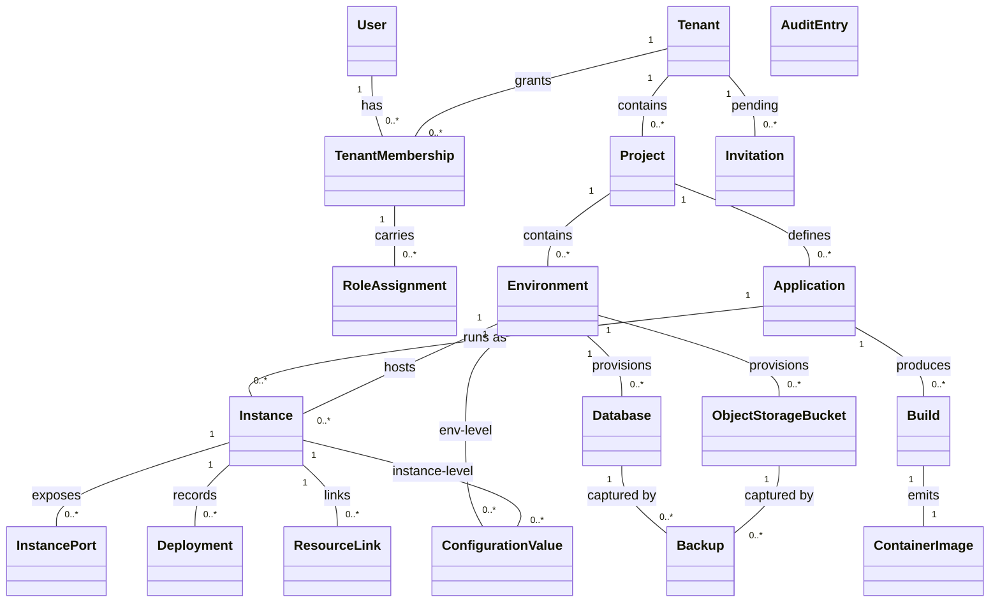

# Requirements: Operations Portal

**Domain:** Platform engineering / application-lifecycle management for AI-generated custom software [AI-SUGGESTED] **Created:** 2026-04-30 **Status:** draft **Last finalised at:** 2026-04-30

> Inferred content is marked `[AI-SUGGESTED]` inline. Field-level marking when only some sub-fields are inferred; heading-level marking when the whole item is invented. The fill-every-field rule applies — no blanks.

---

## 1. Application context

**Name:** Operations Portal

**Purpose / business value:** Manage build, deployment, execution, and lifecycle operations for custom applications produced by the platform's AI agents, abstracting underlying container orchestration so that technically strong business users (not professional DevOps engineers) can run and operate what they build. The same users who use AI agents to author frontend and backend applications use this portal to operate them. The current scope is an interactive prototype for stakeholder demos — backend integration is out of scope. (input/brief.md, requirements-v1.md §1)

**Domain:** Platform engineering / application-lifecycle management for AI-generated custom software [AI-SUGGESTED] — a managed, multi-tenant operations console with a consulting-company tenancy model and on-premise installation as a secondary deployment scenario.

**Business goal:** Enable consulting companies (and on-premise customers) to deliver and operate custom software for their own clients on a project basis, using a single portal that hides container orchestration concepts behind business-friendly language and enforces strict tenant- and project-level isolation. Demo-stage goal: validate the concept with stakeholders before committing to full development. (requirements-v1.md §1, brief.md Overview)

<!-- rev: run-1 2026-04-30 -->

---

## 2. Domain model

> The BA's framing of the business domain in **ubiquitous language**, implementation-free.

### 2.1 Concepts

| Concept | Persistence | Definition (ubiquitous language) |
| --- | --- | --- |
| Platform | policy | The hosting environment of the portal itself; hosts up to 100 tenants and is administered by Platform Administrators. |
| Tenant | persistent | A consulting company or organisation; the top-level isolation boundary. All projects and resources are scoped to a tenant. |
| Tenant Membership | persistent | A user's belonging to a tenant; the unit through which a user gains access to a tenant's projects and resources. |
| User | persistent | A person who uses the portal, uniquely identified by email; exists at the system level and may be a member of one or more tenants. |
| Identity Provider | policy | An authentication source (Google OAuth 2.0, Microsoft / Entra ID, generic OIDC, or email/password) that a tenant has enabled for its members. |
| Role | policy | A named permission set (Platform Admin, Tenant Admin, Project Admin, Operator, Viewer) that, when assigned, grants its bearer a specific scope of action. Custom roles are not supported in v1. |
| Role Assignment | persistent | The grant of a role to a tenant member on a tenant, project, or environment scope. |
| Project | persistent | A client engagement or initiative within a tenant; the access-isolation boundary inside a tenant. |
| Environment | persistent | A logical grouping (e.g. dev, staging, production) within a project; the boundary for instance-to-instance communication and for environment-scoped configuration, secrets, databases, and storage. |
| Application | persistent | A deployable unit of software defined at the project level by a Git repository, optional subdirectory, and build branch; has zero or more instances across environments. |
| Instance | persistent | The per-environment running form of an application; carries health, configuration, replica count, resource profile, and links to backing resources. |
| Instance Port | persistent | A publicly routable port mapping on an instance, with a path prefix. Public access is the presence of one or more InstancePort records. |
| Build | persistent | The process of compiling source code into a container image; produces a build number per application and is tagged with the source Git commit SHA. |
| Container Image | persistent | A versioned, runnable image produced by a successful build, retained per the registry retention policy. |
| Deployment | persistent | A record of deploying a specific container image (build) to an instance; may succeed, fail, or be rolled back. |
| Health Status | derived | The aggregate health of an instance's replicas: Running, Degraded, Stopped, or Failed. |
| Database | persistent | A provisioned PostgreSQL database scoped to an environment; one database per provisioned resource (no shared schemas). |
| Object Storage Bucket | persistent | A provisioned S3-compatible bucket scoped to an environment. |
| Resource Link | persistent | An association between an instance and a backing resource (database or bucket) within the same environment; auto-injects connection details into the instance. |
| Configuration Value | persistent | A key/value setting at environment or instance scope; instance-level overrides environment-level for the same key. |
| Secret | persistent | A configuration value marked as secret at creation; stored encrypted via the secrets backend, write-only after creation, with version metadata. |
| Invitation | persistent | A pending invitation for a user to join a tenant (and optionally a project with a role); deleted on acceptance or expiry. |
| Audit Entry | persistent | An immutable record of a significant action; covers platform, tenant, project, environment, application, build, instance, resource, and access-control changes. |
| Backup | persistent | A point-in-time copy of a stateful resource (database or bucket); produced automatically on a daily schedule or on user request. |
| Notification | persistent | A per-user record of completion of an asynchronous operation the user invoked (build, deployment, resource provisioning); retained as the last 50 or 30 days, whichever is smaller. |
| Public URL | derived | A generated URL of the form `<app-id>.<env-id>.<project-id>.<tenant-id>.<portal-domain>` for an instance with at least one InstancePort. |
| API Gateway | policy | The platform-managed ingress that exposes selected instances publicly; private-by-default applies to all instances. |
| Retention Policy | policy | A platform-defined policy governing how long logs (30 days), metrics (90 days), audit entries (≥1 year), notifications (50/30 days), backups (daily 7 / weekly 30 days), and container images (latest, deployed, last two prior per instance) are kept. |

<!-- non-persistent concepts (Platform, Identity Provider, Role, Health Status, Public URL, API Gateway, Retention Policy) appear here alongside persistent ones; persistent concepts also appear in §7. -->

### 2.2 Relationships

- Platform **hosts** Tenant [1..N, max 100]
- User **holds** Tenant Membership in Tenant [N..M]
- Tenant Membership **carries** Role Assignment [1..N]
- Role Assignment **scopes** Role to Tenant or Project or Environment [N..1]
- Tenant **contains** Project [1..N]
- Project **contains** Environment [1..N]
- Project **defines** Application [1..N]
- Application **runs as** Instance in Environment [N..M, one Instance per (Application, Environment)]
- Instance **exposes** Instance Port [1..N, optional]
- Application **produces** Build [1..N]
- Build **emits** Container Image [1..1]
- Deployment **records** Container Image deployed to Instance [N..1]
- Environment **provisions** Database [1..N]
- Environment **provisions** Object Storage Bucket [1..N]
- Resource Link **binds** Instance to Database or Object Storage Bucket within the same Environment [N..M]
- Configuration Value **applies to** Environment or Instance [N..1, exactly one of the two]
- Secret **is a** Configuration Value with `is_secret = true` [specialisation]
- Tenant Administrator **invites** User via Invitation [1..N]
- Audit Entry **records** any significant action by User on a target resource [N..1]
- Backup **captures** Database or Object Storage Bucket [N..1]
- Notification **belongs to** User [N..1]

<!-- verbs come from the business; cardinality recommended -->

### 2.3 Aggregates & lifecycles

#### Tenant

| Field            | Value                                                                                                                                                                                                                                                                            |
| ---------------- | -------------------------------------------------------------------------------------------------------------------------------------------------------------------------------------------------------------------------------------------------------------------------------- |
| Member concepts  | Tenant, Tenant Membership, Role Assignment (tenant scope), Invitation                                                                                                                                                                                                            |
| Lifecycle states | Active → Suspended → Deleted (Suspended → Active reactivation allowed; Deleted is permanent)                                                                                                                                                                                     |
| Key invariants   | At least one Tenant Administrator at all times (RBAC-07); deletion only when Suspended and tenant has no running instances, databases, or storage buckets, with url_id-typed confirmation (PADM-06); compute, database, and storage isolation between tenants (TEN-01–TEN-04). |

#### Project

| Field            | Value                                                                                                                                                                                                                                                                                              |
| ---------------- | -------------------------------------------------------------------------------------------------------------------------------------------------------------------------------------------------------------------------------------------------------------------------------------------------- |
| Member concepts  | Project, Application, Role Assignment (project scope), Project-level Git credential secrets                                                                                                                                                                                                        |
| Lifecycle states | Active → Deleted (deletion is immediate, requires confirmation)                                                                                                                                                                                                                                    |
| Key invariants   | All resources must belong to a project and must not be shared across projects (PRJ-03); strict access isolation — users only see assigned projects (PRJ-02); deletion only when no associated environments, applications, databases, storage, or secrets exist (PRJ-07).                          |

#### Environment

| Field            | Value                                                                                                                                                                                                                                                                                              |
| ---------------- | -------------------------------------------------------------------------------------------------------------------------------------------------------------------------------------------------------------------------------------------------------------------------------------------------- |
| Member concepts  | Environment, Instance, Instance Port, Database, Object Storage Bucket, Resource Link, Configuration Value (env- and instance-level), Secret (env- and instance-level), Role Assignment (environment scope)                                                                                          |
| Lifecycle states | Active → Deleted (deletion immediate, requires confirmation)                                                                                                                                                                                                                                       |
| Key invariants   | Each environment is logically isolated, with its own instances, configuration, databases, and storage (ENV-02); cross-environment networking blocked by default (ENV-04); a Resource Link's instance and resource must be in the same environment (LNK-01); deletion only when empty (ENV-09). |

#### Application

| Field            | Value                                                                                                                                                                                                                                                                |
| ---------------- | -------------------------------------------------------------------------------------------------------------------------------------------------------------------------------------------------------------------------------------------------------------------- |
| Member concepts  | Application, Build, Container Image, Deployment                                                                                                                                                                                                                      |
| Lifecycle states | Registered → Active → Deleted (Application has no separate lifecycle states beyond existence) [AI-SUGGESTED]                                                                                                                                                          |
| Key invariants   | Build number is per-application and sequential (BLD-03); deletion blocked while running instances exist (APP-07); credentials for Git access are project-level secrets (APP-02); branch changes recompute auto-trigger scope (BLD-02).                                |

#### Instance

| Field            | Value                                                                                                                                                                                                                                                                                                                                                              |
| ---------------- | ------------------------------------------------------------------------------------------------------------------------------------------------------------------------------------------------------------------------------------------------------------------------------------------------------------------------------------------------------------- |
| Member concepts  | Instance, Instance Port, Deployment, Resource Link, Configuration Value (instance-level), Secret (instance-level)                                                                                                                                                                                                                                              |
| Lifecycle states | Running ↔ Degraded ↔ Failed; Running ↔ Stopped (Stop sets replicas to 0; Start restores prior replica count)                                                                                                                                                                                                                                                  |
| Key invariants   | Replicas 1–10; scale-to-zero only via Stop (INS-07); rolling updates with automatic rollback on health-check failure (INS-04); private by default — public access requires explicit InstancePort + API gateway exposure (NET-02, NET-03); Linked resources auto-inject connection details and unlink/restart on resource changes (LNK-02, LNK-04, LNK-06, LNK-07). |

#### Build

| Field            | Value                                                                                                                                                                                                                                                  |
| ---------------- | ---------------------------------------------------------------------------------------------------------------------------------------------------------------------------------------------------------------------------------------------------- |
| Member concepts  | Build, Container Image                                                                                                                                                                                                                                  |
| Lifecycle states | Queued → In Progress → Succeeded \| Failed \| Cancelled                                                                                                                                                                                                |
| Key invariants   | Auto-trigger on commits to the configured build branch (filtered to the application's subdirectory in monorepos) (BLD-02); fixed platform build image and resource allocation; system-wide timeout cancels in-progress builds (BLD-12); failed builds expose error output (BLD-07). |

#### Backup

| Field            | Value                                                                                                                                                                                                                                       |
| ---------------- | --------------------------------------------------------------------------------------------------------------------------------------------------------------------------------------------------------------------------------------- |
| Member concepts  | Backup                                                                                                                                                                                                                                      |
| Lifecycle states | In Progress → Succeeded \| Failed                                                                                                                                                                                                          |
| Key invariants   | Daily automatic backups; retention 7 days daily / 30 days weekly (NFR-61); manual on-demand backups allowed (NFR-62); restore overwrites target and restarts linked instances (NFR-64); RPO 24 h, RTO 4 h (NFR-66). |

#### Audit Entry (cross-cutting; no aggregate root)

| Field            | Value                                                                                                                                                                                                                                                                          |
| ---------------- | ---------------------------------------------------------------------------------------------------------------------------------------------------------------------------------------------------------------------------------------------------------------------------- |
| Member concepts  | Audit Entry                                                                                                                                                                                                                                                                    |
| Lifecycle states | Created → Active (≥1 year) → Archived (cold storage, retrievable)                                                                                                                                                                                                              |
| Key invariants   | Immutable — cannot be modified or deleted by any user including administrators (AUD-05); minimum 1-year retention (AUD-06); searchable/filterable by user, project, action, resource, time, environment (AUD-04); visibility scoped to the user's role (AUD-04). |

### 2.4 Diagram

<!-- rev: run-1 2026-04-30 -->

---

## 3. Target users

> Target-user personas — the end users of the application being designed. Not to be confused with the Unicorn (LLM) or the Consultant (audience).

### Platform Administrator

| Field                  | Value                                                                                                                                                                                                                                                                                                              |
| ---------------------- | -------------------------------------------------------------------------------------------------------------------------------------------------------------------------------------------------------------------------------------------------------------------------------------------------------------- |
| Role / job title       | Platform Administrator (system-level, above all tenants)                                                                                                                                                                                                                                                           |
| Expertise level        | High — platform installer / operator with strong infrastructure background [AI-SUGGESTED]                                                                                                                                                                                                                          |
| Stakes                 | Very high — controls tenant lifecycle, can suspend/delete entire tenants and grant platform-admin rights; mistakes have platform-wide blast radius                                                                                                                                                                  |
| Frequency of use       | Low — a few sessions per month for tenant admin events (creation, suspension, role grants); higher around platform installation and onboarding new tenants [AI-SUGGESTED]                                                                                                                                          |
| Driving forces — wants | Provision new tenants quickly with the right first admin; clear visibility into which tenants are active/suspended; clean audit trail of platform-level actions                                                                                                                                                     |
| Driving forces — fears | Accidentally exposing tenant-internal data (PADM-04 forbids it); accidentally deleting a tenant; locking the platform out by removing the last platform admin (PADM-08)                                                                                                                                            |

### Tenant Administrator

| Field                  | Value                                                                                                                                                                                                                                                                              |
| ---------------------- | -------------------------------------------------------------------------------------------------------------------------------------------------------------------------------------------------------------------------------------------------------------------------------- |
| Role / job title       | Tenant Administrator (consulting company lead or business-unit lead in on-premise installs)                                                                                                                                                                                          |
| Expertise level        | Medium-high — comfortable with administrative concepts (users, roles, identity providers); not necessarily a developer [AI-SUGGESTED]                                                                                                                                                |
| Stakes                 | High — controls tenant-wide identity-provider settings, user invitations, project creation, role assignments; sole guarantor of "at least one tenant admin" invariant (RBAC-07)                                                                                                       |
| Frequency of use       | Low — primarily during onboarding, role changes, or new client engagements [AI-SUGGESTED]                                                                                                                                                                                            |
| Driving forces — wants | Onboard new team members quickly; maintain clear separation between client engagements (projects); enforce SSO where required by the consulting company's security policy                                                                                                              |
| Driving forces — fears | Misconfiguring identity providers and locking users out; accidentally deactivating the wrong user; leaving a project orphaned without an administrator                                                                                                                                |

### Project Administrator

| Field                  | Value                                                                                                                                                                                                                                                                  |
| ---------------------- | ------------------------------------------------------------------------------------------------------------------------------------------------------------------------------------------------------------------------------------------------------------------ |
| Role / job title       | Project Administrator (engagement lead for a single client project)                                                                                                                                                                                                      |
| Expertise level        | Medium — technical business user; understands environments and deployments at a conceptual level but is not a DevOps specialist (NFR-01)                                                                                                                                  |
| Stakes                 | Medium-high — defines environments, manages project membership, controls Git provider credentials                                                                                                                                                                          |
| Frequency of use       | Daily during active project setup; weekly thereafter [AI-SUGGESTED]                                                                                                                                                                                                       |
| Driving forces — wants | Quickly stand up dev/staging/prod environments; assign teammates with the right scope; monitor the project at a glance via the project dashboard                                                                                                                            |
| Driving forces — fears | Misassigning roles and granting too much access; accidentally deleting an environment with active resources; spending time on plumbing rather than client work                                                                                                              |

### Operator

| Field                  | Value                                                                                                                                                                                                                                                                                |
| ---------------------- | -------------------------------------------------------------------------------------------------------------------------------------------------------------------------------------------------------------------------------------------------------------------------------- |
| Role / job title       | Operator — technically strong business user who builds and runs custom software with the platform's AI agents                                                                                                                                                                          |
| Expertise level        | Medium-high — comfortable with code, Git, and the application domain; explicitly NOT a container-orchestration / DevOps specialist (NFR-01, NFR-02)                                                                                                                                    |
| Stakes                 | Medium — daily ownership of build/deploy/run cycle; mistakes affect the project's running services but not other projects or tenants                                                                                                                                                    |
| Frequency of use       | Very high — multiple sessions per day; the primary daily user of the portal (user-tasks-v1.md §5)                                                                                                                                                                                       |
| Driving forces — wants | Deploy code with confidence and minimal clicks (NFR-03); see live status of instances at a glance; diagnose live issues from logs and metrics; manage configuration and backing resources without DevOps friction                                                                       |
| Driving forces — fears | A failed deploy taking down the running app; not noticing a failed build before the next deploy; leaking secrets accidentally; spending time on infrastructure concepts instead of business logic                                                                                       |

### Viewer

| Field                  | Value                                                                                                                                                                                                                                                |
| ---------------------- | ---------------------------------------------------------------------------------------------------------------------------------------------------------------------------------------------------------------------------------------------- |
| Role / job title       | Viewer — read-only stakeholder (e.g. project manager, support engineer, client representative) [AI-SUGGESTED]                                                                                                                                          |
| Expertise level        | Low-medium — can read dashboards and logs but does not need to perform write actions [AI-SUGGESTED]                                                                                                                                                     |
| Stakes                 | Low — cannot change anything; concerned with awareness rather than control                                                                                                                                                                              |
| Frequency of use       | Very high — checks dashboards and logs throughout the day during active engagements [AI-SUGGESTED]                                                                                                                                                      |
| Driving forces — wants | A clear, current picture of project health; ability to look at logs and metrics without risking a misclick; visibility scoped to the projects they're assigned to                                                                                       |
| Driving forces — fears | Stale or unclear dashboards; accidentally seeing or appearing to have access to data outside their project [AI-SUGGESTED]                                                                                                                               |

<!-- rev: run-1 2026-04-30 -->

---

## 4. User goals & stories

> Quality signals live on the goal (outcome-level), not the story (behaviour-level).

### 4.1 Goals catalogue

| ID | Goal statement | Quality signals | Goal kind | Layout pref (optional) | UX-pattern pref (optional) |
| --- | --- | --- | --- | --- | --- |
| G-01 | Get a current, trustworthy picture of project health at a glance | freshness, scannability, accuracy [AI-SUGGESTED] | top-level | console dashboard with sidebar nav (brief.md Layout) | summary cards + status list |
| G-02 | Deploy a specific build to an environment with confidence (rolling update + auto-rollback) | safety, clarity of outcome, minimal clicks (≤3 from project dashboard, NFR-03) [AI-SUGGESTED] | top-level | full-page workflow inside instance context | wizard / form with confirm + live progress |
| G-03 | Diagnose live issues quickly from logs and metrics | low time-to-first-log, filter expressiveness (time, keyword, severity), tail latency [AI-SUGGESTED] | top-level | log/metrics pane within environment or instance context | streaming log view + dashboard panels |
| G-04 | Manage application configuration and secrets without DevOps friction | safety (secrets write-only after creation), precedence clarity (env vs. instance), audit traceability [AI-SUGGESTED] | top-level | tabbed panel within environment or instance | key/value editor with secret masking |
| G-05 | Provision and link backing resources (databases, object storage) to instances within an environment | speed of provisioning, automatic credential injection, clear link state [AI-SUGGESTED] | top-level | resource list within environment | drawer / modal for link/unlink |
| G-06 | Manage who can do what within a tenant or project (invitations, roles, scopes) | scope clarity (tenant vs. project vs. environment), invariant safety (last-tenant-admin protection) [AI-SUGGESTED] | top-level | settings area within tenant/project | directory + role matrix |
| G-07 | Operate the platform: provision tenants, suspend, and audit (Platform Admin) | tenant isolation (no internal data exposure to platform admin, PADM-04), confirmation friction proportional to blast radius [AI-SUGGESTED] | top-level | system-level admin area | list + detail with destructive-action confirm |
| G-08 | Maintain accountability through an immutable, searchable audit trail | immutability, search performance, scope-correct visibility [AI-SUGGESTED] | top-level | audit area accessible from project / tenant / platform | filterable log table |
| G-09 | Recover from data loss via backups and restores | RPO 24 h / RTO 4 h (NFR-66), confidence in restore confirmation, on-demand-backup availability | sub-level | within database / bucket detail | timeline + confirm-and-restore action |
| G-10 | Expose selected instances publicly via the API gateway with predictable URLs | private-by-default safety, predictable URL format (NET-04), reversibility | sub-level | within instance / networking context | toggle + URL display |
| G-11 | Switch tenant context without re-authenticating | speed, clarity of current context, no data leakage between tenants (TEN-06, AUTH-06) | interaction-level | top bar | tenant switcher dropdown |

<!-- IDs are stable and referenced from §4.2 stories and §5 task flows -->

### 4.2 Stories by persona

#### Platform Administrator <!-- → §3 -->

##### Story: As a Platform Administrator, I want to view a list of all tenants with status and counts, so that I can keep track of the platform's tenancy at a glance.

| Field | Value |
| --- | --- |
| Goal | → §4.1 G-07 |
| Objective | View tenant list with display name, status, creation date, and project count (PADM-04). |
| Context (frequency / expertise / stakes) | Medium frequency / high expertise / very high stakes (T-PADM-01) |
| Linked task flow (optional) | → §5 Flow: Platform tenant lifecycle |

##### Story: As a Platform Administrator, I want to create a new tenant and assign its first tenant administrator, so that a new consulting company or business unit can begin onboarding users.

| Field | Value |
| --- | --- |
| Goal | → §4.1 G-07 |
| Objective | Create tenant (display name, url_id) and assign first tenant admin in a single flow (PADM-02, PADM-03). |
| Context (frequency / expertise / stakes) | Low / high / very high (T-PADM-02) |
| Linked task flow (optional) | → §5 Flow: Platform tenant lifecycle |

##### Story: As a Platform Administrator, I want to suspend or reactivate a tenant, so that I can stop access during an incident or resume access after resolution without destroying any data.

| Field | Value |
| --- | --- |
| Goal | → §4.1 G-07 |
| Objective | Suspend stops all tenant access and running instances; reactivation restores both (PADM-05). |
| Context (frequency / expertise / stakes) | Very low / high / very high (T-PADM-03, T-PADM-04) |
| Linked task flow (optional) | → §5 Flow: Platform tenant lifecycle |

##### Story: As a Platform Administrator, I want to delete a tenant by typing its url_id, so that I can permanently remove a tenant only when it is suspended and empty.

| Field | Value |
| --- | --- |
| Goal | → §4.1 G-07 |
| Objective | Delete is permitted only when tenant is suspended and has no running instances, databases, or storage buckets; requires url_id confirmation (PADM-06). |
| Context (frequency / expertise / stakes) | Very low / high / very high (T-PADM-05) |
| Linked task flow (optional) | → §5 Flow: Platform tenant lifecycle |

##### Story: As a Platform Administrator, I want to grant or revoke the platform-admin role on other users, so that the platform always has at least one administrator without putting that on a single point of failure.

| Field | Value |
| --- | --- |
| Goal | → §4.1 G-07 |
| Objective | Grant/revoke `is_platform_admin`; the system blocks removal of the last platform administrator (PADM-08). |
| Context (frequency / expertise / stakes) | Very low / high / very high (T-PADM-06, T-PADM-07) |
| Linked task flow (optional) | → §5 Flow: Platform admin role management |

##### Story: As a Platform Administrator, I want to view a per-tenant summary, so that I can see size and activity counts without reading any tenant-internal data.

| Field | Value |
| --- | --- |
| Goal | → §4.1 G-07 |
| Objective | Per-tenant counts: project, environment, running-instance, database, bucket, membership, suspension history (PADM-10). |
| Context (frequency / expertise / stakes) | Low / high / very high (T-PADM-08) |
| Linked task flow (optional) | — |

##### Story: As a Platform Administrator, I want to view the platform audit trail, so that I can review platform-level actions over time.

| Field | Value |
| --- | --- |
| Goal | → §4.1 G-08 |
| Objective | View immutable audit entries for platform actions (PADM-09, AUD-01). |
| Context (frequency / expertise / stakes) | Medium / high / high (T-PADM-09) |
| Linked task flow (optional) | — |

#### Tenant Administrator

##### Story: As a Tenant Administrator, I want to view the tenant user directory, so that I can see who has access and at what scope.

| Field | Value |
| --- | --- |
| Goal | → §4.1 G-06 |
| Objective | List tenant members with project assignments, roles, and last login (USR-04). |
| Context (frequency / expertise / stakes) | Medium / medium-high / high (T-TEN-01) |
| Linked task flow (optional) | → §5 Flow: User invitation |

##### Story: As a Tenant Administrator, I want to invite a user by email, so that they can join the tenant whether or not they already have a portal account.

| Field | Value |
| --- | --- |
| Goal | → §4.1 G-06 |
| Objective | Invite by email; create or reuse user account; send invitation email; surface delivery failures and allow re-send (USR-01, USR-02). |
| Context (frequency / expertise / stakes) | Low / medium-high / high (T-TEN-02, T-TEN-03) |
| Linked task flow (optional) | → §5 Flow: User invitation |

##### Story: As a Tenant Administrator, I want to deactivate or reactivate a member's tenant membership, so that I can remove and restore access while preserving audit history.

| Field | Value |
| --- | --- |
| Goal | → §4.1 G-06 |
| Objective | Deactivate / reactivate a TenantMembership; preserve created-by attribution (USR-05, USR-06). |
| Context (frequency / expertise / stakes) | Low / medium-high / high (T-TEN-04, T-TEN-05) |
| Linked task flow (optional) | → §5 Flow: User invitation |

##### Story: As a Tenant Administrator, I want to assign tenant members to projects with roles (and remove them), so that access is scoped tightly per engagement.

| Field | Value |
| --- | --- |
| Goal | → §4.1 G-06 |
| Objective | Assign / change / remove project- and environment-scoped roles (PRJ-04, USR-08, RBAC-03). |
| Context (frequency / expertise / stakes) | Low / medium-high / high (T-TEN-06, T-TEN-07, T-TEN-08) |
| Linked task flow (optional) | → §5 Flow: Project assignment |

##### Story: As a Tenant Administrator, I want to create a new project and delete an empty one, so that I can shape the tenancy around current engagements.

| Field | Value |
| --- | --- |
| Goal | → §4.1 G-01 |
| Objective | Create project (display name, url_id, description); delete a project only when empty, with explicit confirmation (PRJ-01, PRJ-07). |
| Context (frequency / expertise / stakes) | Low / medium-high / high (T-TEN-09, T-TEN-10) |
| Linked task flow (optional) | → §5 Flow: Project lifecycle |

##### Story: As a Tenant Administrator, I want to configure tenant settings (display name, allowed identity providers), so that login matches our company's policy.

| Field | Value |
| --- | --- |
| Goal | → §4.1 G-06 |
| Objective | Edit tenant display name and allowed identity providers; cannot disable email/password unless ≥1 SSO provider remains (TEN-07, AUTH-04). |
| Context (frequency / expertise / stakes) | Very low / medium-high / high (T-TEN-11) |
| Linked task flow (optional) | — |

#### Project Administrator

##### Story: As a Project Administrator, I want to see the project dashboard at a glance, so that I always know the state of environments, applications, and instance health.

| Field | Value |
| --- | --- |
| Goal | → §4.1 G-01 |
| Objective | View overview of all environments, applications, and statuses within the project (PRJ-08). |
| Context (frequency / expertise / stakes) | Very high / medium / medium-high (T-PRJ-01) |
| Linked task flow (optional) | — |

##### Story: As a Project Administrator, I want to manage project membership and roles within the project, so that the right people have the right scope without involving the tenant admin every time.

| Field | Value |
| --- | --- |
| Goal | → §4.1 G-06 |
| Objective | View directory; assign / remove tenant members; manage roles within project; invite new users into the tenant with auto-project-assignment (USR-07, USR-08). |
| Context (frequency / expertise / stakes) | Low / medium / medium-high (T-PRJ-03 through T-PRJ-07, T-PRJ-12) |
| Linked task flow (optional) | → §5 Flow: Project assignment |

##### Story: As a Project Administrator, I want to create, edit, and delete environments, so that I can model dev/staging/production lifecycles for the project.

| Field | Value |
| --- | --- |
| Goal | → §4.1 G-01 |
| Objective | Create environment (display name, url_id); edit display name; delete only when empty (ENV-01, ENV-08, ENV-09). |
| Context (frequency / expertise / stakes) | Low / medium / medium-high (T-PRJ-08, T-PRJ-09, T-PRJ-10) |
| Linked task flow (optional) | → §5 Flow: Environment lifecycle |

##### Story: As a Project Administrator, I want to manage Git provider credentials at project scope, so that all applications in the project can authenticate against GitHub or BitBucket.

| Field | Value |
| --- | --- |
| Goal | → §4.1 G-04 |
| Objective | Manage project-scoped Git credentials (APP-02). |
| Context (frequency / expertise / stakes) | Low / medium / medium-high (T-PRJ-11) |
| Linked task flow (optional) | → §5 Flow: Application registration |

#### Operator

##### Story: As an Operator, I want to view the list of applications and an application's per-environment instance status, so that I can navigate quickly to what I need to act on.

| Field | Value |
| --- | --- |
| Goal | → §4.1 G-01 |
| Objective | List applications; view application detail with Git repo, metadata, per-environment instance build number and health (APP-04, APP-05). |
| Context (frequency / expertise / stakes) | Very high / medium-high / medium (T-APP-01, T-APP-02) |
| Linked task flow (optional) | — |

##### Story: As an Operator, I want to register a new application by linking a Git repository, so that I can start building and deploying my code.

| Field | Value |
| --- | --- |
| Goal | → §4.1 G-02 |
| Objective | Register application with provider (GitHub / BitBucket), repository URL, build branch, optional subdirectory; portal validates accessibility at registration (APP-01, APP-03, BLD-02). |
| Context (frequency / expertise / stakes) | Low / medium-high / medium (T-APP-03) |
| Linked task flow (optional) | → §5 Flow: Application registration |

##### Story: As an Operator, I want to watch a build and view its history and logs, so that I can react quickly to failures and trace what was built.

| Field | Value |
| --- | --- |
| Goal | → §4.1 G-03 |
| Objective | View build history; tail in-progress logs; view full build detail with commit SHA and duration (BLD-04, BLD-05, BLD-06, BLD-07). |
| Context (frequency / expertise / stakes) | Very high / medium-high / medium (T-BLD-01, T-BLD-02, T-BLD-03) |
| Linked task flow (optional) | → §5 Flow: Build & deploy |

##### Story: As an Operator, I want to manually trigger or cancel a build, so that I can react to ad-hoc needs without changing the source branch.

| Field | Value |
| --- | --- |
| Goal | → §4.1 G-02 |
| Objective | Manual trigger; cancel in-progress build (BLD-13, BLD-14). |
| Context (frequency / expertise / stakes) | Medium-low / medium-high / medium (T-BLD-04, T-BLD-05) |
| Linked task flow (optional) | → §5 Flow: Build & deploy |

##### Story: As an Operator, I want to deploy a specific build to an instance with rolling update + auto-rollback, so that I can ship safely.

| Field | Value |
| --- | --- |
| Goal | → §4.1 G-02 |
| Objective | Create instance for application × environment, or deploy a specific build to an existing instance; rolling update with health-check gate and auto-rollback on failure (INS-01, INS-04). |
| Context (frequency / expertise / stakes) | High / medium-high / medium (T-INS-03a, T-INS-03b) |
| Linked task flow (optional) | → §5 Flow: Build & deploy |

##### Story: As an Operator, I want to start, stop, restart, scale, and resize an instance, so that I can run it as needed.

| Field | Value |
| --- | --- |
| Goal | → §4.1 G-02 |
| Objective | Start / stop / restart; replicas 1–10 (stop = zero); resource profile Small/Medium/Large; override health check (INS-03, INS-07, INS-10, INS-11, INS-13, INS-14). |
| Context (frequency / expertise / stakes) | Medium / medium-high / medium (T-INS-04 through T-INS-11) |
| Linked task flow (optional) | → §5 Flow: Instance operation |

##### Story: As an Operator, I want to roll back an instance to a previously deployed build, so that I can recover quickly from a bad deploy.

| Field | Value |
| --- | --- |
| Goal | → §4.1 G-02 |
| Objective | Roll back to a prior build; recorded in deployment history (INS-05, INS-06). |
| Context (frequency / expertise / stakes) | Low / medium-high / medium (T-INS-07) |
| Linked task flow (optional) | → §5 Flow: Build & deploy |

##### Story: As an Operator, I want to view live logs and metrics for an instance, so that I can diagnose issues quickly.

| Field | Value |
| --- | --- |
| Goal | → §4.1 G-03 |
| Objective | Filter logs by time, keyword, severity; tail in real time; view CPU/memory/error-rate/restart dashboards; view request rate and latency for publicly-exposed instances (OBS-02, OBS-03, OBS-11, OBS-12). |
| Context (frequency / expertise / stakes) | Very high / medium-high / medium (T-OBS-01 through T-OBS-04) |
| Linked task flow (optional) | → §5 Flow: Diagnose live issue |

##### Story: As an Operator, I want to manage configuration values and secrets at environment and instance scope, so that the application has the values it needs at runtime.

| Field | Value |
| --- | --- |
| Goal | → §4.1 G-04 |
| Objective | Add/edit/delete config values; create and rotate secrets (write-only values, metadata-only history); changes auto-restart instances (CFG-01, CFG-02, CFG-03, CFG-05, SEC-01 through SEC-08). |
| Context (frequency / expertise / stakes) | Medium / medium-high / medium (T-CFG-01 through T-CFG-08) |
| Linked task flow (optional) | → §5 Flow: Configuration & secret management |

##### Story: As an Operator, I want to provision databases and object storage buckets and link them to instances, so that my applications have storage they need within the environment.

| Field | Value |
| --- | --- |
| Goal | → §4.1 G-05 |
| Objective | Provision PostgreSQL database / S3-compatible bucket; view list and usage; link to an instance (auto-injects connection details); unlink restarts instance; deletion blocked while linked, otherwise requires name-typed confirmation (DB-01, DB-03, DB-06, OBJ-01, OBJ-02, OBJ-05, LNK-01, LNK-02, LNK-04, LNK-05, LNK-06). |
| Context (frequency / expertise / stakes) | Medium-low / medium-high / medium (T-DB-01 through T-DB-03, T-OBJ-01 through T-OBJ-03, T-LNK-01 through T-LNK-03) |
| Linked task flow (optional) | → §5 Flow: Provision and link backing resource |

##### Story: As an Operator, I want to expose an instance publicly via the API gateway and see its generated URL, so that external consumers can reach it.

| Field | Value |
| --- | --- |
| Goal | → §4.1 G-10 |
| Objective | Configure InstancePort(s); see generated public URL (NET-02, NET-03, NET-04). |
| Context (frequency / expertise / stakes) | Low / medium-high / medium (T-NET-01 through T-NET-04) |
| Linked task flow (optional) | → §5 Flow: Public exposure |

##### Story: As an Operator, I want to view backup status and trigger a manual backup or restore, so that I can protect data before risky changes and recover from incidents.

| Field | Value |
| --- | --- |
| Goal | → §4.1 G-09 |
| Objective | View last backup time and outcome per resource; trigger manual backup; restore to same or different environment within the project with explicit confirmation (NFR-62 through NFR-65). |
| Context (frequency / expertise / stakes) | Medium-low / medium-high / medium (T-BAK-01 through T-BAK-03) |
| Linked task flow (optional) | → §5 Flow: Backup and restore |

#### Viewer

##### Story: As a Viewer, I want to see the project dashboard, environment overview, application list, and instance status, so that I can monitor the project without making changes.

| Field | Value |
| --- | --- |
| Goal | → §4.1 G-01 |
| Objective | Read-only equivalents of operator views (PRJ-08, ENV-05, APP-04, APP-05, INS-09). |
| Context (frequency / expertise / stakes) | Very high / low-medium / low (T-VIEW-01 through T-VIEW-03) |
| Linked task flow (optional) | — |

##### Story: As a Viewer, I want to view logs, metrics, deployment history, configuration (with secrets masked), backup status, and resources, so that I have full read-only awareness.

| Field | Value |
| --- | --- |
| Goal | → §4.1 G-03 |
| Objective | Read-only logs (OBS-02, OBS-03), metrics dashboards (OBS-11, OBS-12), deployment history (INS-06), configuration with secret-masking (CFG-01, CFG-02, SEC-04), databases/buckets (DB-03, OBJ-02), backup status (NFR-63). |
| Context (frequency / expertise / stakes) | Very high / low-medium / low (T-VIEW-04 through T-VIEW-10) |
| Linked task flow (optional) | — |

#### All authenticated users (cross-persona)

##### Story: As any authenticated user, I want to log in (SSO or email/password), switch tenant context without re-authenticating, edit my display name, and log out.

| Field | Value |
| --- | --- |
| Goal | → §4.1 G-11 |
| Objective | Login via Google / Microsoft / OIDC / email-password; tenant switch within a single session; profile display-name edit; logout (AUTH-01 through AUTH-06, USR-10). |
| Context (frequency / expertise / stakes) | High / varies / varies (T-ALL-01 through T-ALL-04) |
| Linked task flow (optional) | → §5 Flow: Login & tenant switch |

---

## 5. Task flows

### Flow: Login & tenant switch

| Field | Value |
| --- | --- |
| Actor | Any authenticated user (→ §3 all personas) |
| Trigger | User opens the portal or selects a different tenant from the tenant switcher. |
| Steps | 1. Choose identity provider on login screen (Google, Microsoft, OIDC, or email/password — only providers enabled by the tenant are shown). 2. Authenticate with provider. 3. If user has memberships in multiple tenants, present tenant selector (or default to last-used tenant). 4. Land on project dashboard (or last-used project) within the chosen tenant. 5. To switch: open tenant switcher in top bar, select another tenant; session is reused without re-authentication (AUTH-06). |
| Decision points | Multiple tenant memberships → show selector vs. auto-route. Email/password disabled by tenant → SSO-only options shown. |
| Exception paths | Authentication failure → show error and remain on login. Failed-login lockout per BR-21. Tenant suspended (PADM-05) → show "tenant suspended" message and block access. |
| Role-conditional behaviour | Platform admins can additionally access platform-level views regardless of tenant context. |

### Flow: Platform tenant lifecycle

| Field | Value |
| --- | --- |
| Actor | Platform Administrator |
| Trigger | New tenant required, suspension event, reactivation, or end-of-life. |
| Steps | 1. From platform tenant list (PADM-04), choose Create / Suspend / Reactivate / Delete. 2. **Create:** enter display name and url_id, select first tenant administrator (existing or by email). 3. **Suspend:** confirm; portal stops all running instances and blocks tenant-member access (PADM-05). 4. **Reactivate:** confirm; access and instances may be started again. 5. **Delete:** allowed only when tenant is suspended and has no running instances, databases, or storage buckets; admin types url_id to confirm (PADM-06). |
| Decision points | Suspended + empty? gate for delete. |
| Exception paths | Delete blocked when tenant is not suspended or still has resources → show specific reason. |
| Role-conditional behaviour | Only Platform Administrator. Action recorded in platform audit trail (PADM-09). |

### Flow: Platform admin role management

| Field | Value |
| --- | --- |
| Actor | Platform Administrator |
| Trigger | Need to grant or revoke platform-admin status. |
| Steps | 1. Open platform admin user list. 2. Grant: select target user, confirm. 3. Revoke: select target user, confirm; system blocks the action if it would leave zero platform admins (PADM-08). |
| Decision points | Last-platform-admin guard (BR-02). |
| Exception paths | Revoke blocked → display "must keep at least one platform admin". |
| Role-conditional behaviour | Only Platform Administrator. |

### Flow: User invitation

| Field | Value |
| --- | --- |
| Actor | Tenant Administrator (USR-01); Project Administrator may also initiate, with project auto-assignment (USR-08) |
| Trigger | A new person needs access to the tenant or a specific project. |
| Steps | 1. Enter email (and optional project + role for project-scoped invitations). 2. Portal creates Invitation; if no User exists with that email, one will be created on acceptance. 3. Invitation email sent (USR-02). 4. Invited user accepts via link → TenantMembership created; if a project + role were specified, RoleAssignment is created. 5. Invitation record is deleted; audit entry retained (§2.19 of domain model). |
| Decision points | Email already a portal user (reuse) vs. new (create). Project-scoped vs. tenant-only invitation. |
| Exception paths | Email delivery failure → log and surface to inviter; allow re-send (USR-02, T-TEN-03, T-PRJ-12). Invitation expires → record deleted; user must be re-invited. |
| Role-conditional behaviour | Tenant Admin scope = whole tenant; Project Admin scope = their project only. |

### Flow: Project lifecycle

| Field | Value |
| --- | --- |
| Actor | Tenant Administrator (PRJ-01, PRJ-07); Project Administrator may edit name/description (PRJ-06) |
| Trigger | New engagement / archived engagement. |
| Steps | 1. Create: enter display name, url_id, description. 2. Edit: change display name / description. 3. Delete: allowed only when project has no environments, applications, databases, storage, or secrets; immediate, with confirmation (PRJ-07). |
| Decision points | Empty-project guard (BR-04). |
| Exception paths | Delete blocked when resources exist → list remaining resources. |
| Role-conditional behaviour | Tenant Admin: all actions. Project Admin: edit only. |

### Flow: Project assignment

| Field | Value |
| --- | --- |
| Actor | Tenant Administrator or Project Administrator |
| Trigger | Team change. |
| Steps | 1. Open project user directory. 2. Add: pick existing tenant member or invite by email. 3. Set role at project or environment scope (RBAC-03). 4. Edit / remove existing assignments. |
| Decision points | If removing a project's last administrator while project still active → still allowed (no project-admin invariant), but tenant-level last-tenant-admin guard applies for tenant-scoped role (BR-01). |
| Exception paths | Last-tenant-admin removal blocked (BR-01, RBAC-07). |
| Role-conditional behaviour | Tenant Admin: any project; Project Admin: own project only. |

### Flow: Environment lifecycle

| Field | Value |
| --- | --- |
| Actor | Project Administrator |
| Trigger | New env required (e.g. staging) / decommission. |
| Steps | 1. Create: enter display name, url_id (ENV-01). 2. Edit display name (ENV-08). 3. Delete: only when no running instances, databases, or storage buckets; confirmation required (ENV-09). |
| Decision points | Empty-environment guard (BR-05). |
| Exception paths | Delete blocked when resources exist → show what remains. |
| Role-conditional behaviour | Only Project Administrator. |

### Flow: Application registration

| Field | Value |
| --- | --- |
| Actor | Operator or Project Administrator |
| Trigger | New application needs to live in the project. |
| Steps | 1. Choose Git provider (GitHub / BitBucket). 2. Enter repository URL, build branch, optional subdirectory. 3. Portal validates repo access using project-level Git credentials (APP-01, APP-02, APP-03). 4. Application created; first auto-build triggered on next push to the branch (BLD-02). |
| Decision points | Monorepo (subdirectory specified) vs. repo-root. Multiple applications may share the same repo (APP-03). |
| Exception paths | Repo not accessible → registration blocked with specific error (APP-01). Credentials become invalid later → builds fail with clear error. |
| Role-conditional behaviour | Operator and above; Viewer cannot register. |

### Flow: Build & deploy

| Field | Value |
| --- | --- |
| Actor | Operator |
| Trigger | Commit to build branch (auto-trigger, BLD-02) or manual trigger (BLD-13). |
| Steps | 1. Build queued; container image build runs with platform-fixed resources (BLD-12). 2. Build progresses through queued → in_progress → succeeded / failed / cancelled (BLD-05); logs captured live (BLD-04, BLD-07); on success, image pushed to registry (REG-02). 3. Operator opens an instance (creates one if none exists for the application × environment, INS-01); selects a build to deploy. 4. Rolling update: new replica started, health check (`:8080/health` by default, INS-13) gates promotion; if it fails → automatic rollback to prior version (INS-04). 5. Deployment recorded with outcome (INS-06). 6. Notifications fire on build start/complete and deploy start/complete (NOT-01, NOT-02). |
| Decision points | Auto vs. manual trigger. Health-check pass / fail at rollout. |
| Exception paths | Build timeout → automatically cancelled and marked failed (BLD-12). Build failure → operator views logs (BLD-07). Deploy failure → automatic rollback; outcome `rolled_back` (INS-04, INS-06). Operator may also explicitly roll back to a prior build (INS-05). |
| Role-conditional behaviour | Operator: trigger / cancel / deploy / roll back. Viewer: read-only. Operator scope respects environment-level role gating (RBAC-03). |

### Flow: Instance operation

| Field | Value |
| --- | --- |
| Actor | Operator |
| Trigger | Need to scale, restart, stop, resize, or change health checks. |
| Steps | 1. Open instance from environment overview (ENV-05). 2. Choose action: Start / Stop / Restart (INS-03); change replica count 1–10 (INS-07); change resource profile Small/Medium/Large (INS-10, INS-11); override health check path/port (INS-14). 3. Portal applies change; instance health updates accordingly (INS-09). |
| Decision points | Stop = replicas 0 (no scale-to-zero via slider, INS-07). |
| Exception paths | Resource profile out of project/tenant constraints → block. Replica change beyond 1–10 → block. |
| Role-conditional behaviour | Operator only. Environment-scoped role (env_operator) applies if defined. |

### Flow: Configuration & secret management

| Field | Value |
| --- | --- |
| Actor | Operator |
| Trigger | New config value or secret needed; rotation due. |
| Steps | 1. Open environment or instance configuration view. 2. Add value: enter key + value; mark as secret if sensitive at creation (cannot toggle later — CFG-05). 3. Edit / delete values. 4. Rotate secret: enter new value (creates new version, SEC-07); previous value not retrievable (SEC-08). 5. Portal restarts affected instances on change (CFG-03, LNK-06). |
| Decision points | Plain vs. secret at creation. Env-level vs. instance-level (instance overrides env, CFG-02, SEC-06). |
| Exception paths | Attempting to unmark a secret → blocked (BR-14). Reading a secret value → not displayed (SEC-04). |
| Role-conditional behaviour | Operator only. Viewer sees masked values (SEC-04). |

### Flow: Provision and link backing resource

| Field | Value |
| --- | --- |
| Actor | Operator |
| Trigger | Application needs a database or object storage bucket. |
| Steps | 1. From environment, create database or bucket (DB-01, OBJ-01); resource enters `provisioning`. 2. Once `available`, link to an instance from the instance's Linked Resources view or the resource's detail drawer (T-LNK-02). 3. Portal injects connection details: DB host/port/name as configuration, credentials as secrets (LNK-02); bucket endpoint, keys, name via configuration or secrets (LNK-04, OBJ-04). 4. Unlink: removes injected values; restarts instance (LNK-06). 5. Delete resource: blocked if linked; otherwise type the resource name to confirm (DB-06, OBJ-02). |
| Decision points | Same-environment guard (BR-09). Linked vs. unlinked at deletion. |
| Exception paths | Cross-environment link attempt → blocked. Delete on linked resource → blocked with list of links. Resource deleted while linked is not allowed; if a linked resource is deleted via cascade in some path, all links auto-removed and instances restarted (LNK-07). |
| Role-conditional behaviour | Operator only. |

### Flow: Public exposure

| Field | Value |
| --- | --- |
| Actor | Operator |
| Trigger | An instance must be reachable externally. |
| Steps | 1. Open instance networking view; instance is private by default (NET-02). 2. Add InstancePort(s) with internal port and path prefix. 3. Portal updates API gateway and shows generated public URL (NET-04). 4. Remove public access by deleting all InstancePorts (T-NET-04). |
| Decision points | Multiple ports → assign distinct path prefixes per instance. |
| Exception paths | Duplicate port or path prefix on an instance → blocked. |
| Role-conditional behaviour | Operator only. |

### Flow: Backup and restore

| Field | Value |
| --- | --- |
| Actor | Operator |
| Trigger | Pre-deployment safety, scheduled review, or recovery from incident. |
| Steps | 1. View backup status per database / bucket (NFR-63). 2. Trigger manual backup (NFR-62). 3. Restore: pick a backup point; choose target environment (same or different within the same project, NFR-64); confirm explicitly. 4. Portal overwrites target and restarts linked instances (NFR-64). 5. Operation recorded in audit trail (NFR-65). |
| Decision points | Restore target = same env / different env in same project. |
| Exception paths | Restore confirmation declined → no-op. Backup mid-flight → status `in_progress`; user is notified on completion (NOT-02 covers resource provisioning; backup completion is treated similarly, [AI-SUGGESTED]). |
| Role-conditional behaviour | Operator only. |

### Flow: Diagnose live issue

| Field | Value |
| --- | --- |
| Actor | Operator (Viewer can also follow read-only) |
| Trigger | Health turns Degraded/Failed; metric anomaly; user report. |
| Steps | 1. From environment overview or instance, open Logs view; tail in real time (OBS-03) or filter by time, keyword, severity (OBS-02). 2. Open Metrics view: CPU, memory, error rate, container restarts (OBS-12); for publicly-exposed instances, request rate and latency. 3. Cross-reference Deployment history (INS-06) and audit trail (AUD-04) to correlate cause. 4. Operator may roll back, restart, or change configuration as needed. |
| Decision points | Cause attributable to recent deploy → roll back; configuration → change config; resource → check linked DB/bucket. |
| Exception paths | Logs older than 30 days / metrics older than 90 days unavailable (OBS-13). |
| Role-conditional behaviour | Operator: read + react. Viewer: read only. |

### Flow: Audit search

| Field | Value |
| --- | --- |
| Actor | Tenant Admin, Project Admin, Operator (scope-limited) |
| Trigger | Investigation, compliance review, or routine check. |
| Steps | 1. Open audit view at platform / tenant / project scope (per role). 2. Filter by user, project, action type, resource, time range, environment (AUD-04). 3. Open entry detail. |
| Decision points | Visibility scoped to role (AUD-04). |
| Exception paths | No matching entries → empty state. |
| Role-conditional behaviour | Platform Admin: platform-level entries; Tenant Admin: tenant-wide; Project Admin/Operator/Viewer: scope-limited. Audit logs are immutable (AUD-05) — no edit/delete actions. |

---

## 6. Requirements

### 6.1 Functional

- **Identity & authentication.** Login via Google OAuth 2.0 (AUTH-01), Microsoft / Entra ID (AUTH-02), generic OIDC (AUTH-03), and email/password (AUTH-04). Tenant admins may disable email/password only when ≥1 SSO provider is enabled (AUTH-04). All authentication events are audited (AUTH-05). Single authenticated session per user across multiple tenants; tenant switch does not require re-auth; idle timeout redirects to login (AUTH-06). User profile self-edit limited to display name (USR-10).
- **Multi-tenancy.** Up to 100 tenants with full isolation at compute, database, storage, and networking layers (TEN-01 to TEN-04, TEN-06). Tenant configuration of display name and allowed identity providers (TEN-07).
- **Platform administration.** Platform Admin role at system level (PADM-01); create tenants and assign first tenant admin (PADM-02, PADM-03); list tenants without exposing tenant-internal data (PADM-04, PADM-10); suspend/reactivate tenant (PADM-05); delete tenant when suspended and empty (PADM-06); first platform admin via setup/seed (PADM-07); grant/revoke platform admin with last-admin guard (PADM-08); platform actions audited (PADM-09).
- **Project & access isolation.** Multiple projects per tenant (PRJ-01); strict access isolation (PRJ-02); resources scoped to project / environment / instance per the precedence rules (PRJ-03, ENV-06, CFG-01, CFG-02, SEC-06); project assignment by tenant admin or project admin (PRJ-04); a user may have different roles per project (PRJ-05); editable project name and description (PRJ-06); empty-project deletion (PRJ-07); project dashboard (PRJ-08).
- **RBAC.** RBAC enforced for all operations (RBAC-01); four assignable scopes — platform, tenant, project, environment (RBAC-03); permissions covering project, application, environment, data storage, secrets, user management, audit (RBAC-04); default roles Platform Admin, Tenant Admin, Project Admin, Operator, Viewer; no custom roles in v1 (RBAC-05); role assignments audited (RBAC-06); ≥1 tenant admin invariant per tenant (RBAC-07).
- **User management.** Invite by email; create or reuse user (USR-01); send invitation; surface delivery failures and allow re-send (USR-02); tenant user directory with last login (USR-04); deactivate / reactivate tenant memberships preserving audit history (USR-05, USR-06); project user directory (USR-07); project membership and role management (USR-08); user-management audit (USR-09); self profile edit (USR-10).
- **Application management.** Register application with Git repo (GitHub / BitBucket) and validate access at registration (APP-01); project-level Git credentials (APP-02); monorepo subdirectory support (APP-03); list applications (APP-04); detail with per-environment instance status (APP-05); editable name/description (APP-06); delete only when no running instances (APP-07).
- **Build & containerisation.** Built-in build system without external CI (BLD-01); per-application build branch with auto-trigger filtered to subdirectory in monorepos (BLD-02); per-application sequential build number plus Git commit SHA tag (BLD-03); real-time and post-completion build logs (BLD-04); build status states queued/in_progress/succeeded/failed/cancelled (BLD-05); build history with attribution and outcome (BLD-06); failed-build error output (BLD-07); standard platform build image with fixed resources and system timeout, auto-cancellation on timeout (BLD-12); manual build trigger (BLD-13); cancel in-progress builds (BLD-14).
- **Container registry.** Built-in registry (REG-01); auto-push on success (REG-02); tenant + project isolation (REG-03); retention: latest, deployed, and last-two-prior-deployed per instance (REG-04).
- **Environment management.** Environments per project (ENV-01); per-environment isolation of instances, configuration, databases, storage (ENV-02); intra-environment networking (ENV-03); inter-environment networking blocked by default (ENV-04); environment overview with all instances/databases/buckets (ENV-05); environment-level configuration as defaults overridable per instance (ENV-06); manual deployment per environment, no automatic promotion (ENV-07); editable display name (ENV-08); empty-environment deletion (ENV-09).
- **Instance management.** Deploy specific build via rolling update (INS-01); orchestration concepts hidden (INS-02); start/stop/restart (INS-03); rolling update with health-check gate and auto-rollback (INS-04); roll back to prior build (INS-05); deployment history (INS-06); replicas 1–10, stop = 0 (INS-07); health states Running/Degraded/Stopped/Failed (INS-09); resource profiles Small/Medium/Large (INS-10, INS-11); default health check `GET :8080/health` expecting 200, with overridable port and path (INS-13, INS-14).
- **Database management.** PostgreSQL provisioning (DB-01); environment-scoped (DB-02); list with linked applications (DB-03); platform-managed backups (DB-04); auto-injected connection details on link (DB-05); deletion blocked when linked, name-typed confirmation otherwise (DB-06); schema migrations are application's responsibility (DB-07).
- **Object storage.** S3-compatible buckets (OBJ-01); create / view / delete with the same linked-blocked / name-typed confirmation rules (OBJ-02); environment-scoped (OBJ-03); auto-injected credentials on link (OBJ-04); usage display (OBJ-05); buckets in platform backup system (OBJ-06).
- **Resource linking.** Link database / bucket to an instance in the same environment (LNK-01); auto-inject DB host/port/name as config and credentials as secrets (LNK-02); auto-inject bucket endpoint, keys, name (LNK-04); view linked resources (LNK-05); unlink removes injected values and restarts instance (LNK-06); cascade unlink + restart on resource deletion (LNK-07); audit on link/unlink (LNK-08).
- **Configuration & secrets.** Environment-level and instance-level config values, instance overrides env on key collision (CFG-01, CFG-02); changes auto-restart instances (CFG-03); config values may be marked secret at creation, immutable post-creation (CFG-05). Secrets backend (SEC-01); encrypted at rest (SEC-02); injectable into instances (SEC-03); write-only values, metadata visible (SEC-04); audited (SEC-05); environment- and instance-scope with same precedence as config (SEC-06); rotation creates a new version (SEC-07); version-metadata history (SEC-08).
- **Networking & API gateway.** Internal DNS by instance identifier within environment (NET-01); private by default — public exposure via API gateway (NET-02); per-instance public-access toggle (NET-03); generated default public URL `<app>.<env>.<project>.<tenant>.<portal-domain>` (NET-04).
- **Observability.** Logs collected and stored from all instances (OBS-01); per-instance log view with time / keyword / severity filters (OBS-02); near-real-time tailing (OBS-03); metrics from instances and infrastructure (OBS-10); native built-in dashboards (OBS-11); default dashboards: CPU/memory per instance, error rate, restart count, plus request rate/latency for publicly-exposed instances (OBS-12); retention 30 days logs, 90 days metrics (OBS-13).
- **Notifications.** Completion notifications to invoking user for asynchronous operations (NOT-01); events: build start/complete, deploy start/complete, resource provisioning start/complete (NOT-02); per-user retention 50 most recent or 30 days (NOT-03).
- **Audit trail.** Operational audit covering all significant actions (AUD-01); minimum events listed (AUD-02); each entry records timestamp, user, tenant, project, environment, action, target, outcome (AUD-03); searchable/filterable by user, project, action, resource, time, environment, scoped to role (AUD-04); immutable (AUD-05); minimum 1-year retention (AUD-06).
- **Backup & recovery.** Automatic backup of all stateful resources (NFR-60); platform-defined daily schedule, 7 days daily / 30 days weekly retention (NFR-61); manual on-demand backups (NFR-62); user-visible backup status (NFR-63); restore to same or different environment within project, with explicit confirmation; auto-restart of linked instances (NFR-64); audited (NFR-65); RPO 24 h / RTO 4 h (NFR-66).

### 6.2 Business rules

| ID | Statement (when / then) | Enforcement point | Source | Severity |
| --- | --- | --- | --- | --- |
| BR-01 | When an action would leave a tenant with zero tenant administrators (role reassignment, deactivation, or membership removal of the last tenant admin), then the system must block the action. | service / cross-layer | → §2.3 Tenant invariants / RBAC-07 | blocker |
| BR-02 | When an action would leave the platform with zero platform administrators, then the system must block the action. | service | → §2.3 Tenant invariants / PADM-08 | blocker |
| BR-03 | When deleting a tenant, then the tenant must be in `suspended` state and have no running instances, no databases, and no storage buckets, and the administrator must type the tenant url_id to confirm. | service / UI | → PADM-06 | blocker |
| BR-04 | When deleting a project, then it must have no environments, applications, databases, storage, or secrets; deletion is immediate and requires confirmation. | service / UI | → PRJ-07 | blocker |
| BR-05 | When deleting an environment, then it must have no running instances, no databases, and no storage buckets; deletion requires confirmation. | service / UI | → ENV-09 | major |
| BR-06 | When deleting an application, then it must have no running instances; deletion requires confirmation. | service / UI | → APP-07 | major |
| BR-07 | When deleting a database, then if the database is linked to any instance the deletion must be blocked; otherwise the user must type the database name to confirm. | service / UI | → DB-06 | major |
| BR-08 | When deleting an object storage bucket, then if the bucket is linked to any instance the deletion must be blocked; otherwise the user must type the bucket name to confirm. | service / UI | → OBJ-02 | major |
| BR-09 | When linking a database or storage bucket to an instance, then the linked resource and the instance must be in the same environment. | service | → LNK-01 / §2.3 Environment invariants | blocker |
| BR-10 | When a tenant administrator attempts to disable email/password authentication for the tenant, then at least one SSO provider must be enabled before the change is permitted. | service / UI | → AUTH-04 | major |
| BR-11 | When creating a tenant, project, environment, or instance, then `url_id` must be lowercase alphanumeric + hyphens, unique within scope, and immutable after creation. | service / UI | → Naming Convention (requirements-v1.md §2) | blocker |
| BR-12 | When resolving a user's permission on a resource, then the most specific role assignment wins (environment > project > tenant). | service | → §2.4 RoleAssignment notes | major |
| BR-13 | When a user with multiple tenant memberships operates in a tenant context, then no data from other tenants may be visible or accessible. | cross-layer | → TEN-06 | blocker |
| BR-14 | When a configuration value is marked `secret` at creation, then it cannot be unmarked; to change to a plain value the user must delete and recreate it. | service / UI | → CFG-05 | major |
| BR-15 | When an instance has zero `InstancePort` records, then it must be private and not reachable from outside the API gateway. | service / network | → NET-02, NET-03 | blocker |
| BR-16 | When a rolling update's new replica fails its health check, then the rollout must be halted and the instance rolled back to the previous version automatically. | service | → INS-04 | blocker |
| BR-17 | When the user requests a replica count of 0, then the system must reject and instruct them to use Stop; Stop sets replicas to 0; Start restores the previously configured count. | service / UI | → INS-07 | major |
| BR-18 | When a build exceeds the system-wide build timeout, then it must be automatically cancelled and marked as failed. | service | → BLD-12 | major |
| BR-19 | When a database or bucket is deleted (via any allowed path), then all `ResourceLink`s to it must be removed and affected instances must be automatically restarted. | service | → LNK-07 | major |
| BR-20 | When an audit entry is created, then it must be immutable and not deletable by any user including administrators; entries must be retained ≥ 1 year. | data / service | → AUD-05, AUD-06 | blocker |
| BR-21 | When a user reaches the failed-login attempts threshold, then the account / IP must be locked out for the configured cooldown. [AI-SUGGESTED] threshold and cooldown values defined in §6.6.1. | service | → §6.6.1 Account lockout policy [AI-SUGGESTED] | major |
| BR-22 | When a tenant is suspended, then all running instances must be stopped and all tenant members must be blocked from access until reactivation. | service / cross-layer | → PADM-05 | blocker |

### 6.3 Data

- All persistent concepts in §2.1 are implemented as the entities in §7. Storage isolation is enforced per-tenant: separate database instances (TEN-03) and separate file-storage volumes (TEN-04). Within a tenant, project / environment / instance scoping is enforced at the data layer.
- url_id values for tenants, projects, environments, and instances are immutable, lowercase alphanumeric + hyphens, unique within scope, and used in DNS, URLs, and service discovery (Naming Convention). Display names are independent and editable.
- ConfigurationValue precedence: instance-level overrides environment-level for the same key (CFG-02, SEC-06). Exactly one of `environment_id` / `instance_id` must be set.
- Secret values are stored encrypted at rest via a dedicated secrets backend (SEC-02); the portal stores only the vault path / key (§2.16 of domain model). Previous secret values are not retained — only metadata (who, when) (SEC-08).
- Container images are scoped to the producing project (REG-03) and retained per the policy in REG-04 (latest build, currently deployed, last two prior per instance).
- Audit entries are immutable, retained for ≥ 1 year, with cold-storage archival permitted (AUD-05, AUD-06).
- Backup retention: daily 7 days, weekly 30 days (NFR-61). Backup metadata records resource_type, resource_id, backup_type, status, timestamps, size, retention_expires_at.
- Notifications: per-user, capped at last 50 or 30 days, whichever is smaller (NOT-03).

### 6.4 User-facing

- **Console layout (brief.md).** Fixed top bar for global actions (tenant switcher, profile, logout). Persistent left sidebar for navigation grouped by section. Main content area for primary task. Console feel comparable to AWS, Azure, or Vercel; single workspace, not separate pages.
- **Visual style.** Clean enterprise SaaS UI; flat design (no heavy shadows or gradients); whitespace over complexity; subtle borders on cards; max 2 colours per component; calm, structured, professional; no marketing-style hero sections; medium density.
- **Design tokens.** Use only the provided colour palette (primary, primarySoft, accent, neutrals, success/warning/danger, divider, border). Inter font family with the defined size and weight scales. Spacing scale xs–xl; radii sm/md/lg.
- **Navigation.** Always-visible sidebar with clear section grouping. Common operations (deploy, view logs, check status) achievable within 3 clicks from the project dashboard (NFR-03).
- **Terminology.** Surface only business-friendly language: "application", "instance", "environment". Do not surface "pod", "deployment", "replica set", "namespace" (NFR-02). The term "service" is reserved for application-internal business logic services and must not be used for portal entities.
- **Browser & device support.** Modern evergreen browsers — Chrome, Firefox, Edge, Safari (NFR-04). Desktop only — mobile responsiveness is not required (brief.md Constraints).
- **Mock data.** Realistic mock data only (no lorem ipsum); the prototype has no backend integration (brief.md Constraints).
- **Confirmations.** Destructive actions (tenant delete, project delete, environment delete, application delete, database delete, bucket delete, restore) require explicit confirmation; tenant and database/bucket deletions require typing the url_id or resource name.
- **Secret display.** Secret values are never shown after creation; only metadata (key, version history) (SEC-04).
- **Health & status.** Instance health is shown using the four canonical states: Running, Degraded, Stopped, Failed (INS-09).

### 6.5 Access control (RBAC)

> Roles-×-resources matrix. Cell values use the action vocabulary below; blanks mean "no access". A "—" represents an explicit "no access". Conditional access cells reference a BR-NN from §6.2.

**Action vocabulary:** `C` create · `R` read · `U` update · `D` delete · `X` execute / invoke · `A` approve · `—` no access. Suffix with a BR ref for conditional access (e.g. `D†BR-03`).

| Role (→ §3) | Tenant | Project | Environment | Application | Instance | Build | Database | Bucket | Config (plain) | Secret (metadata) | Resource Link | Members & Roles | Audit | Backup | Public exposure (InstancePort) |
| --- | --- | --- | --- | --- | --- | --- | --- | --- | --- | --- | --- | --- | --- | --- | --- |
| Platform Admin | C R U D†BR-03 | — | — | — | — | — | — | — | — | — | — | C R U D (platform-admin role only)†BR-02 | R (platform-level only) | — | — |
| Tenant Admin | R U (own tenant)†BR-10 | C R U D†BR-04 | R | R | R | R | R | R | R | R | R | C R U D (tenant + project + environment scopes)†BR-01 | R (tenant-wide) | R | — |
| Project Admin | — | R U (name/description) | C R U D†BR-05 | R | R | R | R | R | R | R | R | C R U D (project + environment scopes within own project) | R (own project) | R | R |
| Operator | — | R | R | C R U D†BR-06 | C R U D X | C R U X†BR-18 | C R D†BR-07 | C R D†BR-08 | C R U D†BR-14 | C R U D (write-only values, SEC-04)†BR-14 | C R D†BR-09, BR-19 | — | R (own project) | C R X†(restore confirmation) | C R D†BR-15 |
| Viewer | — | R | R | R | R | R | R | R | R | R | R | — | R (own project) | R | R |

<!-- one row per persona in §3; one column per §7 entity / §5 flow surface. Cells with `†BR-NN` are conditional on the cited business rule. -->

### 6.6 Non-functional

> NFRs are first-class and **must be filled even when inferred** — domain heuristics drive defaults (financial services ≠ marketing site). Inferred values carry `[AI-SUGGESTED]`.

#### 6.6.1 Security & session

| Field                    | Value                                                                                                                                                                                                                  | Source            |
| ------------------------ | ---------------------------------------------------------------------------------------------------------------------------------------------------------------------------------------------------------------------- | ----------------- |
| Idle session timeout     | 30 minutes [AI-SUGGESTED] — appropriate for an enterprise platform-engineering console                                                                                                                                  | inferred          |
| Absolute session timeout | 12 hours [AI-SUGGESTED]                                                                                                                                                                                                 | inferred          |
| Idle warning lead-time   | 60 seconds [AI-SUGGESTED] — warn the user before idle logout                                                                                                                                                            | inferred          |
| Re-auth scope            | Step-up re-auth required for: tenant deletion, platform-admin role grant/revoke, secret rotation [AI-SUGGESTED]                                                                                                         | inferred          |
| Account lockout policy   | 5 failed login attempts → 15-minute cooldown [AI-SUGGESTED]                                                                                                                                                             | inferred          |
| MFA requirement          | Required for Platform Admin and Tenant Admin; optional for Project Admin, Operator, Viewer (and follows the upstream identity provider when SSO is used) [AI-SUGGESTED]                                                  | inferred          |
| TLS                      | All portal communication over TLS                                                                                                                                                                                       | stated (NFR-10)   |
| Authn/authz on all APIs  | All API endpoints enforce authentication and authorisation                                                                                                                                                               | stated (NFR-11)   |
| Isolation enforcement    | Isolation enforced at every layer (API, data, compute, networking) for tenants and projects                                                                                                                              | stated (NFR-12)   |
| External IdP integration | Supported (Google, Microsoft, OIDC)                                                                                                                                                                                      | stated (NFR-13, AUTH-01–03) |
| Sensitive-data encryption | Secrets and credentials encrypted at rest and in transit                                                                                                                                                               | stated (NFR-14)   |

#### 6.6.2 Performance

| Metric                                                     | Target                                                                                  | Source            |
| ---------------------------------------------------------- | --------------------------------------------------------------------------------------- | ----------------- |
| Portal UI response under normal load                       | < 2 seconds for user actions                                                             | stated (NFR-30)   |
| Log and metrics queries (most recent 24 h of data)         | < 5 seconds                                                                              | stated (NFR-31)   |
| p95 page time-to-interactive on console pages              | < 3 seconds [AI-SUGGESTED]                                                               | inferred          |
| Live log tail latency                                      | < 5 seconds end-to-end [AI-SUGGESTED]                                                    | inferred          |
| Dashboard refresh interval                                 | 30 seconds default for status; 10 seconds for active deploy / build [AI-SUGGESTED]       | inferred          |

#### 6.6.3 Availability

| Field              | Value                                                                                                                            | Source            |
| ------------------ | -------------------------------------------------------------------------------------------------------------------------------- | ----------------- |
| Target uptime      | 99.9% [AI-SUGGESTED] for the portal control plane; running applications continue if the portal is unavailable (NFR-21)            | inferred / stated |
| Maintenance window | Pre-announced rolling maintenance, no fixed window (control-plane HA implies in-place rolling upgrades) [AI-SUGGESTED]            | inferred          |
| RTO / RPO          | RTO 4 hours / RPO 24 hours                                                                                                        | stated (NFR-66)   |
| HA design          | No single point of failure for core services                                                                                      | stated (NFR-20)   |
| Resilience         | Build and deployment operations resilient to transient failures (retry with backoff)                                              | stated (NFR-22)   |
| Cross-region failover | Not in scope (out of scope §20)                                                                                                | stated            |

#### 6.6.4 Compliance & audit

- Audit retention ≥ 1 year, with cold-storage archival permitted (AUD-06).
- All significant actions audited per AUD-01 / AUD-02 / AUD-03; entries are immutable (AUD-05); searchable per AUD-04.
- Compliance regimes targeted: not explicitly stated. Reasonable defaults for a multi-tenant operations portal in a consulting context: SOC 2 Type II, ISO 27001 [AI-SUGGESTED]; if the platform is operated in a region with strict data-protection law, the operator will additionally need to consider GDPR / POPIA [AI-SUGGESTED].
- Data residency: not specified; on-premise installation option (requirements-v1.md §1) gives operators full control over residency [AI-SUGGESTED].

#### 6.6.5 Accessibility

- Target: WCAG 2.2 AA on console pages (keyboard navigation, focus visibility, sufficient colour contrast — note that the brief enforces a fixed colour palette; designers must verify contrast against the palette during the design phase) [AI-SUGGESTED].
- Assistive-tech scope: screen reader support for primary navigation, dashboards (with table-equivalent representation of charts), forms, and confirmation dialogs [AI-SUGGESTED].
- Internationalisation: English only (out of scope §20).

---

## 7. Data entities

> Implementation-prep view: storage shape, types, validations, FK plumbing.

### Entity: User

| Field             | Type      | Required | Validation                          | Notes                                                                          |
| ----------------- | --------- | -------- | ----------------------------------- | ------------------------------------------------------------------------------ |
| id                | UUID      | yes      | PK                                  | —                                                                              |
| email             | String    | yes      | Unique, valid email, immutable      | AUTH-06, USR-01                                                                |
| display_name      | String    | yes      | Editable by user                    | USR-10                                                                         |
| is_platform_admin | Boolean   | yes      | Default false                       | PADM-01, PADM-08                                                               |
| created_at        | Timestamp | yes      | —                                   | —                                                                              |

**Domain concept:** User (§2.1)

**Relationships:** User has many TenantMembership (1..N) — through which it has many RoleAssignment.

**Enums:** —

### Entity: Tenant

| Field              | Type           | Required | Validation                                                                                                       | Notes                                                                                |
| ------------------ | -------------- | -------- | ---------------------------------------------------------------------------------------------------------------- | ------------------------------------------------------------------------------------ |
| id                 | UUID           | yes      | PK                                                                                                               | —                                                                                    |
| url_id             | String         | yes      | Lowercase alphanumeric + hyphens, unique system-wide, immutable                                                  | Naming Convention                                                                    |
| display_name       | String         | yes      | Editable                                                                                                         | TEN-07                                                                               |
| status             | Enum           | yes      | `active` \| `suspended`; default `active`                                                                        | PADM-05                                                                              |
| identity_providers | List<String>   | yes      | Non-empty; values from {`email_password`, `google`, `microsoft`, `oidc`}; `email_password` removable only when ≥1 SSO remains | AUTH-04, TEN-07                                                                      |
| created_at         | Timestamp      | yes      | —                                                                                                                | —                                                                                    |

**Domain concept:** Tenant

**Relationships:** Tenant has many TenantMembership (1..N), many Project (1..N), many Invitation (1..N).

**Enums:** TenantStatus = `active` \| `suspended`.

### Entity: TenantMembership

| Field         | Type      | Required | Validation                            | Notes                                                            |
| ------------- | --------- | -------- | ------------------------------------- | ---------------------------------------------------------------- |
| id            | UUID      | yes      | PK                                    | —                                                                |
| user_id       | UUID      | yes      | FK → User                             | USR-01                                                           |
| tenant_id     | UUID      | yes      | FK → Tenant; unique on (user, tenant) | USR-01                                                           |
| last_login_at | Timestamp | no       | —                                     | USR-04                                                           |
| created_at    | Timestamp | yes      | —                                     | —                                                                |

**Domain concept:** Tenant Membership

**Relationships:** Belongs to User and Tenant; has many RoleAssignment.

**Enums:** —

### Entity: RoleAssignment

| Field                | Type      | Required | Validation                                                                                       | Notes                                                                                              |
| -------------------- | --------- | -------- | ------------------------------------------------------------------------------------------------ | -------------------------------------------------------------------------------------------------- |
| id                   | UUID      | yes      | PK                                                                                               | —                                                                                                  |
| tenant_membership_id | UUID      | yes      | FK → TenantMembership                                                                            | RBAC-03                                                                                            |
| resource_id          | UUID      | yes      | Polymorphic — references a Tenant, Project, or Environment                                       | RBAC-03                                                                                            |
| role                 | Enum      | yes      | One of the role values listed below; role prefix must match resource type (enforced in service)  | RBAC-05, BR-12                                                                                     |
| created_at           | Timestamp | yes      | —                                                                                                | —                                                                                                  |

**Domain concept:** Role Assignment

**Relationships:** Belongs to TenantMembership; references Tenant or Project or Environment.

**Enums:** Role = `tenant_admin` \| `project_admin` \| `project_operator` \| `project_viewer` \| `env_operator` \| `env_viewer` (Platform Admin lives on User.is_platform_admin).

### Entity: Project

| Field        | Type      | Required | Validation                                                                       | Notes                                       |
| ------------ | --------- | -------- | -------------------------------------------------------------------------------- | ------------------------------------------- |
| id           | UUID      | yes      | PK                                                                               | —                                           |
| tenant_id    | UUID      | yes      | FK → Tenant                                                                      | PRJ-01                                      |
| url_id       | String    | yes      | Unique within tenant; lowercase alphanumeric + hyphens; immutable                | Naming Convention                           |
| display_name | String    | yes      | Editable                                                                         | PRJ-06                                      |
| description  | String    | no       | Editable                                                                         | PRJ-06                                      |
| created_at   | Timestamp | yes      | —                                                                                | —                                           |

**Domain concept:** Project

**Relationships:** Belongs to Tenant; has many Environment, many Application, many RoleAssignment (via resource_id).

**Enums:** —

### Entity: Environment

| Field        | Type      | Required | Validation                                                                       | Notes                                       |
| ------------ | --------- | -------- | -------------------------------------------------------------------------------- | ------------------------------------------- |
| id           | UUID      | yes      | PK                                                                               | —                                           |
| project_id   | UUID      | yes      | FK → Project                                                                     | ENV-01                                      |
| url_id       | String    | yes      | Unique within project; lowercase alphanumeric + hyphens; immutable               | Naming Convention                           |
| display_name | String    | yes      | Editable                                                                         | ENV-08                                      |
| created_at   | Timestamp | yes      | —                                                                                | —                                           |

**Domain concept:** Environment

**Relationships:** Belongs to Project; has many Instance, many Database, many ObjectStorageBucket, many ConfigurationValue (env-level).

**Enums:** —

### Entity: Application

| Field              | Type      | Required | Validation                              | Notes                          |
| ------------------ | --------- | -------- | --------------------------------------- | ------------------------------ |
| id                 | UUID      | yes      | PK                                      | —                              |
| project_id         | UUID      | yes      | FK → Project                            | APP-01                         |
| display_name       | String    | yes      | Editable                                | APP-06                         |
| description        | String    | no       | Editable                                | APP-06                         |
| git_provider       | Enum      | yes      | `github` \| `bitbucket`                 | APP-01                         |
| git_repository_url | String    | yes      | Validated at registration                | APP-01                         |
| git_subdirectory   | String    | no       | Defaults to repo root                    | APP-03                         |
| build_branch       | String    | yes      | Editable                                 | BLD-02                         |
| created_at         | Timestamp | yes      | —                                       | —                              |

**Domain concept:** Application

**Relationships:** Belongs to Project; has many Instance, many Build.

**Enums:** GitProvider = `github` \| `bitbucket`.

### Entity: Instance

| Field            | Type      | Required | Validation                                                                                                          | Notes                                                                                |
| ---------------- | --------- | -------- | ------------------------------------------------------------------------------------------------------------------- | ------------------------------------------------------------------------------------ |
| id               | UUID      | yes      | PK                                                                                                                  | —                                                                                    |
| application_id   | UUID      | yes      | FK → Application                                                                                                    | INS-01                                                                               |
| environment_id   | UUID      | yes      | FK → Environment                                                                                                    | INS-01                                                                               |
| url_id           | String    | yes      | Unique within environment; lowercase alphanumeric + hyphens; immutable                                              | Naming Convention, NET-01, NET-04                                                    |
| current_build_id | UUID      | no       | FK → Build (null until first deployment)                                                                            | BLD-03, INS-01                                                                       |
| health_status    | Enum      | yes      | `running` \| `degraded` \| `stopped` \| `failed`                                                                    | INS-09                                                                               |
| replica_count    | Integer   | yes      | 0 only when stopped; 1–10 otherwise                                                                                 | INS-07, BR-17                                                                        |
| resource_profile | Enum      | yes      | `small` \| `medium` \| `large`                                                                                      | INS-10, INS-11                                                                       |
| health_check     | String    | yes      | Default `:8080/health`; format `:<port><path>`                                                                      | INS-13, INS-14                                                                       |
| created_at       | Timestamp | yes      | —                                                                                                                   | —                                                                                    |

**Domain concept:** Instance

**Relationships:** Belongs to Application and Environment; has many InstancePort, Deployment, ResourceLink, ConfigurationValue (instance-level).

**Enums:** HealthStatus, ResourceProfile.

### Entity: InstancePort

| Field         | Type      | Required | Validation                                                                                              | Notes                                                                          |
| ------------- | --------- | -------- | ------------------------------------------------------------------------------------------------------- | ------------------------------------------------------------------------------ |
| id            | UUID      | yes      | PK                                                                                                      | —                                                                              |
| instance_id   | UUID      | yes      | FK → Instance                                                                                            | NET-03                                                                         |
| internal_port | Integer   | yes      | 1–65535; unique on (instance_id, internal_port)                                                          | NET-03                                                                         |
| path_prefix   | String    | yes      | Default `/`; unique on (instance_id, path_prefix)                                                        | NET-03                                                                         |
| display_name  | String    | no       | —                                                                                                       | —                                                                              |
| created_at    | Timestamp | yes      | —                                                                                                       | —                                                                              |

**Domain concept:** Instance Port

**Relationships:** Belongs to Instance.

**Enums:** —

### Entity: Build

| Field            | Type      | Required | Validation                                                                                          | Notes                                |
| ---------------- | --------- | -------- | --------------------------------------------------------------------------------------------------- | ------------------------------------ |
| id               | UUID      | yes      | PK                                                                                                  | —                                    |
| application_id   | UUID      | yes      | FK → Application                                                                                    | BLD-01                               |
| build_number     | Integer   | yes      | Auto-increment per application                                                                      | BLD-03                               |
| status           | Enum      | yes      | `queued` \| `in_progress` \| `succeeded` \| `failed` \| `cancelled`                                  | BLD-05, BLD-14                       |
| git_commit_sha   | String    | yes      | —                                                                                                   | BLD-03                               |
| triggered_by     | UUID      | no       | FK → User; null if auto-triggered                                                                   | BLD-06, BLD-13                       |
| trigger_type     | Enum      | yes      | `automatic` \| `manual`                                                                             | BLD-02, BLD-13                       |
| started_at       | Timestamp | no       | —                                                                                                   | BLD-06                               |
| completed_at     | Timestamp | no       | —                                                                                                   | BLD-06                               |
| duration_seconds | Integer   | no       | Computed                                                                                            | BLD-06                               |
| log_output       | Text      | no       | —                                                                                                   | BLD-04, BLD-07                       |
| created_at       | Timestamp | yes      | —                                                                                                   | —                                    |

**Domain concept:** Build

**Relationships:** Belongs to Application; produces ContainerImage (1..1 on success).

**Enums:** BuildStatus, BuildTriggerType.

### Entity: ContainerImage

| Field          | Type      | Required | Validation                | Notes                       |
| -------------- | --------- | -------- | ------------------------- | --------------------------- |
| id             | UUID      | yes      | PK                        | —                           |
| build_id       | UUID      | yes      | FK → Build                | REG-02                      |
| application_id | UUID      | yes      | FK → Application          | REG-03                      |
| tag            | String    | yes      | Git commit SHA            | BLD-03                      |
| created_at     | Timestamp | yes      | —                         | —                           |

**Domain concept:** Container Image

**Relationships:** Belongs to Build and Application.

**Enums:** —

### Entity: Deployment

| Field              | Type      | Required | Validation                                  | Notes                  |
| ------------------ | --------- | -------- | ------------------------------------------- | ---------------------- |
| id                 | UUID      | yes      | PK                                          | —                      |
| instance_id        | UUID      | yes      | FK → Instance                               | INS-06                 |
| container_image_id | UUID      | yes      | FK → ContainerImage                         | INS-01                 |
| deployed_by        | UUID      | yes      | FK → User                                   | INS-06                 |
| outcome            | Enum      | yes      | `succeeded` \| `failed` \| `rolled_back`    | INS-04, INS-06         |
| deployed_at        | Timestamp | yes      | —                                           | INS-06                 |

**Domain concept:** Deployment

**Relationships:** Belongs to Instance and ContainerImage; deployed_by → User.

**Enums:** DeploymentOutcome.

### Entity: Database

| Field          | Type      | Required | Validation                                                                                       | Notes                                  |
| -------------- | --------- | -------- | ------------------------------------------------------------------------------------------------ | -------------------------------------- |
| id             | UUID      | yes      | PK                                                                                               | —                                      |
| environment_id | UUID      | yes      | FK → Environment                                                                                 | DB-02                                  |
| database_name  | String    | yes      | Unique within environment; lowercase alphanumeric + hyphens; immutable                           | DB-05, Naming Convention               |
| status         | Enum      | yes      | `provisioning` \| `available` \| `deleting` \| `error`                                           | DB-03                                  |
| created_by     | UUID      | yes      | FK → User                                                                                        | —                                      |
| created_at     | Timestamp | yes      | —                                                                                                | —                                      |

**Domain concept:** Database

**Relationships:** Belongs to Environment; many ResourceLink; many Backup.

**Enums:** ProvisioningStatus.

### Entity: ObjectStorageBucket

| Field          | Type      | Required | Validation                                                                                       | Notes                                  |
| -------------- | --------- | -------- | ------------------------------------------------------------------------------------------------ | -------------------------------------- |
| id             | UUID      | yes      | PK                                                                                               | —                                      |
| environment_id | UUID      | yes      | FK → Environment                                                                                 | OBJ-03                                 |
| bucket_name    | String    | yes      | Unique within environment; lowercase alphanumeric + hyphens; immutable                           | OBJ-04, Naming Convention              |
| status         | Enum      | yes      | `provisioning` \| `available` \| `deleting` \| `error`                                           | —                                      |
| created_by     | UUID      | yes      | FK → User                                                                                        | —                                      |
| created_at     | Timestamp | yes      | —                                                                                                | —                                      |

**Domain concept:** Object Storage Bucket

**Relationships:** Belongs to Environment; many ResourceLink; many Backup.

**Enums:** ProvisioningStatus.

### Entity: ResourceLink

| Field         | Type      | Required | Validation                                                                            | Notes                                |
| ------------- | --------- | -------- | ------------------------------------------------------------------------------------- | ------------------------------------ |
| id            | UUID      | yes      | PK                                                                                    | —                                    |
| instance_id   | UUID      | yes      | FK → Instance                                                                          | LNK-01                               |
| resource_type | Enum      | yes      | `database` \| `object_storage_bucket`                                                  | LNK-01                               |
| resource_id   | UUID      | yes      | FK → Database or ObjectStorageBucket; same-environment as instance (BR-09)             | LNK-01, BR-09                        |
| created_by    | UUID      | yes      | FK → User                                                                              | —                                    |
| created_at    | Timestamp | yes      | —                                                                                      | —                                    |

**Domain concept:** Resource Link

**Relationships:** Belongs to Instance and Database / ObjectStorageBucket.

**Enums:** ResourceType.

### Entity: ConfigurationValue

| Field          | Type      | Required | Validation                                                                                                                           | Notes                                |
| -------------- | --------- | -------- | ------------------------------------------------------------------------------------------------------------------------------------ | ------------------------------------ |
| id             | UUID      | yes      | PK                                                                                                                                   | —                                    |
| environment_id | UUID      | no       | FK → Environment; exactly one of (environment_id, instance_id) is set                                                                | CFG-01, SEC-06                       |
| instance_id    | UUID      | no       | FK → Instance; exactly one of (environment_id, instance_id) is set                                                                   | CFG-02, SEC-06                       |
| key            | String    | yes      | Unique on (environment_id, key) for env-level; unique on (instance_id, key) for instance-level                                       | CFG-01, CFG-02                       |
| value          | String    | yes      | Plain values stored directly; for secrets, holds the vault path/key                                                                  | CFG-05, SEC-04                       |
| is_secret      | Boolean   | yes      | Immutable once true (BR-14)                                                                                                          | CFG-05, BR-14                        |
| created_at     | Timestamp | yes      | —                                                                                                                                    | —                                    |
| updated_at     | Timestamp | yes      | —                                                                                                                                    | —                                    |

**Domain concept:** Configuration Value (Secret is a specialisation with `is_secret = true`)

**Relationships:** Belongs to Environment OR Instance (exactly one).

**Enums:** —

### Entity: Invitation

| Field        | Type      | Required | Validation                                            | Notes                                  |
| ------------ | --------- | -------- | ----------------------------------------------------- | -------------------------------------- |
| id           | UUID      | yes      | PK                                                    | —                                      |
| tenant_id    | UUID      | yes      | FK → Tenant                                           | USR-01                                 |
| email        | String    | yes      | Valid email                                           | USR-01                                 |
| invited_by   | UUID      | yes      | FK → User                                             | USR-01                                 |
| project_id   | UUID      | no       | FK → Project; if set, project_role must also be set    | USR-08                                 |
| project_role | Enum      | no       | Set iff project_id is set                              | USR-08                                 |
| created_at   | Timestamp | yes      | —                                                     | —                                      |

**Domain concept:** Invitation

**Relationships:** Belongs to Tenant; references Project (optional); invited_by → User.

**Enums:** Role (subset valid for project-scoped invitations).

### Entity: AuditEntry

| Field                | Type      | Required | Validation                                                                  | Notes                                  |
| -------------------- | --------- | -------- | --------------------------------------------------------------------------- | -------------------------------------- |
| id                   | UUID      | yes      | PK                                                                          | —                                      |
| timestamp            | Timestamp | yes      | —                                                                           | AUD-03                                 |
| user_id              | UUID      | yes      | FK → User                                                                   | AUD-03                                 |
| tenant_id            | UUID      | no       | FK → Tenant; null for platform-level actions                                 | AUD-03, PADM-09                        |
| project_id           | UUID      | no       | FK → Project                                                                | AUD-03                                 |
| environment_id       | UUID      | no       | FK → Environment                                                            | AUD-03                                 |
| action               | String    | yes      | E.g. `user.invite`, `instance.deploy`, `build.trigger`                       | AUD-02, AUD-03                         |
| target_resource_type | String    | yes      | —                                                                           | AUD-03                                 |
| target_resource_id   | UUID      | yes      | —                                                                           | AUD-03                                 |
| outcome              | Enum      | yes      | `success` \| `failure`                                                       | AUD-03                                 |
| details              | JSON      | no       | —                                                                           | —                                      |

**Domain concept:** Audit Entry

**Relationships:** References User, Tenant, Project, Environment, target resource (polymorphic by string + id).

**Enums:** AuditOutcome.

### Entity: Backup

| Field                | Type      | Required | Validation                                                              | Notes                                |
| -------------------- | --------- | -------- | ----------------------------------------------------------------------- | ------------------------------------ |
| id                   | UUID      | yes      | PK                                                                      | —                                    |
| resource_type        | Enum      | yes      | `database` \| `object_storage_bucket`                                    | NFR-60                               |
| resource_id          | UUID      | yes      | FK → Database or ObjectStorageBucket                                     | NFR-60                               |
| backup_type          | Enum      | yes      | `automatic` \| `manual`                                                  | NFR-61, NFR-62                       |
| status               | Enum      | yes      | `in_progress` \| `succeeded` \| `failed`                                  | NFR-63                               |
| created_at           | Timestamp | yes      | —                                                                       | NFR-63                               |
| completed_at         | Timestamp | no       | —                                                                       | —                                    |
| size_bytes           | Long      | no       | —                                                                       | —                                    |
| retention_expires_at | Timestamp | yes      | —                                                                       | NFR-61                               |

**Domain concept:** Backup

**Relationships:** Belongs to Database or ObjectStorageBucket.

**Enums:** BackupType, BackupStatus.

### Entity: Notification

| Field      | Type      | Required | Validation                                                                                        | Notes                |
| ---------- | --------- | -------- | ------------------------------------------------------------------------------------------------- | -------------------- |
| id         | UUID      | yes      | PK                                                                                                | —                    |
| user_id    | UUID      | yes      | FK → User                                                                                         | NOT-01               |
| event_type | Enum      | yes      | `build.start` \| `build.complete` \| `deploy.start` \| `deploy.complete` \| `resource.start` \| `resource.complete` [AI-SUGGESTED] | NOT-02 |
| target_resource_type | String | yes  | —                                                                                                 | NOT-02               |
| target_resource_id | UUID    | yes  | —                                                                                                 | NOT-02               |
| outcome    | Enum      | no       | `succeeded` \| `failed` \| `cancelled` \| `rolled_back`; nullable for `start` events              | NOT-02               |
| created_at | Timestamp | yes      | —                                                                                                 | NOT-03               |

**Domain concept:** Notification

**Relationships:** Belongs to User.

**Enums:** Event types as above; outcome subset of {succeeded, failed, cancelled, rolled_back}.

> Notification is named in requirements (NOT-01–03) but not modelled as a distinct entity in domain-model-v1.md. Storage shape and event_type vocabulary above are inferred from the requirements text. [AI-SUGGESTED]

---

## 8. Source UI references

| Reference | Location | Notes |
| --- | --- | --- |
| AWS Console | external (referenced in brief.md "Layout Preferences") | Inspiration for enterprise-console feel: top bar + persistent sidebar + main content area. |
| Microsoft Azure Portal | external (referenced in brief.md "Layout Preferences") | Inspiration for resource-oriented navigation across tenancy and projects. |
| Vercel | external (referenced in brief.md "Layout Preferences") | Inspiration for clean, calm flat design and developer-tool aesthetic. |
| Brief design tokens | input/brief.md | Authoritative colour palette, typography scale, spacing scale, and radii — must be used as-is. |
| No screenshots / wireframes were provided | input/brief.md "Screens List" | The brief explicitly states: "There is no screen list. Propose options based on the information provided." Screen-set composition is an output of the design phase, not the requirements phase. |

---

## 9. Key terminology

> Domain-concept definitions or non-domain-concept terms (process, role, UI).

| Term | Definition | Inconsistency flag |
| --- | --- | --- |
| Application | → §2.1 — project-level deployable unit defined by a Git repo. | — |
| Instance | → §2.1 — per-environment running form of an application; "App X in dev/staging/production" = three instances. | Conflict in industry usage with K8s "deployment"; portal must not surface "deployment", "pod", or "replica set" (NFR-02). |
| Service | Reserved term — used only for backend business-logic services within generated application code (e.g., UserService, PaymentService). NOT used in the portal UI for entities. | Industry usage of "service" for an exposed app (e.g. K8s Service) is forbidden (requirements-v1.md §2 note, NFR-02). |
| Environment | → §2.1 — logical grouping inside a project; not "namespace". | Avoid "namespace" in UI (NFR-02). |
| Pod / replica set / namespace | Internal orchestration concepts — must never surface in the portal UI. | NFR-02 |
| Tenant | → §2.1 — consulting company or organisation; the top-level isolation boundary. In on-premise installs, business units may act as tenants. | — |
| Project | → §2.1 — client engagement / initiative within a tenant; the access-isolation boundary inside a tenant. | — |
| url_id | The immutable, lowercase-alphanumeric-and-hyphens identifier used in DNS, URLs, and service discovery for tenants, projects, environments, and instances. Applications do not have a url_id; databases and buckets use their `database_name` / `bucket_name` as the URI slug. | — |
| Operator (portal role) | One of the five default roles (Platform Admin, Tenant Admin, Project Admin, Operator, Viewer). | The word "operator" also appears in K8s ecosystem ("operator pattern") — different concept; do not surface in UI. |
| Build number | Sequential per-application identifier (Build #1, #2, …). The primary user-facing version identifier; commit SHA is shown in build details for traceability. | Replaces commit SHA as the primary user-visible version. |
| Health Status | Aggregate state of an instance's replicas: Running, Degraded, Stopped, Failed (INS-09). | Operator UI may also surface "Provisioning" / "Updating" transient states during deploy [AI-SUGGESTED] — define in design phase. |
| Public URL | Generated URL of the form `<app-id>.<env-id>.<project-id>.<tenant-id>.<portal-domain>` for instances exposed via API gateway (NET-04). | — |
| Notification | Per-user record of asynchronous-operation completion (NOT-01–03). | — |
| Audit Entry | Immutable record of a significant action (AUD-01–06). | — |

---

## 10. Volumes

| Metric | Value | Source |
| --- | --- | --- |
| Tenants per platform | Up to 100 (target; not a hard system constraint) | stated (NFR-40) |
| Environments per tenant | Up to 100 across all projects (target; not a hard system constraint) | stated (NFR-41) |
| Projects per tenant | Not specified; expected ≈ 5–50 per consulting tenant [AI-SUGGESTED] | inferred |
| Applications per project | Not specified; expected ≈ 5–30 per active engagement [AI-SUGGESTED] | inferred |
| Instances per application | One per environment (typically 1–4 environments per project) [AI-SUGGESTED] | inferred |
| Replicas per instance | 1–10 | stated (INS-07) |
| Concurrent users | Not specified; designed for horizontal scaling across tenants (NFR-42); estimate ≈ 100–500 concurrent platform-wide for the v1 prototype audience [AI-SUGGESTED] | stated (NFR-42) / inferred |
| Builds per application per day | Not specified; expected several per day during active development [AI-SUGGESTED] | inferred |
| Log retention | 30 days | stated (OBS-13) |
| Metrics retention | 90 days | stated (OBS-13) |
| Audit retention | ≥ 1 year (cold-storage archive thereafter) | stated (AUD-06) |
| Backup retention | 7 days daily / 30 days weekly | stated (NFR-61) |
| Notification retention per user | 50 most recent or 30 days, whichever is smaller | stated (NOT-03) |
| Container image retention | Latest build, currently deployed, last two prior deployed per instance | stated (REG-04) |
| RPO / RTO | 24 h / 4 h | stated (NFR-66) |

<!-- volumes are commonly absent in client briefs — flag [AI-SUGGESTED] when inferred from domain heuristics -->

---
