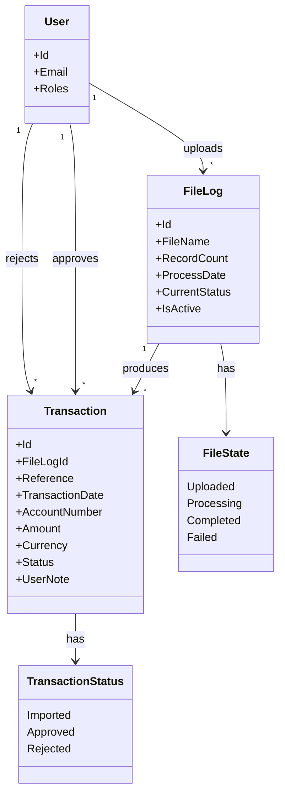

# Requirements: Transaction Import & Approval System

**Domain:** Financial services / banking back-office

**Created:** 2026-05-13 · **Status:** final · **Last finalised at:** 2026-05-13

---

## 1. Application context

**Name:** Transaction Import & Approval System

**Purpose / business value:** Enable Importers to upload and review transaction files, and Approvers to review, approve/reject, and export transactions.

**Domain:** Financial services / banking back-office

**Business goal:** Provide a controlled, file-driven pipeline for ingesting transactional records and applying a two-stage human review before any approved record is consumed downstream.

<!-- rev: run-1 2026-05-13 -->

---

## 2. Domain model

> The BA's framing of the business domain in **ubiquitous language**, implementation-free.

### 2.1 Concepts

| Concept | Persistence | Definition (ubiquitous language) |
| --- | --- | --- |
| File Log | persistent | Represents an uploaded file and its processing state. |
| Transaction | persistent | Represents individual records extracted from a file. |
| User | persistent | An authenticated principal who interacts with the system in one of the defined roles. |
| File State | policy | Lifecycle state of a File Log; one of Uploaded / Processing / Completed / Failed. |
| Transaction Status | policy | Lifecycle status of a Transaction; one of Imported / Approved / Rejected. |

### 2.2 Relationships

- File Log **produces** Transaction [1:N] — every transaction belongs to exactly one file log.
- User **uploads** File Log [1:N] — the uploading actor is recorded against the file log.
- User **approves** Transaction [1:N] — an Approver acts on a single transaction at a time.
- User **rejects** Transaction [1:N] — an Approver records a mandatory note alongside the rejection.
- File Log **has** File State [1:1] — exactly one current state per file log at any time.
- Transaction **has** Transaction Status [1:1] — exactly one current status per transaction at any time.

### 2.3 Aggregates & lifecycles

#### File Log

| Field | Value |
| --- | --- |
| Member concepts | File Log, Transaction, File State |
| Lifecycle states | Uploaded → Processing → Completed \| Failed |
| Key invariants | A file cannot be approved or rejected as a whole; only the individual transactions it produced can be acted on. Actions on transactions affect status only, not the file's structure. |

#### Transaction

| Field | Value |
| --- | --- |
| Member concepts | Transaction, Transaction Status, User Note |
| Lifecycle states | Imported → Approved \| Rejected |
| Key invariants | Approve and reject are only available while the transaction is in Imported state. Rejection requires a mandatory user note. |

### 2.4 Diagram

<!-- rev: run-1 2026-05-13 -->

---

## 3. Target users

> Target-user personas — the end users of the application being designed.

### Importer
| Field | Value |
| --- | --- |
| Role / job title | Importer |
| Expertise level | Intermediate — comfortable with file uploads and basic data inspection, but not a power user of approval workflows. |
| Stakes | Responsible for getting transactional files into the system reliably; visible to upstream operations if files fail to load. |
| Frequency of use | Daily — at least once per processing cycle when new transaction files arrive. |
| Driving forces — wants | Fast, predictable uploads with clear feedback that the file was accepted and parsed; visibility into per-file processing status. |
| Driving forces — fears | Submitting a file that silently fails to parse, or losing track of which files have completed processing. |

### Approver
| Field | Value |
| --- | --- |
| Role / job title | Approver |
| Expertise level | Senior reviewer — familiar with the transaction domain and the policies that determine whether a transaction should be approved or rejected. |
| Stakes | Personally accountable for every approval; rejections must carry a defensible reason. Mistakes propagate downstream. |
| Frequency of use | Multiple times per day during review cycles; primary working surface is the transaction table. |
| Driving forces — wants | Fast scan of a queue, clear filters, confidence in the action taken (approve / reject), and the ability to export the reviewed dataset. |
| Driving forces — fears | Approving or rejecting the wrong transaction; losing context after a filter change; missing required notes on rejections. |

<!-- rev: run-1 2026-05-13 -->

---

## 4. User goals & stories

> Quality signals live on the goal (outcome-level), not the story (behaviour-level).

### 4.1 Goals catalogue

| ID | Goal statement | Quality signals | Goal kind | Layout pref (optional) | UX-pattern pref (optional) |
| --- | --- | --- | --- | --- | --- |
| G-01 | Upload transaction files for processing. | Speed-to-confidence, error visibility | top-level | full-page upload panel | drag-and-drop with progress |
| G-02 | Review and approve or reject queued transactions. | Accuracy, throughput, decision confidence | top-level | data-table working surface | row-action approve/reject + confirm modal |
| G-03 | Export approved or filtered transactions for downstream consumption. | Faithfulness to current filter, predictable format | sub-level | action in table toolbar | one-click CSV export |
| G-04 | Monitor the processing status of uploaded files. | At-a-glance status, drill-down to detail | top-level | dashboard list | tabular file log with status column |

### 4.2 Stories by persona

#### Importer

##### Story: As an Importer, I want to upload a transaction file with the required metadata, so that the system can ingest it into a File Log.
| Field | Value |
| --- | --- |
| Goal | → §4.1 G-01 |
| Objective | Submit a single transaction file via the upload UI, providing FileSettingId, FileSettingName, and FileName, and receive immediate feedback on whether the file was accepted. |
| Context (frequency / expertise / stakes) | Daily; intermediate user; visible failure if the file does not load. |
| Linked task flow (optional) | → §5 File Upload |

##### Story: As an Importer, I want to see the processing status of every file I have uploaded, so that I can confirm files reached a completed state.
| Field | Value |
| --- | --- |
| Goal | → §4.1 G-04 |
| Objective | Open the File Log dashboard, locate the most recent uploads, and confirm each file is in a non-failed state. |
| Context (frequency / expertise / stakes) | Daily; intermediate user; needs to act if any file is in a Failed state. |
| Linked task flow (optional) | → §5 File Log Overview, → §5 File Summary View |

#### Approver

##### Story: As an Approver, I want to review the list of imported transactions, so that I can decide which ones to approve and which to reject.
| Field | Value |
| --- | --- |
| Goal | → §4.1 G-02 |
| Objective | Open the transaction table, optionally narrow with filters, and step through transactions in the Imported state. |
| Context (frequency / expertise / stakes) | Multiple times per day; senior reviewer; downstream impact of each decision. |
| Linked task flow (optional) | → §5 Transaction Table |

##### Story: As an Approver, I want to approve a single transaction with a confirmation step, so that I do not approve by accident.
| Field | Value |
| --- | --- |
| Goal | → §4.1 G-02 |
| Objective | Select an Imported transaction, click Approve, confirm in a modal, and observe the status transitioning to Approved. |
| Context (frequency / expertise / stakes) | Many per day; senior reviewer; reversible only by separate workflow. |
| Linked task flow (optional) | → §5 Approve Transaction |

##### Story: As an Approver, I want to reject a transaction with a mandatory note, so that the rejection rationale is captured for audit.
| Field | Value |
| --- | --- |
| Goal | → §4.1 G-02 |
| Objective | Select an Imported transaction, click Reject, enter the mandatory note, submit, and observe the status transitioning to Rejected. |
| Context (frequency / expertise / stakes) | Less frequent than approvals; senior reviewer; note is the audit artefact. |
| Linked task flow (optional) | → §5 Reject Transaction |

##### Story: As an Approver, I want to export the currently filtered set of transactions to CSV, so that I can hand them to downstream consumers.
| Field | Value |
| --- | --- |
| Goal | → §4.1 G-03 |
| Objective | Apply filters to the transaction table, click Export, and download a CSV reflecting the current view. |
| Context (frequency / expertise / stakes) | Per review cycle; senior reviewer; output must match what is visible on screen. |
| Linked task flow (optional) | → §5 Export Transactions |

---

## 5. Task flows

### Flow: Authentication

| Field | Value |
| --- | --- |
| Actor | Importer or Approver |
| Trigger | User enters email + password |
| Steps | 1. User opens the login page. 2. User submits credentials. 3. Backend validates credentials and, on success, sets an HttpOnly, Secure, SameSite=Strict session cookie. 4. UI navigates to the role-specific landing page. |
| Decision points | On success → route to role-specific landing |
| Exception paths | On failure → error state with a generic message that does not reveal which field was incorrect. |
| Role-conditional behaviour | Landing destination differs by role: Importers land on the Upload screen; Approvers land on the Transaction Table. |

### Flow: File Upload

| Field | Value |
| --- | --- |
| Actor | Importer |
| Trigger | Importer selects file. |
| Steps | 1. Select file (drag & drop supported). 2. Provide FileSettingId, FileSettingName, FileName. 3. Submit upload. 4. System creates File Log. 5. Status shown in UI. |
| Decision points | Required metadata must be provided before upload can proceed: FileSettingId, FileSettingName, FileName. |
| Exception paths | Success / failure feedback is rendered after upload. On failure, the file is not parsed and no File Log row is created in a Completed state. |
| Role-conditional behaviour | Available to Importer only; Approver cannot upload. |

### Flow: File Log Overview

| Field | Value |
| --- | --- |
| Actor | Importer or Approver |
| Trigger | User opens the File Logs dashboard. |
| Steps | 1. Open dashboard. 2. View list of uploaded files with columns: File Name, Process Date, Record Count, Status. 3. Optionally click a row to drill into transactions. |
| Decision points | Row click → drill into transactions. |
| Exception paths | Empty list when no files have been uploaded; the empty state names the entity (File Logs) and offers the upload CTA to Importers only. |
| Role-conditional behaviour | All authenticated users see the dashboard; only Importers see the upload CTA in the empty state. |

### Flow: Transaction Table

| Field | Value |
| --- | --- |
| Actor | Importer or Approver |
| Trigger | User opens the transaction table from navigation or from a file log row. |
| Steps | 1. Open table. 2. Browse columns: Reference, Date, Account, Amount, Currency, Status. 3. Apply filters as needed. 4. (Approver only) Use row-level approve / reject actions. |
| Decision points | Row-level actions (Approve / Reject) are exposed only when the row's Status is Imported and only to Approvers. |
| Exception paths | Empty state when no transactions match. Distinguish "no data" from "no results from a filter". |
| Role-conditional behaviour | Approve / Reject row actions are hidden for Importers. |

### Flow: Search & Filtering

| Field | Value |
| --- | --- |
| Actor | Importer or Approver |
| Trigger | User applies filters or enters search text on a transaction or file log list. |
| Steps | 1. Open the filter panel. 2. Choose any of Status, File (FileLogId), Date range, Amount range, Text search. 3. Apply. 4. Table updates. |
| Decision points | Filter chips reflect active filters and offer Clear-all. |
| Exception paths | Zero-results state names the active filters and offers Clear-all instead of the create CTA. |
| Role-conditional behaviour | Same filters available to both roles; export of the filtered result is Approver-only. |

### Flow: Approve Transaction

| Field | Value |
| --- | --- |
| Actor | Approver |
| Trigger | Approver selects a transaction and clicks Approve. |
| Steps | 1. Select transaction. 2. Click Approve. 3. Confirm action in modal. 4. Status updates to Approved. |
| Decision points | Confirmation modal naming the affected transaction. |
| Exception paths | If the transaction is not in Imported status, Approve is hidden per BR-01. |
| Role-conditional behaviour | Approver only; Importer cannot approve. |

### Flow: Reject Transaction

| Field | Value |
| --- | --- |
| Actor | Approver |
| Trigger | Approver selects a transaction and clicks Reject. |
| Steps | 1. Select transaction. 2. Click Reject. 3. Enter mandatory note. 4. Submit. 5. Status updates to Rejected. |
| Decision points | A user note is required before submit can proceed. |
| Exception paths | If the note field is empty, the submit control remains disabled and inline validation flags the field as required. |
| Role-conditional behaviour | Approver only; Importer cannot reject. |

### Flow: Export Transactions

| Field | Value |
| --- | --- |
| Actor | Approver |
| Trigger | Approver clicks Export from the transaction table. |
| Steps | 1. Apply filters (optional). 2. Click Export. 3. CSV file is generated and downloaded reflecting the active filter set. |
| Decision points | Export uses the currently filtered dataset, not the full table. |
| Exception paths | An empty filtered dataset still produces a header-only CSV; the user is informed via a toast. |
| Role-conditional behaviour | Export action is hidden for Importer; visible for Approver. |

### Flow: File Summary View

| Field | Value |
| --- | --- |
| Actor | Importer or Approver |
| Trigger | User opens a File Log's summary view (drill-down from the dashboard). |
| Steps | 1. From dashboard, click a file log row. 2. Summary view renders: total records, count by status (Imported / Approved / Rejected). |
| Decision points | Status counts are derived from the file's transactions. |
| Exception paths | If the file is still Processing or Failed, counts may be incomplete; the view shows the file's current state prominently. |
| Role-conditional behaviour | Same data shown to both roles; no role-conditional UI in the summary itself. |

---

## 6. Requirements

### 6.1 Functional

- Authenticate users with username and password against a server-side bcrypt-hashed credential store; on success, issue an HttpOnly, Secure, SameSite=Strict session cookie.- Allow Importers to upload a transaction file with FileSettingId, FileSettingName, and FileName, and create a corresponding File Log on the server.
- Process uploaded files into Transactions; expose the file's lifecycle via `LastExecutedActivityName` / `CurrentStatus` on the File Log.
- Display the list of uploaded files with columns File Name, Process Date, Record Count, Status.- Display the list of transactions with Reference, Date, Account, Amount, Currency, Status.- Allow Approvers to approve or reject individual transactions while they are in the Imported state.
- Require a mandatory user note for every rejection.- Allow Approvers to export the currently filtered transaction dataset as CSV.
- Provide search and filtering across Status, File (FileLogId), Date range, Amount range, and free text on Reference / Account.- Provide a file summary view showing total records and a count by status (Imported / Approved / Rejected).- Allow Approvers to log out via an endpoint that invalidates the session cookie.

### 6.2 Business rules

| ID | Statement (when / then) | Enforcement point | Source | Severity |
| --- | --- | --- | --- | --- |
| BR-01 | When a transaction's status is not Imported, then the Approve and Reject row actions must be hidden. | UI + service | → §2.3 Transaction invariant | blocker |
| BR-02 | When an Approver rejects a transaction, then a non-empty user note must be supplied. | UI + service | → §2.3 Transaction invariant | blocker |
| BR-03 | When the authenticated role is Importer, then the Approve and Reject actions must be hidden across the UI. | UI | → §6.5 RBAC | blocker |
| BR-04 | When the authenticated role is Approver, then the File Upload entry point and route must be hidden. | UI | → §6.5 RBAC | blocker |
| BR-05 | When login fails, then the error response and the UI message must not reveal which credential field was incorrect. | service + UI | consultant input (auth-api) | major |
| BR-06 | When a transaction's status changes (Approved or Rejected), then the new status must be reflected in the transaction table without a manual refresh. | UI | → §2.3 Transaction invariant | major |
| BR-07 | When a file log is in Failed state, then the file summary view must surface the failure prominently and inhibit drill-down into transactions until retry succeeds. | UI | → §2.3 File Log invariant | major |

### 6.3 Data

- Persist File Log records with the attributes listed in §7 Entity: File Log. The `LastExecutedActivityName` field doubles as the user-visible file status.- Persist Transaction records produced from each parsed File Log. `Status` is the gating field for approval and rejection.
- Persist User records, including bcrypt-hashed credentials.- Capture the rejecting user's note against the Transaction; expose it on the transaction detail surface.
- Capture `LastChangedUser` and `LastChangedDate` on every mutating action against File Log, Transaction, and User entities, sourced from the `LastChangedUser` request header convention used across the API.

### 6.4 User-facing

- Tables (File Logs, Transactions) render the pagination control consistently with a rows-per-page selector offering 5 / 10 / 20 / 50 and a default of 20.- All table columns are sortable; sorting is single-column, ascending on first click, descending on second; persists for the session.- Synchronous form validation (format, required, length) runs on blur; cross-field and server-side validation runs on submit; no validation runs on keystroke.- The approve and reject row actions are gated by a modal confirmation that names the affected transaction (e.g., "Approve transaction TXN-20260415-0001?"); default focus is on Cancel, not on the destructive primary.- Empty-state copy names the entity ("No transactions yet", "No file logs yet") and offers the primary creation CTA where applicable.- Empty filter results show active filter chips and a Clear-all action; the create CTA is suppressed in this variant.- Transient confirmations (approval / rejection / export complete) use toasts auto-dismissing in 4–8 s, top-right. Persistent state (offline, session-about-to-expire, file-failed banners) uses banners.- Status badges colour-code by intent: Imported → blue/info, Approved → green/success, Rejected → red/error, Processing → amber/warning, Failed → red/error, Uploaded → grey/neutral, Completed → green/success. Colour is always paired with a text label or icon.- Icon-only controls (row-action toolbar, table-row actions) provide tooltips and matching `aria-label` text; icon-only is never used for primary destructive actions.- On screens below 768 px, tables collapse into a vertical card list (primary identifier + 2–3 key columns + overflow).- Login error message is generic and does not reveal which field was incorrect.
### 6.5 Access control (RBAC)

> Roles-×-resources matrix. Cell values use the action vocabulary below; blanks mean "no access".

**Action vocabulary:** `C` create · `R` read · `U` update · `D` delete · `X` execute / invoke · `A` approve · `—` no access. Suffix with a BR ref for conditional access (e.g. `U†BR-01`).

| Role (→ §3) | User | File Log | Transaction | Authentication | File Upload | File Log Overview | Transaction Table | Search & Filtering | Approve Transaction | Reject Transaction | Export Transactions | File Summary |
| --- | --- | --- | --- | --- | --- | --- | --- | --- | --- | --- | --- | --- |
| Importer | R | C R | R | X | X | X | X | X | — | — | — | X |
| Approver | R | R | R U†BR-01 | X | — | X | X | X | A†BR-01 | A†BR-02 | X | X |

### 6.6 Non-functional

#### 6.6.1 Security & session

| Field | Value | Source |
| --- | --- | --- |
| Idle session timeout | 15 minutes | inferred (financial domain default) |
| Absolute session timeout | 8 hours | inferred (financial domain default) |
| Idle warning lead-time | 60 seconds before idle logout | inferred (financial domain default) |
| Re-auth scope | Step-up authentication required for approve and reject actions | inferred (financial domain default) |
| Account lockout policy | 5 failed attempts → 15-minute cooldown; cooldown resets on successful authentication | inferred |
| MFA requirement | Optional for Importer; required for Approver | inferred |
| Session cookie attributes | HttpOnly, Secure, SameSite=Strict, Path=/; set by POST /v1/auth/login; cleared by POST /v1/auth/logout via Max-Age=0. | stated (auth-api) |
| Password storage | Server-side bcrypt hash; plaintext password transmitted over HTTPS only. | stated (auth-api) |

#### 6.6.2 Performance

| Metric | Target | Source |
| --- | --- | --- |
| p95 page TTI on Transaction Table | ≤ 2 s for ≤ 1 000 rows | inferred |
| API p99 latency for `/v1/transactions` GET | ≤ 500 ms | inferred |
| API p99 latency for approve / reject | ≤ 800 ms | inferred |
| CSV export ready-to-download | ≤ 3 s for ≤ 10 000 rows | inferred |

#### 6.6.3 Availability

| Field | Value | Source |
| --- | --- | --- |
| Target uptime | 99.5 % during business hours; 99.0 % overall | inferred |
| Maintenance window | Weekly Sunday 02:00–04:00 local time | inferred |
| RTO / RPO | RTO 4 hours / RPO 1 hour | inferred |

#### 6.6.4 Compliance & audit

- POPIA (South Africa) — implied by the use of ZAR currency in the sample dataset and South African account-number formats.- Audit trail: every approve, reject, upload, login, and logout event is recorded with `LastChangedUser` and `LastChangedDate`; retain 7 years.
- No PII is rendered in error toasts or browser console.

#### 6.6.5 Accessibility

- WCAG 2.2 AA conformance, full keyboard reach for all primary actions, screen-reader semantics on status badges.

---

## 7. Data entities

> Implementation-prep view: storage shape, types, validations, FK plumbing.

### Entity: User
| Field | Type | Required | Validation | Notes |
| --- | --- | --- | --- | --- |
| Id | int | yes | server-assigned | Primary key. |
| Email | string | yes | RFC 5322 format; unique | Login identifier. |
| FirstName | string | yes | 1–64 chars | Display name. |
| LastName | string | yes | 1–64 chars | Display name. |
| Password | string (write-only) | yes (create) | min length 8; complexity per security policy | Stored as bcrypt hash; never returned. |
| Roles | list<RoleRead> | yes | non-empty | Drives RBAC. |
| LastChangedUser | string | yes | — | Audit field. |
| LastChangedDate | string (ISO timestamp) | yes | — | Audit field. |

**Domain concept:** User

**Relationships:** User uploads File Log [1:N]; User approves / rejects Transaction [1:N].

**Enums:** Roles → { Importer, Approver }.

### Entity: File Log
| Field | Type | Required | Validation | Notes |
| --- | --- | --- | --- | --- |
| Id | int | yes | server-assigned | Primary key. |
| FileName | string | yes | non-empty | Original filename submitted at upload. |
| RecordCount | string | yes | numeric | Number of transactions parsed from the file; API returns as string. |
| LastExecutedActivityName | string | yes | one of { Uploaded, Processing, Completed, Failed } | Used as the user-visible file status. |
| ProcessDate | string (date-time) | yes | ISO 8601 | When the file was processed. |
| IsActive | boolean | yes | — | Soft-delete / archival flag. |
| SettingId | int | yes | references FileSetting.Id | Upload-time setting reference. |
| SettingName | string | yes | — | Snapshot of FileSetting.Name at upload. |
| CurrentStatus | string | no | — | Operational status complement to LastExecutedActivityName. |
| FileHash | string | no | sha-256 hex | Integrity check. |

**Domain concept:** File Log

**Relationships:** File Log produces Transaction [1:N]; File Log belongs to FileSetting [N:1].

**Enums:** LastExecutedActivityName → { Uploaded, Processing, Completed, Failed }.
### Entity: Transaction
| Field | Type | Required | Validation | Notes |
| --- | --- | --- | --- | --- |
| Id | int | yes | server-assigned | Primary key. |
| FileLogId | int | yes | references FileLog.Id | Parent file log. |
| FileName | string | yes | — | Denormalised from FileLog for table display. |
| Reference | string | yes | unique within file | External transaction reference. |
| TransactionDate | string (date-time) | yes | ISO 8601 | Business date / time of the transaction. |
| AccountNumber | string | yes | non-empty | Source account. |
| Description | string | no | — | Free-text description. |
| Amount | decimal | yes | ≥ 0 | Absolute amount; sign determined by TransactionType. |
| TransactionType | string | yes | one of { C, D } | C = credit; D = debit. |
| Currency | string | yes | ISO 4217 (3 chars) | e.g., ZAR. |
| Status | string | yes | one of { Imported, Approved, Rejected } | Drives BR-01. |
| UserNote | string | yes when Status = Rejected | non-empty on Reject | Rejection rationale. |
| LastChangedUser | string | yes | — | Audit field; set on approve/reject. |
| LastChangedDate | string (ISO timestamp) | yes | — | Audit field. |

**Domain concept:** Transaction

**Relationships:** Transaction belongs to File Log [N:1].

**Enums:** Status → { Imported, Approved, Rejected }. TransactionType → { C, D }.
---

## 8. Source UI references

| Reference | Location | Notes |
| --- | --- | --- |
| Prototype Brief | input/PrototypeBriefV2.md | Authoritative source for the screen list, role descriptions, lifecycle states, and BR-01 / BR-02. |
| BFF Authentication API | input/auth-api.yaml | Authoritative source for session cookie attributes (HttpOnly, Secure, SameSite=Strict), password storage (bcrypt), and the generic-error pattern on login failure. |
| Transaction Management API | input/transactions-api.yaml | Authoritative source for entity attributes (TransactionRead, FileLog), endpoint shapes, and the `LastChangedUser` audit header convention. |
| Sample transaction dataset | input/transactions_2026-04-15.csv | Reference shape for the parsed transaction format; informs Currency = ZAR domain context and TransactionType enum { C, D }. |

---

## 9. Key terminology

| Term | Definition | Inconsistency flag |
| --- | --- | --- |
| File Log | An uploaded file and its processing state; the anchor object that owns transactions. | brief and APIs use "File Log" interchangeably with "FileLog" in code-context. |
| Transaction | A single record extracted from a File Log; carries Status. | — |
| Importer | A user authorised to upload files and view transactions, but not to approve or reject. | — |
| Approver | A user authorised to review, approve, reject, and export transactions, but not to upload files. | — |
| Imported | The initial Status of every parsed Transaction. | — |
| Approved | A Transaction Status set by an Approver via the Approve flow. | — |
| Rejected | A Transaction Status set by an Approver via the Reject flow; requires a mandatory user note. | — |
| Session cookie | The HttpOnly, Secure, SameSite=Strict cookie set on successful login. | — |
| FileSetting | A configuration record referenced by FileSettingId at upload time; provides the parsing context for an uploaded file. | Only surfaced via API; not described in the brief. |

---

## 10. Volumes

| Metric | Value | Source |
| --- | --- | --- |
| Data volume | 10²–10⁴ transactions per file; 10³–10⁵ transactions retained per active file log overall | inferred |
| Frequency | Daily ingestion cycle, one or more files per business day per Importer | inferred |
| Concurrency | Typically one concurrent user per role only (≈ 1 Importer + 1 Approver active at a time) | consultant-corrected |

---
