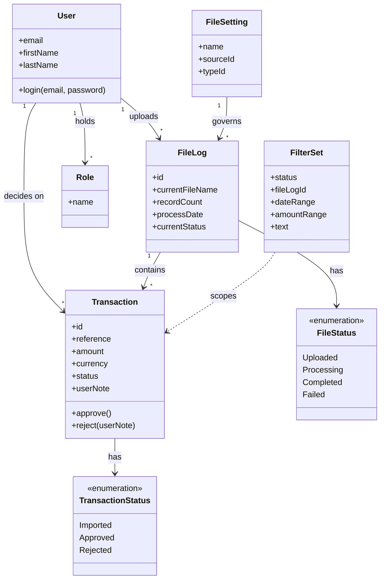

# Requirements: Transaction Import & Approval System

**Domain:** Financial services — banking transaction management **Created:** 2026-05-05 **Status:** final **Last finalised at:** 2026-05-05

---

## 1. Application context

**Name:** Transaction Import & Approval System

**Purpose / business value:** Replace manual review of bulk transaction files with a structured, role-separated digital workflow: Importers upload transaction files; Approvers review the resulting transactions and approve or reject each, with mandatory justification on rejection, and export the resulting filtered set for downstream use.

**Domain:** Financial services — banking transaction management

**Business goal:** Provide an auditable approval trail for every imported transaction, enforce role-segregation between upload and approval, and make rejection grounds explicit so downstream reconciliation has a documented reason for every non-approval.

<!-- rev: run-1 2026-05-05 -->

---

## 2. Domain model

> The BA's framing of the business domain in **ubiquitous language**, implementation-free.

### 2.1 Concepts

| Concept            | Persistence | Definition (ubiquitous language)                                                                                                                |
| ------------------ | ----------- | ----------------------------------------------------------------------------------------------------------------------------------------------- |
| File Log           | persistent  | A record of an uploaded transaction file together with its current processing state.                                                            |
| Transaction        | persistent  | An individual financial movement (credit or debit) extracted from a file, decided on independently by an Approver.                              |
| User               | persistent  | An authenticated person interacting with the system, holding one or more Roles.                                                                 |
| Role               | persistent  | A named capability set assigned to a User; for this prototype: Importer or Approver.                                                            |
| File Setting       | persistent  | A reusable configuration that defines how files of a particular kind are received, parsed, and routed.                                          |
| Transaction Status | policy      | The decision state of a Transaction: Imported (awaiting decision), Approved, or Rejected.                                                       |
| File Status        | policy      | The processing state of a File Log: Uploaded, Processing, Completed, or Failed.                                                                 |
| Filter Set         | derived     | The combined set of search and filter selections active in the Transaction or File Log views, used for both display and CSV export scoping.     |

### 2.2 Relationships

- **File Log contains many Transactions** [1:N]
- **Transaction belongs to one File Log** [N:1]
- **User holds many Roles** [N:N]
- **Role grants access to many Pages** [N:N]
- **Approver decides on many Transactions** [1:N] — produces an Approved or Rejected outcome with optional UserNote (mandatory on Rejected)
- **Importer uploads many Files** [1:N] — produces a File Log with Transactions
- **File Setting governs many File Logs** [1:N]

### 2.3 Aggregates & lifecycles

#### File Log

| Field            | Value                                                                                                                                        |
| ---------------- | -------------------------------------------------------------------------------------------------------------------------------------------- |
| Member concepts  | File Log, Transaction, File Setting (referenced)                                                                                             |
| Lifecycle states | Uploaded → Processing → Completed; from Processing or Uploaded a Failed terminal state is possible (validation or processing error)          |
| Key invariants   | Transactions inherit FileLog context (file name, source); a File Log moves to Completed only after all rows have been classified Imported or rejected at validation; a Failed File Log retains its row record so the Importer can retry validation. |

#### Transaction

| Field            | Value                                                                                                                                        |
| ---------------- | -------------------------------------------------------------------------------------------------------------------------------------------- |
| Member concepts  | Transaction, Transaction Status, UserNote                                                                                                    |
| Lifecycle states | Imported → Approved (terminal) ⌥ Imported → Rejected (terminal)                                                                              |
| Key invariants   | Approve and Reject are valid only from Imported; Reject requires a non-empty UserNote; once Approved or Rejected, a transaction is read-only and its status cannot be reverted in this prototype. |

#### User

| Field            | Value                                                                                                                |
| ---------------- | -------------------------------------------------------------------------------------------------------------------- |
| Member concepts  | User, Role                                                                                                           |
| Lifecycle states | Active → Inactive (`IsActive` boolean from API)                                                                      |
| Key invariants   | A User must have ≥ 1 Role; an Importer cannot approve or reject; an Approver cannot upload files.                    |

### 2.4 Diagram

---

## 3. Target users

> Target-user personas — the end users of the application being designed. Not to be confused with the Unicorn (LLM) or the Consultant (audience).

### Importer

| Field                  | Value                                                                                                                                                                |
| ---------------------- | -------------------------------------------------------------------------------------------------------------------------------------------------------------------- |
| Role / job title       | Operations user responsible for getting transaction files into the system                                                                                            |
| Expertise level        | Intermediate; understands the source file format and column meaning                                                                                                  |
| Stakes                 | Medium — file lands successfully and validation errors are visible early                                                                                             |
| Frequency of use       | Daily, often multiple uploads per day                                                                                                                                |
| Driving forces — wants | Quick upload feedback; visible processing status; ability to retry validation without re-uploading; clear errors when rows fail.                                     |
| Driving forces — fears | Silent upload failures; no way to verify that a file landed; having to re-upload large files because of one bad row.                                                 |

### Approver

| Field                  | Value                                                                                                                                                                |
| ---------------------- | -------------------------------------------------------------------------------------------------------------------------------------------------------------------- |
| Role / job title       | Senior operations user / financial controller responsible for transaction decisions                                                                                  |
| Expertise level        | High; understands transaction context and grounds for rejection                                                                                                      |
| Stakes                 | High — decisions are auditable and have downstream financial impact                                                                                                  |
| Frequency of use       | Daily review cycle, typically a single sustained session                                                                                                             |
| Driving forces — wants | Confidence that no Imported transaction is missed; quick keyboard-friendly approve/reject; CSV export for downstream reporting; clear rejection-note capture.        |
| Driving forces — fears | Approving in error; missing a transaction; rejection without a recorded reason; export that doesn't honour the active filter.                                        |

<!-- rev: run-1 2026-05-05 -->

---

## 4. User goals & stories

> Quality signals live on the goal (outcome-level), not the story (behaviour-level).

### 4.1 Goals catalogue

| ID    | Goal statement                                                                       | Quality signals                                                                       | Goal kind      | Layout pref (optional) | UX-pattern pref (optional)                                  |
| ----- | ------------------------------------------------------------------------------------ | ------------------------------------------------------------------------------------- | -------------- | ---------------------- | ----------------------------------------------------------- |
| G-01  | Authenticate into the system as the right role.                                      | Login feedback within 2 s; failed-credential message inline, not generic.             | top-level      | centred-card           | email + password form with inline 401 error                 |
| G-02  | Upload transaction files and verify they were processed correctly.                   | Upload progress visible; FileLog status updates without page reload; failures itemised. | top-level      | full-page              | drag-and-drop with progress + status table                  |
| G-03  | Review imported transactions and decide which to approve and reject, with justification. | Every Imported transaction reachable in ≤ 2 clicks; reject note never lost on cancel. | top-level      | full-page              | data-table with row-level actions and confirmation modals   |
| G-04  | Filter and search transactions to find a relevant subset.                            | Filter chips visible; clear-all available; result count shown.                        | sub-level      | top-anchored filter bar | filter-chip + result-count pattern                          |
| G-05  | Export approved/filtered transactions for downstream use.                            | Exported CSV honours active filters; filename includes timestamp.                     | sub-level      | inline action          | export-button with active-filter chip echo                  |
| G-06  | View the operational state of all files (and their transactions) at a glance.        | Dashboard shows file-level status counts; row click drills into transactions.         | top-level      | dashboard              | summary-cards + file-log table                              |

### 4.2 Stories by persona

#### Importer

##### Story: As an Importer, I want to log in with my email and password, so that I see the screens permitted to my role.

| Field                                    | Value                                                                                  |
| ---------------------------------------- | -------------------------------------------------------------------------------------- |
| Goal                                     | → §4.1 G-01                                                                            |
| Objective                                | Authenticate and land on the role-appropriate first screen.                            |
| Context (frequency / expertise / stakes) | Daily; intermediate user; medium stakes (login is the gate to all work).               |
| Linked task flow (optional)              | → §5 Authenticate                                                                      |

##### Story: As an Importer, I want to upload a transaction file with the correct file setting, so that the system can process its rows.

| Field                                    | Value                                                                                  |
| ---------------------------------------- | -------------------------------------------------------------------------------------- |
| Goal                                     | → §4.1 G-02                                                                            |
| Objective                                | Submit a file and capture the resulting File Log id.                                   |
| Context (frequency / expertise / stakes) | Daily, often multiple times; intermediate; medium stakes.                              |
| Linked task flow (optional)              | → §5 Upload File                                                                       |

##### Story: As an Importer, I want to see the processing status of files I uploaded, so that I know whether they completed or failed.

| Field                                    | Value                                                                                  |
| ---------------------------------------- | -------------------------------------------------------------------------------------- |
| Goal                                     | → §4.1 G-06                                                                            |
| Objective                                | Track processing state and pick up failures quickly.                                   |
| Context (frequency / expertise / stakes) | Daily; intermediate; medium stakes.                                                    |
| Linked task flow (optional)              | → §5 View File Logs                                                                    |

##### Story: As an Importer, I want to retry validation on a Failed file, so that I can fix data issues without re-uploading.

| Field                                    | Value                                                                                  |
| ---------------------------------------- | -------------------------------------------------------------------------------------- |
| Goal                                     | → §4.1 G-02                                                                            |
| Objective                                | Re-trigger validation against the existing File Log row.                               |
| Context (frequency / expertise / stakes) | Occasional; intermediate; medium stakes.                                               |
| Linked task flow (optional)              | → §5 Retry Validation                                                                  |

#### Approver

##### Story: As an Approver, I want to log in with my email and password, so that I see the screens permitted to my role.

| Field                                    | Value                                                                                  |
| ---------------------------------------- | -------------------------------------------------------------------------------------- |
| Goal                                     | → §4.1 G-01                                                                            |
| Objective                                | Authenticate and land on the role-appropriate first screen.                            |
| Context (frequency / expertise / stakes) | Daily; high expertise; high stakes (decisions are downstream-binding).                 |
| Linked task flow (optional)              | → §5 Authenticate                                                                      |

##### Story: As an Approver, I want to see all transactions in the Imported state, so that I know what awaits my decision.

| Field                                    | Value                                                                                  |
| ---------------------------------------- | -------------------------------------------------------------------------------------- |
| Goal                                     | → §4.1 G-03                                                                            |
| Objective                                | Surface the Imported queue as the default working set.                                  |
| Context (frequency / expertise / stakes) | Daily; high; high.                                                                      |
| Linked task flow (optional)              | → §5 View Transactions                                                                  |

##### Story: As an Approver, I want to approve a transaction, so that it is recorded as cleared.

| Field                                    | Value                                                                                  |
| ---------------------------------------- | -------------------------------------------------------------------------------------- |
| Goal                                     | → §4.1 G-03                                                                            |
| Objective                                | Move a single transaction from Imported to Approved with confirmation.                  |
| Context (frequency / expertise / stakes) | Many per session; high; high.                                                           |
| Linked task flow (optional)              | → §5 Approve Transaction                                                                |

##### Story: As an Approver, I want to reject a transaction with a mandatory note, so that the rejection is auditable.

| Field                                    | Value                                                                                  |
| ---------------------------------------- | -------------------------------------------------------------------------------------- |
| Goal                                     | → §4.1 G-03                                                                            |
| Objective                                | Capture the rejection reason with the state change.                                     |
| Context (frequency / expertise / stakes) | Several per session; high; high.                                                        |
| Linked task flow (optional)              | → §5 Reject Transaction                                                                 |

##### Story: As an Approver, I want to filter transactions by status, file, date, amount, and free text, so that I can focus on a relevant subset.

| Field                                    | Value                                                                                  |
| ---------------------------------------- | -------------------------------------------------------------------------------------- |
| Goal                                     | → §4.1 G-04                                                                            |
| Objective                                | Narrow the working set without losing context on toggle.                                |
| Context (frequency / expertise / stakes) | Continuous; high; high.                                                                 |
| Linked task flow (optional)              | → §5 Search & Filter                                                                    |

##### Story: As an Approver, I want to export the currently filtered transactions to CSV, so that downstream tools can consume them.

| Field                                    | Value                                                                                  |
| ---------------------------------------- | -------------------------------------------------------------------------------------- |
| Goal                                     | → §4.1 G-05                                                                            |
| Objective                                | Produce a CSV that exactly matches the active filter set.                               |
| Context (frequency / expertise / stakes) | Daily/end-of-session; high; high.                                                       |
| Linked task flow (optional)              | → §5 Export Transactions                                                                |

##### Story: As an Approver, I want to see file-level summaries of imported / approved / rejected counts, so that I can track review progress.

| Field                                    | Value                                                                                  |
| ---------------------------------------- | -------------------------------------------------------------------------------------- |
| Goal                                     | → §4.1 G-06                                                                            |
| Objective                                | Surface per-file decision progress at a glance.                                         |
| Context (frequency / expertise / stakes) | Daily; high; high.                                                                      |
| Linked task flow (optional)              | → §5 View File Summary                                                                  |

---

## 5. Task flows

### Flow: Authenticate

| Field                      | Value                                                                                                                                  |
| -------------------------- | -------------------------------------------------------------------------------------------------------------------------------------- |
| Actor                      | Importer / Approver (→ §3)                                                                                                             |
| Trigger                    | App opened with no active session, or session expired.                                                                                 |
| Steps                      | 1. Enter email · 2. Enter password · 3. Submit (`POST /v1/users/login`) · 4. On 200, route to role-appropriate landing · 5. On 401, show inline error and clear password. |
| Decision points            | 200 (success) → role-routed landing; 401 (invalid credentials) → inline error.                                                         |
| Exception paths            | 401 invalid credentials, 500 server error (banner + retry).                                                                            |
| Role-conditional behaviour | Importer lands on Upload page; Approver lands on Transactions page.                                                                    |

### Flow: Upload File

| Field                      | Value                                                                                                                                  |
| -------------------------- | -------------------------------------------------------------------------------------------------------------------------------------- |
| Actor                      | Importer (→ §3)                                                                                                                        |
| Trigger                    | Importer clicks Upload from main navigation or dashboard CTA.                                                                          |
| Steps                      | 1. Choose File Setting · 2. Confirm File Setting Name · 3. Select file (drag-drop or browse) · 4. Confirm File Name · 5. Submit (`POST /v1/files/upload`) · 6. Watch progress · 7. On success, see new File Log row · 8. On failure, see error and option to retry. |
| Decision points            | File-Setting selection (required); file picked (required); upload result.                                                              |
| Exception paths            | File too large; unsupported file format; network error mid-upload; server validation failure on the resulting File Log.                |
| Role-conditional behaviour | Importer-only flow; Upload nav item is hidden for Approver (BR-04).                                                                    |

### Flow: View File Logs

| Field                      | Value                                                                                                                                  |
| -------------------------- | -------------------------------------------------------------------------------------------------------------------------------------- |
| Actor                      | Importer / Approver (→ §3)                                                                                                             |
| Trigger                    | User opens dashboard or navigates to File Logs.                                                                                        |
| Steps                      | 1. Load File Logs (`GET /v1/file-logs?IsActive=Yes`) · 2. Render paginated table (File Name, Process Date, Record Count, Status) · 3. Sort/filter as needed · 4. Click a row → navigate to Transaction Table filtered by the selected FileLogId. |
| Decision points            | Row click → drill-down; status badge interpretation drives row affordances (Failed → Retry CTA visible to Importer per BR-06).         |
| Exception paths            | Zero-data empty state (entity-named CTA); zero-results state when filters are applied.                                                  |
| Role-conditional behaviour | Both roles see the dashboard and identical columns; only Importer sees the Retry Validation row action on Failed rows (BR-06).         |

### Flow: View Transactions

| Field                      | Value                                                                                                                                  |
| -------------------------- | -------------------------------------------------------------------------------------------------------------------------------------- |
| Actor                      | Importer / Approver (→ §3)                                                                                                             |
| Trigger                    | Direct navigation, drill-down from a File Log row, or deep-link.                                                                       |
| Steps                      | 1. Load transactions (`GET /v1/transactions`) · 2. Render paginated table (Reference, Date, Account, Amount, Currency, Status) · 3. Apply Search & Filter · 4. Click a row → open Transaction detail / action surface. |
| Decision points            | Row-level Approve / Reject visible only to Approver and only when status = Imported (BR-01, BR-03).                                    |
| Exception paths            | Zero-data empty state; zero-results filter state; loading indicators per the loading-threshold policy.                                  |
| Role-conditional behaviour | Approver sees Approve / Reject actions; Importer sees neither (BR-03).                                                                  |

### Flow: Approve Transaction

| Field                      | Value                                                                                                                                  |
| -------------------------- | -------------------------------------------------------------------------------------------------------------------------------------- |
| Actor                      | Approver (→ §3)                                                                                                                        |
| Trigger                    | Approver clicks Approve on a row or in a transaction detail surface.                                                                    |
| Steps                      | 1. Click Approve · 2. Modal confirmation showing transaction Reference (default focus on Cancel) · 3. Confirm · 4. Submit (`POST /v1/transactions/approve?TransactionId=…`) · 5. On 200, row Status updates to Approved and badge re-renders · 6. On error, restore prior state and show banner. |
| Decision points            | Confirm vs Cancel; success vs error.                                                                                                   |
| Exception paths            | 401 (re-auth required per BR-10); 500 server error; concurrency error if state already changed (re-fetch row).                         |
| Role-conditional behaviour | Importer cannot reach this flow; action is hidden in their UI (BR-03). Approver re-auth may be required for approve-class actions per the §6.6.1 session policy. |

### Flow: Reject Transaction

| Field                      | Value                                                                                                                                  |
| -------------------------- | -------------------------------------------------------------------------------------------------------------------------------------- |
| Actor                      | Approver (→ §3)                                                                                                                        |
| Trigger                    | Approver clicks Reject on a row or in a transaction detail surface.                                                                    |
| Steps                      | 1. Click Reject · 2. Modal opens with transaction Reference and a required UserNote textarea (submit disabled while empty) · 3. Type note · 4. Submit (`POST /v1/transactions/reject?TransactionId=…` body `{ UserNote }`) · 5. On 200, row Status updates to Rejected and badge re-renders · 6. On error, retain note in the modal and show banner. |
| Decision points            | Note empty → submit disabled; success vs error.                                                                                        |
| Exception paths            | 401 (re-auth required); 500 server error; concurrency error if state already changed.                                                  |
| Role-conditional behaviour | Importer cannot reach this flow (BR-03). Approver re-auth may be required per the §6.6.1 session policy.                                |

### Flow: Search & Filter

| Field                      | Value                                                                                                                                  |
| -------------------------- | -------------------------------------------------------------------------------------------------------------------------------------- |
| Actor                      | Importer / Approver (→ §3)                                                                                                             |
| Trigger                    | User edits a filter control or types in the search box.                                                                                |
| Steps                      | 1. Choose filter (Status / FileLog / Date range / Amount range / Text on Reference or Account) · 2. Apply · 3. Result list updates · 4. Active filter chips render and can be cleared individually or via Clear-all. |
| Decision points            | Zero-results vs zero-data; date-range validity; amount-range validity.                                                                  |
| Exception paths            | Invalid date range (Start > End) → inline error; invalid amount range similarly.                                                        |
| Role-conditional behaviour | Both roles see the same filter set; the resulting export is Approver-only.                                                              |

### Flow: Export Transactions

| Field                      | Value                                                                                                                                  |
| -------------------------- | -------------------------------------------------------------------------------------------------------------------------------------- |
| Actor                      | Approver (→ §3)                                                                                                                        |
| Trigger                    | Approver clicks Export on the Transactions page.                                                                                       |
| Steps                      | 1. Read current Filter Set · 2. Refetch matching transactions from `GET /v1/transactions` · 3. Apply filter client-side · 4. Format as CSV (Reference, Date, Account, Description, Amount, TransactionType, Currency, Status, UserNote, FileName) · 5. Trigger browser download with timestamped filename (`transactions_<YYYY-MM-DD>_<HHmm>.csv`). |
| Decision points            | Empty result set → confirm-or-cancel modal warning.                                                                                     |
| Exception paths            | Network error → toast retry; very large export → progress affordance.                                                                   |
| Role-conditional behaviour | Importer cannot see the Export button; export is an Approver-only capability (BR-04 spirit).                                            |

### Flow: View File Summary

| Field                      | Value                                                                                                                                  |
| -------------------------- | -------------------------------------------------------------------------------------------------------------------------------------- |
| Actor                      | Importer / Approver (→ §3)                                                                                                             |
| Trigger                    | User clicks a File Log row's "Summary" affordance, or navigates to the file detail screen.                                              |
| Steps                      | 1. Load File Log header · 2. Aggregate transactions by status (Imported / Approved / Rejected) · 3. Render counts and total · 4. Provide drill-through links to the Transaction Table pre-filtered by file and status. |
| Decision points            | Summary tile click → filtered Transaction Table.                                                                                        |
| Exception paths            | File with zero transactions → entity-named empty state.                                                                                 |
| Role-conditional behaviour | Both roles see the same summary; only Approver sees Approve / Reject actions in the drill-through.                                      |

### Flow: Retry Validation

| Field                      | Value                                                                                                                                  |
| -------------------------- | -------------------------------------------------------------------------------------------------------------------------------------- |
| Actor                      | Importer (→ §3)                                                                                                                        |
| Trigger                    | Importer clicks Retry Validation on a Failed File Log row.                                                                              |
| Steps                      | 1. Click Retry · 2. Confirm in modal · 3. Submit (`POST /v1/files/retry-validation?LogId=…`) · 4. File Log moves to Processing · 5. On completion, status updates without reload. |
| Decision points            | Retry succeeds → Completed; retry fails again → remains Failed with new error info.                                                     |
| Exception paths            | 401, 500; row remains Failed if retry returns no improvement.                                                                            |
| Role-conditional behaviour | Importer-only; Approvers don't see this row action (BR-04).                                                                              |

---

## 6. Requirements

### 6.1 Functional

- **F-01 Authenticate user.** Email + password against `POST /v1/users/login`. 200 routes to role-appropriate landing; 401 shows inline credential error; 500 shows banner.
- **F-02 Upload file (Importer).** Pick File Setting, file, and File Name; submit `POST /v1/files/upload`; show progress, then resulting File Log row in dashboard.
- **F-03 List file logs.** Render `GET /v1/file-logs?IsActive=Yes` as a paginated, sortable, filterable table with columns File Name, Process Date, Record Count, Status.
- **F-04 List transactions.** Render `GET /v1/transactions` as a paginated, sortable, filterable table with columns Reference, Transaction Date, Account, Description, Amount, Currency, Status.
- **F-05 Approve transaction (Approver).** From the Transactions table or detail view; gate on `Status = Imported`; submit `POST /v1/transactions/approve?TransactionId=…` after modal confirmation.
- **F-06 Reject transaction (Approver).** Modal with mandatory UserNote (submit disabled while note empty); submit `POST /v1/transactions/reject?TransactionId=…` body `{ UserNote }`.
- **F-07 Search and filter.** Status (multi-select), FileLogId (single-select), Date range, Amount range, free text on Reference and Account; clearable as chips with Clear-all.
- **F-08 Export transactions (Approver).** Client-side CSV generation from the active filter set; columns match the displayed table plus UserNote and FileName; timestamped filename.
- **F-09 File summary view.** Per-file totals plus per-status counts (Imported, Approved, Rejected); drill-through to filtered Transactions.
- **F-10 Role-gated navigation.** Importer sees Upload; Approver sees Export. Cross-role access to a deep-linked screen renders an in-page permission-denied banner naming the missing permission and pointing to a contact or request-access path; not a generic 403.
- **F-11 Retry validation (Importer).** Visible on Failed File Logs only; submits `POST /v1/files/retry-validation`.

### 6.2 Business rules

| ID    | Statement (when / then)                                                                                                                                          | Enforcement point | Source                                  | Severity |
| ----- | ---------------------------------------------------------------------------------------------------------------------------------------------------------------- | ----------------- | --------------------------------------- | -------- |
| BR-01 | When a transaction's Status is not "Imported", then approve and reject actions must be hidden in the row and detail view.                                        | UI                | input-stated (Brief §6 UI Implications) | blocker  |
| BR-02 | When a user rejects a transaction, then a non-empty UserNote must be supplied before the request is enabled.                                                     | UI + service      | input-stated (Brief §5.7)               | blocker  |
| BR-03 | When the current user's role is Importer, then approve and reject actions on transactions must be hidden from all UI surfaces.                                   | UI                | input-stated (Brief §4 Roles)           | blocker  |
| BR-04 | When the current user's role is Approver, then the file Upload affordance must be hidden from navigation and dashboard CTAs.                                     | UI                | input-stated (Brief §4 Roles)           | blocker  |
| BR-05 | When a transaction is rejected, then the recorded UserNote must accompany the status change in the audit trail.                                                  | service           | inferred from Brief §5.7                | major    |
| BR-06 | When a File Log's Status is Failed, then a Retry Validation row action must be visible to the Importer only.                                                     | UI                | input-stated (openapi `/files/retry-validation`) + Brief §4 | major  |
| BR-07 | When a File Log is in Processing state, then the row must show a non-clickable in-progress indicator and not allow drill-through into Transactions yet.          | UI                | inferred                                | major    |
| BR-08 | When approve or reject is invoked, then a confirmation modal naming the transaction Reference must be shown before the request fires, with default focus on Cancel. | UI                | derived from confirmation-gate policy   | blocker  |
| BR-09 | When export CSV is requested, then the file produced must contain only transactions matching the active Filter Set at the moment of request.                    | UI                | input-stated (Brief §5.8)               | major    |
| BR-10 | When a user's session reaches the §6.6.1 idle timeout, then a re-auth prompt must replace the screen content while preserving the active Filter Set on resume.   | UI                | derived from session-timeout policy     | major    |
| BR-11 | When a transaction is in Approved or Rejected state, then the row's status badge must use the canonical colour mapping (Approved → green, Rejected → red, Imported → blue) paired with a text label. | UI                | derived from status-colour policy       | major    |

### 6.3 Data

- Transaction list paginated: rows-per-page selector offers 5/10/20/50 with 20 as default; pagination chrome rendered even for small datasets.
- File Log list paginated with the same selector and defaults.
- All collection columns sortable by default: single-column sort, ascending on first click and descending on second; the active sort column is indicated in the header and persists for the session.
- Status fields rendered as colour + text badges; intent-mapped colours (success → green, error → red, warning → amber, info → blue, neutral → grey) with a paired icon or text label.
- Tables collapse to a vertical card list below 768 px, showing the primary identifier, 2–3 key columns, and a row-action overflow.
- Notification badge counts: exact counts up to 99; `99+` for higher counts; hidden for counts of 0.

### 6.4 User-facing

- Forms validate on blur for synchronous rules (format, required, length); on submit for cross-field and asynchronous rules (uniqueness, server-side checks); never on keystroke.
- Required fields marked with a leading asterisk and a single legend line above the form. If ≥ 80 % of fields are required, mark optional fields with "(optional)" instead and drop the asterisks.
- Forms autofocus the first editable input on open. Exception: forms preceded by a destructive or navigational confirmation step, where the primary cancel/back holds focus.
- Empty-state copy names the entity ("No file logs yet") and offers the primary creation CTA. Generic "No data" or "Nothing here" is not acceptable.
- Distinguish two empty variants: zero data (entity-specific empty state with creation CTA) vs zero results from a filter or search (active filter chips, Clear-all action, copy referencing the search/filter, no create CTA).
- Loading indicators: no indicator under 300 ms; skeleton matching the target layout for 300 ms – 3 s; skeleton plus a "still loading…" message for operations exceeding 3 s.
- Toasts (auto-dismiss 4–8 s, top-right) for transient confirmations; banners (persistent, top of page or section) for state requiring acknowledgement — offline, archived, permission-denied, validation summaries.
- Icon-only controls have a tooltip on hover and focus plus a matching `aria-label`; icon-only is never used for primary destructive actions.
- Approve and Reject actions are gated by a confirmation modal naming the affected entity and using a destructive-styled primary action; default focus is on Cancel.
- File Logs in read-only Failed/Completed terminal states hide mutating actions; a top-of-page banner names the state and the action (if any) that restores editability.
- Direct-link access to a denied screen renders an in-page permission-denied banner naming the missing permission and pointing to a contact or request-access path; not a generic 403.

### 6.5 Access control (RBAC)

> Roles-×-resources matrix. Cell values use the action vocabulary below; blanks mean "no access". A `†BR-NN` suffix indicates conditional access gated by the named business rule.

**Action vocabulary:** `C` create · `R` read · `U` update · `D` delete · `X` execute / invoke · `A` approve · `—` no access.

| Role (→ §3) | User    | Role | File Setting | File Log    | Transaction   | Authenticate | Upload File | View File Logs | View Transactions | Approve Transaction | Reject Transaction | Export Transactions | Search & Filter | View File Summary | Retry Validation |
| ----------- | ------- | ---- | ------------ | ----------- | ------------- | ------------ | ----------- | -------------- | ----------------- | ------------------- | ------------------ | ------------------- | --------------- | ----------------- | ---------------- |
| Importer    | R(self) | —    | R            | C R         | R             | X            | X           | X              | X                 | —                   | —                  | —                   | X               | X                 | X†BR-06          |
| Approver    | R(self) | —    | R            | R           | R A†BR-01     | X            | —           | X              | X                 | X†BR-01             | X†BR-01,BR-02      | X                   | X               | X                 | —                |

<!-- Importer Transaction column: R only (no approve/reject). Approver Transaction column: R + A gated by BR-01 (only when Status = Imported). All Approve/Reject flow columns gated by relevant BRs. Retry Validation flow is Importer-only and gated by BR-06 (Status = Failed). -->

### 6.6 Non-functional

> NFRs are first-class — domain heuristics drive defaults (financial services ≠ marketing site).

#### 6.6.1 Security & session

| Field                    | Value                                                            | Source   |
| ------------------------ | ---------------------------------------------------------------- | -------- |
| Idle session timeout     | 15 min                                                           | inferred |
| Absolute session timeout | 8 h                                                              | inferred |
| Idle warning lead-time   | 60 s before idle logout                                          | inferred |
| Re-auth scope            | Approve and Reject actions require step-up auth                  | inferred |
| Account lockout policy   | 5 failed login attempts → 15 min cooldown                        | inferred |
| MFA requirement          | Optional for Importer; required for Approver                     | inferred |

#### 6.6.2 Performance

| Metric                              | Target  | Source   |
| ----------------------------------- | ------- | -------- |
| p95 page time-to-interactive        | 2 s     | inferred |
| API p99 latency (read endpoints)    | 500 ms  | inferred |
| API p99 latency (write endpoints)   | 1 s     | inferred |
| CSV export latency (10 000 rows)    | < 5 s   | inferred |

#### 6.6.3 Availability

| Field              | Value                          | Source   |
| ------------------ | ------------------------------ | -------- |
| Target uptime      | 99.5 %                         | inferred |
| Maintenance window | Weekdays 22:00–02:00 SAST      | inferred |
| RTO / RPO          | 4 h / 1 h                      | inferred |

#### 6.6.4 Compliance & audit

- POPIA (South African Protection of Personal Information Act) — drives consent banner on first login and PII handling for Account Number / Description fields.
- Audit-log retention: 7 years for transaction decisions.
- Data residency: South Africa.
- Audit fields visible on transaction detail: LastChangedUser, LastChangedDate, UserNote (if Rejected).

#### 6.6.5 Accessibility

- WCAG 2.2 AA.
- Keyboard support: full keyboard navigation including row-level Approve / Reject and modal flows.
- Colour is paired with text on every status indicator.

---

## 7. Data entities

> Implementation-prep view: storage shape, types, validations, FK plumbing.

### Entity: User

| Field            | Type     | Required          | Validation                                  | Notes                            |
| ---------------- | -------- | ----------------- | ------------------------------------------- | -------------------------------- |
| Id               | integer  | yes               | server-assigned                             | —                                |
| Email            | string   | yes               | RFC 5322 email format; max 254 chars        | login key                        |
| FirstName        | string   | yes               | non-empty; max 64 chars                     | display in user menu             |
| LastName         | string   | yes               | non-empty; max 64 chars                     | display in user menu             |
| Password         | string   | yes (write-only)  | min 8 chars; complexity rules per platform  | never returned in reads          |
| Roles            | array    | yes               | ≥ 1 role                                    | drives RBAC                      |
| RolesString      | string   | no                | comma-joined Role.Name                      | display-only convenience field   |
| Pages            | array    | no                | derived from Roles                          | —                                |
| LastChangedUser  | string   | yes (audit)       | —                                           | —                                |
| LastChangedDate  | datetime | yes (audit)       | ISO-8601                                    | —                                |

**Domain concept:** User
**Relationships:** User → Roles (N:N); User → Pages (N:N derived)
**Enums:** —

### Entity: Role

| Field    | Type    | Required | Validation                                       | Notes                                                  |
| -------- | ------- | -------- | ------------------------------------------------ | ------------------------------------------------------ |
| Id       | integer | yes      | server-assigned                                  | —                                                      |
| Name     | string  | yes      | one of {Importer, Approver, Viewer}; non-empty   | drives RBAC; "Viewer" is read-only                     |
| Pages    | array   | no       | —                                                | —                                                      |

**Domain concept:** Role
**Relationships:** Role → Pages (N:N); Role ← User (N:N)
**Enums:** Name ∈ {Importer, Approver, Viewer}

### Entity: File Setting

| Field    | Type    | Required | Validation                        | Notes                                       |
| -------- | ------- | -------- | --------------------------------- | ------------------------------------------- |
| Id       | integer | yes      | server-assigned                   | —                                           |
| Name     | string  | yes      | non-empty; uniqueness server-side | dropdown label in Upload flow               |
| SourceId | integer | yes      | FK to File Source                 | —                                           |
| TypeId   | integer | yes      | FK to File Type                   | —                                           |
| IsActive | boolean | yes      | —                                 | inactive settings hidden from upload picker |

**Domain concept:** File Setting
**Relationships:** File Setting → File Logs (1:N)
**Enums:** —

### Entity: File Log

| Field                    | Type     | Required | Validation                                                  | Notes                                                                 |
| ------------------------ | -------- | -------- | ----------------------------------------------------------- | --------------------------------------------------------------------- |
| Id                       | integer  | yes      | server-assigned                                             | —                                                                     |
| ProcessDate              | datetime | yes      | ISO-8601                                                    | dashboard column                                                       |
| SettingId                | integer  | yes      | FK to File Setting                                          | —                                                                     |
| SettingName              | string   | yes      | denormalised from File Setting                              | dashboard column                                                       |
| CurrentFileName          | string   | yes      | non-empty                                                   | dashboard column "File Name"                                           |
| RecordCount              | integer  | yes      | ≥ 0                                                         | dashboard column                                                       |
| CurrentStatus            | string   | yes      | enum (see below)                                            | dashboard status badge                                                 |
| LastExecutedActivityName | string   | no       | —                                                           | shown alongside Status when present                                    |
| IsActive                 | boolean  | yes      | —                                                           | drives default `IsActive=Yes` filter                                   |
| HasBulkErrorFile         | boolean  | no       | —                                                           | gates "Download error file" affordance                                 |

**Domain concept:** File Log
**Relationships:** File Log → Transactions (1:N); File Log → File Setting (N:1)
**Enums:** CurrentStatus ∈ {Uploaded, Processing, Completed, Failed}

### Entity: Transaction

| Field            | Type     | Required          | Validation                                                       | Notes                                                                |
| ---------------- | -------- | ----------------- | ---------------------------------------------------------------- | -------------------------------------------------------------------- |
| Id               | integer  | yes               | server-assigned                                                  | —                                                                    |
| FileLogId        | integer  | yes               | FK to File Log                                                   | —                                                                    |
| FileName         | string   | yes               | denormalised from File Log                                       | column on Transaction Table                                          |
| Reference        | string   | yes               | non-empty; expected pattern `TXN-YYYYMMDD-NNNN` (sample format)  | primary identifier on row                                            |
| TransactionDate  | datetime | yes               | ISO-8601                                                         | column "Date"                                                        |
| AccountNumber    | string   | yes               | non-empty; format may include dashes (sample: `1001-2034-5567`)  | column "Account"; PII per §6.6.4                                     |
| Description      | string   | no                | max 256 chars                                                    | column on Transaction Table                                          |
| Amount           | number   | yes               | ≥ 0; up to 2 decimal places                                      | column "Amount"; right-aligned                                       |
| TransactionType  | string   | yes               | enum {C, D} → Credit, Debit (sample CSV uses single letter)      | column                                                               |
| Currency         | string   | yes               | ISO 4217 (sample: ZAR)                                           | column                                                               |
| Status           | string   | yes               | enum (see below)                                                 | column "Status"; badge                                               |
| UserNote         | string   | conditional       | required when Status transitions to Rejected                     | required on Reject (BR-02); shown in detail / export                 |
| LastChangedUser  | string   | yes (audit)       | —                                                                | shown in detail surface                                              |
| LastChangedDate  | datetime | yes (audit)       | ISO-8601                                                         | shown in detail surface                                              |

**Domain concept:** Transaction
**Relationships:** Transaction → File Log (N:1)
**Enums:** Status ∈ {Imported, Approved, Rejected}; TransactionType ∈ {C, D}

---

## 8. Source UI references

| Reference            | Location                            | Notes                                                                                          |
| -------------------- | ----------------------------------- | ---------------------------------------------------------------------------------------------- |
| Prototype Brief V2   | `input/PrototypeBriefV2.md`         | Roles, key flows, screen list, transaction and file states, UI implications.                    |
| Transaction API spec | `input/openapi.json`                | Endpoint contract, entity schemas, example values (User, Role, FileLog, Transaction).           |
| Sample dataset       | `input/transactions_2026-04-15.csv` | Realistic seeding data (38 sample rows, ZAR, account format `NNNN-NNNN-NNNN`, single-day window). |

---

## 9. Key terminology

| Term            | Definition                                                                                            | Inconsistency flag                                                                 |
| --------------- | ----------------------------------------------------------------------------------------------------- | ---------------------------------------------------------------------------------- |
| File Log        | Record of an uploaded transaction file together with its current processing state. → §2.1             | API also exposes `FileProcessLog` (per-step audit) — distinct from File Log.       |
| Transaction     | Individual financial movement extracted from a file. → §2.1                                           | —                                                                                  |
| Importer        | Persona who uploads transaction files. → §3                                                           | —                                                                                  |
| Approver        | Persona who reviews and approves or rejects transactions. → §3                                        | —                                                                                  |
| Imported        | Transaction state on first arrival; awaits an Approver decision. → §2.3                               | —                                                                                  |
| Approved        | Transaction state after an Approver confirms it. → §2.3                                               | —                                                                                  |
| Rejected        | Transaction state after an Approver rejects it; carries a mandatory UserNote. → §2.3                  | —                                                                                  |
| Uploaded        | File Log state immediately after `POST /files/upload`. → §2.3                                         | —                                                                                  |
| Processing      | File Log state while validation and ingestion run. → §2.3                                             | —                                                                                  |
| Completed       | Terminal File Log state after all rows processed. → §2.3                                              | —                                                                                  |
| Failed          | Terminal-but-retriable File Log state when ingestion or validation fails. → §2.3                      | —                                                                                  |
| TransactionType | C (Credit) or D (Debit) per source CSV; UI displays full word with colour cue.                        | API example uses full word "Debit"; CSV uses single letter "C"/"D".                |
| Filter Set      | The combined active search and filter selections, used both for display and for export scoping. → §2.1 | —                                                                                  |

---

## 10. Volumes

| Metric      | Value                                                                                                | Source                                              |
| ----------- | ---------------------------------------------------------------------------------------------------- | --------------------------------------------------- |
| Data volume | 10²–10⁴ Transactions retained over 90 days (≈ 100 – 10 000 active rows; sample shows ~150 / day) | inferred from sample CSV cadence + financial-ops domain heuristics |
| Frequency   | 1–10 file uploads per day; review cycle daily within business hours                                  | inferred                                            |
| Concurrency | 5–20 concurrent users (small ops team)                                                               | inferred                                            |

---

## Prototype invariants

### PI-01 — Server behaviour is simulated

All server-side behaviour — authentication, API calls, database operations, third-party integrations, scheduled jobs — is simulated by client-side stubs. Backend-shaped requirements describe the user-visible behaviour the simulation must reproduce, not real implementation. Endpoints, middleware, message queues, and infrastructure are out of scope.

### PI-02 — Data is fixture-backed

All data displayed in the prototype is sourced from in-memory fixtures shipped with the build. Mutations persist within a session but do not survive a reload unless an explicit "demo data" mode is specified. There is no real database, no migrations, and no data import / export pipelines.

### PI-03 — Validation is visual only

Form-field validation messages and inline error feedback are rendered as specified by the requirements, but no server-side enforcement is exercised. Constraints that are not visible in the UI — uniqueness checks, referential integrity, rate limiting, idempotency — are not run, even when the requirements name them.

### PI-04 — Third-party integrations are visual

Email, SMS, payment, mapping, file storage, and analytics integrations appear in the UI as visual confirmations or placeholder content. No external network calls are made. Where the requirements describe a third-party flow, the prototype reproduces the user-visible steps and the resulting UI state, not the network exchange.

### PI-05 — Role switcher

Every screen accessible to more than one role displays a role switcher in the prototype's surrounding chrome — outside the application UI under design — so reviewers can inspect each role's view without re-authenticating. The switcher is clearly labelled as a prototype tool, not an in-app control, and is placed in the same position on every screen. It lists every role defined in §3 of the requirements; roles to whom the active screen is not accessible per §6.5 RBAC are rendered in a disabled state. Switching the active role must immediately update the screen's visible components and actions to match the rules captured in the requirements (RBAC entries, conditional visibility, role-gated actions).
