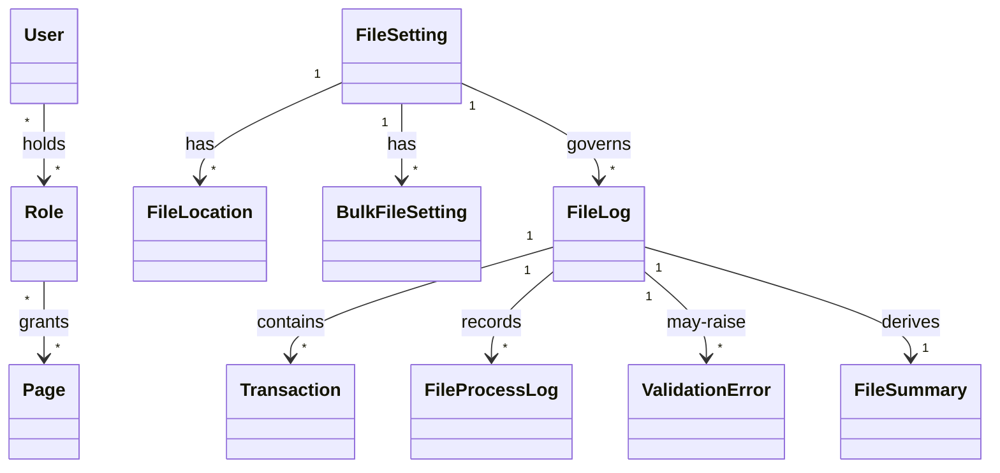

<!-- ROLE: requirements draft. Audience is LLM-only. -->

# Requirements: Transaction Import & Approval System [SRC: C-001]

**Domain:** Financial services — South African retail-banking transaction ingestion and approval [SRC: C-002] **Target:** application **Created:** 2026-05-20 **Status:** draft **Last finalised at:** —

> Inferred content is marked inline per the drafter's decision tree. Input-grounded cells carry a trailing `[SRC: C-NNN]` tag backed by `requirements/draft-claims.ndjson`.

---

## 0.1 Target-mode applicability

| Section | `prototype` | `application` | Mode-conditional? |
| --- | --- | --- | --- |
| §6.10 Consumed backend contracts | fixture references | pointers into the sibling backend requirements document | yes — sub-block content differs |
| §7 Data shapes consumed by FE | shape sourced from fixtures | shape sourced from backend contracts | provenance label only |
| `## Prototype invariants` appendix | appended (prototype-invariants block) | omitted | yes — merger conditional |
| (all other sections) | identical | identical | no |

---

## 1. Application context

**Name:** Transaction Import & Approval System [SRC: C-003]

**Purpose / business value:** A dual-role system that enables Importers to upload and review transaction files and Approvers to review, approve/reject, and export transactions. [SRC: C-004]

**Domain:** Financial services — South African retail-banking ledger transaction ingestion and approval (EFT-style transactions; AccountNumber values follow the SA retail-banking format). [SRC: C-005]

**Business goal:** Operate file-driven ingestion, enforce a transaction lifecycle, and apply role-based interaction constraints across Importer and Approver personas. [SRC: C-006]

---

## 1.5 Scope

| Bucket | Items |
| --- | --- |
| In | File-driven transaction ingestion via browser upload [SRC: C-007]; transaction review surface; approve/reject workflow with mandatory reject-note [SRC: C-008]; role-based access control across Importer and Approver [SRC: C-009]; search and filter across Status, File, Date range, Amount range, Reference, Account [SRC: C-010]; CSV export of filtered transactions [SRC: C-011]; file summary with counts by status [SRC: C-012]; audit-trail of LastChangedUser and LastChangedDate on entity mutations [SRC: C-013]; POPIA-aligned PI inventory and retention surface [SRC: C-014]. |
| Out | SSO, OIDC, external identity providers [SRC: C-015]; card transactions and PCI-DSS scope (no PAN data) [SRC: C-016]; multi-currency (ZAR-only display, no conversion) [SRC: C-017]; multi-source ingestion (SFTP / scheduled / API-pull) [SRC: C-018]; process-automation engine UI [SRC: C-019]; bulk approve, bulk reject, bulk export [SRC: C-020]; mobile and tablet device targets [SRC: C-021]; dual-control, escalation, delegation approval flows [SRC: C-022]. |
| Deferred | Notification delivery (email, in-app, push) for status changes [SRC: C-023]; admin UI for users, roles, and pages CRUD [SRC: C-024]; POPIA data-subject-rights UI ("Download my data", "Delete my account"), consent UX, complaints route to the Information Regulator [SRC: C-025]. |

---

## 1.6 Assumptions & dependencies

| Kind | Statement | Source |
| --- | --- | --- |
| Abstract service dependency | An identity provider with credentials-based authentication only (no SSO / OIDC / external IdP) [SRC: C-026]. | stated |
| Abstract service dependency | A binary blob storage tier for uploaded files and bulk-error files. | inferred |
| Abstract service dependency | A transactional data store retaining FileLog, Transaction, and UserNote rows for 7 years [SRC: C-027]. | stated |
| Persona prerequisite | Users hold pre-provisioned accounts in the identity provider (admin UI for user/role/page CRUD is out of scope) [SRC: C-028]. | stated |
| Environment assumption | Desktop evergreen browser only; mobile / tablet device targets are out of scope [SRC: C-029]. | stated |
| Environment assumption | Frontend SPA and BFF share an eTLD+1 so SameSite=Strict cookies are delivered on cross-origin same-site requests [SRC: C-030]. | stated |
| Environment assumption | Hosting is in South Africa; no cross-border data transfer occurs [SRC: C-031]. | stated |

---

## 1.7 Architectural implications

| Capability category | Driving requirement(s) | Recommendation (optional) |
| --- | --- | --- |
| Client-side state management | → §6.1 F-09, → §6.1 F-12, → §6.1 F-14 | |
| Client-side search / filtering | → §6.1 F-12, → §6.7 RPT-02 | in-memory index acceptable at ≤10⁴ records per file |
| File upload / binary blob handling | → §6.1 F-05, → §6.1 F-16, → §6.1 F-17 | binary blob storage tier required |
| Export rendering capability | → §6.1 F-13, → §6.7 RPT-02 | CSV-only at this stage |
| Role-conditional rendering | → §6.5, → §6.1 F-08, → §6.1 F-10, → §6.1 F-11 | |
| Audit-trail viewer | → §6.9, → §6.1 F-18 | |
| Notification delivery surface | → §6.8 (deferred per §1.5) | category-level only |

---

## 2. Domain model

### 2.1 Concepts

| Concept | Persistence | Definition (ubiquitous language) |
| --- | --- | --- |
| User | persistent | An authenticated principal with one or more roles granting access to pages. [SRC: C-032] |
| Role | persistent | A named collection of page permissions assigned to users. [SRC: C-033] |
| Page | persistent | An application route that role assignments grant or deny access to. [SRC: C-034] |
| File Setting | persistent | Configuration that governs how an uploaded file is processed, validated, and persisted. [SRC: C-035] |
| File Location | persistent | A physical or logical location associated with a file setting. [SRC: C-036] |
| Bulk File Setting | persistent | A bulk-load configuration associated with a file setting and a target database table. [SRC: C-037] |
| File Log | persistent | A record of an uploaded file and its processing state. [SRC: C-038] |
| File Process Log | persistent | A record of one processing-step activity against a File Log. [SRC: C-039] |
| Transaction | persistent | An individual record extracted from a file. [SRC: C-040] |
| File Summary | derived | A per-FileLog aggregate of total records and counts by transaction status. [SRC: C-041] |
| Validation Error | derived | A row-level error captured during file validation. [SRC: C-042] |

### 2.2 Relationships

- File Log **contains** Transactions [1:N] [SRC: C-043]
- File Log **records** File Process Logs [1:N]
- File Setting **governs** File Logs [1:N]
- File Setting **has** File Locations [1:N]
- File Setting **has** Bulk File Settings [1:N]
- User **holds** Roles [N:M]
- Role **grants** Pages [N:M]
- File Log **derives** File Summary [1:1]
- File Log **may-raise** Validation Errors [1:N]

### 2.3 Aggregates & lifecycles

#### File Log

| Field | Value |
| --- | --- |
| Member concepts | File Log, Transaction, File Process Log, Validation Error, File Summary |
| Lifecycle states | Uploaded → Processing → Completed → Failed [SRC: C-044] |
| Key invariants | A FileLog is created on successful file upload [SRC: C-045]; HasBulkErrorFile reflects bulk-validation outcome on a completed file [SRC: C-046]; FileLogs persist for 7 years per the audit retention rule [SRC: C-047]. |

#### Transaction

| Field | Value |
| --- | --- |
| Member concepts | Transaction, UserNote |
| Lifecycle states | Imported → Approved · Imported → Rejected [SRC: C-048] |
| Key invariants | Only transactions in status "Imported" may be approved or rejected [SRC: C-049]; a Reject action requires a UserNote [SRC: C-050]; an Approve action sets Status to "Approved" [SRC: C-051]; a Reject action sets Status to "Rejected" and records the supplied user note [SRC: C-052]. |

#### User (session)

| Field | Value |
| --- | --- |
| Member concepts | User, Roles, Pages |
| Lifecycle states | Active → Closed |
| Key invariants | Session state is conveyed exclusively via an HttpOnly, Secure, SameSite=Strict cookie set by the backend on successful login [SRC: C-053]; protected endpoints require this cookie [SRC: C-054]. |

### 2.4 Diagram

### 2.5 State-transition matrix

#### File Log

| From → To | Trigger | Pre-condition | Visible effect |
| --- | --- | --- | --- |
| Uploaded → Processing | system begins ingestion | FileLog created on upload [SRC: C-055] | status badge advances to "Processing" |
| Processing → Completed | validation completes without bulk errors | HasBulkErrorFile is absent / false [SRC: C-056] | status badge advances to "Completed"; transactions become visible |
| Processing → Failed | validation completes with bulk errors | HasBulkErrorFile is true [SRC: C-057] | status badge advances to "Failed"; error indicator visible [SRC: C-058] |

#### Transaction

| From → To | Trigger | Pre-condition | Visible effect |
| --- | --- | --- | --- |
| Imported → Approved | Approver confirms approve action | Transaction status is "Imported" [SRC: C-059] | status changes to "Approved"; row actions remove Approve/Reject [SRC: C-060] |
| Imported → Rejected | Approver submits reject with UserNote | Transaction status is "Imported"; UserNote is non-empty [SRC: C-061] | status changes to "Rejected"; UserNote is recorded; row actions remove Approve/Reject [SRC: C-062] |

---

## 3. Target users

### Importer

| Field | Value |
| --- | --- |
| Role / job title | Importer [SRC: C-063] |
| Expertise level | Intermediate — familiar with file-ingestion workflows |
| Stakes | Successful ingestion of transaction files for downstream approval [SRC: C-064] |
| Frequency of use | Daily — one or more files per business day |
| Driving forces — wants | Reliable upload feedback; clear file-summary visibility; ability to search and filter [SRC: C-065] |
| Driving forces — fears | Silent ingestion failures; unclear validation errors |

### Approver

| Field | Value |
| --- | --- |
| Role / job title | Approver [SRC: C-066] |
| Expertise level | Senior — empowered to apply approve/reject decisions |
| Stakes | Correct, auditable approve/reject decisions on transactions [SRC: C-067] |
| Frequency of use | Daily — reviewing the day's ingested transactions |
| Driving forces — wants | Search, filter, approve, reject, export, and view file summaries [SRC: C-068] |
| Driving forces — fears | Approving a wrong row; losing the rejection rationale |

---

## 4. User goals & stories

### 4.1 Goals catalogue

| ID | Goal statement | Quality signals | Goal kind | Layout pref (optional) | UX-pattern pref (optional) |
| --- | --- | --- | --- | --- | --- |
| G-01 | Ingest transaction files into the system reliably. | Upload completes with explicit success/failure feedback; FileLog visible after upload. | top-level | — | — |
| G-02 | Review uploaded transactions efficiently. | Transactions table loads within performance budget; filters apply quickly. | top-level | — | — |
| G-03 | Apply auditable approve/reject decisions on transactions. | Approve/Reject confirms an action; UserNote captured on reject. | top-level | — | — |
| G-04 | Export filtered transaction data for downstream reporting. | CSV export contains exactly the filtered set. | top-level | — | — |
| G-05 | Maintain visibility into file-level processing state. | File summary shows totals and counts by status; HasBulkErrorFile surfaces errors. | top-level | — | — |
| G-06 | Authenticate securely and maintain a valid session. | Login establishes session cookie; logout invalidates it. | sub-level | — | — |

### 4.2 Stories by persona

#### Importer

##### Story: As an Importer, I want to upload a transaction file, so that it can be ingested for processing.

| Field | Value |
| --- | --- |
| Goal | → §4.1 G-01 |
| Objective | Upload a single file with the FileSettingId, FileSettingName, and FileName parameters [SRC: C-069]. |
| Context (frequency / expertise / stakes) | Daily; intermediate; successful ingestion is the Importer's primary stake. |
| Linked task flow (optional) | → §5 File Upload |
| Acceptance criteria | Given a valid file, when the Importer submits, then a FileLog record is created and a success status is shown in the UI [SRC: C-070]. |

##### Story: As an Importer, I want to view the file log overview, so that I can confirm my upload was accepted.

| Field | Value |
| --- | --- |
| Goal | → §4.1 G-05 |
| Objective | View a table of uploaded files with File Name, Process Date, Record Count, and Status columns [SRC: C-071]. |
| Context (frequency / expertise / stakes) | Daily; intermediate; visibility into ingestion outcome. |
| Linked task flow (optional) | → §5 File Log Overview |
| Acceptance criteria | Given an ingested file, when the Importer opens the file log overview, then a row appears for that file with its current Status. |

##### Story: As an Importer, I want to drill from a file row into its transactions, so that I can verify what was ingested.

| Field | Value |
| --- | --- |
| Goal | → §4.1 G-02 |
| Objective | Open the transactions list scoped to a specific FileLog [SRC: C-072]. |
| Context (frequency / expertise / stakes) | As-needed; intermediate; ingestion-integrity check. |
| Linked task flow (optional) | → §5 File Log Overview |
| Acceptance criteria | Given a FileLog row, when the Importer clicks it, then the transactions list opens scoped to that FileLog. |

##### Story: As an Importer, I want to search and filter transactions and file logs, so that I can locate specific records.

| Field | Value |
| --- | --- |
| Goal | → §4.1 G-02 |
| Objective | Apply filters on Status, File (FileLogId), Date range, Amount range, and a text search on Reference and Account [SRC: C-073]. |
| Context (frequency / expertise / stakes) | Daily; intermediate; record-location productivity. |
| Linked task flow (optional) | → §5 Transaction Table |
| Acceptance criteria | When filters are applied, the visible set reflects the filter combination; the no-results state distinguishes "empty data" from "filtered-out". |

#### Approver

##### Story: As an Approver, I want to authenticate, so that I can access the approval surface.

| Field | Value |
| --- | --- |
| Goal | → §4.1 G-06 |
| Objective | Submit username and password to establish an authenticated session [SRC: C-074]. |
| Context (frequency / expertise / stakes) | Daily; senior; session integrity. |
| Linked task flow (optional) | → §5 Authentication |
| Acceptance criteria | On successful credentials, an HttpOnly, Secure, SameSite=Strict session cookie is set [SRC: C-075]; on failure, a deliberately generic error is shown [SRC: C-076]. |

##### Story: As an Approver, I want to view all transactions for a file, so that I can decide approval.

| Field | Value |
| --- | --- |
| Goal | → §4.1 G-02 |
| Objective | Review the transactions list with Reference, Date, Account, Amount, Currency, and Status columns [SRC: C-077]. |
| Context (frequency / expertise / stakes) | Daily; senior; decision quality. |
| Linked task flow (optional) | → §5 Transaction Table |
| Acceptance criteria | Each row shows the columns named above; Approver sees Approve/Reject row actions [SRC: C-078]. |

##### Story: As an Approver, I want to approve a transaction, so that its status moves to Approved.

| Field | Value |
| --- | --- |
| Goal | → §4.1 G-03 |
| Objective | Confirm an approve action on an Imported transaction. |
| Context (frequency / expertise / stakes) | Daily; senior; financial accuracy. |
| Linked task flow (optional) | → §5 Approve Transaction |
| Acceptance criteria | Given an Imported transaction, when the Approver clicks Approve and confirms, then Status updates to Approved [SRC: C-079]. |

##### Story: As an Approver, I want to reject a transaction with a mandatory note, so that the reason is recorded.

| Field | Value |
| --- | --- |
| Goal | → §4.1 G-03 |
| Objective | Capture a UserNote during reject submission. |
| Context (frequency / expertise / stakes) | Daily; senior; auditable rationale. |
| Linked task flow (optional) | → §5 Reject Transaction |
| Acceptance criteria | Given an Imported transaction, when the Approver clicks Reject, enters a mandatory note, and submits, then Status updates to Rejected and the UserNote is recorded [SRC: C-080]. |

##### Story: As an Approver, I want to export the filtered transaction dataset, so that it can be reused downstream.

| Field | Value |
| --- | --- |
| Goal | → §4.1 G-04 |
| Objective | Generate a CSV of the currently-filtered transactions [SRC: C-081]. |
| Context (frequency / expertise / stakes) | Frequent; senior; downstream reuse. |
| Linked task flow (optional) | → §5 Export Transactions |
| Acceptance criteria | When Export is clicked, a CSV containing exactly the filtered set is produced. |

##### Story: As an Approver, I want to view a file summary, so that I can confirm processing outcomes.

| Field | Value |
| --- | --- |
| Goal | → §4.1 G-05 |
| Objective | View total records and counts by status (Imported / Approved / Rejected), plus an error indicator [SRC: C-082]. |
| Context (frequency / expertise / stakes) | Frequent; senior; processing confidence. |
| Linked task flow (optional) | → §5 File Summary |
| Acceptance criteria | The summary reflects current counts and shows an error indicator when HasBulkErrorFile is true [SRC: C-083]. |

---

## 5. Task flows

### Flow: Authentication

| Field | Value |
| --- | --- |
| Actor | → §3 Importer / → §3 Approver |
| Trigger | User opens the login screen [SRC: C-084]. |
| Steps | (User enters email + password; the system validates credentials and either sets a session cookie or returns a generic 401) [SRC: C-085]; (on success, route to role-specific landing; visible result: role-specific dashboard) [SRC: C-086]; (on failure, error state shown; visible result: deliberately generic error message) [SRC: C-087]. |
| Decision points | Authentication outcome (200 vs 401) [SRC: C-088]. |
| Exception paths | { invalid credentials → deliberately generic 401 message → user retries with corrected credentials } [SRC: C-089]. |
| Role-conditional behaviour | Landing differs by role assignment. |

### Flow: File Upload

| Field | Value |
| --- | --- |
| Actor | → §3 Importer |
| Trigger | Importer initiates a file upload [SRC: C-090]. |
| Steps | (Select file; visible result: filename and size are shown); (Provide FileSettingId, FileSettingName, FileName; visible result: parameters captured) [SRC: C-091]; (Upload; visible result: upload-progress indicator) [SRC: C-092]; (System creates FileLog; visible result: a new FileLog row is visible) [SRC: C-093]; (Status shown in UI; visible result: current FileLog status badge) [SRC: C-094]. |
| Decision points | Validation outcome — Completed or Failed [SRC: C-095]. |
| Exception paths | { validation produces bulk errors → file status moves to Failed and HasBulkErrorFile is set → user can download the bulk-error report } [SRC: C-096]. |
| Role-conditional behaviour | Approver cannot upload [SRC: C-097]. |

### Flow: File Log Overview

| Field | Value |
| --- | --- |
| Actor | → §3 Importer / → §3 Approver |
| Trigger | User opens the file log overview [SRC: C-098]. |
| Steps | (User views the table of uploaded files; visible result: rows with File Name, Process Date, Record Count, and Status) [SRC: C-099]; (User clicks a row to drill into transactions; visible result: transactions list scoped to the FileLog) [SRC: C-100]. |
| Decision points | Row selection (which FileLog to inspect). |
| Exception paths | { empty dataset → "No files uploaded yet" empty state with the upload CTA for Importers }. |
| Role-conditional behaviour | Both Importer and Approver may view file logs [SRC: C-101]. |

### Flow: Transaction Table

| Field | Value |
| --- | --- |
| Actor | → §3 Importer / → §3 Approver |
| Trigger | User opens the transactions table [SRC: C-102]. |
| Steps | (Data table renders with Reference, Date, Account, Amount, Currency, Status columns; visible result: paginated rows) [SRC: C-103]; (Apply filters on Status / File / Date range / Amount range / Text search; visible result: filtered row set) [SRC: C-104]; (Approver sees row-level Approve / Reject actions; visible result: per-row action buttons for Approvers only) [SRC: C-105]. |
| Decision points | Whether the active user holds the Approver role. |
| Exception paths | { error loading transactions → inline error region with retry → user retries }. |
| Role-conditional behaviour | Row-level Approve/Reject actions are visible to Approver only [SRC: C-106]. |

### Flow: Approve Transaction

| Field | Value |
| --- | --- |
| Actor | → §3 Approver |
| Trigger | Approver selects an Imported transaction [SRC: C-107]. |
| Steps | (Select transaction; visible result: selected row is highlighted); (Click approve; visible result: confirmation prompt) [SRC: C-108]; (Confirm action; visible result: action is committed) [SRC: C-109]; (Status updates to Approved; visible result: row status badge changes to "Approved") [SRC: C-110]. |
| Decision points | Confirmation gate (Cancel vs Confirm) [SRC: C-111]. |
| Exception paths | { server returns 401 → session-expired banner → user re-authenticates }; { server returns 500 → toast "Approve failed, please try again" → user retries }. |
| Role-conditional behaviour | Available to Approver only [SRC: C-112]. |

### Flow: Reject Transaction

| Field | Value |
| --- | --- |
| Actor | → §3 Approver |
| Trigger | Approver selects an Imported transaction to reject [SRC: C-113]. |
| Steps | (Select transaction; visible result: selected row is highlighted); (Click reject; visible result: reject form appears); (Enter mandatory note; visible result: note field is populated and submit becomes enabled) [SRC: C-114]; (Submit; visible result: action is committed) [SRC: C-115]; (Status updates to Rejected; visible result: row status badge changes to "Rejected") [SRC: C-116]. |
| Decision points | Non-empty UserNote — submission is blocked if note is empty. |
| Exception paths | { empty note submitted → "A reject reason is required" inline error → user enters note and retries }; { server returns 401 → session-expired banner → user re-authenticates }. |
| Role-conditional behaviour | Available to Approver only [SRC: C-117]. |

### Flow: Export Transactions

| Field | Value |
| --- | --- |
| Actor | → §3 Approver |
| Trigger | Approver requests an export of the filtered dataset [SRC: C-118]. |
| Steps | (Apply filters; visible result: filtered row set); (Click Export; visible result: CSV generation indicator); (Receive CSV download; visible result: file saved to the user's device) [SRC: C-119]. |
| Decision points | None — uses the filtered dataset as currently shown. |
| Exception paths | { zero filtered rows → "No rows to export" toast → user adjusts filters }. |
| Role-conditional behaviour | Available to Approver only [SRC: C-120]. |

### Flow: File Summary

| Field | Value |
| --- | --- |
| Actor | → §3 Importer / → §3 Approver |
| Trigger | User opens the file summary for a specific FileLog [SRC: C-121]. |
| Steps | (Open summary; visible result: total records and counts per status (Imported, Approved, Rejected) are shown) [SRC: C-122]; (View error indicator; visible result: an error icon is shown when HasBulkErrorFile is true) [SRC: C-123]. |
| Decision points | None. |
| Exception paths | { underlying FileLog deleted → "Summary not available" state → user returns to file log overview }. |
| Role-conditional behaviour | Both roles may view file summary. |

---

## 6. Requirements

### 6.1 Functional

| ID | Statement | Acceptance criteria | Source |
| --- | --- | --- | --- |
| F-01 | The system authenticates a user via username and password against `POST /v1/auth/login` [SRC: C-124]. | Given valid credentials, when the user submits, then 200 with a session cookie is returned [SRC: C-125]. | stated |
| F-02 | The system conveys session state exclusively via an HttpOnly, Secure, SameSite=Strict cookie [SRC: C-126]. | Cookie attributes match `HttpOnly; Secure; SameSite=Strict; Path=/` [SRC: C-127]. | stated |
| F-03 | The user can log out via `POST /v1/auth/logout`, invalidating the session cookie [SRC: C-128]. | A Set-Cookie response clears the cookie via Max-Age=0 [SRC: C-129]. | stated |
| F-04 | The system returns the authenticated user's profile via `GET /v1/auth/userinfo` [SRC: C-130]. | A 200 response returns the user's profile fields (e.g. Username, Email, RolesString). | stated |
| F-05 | The Importer can upload a transaction file via `POST /v1/files/upload` with FileSettingId, FileSettingName, and FileName query parameters [SRC: C-131]. | A successful upload produces a 200 response and a FileLog record exists [SRC: C-132]. | stated |
| F-06 | The system creates a FileLog row for each uploaded file [SRC: C-133]. | A new FileLog row is visible in the file log overview after upload. | stated |
| F-07 | The user can view a list of file log entries via `GET /v1/file-logs` [SRC: C-134]. | The response includes File Name, Process Date, Record Count, and Status [SRC: C-135]. | stated |
| F-08 | The user can drill from a file log row into its transactions [SRC: C-136]. | Clicking the row opens the transactions list scoped to the FileLog. | stated |
| F-09 | The user can view a list of all transactions via `GET /v1/transactions` [SRC: C-137]. | The list includes Reference, Date, Account, Amount, Currency, and Status [SRC: C-138]. | stated |
| F-10 | The Approver can approve a transaction by Id via `POST /v1/transactions/approve` [SRC: C-139]. | Status changes to "Approved" [SRC: C-140]. | stated |
| F-11 | The Approver can reject a transaction by Id with a UserNote via `POST /v1/transactions/reject` [SRC: C-141]. | Status changes to "Rejected" and the supplied UserNote is recorded [SRC: C-142]. | stated |
| F-12 | The user can search/filter transactions and file logs by Status, File, Date range, Amount range, and a text search across Reference and Account [SRC: C-143]. | The visible set reflects the active filter combination. | stated |
| F-13 | The Approver can export the filtered transaction dataset as CSV [SRC: C-144]. | The exported file is a CSV containing the filtered set. | stated |
| F-14 | The system surfaces a file summary with total records and counts by status, including an error indicator from HasBulkErrorFile [SRC: C-145]. | Counts equal the underlying transaction status counts; the error indicator is visible when HasBulkErrorFile is true. | stated |
| F-15 | The system records LastChangedUser and LastChangedDate on every entity mutation [SRC: C-146]. | Each write endpoint receives a `LastChangedUser` header and the entity's audit fields are updated [SRC: C-147]. | stated |
| F-16 | The user can download an uploaded file via `GET /v1/files/download` by FileLogId [SRC: C-148]. | A 200 binary stream is returned for an authorised user. | stated |
| F-17 | The user can download a bulk-error report via `GET /v1/files/bulk-errors/download` by FileLogId [SRC: C-149]. | A 200 binary stream is returned when HasBulkErrorFile is true. | stated |
| F-18 | The user can retrieve per-file validation errors via `GET /v1/files/validation-errors` [SRC: C-150]. | A `ValidationErrors` object containing a JSON array of per-row error objects is returned [SRC: C-151]. | stated |
| F-19 | The user can retry validation for a file via `POST /v1/files/retry-validation` [SRC: C-152]. | The file's processing is re-attempted. | stated |
| F-20 | The user can cancel/delete a file by LogId via `DELETE /v1/files` [SRC: C-153]. | The file is deactivated and removed from the staging table [SRC: C-154]. | stated |
| F-21 | Protected endpoints (`POST /v1/auth/logout`, `GET /v1/auth/userinfo`, transactions and files endpoints) require the SessionCookie [SRC: C-155]. | Requests without the cookie return 401. | stated |
| F-22 | The system applies idle and absolute session timeouts of 15 minutes and 8 hours respectively [SRC: C-156]. | A session idle past 15 minutes triggers logout; an absolute session past 8 hours triggers logout. | stated |
| F-23 | The system retains FileLog, Transaction, and UserNote rows for 7 years from creation [SRC: C-157]. | Records older than 7 years are not deleted within the prototype window; retention is the authoritative rule. | stated |
| F-24 | The system retains User records while the account is active and deletes them within 30 days of account closure [SRC: C-158]. | Closed accounts are purged within 30 days of closure. | stated |
| F-25 | The system displays a compliance acknowledgement on the login screen [SRC: C-159]. | The login screen renders a one-line acknowledgement before sign-in. | stated |
| F-26 | The system displays the Currency code on each transaction row (ZAR only) [SRC: C-160]. | Each transaction row shows the Currency code; no currency conversion is performed [SRC: C-161]. | stated |

### 6.2 Business rules

| ID | Statement (when / then) | Enforcement point | Acceptance criteria | Source | Severity |
| --- | --- | --- | --- | --- | --- |
| BR-01 | When the Approver submits a reject, then a UserNote is required. | cross-layer | Submitting an empty note produces the inline error "A reject reason is required" and blocks submission. | → §2.3 Transaction invariants, → §6.1 F-11 | blocker |
| BR-02 | When a transaction's Status is not "Imported", then Approve and Reject actions are not available. | UI | Approve/Reject row actions are hidden on rows whose Status is "Approved" or "Rejected" [SRC: C-162]. | → §2.3 Transaction invariants | blocker |
| BR-03 | When a protected endpoint is called without the session cookie, then return 401. | service | `GET /v1/auth/userinfo`, `POST /v1/auth/logout`, and transaction endpoints return 401 when the SessionCookie is missing [SRC: C-163]. | → §6.1 F-21 | blocker |
| BR-04 | When the user logs out, then the session cookie is invalidated via Max-Age=0 and the frontend waits for the response before navigating [SRC: C-164]. | service | Logout 200 response includes the Max-Age=0 Set-Cookie directive. | → §6.1 F-03 | major |
| BR-05 | When credentials are invalid, then return a deliberately generic 401 that does not reveal which field was incorrect [SRC: C-165]. | service | The 401 response carries a generic message. | → §6.1 F-01 | blocker |
| BR-06 | When the file upload completes successfully, then a FileLog record is created. | service | A new FileLog row exists after a successful upload. | → §6.1 F-05, F-06 | blocker |
| BR-07 | When an Approve action is committed, then the transaction Status is set to "Approved" and LastChangedUser is recorded [SRC: C-166]. | service | The transaction row reflects "Approved"; LastChangedUser equals the acting user's identifier. | → §6.1 F-10, F-15 | blocker |
| BR-08 | When a Reject action is committed, then the transaction Status is set to "Rejected" and the supplied UserNote is recorded [SRC: C-167]. | service | The transaction row reflects "Rejected"; UserNote is non-empty. | → §6.1 F-11, F-15 | blocker |
| BR-09 | When the Importer is the active role, then the Upload screen is accessible; Approve, Reject, and Export are not [SRC: C-168]. | UI | Importer navigation hides Approve/Reject/Export affordances. | → §6.5 | blocker |
| BR-10 | When the Approver is the active role, then Approve, Reject, and Export are accessible; Upload is not [SRC: C-169]. | UI | Approver navigation hides the Upload screen. | → §6.5 | blocker |
| BR-11 | When a persistent entity is mutated, then LastChangedUser and LastChangedDate are updated [SRC: C-170]. | service | Each write endpoint accepts a `LastChangedUser` header and updates the entity's audit fields. | → §6.1 F-15 | major |
| BR-12 | When AccountNumber is rendered, then it is treated as a bank account number and not as a payment-card PAN [SRC: C-171]. | UI | No card-data validation, masking, or tokenisation is applied; PCI-DSS is out of scope. | → §1.5 Out | major |
| BR-13 | When personal information is processed, then only the POPIA-listed PI fields may be collected [SRC: C-172]. | data | Only the fields enumerated in the PI inventory are stored. | → §6.6.4 | blocker |
| BR-14 | When a user account is closed, then the User row is deleted within 30 days [SRC: C-173]. | service | Closed accounts are purged within 30 days of closure. | → §6.1 F-24 | major |
| BR-15 | When audit-trail rows are produced, then they are append-only and retained for 7 years [SRC: C-174]. | data | Audit rows accept inserts only; rows persist for 7 years. | → §6.1 F-23 | major |

### 6.3 Validation rules

| Field (→ §7) | Validation type | Rule | Error message |
| --- | --- | --- | --- |
| Transaction.UserNote | required | → §6.2 BR-01 | A reject reason is required. |
| LoginRequest.Username | required | Both Username and Password are required for login [SRC: C-175]. | Username and password are required. [SRC: C-176] |
| LoginRequest.Password | required | Both Username and Password are required for login. | Username and password are required. |
| FilesUpload.FileSettingId | required | FileSettingId is a required query parameter on upload [SRC: C-177]. | A file-setting id is required. |
| FilesUpload.FileSettingName | required | FileSettingName is a required query parameter on upload [SRC: C-178]. | A file-setting name is required. |
| FilesUpload.FileName | required | FileName is a required query parameter on upload [SRC: C-179]. | A file name is required. |

### 6.4 UI feature needs

| ID | Feature need | Linked (G / story / BR) | Acceptance criteria |
| --- | --- | --- | --- |
| UI-01 | User can authenticate via a credentials form. | → §4.1 G-06 | A failed login shows a deliberately generic error. |
| UI-02 | User can log out from the authenticated session. | → §4.1 G-06 | Logout invalidates the session cookie and the user returns to the login screen. |
| UI-03 | User can see the authenticated profile (welcome) on a confirmation page [SRC: C-180]. | → §4.1 G-06 | The page renders the user's name and role context. |
| UI-04 | Importer can upload a file via drag-and-drop [SRC: C-181]. | → §4.1 G-01 | A file can be selected via drag-and-drop or a file picker. |
| UI-05 | User can see upload progress and success / failure feedback [SRC: C-182]. | → §4.1 G-01 | An indeterminate progress indicator shows during upload; an outcome message follows. |
| UI-06 | User can view a paginated list of file logs that exposes File Name, Process Date, Record Count, and Status. | → §4.1 G-05 | Each list item exposes those four fields. |
| UI-07 | User can drill from a file log list item into its transactions. | → §4.1 G-02 | Selecting a file log opens the transactions list scoped to that file. |
| UI-08 | User can view a paginated transactions table that exposes Reference, Date, Account, Amount, Currency, and Status. | → §4.1 G-02 | Each transaction shows those six fields. |
| UI-09 | Approver sees per-transaction Approve and Reject actions on Imported transactions. | → §4.1 G-03 / → §6.2 BR-02 | Per-transaction Approve/Reject affordances are visible on Imported transactions for Approvers only. |
| UI-10 | User can search and filter by Status, File, Date range, Amount range, Reference, and Account. | → §4.1 G-02 | The filter chips reflect the active filter combination. |
| UI-11 | Approver confirms an Approve action via a confirmation prompt. | → §6.2 BR-07 | The confirmation prompt names the affected transaction reference. |
| UI-12 | Approver enters a mandatory UserNote when rejecting a transaction. | → §6.2 BR-01 | Submit is disabled until the note field is non-empty. |
| UI-13 | Approver can export the filtered transactions as CSV. | → §4.1 G-04 | Export uses the current filter context. |
| UI-14 | User can view a file summary with total records and counts by status. | → §4.1 G-05 | The summary lists Imported / Approved / Rejected counts. |
| UI-15 | Error indicator is visible when HasBulkErrorFile is true. | → §4.1 G-05 | An error icon is shown on the file's summary view and on the file's entry in the overview list. |
| UI-16 | User can download the original uploaded file. | → §6.1 F-16 | A download action is available on each FileLog entry. |
| UI-17 | User can download the bulk-error report when HasBulkErrorFile is true. | → §6.1 F-17 | A bulk-error download action is available when the indicator is set. |
| UI-18 | User can retry validation on a failed file. | → §6.1 F-19 | A retry action is available on Failed FileLog entries. |
| UI-19 | User can cancel/delete a file. | → §6.1 F-20 | A cancel action is available on a FileLog entry with confirmation. |
| UI-20 | User sees a session-expired banner when a protected request returns 401. | → §6.2 BR-03 | The banner invites the user to re-authenticate. |
| UI-21 | User sees the compliance acknowledgement on the login screen. | → §6.1 F-25 | The login screen renders the acknowledgement before sign-in. |

#### 6.4.5 Edge, empty & error states

| Surface (→ story / flow / UI-NN) | Condition | Expected UI behaviour | Recovery action |
| --- | --- | --- | --- |
| UI-06 | empty | Show "No files uploaded yet" with an Upload CTA for Importers; for Approvers, show the same empty copy without the CTA. | Importer clicks Upload; Approver waits. |
| UI-08 | empty | Show "No transactions in this file" with no creation CTA (creation is via file upload). | User returns to the file log overview. |
| UI-08, UI-10 | partial | Show the filter chips and a Clear-all action; copy references the active filter. | User clears filters. |
| UI-04, UI-05 | error | Show inline error region naming the upload outcome; offer Retry. | User retries upload. |
| UI-08 | error | Show inline error region with Retry. | User retries the load. |
| UI-01 | error | Show a deliberately generic error on failed login [SRC: C-183]. | User corrects credentials and retries. |
| UI-09 | permission-denied | Hide the action; on direct URL access show an in-page permission-denied banner naming the missing permission. | User contacts an admin. |
| UI-04, UI-08, UI-14 | loading | Show a skeleton matching the target view between 300 ms and 3 s; add "still loading…" beyond 3 s. | User waits. |
| Session | offline | Show a session-expired banner when 401 is observed. | User re-authenticates. |

### 6.5 Access control (RBAC)

**Action vocabulary:** `C` create · `R` read · `U` update · `D` delete · `X` execute / invoke · `A` approve · `—` no access.

| Role (→ §3) | User | Role | Page | FileSetting | FileLocation | BulkFileSetting | FileLog | FileProcessLog | Transaction | ValidationError | Authentication (flow) | File Upload (flow) | File Log Overview (flow) | Transaction Table (flow) | Approve Transaction (flow) | Reject Transaction (flow) | Export Transactions (flow) | File Summary (flow) |
| --- | --- | --- | --- | --- | --- | --- | --- | --- | --- | --- | --- | --- | --- | --- | --- | --- | --- | --- |
| Importer | R | R | R | R | R | R | C R | R | R | R | X | X | X | X | — | — | — | X |
| Approver | R | R | R | R | R | R | R | R | R U†BR-02 A†BR-02 | R | X | — | X | X | X | X | X | X |

### 6.6 Non-functional (FE-only)

#### 6.6.1 Session UX

| Field | Value | Source |
| --- | --- | --- |
| Idle session timeout | 15 minutes [SRC: C-184]. | stated |
| Absolute session timeout | 8 hours [SRC: C-185]. | stated |
| Idle warning lead-time | 60 seconds before idle logout. | inferred |
| Re-auth scope | step-up required for approve-class actions. | inferred |
| Account lockout messaging | Deliberately generic; no field-specific failure information [SRC: C-186]. | stated |
| MFA prompt scope | Not required at this stage. | inferred |

#### 6.6.2 Frontend performance budgets

| Metric | Target | Source |
| --- | --- | --- |
| Time to interactive (p95) | ≤ 2.0 s. | inferred |
| Initial bundle size budget | ≤ 300 KB gzipped. | inferred |
| Render budget for largest list/table | ≤ 1.0 s p95 at 10⁴ rows. | inferred |
| Time to meaningful content | ≤ 1.5 s p95. | inferred |

#### 6.6.4 Compliance UI behaviour

- The login screen renders a one-line acknowledgement "This is a prototype; do not enter real personal or financial information." prior to sign-in [SRC: C-187].
- Personal information rendered in the UI is limited to the inventory listed in the PI scope: Email, FirstName, LastName, AccountNumber, Description, UserNote, LastChangedUser [SRC: C-188].
- Currency is displayed only and is not converted; ZAR-only [SRC: C-189].
- PII screen-redaction is not required because no real client PI is loaded into the system [SRC: C-190].

#### 6.6.5 Accessibility

- Visual accessibility target: WCAG 2.1 AA conformance for production deployment [SRC: C-191].
- Keyboard-only path through Login → File Log Overview → Transaction Table → Approve/Reject/Export must be available.

### 6.7 Reporting feature needs

| ID | Purpose | Audience (→ §3) | Source concept(s) (→ §2.1) | Filter dimensions | Measures / columns | Export formats | Scheduling |
| --- | --- | --- | --- | --- | --- | --- | --- |
| RPT-01 | Review file ingestion outcomes | Importer, Approver | File Log | Status, Process Date | File Name, Process Date, Record Count, Status [SRC: C-192] | none | on-demand |
| RPT-02 | Review and triage transactions | Approver, Importer | Transaction, File Log | Status, File (FileLogId), Date range, Amount range, Reference, Account [SRC: C-193] | Reference, Date, Account, Amount, Currency, Status | csv | on-demand |
| RPT-03 | File summary view | Importer, Approver | File Log, Transaction | FileLogId | Total records, Imported count, Approved count, Rejected count, HasBulkErrorFile indicator [SRC: C-194] | none | on-demand |

### 6.8 Notification points

> The Out and Deferred buckets of §1.5 list notification delivery as out of scope for this application phase. No notification rows are emitted here.

### 6.9 Audit-trail UI feature

| Entity (→ §7) | Audited fields | Retention surface | Viewer access (→ §6.5) |
| --- | --- | --- | --- |
| Transaction | Status, LastChangedUser, LastChangedDate, UserNote [SRC: C-195] | 7 years per the financial-records audit-trail rule [SRC: C-196] | Approver (R) |
| FileLog | CurrentStatus, LastChangedUser-equivalent (file process logs) | 7 years per the financial-records audit-trail rule | Approver, Importer (R) |
| User | LastChangedUser, LastChangedDate [SRC: C-197] | While the account is active; 30-day deletion window after closure [SRC: C-198] | Approver (R) |

### 6.10 Consumed backend contracts

#### Under `target = application`

| Operation | Backend contract pointer | Notes |
| --- | --- | --- |
| AuthLogin | → `input/auth-api.yaml#/paths/~1v1~1auth~1login/post` [SRC: C-199] | Establishes session cookie. Maps to F-01. |
| AuthLogout | → `input/auth-api.yaml#/paths/~1v1~1auth~1logout/post` [SRC: C-200] | Invalidates session cookie. Maps to F-03. |
| AuthUserInfoGet | → `input/auth-api.yaml#/paths/~1v1~1auth~1userinfo/get` | Returns the authenticated user's profile [SRC: C-201]. Maps to F-04. |
| HealthGet | → `input/auth-api.yaml#/paths/~1v1~1health/get` | Returns 200 unconditionally if the BFF is reachable [SRC: C-202]. |
| FilesUpload | → `input/transactions-api.yaml#/paths/~1v1~1files~1upload/post` | Maps to F-05, F-06. |
| FileLogGetList | → `input/transactions-api.yaml#/paths/~1v1~1file-logs/get` | Maps to F-07. |
| TransactionGetList | → `input/transactions-api.yaml#/paths/~1v1~1transactions/get` | Maps to F-09, F-12. |
| TransactionApprove | → `input/transactions-api.yaml#/paths/~1v1~1transactions~1approve/post` | Maps to F-10. |
| TransactionReject | → `input/transactions-api.yaml#/paths/~1v1~1transactions~1reject/post` | Maps to F-11. |
| FilesDownload | → `input/transactions-api.yaml#/paths/~1v1~1files~1download/get` | Maps to F-16. |
| FilesBulkErrorsDownload | → `input/transactions-api.yaml#/paths/~1v1~1files~1bulk-errors~1download/get` | Maps to F-17. |
| FileValidationErrorGetList | → `input/transactions-api.yaml#/paths/~1v1~1files~1validation-errors/get` | Maps to F-18. |
| FilesRetryValidation | → `input/transactions-api.yaml#/paths/~1v1~1files~1retry-validation/post` | Maps to F-19. |
| FilesDelete | → `input/transactions-api.yaml#/paths/~1v1~1files/delete` | Maps to F-20. |
| FileProcessLogGetList | → `input/transactions-api.yaml#/paths/~1v1~1file-process-logs~1{LogId}/get` | Provides per-file processing log [SRC: C-203]. |

---

## 7. Data shapes consumed by the FE

### Shape: User

| Field | Type | Required | UI-display | Notes |
| --- | --- | --- | --- | --- |
| Id | integer | yes | hidden | Internal identifier. |
| Email | string | yes | form-input | PI; restricted per §6.6.4 [SRC: C-204]. |
| FirstName | string | yes | form-input | PI [SRC: C-205]. |
| LastName | string | yes | form-input | PI [SRC: C-206]. |
| RolesString | string | yes | chip | Display label for the user's roles. |
| Roles | array | yes | detail | List of RoleRead objects [SRC: C-207]. |
| Pages | array | yes | hidden | List of PageRead objects [SRC: C-208]. |
| LastChangedUser | string | yes | detail | Audit-trail name [SRC: C-209]. |
| LastChangedDate | string | yes | detail | Audit timestamp. |

**Domain concept:** → §2.1 User
**Source:** backend-contract
**Enums:** —

### Shape: Role

| Field | Type | Required | UI-display | Notes |
| --- | --- | --- | --- | --- |
| Id | integer | yes | hidden | Internal identifier. |
| Name | string | yes | chip | Role label (e.g. "Viewer") [SRC: C-210]. |
| Pages | array | yes | detail | List of PageRead objects [SRC: C-211]. |
| LastChangedUser | string | yes | detail | Audit-trail name. |
| LastChangedDate | string | yes | detail | Audit timestamp. |

**Domain concept:** → §2.1 Role
**Source:** backend-contract
**Enums:** —

### Shape: Page

| Field | Type | Required | UI-display | Notes |
| --- | --- | --- | --- | --- |
| Id | integer | yes | hidden | Internal identifier. |
| Name | string | yes | chip | Display name [SRC: C-212]. |
| Route | string | yes | hidden | Route path [SRC: C-213]. |

**Domain concept:** → §2.1 Page
**Source:** backend-contract
**Enums:** —

### Shape: FileSetting

| Field | Type | Required | UI-display | Notes |
| --- | --- | --- | --- | --- |
| Id | integer | yes | hidden | Internal identifier. |
| Name | string | yes | table-col | Display name. |
| SourceName | string | yes | table-col | Origin source label. |
| TypeName | string | yes | table-col | File type label. |
| Direction | string | yes | table-col | Inbound or outbound. |
| IsActive | boolean | yes | chip | Active flag. |
| LastChangedUser | string | yes | detail | Audit-trail name. |
| LastChangedDate | string | yes | detail | Audit timestamp. |

**Domain concept:** → §2.1 File Setting
**Source:** backend-contract
**Enums:** —

### Shape: FileLog

| Field | Type | Required | UI-display | Notes |
| --- | --- | --- | --- | --- |
| Id | integer | yes | hidden | Internal identifier. |
| ProcessDate | string | yes | table-col | Process date timestamp. |
| SettingName | string | yes | table-col | File setting label. |
| CurrentFileName | string | yes | table-col | File name [SRC: C-214]. |
| RecordCount | string | yes | table-col | Number of records in the file. |
| CurrentStatus | string | yes | chip | Current FileLog status. |
| HasBulkErrorFile | string | yes | chip | Bulk-validation error indicator [SRC: C-215]. |
| BulkErrorFile | string | no | hidden | Path to the bulk error file. |
| IsActive | boolean | yes | hidden | Active flag. |

**Domain concept:** → §2.1 File Log
**Source:** backend-contract
**Enums:** —

### Shape: FileProcessLog

| Field | Type | Required | UI-display | Notes |
| --- | --- | --- | --- | --- |
| FileName | string | yes | table-col | File name reference. |
| ActivityName | string | yes | table-col | Processing activity label [SRC: C-216]. |
| DecisionResult | string | yes | table-col | Outcome of the activity. |
| StartDate | string | yes | table-col | Activity start timestamp. |
| EndDate | string | yes | table-col | Activity end timestamp. |

**Domain concept:** → §2.1 File Process Log
**Source:** backend-contract
**Enums:** —

### Shape: Transaction

| Field | Type | Required | UI-display | Notes |
| --- | --- | --- | --- | --- |
| Id | integer | yes | hidden | Internal identifier. |
| FileLogId | integer | yes | hidden | Owning FileLog. |
| FileName | string | yes | detail | File of origin. |
| Reference | string | yes | table-col | Transaction reference [SRC: C-217]. |
| TransactionDate | string | yes | table-col | Transaction timestamp. |
| AccountNumber | string | yes | table-col | Bank account number [SRC: C-218]. |
| Description | string | yes | detail | Transaction narrative; PI surface [SRC: C-219]. |
| Amount | number | yes | table-col | Transaction amount. |
| TransactionType | string | yes | chip | Debit/Credit indicator [SRC: C-220]. |
| Currency | string | yes | chip | ISO currency code (ZAR only) [SRC: C-221]. |
| Status | string | yes | chip | Imported / Approved / Rejected [SRC: C-222]. |
| UserNote | string | no | detail | Reject reason; written by the Approver [SRC: C-223]. |
| LastChangedUser | string | yes | detail | Audit-trail name. |
| LastChangedDate | string | yes | detail | Audit timestamp. |

**Domain concept:** → §2.1 Transaction
**Source:** backend-contract
**Enums:** Status ∈ { Imported, Approved, Rejected }; TransactionType ∈ { Debit, Credit }; Currency ∈ { ZAR }.

### Shape: LoginRequest

| Field | Type | Required | UI-display | Notes |
| --- | --- | --- | --- | --- |
| Username | string | yes | form-input | Account username [SRC: C-224]. |
| Password | string | yes | form-input | Plaintext password sent over HTTPS; compared server-side against a bcrypt hash [SRC: C-225]. |

**Domain concept:** → §2.1 User
**Source:** backend-contract
**Enums:** —

### Shape: TransactionRejectWrite

| Field | Type | Required | UI-display | Notes |
| --- | --- | --- | --- | --- |
| UserNote | string | yes | form-input | Mandatory rejection reason [SRC: C-226]. |

**Domain concept:** → §2.1 Transaction
**Source:** backend-contract
**Enums:** —

### Shape: ValidationErrors

| Field | Type | Required | UI-display | Notes |
| --- | --- | --- | --- | --- |
| JsonArray | string | yes | detail | JSON array string of per-row error objects [SRC: C-227]. |

**Domain concept:** → §2.1 Validation Error
**Source:** backend-contract
**Enums:** —

### 7.X Derivations

| Derived concept (→ §2.1) | Derivation rule (business language) | Inputs | Refresh trigger |
| --- | --- | --- | --- |
| File Summary | Count transactions grouped by Status (Imported / Approved / Rejected) for the FileLog; surface the FileLog's HasBulkErrorFile indicator [SRC: C-228]. | Transaction, File Log | on-load |
| Validation Error | A row-level error captured during file validation; surfaced via the per-file validation-errors endpoint [SRC: C-229]. | File Log, file bytes | on-change |

---

## 8. Source UI references

| Reference | Location | Notes |
| --- | --- | --- |
| PrototypeBrief.md | input/PrototypeBrief.md | Source of IA, role definitions, flows, states, and regulatory scope. No wireframes supplied. |
| auth-api.yaml | input/auth-api.yaml | OpenAPI for credentials-based authentication. |
| transactions-api.yaml | input/transactions-api.yaml | OpenAPI for file, transaction, role, user, and page management endpoints. |
| transactions_2026-04-15.csv | input/transactions_2026-04-15.csv | Sample transaction file used to anchor the CSV column shape (Reference, TransactionDate, AccountNumber, Description, Amount, TransactionType, Currency) [SRC: C-230]. |

---

## 9. Key terminology

| Term | Definition | Inconsistency flag |
| --- | --- | --- |
| File Log | → §2.1 File Log | — |
| Transaction | → §2.1 Transaction | — |
| FileLog | The schema name (transactions-api.yaml) corresponding to the File Log domain concept. | naming variant — used in the API |
| HasBulkErrorFile | Flag on FileLog indicating a bulk-validation error file is available [SRC: C-231]. | — |
| Reference | Transaction-level identifier in business form (e.g. `TXN-20260415-0001`) [SRC: C-232]. | — |
| AccountNumber | Bank account number in SA retail-banking format (e.g. `1001-2034-5567`) [SRC: C-233]; not a payment-card PAN. | — |
| TransactionType | Credit/Debit indicator on a transaction (CSV uses `C` / `D`; API uses `Credit` / `Debit`) [SRC: C-234]. | source-shape variation between CSV abbreviations and API full names |
| LastChangedUser | The user who last mutated the record; supplied as a header on write endpoints [SRC: C-235]. | — |
| Importer | Role authorised to upload and review transaction files [SRC: C-236]. | — |
| Approver | Role authorised to review, approve/reject, and export transactions [SRC: C-237]. | — |

---

## 10. Volumes

| Metric | Value | Source |
| --- | --- | --- |
| Data volume | 10²–10⁴ transactions per file; 10³–10⁵ transactions retained per active FileLog. | inferred |
| Frequency | At least one file per business day; CSV sample shows 20 transactions in a single business day per uploaded file [SRC: C-238]. | stated |
| Concurrency | 10¹–10² concurrent users across Importer and Approver roles. | inferred |

---
