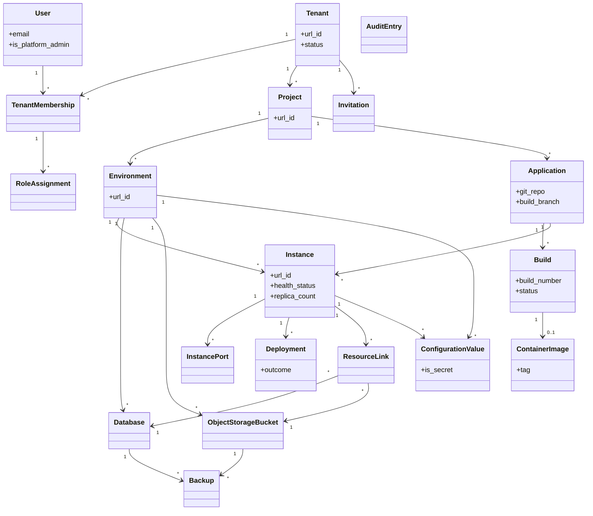

# Requirements: Operations Portal

**Domain:** Cloud application operations / PaaS-style operator portal for custom software **Created:** 2026-05-01 **Status:** final **Last finalised at:** 2026-05-01

> This document is the finalised requirements for the Operations Portal. All fields are populated and all consultant-resolution items have been applied.

---

## 1. Application context

**Name:** Operations Portal

**Purpose / business value:** A web portal that lets technically strong business users build, deploy, run, observe, and lifecycle-manage the custom applications produced by the platform's AI agents, abstracting the underlying container orchestration so users work in business terms (application, instance, environment) rather than infrastructure terms (pod, namespace, replica set).

**Domain:** Cloud application operations / PaaS-style operator portal for custom software

**Business goal:** Deliver an interactive, demo-ready prototype of the Operations Portal to validate the concept with stakeholders and gather feedback before committing to full development. The prototype must convey end-to-end operator workflows (register → build → deploy → observe → manage) with realistic mock data, but does not require backend integration. Mobile responsiveness is out of scope.

<!-- rev: run-1 2026-05-01 -->

---

## 2. Domain model

> The BA's framing of the business domain in **ubiquitous language**, implementation-free.

### 2.1 Concepts

| Concept | Persistence | Definition (ubiquitous language) |
| --- | --- | --- |
| User | persistent | A person who uses the portal, uniquely identified by email, existing at the system level independent of any tenant. |
| Tenant | persistent | A consulting company or organisation. The top-level isolation boundary; all projects and resources are scoped to a tenant. |
| Tenant Membership | persistent | The association of a User to a Tenant, granting access to that tenant context. |
| Role Assignment | persistent | A grant of a named role to a tenant membership, scoped to a tenant, project, or environment. |
| Project | persistent | A client engagement or initiative within a tenant; the access-isolation unit users are explicitly assigned to. |
| Environment | persistent | A logical grouping (e.g. dev, staging, production) within a project that contains its own instances, configuration, databases, and storage. |
| Application | persistent | A deployable unit of software defined at the project level by a Git repository (and optional subdirectory) and a build branch. |
| Instance | persistent | The per-environment running form of an application, with its own health, configuration, replica count, resource profile, and linked resources. |
| Instance Port | persistent | A publicly routable port mapping for an instance, with an internal port and a path prefix. |
| Build | persistent | The process and record of compiling source code into a versioned container image, identified by a per-application sequential build number. |
| Container Image | persistent | A versioned, runnable image produced by a build and stored in the platform's container registry. |
| Deployment | persistent | A record of deploying a specific container image to a specific instance, including outcome. |
| Database | persistent | A provisioned PostgreSQL database scoped to an environment. |
| Object Storage Bucket | persistent | A provisioned S3-compatible bucket scoped to an environment. |
| Resource Link | persistent | An association linking a Database or Object Storage Bucket to an Instance within the same environment, causing connection details to be injected into the instance. |
| Configuration Value | persistent | A key-value pair scoped to an environment (default) or instance (override), optionally marked as a secret and stored in the secrets backend. |
| Audit Entry | persistent | An immutable record of a significant action (who, what, where, when, outcome), retained for at least one year. |
| Backup | persistent | A record of an automatic or manual backup of a database or bucket, including status and retention expiry. |
| Invitation | persistent | A pending invitation for a user to join a tenant by email; deleted on acceptance or expiry, with history captured via audit entries. |
| Notification | persistent | A user-scoped completion notice for an asynchronous operation (build, deployment, resource provisioning), retained per NOT-03. |
| Instance Health | derived | The aggregate health of an instance (`running`, `degraded`, `stopped`, `failed`) computed from replica health-check outcomes and desired replica count. |
| Public Routing | policy | The mapping that exposes an instance via the API gateway at `<app>.<env>.<project>.<tenant>.<portal-domain>` when at least one InstancePort exists. |
| Image Retention Policy | policy | The rule that retains the latest build image, currently deployed images, and the two most recent previously-deployed images per instance, deleting all others. |

<!-- include non-persistent concepts (e.g. Eligibility, Risk Tier, Underwriting Decision) alongside persistent ones; persistent concepts must also appear in §7 -->

### 2.2 Relationships

- User **holds** Tenant Membership in Tenant [1..*]
- Tenant Membership **carries** Role Assignment on Tenant / Project / Environment [0..*]
- Tenant **contains** Project [1..*]
- Project **contains** Environment [1..*]
- Project **contains** Application [0..*]
- Application **builds into** Build [0..*]
- Build **produces** Container Image [0..1]
- Application **runs as** Instance in Environment [0..*]
- Instance **records** Deployment [0..*]
- Instance **exposes** Instance Port [0..*]
- Environment **provisions** Database [0..*]
- Environment **provisions** Object Storage Bucket [0..*]
- Instance **links to** Database via Resource Link [0..*]
- Instance **links to** Object Storage Bucket via Resource Link [0..*]
- Environment **defines** Configuration Value [0..*]
- Instance **overrides** Configuration Value [0..*]
- Database **is backed up by** Backup [0..*]
- Object Storage Bucket **is backed up by** Backup [0..*]
- User **performs** Audit Entry [0..*]
- Tenant **issues** Invitation [0..*]
- User **receives** Notification [0..*]

<!-- verbs come from the business ("Borrower **submits** Application"), not from data ("Borrower hasMany Application"); cardinality optional but recommended -->

### 2.3 Aggregates & lifecycles

#### Tenant

| Field | Value |
| --- | --- |
| Member concepts | Tenant, Tenant Membership, Role Assignment (tenant-scoped), Project, Invitation |
| Lifecycle states | Active → Suspended → Deleted (suspended is reversible; deletion requires url_id confirmation and zero running instances/databases/buckets) |
| Key invariants | At least one active Tenant Admin must always exist (RBAC-07); compute, database, storage and networking are isolated from other tenants (TEN-01..TEN-04); a suspended tenant has zero running instances. |

#### Project

| Field | Value |
| --- | --- |
| Member concepts | Project, Environment, Application, Role Assignment (project-scoped) |
| Lifecycle states | Created → Active → (Empty) → Deleted (deletion blocked unless no environments, applications, databases, buckets, or secrets remain) |
| Key invariants | Resources cannot be shared across projects (PRJ-03); users see only projects they hold a Role Assignment on (PRJ-02). |

#### Application

| Field | Value |
| --- | --- |
| Member concepts | Application, Build, Container Image, Instance |
| Lifecycle states | Registered → Building → (Built) → (Deployed across environments) → Deletable (deletion blocked while any instance is running) |
| Key invariants | Application has zero, one, or many instances per environment (typically one per environment); a build is bound to its application's build branch and (for monorepos) subdirectory. |

#### Instance

| Field | Value |
| --- | --- |
| Member concepts | Instance, Instance Port, Deployment, Resource Link, Configuration Value (instance-scoped) |
| Lifecycle states | Created → Running ↔ Degraded ↔ Stopped ↔ Failed; rolling updates transition through a transient updating state with automatic rollback on health-check failure (INS-04). |
| Key invariants | Replica count 1–10 (INS-07); linked resources must share the instance's environment (LNK-01); private by default — public access only when an Instance Port exists (NET-02). |

#### Build

| Field | Value |
| --- | --- |
| Member concepts | Build, Container Image |
| Lifecycle states | Queued → In Progress → Succeeded / Failed / Cancelled |
| Key invariants | Build numbers are sequential per application; succeeded builds always produce exactly one container image pushed to the registry (REG-02); builds exceeding the system-wide timeout are auto-cancelled (BLD-12). |

#### Database / Object Storage Bucket

| Field | Value |
| --- | --- |
| Member concepts | Database (or Bucket), Resource Link, Backup |
| Lifecycle states | Provisioning → Available → Deleting / Error; deletion blocked while any Resource Link exists. |
| Key invariants | Scoped to a single environment; deletion requires typing the resource name to confirm (DB-06, OBJ-02); deletion cascades unlink and restart of affected instances (LNK-07). |

### 2.4 Diagram

<!-- rev: run-1 2026-05-01 -->

---

## 3. Target users

> Target-user personas — the end users of the application being designed. Not to be confused with the Unicorn (LLM) or the Consultant (audience).

### Platform Administrator

| Field | Value |
| --- | --- |
| Role / job title | Platform Administrator (system-level operator running the portal itself) |
| Expertise level | High — comfortable with multi-tenant SaaS administration; not necessarily a Kubernetes specialist |
| Stakes | Very high — actions span all tenants; tenant suspension/deletion are destructive and recorded in audit. |
| Frequency of use | Very low — initial setup and infrequent tenant lifecycle events (per task frequencies T-PADM-*). |
| Driving forces — wants | Clear visibility of all tenants, fast and explicit tenant lifecycle controls, a strong audit trail of every platform-level action. |
| Driving forces — fears | Accidentally suspending or deleting a live tenant; leaking tenant-internal data through the platform view. |

### Tenant Administrator

| Field | Value |
| --- | --- |
| Role / job title | Tenant Administrator (consulting company or business-unit lead managing the tenant) |
| Expertise level | Technically strong business user; understands users/projects/SSO concepts but not container orchestration. |
| Stakes | High — controls memberships, roles, projects, and identity-provider configuration for the entire tenant. |
| Frequency of use | Low to medium — directory and audit reviews are medium; invitations, role changes and project creation are infrequent (per T-TEN-*). |
| Driving forces — wants | A clean directory view, frictionless invite/assign flows, easy tenant settings (display name, identity providers). |
| Driving forces — fears | Locking out the tenant by removing the last admin; accidentally enabling/disabling SSO incorrectly; granting the wrong role. |

### Project Administrator

| Field | Value |
| --- | --- |
| Role / job title | Project Administrator (project lead within a tenant) |
| Expertise level | Technically strong business user; familiar with the application portfolio they own; not a DevOps specialist. |
| Stakes | High for that project — controls environments, project members, and Git provider credentials. |
| Frequency of use | Very high for the project dashboard (T-PRJ-01); low for membership and environment lifecycle changes. |
| Driving forces — wants | A single overview screen showing the project's environments, applications, statuses; quick environment creation; clear control of project-level Git credentials. |
| Driving forces — fears | Misconfiguring environments or Git credentials; missing failed builds or deployments because of a noisy UI. |

### Operator

| Field | Value |
| --- | --- |
| Role / job title | Operator (the day-to-day operator of applications and environments) |
| Expertise level | Technical business user; comfortable with application/instance/build concepts; expects abstraction over Kubernetes (NFR-02). |
| Stakes | High — drives almost all production-affecting actions: builds, deploys, scaling, configuration, secrets, resource provisioning and linking. |
| Frequency of use | Very high — primary daily user; the bulk of portal traffic. |
| Driving forces — wants | Fastest path to instance health and logs (priorities 1–5 in the frequency summary); confident, low-friction deploy with rollback; visible build progress and clear failure output; minimal click count for routine work (NFR-03). |
| Driving forces — fears | Deploying a broken build to production; losing logs or context during an incident; accidentally deleting a database or bucket; a surprise restart caused by a config change without warning. |

### Viewer

| Field | Value |
| --- | --- |
| Role / job title | Viewer (read-only stakeholder — e.g. business analyst, support lead) |
| Expertise level | Mixed — may be less technical than operators; should be guided by clear visualisations rather than infrastructure jargon. |
| Stakes | Low — cannot mutate state but relies on accurate read-only views. |
| Frequency of use | Very high for dashboards and logs (T-VIEW-01..VIEW-06); medium for configuration, resources and backup status. |
| Driving forces — wants | A clear at-a-glance picture of project and environment health; logs and metrics they can read without help. |
| Driving forces — fears | Silent failures hidden from view; secrets accidentally exposed in their read-only views (mitigated by SEC-04). |

<!-- repeat per persona; every persona MUST have ≥1 user story in §4 and may be referenced as actor in §5 Task flows -->

<!-- rev: run-1 2026-05-01 -->

---

## 4. User goals & stories

> Quality signals live on the goal (outcome-level), not the story (behaviour-level).

### 4.1 Goals catalogue

| ID | Goal statement | Quality signals | Goal kind | Layout pref (optional) | UX-pattern pref (optional) |
| --- | --- | --- | --- | --- | --- |
| G-01 | Sign in to the portal and operate within the correct tenant context. | Low-friction, fast, secure, auditable | top-level | Login + tenant switcher in top bar | SSO buttons + email/password fallback; tenant picker dropdown |
| G-02 | Manage the platform's tenants and platform-administrator roster. | Auditable, explicit, hard-to-misuse | top-level | Dedicated platform-admin area, separate from tenant scope | List + detail with destructive-action confirmation typeahead |
| G-03 | Manage tenant users, projects, and identity-provider settings. | Auditable, role-aware, low-friction | top-level | Tenant-scoped settings area in sidebar | User directory + invite modal; project list |
| G-04 | Manage a project — its environments, members, and Git provider credentials. | Discoverable, role-aware, audit-clear | top-level | Project dashboard as landing surface (T-PRJ-01) | Summary cards for environments/applications + quick actions |
| G-05 | Register and maintain applications within a project. | Low-friction, validated, visible Git status | top-level | Application list + detail in project scope | Wizard for registration; metadata form for edits |
| G-06 | Build applications and watch builds in progress. | Real-time, transparent, troubleshootable | top-level | Build history list with detail/log drawer | Streaming log viewer + status badges |
| G-07 | Deploy and operate instances across environments. | Confidence-building, reversible, fastest-to-reach | top-level | Environment overview with instance cards (T-INS-01) | Deploy/rollback dialogs; lifecycle action menus |
| G-08 | Observe an instance — logs, metrics, and request/latency dashboards. | Real-time, filterable, comparable | top-level | Tab inside instance detail | Filterable log viewer; chart grid for metrics |
| G-09 | Manage configuration values and secrets at environment and instance scope. | Predictable precedence, auditable, write-only secrets | top-level | Configuration tab with environment/instance toggles | Key-value editor; rotation flow |
| G-10 | Provision and manage databases and object storage buckets. | Self-serve, isolation-aware, deletion-safe | top-level | Environment-scoped resource lists | Provision wizard; type-name-to-confirm delete |
| G-11 | Link and unlink data resources to instances. | Predictable, visible-side-effects (restart), auditable | sub-level | Linked-resources panel on instance + drawer on resource | Picker scoped to same environment |
| G-12 | Expose instances publicly via the API gateway and view their addresses. | Explicit, reversible, URL-clear | sub-level | Networking tab on instance | Toggle + URL display + port mapping editor |
| G-13 | Back up data resources and restore from a backup point. | Predictable, recoverable, confirmation-gated | sub-level | Backups tab on each resource | Backup list; restore wizard with target selector |
| G-14 | Audit operational activity across the system. | Immutable, searchable, scoped-by-permission | top-level | Audit page available at platform/tenant/project scopes | Faceted search + entry detail |
| G-15 | Be notified of completion of asynchronous operations the user invoked. | Timely, low-noise, retained per NOT-03 | interaction-level | Notification tray in top bar | Toast + tray history list |
| G-16 | View read-only project, environment, and observability state (Viewer). | Clear, comprehensive, no-mutation paths | top-level | Same surfaces as Operator with action affordances disabled | Same dashboards/lists with read-only badges |

<!-- repeat per goal; IDs are stable and referenced from §4.2 stories and §5 task flows -->

### 4.2 Stories by persona

#### Platform Administrator

##### Story: As a Platform Administrator, I want to create, suspend, reactivate, and delete tenants, so that I can shape the platform's tenant roster without exposing tenant-internal data.

| Field | Value |
| --- | --- |
| Goal | → §4.1 G-02 |
| Objective | Maintain the platform's tenant roster and admin set with clear, audited actions. |
| Context (frequency / expertise / stakes) | Very low frequency, high expertise, very high stakes. |
| Linked task flow (optional) | → §5 Tenant lifecycle (create / suspend / reactivate / delete) |

##### Story: As a Platform Administrator, I want to grant and revoke the platform administrator role, so that the platform always has at least one active admin without permitting accidental lockout.

| Field | Value |
| --- | --- |
| Goal | → §4.1 G-02 |
| Objective | Manage the platform-admin roster while honouring the "last admin" invariant (PADM-08). |
| Context (frequency / expertise / stakes) | Very low frequency, high expertise, very high stakes. |
| Linked task flow (optional) | → §5 Platform-admin role management |

##### Story: As a Platform Administrator, I want to review the platform audit trail, so that I can verify and trace platform-level activity.

| Field | Value |
| --- | --- |
| Goal | → §4.1 G-14 |
| Objective | Search and inspect platform-scoped audit entries (PADM-09, AUD-04). |
| Context (frequency / expertise / stakes) | Medium frequency, high expertise, very high stakes. |
| Linked task flow (optional) | → §5 Audit search |

#### Tenant Administrator

##### Story: As a Tenant Administrator, I want to invite users, manage their tenant memberships and roles, and assign them to projects, so that the right people have the right access in my tenant.

| Field | Value |
| --- | --- |
| Goal | → §4.1 G-03 |
| Objective | Drive the user-directory lifecycle: invite, deactivate, reactivate, role/project changes (USR-01..USR-09). |
| Context (frequency / expertise / stakes) | Low frequency, high expertise, high stakes. |
| Linked task flow (optional) | → §5 Invite & assign user |

##### Story: As a Tenant Administrator, I want to create projects and configure tenant identity providers, so that I can structure my tenant for client engagements and enforce SSO.

| Field | Value |
| --- | --- |
| Goal | → §4.1 G-03 |
| Objective | Create projects and toggle tenant-allowed identity providers (TEN-07, AUTH-04). |
| Context (frequency / expertise / stakes) | Low frequency (project creation) / very low (settings); high expertise; high stakes. |
| Linked task flow (optional) | → §5 Configure tenant identity providers |

#### Project Administrator

##### Story: As a Project Administrator, I want a single project dashboard, so that I can see all environments, applications, and their statuses at a glance.

| Field | Value |
| --- | --- |
| Goal | → §4.1 G-04 |
| Objective | Provide a fast landing view (PRJ-08) optimised for very-high-frequency check-in. |
| Context (frequency / expertise / stakes) | Very high frequency, high expertise, high stakes. |
| Linked task flow (optional) | — |

##### Story: As a Project Administrator, I want to create, edit, and delete environments and manage project membership and Git credentials, so that the project is correctly scoped and accessible to the right team.

| Field | Value |
| --- | --- |
| Goal | → §4.1 G-04 |
| Objective | Drive the project lifecycle: environments (ENV-01, ENV-08, ENV-09), members (USR-08), Git credentials (APP-02). |
| Context (frequency / expertise / stakes) | Low / very low frequency, high expertise, high stakes. |
| Linked task flow (optional) | → §5 Create environment, → §5 Manage Git provider credentials |

#### Operator

##### Story: As an Operator, I want to register a new application by linking a Git repository, so that the platform can build and deploy it on my behalf.

| Field | Value |
| --- | --- |
| Goal | → §4.1 G-05 |
| Objective | Register an application and validate Git access (APP-01, APP-02, APP-03). |
| Context (frequency / expertise / stakes) | Low frequency, high expertise, high stakes. |
| Linked task flow (optional) | → §5 Register application |

##### Story: As an Operator, I want to trigger and watch builds with streaming logs, so that I can react quickly to build failures.

| Field | Value |
| --- | --- |
| Goal | → §4.1 G-06 |
| Objective | Watch build progress in real time (BLD-04, BLD-05, BLD-13, BLD-14). |
| Context (frequency / expertise / stakes) | High frequency, high expertise, high stakes. |
| Linked task flow (optional) | → §5 Build & watch |

##### Story: As an Operator, I want to deploy a specific build to an environment with rolling updates and rollback, so that I can ship safely without downtime.

| Field | Value |
| --- | --- |
| Goal | → §4.1 G-07 |
| Objective | Drive INS-01, INS-04, INS-05 with confirmation and audit. |
| Context (frequency / expertise / stakes) | High frequency (deploy) / low (rollback), high expertise, high stakes. |
| Linked task flow (optional) | → §5 Deploy build to instance |

##### Story: As an Operator, I want to start, stop, restart, and scale instances and change resource profiles, so that I can keep applications running healthily.

| Field | Value |
| --- | --- |
| Goal | → §4.1 G-07 |
| Objective | Lifecycle actions per INS-03, INS-07, INS-10, INS-14. |
| Context (frequency / expertise / stakes) | Medium / low frequency, high expertise, high stakes. |
| Linked task flow (optional) | — |

##### Story: As an Operator, I want to view filterable instance logs and metrics dashboards, so that I can diagnose problems and verify performance.

| Field | Value |
| --- | --- |
| Goal | → §4.1 G-08 |
| Objective | Tail logs and read default metrics dashboards (OBS-01..OBS-12). |
| Context (frequency / expertise / stakes) | Very high frequency, high expertise, high stakes. |
| Linked task flow (optional) | — |

##### Story: As an Operator, I want to manage environment- and instance-level configuration values and secrets, so that applications run with the right settings.

| Field | Value |
| --- | --- |
| Goal | → §4.1 G-09 |
| Objective | Add/edit/delete config and secrets per CFG-01, CFG-02, CFG-05, SEC-01..SEC-08, with restart on change (CFG-03). |
| Context (frequency / expertise / stakes) | Medium / low frequency, high expertise, high stakes. |
| Linked task flow (optional) | → §5 Rotate secret |

##### Story: As an Operator, I want to provision databases and object storage buckets and link them to instances, so that applications have isolated, environment-scoped data.

| Field | Value |
| --- | --- |
| Goal | → §4.1 G-10, → §4.1 G-11 |
| Objective | Drive DB-01..DB-06, OBJ-01..OBJ-05, LNK-01..LNK-08, with restart-on-link/unlink. |
| Context (frequency / expertise / stakes) | Low frequency, high expertise, high stakes. |
| Linked task flow (optional) | → §5 Link database to instance |

##### Story: As an Operator, I want to expose an instance publicly via the API gateway and view its generated URL, so that external traffic can reach it.

| Field | Value |
| --- | --- |
| Goal | → §4.1 G-12 |
| Objective | Configure InstancePort entries; show NET-04 URL. |
| Context (frequency / expertise / stakes) | Low frequency, high expertise, high stakes. |
| Linked task flow (optional) | → §5 Expose instance publicly |

##### Story: As an Operator, I want to back up and restore databases and buckets, so that I can recover from data loss or risky changes.

| Field | Value |
| --- | --- |
| Goal | → §4.1 G-13 |
| Objective | Manual backup (NFR-62) and restore (NFR-64) flows with audit. |
| Context (frequency / expertise / stakes) | Low / very low frequency, high expertise, high stakes. |
| Linked task flow (optional) | → §5 Restore from backup |

##### Story: As an Operator, I want to receive notifications when my long-running operations finish, so that I know when to act next.

| Field | Value |
| --- | --- |
| Goal | → §4.1 G-15 |
| Objective | Receive completion notices for builds, deployments and resource provisioning (NOT-01..NOT-03). |
| Context (frequency / expertise / stakes) | Very high frequency (passive), high expertise, medium stakes. |
| Linked task flow (optional) | — |

#### Viewer

##### Story: As a Viewer, I want to view dashboards, logs, metrics, deployment history, and resource state, so that I can monitor the system without changing it.

| Field | Value |
| --- | --- |
| Goal | → §4.1 G-16, → §4.1 G-08 |
| Objective | Read-only access to all per-project surfaces (T-VIEW-01..T-VIEW-10) with action affordances disabled. |
| Context (frequency / expertise / stakes) | Very high frequency, mixed expertise, low stakes. |
| Linked task flow (optional) | — |

#### All authenticated users

##### Story: As any authenticated user, I want to log in via SSO or email/password and switch tenant context without re-authenticating, so that I can move between client engagements quickly.

| Field | Value |
| --- | --- |
| Goal | → §4.1 G-01 |
| Objective | Sign-in (AUTH-01..AUTH-04) and tenant switching (AUTH-06, TEN-06). |
| Context (frequency / expertise / stakes) | High frequency, mixed expertise, medium stakes. |
| Linked task flow (optional) | → §5 Sign in & switch tenant |

##### Story: As any authenticated user, I want to view and edit my display name, so that I am represented correctly in the portal.

| Field | Value |
| --- | --- |
| Goal | → §4.1 G-01 |
| Objective | Profile management (USR-10). |
| Context (frequency / expertise / stakes) | Low frequency, mixed expertise, low stakes. |
| Linked task flow (optional) | — |

---

## 5. Task flows

### Flow: Sign in & switch tenant

| Field | Value |
| --- | --- |
| Actor | Any authenticated user (→ §3 all personas) |
| Trigger | User opens the portal URL or selects a different tenant from the tenant switcher. |
| Steps | 1) Land on login screen. 2) Choose SSO provider or email/password. 3) Authenticate. 4) If user has multiple tenant memberships, route to last-used tenant or prompt to pick. 5) Land on the project dashboard for last-used project (or tenant landing page if none). 6) For switching: open tenant switcher in top bar, select tenant, land on its last-used project. |
| Decision points | Multiple memberships → tenant picker; tenant suspended → blocked with "tenant suspended" message (PADM-05). |
| Exception paths | SSO failure → return to login with error; account lockout per security policy (see §6.6.1) → display lockout message; identity provider disabled → only available providers shown (AUTH-04). |
| Role-conditional behaviour | Platform Admin without tenant memberships lands on the platform admin home; users without tenant memberships see an empty-state. |

### Flow: Tenant lifecycle (create / suspend / reactivate / delete)

| Field | Value |
| --- | --- |
| Actor | Platform Administrator |
| Trigger | Platform Admin opens the platform tenant list. |
| Steps | Create: enter display name, url_id, first tenant admin email → confirm. Suspend: select tenant → confirm; system stops all running instances. Reactivate: select suspended tenant → confirm. Delete: tenant must be suspended and have zero running instances/databases/buckets → admin types tenant url_id to confirm → permanent. |
| Decision points | Tenant has running resources → deletion blocked with explanation; suspending an already-suspended tenant is a no-op. |
| Exception paths | Confirmation token mismatch on delete → action blocked; create with duplicate url_id → validation error. |
| Role-conditional behaviour | Only Platform Admins; tenant-internal data never displayed. |

### Flow: Platform-admin role management

| Field | Value |
| --- | --- |
| Actor | Platform Administrator |
| Trigger | Platform Admin opens platform-admin roster. |
| Steps | Grant: enter user email → confirm. Revoke: select admin → confirm. System enforces "last platform admin" invariant (PADM-08). |
| Decision points | Revoke last admin → blocked. |
| Exception paths | Granting to unknown email → user is created at system level on next login; warning shown. |
| Role-conditional behaviour | Only Platform Admins. |

### Flow: Invite & assign user (tenant)

| Field | Value |
| --- | --- |
| Actor | Tenant Administrator (or Project Administrator with tenant-invite right per USR-08) |
| Trigger | Admin opens user directory. |
| Steps | 1) Open invite modal. 2) Enter email and tenant role (or "no tenant role"). 3) Optionally assign to a project with a project role. 4) Send. 5) System creates Invitation; portal sends email; admin sees status. 6) On acceptance: TenantMembership and any RoleAssignment created. |
| Decision points | Email matches existing user → only TenantMembership is created on acceptance. Invitation already pending → re-send instead of duplicate (USR-02). |
| Exception paths | Email delivery failure → surfaced; admin can re-send (USR-02). |
| Role-conditional behaviour | Tenant Admins may assign any tenant role; Project Admins may only invite into their project (USR-08). |

### Flow: Configure tenant identity providers

| Field | Value |
| --- | --- |
| Actor | Tenant Administrator |
| Trigger | Tenant settings → identity providers. |
| Steps | Enable/disable Google, Microsoft, OIDC, email/password. Save. |
| Decision points | Disabling email/password requires at least one SSO provider enabled (AUTH-04). |
| Exception paths | Attempted disable that would leave zero providers → blocked. |
| Role-conditional behaviour | Tenant Admin only. |

### Flow: Create environment

| Field | Value |
| --- | --- |
| Actor | Project Administrator |
| Trigger | Project dashboard → "Create environment". |
| Steps | Enter display name and url_id → confirm. Environment becomes available. |
| Decision points | Duplicate url_id within project → validation error; tenant environment limit reached (NFR-41) → soft warning. |
| Exception paths | url_id violates pattern → validation error. |
| Role-conditional behaviour | Project Admin (or Tenant Admin acting in project context). |

### Flow: Manage Git provider credentials (project)

| Field | Value |
| --- | --- |
| Actor | Project Administrator |
| Trigger | Project settings → integrations. |
| Steps | Choose provider (GitHub or BitBucket), provide credentials, validate, save as project-level secret (APP-02). |
| Decision points | Validation against provider — succeed/fail. |
| Exception paths | Validation failure → reason surfaced; credentials not stored on failure. |
| Role-conditional behaviour | Project Admin only. |

### Flow: Register application

| Field | Value |
| --- | --- |
| Actor | Operator |
| Trigger | Project → Applications → "Register application". |
| Steps | 1) Choose Git provider. 2) Enter repository URL and optional subdirectory. 3) Choose build branch. 4) Enter display name and description. 5) Validate access. 6) Save. |
| Decision points | Subdirectory specified vs repo root; build trigger filtered to subdirectory for monorepos (BLD-02). |
| Exception paths | Repo not accessible → registration blocked with provider error (APP-01). |
| Role-conditional behaviour | Operator and Project Admin. |

### Flow: Build & watch

| Field | Value |
| --- | --- |
| Actor | Operator |
| Trigger | Manual "Build now" (BLD-13) or commit on the build branch (BLD-02). |
| Steps | 1) Build queued with sequential build number. 2) Build runs on platform image with system-wide timeout. 3) Logs stream in real time. 4) On success → image pushed to registry; on failure → error output captured. 5) Notification on completion (NOT-02). |
| Decision points | Cancel in-progress build (BLD-14); timeout exceeded → auto-cancel (BLD-12). |
| Exception paths | Repo credentials invalid → fails with clear message (APP-01). |
| Role-conditional behaviour | Operator/Admin can trigger; Viewer can watch (T-VIEW-04). |

### Flow: Deploy build to instance

| Field | Value |
| --- | --- |
| Actor | Operator |
| Trigger | Environment overview or Application detail → "Deploy". |
| Steps | 1) Select target instance (or create new — see "Create instance" below). 2) Select build by build number. 3) Confirm. 4) Rolling update begins; new replica must pass health check before next old replica is removed (INS-04). 5) On replica failure → automatic rollback. 6) Notification on completion. |
| Decision points | If no instance exists in this environment → split into "Create instance" flow first (T-INS-03a). |
| Exception paths | Health check fails → rollback to previous build; deployment marked `failed` or `rolled_back` (INS-06). |
| Role-conditional behaviour | Operator and Project/Tenant Admin in environments where they hold env_operator or higher. |

### Flow: Create instance (in environment)

| Field | Value |
| --- | --- |
| Actor | Operator |
| Trigger | Environment overview → "Add instance". |
| Steps | 1) Pick application. 2) Set url_id (immutable) and resource profile. 3) Set replica count (1–10). 4) Optionally override health check path/port. 5) Optionally select build to deploy now. 6) Confirm. |
| Decision points | If no build selected, instance is created without a current build and shown as `stopped` until first deploy. |
| Exception paths | Duplicate url_id within env → validation error. |
| Role-conditional behaviour | env_operator or higher. |

### Flow: Rotate secret

| Field | Value |
| --- | --- |
| Actor | Operator |
| Trigger | Configuration → secret detail → "Rotate". |
| Steps | 1) Provide new value. 2) Confirm. 3) New secret version stored; metadata recorded; instance restarts (CFG-03). |
| Decision points | None. |
| Exception paths | Encryption write fails → no version stored, error surfaced. |
| Role-conditional behaviour | env_operator or higher. |

### Flow: Link database to instance

| Field | Value |
| --- | --- |
| Actor | Operator |
| Trigger | Instance → Linked Resources → "Link" or environment overview → resource drawer → "Link to instance". |
| Steps | 1) Pick resource (database or bucket) within same environment. 2) Confirm. 3) Connection details auto-injected; instance restarts. |
| Decision points | Cross-environment selection prevented (LNK-01). |
| Exception paths | Resource not in `available` state → blocked. |
| Role-conditional behaviour | env_operator or higher. |

### Flow: Expose instance publicly

| Field | Value |
| --- | --- |
| Actor | Operator |
| Trigger | Instance → Networking → "Add public port". |
| Steps | 1) Enter internal port. 2) Enter path prefix (default `/`). 3) Optional display name. 4) Save. 5) Public URL shown per NET-04. |
| Decision points | Removing all InstancePorts removes public exposure (NET-02). |
| Exception paths | Duplicate (internal_port) or duplicate path_prefix within instance → validation error. |
| Role-conditional behaviour | env_operator or higher. |

### Flow: Restore from backup

| Field | Value |
| --- | --- |
| Actor | Operator |
| Trigger | Resource → Backups → select backup → "Restore". |
| Steps | 1) Choose target environment within the same project. 2) Confirm with explicit acknowledgement that target will be overwritten. 3) Restore runs. 4) Linked instances on target are restarted (NFR-64). |
| Decision points | Target may be the same resource (overwrite) or a different resource within the same project. |
| Exception paths | Restore fails → resource state retained; failure surfaced and audited (NFR-65). |
| Role-conditional behaviour | env_operator or higher in source and target environments. |

### Flow: Audit search

| Field | Value |
| --- | --- |
| Actor | Platform Admin / Tenant Admin / Project Admin / Operator (scoped) |
| Trigger | Audit page (platform / tenant / project scope). |
| Steps | 1) Apply filters (user, project, action, resource, time range, environment). 2) View list. 3) Open entry detail. |
| Decision points | None. |
| Exception paths | None. |
| Role-conditional behaviour | Each role sees only entries permitted by their scope (AUD-04); platform-level entries are platform-admin-only. |

---

## 6. Requirements

### 6.1 Functional

The portal must support the following functional capabilities, drawn directly from the input requirements (`requirements-v1.md`) and tasks (`user-tasks-v1.md`):

- **Authentication & identity:** SSO via Google, Microsoft, and OIDC (AUTH-01..AUTH-03); email/password as a tenant-toggleable option, with at least one SSO provider required before email/password can be disabled (AUTH-04); audit of all authentication events (AUTH-05); single session across tenant memberships with in-context tenant switching (AUTH-06).
- **Multi-tenancy & project isolation:** Up to 100 tenants with full data and resource isolation (TEN-01..TEN-04); tenant-admin self-service of memberships, roles, and projects (TEN-05); single-tenant context per session (TEN-06); tenant-level configuration of name and identity providers (TEN-07).
- **Project management:** Multiple projects per tenant (PRJ-01); strict assignment-based access (PRJ-02, PRJ-04, PRJ-05); resources scoped to project (PRJ-03); editable project name and description (PRJ-06); deletion of empty projects only with confirmation (PRJ-07); project dashboard (PRJ-08).
- **Platform administration:** Platform-admin role and lifecycle (PADM-01, PADM-08); tenant create/suspend/reactivate/delete with url_id-typed confirmation on delete (PADM-02..PADM-06); platform-admin-only views excluding tenant-internal data (PADM-04, PADM-10); platform-installation-time first-admin seed (PADM-07); audit of all platform actions (PADM-09).
- **RBAC:** Enforced on all operations (RBAC-01); four assignment levels (platform-wide, tenant, project, environment) (RBAC-03); granular permissions across project, application, environment, storage, secrets, user management, and audit-viewing (RBAC-04); five default roles — Platform Admin, Tenant Admin, Project Admin, Operator, Viewer — no custom roles in v1 (RBAC-05); audited role changes (RBAC-06); last-tenant-admin invariant (RBAC-07).
- **User management:** Email-based invitation flow with auto-create on new email (USR-01, USR-02); tenant directory (USR-04); deactivate/reactivate tenant memberships preserving audit history (USR-05, USR-06); project directory and project-level membership/role management (USR-07, USR-08); audit of all user-management actions (USR-09); profile self-edit and password handed to identity provider (USR-10).
- **Application management:** Register applications with GitHub or BitBucket repos and optional subdirectories (APP-01, APP-03); Git credentials as project-level secrets (APP-02); list (APP-04) and detail (APP-05) views; metadata editing (APP-06); deletion blocked while running instances exist (APP-07).
- **Resource linking:** Same-environment linking of databases and buckets to instances (LNK-01); auto-injection of connection details (LNK-02, LNK-04); listing (LNK-05) and unlinking (LNK-06) with restart; cascading unlink on resource delete (LNK-07); audit of link changes (LNK-08).
- **Build & containerisation:** Built-in build system (BLD-01); per-application configurable build branch with auto-trigger filtered to subdirectory for monorepos (BLD-02); sequential build number plus commit-SHA tag per image (BLD-03); real-time and post-completion log viewing (BLD-04); build status visibility (BLD-05); build history (BLD-06); failure error output (BLD-07); standard build image with fixed resources and system-wide timeout (BLD-12); manual trigger (BLD-13); cancel in-progress (BLD-14).
- **Container registry:** Built-in registry (REG-01); auto-push on success (REG-02); tenant/project isolation (REG-03); retention policy (REG-04).
- **Environment management:** Project-admin-defined environments with limit per NFR-41 (ENV-01); per-environment isolation (ENV-02); intra-environment networking (ENV-03); inter-environment isolation by default (ENV-04); environment overview screen (ENV-05); environment-level config and secrets as defaults overridable per instance (ENV-06); no automated promotion (ENV-07); editable display name (ENV-08); deletion blocked while resources exist (ENV-09).
- **Instance management:** Deploy specific build via rolling update (INS-01, INS-04); abstract orchestration (INS-02); start/stop/restart (INS-03); rollback (INS-05); deployment history (INS-06); replica count 1–10 with stop = zero replicas (INS-07); health states (INS-09); resource profiles Small/Medium/Large within tenant constraints (INS-10, INS-11); default health check `:8080/health` overridable (INS-13, INS-14).
- **Database management:** Provision PostgreSQL databases scoped to environment with database-level isolation (DB-01, DB-02); list/state view (DB-03); platform-managed backups (DB-04); auto-injection on link (DB-05); name-typed delete blocked when linked (DB-06); app-managed schema migrations (DB-07).
- **Object storage:** Provision S3-compatible buckets (OBJ-01); CRUD with name-typed delete (OBJ-02); environment-scoped (OBJ-03); auto-injection on link (OBJ-04); usage display (OBJ-05); included in backup system (OBJ-06).
- **Configuration management:** Environment-level defaults (CFG-01) overridable per instance (CFG-02); changes restart running instances (CFG-03); secrets-marking is one-way (CFG-05).
- **Secrets management:** Capability for sensitive values (SEC-01); encrypted at rest via dedicated backend (SEC-02); injectable into instances (SEC-03); write-only values (SEC-04); audited (SEC-05); environment- or instance-scoped with override precedence (SEC-06); rotate creates new version (SEC-07); version history of metadata only (SEC-08).
- **Networking & API gateway:** Internal DNS by `<application-identifier>` per environment with displayed addresses (NET-01); private-by-default with API gateway for public exposure (NET-02); per-instance public configuration (NET-03); URL format `<app>.<env>.<project>.<tenant>.<portal-domain>` (NET-04).
- **Observability — logging:** Collection from all instances (OBS-01); per-instance views with filters by time, keyword, severity (OBS-02); near-real-time streaming (OBS-03).
- **Observability — metrics & dashboards:** Collection (OBS-10); native built-in dashboards (OBS-11); default dashboards for CPU/memory/error rate/restart counts plus request rate and latency for publicly exposed instances (OBS-12); retention 30 days logs / 90 days metrics (OBS-13).
- **Notifications:** Completion notifications for user-invoked async operations (NOT-01); covering build, deployment and resource provisioning (NOT-02); per-user retention of last 50 or 30 days, whichever smaller (NOT-03).
- **Audit trail:** Operational audit covering all significant actions (AUD-01); coverage list (AUD-02); per-entry fields (AUD-03); searchable/filterable scoped by role (AUD-04); immutable (AUD-05); ≥1-year retention with cold-storage archival permitted but retrievable (AUD-06).
- **Backup & recovery:** Platform-wide backup of stateful resources (NFR-60); platform-defined daily schedule with 7-day daily / 30-day weekly retention (NFR-61); manual backup (NFR-62); status visibility (NFR-63); cross-environment restore within same project (NFR-64); audit of backup/restore (NFR-65); RPO 24h / RTO 4h (NFR-66).

### 6.2 Business rules

| ID | Statement (when / then) | Enforcement point | Source | Severity |
| --- | --- | --- | --- | --- |
| BR-01 | When a tenant has zero `tenant_admin` role assignments and an action would result in zero, then the action must be blocked. | service | → §2.3 Tenant invariant / RBAC-07 | blocker |
| BR-02 | When the platform has exactly one user with `is_platform_admin = true` and a revoke is requested, then the revoke must be blocked. | service | PADM-08 | blocker |
| BR-03 | When deleting a tenant, then the tenant must be `suspended` and have zero running instances, databases, and storage buckets, and the admin must type the tenant url_id verbatim. | service | PADM-06 | blocker |
| BR-04 | When deleting a project, then it must have zero environments, applications, databases, buckets, and secrets. | service | PRJ-07 | blocker |
| BR-05 | When deleting an environment, then it must have zero running instances, databases, and storage buckets. | service | ENV-09 | blocker |
| BR-06 | When deleting an application, then it must have zero running instances. | service | APP-07 | blocker |
| BR-07 | When deleting a database or bucket, then it must have zero resource links and the admin must type the resource name verbatim. | service | DB-06, OBJ-02 | blocker |
| BR-08 | When linking a database or bucket to an instance, then the linked resource and instance must be in the same environment. | service | LNK-01 | blocker |
| BR-09 | When unlinking a resource or deleting a linked resource, then the affected instance(s) must be automatically restarted. | service | LNK-06, LNK-07 | blocker |
| BR-10 | When a configuration value is created with `is_secret = true`, then it cannot be subsequently unmarked as secret; the only way back is delete-and-recreate. | service | CFG-05 | blocker |
| BR-11 | When configuration or secrets change for an environment or instance, then the affected running instance(s) must be automatically restarted. | service | CFG-03 | major |
| BR-12 | When a build's elapsed time exceeds the system-wide build timeout, then the build must be auto-cancelled and marked `failed`. | service | BLD-12 | major |
| BR-13 | When a rolling update's new replica fails its health check, then the rollout must be halted and rolled back to the previous build. | service | INS-04 | blocker |
| BR-14 | When email/password is being disabled, then at least one SSO provider must be enabled. | service | AUTH-04 | blocker |
| BR-15 | When the registry is asked to retain images, then it must retain the latest build image, any currently deployed image, and the two most recent previously-deployed images per instance, deleting all others. | service | REG-04 | major |
| BR-16 | When a tenant is suspended, then all running instances within the tenant must be stopped and tenant members blocked from accessing the tenant. | service | PADM-05 | blocker |
| BR-17 | When a user has roles at multiple scopes (tenant / project / environment), then the most specific scope wins. | service | domain-model §2.4 | major |
| BR-18 | When `replica_count` is set, then it must be in [1, 10]; setting to zero is forbidden — use the stop action. | service | INS-07 | major |
| BR-19 | When secrets are read from the portal UI, then values must never be displayed (write-only); only metadata is visible. | UI / service | SEC-04 | blocker |
| BR-20 | When any audited action occurs, then an immutable AuditEntry must be written with the fields specified in AUD-03. | service / data | AUD-01..AUD-05 | blocker |
| BR-21 | When a tenant member with `is_active = false` attempts an action, then it must be blocked, but their attribution and audit history are preserved. | service | USR-05 | blocker |
| BR-22 | When an instance has zero InstancePort records, then it must not be reachable from the public network. | service | NET-02 | blocker |
| BR-23 | When the user types into a name-confirmation field for a destructive action, then the value must match exactly (case-sensitive); otherwise the action is blocked. | UI | PADM-06, DB-06, OBJ-02 | major |
| BR-24 | When an authenticated session is idle past the idle timeout (§6.6.1), then the user must be redirected to the login screen and a new authentication required. | service / UI | AUTH-06 + §6.6.1 | blocker |

<!-- repeat per business rule; IDs are stable and may be referenced from §5 task flows (decision points) and §6.5 access control (action gating) -->

### 6.3 Data

- All entities defined in §7 must be persisted in tenant-isolated stores per TEN-03 / TEN-04 (no shared DB instances or storage volumes between tenants).
- Url_ids (tenant, project, environment, instance) are immutable, lowercase alphanumeric + hyphens, and unique within their scope; display names are independently editable.
- Secrets are stored encrypted at rest in a dedicated backend; the portal stores only the vault path/key, never the cleartext value.
- Audit entries are immutable and retained ≥ 1 year (AUD-06); archive to cold storage permitted but archived entries must remain retrievable.
- Logs are retained for 30 days; metrics for 90 days (OBS-13). Older data is purged automatically.
- Backups follow a single platform-defined schedule: daily backups retained for 7 days; weekly backups retained for 30 days (NFR-61). RPO 24h / RTO 4h (NFR-66).
- Build numbers are strictly increasing per application; container image tags use the Git commit SHA (BLD-03).
- Mock-data note (prototype only): all data shown in the prototype must be realistic mock data, not lorem ipsum, and no backend is required (per `brief.md` constraints).

### 6.4 User-facing

- Single-application workspace feel (top bar + persistent left sidebar + main content), enterprise-console style (AWS / Azure / Vercel-like). Medium density. Always-visible sidebar with clear section grouping.
- Common operations (deploy, view logs, check status) reachable in ≤ 3 clicks from the project dashboard (NFR-03).
- Use only the provided design tokens (colour, typography, spacing, radius); no new colours; max 2 colours per component; flat design (no heavy shadows or gradients); subtle borders on cards; minimal readable typography (Inter).
- Calm, structured, professional tone; no marketing-style hero sections or decorative illustrations.
- Infrastructure terminology is replaced with business-friendly language (NFR-02): "application", "instance", "environment" rather than "pod", "namespace", "deployment", "replica set".
- Destructive actions require explicit confirmation: typeahead of the resource url_id/name for tenant, database, bucket; explicit "delete"/"restore" confirmation for projects, applications, environments.
- Secret values are write-only after creation; metadata (key, scope, last rotated, version count) is visible (SEC-04, SEC-08).
- Streaming surfaces: build logs (BLD-04), instance logs (OBS-03), and build status (BLD-05) update without manual refresh.
- Notifications: completion toasts and a tray history scoped per user, retained per NOT-03.
- Browser support: modern evergreen browsers (Chrome, Firefox, Edge, Safari); desktop only — no mobile, no offline (NFR-04).
- English only — no localisation in v1.
- Read-only roles see all action affordances disabled rather than hidden, with hover/cursor cues.

### 6.5 Access control (RBAC)

> Roles-×-resources matrix. Cell values use the action vocabulary below; blanks mean "no access".

**Action vocabulary:** `C` create · `R` read · `U` update · `D` delete · `X` execute / invoke · `A` approve · `—` no access. Suffix with a BR ref for conditional access (e.g. `U†BR-07` = update gated by BR-07).

> Notes: `Platform Admin` operates at system scope and has no access to tenant-internal data. `Tenant Admin`, `Project Admin`, `Operator`, and `Viewer` all operate within a single tenant context. Project Admin and Operator scopes apply only to the projects/environments where the user holds the role; Viewer applies only where assigned. Role-prefix-to-scope rules from `domain-model-v1.md` §2.4 govern the matrix and are referenced by BR-17. The matrix below is the primary source of truth for portal action gating; cells were derived from the `requirements-v1.md` text and `user-tasks-v1.md` role assignments.

| Role (→ §3) | Tenant | Project | Environment | Application | Build | Instance | InstancePort | Database | Bucket | ResourceLink | Configuration (env) | Configuration (instance) | Secret | Backup | AuditEntry | TenantMembership | RoleAssignment | Invitation | Sign-in flow | Tenant lifecycle (PADM) |
| --- | --- | --- | --- | --- | --- | --- | --- | --- | --- | --- | --- | --- | --- | --- | --- | --- | --- | --- | --- | --- |
| Platform Admin | C R U†BR-16 D†BR-03 | — | — | — | — | — | — | — | — | — | — | — | — | — | R (platform scope) | — | C R U D (platform-admin role only, †BR-02) | — | X | C R U D†BR-03 |
| Tenant Admin | R U (own tenant) | C R U D†BR-04 | R | R | R | R | R | R | R | R | R | R | R (metadata) | R | R (tenant scope) | C R U D†BR-01 (own tenant) | C R U D†BR-01 (tenant/project/env scope) | C R U D | X | — |
| Project Admin | — | R U (own project) | C R U D†BR-05 | — | R | R | R | R | R | R | R | R | R (metadata) | R | R (project scope) | R (project scope) | C R U D (project/env scope, within own project; cannot grant tenant_admin) | C (project-scoped) | X | — |
| Operator | — | R | R | C R U D†BR-06 | C X (trigger/cancel build) | C R U D†BR-06 X (deploy/start/stop/restart/rollback) | C R U D | C R U D†BR-07 | C R U D†BR-07 | C R U D | C R U D | C R U D | C R U (rotate) D | R X (manual trigger), X (restore — see BR for env scope) | R (project scope) | R (project members only) | — | — | X | — |
| Viewer | — | R | R | R | R | R | R | R | R | R | R | R | R (metadata only, masked) | R | R (project scope) | R (project members only) | — | — | X | — |

<!-- one row per persona in §3; one column per §7 entity and per §5 flow. Conditional access cells reference a BR-NN from §6.2. -->

### 6.6 Non-functional

#### 6.6.1 Security & session

| Field | Value | Source |
| --- | --- | --- |
| Idle session timeout | 30 minutes | inferred — typical SaaS operator-portal default; balances NFR-04 desktop usage with NFR-12 isolation guarantees |
| Absolute session timeout | 12 hours | inferred — long enough for an operator's working day, short enough to limit exposure of high-privilege roles |
| Idle warning lead-time | 60 seconds | inferred |
| Re-auth scope | Step-up re-authentication required for: granting/revoking platform admin (PADM-08), deleting a tenant (PADM-06), deleting a project (PRJ-07), deleting a database or bucket (DB-06, OBJ-02), and rotating tenant identity-provider settings (TEN-07). | inferred from rubric: high-impact destructive or privilege-elevating actions |
| Account lockout policy | 10 failed login attempts in 15 minutes triggers a 15-minute cooldown lockout; lockout events are audited (AUTH-05). | inferred |
| MFA requirement | MFA delegated to the configured identity provider (Google / Microsoft / OIDC). For email/password (when enabled), MFA is required for Platform Admins and Tenant Admins; optional but recommended for Project Admins and Operators; not required for Viewers. | inferred — platform/tenant admins carry the highest blast radius |

#### 6.6.2 Performance

| Metric | Target | Source |
| --- | --- | --- |
| Portal UI response under normal load | ≤ 2 seconds | stated (NFR-30) |
| Log/metrics queries (last 24h) | ≤ 5 seconds | stated (NFR-31) |
| Project dashboard p95 TTI (PRJ-08) | ≤ 2 seconds | inferred (specialisation of NFR-30 to the most frequent surface) |
| Streaming log latency (display behind producer) | ≤ 3 seconds | inferred |

#### 6.6.3 Availability

| Field | Value | Source |
| --- | --- | --- |
| Target uptime | 99.9% (≈ 8.8h/yr unplanned downtime) | inferred — typical SaaS operator-portal target consistent with NFR-20 (HA, no SPOF) |
| Maintenance window | Outside business hours of the consulting tenant; scheduled, with advance notice; portal downtime does not affect running applications (NFR-21). | inferred |
| RTO / RPO | 4 hours / 24 hours | stated (NFR-66) |

#### 6.6.4 Compliance & audit

- No specific regulatory regime is in scope for v1 of the prototype; the portal must be designed so that future PCI-DSS / GDPR / POPIA scoping (e.g. for a tenant in scope) is feasible without a re-architecture, primarily through tenant isolation (TEN-01..TEN-04) and audit immutability (AUD-05).
- Audit-log retention: ≥ 1 year, archive to cold storage permitted but archived entries remain retrievable (AUD-06).
- Data residency: not specified in inputs; for the prototype, treat as single-region.

#### 6.6.5 Accessibility

- Target: WCAG 2.2 AA for the prototype's primary operator surfaces (project dashboard, environment overview, instance detail, logs/metrics, configuration), with full coverage planned for the productionised release. Assistive-tech scope: keyboard navigation and screen-reader labelling for all interactive elements (tables, buttons, modals, toasts).
- Colour contrast must meet WCAG 2.2 AA against the supplied tokens; status colours (`success`, `warning`, `danger`) must always pair with text or icon to avoid colour-only signalling.

---

## 7. Data entities

> Implementation-prep view: storage shape, types, validations, FK plumbing.

### Entity: User

| Field | Type | Required | Validation | Notes |
| --- | --- | --- | --- | --- |
| id | UUID | yes | PK | — |
| email | String | yes | Unique, immutable, RFC-5321 format | USR-01 |
| display_name | String | yes | Non-empty | USR-10 |
| is_platform_admin | Boolean | yes | Default false | PADM-01, PADM-08 |
| created_at | Timestamp | yes | — | — |

**Domain concept:** User

**Relationships:** User 1..* TenantMembership; User 0..* Notification (per NOT-03).

**Enums:** —

### Entity: Tenant

| Field | Type | Required | Validation | Notes |
| --- | --- | --- | --- | --- |
| id | UUID | yes | PK | — |
| url_id | String | yes | Unique system-wide, immutable, regex `^[a-z0-9](?:[a-z0-9-]*[a-z0-9])?$` | Naming Convention |
| display_name | String | yes | Non-empty | TEN-07 |
| status | Enum(`active`,`suspended`) | yes | Default `active` | PADM-05 |
| identity_providers | List<String> | yes | Non-empty; values in {`google`,`microsoft`,`oidc`,`email_password`}; `email_password` removable only if at least one SSO provider remains | AUTH-04, TEN-07 |
| created_at | Timestamp | yes | — | — |

**Domain concept:** Tenant

**Relationships:** Tenant 1..* Project; Tenant 1..* TenantMembership; Tenant 1..* Invitation.

**Enums:** TenantStatus.

### Entity: TenantMembership

| Field | Type | Required | Validation | Notes |
| --- | --- | --- | --- | --- |
| id | UUID | yes | PK | — |
| user_id | UUID | yes | FK → User | USR-01 |
| tenant_id | UUID | yes | FK → Tenant; unique on (user_id, tenant_id) | USR-01 |
| is_active | Boolean | yes | Default true | USR-05, USR-06 |
| last_login_at | Timestamp | no | — | USR-04 |
| created_at | Timestamp | yes | — | — |

**Domain concept:** Tenant Membership

**Relationships:** TenantMembership 1..* RoleAssignment.

**Enums:** —

### Entity: RoleAssignment

| Field | Type | Required | Validation | Notes |
| --- | --- | --- | --- | --- |
| id | UUID | yes | PK | — |
| tenant_membership_id | UUID | yes | FK → TenantMembership | RBAC-03 |
| resource_type | Enum(`tenant`,`project`,`environment`) | yes | Must match role prefix | RBAC-03 |
| resource_id | UUID | yes | Polymorphic FK to Tenant / Project / Environment per resource_type | RBAC-03 |
| role | Enum (see below) | yes | Unique on (tenant_membership_id, resource_id, role) | RBAC-05 |
| created_at | Timestamp | yes | — | — |

**Domain concept:** Role Assignment

**Relationships:** TenantMembership 1..* RoleAssignment; resource_id polymorphic.

**Enums:** Role: `tenant_admin`, `project_admin`, `project_operator`, `project_viewer`, `env_operator`, `env_viewer` (Platform Admin lives on User.is_platform_admin).

### Entity: Project

| Field | Type | Required | Validation | Notes |
| --- | --- | --- | --- | --- |
| id | UUID | yes | PK | — |
| tenant_id | UUID | yes | FK → Tenant | PRJ-01 |
| url_id | String | yes | Unique within tenant, immutable, slug regex | Naming Convention |
| display_name | String | yes | Non-empty | PRJ-06 |
| description | String | no | — | PRJ-06 |
| created_at | Timestamp | yes | — | — |

**Domain concept:** Project

**Relationships:** Project 1..* Environment; Project 1..* Application.

**Enums:** —

### Entity: Environment

| Field | Type | Required | Validation | Notes |
| --- | --- | --- | --- | --- |
| id | UUID | yes | PK | — |
| project_id | UUID | yes | FK → Project | ENV-01 |
| url_id | String | yes | Unique within project, immutable, slug regex | Naming Convention |
| display_name | String | yes | Non-empty | ENV-08 |
| created_at | Timestamp | yes | — | — |

**Domain concept:** Environment

**Relationships:** Environment 1..* Instance; Environment 1..* Database; Environment 1..* ObjectStorageBucket; Environment 1..* ConfigurationValue (env-scoped).

**Enums:** —

### Entity: Application

| Field | Type | Required | Validation | Notes |
| --- | --- | --- | --- | --- |
| id | UUID | yes | PK | — |
| project_id | UUID | yes | FK → Project | APP-01 |
| display_name | String | yes | Non-empty | APP-06 |
| description | String | no | — | APP-06 |
| git_provider | Enum(`github`,`bitbucket`) | yes | — | APP-01 |
| git_repository_url | String | yes | URL format; access validated at registration | APP-01 |
| git_subdirectory | String | no | Path string; null = repo root | APP-03 |
| build_branch | String | yes | Non-empty | BLD-02 |
| created_at | Timestamp | yes | — | — |

**Domain concept:** Application

**Relationships:** Application 1..* Build; Application 1..* Instance.

**Enums:** GitProvider.

### Entity: Instance

| Field | Type | Required | Validation | Notes |
| --- | --- | --- | --- | --- |
| id | UUID | yes | PK | — |
| application_id | UUID | yes | FK → Application | INS-01 |
| environment_id | UUID | yes | FK → Environment | INS-01 |
| url_id | String | yes | Unique within environment, immutable, slug regex | NET-01, NET-04 |
| current_build_id | UUID | no | FK → Build (null until first deploy) | BLD-03, INS-01 |
| health_status | Enum(`running`,`degraded`,`stopped`,`failed`) | yes | — | INS-09 |
| replica_count | Integer | yes | 1–10; default 1 | INS-07 |
| resource_profile | Enum(`small`,`medium`,`large`) | yes | — | INS-10, INS-11 |
| health_check | String | yes | Format `:<port><path>`; default `:8080/health` | INS-13, INS-14 |
| created_at | Timestamp | yes | — | — |

**Domain concept:** Instance

**Relationships:** Instance 1..* InstancePort; Instance 1..* Deployment; Instance 1..* ResourceLink; Instance 1..* ConfigurationValue (instance-scoped).

**Enums:** HealthStatus, ResourceProfile.

### Entity: InstancePort

| Field | Type | Required | Validation | Notes |
| --- | --- | --- | --- | --- |
| id | UUID | yes | PK | — |
| instance_id | UUID | yes | FK → Instance | NET-03 |
| internal_port | Integer | yes | 1–65535; unique on (instance_id, internal_port) | NET-03 |
| path_prefix | String | yes | Default `/`; unique on (instance_id, path_prefix) | NET-03 |
| display_name | String | no | — | — |
| created_at | Timestamp | yes | — | — |

**Domain concept:** Instance Port

**Relationships:** InstancePort *..1 Instance.

**Enums:** —

### Entity: Build

| Field | Type | Required | Validation | Notes |
| --- | --- | --- | --- | --- |
| id | UUID | yes | PK | — |
| application_id | UUID | yes | FK → Application | BLD-01 |
| build_number | Integer | yes | Auto-increment per application | BLD-03 |
| status | Enum(`queued`,`in_progress`,`succeeded`,`failed`,`cancelled`) | yes | — | BLD-05, BLD-14 |
| git_commit_sha | String | yes | 40-char hex | BLD-03 |
| triggered_by | UUID | no | FK → User (null if auto) | BLD-06, BLD-13 |
| trigger_type | Enum(`automatic`,`manual`) | yes | — | BLD-02, BLD-13 |
| started_at | Timestamp | no | — | BLD-06 |
| completed_at | Timestamp | no | — | BLD-06 |
| duration_seconds | Integer | no | Computed | BLD-06 |
| log_output | Text | no | — | BLD-04, BLD-07 |
| created_at | Timestamp | yes | — | — |

**Domain concept:** Build

**Relationships:** Build 1..0..1 ContainerImage.

**Enums:** BuildStatus, BuildTriggerType.

### Entity: ContainerImage

| Field | Type | Required | Validation | Notes |
| --- | --- | --- | --- | --- |
| id | UUID | yes | PK | — |
| build_id | UUID | yes | FK → Build | REG-02 |
| application_id | UUID | yes | FK → Application | REG-03 |
| tag | String | yes | Git commit SHA | BLD-03 |
| created_at | Timestamp | yes | — | — |

**Domain concept:** Container Image

**Relationships:** ContainerImage *..1 Build; ContainerImage *..1 Application.

**Enums:** —

### Entity: Deployment

| Field | Type | Required | Validation | Notes |
| --- | --- | --- | --- | --- |
| id | UUID | yes | PK | — |
| instance_id | UUID | yes | FK → Instance | INS-06 |
| container_image_id | UUID | yes | FK → ContainerImage | INS-01 |
| deployed_by | UUID | yes | FK → User | INS-06 |
| outcome | Enum(`succeeded`,`failed`,`rolled_back`) | yes | — | INS-04, INS-06 |
| deployed_at | Timestamp | yes | — | INS-06 |

**Domain concept:** Deployment

**Relationships:** Deployment *..1 Instance; Deployment *..1 ContainerImage.

**Enums:** DeploymentOutcome.

### Entity: Database

| Field | Type | Required | Validation | Notes |
| --- | --- | --- | --- | --- |
| id | UUID | yes | PK | — |
| environment_id | UUID | yes | FK → Environment | DB-02 |
| database_name | String | yes | Unique within environment, immutable, slug regex | DB-05, Naming Convention |
| status | Enum(`provisioning`,`available`,`deleting`,`error`) | yes | — | DB-03 |
| created_by | UUID | yes | FK → User | — |
| created_at | Timestamp | yes | — | — |

**Domain concept:** Database

**Relationships:** Database 1..* ResourceLink; Database 1..* Backup.

**Enums:** ProvisioningStatus.

### Entity: ObjectStorageBucket

| Field | Type | Required | Validation | Notes |
| --- | --- | --- | --- | --- |
| id | UUID | yes | PK | — |
| environment_id | UUID | yes | FK → Environment | OBJ-03 |
| bucket_name | String | yes | Unique within environment, immutable, slug regex | OBJ-04, Naming Convention |
| status | Enum(`provisioning`,`available`,`deleting`,`error`) | yes | — | — |
| created_by | UUID | yes | FK → User | — |
| created_at | Timestamp | yes | — | — |

**Domain concept:** Object Storage Bucket

**Relationships:** ObjectStorageBucket 1..* ResourceLink; ObjectStorageBucket 1..* Backup.

**Enums:** ProvisioningStatus.

### Entity: ResourceLink

| Field | Type | Required | Validation | Notes |
| --- | --- | --- | --- | --- |
| id | UUID | yes | PK | — |
| instance_id | UUID | yes | FK → Instance | LNK-01 |
| resource_type | Enum(`database`,`object_storage_bucket`) | yes | — | LNK-01 |
| resource_id | UUID | yes | Polymorphic FK; same environment as instance | LNK-01 |
| created_by | UUID | yes | FK → User | — |
| created_at | Timestamp | yes | Unique on (instance_id, resource_type, resource_id) | — |

**Domain concept:** Resource Link

**Relationships:** ResourceLink *..1 Instance; ResourceLink *..1 (Database | ObjectStorageBucket).

**Enums:** ResourceType.

### Entity: ConfigurationValue

| Field | Type | Required | Validation | Notes |
| --- | --- | --- | --- | --- |
| id | UUID | yes | PK | — |
| environment_id | UUID | no | FK → Environment (env-level) | CFG-01, SEC-06 |
| instance_id | UUID | no | FK → Instance (instance-level) | CFG-02, SEC-06 |
| key | String | yes | Unique on (environment_id, key) or (instance_id, key) | CFG-01 |
| value | String | yes | Plain value or vault path/key for secrets | CFG-05 |
| is_secret | Boolean | yes | Immutable once true | CFG-05 |
| created_at | Timestamp | yes | — | — |
| updated_at | Timestamp | yes | — | — |

**Domain concept:** Configuration Value

**Relationships:** ConfigurationValue *..1 Environment xor Instance (exactly one set).

**Enums:** —

### Entity: AuditEntry

| Field | Type | Required | Validation | Notes |
| --- | --- | --- | --- | --- |
| id | UUID | yes | PK; immutable | AUD-05 |
| timestamp | Timestamp | yes | — | AUD-03 |
| user_id | UUID | yes | FK → User | AUD-03 |
| tenant_id | UUID | no | FK → Tenant (null = platform-level) | AUD-03, PADM-09 |
| project_id | UUID | no | FK → Project | AUD-03 |
| environment_id | UUID | no | FK → Environment | AUD-03 |
| action | String | yes | Dotted action namespace (e.g. `instance.deploy`) | AUD-02, AUD-03 |
| target_resource_type | String | yes | — | AUD-03 |
| target_resource_id | UUID | yes | — | AUD-03 |
| outcome | Enum(`success`,`failure`) | yes | — | AUD-03 |
| details | JSON | no | — | — |

**Domain concept:** Audit Entry

**Relationships:** AuditEntry *..1 User; AuditEntry *..0..1 Tenant / Project / Environment.

**Enums:** AuditOutcome.

### Entity: Backup

| Field | Type | Required | Validation | Notes |
| --- | --- | --- | --- | --- |
| id | UUID | yes | PK | — |
| resource_type | Enum(`database`,`object_storage_bucket`) | yes | — | NFR-60 |
| resource_id | UUID | yes | Polymorphic FK | NFR-60 |
| backup_type | Enum(`automatic`,`manual`) | yes | — | NFR-61, NFR-62 |
| status | Enum(`in_progress`,`succeeded`,`failed`) | yes | — | NFR-63 |
| created_at | Timestamp | yes | — | NFR-63 |
| completed_at | Timestamp | no | — | — |
| size_bytes | Long | no | — | — |
| retention_expires_at | Timestamp | yes | — | NFR-61 |

**Domain concept:** Backup

**Relationships:** Backup *..1 (Database | ObjectStorageBucket).

**Enums:** BackupType, BackupStatus.

### Entity: Invitation

| Field | Type | Required | Validation | Notes |
| --- | --- | --- | --- | --- |
| id | UUID | yes | PK | — |
| tenant_id | UUID | yes | FK → Tenant | USR-01 |
| email | String | yes | RFC-5321 format | USR-01 |
| invited_by | UUID | yes | FK → User | USR-01 |
| project_id | UUID | no | FK → Project | USR-08 |
| project_role | Enum (project_admin / project_operator / project_viewer) | no | Required if project_id is set | USR-08 |
| created_at | Timestamp | yes | — | — |

**Domain concept:** Invitation

**Relationships:** Invitation *..1 Tenant; Invitation *..0..1 Project.

**Enums:** Role (project subset).

### Entity: Notification

| Field | Type | Required | Validation | Notes |
| --- | --- | --- | --- | --- |
| id | UUID | yes | PK | — |
| user_id | UUID | yes | FK → User | NOT-01 |
| tenant_id | UUID | yes | FK → Tenant (scope of notification) | NOT-01 |
| event_type | Enum(`build.completed`,`deployment.completed`,`resource.provisioned`) | yes | Maps to NOT-02 | NOT-02 |
| target_resource_type | String | yes | — | NOT-02 |
| target_resource_id | UUID | yes | — | NOT-02 |
| outcome | Enum(`succeeded`,`failed`,`cancelled`,`rolled_back`) | yes | — | NOT-02 |
| created_at | Timestamp | yes | — | NOT-03 |
| seen_at | Timestamp | no | — | |

**Domain concept:** Notification

**Relationships:** Notification *..1 User.

**Enums:** Mixed event/outcome enums above.

---

## 8. Source UI references

| Reference | Location | Notes |
| --- | --- | --- |
| AWS Console | (referenced) | Cited in `brief.md` as a layout precedent — top bar, persistent left sidebar, main content area. |
| Azure Portal | (referenced) | Cited in `brief.md` as a layout precedent. |
| Vercel | (referenced) | Cited in `brief.md` as a layout precedent — clean enterprise SaaS feel. |
| (No screenshots / wireframes supplied) | — | The brief contains no consultant-supplied screenshots, mock-ups, or links to existing tools. UI structure must be proposed within the constraints of `brief.md` (design system, layout, density). |

<!-- consultant-supplied screenshots, wireframes, existing-tool screens -->

---

## 9. Key terminology

> Domain-concept definitions or non-domain-concept terms (process, role, UI).

| Term | Definition | Inconsistency flag |
| --- | --- | --- |
| Application | Project-level deployable unit (Git repo + branch + optional subdir). | — |
| Instance | Per-environment running form of an application. | — |
| Environment | Logical grouping (dev/staging/prod) within a project. | — |
| Tenant | A consulting company or business unit; top-level isolation boundary. | — |
| Project | A client engagement or initiative within a tenant; access-isolation unit. | — |
| Build | The compile-source-to-image process and its record. | — |
| Container Image | A versioned runnable image, registry artefact. | — |
| Build Number | Sequential per-application user-facing version (e.g. `#42`). | — |
| Deployment | Record of deploying a specific image to a specific instance. | — |
| Resource Link | Association between an instance and a database or bucket within the same environment. | — |
| Configuration Value | Key-value, plain or secret, env- or instance-scoped. | — |
| Secret | A configuration value stored encrypted via the secrets backend (write-only in UI). | — |
| Health Status | Aggregate replica health (`running` / `degraded` / `stopped` / `failed`). | — |
| Service | RESERVED for backend business-logic services in generated application code (e.g. UserService). NOT used for instances or applications in the portal UI. | Mis-use must be corrected wherever encountered. |
| Pod / Namespace / Replica Set | Kubernetes terms — must NOT appear in the portal UI (NFR-02). | Replace with application/environment/instance/replica wording. |
| url_id | Immutable lowercase-alphanumeric-and-hyphens identifier used in DNS, URLs, and service discovery. | — |
| display_name | Editable human-readable name shown in UI; does not affect infrastructure. | — |
| Platform Administrator | System-level role above all tenants (PADM-01). | — |
| Tenant Administrator | Role at tenant scope managing memberships, roles, projects, and settings. | — |
| Project Administrator | Role at project scope managing environments and project members. | — |
| Operator | Role at project/environment scope performing day-to-day operational tasks. | — |
| Viewer | Read-only role at project/environment scope. | — |

---

## 10. Volumes

| Metric | Value | Source |
| --- | --- | --- |
| Tenants (system-wide) | Up to 100 (system not constrained to this) | stated (NFR-40) |
| Environments per tenant (across all projects) | Up to 100 (system not constrained to this) | stated (NFR-41) |
| Replicas per instance | 1–10 | stated (INS-07) |
| Log retention | 30 days | stated (OBS-13) |
| Metrics retention | 90 days | stated (OBS-13) |
| Audit retention | ≥ 1 year (cold archive permitted) | stated (AUD-06) |
| Notifications per user | last 50 or 30 days, whichever smaller | stated (NOT-03) |
| Backup retention | 7 days daily / 30 days weekly | stated (NFR-61) |
| Concurrent portal users (prototype demo) | ≈ 10 stakeholders concurrently in demo sessions | inferred |
| Steady-state operators per tenant | ≈ 5–25 across roles | inferred from "consulting company / project teams" framing |
| Applications per project | ≈ 1–20 | inferred |
| Builds per application per day | ≈ 0–10 | inferred |

<!-- volumes are derived from inputs where stated and from domain heuristics where inferred -->

---
