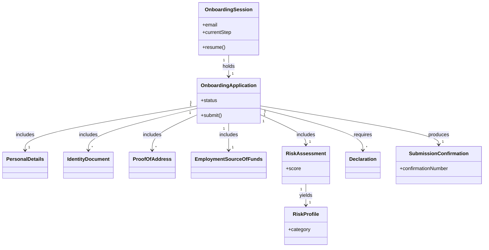

<!-- ROLE: requirements draft. Audience is LLM-only. Inline [SRC: C-NNN] tags are backed by requirements/draft-claims.ndjson and retained by the merger; [AI-SUGGESTED]/[STANDARD-RULE]/[OUT-OF-SCOPE] markers are stripped/resolved downstream. -->

# Requirements: Northstar Wealth Client Onboarding & KYC Wizard [SRC: C-001]

**Domain:** Wealth management / financial services [SRC: C-003] **Target:** prototype **Created:** 2026-05-30 **Status:** final **Last finalised at:** 2026-05-31

---

## 0.1 Target-mode applicability

| Section | `prototype` | `application` | Mode-conditional? |
| --- | --- | --- | --- |
| §6.10 Consumed backend contracts | fixture references | pointers into sibling backend doc | yes — sub-block content differs |
| §7 Data shapes consumed by FE | shape sourced from fixtures | shape sourced from backend contracts | provenance label only |
| `## Prototype invariants` appendix | appended (PI-01..PI-07) | omitted | yes — merger conditional |
| (all other sections) | identical | identical | no |

This draft is authored under `target = prototype`.

---

## 1. Application context

**Name:** Northstar Wealth Client Onboarding & KYC Wizard [SRC: C-001]

**Purpose / business value:** A self-service digital experience that shifts most information gathering, verification, and risk assessment from the in-person advisor meeting to a client-completed online flow, so advisor meetings can focus on review and advice. [SRC: C-002]

**Domain:** Wealth management / financial services, governed by Know-Your-Customer (KYC) and Anti-Money-Laundering (AML) onboarding practice. [SRC: C-003]

**Business goal:** Reduce advisor-led onboarding time from a multi-hour in-person session to a short review meeting by collecting complete, accurate KYC and suitability information ahead of time. [SRC: C-004]

---

## 1.5 Scope

| Bucket | Items |
| --- | --- |
| In | Multi-step onboarding flow, progress indicator, forward/backward navigation, inline validation and error handling, save-and-resume, document upload with preview, risk-profile calculation, review-and-edit, submission confirmation [SRC: C-005] |
| Out | A full authentication system (resume is gated by a lightweight email re-entry check instead), real server-side persistence, and backend KYC/AML verification processing (the prototype consumes mock upload and submission endpoints) [SRC: C-006] |
| Deferred | Joint-account and multi-applicant onboarding; advisor-side review and approval surfaces |

---

## 1.6 Assumptions & dependencies

| Kind | Statement | Source |
| --- | --- | --- |
| Abstract service dependency | A binary blob storage tier for uploaded identity and address documents (prototyped as base64-encoded files held in client-side state) [SRC: C-007] | stated |
| Abstract service dependency | A submission service that accepts the completed onboarding package and returns a confirmation number (prototyped as a mock endpoint) [SRC: C-010] | stated |
| Persona prerequisite | The client has the required documents available before starting — a government-issued ID, a proof of address, and employment details [SRC: C-008] | stated |
| Environment assumption | The client uses a desktop web browser at a viewport width of roughly 1280px or above [SRC: C-009] | stated |

---

## 1.7 Architectural implications

| Capability category | Driving requirement(s) | Recommendation (optional) |
| --- | --- | --- |
| Client-side state management | → §6.1 F-01 / F-05 / F-31 | — |
| Offline cache / local persistence | → §6.1 F-05 / F-30 / F-31 | — |
| File upload / binary blob handling | → §6.1 F-11 / F-12 / F-13 / F-29 | binary blob storage tier required |
| Notification delivery surface | → §6.8 NT-01 / NT-02 / NT-03 | in-app channel only |

---

## 2. Domain model

### 2.1 Concepts

| Concept | Persistence | Definition (ubiquitous language) |
| --- | --- | --- |
| Onboarding Session [SRC: C-011] | persistent | A resumable session that holds a client's in-progress onboarding and is stored locally so it can be continued later. [SRC: C-012] |
| Onboarding Application [SRC: C-013] | persistent | The complete package of information a prospective client assembles across the six-step flow and submits for advisor review. [SRC: C-014] |
| Personal Details [SRC: C-015] | persistent | The client's identity and residency information collected for KYC compliance. [SRC: C-016] |
| Identity Document [SRC: C-017] | persistent | A supporting identity document (passport, driver's licence, or national ID) uploaded to verify the client's identity. [SRC: C-018] |
| Proof of Address [SRC: C-019] | persistent | A supporting document evidencing the client's address, dated within the last three months. [SRC: C-020] |
| Employment & Source of Funds [SRC: C-021] | persistent | The client's employment status, income, and declared source of funds collected for regulatory compliance. [SRC: C-022] |
| Risk Assessment [SRC: C-023] | persistent | The client's responses to the five risk-tolerance questions used to determine investment risk tolerance. [SRC: C-024] |
| Risk Profile [SRC: C-025] | derived | The client's risk category and one-sentence description derived from the risk-assessment score. [SRC: C-026] |
| Declaration [SRC: C-027] | persistent | The required consent checkboxes a client must accept before submission. [SRC: C-028] |
| Submission Confirmation [SRC: C-029] | derived | The confirmation number and message produced when an application is submitted successfully. [SRC: C-030] |

### 2.2 Relationships

- Onboarding Session **holds** Onboarding Application [1..1]
- Onboarding Application **includes** Personal Details [1]
- Onboarding Application **includes** Identity Document [1..*]
- Onboarding Application **includes** Proof of Address [1..*]
- Onboarding Application **includes** Employment & Source of Funds [1]
- Onboarding Application **includes** Risk Assessment [1]
- Risk Assessment **yields** Risk Profile [1]
- Onboarding Application **requires** Declaration [1..*]
- Onboarding Application **produces** Submission Confirmation [0..1]

### 2.3 Aggregates & lifecycles

#### Onboarding Application

| Field | Value |
| --- | --- |
| Member concepts | Personal Details, Identity Document, Proof of Address, Employment & Source of Funds, Risk Assessment, Risk Profile, Declaration, Submission Confirmation |
| Lifecycle states | In Progress → Submitted → Confirmed |
| Key invariants | An application cannot move to Submitted until all six steps are complete with required uploads and declarations provided; a saved application can be resumed only after the starting email is re-entered; local storage is cleared once submission succeeds. |

### 2.4 Diagram

### 2.5 State-transition matrix

#### Onboarding Application

| From → To | Trigger | Pre-condition | Visible effect |
| --- | --- | --- | --- |
| In Progress → Submitted | The client confirms and submits from the review step [SRC: C-031] | All six steps complete with required uploads and declarations provided → §6.2 BR-01 [SRC: C-032] | The success screen replaces the flow and a confirmation number is shown |
| Submitted → Confirmed | The mock submission endpoint returns success with a generated confirmation number [SRC: C-033] | → §6.2 BR-04 | The confirmation number, follow-up message, and contact email are shown and local storage is cleared |

---

## 3. Target users

### Prospective Client

| Field | Value |
| --- | --- |
| Role / job title | A prospective Northstar Wealth client [SRC: C-034] opening a new investment account [SRC: C-035] |
| Expertise level | Comfortable using desktop web applications; financial knowledge varies and the client may be unfamiliar with KYC terminology [SRC: C-036] |
| Stakes | Required to provide identity and financial information to become a client [SRC: C-038] |
| Frequency of use | One-time onboarding, potentially completed across multiple sessions via save-and-resume |
| Driving forces — wants | To complete onboarding from home at their own pace, understand what is needed up front, save and resume, know why information is requested, and feel their data is handled securely [SRC: C-039] |
| Driving forces — fears | May be cautious about sharing personal and financial information online [SRC: C-040] |

---

## 4. User goals & stories

### 4.1 Goals catalogue

| ID | Goal statement | Quality signals | Goal kind | Layout pref (optional) | UX-pattern pref (optional) |
| --- | --- | --- | --- | --- | --- |
| G-01 | Onboard via self-service data capture from home before the advisor meeting [SRC: C-041] | efficiency, autonomy | top-level | — | — |
| G-02 | Submit all information required for KYC and suitability assessments before advisor review [SRC: C-042] | completeness, compliance | top-level | — | — |
| G-03 | Save progress and continue onboarding later without losing data [SRC: C-043] | continuity, low-friction | sub-level | — | — |
| G-04 | Understand my investment risk profile [SRC: C-044] | clarity, confidence | sub-level | — | — |
| G-05 | Feel confident that personal information is handled securely and understand why it is requested [SRC: C-045] | trust, transparency | sub-level | — | — |
| G-06 | Receive confirmation that the application has been submitted successfully [SRC: C-046] | assurance | interaction-level | — | — |
| G-07 | Review and correct information before submission [SRC: C-047] | accuracy, control | sub-level | — | — |

### 4.2 Stories by persona

#### Prospective Client <!-- → §3 -->

##### Story: As a prospective client, I want to complete onboarding online before my advisor meeting, so that the meeting focuses on advice rather than data capture [SRC: C-041]

| Field | Value |
| --- | --- |
| Goal | → §4.1 G-01 |
| Objective | Capture personal, identity, employment, and risk information through a guided multi-step flow. |
| Context (frequency / expertise / stakes) | One-time onboarding; varying financial literacy; high stakes (becoming a client). |
| Linked task flow (optional) | → §5 Complete onboarding |
| Acceptance criteria | Given a started session, when the client completes all six steps, then the application is ready to submit. [SRC: C-005] |

##### Story: As a prospective client, I want to submit complete KYC and suitability information ahead of time, so that everything is ready for advisor review [SRC: C-042]

| Field | Value |
| --- | --- |
| Goal | → §4.1 G-02 |
| Objective | Collect all mandatory KYC documentation and suitability inputs before submission. |
| Context | High-compliance context; mandatory fields and uploads. |
| Linked task flow (optional) | → §5 Complete onboarding |
| Acceptance criteria | Given an application, when required documentation is missing, then submission is blocked until it is provided. [SRC: C-098] |

##### Story: As a prospective client, I want to save my progress and continue later, so that I can complete onboarding at my own pace [SRC: C-043]

| Field | Value |
| --- | --- |
| Goal | → §4.1 G-03 |
| Objective | Persist in-progress data and resume from where the client left off. |
| Context | Multi-session completion; no data loss expected. |
| Linked task flow (optional) | → §5 Save and resume |
| Acceptance criteria | Given saved progress, when the client returns and re-enters the starting email, then the flow resumes at the saved step. [SRC: C-064] |

##### Story: As a prospective client, I want to understand my investment risk profile, so that I know my risk tolerance [SRC: C-044]

| Field | Value |
| --- | --- |
| Goal | → §4.1 G-04 |
| Objective | Answer five questions and see a derived risk category with a description. |
| Context | Client may have limited investment experience. |
| Linked task flow (optional) | → §5 Complete onboarding |
| Acceptance criteria | Given five answered questions, when scoring completes, then the risk category and a one-sentence description are shown. [SRC: C-083] |

##### Story: As a prospective client, I want to know why information is requested and that it is handled securely, so that I am confident sharing it [SRC: C-045]

| Field | Value |
| --- | --- |
| Goal | → §4.1 G-05 |
| Objective | Surface a short rationale per step and plain-language reassurance. |
| Context | Client cautious about sharing sensitive data online. |
| Linked task flow (optional) | → §5 Complete onboarding |
| Acceptance criteria | Given any step, when it is displayed, then a short explanation of why the information is required is shown. [SRC: C-093] |

##### Story: As a prospective client, I want to review and correct my information before submitting, so that my data is accurate [SRC: C-047]

| Field | Value |
| --- | --- |
| Goal | → §4.1 G-07 |
| Objective | Present a read-only summary with per-section edit, returning to review after edits. |
| Context | Targeted corrections rather than re-completion. |
| Linked task flow (optional) | → §5 Edit from review |
| Acceptance criteria | Given the review step, when the client edits a section and saves, then they return directly to review. [SRC: C-092] |

##### Story: As a prospective client, I want a submission confirmation, so that I know my application was received [SRC: C-046]

| Field | Value |
| --- | --- |
| Goal | → §4.1 G-06 |
| Objective | Show a confirmation number, message, follow-up process, and contact email on success. |
| Context | End-of-flow reassurance. |
| Linked task flow (optional) | → §5 Complete onboarding |
| Acceptance criteria | Given a successful submission, when the success state renders, then a confirmation number and follow-up details are shown. [SRC: C-090] |

---

## 5. Task flows

### Flow: Complete onboarding

| Field | Value |
| --- | --- |
| Actor | Prospective Client (→ §3) — completing onboarding independently [SRC: C-048] |
| Trigger | The client begins onboarding from the first step [SRC: C-048] |
| Steps | (Enter email and begin; a resumable session is created [SRC: C-066]) → (Enter personal details; fields validate [SRC: C-068]) → (Upload identity document and proof of address; previews confirm receipt [SRC: C-074]) → (Enter employment and source-of-funds details; conditional fields appear [SRC: C-077]) → (Answer five risk questions; a risk category is shown [SRC: C-080]) → (Review the summary, accept declarations, and submit; a confirmation number is shown [SRC: C-088]) |
| Decision points | Employment status determines which conditional fields appear; risk score determines the risk category. |
| Exception paths | {upload fails → "We couldn't upload your document right now. Please try again." → retry the upload [SRC: C-050]} |
| Role-conditional behaviour | None — single self-service actor. |

### Flow: Save and resume

| Field | Value |
| --- | --- |
| Actor | Prospective Client (→ §3) |
| Trigger | The client saves progress and continues later [SRC: C-051] |
| Steps | (Leave mid-flow; progress is stored locally) → (Return later; a welcome-back message offers to continue from the saved step [SRC: C-052]) → (Re-enter the starting email; the saved step is restored [SRC: C-064]) |
| Decision points | Whether saved progress exists for the returning client. |
| Exception paths | {entered email does not match the starting email → progress is not restored → re-enter the correct email [SRC: C-064]} |
| Role-conditional behaviour | None. |

### Flow: Edit from review

| Field | Value |
| --- | --- |
| Actor | Prospective Client (→ §3) |
| Trigger | The client chooses to edit a section from the review step [SRC: C-053] |
| Steps | (Open a section for editing from review) → (Make corrections and save) → (Return directly to review [SRC: C-054]) |
| Decision points | Which section the client edits. |
| Exception paths | {a corrected field fails validation → an inline error is shown → fix the field before saving [SRC: C-061]} |
| Role-conditional behaviour | None. |

### Flow: Upload documents

| Field | Value |
| --- | --- |
| Actor | Prospective Client (→ §3) |
| Trigger | The client uploads identity and address documents [SRC: C-055] |
| Steps | (Select a document type) → (Choose a file; an upload progress indicator and preview thumbnail appear [SRC: C-074]) → (Validation feedback confirms the upload or reports a problem) |
| Decision points | Document type determines how many images are required. |
| Exception paths | {proof of address is older than three months → "Your proof of address must be dated within the last three months." → upload a more recent document [SRC: C-056]} |
| Role-conditional behaviour | None. |

---

## 6. Requirements

### 6.1 Functional

| ID | Statement | Acceptance criteria | Source |
| --- | --- | --- | --- |
| F-01 | Provide a six-step onboarding flow [SRC: C-057] | Given a started session, when the client advances, then they move through exactly six ordered steps to a submission state | stated |
| F-02 | Show a progress indicator with current step, total steps, and completion percentage [SRC: C-058] | Given any step, when displayed, then the current step and overall completion are shown [SRC: C-059] | stated |
| F-03 | Allow forward and backward navigation between steps [SRC: C-060] | Given a step, when the client navigates back, then prior entries are preserved [SRC: C-060] | stated |
| F-04 | Validate input and handle errors per step [SRC: C-061] | Given invalid input, when the client proceeds, then a specific inline error is shown and progression is blocked [SRC: C-061] | stated |
| F-05 | Provide save-and-resume using client-side local storage [SRC: C-062] | Given progress, when the client leaves and returns, then progress is restored from local storage [SRC: C-063] | stated |
| F-06 | Require re-entry of the starting email to resume [SRC: C-064] | Given saved progress, when the client returns, then progress is restored only after the starting email is re-entered [SRC: C-064] | stated |
| F-07 | Show a welcome-back message indicating the resume step [SRC: C-065] | Given saved progress, when the client returns, then a "Welcome back. Continue from Step X." message is shown [SRC: C-065] | stated |
| F-08 | Step 1 captures the email, shows estimated time and required documents, and creates a resumable session [SRC: C-066] | Given the start step, when the client begins, then a session is created and required documents and estimated time are shown [SRC: C-067] | stated |
| F-09 | Step 2 captures identity and residency details for KYC [SRC: C-068] | Given the personal-details step, when required fields are complete and valid, then the client can proceed [SRC: C-068] | stated |
| F-10 | Nationality and tax-residency selectors include at least the 20 most common countries [SRC: C-069] | Given the selectors, when opened, then at least 20 common countries are available [SRC: C-069] | stated |
| F-11 | Step 3 lets the client select an identity document type and upload the required image(s) per type [SRC: C-070] | Given a document type, when selected, then the correct number of image uploads is required (passport front only; licence and national ID front and back) [SRC: C-070] | stated |
| F-12 | Step 3 captures a proof of address (utility bill or bank statement) dated within the last three months [SRC: C-071] | Given a proof of address, when it is older than three months, then it is rejected [SRC: C-071] | stated |
| F-13 | Enforce supported file types (JPG, PNG, PDF) and a 5 MB per-file size limit [SRC: C-072] | Given a file, when it is an unsupported type or over 5 MB, then it is rejected with an inline error [SRC: C-073] | stated |
| F-14 | Provide upload UX: progress indicator, preview thumbnail, and clear validation feedback [SRC: C-074] | Given an upload, when it completes, then a preview thumbnail confirms receipt [SRC: C-075] | stated |
| F-15 | Step 4 captures employment and source-of-funds information for regulatory compliance [SRC: C-076] | Given the employment step, when required fields are complete, then the client can proceed [SRC: C-076] | stated |
| F-16 | Show conditional employment fields based on the selected employment status [SRC: C-077] | Given an employment status, when selected, then only the fields relevant to that status are shown and required [SRC: C-077] | stated |
| F-17 | Offer the defined annual income brackets as selectable options [SRC: C-078] | Given the income field, when opened, then the defined brackets are selectable [SRC: C-078] | stated |
| F-18 | Capture source of funds; when "Other" is chosen, require an explanation of at least 20 characters [SRC: C-079] | Given source of funds = Other, when the explanation is under 20 characters, then submission of the field is blocked [SRC: C-079] | stated |
| F-19 | Step 5 presents five risk questions, each scored 1 to 4 [SRC: C-080] | Given the risk step, when all five questions are answered, then a score can be computed [SRC: C-080] | stated |
| F-20 | Compute a risk score (range 5 to 20) and map it to a risk category [SRC: C-081] | Given a completed questionnaire, when scored, then the score maps to one of the four categories (e.g., a low score maps to Conservative) [SRC: C-082] | stated |
| F-21 | Display the resulting risk category and a one-sentence description [SRC: C-083] | Given a computed score, when shown, then the matching category and a one-sentence description are displayed [SRC: C-083] | stated |
| F-22 | Step 6 shows a read-only summary grouped by section [SRC: C-084] | Given completed steps, when the review step renders, then a read-only summary grouped by section is shown [SRC: C-084] | stated |
| F-23 | Provide an edit action per review section [SRC: C-085] | Given the review summary, when the client chooses edit on a section, then that section opens for editing [SRC: C-085] | stated |
| F-24 | Require declaration checkboxes (accuracy, terms, consent to identity checks) before submission [SRC: C-086] | Given the review step, when any required declaration is unchecked, then submission is blocked [SRC: C-087] | stated |
| F-25 | Submit the application to a mock endpoint and generate a confirmation number [SRC: C-088] | Given a complete application, when submitted, then a confirmation number is generated [SRC: C-089] | stated |
| F-26 | Show a success state with confirmation number, message, advisor follow-up, and contact email [SRC: C-090] | Given a successful submission, when the success state renders, then the confirmation number and contact email are shown [SRC: C-091] | stated |
| F-27 | After editing from review, return the client directly to review [SRC: C-092] | Given an edit started from review, when the client saves, then they return to review [SRC: C-092] | stated |
| F-28 | Show a short "why we ask" explanation on each step [SRC: C-093] | Given any step, when displayed, then a short explanation of why the information is required is shown [SRC: C-093] | stated |
| F-29 | Use a mock upload endpoint; hold uploaded files as base64 in client-side state [SRC: C-094] | Given an upload, when it completes, then the file is held in client-side state and a preview is available [SRC: C-094] | stated |
| F-30 | Clear local storage after a successful submission [SRC: C-095] | Given a successful submission, when it completes, then locally stored progress is cleared [SRC: C-095] | stated |
| F-31 | Preserve data across a page refresh (no data loss) [SRC: C-096] | Given entered data, when the page is refreshed, then no data is lost [SRC: C-096] | stated |
| F-32 | Enforce a minimum client age of 18 [SRC: C-097] | Given a date of birth under 18 years, when validated, then onboarding cannot proceed [SRC: C-097] | stated |

### 6.2 Business rules

| ID | Statement (when / then) | Enforcement point | Acceptance criteria | Source | Severity |
| --- | --- | --- | --- | --- | --- |
| BR-01 | When any of the six steps is incomplete or required documentation is missing, then submission is blocked [SRC: C-098] | ui | Submit is unavailable until all mandatory data and uploads are provided | → §6.1 F-24 | blocker |
| BR-02 | When the client's age is under 18, then onboarding cannot proceed [SRC: C-099] | ui | An inline age error blocks progression past personal details | → §6.1 F-32 | blocker |
| BR-03 | When a client returns to a saved session, then progress is restored only after the starting email is re-entered [SRC: C-100] | ui | Re-entered email must match the starting email before restore | → §6.1 F-06 | major |
| BR-04 | When submission succeeds, then locally stored progress is cleared [SRC: C-101] | ui | Local storage holds no onboarding data after a confirmed submission | → §6.1 F-30 | major |
| BR-05 | When source of funds is "Other", then a 20-character minimum explanation is required [SRC: C-102] | ui | The explanation field rejects entries under 20 characters | → §6.1 F-18 | major |
| BR-06 | When a proof of address is dated more than three months ago, then it is rejected [SRC: C-103] | ui | An inline error names the three-month recency requirement | → §6.1 F-12 | major |
| BR-07 | When the Step 2 email confirmation does not match the Step 1 email, then a validation error is shown [SRC: C-104] | ui | The confirmation field reports a mismatch on submit | → §6.1 F-09 | minor |
| BR-08 | When the questionnaire is scored, then the score maps to a fixed risk-category band (Conservative, Balanced, Growth, Aggressive) [SRC: C-105] | ui | The displayed category matches the score band | → §6.1 F-20 | major |
| BR-09 | When any required declaration is unchecked, then submission is blocked [SRC: C-106] | ui | Submit is unavailable until all declarations are accepted | → §6.1 F-24 | blocker |

### 6.3 Validation rules

| Field (→ §7) | Validation type | Rule | Error message |
| --- | --- | --- | --- |
| OnboardingSession.email | required, format | Valid email format; required [SRC: C-107] | "Enter a valid email address." |
| PersonalDetails.dateOfBirth | range | Age must be 18 years or older [SRC: C-108] | "You must be at least 18 years old to continue." |
| PersonalDetails.emailConfirmation | cross-field | Must match the Step 1 email [SRC: C-109] | "This must match the email you started with." |
| PersonalDetails.mobileNumber | format | Valid mobile-number format [SRC: C-110] | "Enter a valid mobile number." |
| PersonalDetails.nationality | required (enum) | Nationality must be selected [SRC: C-111] | "Select your nationality." |
| IdentityDocument.image | format | Supported file type only [SRC: C-112] | "Upload a JPG, PNG, or PDF file." |
| IdentityDocument.image | range | File size limit of 5 MB [SRC: C-113] | "Each file must be 5 MB or smaller." |
| ProofOfAddress.documentDate | range | Dated within the last three months [SRC: C-114] | "Your proof of address must be dated within the last three months." |
| EmploymentSourceOfFunds.sourceOfFundsOther | length | Minimum 20 characters when source of funds is "Other" [SRC: C-115] | "Please provide at least 20 characters." |
| IdentityDocument.image | business-rule-ref | Required uploads completed before continuing → §6.2 BR-01 [SRC: C-116] | "Upload all required documents before continuing." |

### 6.4 UI feature needs

| ID | Feature need | Linked (G / story / BR) | Acceptance criteria |
| --- | --- | --- | --- |
| UI-01 | User can see the current step, total steps, and completion percentage [SRC: C-117] | → §4.1 G-01 / → §6.1 F-02 | The current step and overall completion are always visible during the flow |
| UI-02 | User can navigate forward and backward between steps [SRC: C-118] | → §6.1 F-03 | Backward navigation preserves entered data |
| UI-03 | User sees specific, corrective inline error messages for their own mistakes [SRC: C-119] | → §6.1 F-04 | Errors name the field and the correction needed |
| UI-04 | User can save progress and resume later [SRC: C-120] | → §4.1 G-03 / → §6.1 F-05 | Progress is restored on return |
| UI-05 | On return, user sees a welcome-back message and must re-enter the starting email [SRC: C-121] | → §6.1 F-06 / F-07 | Restore occurs only after a matching email is entered |
| UI-06 | User can upload documents and see upload progress and a preview thumbnail [SRC: C-122] | → §6.1 F-14 | A preview confirms each successful upload |
| UI-07 | User sees a short explanation of why each step's information is requested [SRC: C-123] | → §4.1 G-05 / → §6.1 F-28 | Each step shows its rationale copy |
| UI-08 | User can review a read-only summary grouped by section and edit any section [SRC: C-124] | → §4.1 G-07 / → §6.1 F-22 / F-23 | Each section offers an edit action |
| UI-09 | After editing from review, user returns directly to review [SRC: C-125] | → §6.1 F-27 | Saving an edit returns to review, not into the flow |
| UI-10 | User must accept all required declarations before submitting [SRC: C-126] | → §6.2 BR-09 / → §6.1 F-24 | Submit is unavailable until all declarations are accepted |
| UI-11 | User sees the risk category and a one-sentence description after the questionnaire [SRC: C-127] | → §4.1 G-04 / → §6.1 F-21 | The category and description render after scoring |
| UI-12 | On submission, user sees a confirmation number, message, advisor follow-up, and contact email [SRC: C-128] | → §4.1 G-06 / → §6.1 F-26 | The confirmation details render on success |
| UI-13 | Employment fields appear conditionally based on the selected employment status [SRC: C-129] | → §6.1 F-16 | Only status-relevant fields are shown |
| UI-14 | The "Other" source-of-funds choice reveals a required explanation field [SRC: C-130] | → §6.2 BR-05 / → §6.1 F-18 | The explanation field requires at least 20 characters |
| UI-15 | Field validation runs on blur for format and required rules and on submit for cross-field rules | → §6.1 F-04 | No validation fires on keystroke |
| UI-16 | Required fields are marked and explained with a single legend | → §6.1 F-09 | Required markers are consistent across forms |
| UI-17 | The first editable field receives focus when a step opens | → §6.1 F-09 | Keyboard users can type immediately |
| UI-18 | A loading affordance appears for the upload simulation and clears on completion | → §6.1 F-14 | No flicker for sub-300ms operations; a skeleton/progress affordance for longer ones |
| UI-19 | Transient confirmations use auto-dismissing messages; state the user must acknowledge persists | → §6.1 F-04 | Persistent state (errors, offline) is acknowledged, not auto-dismissed |
| UI-20 | The risk-category indicator pairs colour with a text label, mapped by intent | → §6.1 F-21 | Colour is never the sole signal of category |
| UI-21 | Icon-only controls expose an accessible name on hover and focus | → §6.1 F-14 | Each icon-only control has a matching accessible label |

#### 6.4.5 Edge, empty & error states

| Surface (→ story / flow / UI-NN) | Condition | Expected UI behaviour | Recovery action |
| --- | --- | --- | --- |
| → §5 Upload documents / UI-06 | error | An upload failure shows an apologetic, actionable message: "We couldn't upload your document right now. Please try again." [SRC: C-131] | The client retries the upload |
| → §5 Upload documents / UI-06 | error | A stale proof of address shows "Your proof of address must be dated within the last three months." [SRC: C-132] | The client uploads a more recent document |
| → §6.1 F-13 / UI-06 | error | An oversized or unsupported file is rejected with an inline file-constraint error [SRC: C-133] | The client selects a supported file within the size limit |
| → §5 Save and resume / UI-05 | empty | When no saved progress exists for a returning client, the flow starts fresh from the first step | The client begins onboarding |
| → §6.1 F-25 / UI-12 | error | A submission failure shows an apologetic, actionable message and keeps entered data intact | The client retries submission |
| → §6.1 F-19 / UI-11 | partial | When not all five risk questions are answered, scoring is unavailable and the unanswered questions are indicated | The client answers the remaining questions |

### 6.5 Access control (RBAC)

**Action vocabulary:** `C` create · `R` read · `U` update · `X` execute / invoke · `—` no access.

> The prototype is single-actor self-service: the Prospective Client owns and operates on their own onboarding data only [SRC: C-134]. There are no other roles in scope.

| Role (→ §3) | Onboarding Session | Onboarding Application | Personal Details | Identity Document | Proof of Address | Employment & Source of Funds | Risk Assessment | Declaration | Risk Profile | Submission Confirmation | Complete onboarding | Save & resume | Edit from review | Upload documents |
| --- | --- | --- | --- | --- | --- | --- | --- | --- | --- | --- | --- | --- | --- | --- |
| Prospective Client | C R U D | C R U D X | C R U | C R U | C R U | C R U | C R U | C R U | R | R | X | X | X | X |

> The Prospective Client can discard an in-progress onboarding application and restart. This is a destructive action gated by a modal confirmation that names the affected item, uses a destructive-styled primary action, and defaults focus to Cancel.

### 6.6 Non-functional (FE-only)

#### 6.6.1 Session UX

| Field | Value | Source |
| --- | --- | --- |
| Idle session timeout | No idle timeout — onboarding progress persists in client-side local storage until submission | stated |
| Absolute session timeout | No absolute timeout — progress persists until the application is submitted or local storage is cleared | stated |
| Idle warning lead-time | Not applicable — no session timeout | stated |
| Re-auth scope | Not applicable — the prototype uses no authentication system; resuming requires re-entering the starting email as a lightweight identity check | stated |
| Account lockout messaging | Not applicable — no authentication system | stated |
| MFA prompt scope | Not applicable — no authentication system | stated |

#### 6.6.2 Frontend performance budgets

| Metric | Target | Source |
| --- | --- | --- |
| Time to interactive (p95) | p95 ≤ 2.5 s on a desktop viewport | inferred |
| Initial bundle size budget | ≤ 300 KB gzipped | inferred |
| Render budget for largest list/table | Not applicable — single-record multi-step flow, no large collections | inferred |
| Step transition time | 300 ms or less per step transition; upload simulation 2 s or less | stated |

#### 6.6.4 Compliance UI behaviour

- Each step displays a short explanation of why the information is required (for example, the rationale for collecting tax-residency information).
- Reassurance copy uses plain language about secure handling and avoids vague claims such as "bank-grade security", "military-grade encryption", or "completely secure".
- Required consent declarations (information accuracy, terms and conditions, consent to identity-verification checks) are captured before submission.
- Tone is professional: no emojis, no casual social-media language, and minimal legal jargon.

#### 6.6.5 Accessibility

- Keyboard-accessible navigation throughout the flow.
- Visible focus states on interactive elements.
- Associated labels for all fields.
- Screen-reader-friendly error messages.
- Target conformance: WCAG 2.2 AA.

### 6.7 Reporting feature needs

> No client-facing reporting is in scope. The review summary (§6.4 UI-08) presents the client's own data for confirmation and the risk-profile result (§7.X) is shown inline; neither is a report. Advisor-side review of submitted applications occurs outside this application and is out of scope.

### 6.8 Notification points

| ID | Event | Audience (→ §3) | Channel category | Trigger condition |
| --- | --- | --- | --- | --- |
| NT-01 | Submission confirmation message [SRC: C-135] | Prospective Client | in-app | On successful submission → §6.2 BR-04 |
| NT-02 | Welcome-back resume prompt [SRC: C-136] | Prospective Client | in-app | Saved progress is detected on return |
| NT-03 | Upload-received confirmation [SRC: C-137] | Prospective Client | in-app | A document upload completes |

### 6.10 Consumed backend contracts

#### Under `target = prototype`

| Operation | Fixture reference | Notes |
| --- | --- | --- |
| list-countries | `fixtures/countries.json` | At least the 20 most common countries for nationality and tax residency → §6.1 F-10 [SRC: C-138] |
| upload-document | mock upload endpoint (simulated success; file held as base64 in state) | → §6.1 F-29 [SRC: C-139] |
| submit-application | mock submission endpoint returning a generated confirmation number | → §6.1 F-25 [SRC: C-140] |

---

## 7. Data shapes consumed by the FE

### Shape: OnboardingSession [SRC: C-141]

| Field | Type | Required | UI-display | Notes |
| --- | --- | --- | --- | --- |
| email | string | yes | form-input | Captured at Step 1; required to resume |
| currentStep | number | yes | hidden | The saved step index |
| status | enum | yes | chip | In Progress / Submitted / Confirmed |
| startedAt | datetime | no | hidden | Session creation time |

**Domain concept:** → §2.1 Onboarding Session
**Source:** prototype-fixture
**Enums:** status: In Progress, Submitted, Confirmed

### Shape: OnboardingApplication [SRC: C-142]

| Field | Type | Required | UI-display | Notes |
| --- | --- | --- | --- | --- |
| id | string | yes | hidden | Local application identifier |
| status | enum | yes | chip | Lifecycle state |
| submittedAt | datetime | no | detail | Set on submission |

**Domain concept:** → §2.1 Onboarding Application
**Source:** prototype-fixture
**Enums:** status: In Progress, Submitted, Confirmed

### Shape: PersonalDetails [SRC: C-143]

| Field | Type | Required | UI-display | Notes |
| --- | --- | --- | --- | --- |
| fullLegalName | string | yes | form-input | |
| preferredName | string | no | form-input | |
| dateOfBirth | date | yes | form-input | Age must be 18+ |
| nationality | enum | yes | form-input | 20-plus common countries |
| countryOfResidence | enum | yes | form-input | |
| taxResidency | enum | yes | form-input | |
| mobileNumber | string | yes | form-input | Validated format |
| emailConfirmation | string | yes | form-input | Must match Step 1 email |

**Domain concept:** → §2.1 Personal Details
**Source:** prototype-fixture
**Enums:** nationality / countryOfResidence / taxResidency: country list

### Shape: IdentityDocument [SRC: C-144]

| Field | Type | Required | UI-display | Notes |
| --- | --- | --- | --- | --- |
| documentType | enum | yes | enum | Passport / Driver's Licence / National ID |
| frontImage | file | yes | form-input | All types |
| backImage | file | no | form-input | Required for licence and national ID |
| fileName | string | no | detail | |
| fileSize | number | no | detail | 5 MB or less |

**Domain concept:** → §2.1 Identity Document
**Source:** prototype-fixture
**Enums:** documentType: Passport, Driver's Licence, National ID

### Shape: ProofOfAddress [SRC: C-145]

| Field | Type | Required | UI-display | Notes |
| --- | --- | --- | --- | --- |
| documentType | enum | yes | enum | Utility bill / Bank statement |
| image | file | yes | form-input | JPG / PNG / PDF, 5 MB or less |
| documentDate | date | yes | form-input | Within the last three months |

**Domain concept:** → §2.1 Proof of Address
**Source:** prototype-fixture
**Enums:** documentType: Utility bill, Bank statement

### Shape: EmploymentSourceOfFunds [SRC: C-146]

| Field | Type | Required | UI-display | Notes |
| --- | --- | --- | --- | --- |
| employmentStatus | enum | yes | form-input | Employed / Self-employed / Retired / Unemployed / Student |
| employerName | string | no | form-input | When Employed |
| jobTitle | string | no | form-input | When Employed |
| businessName | string | no | form-input | When Self-employed |
| occupation | string | no | form-input | When Self-employed |
| previousOccupation | string | no | form-input | When Retired |
| institutionName | string | no | form-input | When Student |
| sourceOfLivingExpenses | string | no | form-input | When Unemployed |
| annualIncomeBracket | enum | no | form-input | Income bands |
| pensionIncomeBracket | enum | no | form-input | When Retired |
| sourceOfFunds | enum | yes | form-input | Salary / Savings / Inheritance / Sale of property / Business proceeds / Other |
| sourceOfFundsOther | string | no | form-input | Required (20-plus chars) when Other |

**Domain concept:** → §2.1 Employment & Source of Funds
**Source:** prototype-fixture
**Enums:** employmentStatus, annualIncomeBracket, sourceOfFunds (see notes)

### Shape: RiskAssessment [SRC: C-147]

| Field | Type | Required | UI-display | Notes |
| --- | --- | --- | --- | --- |
| q1 | enum | yes | form-input | 1 to 4 |
| q2 | enum | yes | form-input | 1 to 4 |
| q3 | enum | yes | form-input | 1 to 4 |
| q4 | enum | yes | form-input | 1 to 4 |
| q5 | enum | yes | form-input | 1 to 4 |
| score | number | yes | detail | Sum, range 5 to 20 |

**Domain concept:** → §2.1 Risk Assessment
**Source:** prototype-fixture
**Enums:** q1 to q5: 1, 2, 3, 4

### Shape: Declaration [SRC: C-148]

| Field | Type | Required | UI-display | Notes |
| --- | --- | --- | --- | --- |
| informationAccurate | boolean | yes | form-input | Accuracy declaration |
| termsAccepted | boolean | yes | form-input | Terms and conditions |
| identityCheckConsent | boolean | yes | form-input | Consent to identity-verification checks |

**Domain concept:** → §2.1 Declaration
**Source:** prototype-fixture
**Enums:** —

### 7.X Derivations

| Derived concept (→ §2.1) | Derivation rule (business language) | Inputs | Refresh trigger |
| --- | --- | --- | --- |
| Risk Profile | The risk score maps to a fixed category band (Conservative, Balanced, Growth, Aggressive) with a one-sentence description [SRC: C-149] | RiskAssessment.score | on-change |
| Submission Confirmation | A confirmation number and message are generated when the application is submitted successfully [SRC: C-150] | OnboardingApplication submission | on-change |

---

## 8. Source UI references

| Reference | Location | Notes |
| --- | --- | --- |
| — | — | No source UI references (screenshots, wireframes, existing-tool screens) were supplied with the brief. |

---

## 9. Key terminology

| Term | Definition | Inconsistency flag |
| --- | --- | --- |
| KYC (Know Your Customer) | Regulatory practice of verifying a client's identity and suitability during onboarding | — |
| AML (Anti-Money Laundering) | Regulatory controls that source-of-funds and identity collection support | — |
| Suitability assessment | Evaluation of whether an investment approach fits the client, informed by the risk profile | — |
| Risk profile / category | → §2.1 Risk Profile | — |
| Source of funds | → §2.1 Employment & Source of Funds | — |
| Onboarding session | → §2.1 Onboarding Session | — |

---

## 10. Volumes

| Metric | Value | Source |
| --- | --- | --- |
| Data volume | One onboarding application per client; a handful of uploaded documents per application | inferred |
| Frequency | Low — onboarding is a one-time event per client, occasionally resumed across sessions | inferred |
| Concurrency | A single client per session; no shared or concurrent editing | inferred |

---

## Prototype invariants

### PI-01 — Server behaviour is simulated

All server-side behaviour — authentication, API calls, database operations, third-party integrations, scheduled jobs — is simulated by client-side stubs. Backend-shaped requirements describe the user-visible behaviour the simulation must reproduce, not real implementation. Endpoints, middleware, message queues, and infrastructure are out of scope.

### PI-02 — Data is fixture-backed

All data displayed in the prototype is sourced from in-memory fixtures shipped with the build. Mutations persist within a session but do not survive a reload unless an explicit "demo data" mode is specified. There is no real database, no migrations, and no data import / export pipelines.

### PI-03 — Validation is visual only

Form-field validation messages and inline error feedback are rendered as specified by the requirements, but no server-side enforcement is exercised. Constraints that are not visible in the UI — uniqueness checks, referential integrity, rate limiting, idempotency — are not run, even when the requirements name them.

### PI-04 — Third-party integrations are visual

Email, SMS, payment, mapping, file storage, and analytics integrations appear in the UI as visual confirmations or placeholder content. No external network calls are made. Where the requirements describe a third-party flow, the prototype reproduces the user-visible steps and the resulting UI state, not the network exchange.

### PI-05 — Role switcher

Every screen accessible to more than one role displays a role switcher in the prototype's surrounding chrome — outside the application UI under design — so reviewers can inspect each role's view without re-authenticating. The switcher is clearly labelled as a prototype tool, not an in-app control, and is placed in the same position on every screen. It lists every role defined in §3 of the requirements; roles to whom the active screen is not accessible per §6.5 RBAC are rendered in a disabled state. Switching the active role must immediately update the screen's visible components and actions to match the rules captured in the requirements (RBAC entries, conditional visibility, role-gated actions).

### PI-06 — Backend contracts are imaginary

Under the prototype target, the §6.10 fixture references *are* the backend; the §7 data shapes are the contract. There is no sibling backend specification, no live integration, and no contract-compatibility check. When §6.10 lists `Operation → Fixture reference`, the prototype reads and writes that fixture; mutations follow PI-02 (in-session persistence only). Application-target requirements specs replace these fixtures with pointers into a separate backend requirements document — those pointers are out of scope for the prototype build.

### PI-07 — Reporting is fixture-replayed

§6.7 reporting feature needs render from fixture aggregates only. No live computation, no aggregation pipeline, no scheduled materialisation, no export-side rendering. Filter dimensions and measure columns are honoured against the in-memory fixture; export formats produce the file from the same in-memory state. Reports listed with `Scheduling = daily / etc.` are visualised as scheduled in the UI (next-run timestamp, history entries) but do not execute on a clock.
