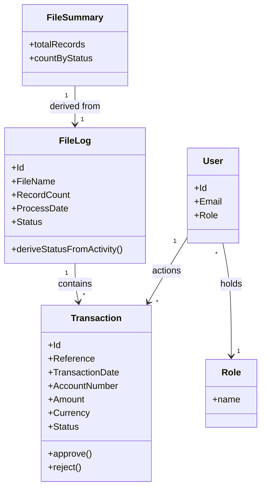

<!-- ROLE: requirements draft. LLM-audience. Populated from requirements/source-manifest.json inputs. -->

# Requirements: Transaction Import & Approval System [SRC: C-001]

**Domain:** Enterprise financial transaction data management [SRC: C-003] **Target:** prototype **Created:** 2026-06-12 **Status:** draft **Last finalised at:** —

> **Provenance.** Input-grounded cells carry a trailing `[SRC: C-NNN]` tag referencing `requirements/draft-claims.ndjson`, the authoritative store of verbatim source quotes. These tags are retained for downstream LLM consumers (review, design, code-generation).

---

## 0.1 Target-mode applicability

| Section | `prototype` | `application` | Mode-conditional? |
| --- | --- | --- | --- |
| §1.6 Assumptions & dependencies | emitted (≥1 dependency applies) | emitted | yes — content-conditional |
| §1.7 Architectural implications | emitted (drafter-derived; scope-noted) | carried through at export | no — scope-noted |
| §6.1 `Rationale` column | column emitted (optional, per-cell) | same | no |
| §6.6.1 Session UX | emitted (scope-noted) | carried through at export | no — scope-noted |
| §6.6.2 FE performance budgets | emitted (scope-noted) | carried through at export | no — scope-noted |
| §6.10 Consumed backend contracts | fixture references | pointers into backend doc | yes — sub-block content differs |
| §7 Data shapes consumed by FE | shape sourced from fixtures | shape sourced from backend contracts | provenance label only |
| §8 Source UI references | omitted (no consultant-supplied reference) | same | yes — content-conditional |
| §9 Key terminology | emitted (≥1 inconsistency flag exists) | same | yes — content-conditional |
| `## Prototype invariants` appendix | appended (PI-01..PI-08) | omitted | yes — merger conditional |
| (all other sections) | identical | identical | no |

---

## 1. Application context

**Name:** Transaction Import & Approval System [SRC: C-001]

**Purpose / business value:** A dual-role frontend that lets Importers upload and review transaction files [SRC: C-002] and lets Approvers review, approve or reject, and export transactions [SRC: C-005]. The system reflects file-driven ingestion, transaction lifecycle states, and role-based interaction constraints — "reflect" here meaning the frontend displays and surfaces them (read-oriented), not that it enforces them [SRC: C-058].

**Domain:** Enterprise financial transaction data management [SRC: C-003]

**Business goal:** Provide a file-driven ingestion-and-approval surface — files are ingested via File Logs [SRC: C-004], and the transactions they contain are reviewed and actioned through role-constrained screens.

---

## 1.5 Scope

> §1.5 is in-scope-only. The brief's seven named key screens are the explicit in-scope MVP set; anything outside that set is out of scope by default [SRC: C-047].

| Bucket | Items |
| --- | --- |
| In | Credentials-based authentication; role-based post-login routing; file upload (Importer); file-log overview; transaction table with client-side search/filter/pagination; transaction approve/reject; client-side CSV export of the filtered grid [SRC: C-005]; file-summary display [SRC: C-043] |
| Out | User and role administration (create/update/delete users and roles) [SRC: C-006]; file-validation-error review [SRC: C-007]; process-definition management [SRC: C-066]; file-settings configuration; bulk-error-file download flow |
| Deferred | User-facing recovery flow for a Failed file (unspecified, treated as not-yet-defined) [SRC: C-069] |

---

## 1.6 Assumptions & dependencies

> Abstract services and environment assumptions the FE depends on.

| Kind | Statement | Source |
| --- | --- | --- |
| Abstract service dependency | A credentials-based authentication service issues an HttpOnly, Secure, SameSite=Strict session cookie on successful login [SRC: C-064] | stated |
| Abstract service dependency | A transaction-management backend exposes file-log, transaction list, approve, reject, and upload operations the FE consumes | inferred |
| Persona prerequisite | Each user holds one of the two application roles (Importer or Approver) before sign-in [SRC: C-011] | stated |
| Environment assumption | Users operate desktop browsers first; a baseline accessibility standard is met [SRC: C-046] | stated |

---

## 1.7 Architectural implications

> **Application-build guidance — not a prototype design input; prototype behaviour is governed by PI-01/PI-03/PI-08.** Capability categories derived from §6 functional requirements + §10 volumes + §6.7 reporting needs. Recommendation column optional and non-deterministic.

| Capability category | Driving requirement(s) | Recommendation (optional) |
| --- | --- | --- |
| Client-side state management | → §6.1 F-06 / §6.1 F-07 / §6.1 F-08 | |
| Client-side search / filtering | → §6.1 F-07 / §6.7 RPT-01 / §10 | in-memory index acceptable at this volume |
| File upload / binary blob handling | → §6.1 F-03 / §10 | binary blob storage tier required |
| Export rendering capability | → §6.1 F-11 / §6.7 RPT-02 | |
| Notification delivery surface | → §6.8 NT-01 / §6.8 NT-02 | in-app channel |
| Role-conditional rendering | → §6.5 / §6.1 F-02 | |

---

## 2. Domain model

### 2.1 Concepts

| Concept | Persistence | Definition (ubiquitous language) |
| --- | --- | --- |
| File Log | persistent | Represents an uploaded file and its processing state [SRC: C-008] |
| Transaction | persistent | Represents individual records extracted from a file [SRC: C-009] |
| User | persistent | An authenticated person who holds one of the two application roles, Importer or Approver [SRC: C-011] |
| Role | policy | The permission class (Importer or Approver) that constrains which screens and actions a user may reach [SRC: C-011] |
| File Summary | derived | A per-file summary derived from a File Log and its Transactions [SRC: C-010] |

### 2.2 Relationships

- File Log **contains** Transaction [1 → many] [SRC: C-012]
- Transaction **inherits file context from** File Log [many → 1]
- User **holds** Role [many → 1] [SRC: C-011]
- Approver **actions** Transaction (approve / reject — affects status only, not structure) [SRC: C-013]
- File Summary **is derived from** File Log + its Transactions [SRC: C-010]

### 2.3 Aggregates & lifecycles

#### Transaction

| Field | Value |
| --- | --- |
| Member concepts | Transaction |
| Lifecycle states | Imported → Approved / Rejected [SRC: C-014] |
| Key invariants | Approve/reject are available only while a transaction is Imported [SRC: C-016]; terminal statuses (Approved, Rejected) are immutable and cannot be re-actioned or reversed [SRC: C-015] |

#### File Log

| Field | Value |
| --- | --- |
| Member concepts | File Log, Transaction |
| Lifecycle states | Uploaded → Processing → Completed / Failed (inferred, provisional model — to be confirmed) [SRC: C-017] |
| Key invariants | File Status is derived from the LastExecutedActivityName field via an activity-name-to-status mapping [SRC: C-068]; the FE displays file status and does not drive these transitions (backend-owned) [SRC: C-058] |

### 2.4 Diagram

### 2.5 State-transition matrix

> One sub-block per aggregate with more than two lifecycle states.

#### Transaction

| From → To | Trigger | Pre-condition | Visible effect |
| --- | --- | --- | --- |
| Imported → Approved | Approver confirms approve [SRC: C-018] | status is Imported (→ §6.2 BR-01) | status chip changes Imported → Approved; approve/reject actions removed |
| Imported → Rejected | Approver submits reject with a mandatory note [SRC: C-019] | status is Imported (→ §6.2 BR-01); note supplied (→ §6.2 BR-03) | status chip changes Imported → Rejected; approve/reject actions removed |

#### File Log

| From → To | Trigger | Pre-condition | Visible effect |
| --- | --- | --- | --- |
| Uploaded → Processing | backend processing begins (out-of-FE-scope context) | a file has been uploaded | File Status reflects new state on the File Log list |
| Processing → Completed | backend processing succeeds (out-of-FE-scope context) | processing finished without error | File Status reflects Completed on the File Log list |
| Processing → Failed | backend processing fails (out-of-FE-scope context) | processing encountered an error | File Status reflects Failed on the File Log list; recovery flow unspecified [SRC: C-069] |

---

## 3. Target users

### Importer

| Field | Value |
| --- | --- |
| Role / job title | Importer — uploads and reviews transaction files [SRC: C-020] |
| Expertise level | Intermediate; comfortable with file-based data tools |
| Stakes | Accountable for getting transaction files ingested correctly |
| Frequency of use | Regular, per import cycle |
| Driving forces — wants | Fast, reliable uploads with clear processing status |
| Driving forces — fears | Files failing to ingest with no clear reason |

### Approver

| Field | Value |
| --- | --- |
| Role / job title | Approver — reviews, approves/rejects, and exports transactions [SRC: C-022] |
| Expertise level | Intermediate to advanced; familiar with transaction review |
| Stakes | Accountable for correct approve/reject decisions on transactions |
| Frequency of use | Regular; reviews pending transactions per cycle |
| Driving forces — wants | Efficient review with clear status and quick actions |
| Driving forces — fears | Approving or rejecting the wrong transaction |

---

## 4. User goals & stories

### 4.1 Goals catalogue

| ID | Goal statement | Quality signals | Goal kind | Layout pref (optional) | UX-pattern pref (optional) |
| --- | --- | --- | --- | --- | --- |
| G-01 | Upload transaction files and track their processing [SRC: C-002] | Files ingested without manual rework | top-level | | |
| G-02 | Review and action (approve/reject) transactions accurately [SRC: C-022] | Transactions actioned correctly, with the acting user recorded | top-level | | |
| G-03 | Export the filtered transaction set [SRC: C-005] | Exported CSV matches the on-screen filtered set | top-level | | |
| G-04 | Find specific transactions quickly via search and filter [SRC: C-042] | Target transactions located within a few filter actions | sub-level | | |
| G-05 | See transaction and file status at a glance [SRC: C-041] | Current status visible without drilling in | interaction-level | | |

### 4.2 Stories by persona

#### Importer <!-- → §3 -->

##### Story: As an Importer, I want to upload a transaction file, so that its records are ingested and tracked

| Field | Value |
| --- | --- |
| Goal | → §4.1 G-01 |
| Priority | Must |
| Objective | Select a file, supply the required file-setting details, and upload it [SRC: C-028] |
| Context (frequency / expertise / stakes) | Routine in-scope task; see §3 for the actor's frequency, expertise, and stakes |
| Linked task flow (optional) | → §5 Flow: File Upload |
| Acceptance criteria | Given a selected file and required details, when the Importer uploads, then upload progress is shown and a success or failure result is presented |

##### Story: As an Importer, I want to see uploaded files and their status, so that I can confirm ingestion

| Field | Value |
| --- | --- |
| Goal | → §4.1 G-05 |
| Priority | Must |
| Objective | View the list of uploaded files with their file name, process date, record count, and status [SRC: C-030] |
| Context (frequency / expertise / stakes) | Routine in-scope task; see §3 for the actor's frequency, expertise, and stakes |
| Linked task flow (optional) | → §5 Flow: File Log Overview |
| Acceptance criteria | Given uploaded files exist, when the Importer opens the file-log overview, then each file's name, process date, record count, and status are shown |

##### Story: As an Importer, I want to search and filter transactions, so that I can review the records of a file

| Field | Value |
| --- | --- |
| Goal | → §4.1 G-04 |
| Priority | Should |
| Objective | Filter and search the transaction table by status, file, date, amount, and free text [SRC: C-042] |
| Context (frequency / expertise / stakes) | Routine in-scope task; see §3 for the actor's frequency, expertise, and stakes |
| Linked task flow (optional) | → §5 Flow: Search & Filtering |
| Acceptance criteria | Given the transaction table is loaded, when the Importer applies a filter, then only matching rows remain visible |

#### Approver <!-- → §3 -->

##### Story: As an Approver, I want to approve a transaction, so that it is marked Approved

| Field | Value |
| --- | --- |
| Goal | → §4.1 G-02 |
| Priority | Must |
| Objective | Select an Imported transaction and confirm approval [SRC: C-018] |
| Context (frequency / expertise / stakes) | Routine in-scope task; see §3 for the actor's frequency, expertise, and stakes |
| Linked task flow (optional) | → §5 Flow: Approve Transaction |
| Acceptance criteria | Given an Imported transaction, when the Approver confirms approve, then its status becomes Approved and the new status appears within about one second [SRC: C-040] |

##### Story: As an Approver, I want to reject a transaction with a note, so that the reason is recorded

| Field | Value |
| --- | --- |
| Goal | → §4.1 G-02 |
| Priority | Must |
| Objective | Select an Imported transaction, enter a mandatory note, and submit the rejection [SRC: C-033] |
| Context (frequency / expertise / stakes) | Routine in-scope task; see §3 for the actor's frequency, expertise, and stakes |
| Linked task flow (optional) | → §5 Flow: Reject Transaction |
| Acceptance criteria | Given an Imported transaction, when the Approver submits a rejection without a note, then submission is blocked; when a note is supplied, then status becomes Rejected |

##### Story: As an Approver, I want to export the filtered transactions, so that I can use the data elsewhere

| Field | Value |
| --- | --- |
| Goal | → §4.1 G-03 |
| Priority | Must |
| Objective | Export the currently filtered transaction set to CSV [SRC: C-036] |
| Context (frequency / expertise / stakes) | Routine in-scope task; see §3 for the actor's frequency, expertise, and stakes |
| Linked task flow (optional) | → §5 Flow: Export Transactions |
| Acceptance criteria | Given an active filter, when the Approver exports, then a CSV of the filtered rows is produced; when the filtered set is empty, then a no-op state is shown [SRC: C-037] |

---

## 5. Task flows

### Flow: Authentication

| Field | Value |
| --- | --- |
| Actor | Importer / Approver (→ §3) |
| Trigger | User opens the application and submits credentials [SRC: C-024] |
| Steps | (User enters email and password; fields accept input) [SRC: C-024]; (User submits to POST /v1/auth/login; on success a session cookie is set and the user is routed to a role landing) [SRC: C-025]; (On failure; a generic error is shown that does not reveal which field was incorrect) [SRC: C-065] |
| Decision points | success → role-specific landing; failure → error state |
| Exception paths | {invalid credentials → generic 401 error message → user retries} [SRC: C-065] |
| Role-conditional behaviour | Importers land on the File Upload / File Log area; Approvers land on the Transaction Table [SRC: C-026] |

### Flow: File Upload

| Field | Value |
| --- | --- |
| Actor | Importer (→ §3) |
| Trigger | Importer chooses to upload a transaction file [SRC: C-020] |
| Steps | (Select a file; file is staged for upload); (Provide FileSettingId, FileSettingName, FileName; required details captured) [SRC: C-028]; (Upload; the backend creates a File Log) [SRC: C-027]; (Upload result; success or failure feedback is shown) |
| Decision points | upload accepted → File Log created; upload rejected → failure feedback |
| Exception paths | {upload fails → failure feedback shown → Importer retries} |
| Role-conditional behaviour | Only Importers can upload; Approvers cannot upload [SRC: C-023] |

### Flow: File Log Overview

| Field | Value |
| --- | --- |
| Actor | Importer / Approver (→ §3) |
| Trigger | User opens the file-log overview (GET /v1/file-logs) [SRC: C-029] |
| Steps | (Open overview; uploaded files are listed with file name, process date, record count, and status) [SRC: C-030]; (Click a file row; the user drills into that file's transactions) [SRC: C-031] |
| Decision points | row click → transaction table scoped to the file |
| Exception paths | {no files uploaded → entity-specific empty state → Importer uploads a file} |
| Role-conditional behaviour | shared by both roles |

### Flow: Transaction Table

| Field | Value |
| --- | --- |
| Actor | Importer / Approver (→ §3) |
| Trigger | User opens the transaction table (GET /v1/transactions) [SRC: C-032] |
| Steps | (Open table; transactions are shown with reference, date, account, amount, currency, and status) [SRC: C-053]; (Approver selects a row action; approve or reject is offered only on Imported rows) [SRC: C-016] |
| Decision points | row status = Imported → approve/reject available; otherwise actions hidden/disabled |
| Exception paths | {filter yields no matches → no-results state with active filters and clear-all → user clears filters} |
| Role-conditional behaviour | row-level approve/reject visible to Approvers only [SRC: C-021] |

### Flow: Search & Filtering

| Field | Value |
| --- | --- |
| Actor | Importer / Approver (→ §3) |
| Trigger | User applies a filter or search on the transaction table or file logs |
| Steps | (Apply status / file / date-range / amount-range / text filter; matching rows remain) [SRC: C-042]; (Filtering runs client-side over the full list returned by the transactions endpoint) [SRC: C-036] |
| Decision points | matches found → filtered rows; none → no-results state |
| Exception paths | {no matches → no-results state with active filters and clear-all → user clears filters} |
| Role-conditional behaviour | shared by both roles |

### Flow: Approve Transaction

| Field | Value |
| --- | --- |
| Actor | Approver (→ §3) |
| Trigger | Approver chooses to approve an Imported transaction |
| Steps | (Select transaction; selection confirmed); (Click approve; a confirmation gate is shown); (Confirm; status updates to Approved and reflects within about one second) [SRC: C-040] |
| Decision points | confirm → Approved; cancel → no change |
| Exception paths | {transaction already actioned by another Approver → stale-action notice → user sees updated status} [SRC: C-039] |
| Role-conditional behaviour | Approvers only; Importers cannot approve [SRC: C-021] |

### Flow: Reject Transaction

| Field | Value |
| --- | --- |
| Actor | Approver (→ §3) |
| Trigger | Approver chooses to reject an Imported transaction |
| Steps | (Select transaction; selection confirmed); (Click reject; a note field is presented); (Enter mandatory note; note captured) [SRC: C-033]; (Submit; status updates to Rejected) [SRC: C-019] |
| Decision points | note supplied → submit enabled; note empty → submit blocked |
| Exception paths | {note left empty → inline required-note error → user enters a note}; {transaction already actioned → stale-action notice → user sees updated status} [SRC: C-039] |
| Role-conditional behaviour | Approvers only; Importers cannot reject [SRC: C-021] |

### Flow: Export Transactions

| Field | Value |
| --- | --- |
| Actor | Approver (→ §3) |
| Trigger | Approver chooses to export the filtered transactions |
| Steps | (Apply filters; the grid reflects the filter) [SRC: C-034]; (Export; a CSV is generated client-side from the filtered grid) [SRC: C-036]; (Default format CSV; file is produced) [SRC: C-035] |
| Decision points | filtered set non-empty → CSV produced; empty → no-op state [SRC: C-037] |
| Exception paths | {filtered set empty → no-op state → user adjusts filters} [SRC: C-037] |
| Role-conditional behaviour | Approvers only [SRC: C-005] |

---

## 6. Requirements

### 6.1 Functional

| ID | Priority | Statement | Acceptance criteria (EARS) | Source | Rationale (optional) |
| --- | --- | --- | --- | --- | --- |
| F-01 | Must | Authenticate a user with email and password via POST /v1/auth/login [SRC: C-025] | When valid credentials are submitted, the system shall establish a session and route to a role landing. If credentials are invalid, then the system shall show a generic error that does not reveal which field was incorrect [SRC: C-065]. | → §5 Flow: Authentication | Serves → §3 Importer |
| F-02 | Must | Route each role to its primary landing surface after login [SRC: C-026] | When an Importer signs in, the system shall present the File Upload / File Log area. When an Approver signs in, the system shall present the Transaction Table [SRC: C-026]. | → §5 Flow: Authentication | Enables → §5 Flow: Authentication |
| F-03 | Must | Allow an Importer to upload a transaction file with FileSettingId, FileSettingName, and FileName [SRC: C-028] | When an Importer submits a file with the required details, the system shall display upload progress and a success or failure result. | → §5 Flow: File Upload | Supports → §4.1 G-01 |
| F-04 | Must | Display the list of uploaded files with file name, process date, record count, and status [SRC: C-030] | While the file-log overview is open, the system shall show each file's name, process date, record count, and status. | GET /v1/file-logs [SRC: C-029] | Supports → §4.1 G-05 |
| F-05 | Should | Allow drilling from a file-log row into that file's transactions [SRC: C-031] | When a user selects a file-log row, the system shall show the transactions belonging to that file. | → §5 Flow: File Log Overview | Enables → §5 Flow: Transaction Table |
| F-06 | Must | Display transactions with reference, date, account, amount, currency, and status [SRC: C-053] | While the transaction table is loaded, the system shall show reference, date, account, amount, currency, and status for each transaction. | GET /v1/transactions [SRC: C-032] | Supports → §4.1 G-02 |
| F-07 | Must | Provide client-side search and filtering of transactions by status, file, date range, amount range, and free text [SRC: C-042] | When a user applies a filter, the system shall display only matching transactions. The system shall filter client-side over the full list returned by the transactions endpoint [SRC: C-036]. | → §5 Flow: Search & Filtering | Supports → §4.1 G-04 |
| F-08 | Must | Allow an Approver to approve an Imported transaction [SRC: C-018] | When an Approver confirms approval of an Imported transaction, the system shall set its status to Approved and reflect the change within about one second [SRC: C-040]. While a transaction is not Imported, the system shall not offer approve [SRC: C-016]. | POST /v1/transactions/approve [SRC: C-060] | Supports → §4.1 G-02 |
| F-09 | Must | Allow an Approver to reject an Imported transaction with a mandatory note [SRC: C-033] | If a rejection is submitted without a note, then the system shall block submission. When a note is supplied, the system shall set status to Rejected and record the note [SRC: C-019]. | POST /v1/transactions/reject [SRC: C-061] | Enforces → §2.3 Transaction |
| F-10 | Should | Guard against acting on an already-actioned transaction [SRC: C-039] | If a transaction has already been actioned, then the system shall prevent re-action and show that its status has changed [SRC: C-039]. | → §5 Flow: Approve Transaction | Enforces → §2.3 Transaction |
| F-11 | Must | Export the currently filtered transaction set to CSV, generated client-side [SRC: C-036] | When an Approver exports, the system shall generate a CSV from the filtered grid. If the filtered set is empty, then the system shall show a no-op state [SRC: C-037]. | → §5 Flow: Export Transactions | Supports → §4.1 G-03 |
| F-12 | Should | Display a file summary of total records and count by status [SRC: C-043] | While a file summary is open, the system shall show total records and a count of transactions by status. | → §6.7 RPT-01 | Supports → §4.1 G-05 |
| F-13 | Should | Mask AccountNumber on screen, showing only its last group of digits [SRC: C-045] | Where AccountNumber is displayed, the system shall mask all but its last group of digits [SRC: C-045]. | → §6.6.4 | Enforces → §2.3 Transaction |
| F-14 | Should | Present transaction status as a status chip [SRC: C-041] | While a transaction is displayed, the system shall present its status as a labelled status chip [SRC: C-041]. | → §6.4 UI-05 | Supports → §4.1 G-05 |
| F-15 | Should | Allow a user to sign out and clear the session | When a user signs out, the system shall invalidate the session and wait for confirmation before navigating away [SRC: C-064]. | POST /v1/auth/logout | Serves → §3 Approver |
| F-16 | Could | Verify session validity and render a welcome on page load | When the application loads, the system shall verify session validity and render the authenticated user's welcome. | GET /v1/auth/userinfo | Serves → §3 Importer |

### 6.2 Business rules

| ID | Statement (when / then) | Enforcement point | Acceptance criteria (EARS) | Source | Severity |
| --- | --- | --- | --- | --- | --- |
| BR-01 | When a transaction's status is not Imported, then approve and reject must be unavailable | cross-layer | While a transaction is not Imported, the system shall not offer approve or reject [SRC: C-016]. | → §2.3 Transaction | blocker |
| BR-02 | When a transaction is Approved or Rejected, then its status is terminal and cannot change | cross-layer | If a user attempts to re-action a terminal transaction, then the system shall prevent the change [SRC: C-015]. | → §2.3 Transaction | blocker |
| BR-03 | When a transaction is rejected, then a note is mandatory | ui | If a rejection is submitted without a note, then the system shall block submission and show a required-note error [SRC: C-033]. | → §5 Flow: Reject Transaction | major |
| BR-04 | When a transaction has already been actioned, then a second action must be prevented | cross-layer | If a transaction has already been actioned, then the system shall prevent re-action and surface the updated status [SRC: C-039]. | → §6.1 F-10 | major |
| BR-05 | When the user is an Importer, then approve and reject must be hidden | ui | Where the user is an Importer, the system shall hide approve and reject [SRC: C-021]. | → §6.5 | major |
| BR-06 | When the user is an Approver, then upload must be hidden | ui | Where the user is an Approver, the system shall hide upload [SRC: C-023]. | → §6.5 | major |
| BR-07 | When AccountNumber is shown, then all but its last group of digits must be masked | ui | Where AccountNumber is displayed, the system shall mask all but the last group of digits [SRC: C-045]. | → §6.6.4 | major |
| BR-08 | When a File Log is displayed, then its Status is derived from LastExecutedActivityName via an activity-name-to-status mapping | cross-layer | When a File Log is shown, the system shall display the Status mapped from LastExecutedActivityName per the activity-name-to-status mapping. | → §2.3 File Log | major |

### 6.3 Validation rules

> Field-level validation surfaced as inline UI feedback. Validation timing: on blur for synchronous rules (format, required, length); on submit for cross-field and asynchronous rules; never on keystroke.

| Field (→ §7) | Validation type | Rule | Error message |
| --- | --- | --- | --- |
| User.Email | required | Email must be supplied to sign in [SRC: C-024] | "Email and password are required." |
| User.(password, transient credential) | required | Password must be supplied to sign in (not a persisted field) [SRC: C-024] | "Email and password are required." |
| Transaction.UserNote | business-rule-ref | → §6.2 BR-03 (note mandatory on reject) [SRC: C-033] | "A note is required to reject this transaction." |
| FileLog.FileName | required | A file and file name must be supplied before upload [SRC: C-028] | "Select a file and provide a file name to upload." |
| Transaction.Amount | format | Amount must be a number | "Enter a valid amount." |

### 6.4 UI feature needs

> Behavioural phrasing only — what UI elements and behaviours must exist, never how they are arranged or styled.

| ID | Priority | Feature need | Linked (G / story / BR) | Acceptance criteria |
| --- | --- | --- | --- | --- |
| UI-01 | Must | User can upload a transaction file and see upload progress and a result [SRC: C-027] | → §4.1 G-01 | Given a selected file, when the user uploads, then progress and a success/failure result are shown |
| UI-02 | Must | User can view uploaded files and their status [SRC: C-030] | → §4.1 G-05 | Given uploaded files, when the overview opens, then each file's status is shown |
| UI-03 | Must | User can search and filter transactions by status, file, date range, amount range, and free text [SRC: C-042] | → §4.1 G-04 | Given the table, when a filter is applied, then only matching rows remain |
| UI-04 | Must | Approver can approve or reject a transaction directly from its listed actions [SRC: C-022] | → §4.1 G-02 / → §6.2 BR-01 | Given an Imported transaction, when an Approver acts, then the action is offered and applied |
| UI-05 | Should | System shows transaction status as a labelled status chip [SRC: C-041] | → §4.1 G-05 | Given a transaction, when it is displayed, then its status is shown as a labelled chip |
| UI-06 | Must | Approver can export the filtered transactions to CSV [SRC: C-005] | → §4.1 G-03 | Given an active filter, when the Approver exports, then a CSV of the filtered rows is produced |
| UI-07 | Should | System paginates the transaction list client-side [SRC: C-038] | → §4.1 G-04 | Given many transactions, when the table renders, then results are paginated client-side |
| UI-08 | Should | User can see a file summary of total records and count by status [SRC: C-043] | → §4.1 G-05 / → §6.7 RPT-01 | Given a file, when its summary opens, then total records and count by status are shown |

#### 6.4.5 Edge, empty & error states

| Surface (→ story / flow / UI-NN) | Condition | Expected UI behaviour | Recovery action |
| --- | --- | --- | --- |
| → §5 Flow: File Log Overview | empty | Entity-specific empty state naming files and offering the upload action | Importer uploads a file |
| → §5 Flow: Search & Filtering | partial | No-results state showing active filters and a clear-all action | User clears filters |
| → §5 Flow: Export Transactions | empty | No-op state when the filtered set is empty [SRC: C-037] | User adjusts filters |
| → §5 Flow: Approve Transaction | error | Stale-action notice when the transaction was already actioned [SRC: C-039] | User reviews the updated status |
| → §6.1 F-06 | loading | Skeleton matching the target while transactions load | Wait for load to complete |
| → §6.1 F-08 | permission-denied | In-page permission-denied notice for a role lacking the action | User requests access via the named path |

### 6.5 Access control (RBAC)

> Cell values: `C` create · `R` read · `U` update · `X` execute/invoke · `A` approve · `—` no access. Suffix `†BR-NN` for conditional access.

| Role (→ §3) | File Log | Transaction | File Summary | User | Authentication | File Upload | File Log Overview | Transaction Table | Search & Filtering | Approve Transaction | Reject Transaction | Export Transactions |
| --- | --- | --- | --- | --- | --- | --- | --- | --- | --- | --- | --- | --- |
| Importer | C R [SRC: C-020] | R [SRC: C-070] | R [SRC: C-071] | — [SRC: C-006] | X [SRC: C-024] | X [SRC: C-020] | X [SRC: C-029] | X [SRC: C-070] | X [SRC: C-042] | — [SRC: C-021] | — [SRC: C-021] | — [SRC: C-005] |
| Approver | R [SRC: C-029] | R, A†BR-01 [SRC: C-018] | R [SRC: C-071] | — [SRC: C-006] | X [SRC: C-024] | — [SRC: C-023] | X [SRC: C-029] | X [SRC: C-070] | X [SRC: C-042] | X†BR-01 [SRC: C-018] | X†BR-01 [SRC: C-019] | X [SRC: C-005] |

### 6.6 Non-functional (FE-only)

#### 6.6.1 Session UX

> **Application-build guidance — not a prototype design input; prototype behaviour is governed by PI-01/PI-03.** Domain is financial/regulated, so financial-sector session defaults apply where input is silent.

| Field | Value | Source |
| --- | --- | --- |
| Idle session timeout | 15 min | inferred |
| Absolute session timeout | 8 h | inferred |
| Idle warning lead-time | 60 s (warn at T-1 min) | inferred |
| Re-auth scope | Step-up auth required for approve-class actions (approve/reject) | inferred |
| Account lockout messaging | Generic locked-account message after repeated failed logins | inferred |
| MFA prompt scope | No MFA prompt in the MVP | inferred |

#### 6.6.2 Frontend performance budgets

> **Application-build guidance — not a prototype design input; prototype behaviour is governed by PI-08.**

| Metric | Target | Source |
| --- | --- | --- |
| Time to interactive (p95) | p95 ≤ 2.5 s | inferred |
| Initial bundle size budget | ≤ 300 KB gzipped | inferred |
| Render budget for largest list/table | p95 ≤ 500 ms for the transaction table | inferred |
| Time to meaningful content | ≤ 1.5 s | inferred |

#### 6.6.4 Compliance UI behaviour

- AccountNumber is masked on screen by default, showing only its last group of digits, reflecting POPIA-aligned handling of personal financial data [SRC: C-045].
- The corpus claims no specific compliance regime; non-functional and compliance signals are stamped from domain defaults [SRC: C-067].

#### 6.6.5 Accessibility

- The application targets desktop browsers first and meets a baseline accessibility standard [SRC: C-046].

### 6.7 Reporting feature needs

| ID | Purpose | Audience (→ §3) | Source concept(s) (→ §2.1) | Filter dimensions | Measures / columns | Export formats | Scheduling |
| --- | --- | --- | --- | --- | --- | --- | --- |
| RPT-01 | File summary: total records and count by status [SRC: C-043] | Importer, Approver | File Log, Transaction | file | total records; count by status (Imported / Approved / Rejected) | none | on-demand |
| RPT-02 | Export of the filtered transaction set [SRC: C-036] | Approver | Transaction | status, file, date range, amount range, free text | reference, date, account, amount, currency, status | csv | on-demand |

### 6.8 Notification points

| ID | Event | Audience (→ §3) | Channel category | Trigger condition |
| --- | --- | --- | --- | --- |
| NT-01 | File upload result (success or failure) | Importer | in-app | when an upload completes [SRC: C-027] |
| NT-02 | Transaction action result (approved / rejected) | Approver | in-app | when an approve or reject completes (→ §6.2 BR-01) [SRC: C-040] |

### 6.10 Consumed backend contracts

> FE-facing only. Prototype sub-block (fixtures). Every operation maps to a §6.1 F-NN.

#### Under `target = prototype`

| Operation | Fixture reference | Notes |
| --- | --- | --- |
| Authenticate (POST /v1/auth/login) | `fixtures/auth-login.json` | → §6.1 F-01; sets a simulated session [SRC: C-025] |
| Logout (POST /v1/auth/logout) | `fixtures/auth-logout.json` | → §6.1 F-15 |
| User info (GET /v1/auth/userinfo) | `fixtures/userinfo.json` | → §6.1 F-16 |
| List file logs (GET /v1/file-logs) | `fixtures/file-logs.json` | → §6.1 F-04 [SRC: C-029] |
| List transactions (GET /v1/transactions) | `fixtures/transactions.json` | → §6.1 F-06 [SRC: C-032] |
| Upload file (POST /v1/files/upload) | `fixtures/file-upload.json` | → §6.1 F-03; simulated [SRC: C-059] |
| Approve transaction (POST /v1/transactions/approve) | `fixtures/transaction-approve.json` | → §6.1 F-08 [SRC: C-060] |
| Reject transaction (POST /v1/transactions/reject) | `fixtures/transaction-reject.json` | → §6.1 F-09 [SRC: C-061] |

---

## 7. Data shapes consumed by the FE

> Under `target = prototype`: the shape of in-memory fixtures (PI-02).

### Shape: FileLog

| Field | Type | Required | UI-display | Notes |
| --- | --- | --- | --- | --- |
| Id | integer | yes | hidden | internal identifier; not displayed |
| FileName | string | yes | table-col | [SRC: C-056] |
| RecordCount | integer | yes | table-col | canonical type integer [SRC: C-052] |
| ProcessDate | string | yes | table-col | process date of the file |
| Status | enum | yes | chip | derived from LastExecutedActivityName [SRC: C-068] |
| IsActive | boolean | no | hidden | internal active flag; not displayed |

**Domain concept:** → §2.1 File Log
**Source:** prototype-fixture
**Enums:** Status ∈ { Uploaded, Processing, Completed, Failed } (inferred, provisional) [SRC: C-017]

### Shape: Transaction

| Field | Type | Required | UI-display | Notes |
| --- | --- | --- | --- | --- |
| Id | integer | yes | hidden | internal identifier; not displayed |
| FileLogId | integer | yes | hidden | foreign reference to File Log; not displayed |
| Reference | string | yes | table-col | [SRC: C-053] |
| TransactionDate | string | yes | table-col | canonical display format YYYY-MM-DD HH:mm [SRC: C-050] |
| AccountNumber | string | yes | table-col | plain digits; masked on screen to last group [SRC: C-051] |
| Description | string | no | table-col | included in the displayed model [SRC: C-048] |
| Amount | number | yes | table-col | [SRC: C-053] |
| TransactionType | enum | yes | chip | full words Credit / Debit [SRC: C-049] |
| Currency | string | yes | table-col | e.g. ZAR [SRC: C-057] |
| Status | enum | yes | chip | [SRC: C-014] |
| UserNote | string | no | detail | note captured on rejection [SRC: C-055] |

**Domain concept:** → §2.1 Transaction
**Source:** prototype-fixture
**Enums:** Status ∈ { Imported, Approved, Rejected } [SRC: C-014]; TransactionType ∈ { Credit, Debit } [SRC: C-049]

### Shape: User

| Field | Type | Required | UI-display | Notes |
| --- | --- | --- | --- | --- |
| Id | integer | yes | hidden | internal identifier; not displayed |
| Email | string | yes | detail | sign-in identifier |
| FirstName | string | no | detail | user given name |
| LastName | string | no | detail | user surname |
| Role | enum | yes | chip | Importer or Approver [SRC: C-011] |

**Domain concept:** → §2.1 User
**Source:** prototype-fixture
**Enums:** Role ∈ { Importer, Approver } [SRC: C-011]

### 7.X Derivations

| Derived concept (→ §2.1) | Derivation rule (business language) | Inputs | Refresh trigger |
| --- | --- | --- | --- |
| File Summary | Total records and count of transactions by status for a file [SRC: C-043] | File Log, its Transactions | on-load |

---

## 9. Key terminology

> Inconsistency register, not a glossary.

| Term | Definition | Inconsistency flag |
| --- | --- | --- |
| Login endpoint | The authentication endpoint is POST /v1/auth/login [SRC: C-025] | inputs disagree — the brief's POST /v1/users/login is superseded by auth-api.yaml's /v1/auth/login |
| Viewer (role) | Not an application role; an illustrative placeholder in API examples | inputs disagree — authoritative roles are Importer and Approver [SRC: C-011] |
| TransactionType | Full words Credit and Debit; CSV codes C and D map to them [SRC: C-049] | inputs disagree — CSV uses single-letter codes, API uses full words |
| AccountNumber | Plain digits canonical; hyphen-grouped CSV form is an ingest variant [SRC: C-051] | inputs disagree — CSV is hyphen-grouped, API is plain digits |
| File status | Derived from LastExecutedActivityName via an activity-name-to-status mapping [SRC: C-068] | mapping not enumerated in the corpus |

---

## 10. Volumes

> Volumes drive UI pattern selection only.

| Metric | Value | Source |
| --- | --- | --- |
| Data volume | ~20 transactions per imported file; no corpus-stated overall cap, so a client-side band of 10²–10⁴ retained transactions is assumed | inferred |
| Frequency | Daily file imports (one or more files per business day) | inferred |
| Concurrency | A small team of Importers and Approvers (10¹ order) | inferred |

---

## Amendments (pending re-merge)

> Appended by `/resolve-review`. Entries in this section **supersede** the base text
> they name, everywhere in this document, until the next `/requirements` run folds
> their source resolutions into the body (this section then disappears with the
> regeneration — by design). Every entry is derived from a consultant-approved
> resolutions document under `input/` (named per run below); none of it is
> AI-invented content. Origin markers `[CONSULTANT-STATED]` /
> `[AI-INFERRED, CONSULTANT-CONFIRMED]`: canonical definitions in
> `framework/assets/resolve-review/template-resolutions.md`. Where an amendment
> adds, removes, or renames a §7 data-shape property or an F-NN parameter, the
> amended set is the authoritative closed set.

### Run 2026-06-13 — from `input/adversarial-requirements-review-resolutions-2026-06-13.md` (review: `review-requirements/ADVERSARIAL/adversarial-review.html`)

#### AMD-01 — Step-up re-authentication for approve/reject is asserted in §6.6.1 but no FR/flow/UI surface defines it.

**Amends:** §6.6.1 — "Step-up auth required for approve-class actions (approve/reject)"

**Amendment** `[AI-INFERRED, CONSULTANT-CONFIRMED]`: Step-up re-authentication for approve/reject actions is out of scope for the MVP prototype. Approve and reject complete with no secondary authentication challenge; the §6.6.1 "step-up auth required for approve-class actions" entry is advisory application-build guidance only and drives no prototype flow, functional requirement, or UI surface.

#### AMD-02 — BR-08 derives File Status from an activity-name-to-status mapping that is never enumerated.

**Amends:** §6.2 BR-08 — "the system shall display the Status mapped from LastExecutedActivityName per the activity-name-to-status mapping"

**Amendment** `[AI-INFERRED, CONSULTANT-CONFIRMED]`: The activity-name-to-status mapping BR-08 depends on is a backend-owned derivation outside frontend scope. The frontend renders the File Status enum value exactly as supplied by the backend (per the §6.10 fixtures) and does not compute it from LastExecutedActivityName; BR-08 is a backend rule, not a frontend acceptance criterion.

#### AMD-03 — F-12 begins "While a file summary is open" but no flow/UI defines how a summary is opened.

**Amends:** (net-new — supersedes nothing in this document)

**Amendment** `[AI-INFERRED, CONSULTANT-CONFIRMED]`: The application provides an explicit entry point for the file summary: from a row in the File Log list the user opens the summary for that file, which shows total records and a count of transactions by status (per F-12). F-12 is reached from the File Log list surface.

#### AMD-04 — Transaction.Description, TransactionType, and UserNote have no documented display behaviour.

**Amends:** (net-new — supersedes nothing in this document)

**Amendment** `[AI-INFERRED, CONSULTANT-CONFIRMED]`: The Transaction fields Description, TransactionType, and UserNote are surfaced in the per-transaction detail view, not in the main transaction table row. Every Transaction property thus has a defined read location: reference, date, account, amount, currency, and status in the table; Description, TransactionType, and UserNote in the detail view.

#### AMD-05 — G-04's search/filter is realized as F-07/UI-03 (Must) but the Importer story closing G-04 is "Should".

**Amends:** §4.2 (Importer search/filter story) — "Priority | Should"

**Amendment** `[AI-INFERRED, CONSULTANT-CONFIRMED]`: The Importer search/filter user story in §4.2 is priority Must, matching its realizing requirements F-07 (Must) and UI-03 (Must). The goal-to-requirement priority chain for G-04 is consistent at Must.

#### AMD-06 — No observability/error-telemetry NFR is stated.

**Amends:** (net-new — supersedes nothing in this document)

**Amendment** `[AI-INFERRED, CONSULTANT-CONFIRMED]`: Client-side observability and error telemetry are out of scope for the prototype. No client error-logging or failure-reporting requirement applies; any observability expectation is application-build guidance only.

#### AMD-07 — A Failed File Log has no user-facing recovery flow (G-01 failure branch open).

**Amends:** (net-new — supersedes nothing in this document)

**Amendment** `[AI-INFERRED, CONSULTANT-CONFIRMED]`: A File Log in the Failed state surfaces a non-actionable error indication on the File Log list — a Failed status chip with an explanatory message — and no recovery interaction ships in the MVP. This closes the G-01 failure branch with a defined read-only behaviour.

#### AMD-08 — §6.10's eight consumed operations contract no failure mode.

**Amends:** (net-new — supersedes nothing in this document)

**Amendment** `[AI-INFERRED, CONSULTANT-CONFIRMED]`: Each of the eight consumed operations in §6.10 must declare its failure mode: the error or empty response it can return and the §6.4.5 frontend state that response drives (an error state with retry for list loads; an inline error for mutations). The integration surface's failure behaviour is contracted rather than implicit.

#### AMD-09 — "about one second" is a vague, unverifiable time window on F-08's approve-reflect AC.

**Amends:** §6.1 F-08 — "reflect the change within about one second"

**Amendment** `[AI-INFERRED, CONSULTANT-CONFIRMED]`: When a transaction is approved, the status chip must reflect the change within 1 second (p95) of confirmation, consistent with the §6.6.2 render budget. The vague "about one second" qualifier is replaced by this measurable bound.

#### AMD-10 — "a few filter actions" is a vague quantifier on G-04's success signal.

**Amends:** §4.1 G-04 — "Target transactions located within a few filter actions"

**Amendment** `[AI-INFERRED, CONSULTANT-CONFIRMED]`: G-04's success signal is quantified: a target transaction can be located within at most 3 filter applications. The vague "a few filter actions" is replaced by this measurable threshold.

#### AMD-11 — "last group of digits" is undefined; §7 stores AccountNumber as "plain digits" with no delimiter.

**Amends:** §6.2 BR-07 — "the system shall mask all but the last group of digits"

**Amendment** `[AI-INFERRED, CONSULTANT-CONFIRMED]`: Where AccountNumber is displayed, the system masks all but the last 4 digits. "Last group of digits" is defined as the final 4 digits, consistent with the §7 "plain digits" representation (no delimiter).

#### AMD-12 — BR-08's activity-name-to-status mapping is never enumerated.

**Amends:** §6.2 BR-08 — "the Status mapped from LastExecutedActivityName per the activity-name-to-status mapping"

**Amendment** `[AI-INFERRED, CONSULTANT-CONFIRMED]`: The activity-name-to-status mapping is a backend-owned input. The frontend renders the File Status enum supplied by the backend verbatim and does not derive it; the mapping is not enumerated in the frontend spec because it is not a frontend concern.

#### AMD-13 — "a baseline accessibility standard" names no standard/level, so it is unverifiable.

**Amends:** §6.6.5 — "meets a baseline accessibility standard"

**Amendment** `[AI-INFERRED, CONSULTANT-CONFIRMED]`: The application meets WCAG 2.1 AA. The vague "baseline accessibility standard" is replaced by this named, testable conformance target.

#### AMD-14 — F-16's "welcome" is an undefined noun with no acceptance criterion.

**Amends:** §6.1 F-16 — "render the authenticated user's welcome"

**Amendment** `[AI-INFERRED, CONSULTANT-CONFIRMED]`: F-16's "welcome" is defined as the authenticated user's display name and role rendered in the application header. On load, after verifying session validity, the system shows the user's name and role in the header.

#### AMD-15 — "the required file-setting details" is a vague noun phrase in the §4.2 story objective.

**Amends:** (net-new — supersedes nothing in this document)

**Amendment** `[AI-INFERRED, CONSULTANT-CONFIRMED]`: The §4.2 Importer upload story names the required file-setting details explicitly: FileSettingId, FileSettingName, and FileName (the closed set defined by F-03). The vague phrase is replaced by this enumeration.

#### AMD-16 — The volume band "10²–10⁴" spans two orders of magnitude; too vague to drive UI pattern selection.

**Amends:** §10 — "a client-side band of 10²–10⁴ retained transactions is assumed"

**Amendment** `[AI-INFERRED, CONSULTANT-CONFIRMED]`: For UI pattern selection, the planning working-set is ~1,000 retained transactions; the 10⁴ figure is retained only as a separate stress-case ceiling. The two-orders-of-magnitude band is replaced for pattern-selection purposes by this single planning figure.

#### AMD-17 — "about one second" has no decidable pass/fail boundary (testability twin of AMD-09).

**Amends:** §6.1 F-08 — "reflect the change within about one second"

**Amendment** `[AI-INFERRED, CONSULTANT-CONFIRMED]`: When a transaction is approved, the new status must appear within 1000 ms (p95) of confirmation. The vague "about one second" qualifier is replaced by this decidable predicate.

#### AMD-18 — §9 admits the activity-name-to-status mapping is not enumerated, so a tester can't decide Status.

**Amends:** §9 — "Derived from LastExecutedActivityName via an activity-name-to-status mapping"

**Amendment** `[AI-INFERRED, CONSULTANT-CONFIRMED]`: The activity-name-to-status mapping referenced in §9 is a backend-owned derivation; the frontend renders the backend-supplied File Status enum and does not decide Status from LastExecutedActivityName. Testability of the mapping is a backend concern, not a frontend acceptance criterion.

#### AMD-19 — "last group of digits" is undefined for a tester (testability twin of AMD-11).

**Amends:** §6.1 F-13 — "mask all but its last group of digits"

**Amendment** `[AI-INFERRED, CONSULTANT-CONFIRMED]`: Where AccountNumber is displayed, the system displays only the last 4 digits and masks all preceding digits. This mask predicate applies to F-13 and BR-07.

#### AMD-20 — "baseline accessibility standard" names no level/version (testability twin of AMD-13).

**Amends:** §6.6.5 — "meets a baseline accessibility standard"

**Amendment** `[AI-INFERRED, CONSULTANT-CONFIRMED]`: The application meets WCAG 2.1 AA; accessibility conformance is asserted and tested against that named level and version.

#### AMD-21 — "the authenticated user's welcome" specifies no concrete content (testability twin of AMD-14).

**Amends:** §6.1 F-16 — "render the authenticated user's welcome"

**Amendment** `[AI-INFERRED, CONSULTANT-CONFIRMED]`: F-16's welcome renders the user's FirstName and Role in the application header; a passing render contains both.

#### AMD-22 — "Skeleton matching the target" gives no decidable predicate for the loading skeleton.

**Amends:** §6.4.5 — "Skeleton matching the target while transactions load"

**Amendment** `[AI-INFERRED, CONSULTANT-CONFIRMED]`: The transaction-table loading skeleton renders placeholder rows mirroring the transaction table's column structure (one placeholder cell per column) over a fixed number of placeholder rows (e.g. 10). "Skeleton matching the target" is defined by this testable shape.

#### AMD-23 — F-16 ("Could") straddles the MVP/post-MVP line with no scope note.

**Amends:** (net-new — supersedes nothing in this document)

**Amendment** `[AI-INFERRED, CONSULTANT-CONFIRMED]`: F-16 (priority Could) is included in the MVP prototype as a low-priority item, built after Must/Should items. The §1.5 seven-screen set is the in-scope boundary; Could-priority functional items within those screens are in-MVP unless §1.5 explicitly defers them.

#### AMD-24 — "No MFA prompt in the MVP" sits in app-build guidance, blurring whether it is a binding scope decision.

**Amends:** §6.6.1 — "No MFA prompt in the MVP"

**Amendment** `[AI-INFERRED, CONSULTANT-CONFIRMED]`: MFA is out of scope for the MVP prototype as a binding scope decision (it belongs in the §1.5 scope buckets, not embedded as advisory §6.6.1 build guidance). The MVP issues no MFA prompt.

#### AMD-25 — §1.5 pins the MVP to "seven named key screens" but the In bucket lists eight feature items.

**Amends:** §1.5 — "The brief's seven named key screens are the explicit in-scope MVP set"

**Amendment** `[AI-INFERRED, CONSULTANT-CONFIRMED]`: The §1.5 MVP boundary is expressed consistently in one unit — the seven named key screens. The eight In-bucket feature items are the capabilities delivered across those seven screens; the MVP cut line is the seven screens, not a separate feature count.

#### AMD-26 — The "unspecified" Deferred item mixes with the active state model (§2.5 renders Failed inline).

**Amends:** (net-new — supersedes nothing in this document)

**Amendment** `[AI-INFERRED, CONSULTANT-CONFIRMED]`: The §1.5 Deferred Failed-file recovery flow has no in-MVP recovery surface; §2.5's Failed terminal state renders only a read-only Failed indication (per ADV-07) with no actionable recovery in the MVP, separating undefined deferred work from the active state model.

#### AMD-27 — FileLog.Status is derived from LastExecutedActivityName, never declared as a §7 field.

**Amends:** (net-new — supersedes nothing in this document)

**Amendment** `[AI-INFERRED, CONSULTANT-CONFIRMED]`: The §7 FileLog shape declares LastExecutedActivityName as an explicit hidden/source-only field (not displayed), giving the Status chip's derivation a defined input on the shape. The frontend still renders Status from the backend-supplied enum (per ADV-02) and does not compute it.

#### AMD-28 — The upload flow/F-03 capture FileSettingId and FileSettingName, but neither is on any §7 shape.

**Amends:** (net-new — supersedes nothing in this document)

**Amendment** `[AI-INFERRED, CONSULTANT-CONFIRMED]`: The §7 data model declares FileSettingId, FileSettingName, and FileName as captured fields on an upload-input shape (the File Upload form's data-bound inputs), so the upload surface's fields have defined properties.

#### AMD-29 — The activity-name-to-status mapping driving the Status chip is load-bearing but never enumerated.

**Amends:** §9 — "Derived from LastExecutedActivityName via an activity-name-to-status mapping"

**Amendment** `[AI-INFERRED, CONSULTANT-CONFIRMED]`: The activity-name-to-status mapping that drives the File Log Status chip is a backend-owned derivation; the frontend deterministically renders the backend-supplied Status enum (per the §6.10 fixtures), and the mapping is not enumerated in the frontend spec. No frontend status-chip rule depends on the unenumerated mapping.

#### AMD-30 — The goals catalogue never names that G-02–G-05 require an authenticated session + data.

**Amends:** (net-new — supersedes nothing in this document)

**Amendment** `[AI-INFERRED, CONSULTANT-CONFIRMED]`: The §4.1 goals catalogue records that G-02, G-03, G-04, and G-05 all presuppose an authenticated, role-routed session (F-01/F-02), and that G-03/G-04 additionally require a loaded transaction set (G-01). The buildable order of goals is thereby discoverable.

#### AMD-31 — F-11 (export) depends on F-07/F-06 but no dependency note records the ordering.

**Amends:** (net-new — supersedes nothing in this document)

**Amendment** `[AI-INFERRED, CONSULTANT-CONFIRMED]`: F-11 (CSV export of the filtered set) records an explicit dependency on F-06 (transaction display) and F-07 (client-side filtering); export is built after the grid and filter capability exist.

#### AMD-32 — The session-UX block gates approve/reject on step-up re-auth, but no flow/FR models it.

**Amends:** §6.6.1 — "Step-up auth required for approve-class actions (approve/reject)"

**Amendment** `[AI-INFERRED, CONSULTANT-CONFIRMED]`: The §6.6.1 step-up re-auth row is application-build guidance only with no prototype interaction; the Approve and Reject flows model no step-up auth step, removing the dangling dependency (consistent with ADV-01, which scopes step-up re-auth out of the MVP).

#### AMD-33 — RBAC grants Importer Create on File Log, but the backend creates it and §2.3 says FE doesn't drive transitions.

**Amends:** §6.5 (Importer / File Log cell) — "Importer | C R"

**Amendment** `[AI-INFERRED, CONSULTANT-CONFIRMED]`: The §6.5 RBAC Importer cell for File Log is Read-only (R): the frontend only triggers an upload; the backend creates the File Log. The Importer has no frontend create capability over File Logs, consistent with §2.3 (backend-owned transitions).

#### AMD-34 — The class diagram models generic User actioning Transactions, contradicting §2.2 and §6.5 RBAC.

**Amends:** §2.4 — "User \"1\" --> \"*\" Transaction : actions"

**Amendment** `[AI-INFERRED, CONSULTANT-CONFIRMED]`: The §2.4 class-diagram association for actioning Transactions originates from the Approver role, not the generic User: only an Approver actions a Transaction, consistent with §2.2 and the §6.5 RBAC matrix (the Importer has no approve/reject).

#### AMD-35 — §6.6.1 asserts both "step-up auth required" and "no MFA prompt"; the rows are in tension.

**Amends:** §6.6.1 — "Step-up auth required for approve-class actions (approve/reject)" … "No MFA prompt in the MVP"

**Amendment** `[AI-INFERRED, CONSULTANT-CONFIRMED]`: The two §6.6.1 rows are reconciled by scoping step-up re-authentication out of the MVP (consistent with ADV-01/ADV-32): the MVP issues no secondary authentication challenge of any kind — neither MFA nor step-up re-auth.

#### AMD-36 — §7 marks Transaction.UserNote Required=no, but §6.3/BR-03 make it mandatory on reject.

**Amends:** §7 Transaction.UserNote — "| UserNote | string | no | detail | note captured on rejection |"

**Amendment** `[AI-INFERRED, CONSULTANT-CONFIRMED]`: The §7 Transaction.UserNote field is conditionally required: optional in general but mandatory when a transaction is rejected (per §6.3 validation and §6.2 BR-03). The shape-level "Required = no" is qualified by this reject-path condition.

#### AMD-37 — §6.6.2 p95 ≤ 500 ms render budget vs §10's up-to-10⁴ client-side rows (NFR-vs-volume conflict).

**Amends:** §6.6.2 — "p95 ≤ 500 ms for the transaction table"

**Amendment** `[AI-INFERRED, CONSULTANT-CONFIRMED]`: The §6.6.2 p95 ≤ 500 ms render budget applies per rendered page, not to the full retained set: client-side pagination (UI-07) bounds the rows rendered at once, so the budget is met per page even as the retained set approaches the 10⁴ stress ceiling.

#### AMD-38 — The transaction table has a loading skeleton but no zero-items empty state.

**Amends:** (net-new — supersedes nothing in this document)

**Amendment** `[AI-INFERRED, CONSULTANT-CONFIRMED]`: The transaction table defines a zero-items empty state distinct from the filter-yields-zero state: when the table genuinely contains no transactions, an entity-specific empty state is shown (e.g. "No transactions yet") rather than a skeleton or a filtered-empty message.

#### AMD-39 — Every data-loading surface has only a skeleton, no error variant for a failed load.

**Amends:** (net-new — supersedes nothing in this document)

**Amendment** `[AI-INFERRED, CONSULTANT-CONFIRMED]`: Every data-loading surface (transaction list, file-log list) defines a load-error state: on a failed GET, the surface shows an error message with a retry affordance rather than an indefinite skeleton.

#### AMD-40 — F-03 file upload names no max size, accepted type, or content check.

**Amends:** (net-new — supersedes nothing in this document)

**Amendment** `[AI-INFERRED, CONSULTANT-CONFIRMED]`: The file-upload requirement (F-03) specifies validation: a maximum file size, an accepted file type/format (extension and MIME), and an inline error shown when a file exceeds the size limit or is of an unsupported type. Virus/content scanning is a backend concern outside the frontend scope.

#### AMD-41 — The assumed 10⁴ upper band has no specified behaviour as the retained set approaches the ceiling.

**Amends:** (net-new — supersedes nothing in this document)

**Amendment** `[AI-INFERRED, CONSULTANT-CONFIRMED]`: At the upper bound of the retained-transaction set, the UI guarantees virtualized rendering of the transaction table (only visible rows are rendered) so performance holds; no data is truncated. This defines the max-size posture left open by §10.

#### AMD-42 — The date-range filter has no validation for malformed or inverted (start>end) ranges.

**Amends:** (net-new — supersedes nothing in this document)

**Amendment** `[AI-INFERRED, CONSULTANT-CONFIRMED]`: The date-range filter (F-07/UI-03) has validation: a malformed date or an inverted range (start date after end date) shows an inline error, and the filter is not applied until corrected.

#### AMD-43 — Re-uploading the same file has undefined UI behaviour (PI-03 excludes idempotency enforcement).

**Amends:** (net-new — supersedes nothing in this document)

**Amendment** `[AI-INFERRED, CONSULTANT-CONFIRMED]`: Re-uploading the same file is allowed and creates a second File Log; before submission the frontend surfaces a non-blocking "this file may already have been uploaded" warning but does not prevent the upload (idempotency enforcement is out of scope per PI-03).

#### AMD-44 — A Failed File Log has no recovery path; the only edge is a status chip with no next step.

**Amends:** (net-new — supersedes nothing in this document)

**Amendment** `[AI-INFERRED, CONSULTANT-CONFIRMED]`: A File Log in the Failed terminal state shows a read-only explanatory notice (the Failed status plus a message that no automated recovery is available, with guidance to contact support); no recovery action ships in the MVP, so the Failed status is not an unexplained dead end.

#### AMD-45 — Authentication defines only invalid-credentials; no UI for network failure/timeout, and password-reset is absent.

**Amends:** (net-new — supersedes nothing in this document)

**Amendment** `[AI-INFERRED, CONSULTANT-CONFIRMED]`: The Authentication flow defines a login network-failure/timeout exception path: a network error shows a retry affordance, distinct from the invalid-credentials 401 message. Password reset is explicitly out of scope for the MVP.

#### AMD-46 — "a baseline accessibility standard" is not testable (no WCAG level/version).

**Amends:** §6.6.5 — "meets a baseline accessibility standard"

**Amendment** `[AI-INFERRED, CONSULTANT-CONFIRMED]`: The application meets WCAG 2.1 AA; an FE consumer verifies accessibility states against that named target.

#### AMD-47 — "desktop browsers first" names no concrete browser/version targets.

**Amends:** §1.6 — "Users operate desktop browsers first"

**Amendment** `[AI-INFERRED, CONSULTANT-CONFIRMED]`: Supported browsers are the current and prior major versions of Chrome, Edge, Firefox, and Safari on desktop; Internet Explorer is not supported. The supported viewport baseline is desktop widths (≥1280px).

#### AMD-48 — POPIA-bearing PII but no retention window, consent flow, or data-residency treatment.

**Amends:** (net-new — supersedes nothing in this document)

**Amendment** `[AI-INFERRED, CONSULTANT-CONFIRMED]`: POPIA treatment for the financial PII (AccountNumber, Amount, Currency, Email) is specified: a data-retention window, a consent-capture requirement, and a data-residency note. For the frontend prototype these are application-build guidance (the prototype enforces on-screen masking per BR-07/F-13); retention, consent, and residency are backend/operational concerns recorded so the compliance posture is complete rather than silent.

#### AMD-49 — The client-side band (10²–10⁴) driving render budget + filtering is entirely inferred with no corpus source.

**Amends:** (net-new — supersedes nothing in this document)

**Amendment** `[AI-INFERRED, CONSULTANT-CONFIRMED]`: The client-side retained-transaction working-set of ~1,000 (per ADV-16), with a 10⁴ stress ceiling, is recorded as an explicit planning assumption to be confirmed with the client — flagged as an assumption rather than a validated figure, so the client-side filter/pagination/render budgets rest on a stated (if provisional) load model.

#### AMD-50 — No cost/timeline/team-size constraint is stated anywhere.

**Amends:** (net-new — supersedes nothing in this document)

**Amendment** `[AI-INFERRED, CONSULTANT-CONFIRMED]`: Delivery constraints — cost, timeline, and team size — are out of scope for this frontend specification; the runtime concurrency figure (10¹) describes users, not delivery resourcing. Their absence is a deliberate scope decision, not an omission.

#### AMD-51 — No operational requirements (logging/monitoring/alerting/backups/DR) named anywhere.

**Amends:** (net-new — supersedes nothing in this document)

**Amendment** `[AI-INFERRED, CONSULTANT-CONFIRMED]`: Operational requirements — logging, monitoring, alerting, backups, and disaster recovery — are backend/operational concerns out of scope for the frontend prototype; they are recorded as application-build guidance under §1.7 so the operational posture is acknowledged rather than silent.

#### AMD-52 — Step-up re-auth per approve/reject is asserted but has no latency/UX/session detail.

**Amends:** §6.6.1 — "Step-up auth required for approve-class actions (approve/reject)"

**Amendment** `[AI-INFERRED, CONSULTANT-CONFIRMED]`: Step-up re-authentication per approve/reject is not part of the MVP (consistent with ADV-01/ADV-32/ADV-35); there is therefore no step-up latency to reconcile against the F-08 ~1s approve-reflect budget. The §6.6.1 step-up row is advisory application-build guidance only.

#### AMD-53 — The p95 ≤ 500 ms render budget is asserted with no named stack, strategy, or row-count basis.

**Amends:** §6.6.2 — "p95 ≤ 500 ms for the transaction table"

**Amendment** `[AI-INFERRED, CONSULTANT-CONFIRMED]`: The §6.6.2 p95 ≤ 500 ms render budget is anchored to a defined basis: it applies to a paginated/virtualized transaction table (per ADV-37/ADV-41) at the ~1,000 planning working-set (per ADV-16/ADV-49). The figure is provisional pending the client-confirmed volume, so the threshold is no longer unanchored.

### Run 2026-06-13 — from `input/first-principles-review-resolutions-2026-06-13.md` (review: `review-requirements/FIRST-PRINCIPLES/first-principles-review.html`)

#### AMD-54 — BR-08's File Status derivation has no measurable test — the activity-name-to-status mapping is unenumerated (§9).

**Amends:** (net-new — supersedes nothing in this document)

**Amendment** `[AI-INFERRED, CONSULTANT-CONFIRMED]`: BR-08 exists so that every File Log carries a single derived Status computed from its most recent processing activity (the LastExecutedActivityName field) via an activity-name-to-status mapping, so users see one consistent file state rather than raw activity names. That mapping must be enumerated in the corpus — each activity name and the Status it produces — so the derived Status is testable.

#### AMD-55 — F-16 (Could) names neither a measurable business goal nor a stated user problem it solves.

**Amends:** (net-new — supersedes nothing in this document)

**Amendment** `[AI-INFERRED, CONSULTANT-CONFIRMED]`: F-16 is a convenience capability at priority Could: on page load the application verifies that the existing session is still valid and greets the authenticated user. It is not tied to a measurable business goal and addresses no stated user pain; it exists to confirm session state and personalise the landing, and may be dropped without affecting any Must or Should outcome.

#### AMD-56 — US-06 export story names no Approver pain and no measurable outcome beyond "use the data elsewhere".

**Amends:** (net-new — supersedes nothing in this document)

**Amendment** `[AI-INFERRED, CONSULTANT-CONFIRMED]`: US-06 lets an Approver export the currently filtered transaction set to CSV so the data can be used in tools outside this application, such as spreadsheets or downstream reporting. The exported set mirrors the on-screen filtered set; it is a convenience for downstream use rather than a fix for a stated Approver pain, and carries no measurable target.

#### AMD-57 — US-03 search/filter story names no Importer pain about locating records and no measurable outcome.

**Amends:** (net-new — supersedes nothing in this document)

**Amendment** `[AI-INFERRED, CONSULTANT-CONFIRMED]`: US-03 lets an Importer search and filter the transactions of a file so they can review that file's records — confirming what was ingested and spotting anomalies. It supports review of a file's contents; it is not tied to a measurable target and does not resolve the Importer's stated ingestion-failure pain.

#### AMD-58 — G-03 names no measurable outcome and no §1/§3 problem that export removes.

**Amends:** (net-new — supersedes nothing in this document)

**Amendment** `[AI-INFERRED, CONSULTANT-CONFIRMED]`: G-03 ("Export the filtered transaction set") is a capability-level goal. Its success criterion is correctness — the exported CSV exactly matches the on-screen filtered set — not a measured business target such as time saved or volume processed. No KPI or regulatory driver is claimed for it.

#### AMD-59 — G-04's "quickly" / "a few filter actions" are hortatory, with no measurable target.

**Amends:** (net-new — supersedes nothing in this document)

**Amendment** `[AI-INFERRED, CONSULTANT-CONFIRMED]`: G-04 ("Find specific transactions quickly via search and filter") is a capability-level goal aimed at efficient review: users locate target transactions by filtering on status, file, date range, amount range, and free text. Its quality signal ("located within a few filter actions") is directional, not a measured threshold; no numeric target is claimed.

#### AMD-60 — FileLog.IsActive is an orphan attribute with no §6 reader or writer.

**Amends:** §7 FileLog.IsActive — "internal active flag; not displayed"

**Amendment** `[AI-INFERRED, CONSULTANT-CONFIRMED]`: The FileLog shape's IsActive attribute (a hidden internal active-flag) is out of scope for the frontend: no requirement reads, writes, or displays it. FileLog's frontend-relevant fields are those F-04 surfaces — file name, process date, record count, and status. IsActive may be omitted from the frontend data model.

#### AMD-61 — Transaction.Description is in the displayed model but no §6 requirement lists it as a column.

**Amends:** §7 Transaction.Description — "included in the displayed model"

**Amendment** `[AI-INFERRED, CONSULTANT-CONFIRMED]`: The Transaction shape's Description attribute is not part of the frontend transaction table: F-06's column set is reference, date, account, amount, currency, and status, which omits Description. Description may be dropped from the displayed model unless a requirement names it.

#### AMD-62 — User.FirstName/LastName have no §6 reader; the welcome requirement names no field.

**Amends:** §7 User.FirstName / User.LastName — "user given name" / "user surname"

**Amendment** `[AI-INFERRED, CONSULTANT-CONFIRMED]`: The User shape's FirstName and LastName attributes are out of frontend scope as written: no requirement reads or writes them, and F-16's welcome names no field. Unless the welcome surface is specified to display the user's name, FirstName and LastName may be omitted from the frontend data model.

#### AMD-63 — BR-06 lands on the §6.5 RBAC table with no measurable goal and no stated §1/§3 pain.

**Amends:** (net-new — supersedes nothing in this document)

**Amendment** `[AI-INFERRED, CONSULTANT-CONFIRMED]`: BR-06 enforces role-based access: the upload control is hidden from Approvers because uploading is an Importer-only action per the §6.5 RBAC model. Its purpose is correct role separation — keeping Approvers to review-and-action and out of ingestion — not a measurable business target; it has no standalone KPI.

#### AMD-64 — Acting user not recorded on transactions — G-02's "acting user recorded" signal is undeliverable.

**Amends:** §4.1 G-02 — "Transactions actioned correctly, with the acting user recorded"

**Amendment** `[CONSULTANT-STATED]`: Capturing the acting user on a transaction is out of frontend scope: the frontend does not record or display who approved or rejected a transaction, and goal G-02's "with the acting user recorded" signal is not delivered by the frontend.

#### AMD-65 — Failed file leaves no user recovery path.

**Amends:** §1.5 — "User-facing recovery flow for a Failed file (unspecified, treated as not-yet-defined)"

**Amendment** `[CONSULTANT-STATED]`: The user-facing recovery flow for a Failed file is out of frontend scope. A Failed file's status is display-only on the File Log list; the frontend defines no recovery action (such as re-upload or error drill-down) for it.

### Run 2026-06-13 — from `input/ten-ux-questions-review-resolutions-2026-06-13.md` (review: `review-requirements/TEN-UX-QUESTIONS/ten-ux-questions-review.html`)

#### AMD-66 — Unit of completion for the Approver's review cycle (global queue vs file-scoped)

**Amends:** (net-new — supersedes nothing in this document)

**Amendment** `[CONSULTANT-STATED]`: Out of scope for the prototype: defining a fixed unit of completion for the Approver's review cycle. The prototype need not decide whether an Approver is "done" when every Imported transaction across all files is actioned (a global pending queue) or when every transaction in a single file is actioned; both the global Transaction Table (F-02) and the single-file drill-in (F-05) remain available, with no prescribed completion boundary.

#### AMD-67 — Bulk (multi-select) actioning vs one transaction at a time

**Amends:** (net-new — supersedes nothing in this document)

**Amendment** `[CONSULTANT-STATED]`: Out of scope for the prototype: bulk (multi-select) approval or rejection of transactions. Actioning remains one transaction at a time; the prototype need not provide row multi-select or a bulk-action bar, and the mandatory rejection note (BR-03) is captured per individual rejection.

#### AMD-68 — Deadline/cut-off vs at-leisure approval (context of use)

**Amends:** (net-new — supersedes nothing in this document)

**Amendment** `[CONSULTANT-STATED]`: Out of scope for the prototype: any daily cut-off or service-level deadline on transaction approval. Approval is treated as an at-leisure task the Approver picks up when convenient; the prototype need not provide aging cues, urgency sorting, or a deadline/pending-count focus.

#### AMD-69 — Cross-record context at the moment of decision

**Amends:** (net-new — supersedes nothing in this document)

**Amendment** `[CONSULTANT-STATED]`: Out of scope for the prototype: surfacing context from related records (other transactions sharing an AccountNumber, or other transactions in the same file) at the moment of decision. The approve/reject judgement is supported by the transaction's own fields; no related-transactions panel or comparison view is required.

#### AMD-70 — Surfacing the acting Approver (G-02 vs the §7 data shape)

**Amends:** (net-new — supersedes nothing in this document)

**Amendment** `[CONSULTANT-STATED]`: Out of scope for the prototype: surfacing which Approver actioned a transaction. No screen need display acting-user attribution, and the prototype does not add an actor field to the §7 Transaction shape (which carries none). G-02's recording of actions "with the acting user" is treated as a backend concern that the prototype does not surface.

#### AMD-71 — A third actioning outcome beyond approve/reject

**Amends:** (net-new — supersedes nothing in this document)

**Amendment** `[CONSULTANT-STATED]`: Out of scope for the prototype: any third actioning outcome beyond approve and reject (such as defer, skip, or flag-for-more-information). The two-action Imported → Approved/Rejected model stands; no holding state or third action is required.

#### AMD-72 — Default status filter on the Transaction Table

**Amends:** (net-new — supersedes nothing in this document)

**Amendment** `[CONSULTANT-STATED]`: Out of scope for the prototype: prescribing, as a binding requirement, the default status filter shown when the Approver lands on the Transaction Table (F-02). Whether F-02 opens pre-filtered to actionable (Imported) transactions or shows all statuses is left to design discretion rather than fixed by requirement.

#### AMD-73 — A transaction detail view reached from a row

**Amends:** (net-new — supersedes nothing in this document)

**Amendment** `[CONSULTANT-STATED]`: Out of scope for the prototype: mandating a dedicated transaction detail view reached by selecting a row. The §7 UserNote and Description fields marked for "detail" display do not require a separate detail surface; whether and how to present them is left to design discretion rather than fixed by requirement.

#### AMD-74 — The decision-supporting field set vs displayed columns

**Amends:** (net-new — supersedes nothing in this document)

**Amendment** `[CONSULTANT-STATED]`: Out of scope for the prototype: specifying a decision-support field set distinct from the displayed columns. The fields available for the approve/reject decision are those listed in F-06 (reference, date, account, amount, currency, status); the prototype need not surface additional decision-only fields (Description, the rejection note, or the originating file) beyond what F-06 defines.

#### AMD-75 — Live vs manual-refresh status on the File Log Overview

**Amends:** (net-new — supersedes nothing in this document)

**Amendment** `[CONSULTANT-STATED]`: Out of scope for the prototype: live (auto-refreshing) status progression on the File Log Overview. The prototype need not update files automatically as they move Uploaded → Processing → Completed/Failed; a manual-refresh model is acceptable and real-time updating is not required.

---

## Prototype invariants

## PI-01 — Server behaviour is simulated

All server-side behaviour — authentication, API calls, database operations, third-party integrations, scheduled jobs — is simulated by client-side stubs. Backend-shaped requirements describe the user-visible behaviour the simulation must reproduce, not real implementation. Endpoints, middleware, message queues, and infrastructure are out of scope.

## PI-02 — Data is fixture-backed

All data displayed in the prototype is sourced from in-memory fixtures shipped with the build. Mutations persist within a session but do not survive a reload unless an explicit "demo data" mode is specified. There is no real database, no migrations, and no data import / export pipelines.

## PI-03 — Validation is visual only

Form-field validation messages and inline error feedback are rendered as specified by the requirements, but no server-side enforcement is exercised. Constraints that are not visible in the UI — uniqueness checks, referential integrity, rate limiting, idempotency — are not run, even when the requirements name them.

## PI-04 — Third-party integrations are visual

Email, SMS, payment, mapping, file storage, and analytics integrations appear in the UI as visual confirmations or placeholder content. No external network calls are made. Where the requirements describe a third-party flow, the prototype reproduces the user-visible steps and the resulting UI state, not the network exchange.

## PI-05 — Role switcher

Every screen accessible to more than one role displays a role switcher in the prototype's surrounding chrome — outside the application UI under design — so reviewers can inspect each role's view without re-authenticating. The switcher is clearly labelled as a prototype tool, not an in-app control, and is placed in the same position on every screen. It lists every role defined in §3 of the requirements; roles to whom the active screen is not accessible per §6.5 RBAC are rendered in a disabled state. Switching the active role must immediately update the screen's visible components and actions to match the rules captured in the requirements (RBAC entries, conditional visibility, role-gated actions).

## PI-06 — Backend contracts are imaginary

Under the prototype target, the §6.10 fixture references *are* the backend; the §7 data shapes are the contract. There is no sibling backend specification, no live integration, and no contract-compatibility check. When §6.10 lists `Operation → Fixture reference`, the prototype reads and writes that fixture; mutations follow PI-02 (in-session persistence only). Application-target requirements specs replace these fixtures with pointers into a separate backend requirements document — those pointers are out of scope for the prototype build.

## PI-07 — Reporting is fixture-replayed

§6.7 reporting feature needs render from fixture aggregates only. No live computation, no aggregation pipeline, no scheduled materialisation, no export-side rendering. Filter dimensions and measure columns are honoured against the in-memory fixture; export formats produce the file from the same in-memory state. Reports listed with `Scheduling = daily / etc.` are visualised as scheduled in the UI (next-run timestamp, history entries) but do not execute on a clock.

## PI-08 — Prototype chrome is a review harness

The prototype's surrounding chrome — role switching (PI-05), data reset, prototype metadata (scope / purpose / posture), and navigation between generated prototypes — sits **outside** the application UI under design and is **not part of any requirement**. It is clearly marked as a prototype tool, carries no requirement bindings (no `data-src` / `data-prop`), and exists solely so reviewers can inspect and compare the generated designs. Nothing in the chrome should be read as a feature of the product being specified.
